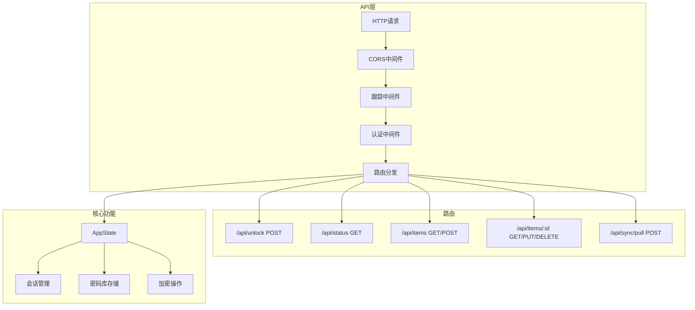
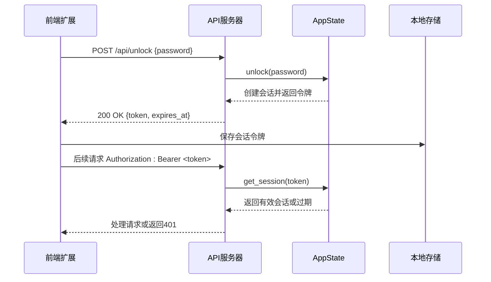
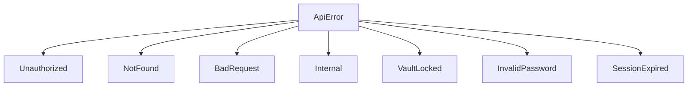
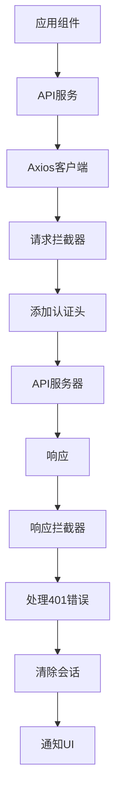
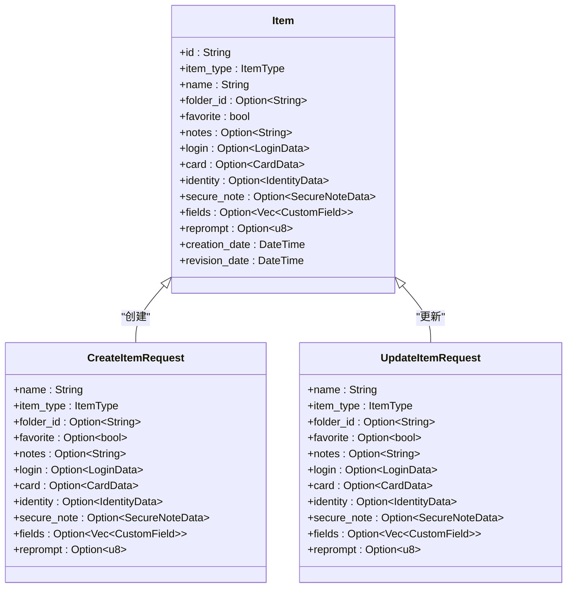
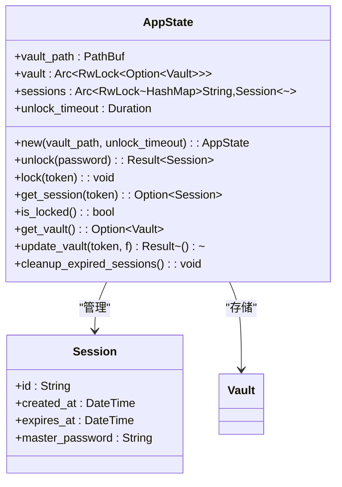

# API文档

<cite>
**本文档中引用的文件**  
- [models.rs](file://api/src/models.rs)
- [state.rs](file://api/src/state.rs)
- [auth.rs](file://api/src/auth.rs)
- [error.rs](file://api/src/error.rs)
- [lib.rs](file://api/src/lib.rs)
- [mod.rs](file://api/src/handlers/mod.rs)
- [client.ts](file://extension/lib/api/client.ts)
- [auth.ts](file://extension/lib/api/auth.ts)
- [entries.ts](file://extension/lib/api/entries.ts)
- [system.ts](file://extension/lib/api/system.ts)
- [index.ts](file://extension/types/index.ts)
- [UnlockForm.tsx](file://extension/components/UnlockForm.tsx)
- [authStore.ts](file://extension/store/authStore.ts)
- [vaultStore.ts](file://extension/store/vaultStore.ts)
</cite>

## 目录
1. [简介](#简介)
2. [API架构概述](#api架构概述)
3. [认证机制](#认证机制)
4. [核心API端点](#核心api端点)
5. [错误处理与状态码](#错误处理与状态码)
6. [前端API客户端使用](#前端api客户端使用)
7. [数据模型](#数据模型)

## 简介

SecureFox API是一个RESTful接口，作为浏览器扩展与核心密码管理功能之间的中间层。API提供对密码库的访问，支持解锁、项目管理、同步和密码生成等核心功能。所有受保护的端点都需要基于会话令牌的认证。

**Section sources**
- [lib.rs](file://api/src/lib.rs#L1-L114)
- [models.rs](file://api/src/models.rs#L1-L171)

## API架构概述

SecureFox API使用Axum框架构建，采用模块化设计，包含处理器、模型、状态管理和错误处理组件。API通过分层路由组织，包含公共认证路由和受保护路由。



**Diagram sources**
- [lib.rs](file://api/src/lib.rs#L25-L114)
- [state.rs](file://api/src/state.rs#L8-L113)

**Section sources**
- [lib.rs](file://api/src/lib.rs#L1-L114)
- [state.rs](file://api/src/state.rs#L1-L113)

## 认证机制

SecureFox API使用基于会话令牌的认证系统。用户通过提供主密码解锁密码库，服务器返回一个会话令牌，该令牌必须在后续请求的Authorization头中以Bearer模式提供。

### 认证流程



**Diagram sources**
- [auth.rs](file://api/src/auth.rs#L10-L37)
- [auth.ts](file://extension/lib/api/auth.ts#L8-L39)
- [models.rs](file://api/src/models.rs#L144-L170)

### 公共与受保护路由

API区分公共路由和受保护路由：

- **公共路由**：不需要认证
  - `/api/unlock` - 解锁密码库
  - `/api/status` - 获取密码库状态
  - `/version` - 获取版本信息
  - `/health` - 健康检查

- **受保护路由**：需要有效的会话令牌
  - 所有 `/api/items` 端点
  - `/api/generate/password` - 密码生成
  - `/api/sync/*` - 同步操作

认证中间件在请求处理前验证令牌，并将有效会话存储在请求扩展中供处理器使用。

**Section sources**
- [auth.rs](file://api/src/auth.rs#L10-L37)
- [lib.rs](file://api/src/lib.rs#L40-L80)
- [client.ts](file://extension/lib/api/client.ts#L14-L39)

## 核心API端点

### /api/unlock (POST)

解锁密码库并创建新会话。

**请求**
- **方法**: POST
- **URL**: `/api/unlock`
- **认证**: 不需要
- **内容类型**: `application/json`

```json
{
  "password": "string"
}
```

**响应 (200 OK)**
```json
{
  "token": "string",
  "expires_at": "string",
  "vault_summary": {
    "item_count": 0,
    "folder_count": 0,
    "last_sync": "string"
  }
}
```

**Section sources**
- [mod.rs](file://api/src/handlers/mod.rs#L9-L26)
- [models.rs](file://api/src/models.rs#L5-L15)
- [auth.ts](file://extension/lib/api/auth.ts#L8-L39)

### /api/status (GET)

获取密码库当前状态。

**请求**
- **方法**: GET
- **URL**: `/api/status`
- **认证**: 不需要

**响应 (200 OK)**
```json
{
  "locked": false,
  "session_valid": true,
  "vault_exists": true
}
```

**Section sources**
- [mod.rs](file://api/src/handlers/mod.rs#L37-L46)
- [models.rs](file://api/src/models.rs#L24-L29)

### /api/items (GET)

获取项目列表，支持过滤。

**请求**
- **方法**: GET
- **URL**: `/api/items`
- **认证**: 需要
- **查询参数**:
  - `folder_id`: 按文件夹ID过滤
  - `search`: 按名称搜索
  - `domain`: 按域名过滤

**响应 (200 OK)**
返回 `Item` 对象数组。

**Section sources**
- [mod.rs](file://api/src/handlers/mod.rs#L62-L77)
- [entries.ts](file://extension/lib/api/entries.ts#L15-L17)

### /api/items (POST)

创建新项目。

**请求**
- **方法**: POST
- **URL**: `/api/items`
- **认证**: 需要
- **内容类型**: `application/json`

```json
{
  "name": "string",
  "type": 1,
  "folder_id": "string",
  "favorite": false,
  "notes": "string",
  "login": {
    "username": "string",
    "password": "string",
    "totp": "string",
    "uris": [
      {
        "uri": "string",
        "match": 0
      }
    ]
  }
}
```

**响应 (200 OK)**
返回创建的 `Item` 对象。

**Section sources**
- [mod.rs](file://api/src/handlers/mod.rs#L79-L195)
- [entries.ts](file://extension/lib/api/entries.ts#L43-L45)

### /api/items/:id (GET)

获取特定项目。

**请求**
- **方法**: GET
- **URL**: `/api/items/{id}`
- **认证**: 需要

**响应 (200 OK)**
返回 `Item` 对象。

**Section sources**
- [mod.rs](file://api/src/handlers/mod.rs#L197-L208)
- [entries.ts](file://extension/lib/api/entries.ts#L36-L38)

### /api/items/:id (PUT)

更新现有项目。

**请求**
- **方法**: PUT
- **URL**: `/api/items/{id}`
- **认证**: 需要
- **内容类型**: `application/json`

使用与创建相同的请求体结构。

**响应 (200 OK)**
返回更新后的 `Item` 对象。

**Section sources**
- [mod.rs](file://api/src/handlers/mod.rs#L210-L256)
- [entries.ts](file://extension/lib/api/entries.ts#L50-L53)

### /api/items/:id (DELETE)

删除项目。

**请求**
- **方法**: DELETE
- **URL**: `/api/items/{id}`
- **认证**: 需要

**响应 (204 No Content)**
无响应体。

**Section sources**
- [mod.rs](file://api/src/handlers/mod.rs#L258-L269)
- [entries.ts](file://extension/lib/api/entries.ts#L58-L60)

### /api/sync/pull (POST)

从远程源拉取同步。

**请求**
- **方法**: POST
- **URL**: `/api/sync/pull`
- **认证**: 需要

**响应 (200 OK)**
```json
{
  "success": true,
  "message": "string",
  "items_synced": 0
}
```

**Section sources**
- [mod.rs](file://api/src/handlers/mod.rs#L361-L367)
- [models.rs](file://api/src/models.rs#L130-L135)

## 错误处理与状态码

API使用标准化的错误响应格式和HTTP状态码。

### 错误响应格式

所有错误响应都遵循以下格式：

```json
{
  "error": "string",
  "message": "string"
}
```

### 状态码映射

| HTTP状态码 | 错误类型 | 描述 |
|-----------|---------|------|
| 400 | `BadRequest` | 请求格式无效或缺少必需字段 |
| 401 | `Unauthorized` | 未提供认证或凭证无效 |
| 403 | `VaultLocked` | 密码库已锁定，无法访问 |
| 404 | `NotFound` | 请求的资源不存在 |
| 419 | `SessionExpired` | 会话已过期 |
| 500 | `InternalError` | 服务器内部错误 |

### 错误类型



**Diagram sources**
- [error.rs](file://api/src/error.rs#L11-L33)
- [models.rs](file://api/src/models.rs#L144-L170)

**Section sources**
- [error.rs](file://api/src/error.rs#L1-L74)

## 前端API客户端使用

前端扩展使用TypeScript客户端与API交互，提供类型安全的API调用。

### API客户端架构



**Diagram sources**
- [client.ts](file://extension/lib/api/client.ts#L1-L77)
- [auth.ts](file://extension/lib/api/auth.ts#L44-L58)

### 客户端实现

API客户端使用Axios库，包含请求和响应拦截器：

- **请求拦截器**: 自动从会话存储中添加Bearer令牌
- **响应拦截器**: 处理401错误，清除本地会话并通知UI

```typescript
// 示例：解锁调用
const response = await apiCall<any>(
  'post',
  API_ENDPOINTS.UNLOCK,
  { password } as UnlockRequest
);
```

客户端提供类型化的API方法，如 `unlock()`, `getEntries()`, `createEntry()` 等，封装了底层HTTP调用。

**Section sources**
- [client.ts](file://extension/lib/api/client.ts#L1-L98)
- [auth.ts](file://extension/lib/api/auth.ts#L1-L145)
- [entries.ts](file://extension/lib/api/entries.ts#L1-L152)

## 数据模型

### 核心模型

```mermaid
classDiagram
class UnlockRequest {
+password : string
}
class UnlockResponse {
+token : string
+expires_at : DateTime
+vault_summary : VaultSummary
}
class VaultSummary {
+item_count : usize
+folder_count : usize
+last_sync : Option~DateTime~
}
class StatusResponse {
+locked : bool
+session_valid : bool
+vault_exists : bool
}
class Session {
+id : String
+created_at : DateTime
+expires_at : DateTime
+master_password : String
+new(master_password, timeout) : Session
+is_expired() : bool
+refresh(timeout) : void
}
class VersionResponse {
+version : String
+build_time : Option~String~
+git_commit : Option~String~
}
class SyncResponse {
+success : bool
+message : String
+items_synced : usize
}
UnlockRequest --> UnlockResponse : "解锁返回"
UnlockResponse --> VaultSummary : "包含"
Session --> UnlockResponse : "生成"
VersionResponse --> "/version" : "响应"
SyncResponse --> "/sync/*" : "响应"
```

**Diagram sources**
- [models.rs](file://api/src/models.rs#L5-L142)
- [index.ts](file://extension/types/index.ts#L99-L111)

### 项目模型



**Diagram sources**
- [models.rs](file://api/src/models.rs#L66-L128)
- [index.ts](file://extension/types/index.ts#L37-L96)

### 应用状态模型



**Diagram sources**
- [state.rs](file://api/src/state.rs#L8-L113)
- [models.rs](file://api/src/models.rs#L144-L170)