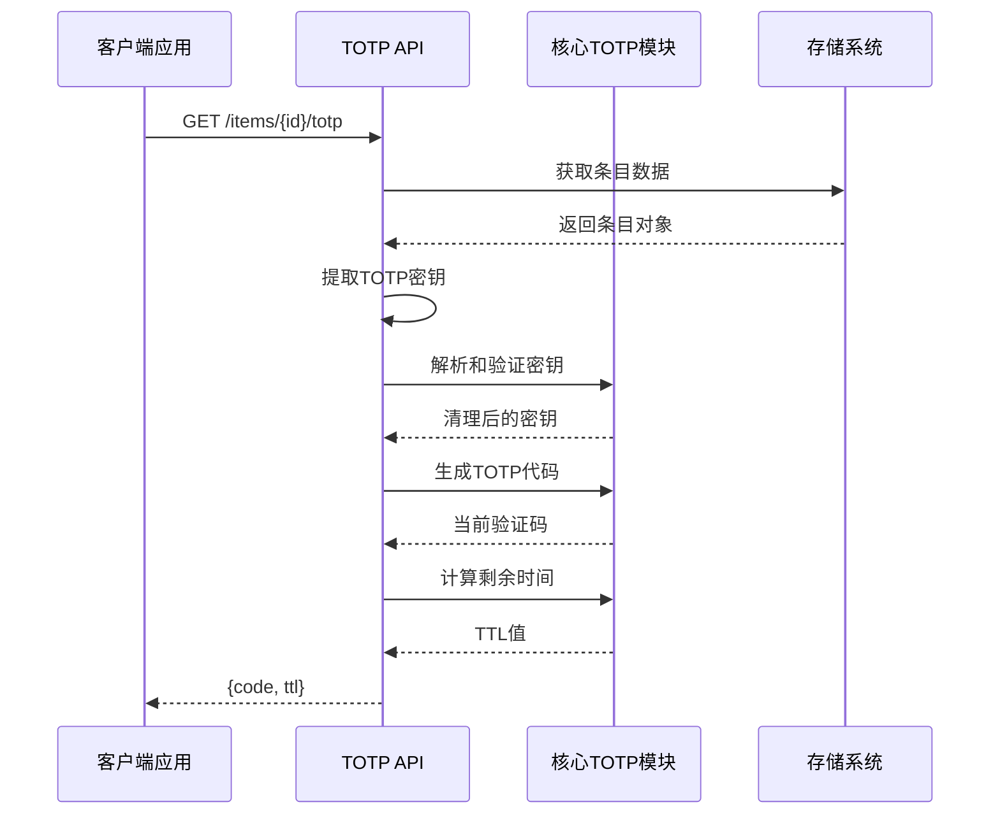
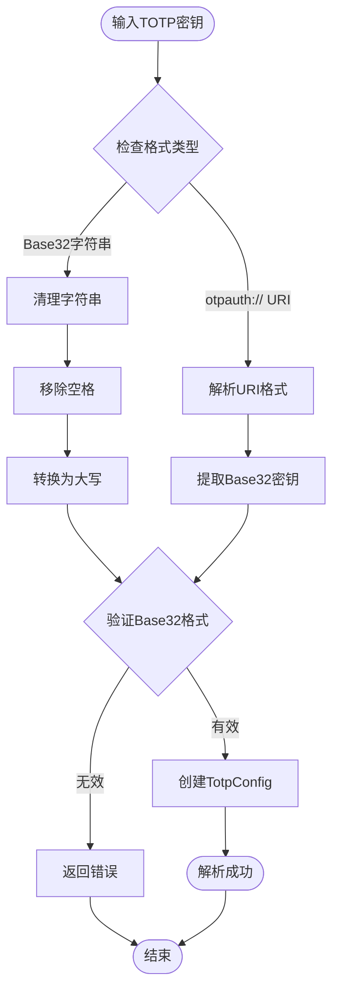
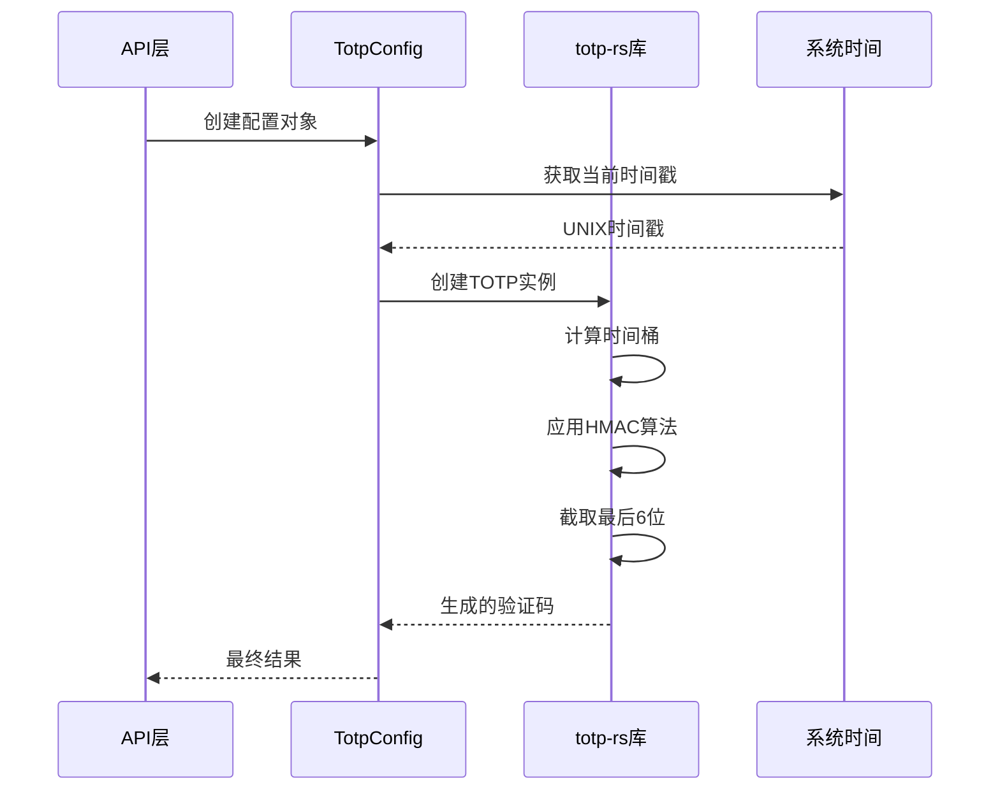
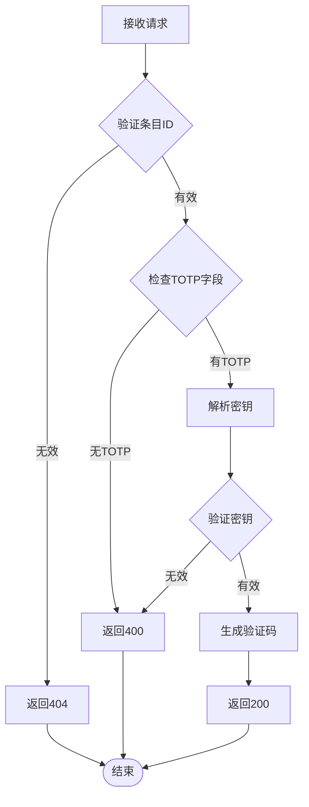

# TOTP API 文档

<cite>
**本文档中引用的文件**
- [api/src/handlers/mod.rs](file://api/src/handlers/mod.rs)
- [api/src/models.rs](file://api/src/models.rs)
- [api/src/error.rs](file://api/src/error.rs)
- [core/src/totp.rs](file://core/src/totp.rs)
- [core/src/models.rs](file://core/src/models.rs)
- [core/src/errors.rs](file://core/src/errors.rs)
- [extension/components/TOTPCode.tsx](file://extension/components/TOTPCode.tsx)
- [extension/lib/api/entries.ts](file://extension/lib/api/entries.ts)
- [extension/entrypoints/content.ts](file://extension/entrypoints/content.ts)
- [api/src/lib.rs](file://api/src/lib.rs)
</cite>

## 目录
1. [简介](#简介)
2. [API端点概述](#api端点概述)
3. [端点详细说明](#端点详细说明)
4. [数据结构](#数据结构)
5. [实现原理](#实现原理)
6. [错误处理](#错误处理)
7. [前端集成](#前端集成)
8. [性能考虑](#性能考虑)
9. [使用示例](#使用示例)
10. [故障排除](#故障排除)

## 简介

TOTP（基于时间的一次性密码）API为SecureFox密码管理器提供了动态验证码生成功能。该API允许用户通过条目ID获取基于时间的临时验证码，用于双因素认证（2FA）场景。API支持多种TOTP密钥格式，包括标准的otpauth:// URI格式和Base32编码的密钥字符串。

## API端点概述

TOTP API的核心端点是：
- **GET** `/items/{id}/totp` - 根据条目ID获取动态验证码

该端点返回一个包含当前TOTP验证码和剩余生存时间的响应对象。



**图表来源**
- [api/src/handlers/mod.rs](file://api/src/handlers/mod.rs#L388-L409)
- [core/src/totp.rs](file://core/src/totp.rs#L48-L73)

## 端点详细说明

### GET /items/{id}/totp

根据指定的条目ID获取动态验证码。

#### 请求参数

| 参数名 | 类型 | 必需 | 描述 |
|--------|------|------|------|
| id | string | 是 | 条目的唯一标识符（UUID格式） |

#### 响应格式

成功时返回 `application/json` 响应：

```json
{
  "code": "123456",
  "ttl": 25
}
```

#### 响应字段

| 字段名 | 类型 | 描述 |
|--------|------|------|
| code | string | 6位数字的TOTP验证码 |
| ttl | integer | 剩余生存时间（秒），范围：1-30 |

#### 状态码

| 状态码 | 描述 |
|--------|------|
| 200 OK | 成功获取TOTP验证码 |
| 400 Bad Request | 条目不存在或未配置TOTP |
| 401 Unauthorized | 未授权访问 |
| 404 Not Found | 条目ID不存在 |
| 500 Internal Server Error | 内部服务器错误 |

**节来源**
- [api/src/handlers/mod.rs](file://api/src/handlers/mod.rs#L388-L409)
- [api/src/models.rs](file://api/src/models.rs#L54-L57)

## 数据结构

### TotpResponse 结构

TOTP API的响应数据结构定义如下：

```rust
#[derive(Debug, Serialize, Deserialize)]
pub struct TotpResponse {
    pub code: String,    // 6位数字的TOTP验证码
    pub ttl: u64,        // 剩余生存时间（秒）
}
```

### LoginData 中的 TOTP 字段

TOTP密钥存储在条目的登录数据中：

```rust
#[derive(Debug, Clone, Default, Serialize, Deserialize)]
pub struct LoginData {
    // 其他字段...
    #[serde(skip_serializing_if = "Option::is_none")]
    pub totp: Option<String>, // otpauth://totp/... 格式
}
```

### TotpConfig 配置结构

核心TOTP模块使用的配置结构：

```rust
pub struct TotpConfig {
    pub secret: String,           // Base32编码的密钥
    pub issuer: Option<String>,   // 发行者名称
    pub account_name: Option<String>, // 账户名称
    pub algorithm: Algorithm,     // 哈希算法（默认SHA1）
    pub digits: usize,           // 数字位数（默认6位）
    pub period: u64,            // 时间周期（默认30秒）
}
```

**节来源**
- [api/src/models.rs](file://api/src/models.rs#L54-L57)
- [core/src/models.rs](file://core/src/models.rs#L167-L175)
- [core/src/totp.rs](file://core/src/totp.rs#L8-L16)

## 实现原理

### TOTP 密钥解析

API支持多种TOTP密钥格式的解析：



**图表来源**
- [core/src/totp.rs](file://core/src/totp.rs#L119-L142)

### TOTP 代码生成流程



**图表来源**
- [core/src/totp.rs](file://core/src/totp.rs#L48-L57)

### 核心算法实现

TOTP算法的核心实现包括以下步骤：

1. **时间同步**：使用系统时间计算当前的时间桶
2. **密钥解码**：将Base32密钥解码为二进制格式
3. **HMAC计算**：使用HMAC-SHA1算法生成哈希值
4. **动态截取**：从哈希值中动态截取6位数字

**节来源**
- [core/src/totp.rs](file://core/src/totp.rs#L48-L73)

## 错误处理

### 可能的错误场景

| 错误类型 | HTTP状态码 | 错误消息 | 原因 |
|----------|------------|----------|------|
| 条目不存在 | 404 | "Item not found" | 提供的条目ID无效 |
| 未配置TOTP | 400 | "Item has no TOTP" | 条目缺少TOTP配置 |
| 无效密钥 | 400 | "Invalid TOTP secret" | TOTP密钥格式错误 |
| 系统时间错误 | 500 | "System time error" | 系统时间获取失败 |

### 错误处理流程



**图表来源**
- [api/src/handlers/mod.rs](file://api/src/handlers/mod.rs#L391-L401)
- [api/src/error.rs](file://api/src/error.rs#L60-L73)

### 错误响应格式

所有错误都遵循统一的响应格式：

```json
{
  "error": "Bad request",
  "message": "Item has no TOTP"
}
```

**节来源**
- [api/src/error.rs](file://api/src/error.rs#L11-L73)
- [core/src/errors.rs](file://core/src/errors.rs#L30-L31)

## 前端集成

### React 组件实现

前端使用React组件来显示和管理TOTP验证码：

```typescript
interface TOTPCodeProps {
    entryId: string;      // 条目ID
    onCopy?: () => void;  // 复制回调
}
```

组件的核心功能包括：

1. **自动刷新**：每秒更新验证码显示
2. **倒计时进度**：显示剩余生存时间
3. **错误处理**：优雅处理API错误
4. **用户体验**：提供复制功能

### 前端调用示例

```typescript
// 在密码条目详情页中使用
export const TOTPCode: React.FC<TOTPCodeProps> = ({entryId, onCopy}) => {
    const [code, setCode] = useState('------');
    const [timeLeft, setTimeLeft] = useState(30);
    const [progress, setProgress] = useState(100);
    const [error, setError] = useState<string | null>(null);

    useEffect(() => {
        const fetchTOTP = async () => {
            try {
                const response = await getTOTP(entryId);
                setCode(response.code);
                setTimeLeft(response.ttl);
                setProgress((response.ttl / 30) * 100);
                setError(null);
            } catch (err) {
                console.error('Failed to fetch TOTP:', err);
                setError('Failed to load');
                setCode('------');
            }
        };

        // 立即获取一次
        fetchTOTP();

        // 每秒更新
        const interval = setInterval(() => {
            setTimeLeft(prev => {
                if (prev <= 1) {
                    fetchTOTP();
                    return 30;
                }
                return prev - 1;
            });
        }, 1000);

        return () => clearInterval(interval);
    }, [entryId]);
}
```

### 浏览器扩展集成

浏览器扩展通过内容脚本自动填充TOTP验证码：

```javascript
// 自动填充TOTP字段
const totpSelectors = [
    'input[type="text"][maxlength="6"]',
    'input[type="password"][maxlength="6"]',
    'input[maxlength="6"]'
];

// 尝试填充到第一个可用的6位输入框
let filled = false;
for (const selector of totpSelectors) {
    const field = document.querySelector(selector);
    if (field && !field.disabled && field.value === '') {
        field.value = response.code;
        field.dispatchEvent(new Event('input', {bubbles: true}));
        field.dispatchEvent(new Event('change', {bubbles: true}));
        filled = true;
        break;
    }
}

// 如果没有找到输入框，复制到剪贴板
if (!filled) {
    navigator.clipboard.writeText(response.code);
    showNotification(`双因素验证码已复制: ${response.code}`);
}
```

**节来源**
- [extension/components/TOTPCode.tsx](file://extension/components/TOTPCode.tsx#L1-L67)
- [extension/lib/api/entries.ts](file://extension/lib/api/entries.ts#L65-L67)
- [extension/entrypoints/content.ts](file://extension/entrypoints/content.ts#L239-L264)

## 性能考虑

### 缓存策略

虽然当前实现没有显式的缓存机制，但可以考虑以下优化策略：

1. **客户端缓存**：前端组件缓存最近的TOTP代码
2. **智能刷新**：仅在接近过期时才重新获取
3. **批量请求**：对于多个条目，考虑批量获取

### 请求频率限制

为了防止滥用，建议实施以下限制：

| 限制类型 | 建议值 | 实现方式 |
|----------|--------|----------|
| 单用户频率 | 1次/秒 | 令牌桶算法 |
| 单IP频率 | 10次/分钟 | IP级限流 |
| 整体负载 | 1000 QPS | 全局限流 |

### 性能优化建议

1. **异步处理**：确保TOTP生成是异步的，避免阻塞主线程
2. **内存管理**：及时清理不再需要的TOTP配置对象
3. **网络优化**：使用HTTP/2和连接池减少延迟

### 时间同步考虑

TOTP对时间同步要求较高，建议：

1. **本地时间校验**：验证系统时间与NTP服务器同步
2. **容错机制**：允许±30秒的时间偏差
3. **降级策略**：在网络不可用时提供本地缓存

**节来源**
- [core/src/totp.rs](file://core/src/totp.rs#L65-L73)

## 使用示例

### 后端API调用

```rust
// 在Rust后端中调用TOTP API
async fn get_totp_for_entry(entry_id: &str) -> Result<TotpResponse, ApiError> {
    // 构建请求URL
    let url = format!("{}/items/{}/totp", API_BASE_URL, entry_id);
    
    // 发送HTTP GET请求
    let response = reqwest::get(&url)
        .await
        .map_err(|_| ApiError::Internal("Failed to connect to API".to_string()))?;
    
    // 检查响应状态
    if response.status().is_success() {
        // 解析JSON响应
        let totp_response: TotpResponse = response
            .json()
            .await
            .map_err(|_| ApiError::Internal("Failed to parse response".to_string()))?;
        
        Ok(totp_response)
    } else {
        // 处理错误响应
        let error_body = response.text().await.unwrap_or_default();
        Err(ApiError::BadRequest(error_body))
    }
}
```

### 前端JavaScript调用

```javascript
// 使用fetch API调用TOTP端点
async function getTOTPCode(entryId) {
    try {
        const response = await fetch(`/api/items/${entryId}/totp`);
        
        if (!response.ok) {
            throw new Error(`HTTP error! status: ${response.status}`);
        }
        
        const totpData = await response.json();
        return totpData;
    } catch (error) {
        console.error('Error fetching TOTP:', error);
        throw error;
    }
}

// 使用示例
getTOTPCode('123e4567-e89b-12d3-a456-426614174000')
    .then(data => {
        console.log('TOTP Code:', data.code);
        console.log('Time Left:', data.ttl, 'seconds');
    })
    .catch(error => {
        console.error('Failed to get TOTP:', error);
    });
```

### curl 命令示例

```bash
# 获取特定条目的TOTP验证码
curl -X GET "https://api.securefox.com/items/123e4567-e89b-12d3-a456-426614174000/totp" \
     -H "Authorization: Bearer YOUR_TOKEN" \
     -H "Content-Type: application/json"

# 响应示例
{
  "code": "123456",
  "ttl": 25
}
```

## 故障排除

### 常见问题及解决方案

#### 1. "Item has no TOTP" 错误

**原因**：条目未配置TOTP密钥
**解决方案**：
- 检查条目的TOTP字段是否为空
- 确认条目类型为登录类型
- 验证TOTP密钥格式是否正确

#### 2. "Invalid TOTP secret" 错误

**原因**：TOTP密钥格式不正确
**解决方案**：
- 检查密钥是否为有效的Base32格式
- 验证是否包含非法字符
- 确认密钥长度符合要求

#### 3. 验证码始终相同

**原因**：时间窗口设置问题
**解决方案**：
- 检查系统时间是否正确同步
- 验证TOTP时间周期设置
- 确认客户端和服务端时间一致

#### 4. API响应超时

**原因**：网络连接或服务器负载问题
**解决方案**：
- 检查网络连接稳定性
- 实施重试机制
- 监控服务器性能指标

### 调试技巧

1. **启用详细日志**：在开发环境中启用调试日志
2. **时间同步验证**：使用时间同步工具验证系统时间
3. **密钥格式测试**：使用单元测试验证密钥解析逻辑
4. **网络监控**：监控API响应时间和错误率

### 监控指标

建议监控以下关键指标：

| 指标名称 | 描述 | 告警阈值 |
|----------|------|----------|
| TOTP请求成功率 | 成功响应占总请求的比例 | < 99% |
| 平均响应时间 | API响应的平均耗时 | > 200ms |
| 错误率分布 | 不同错误类型的占比 | 异常增长 |
| 时间同步偏差 | 系统时间与标准时间的偏差 | > 30秒 |

**节来源**
- [api/src/handlers/mod.rs](file://api/src/handlers/mod.rs#L391-L401)
- [core/src/totp.rs](file://core/src/totp.rs#L119-L142)