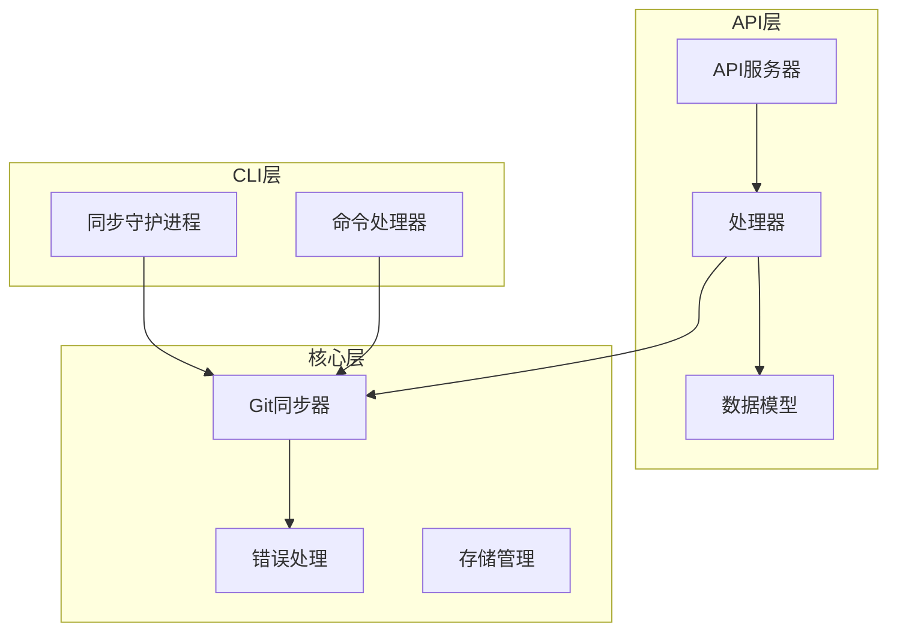
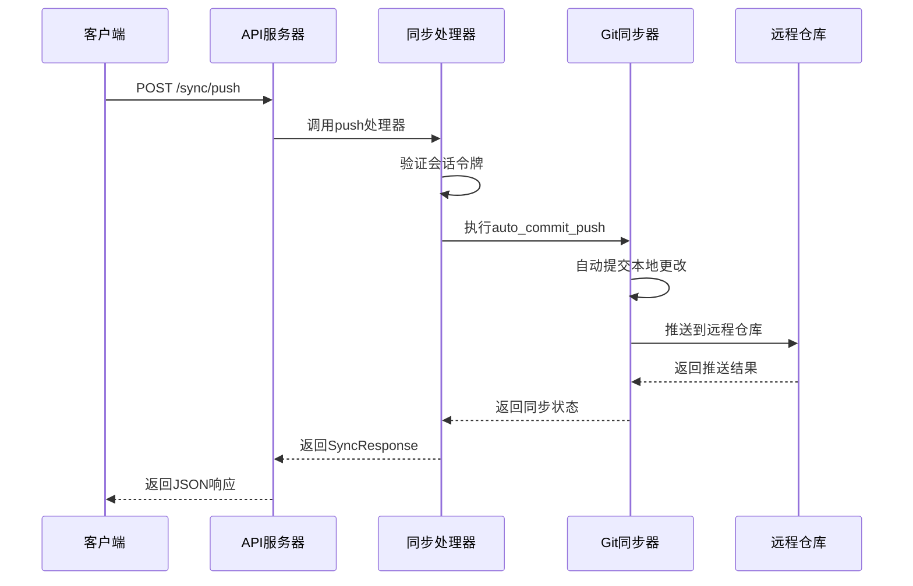
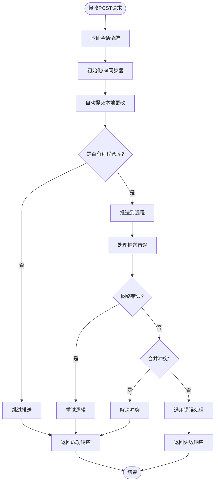
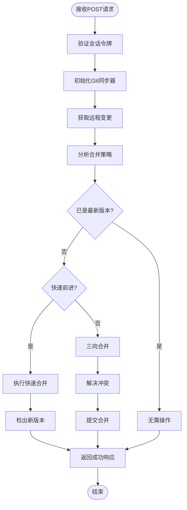
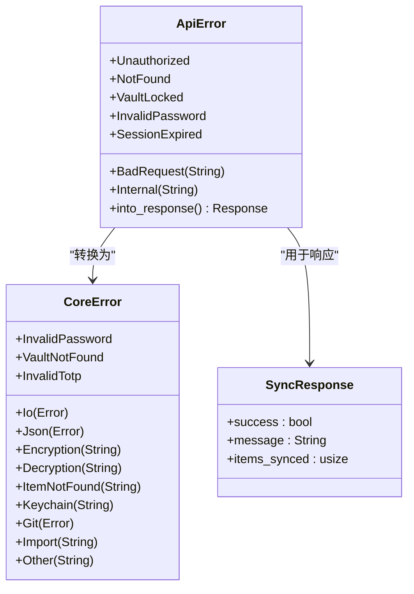
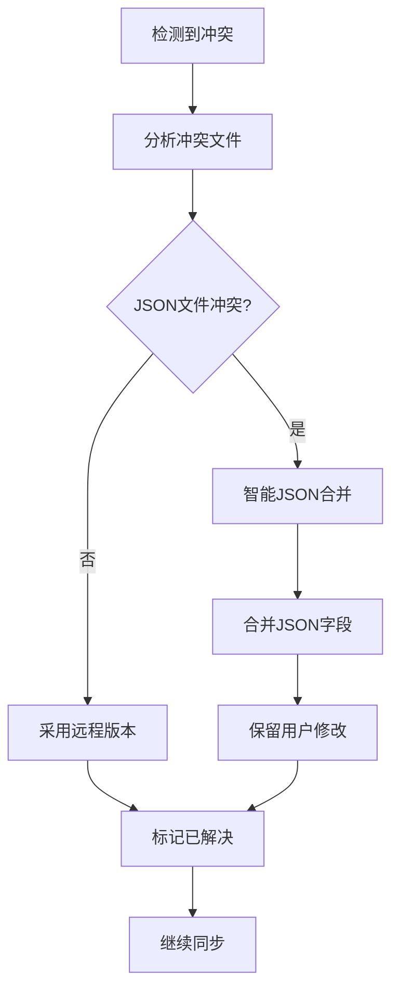
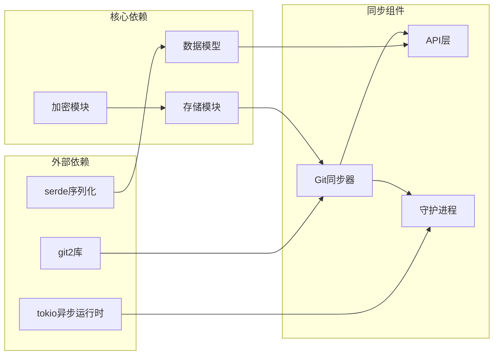
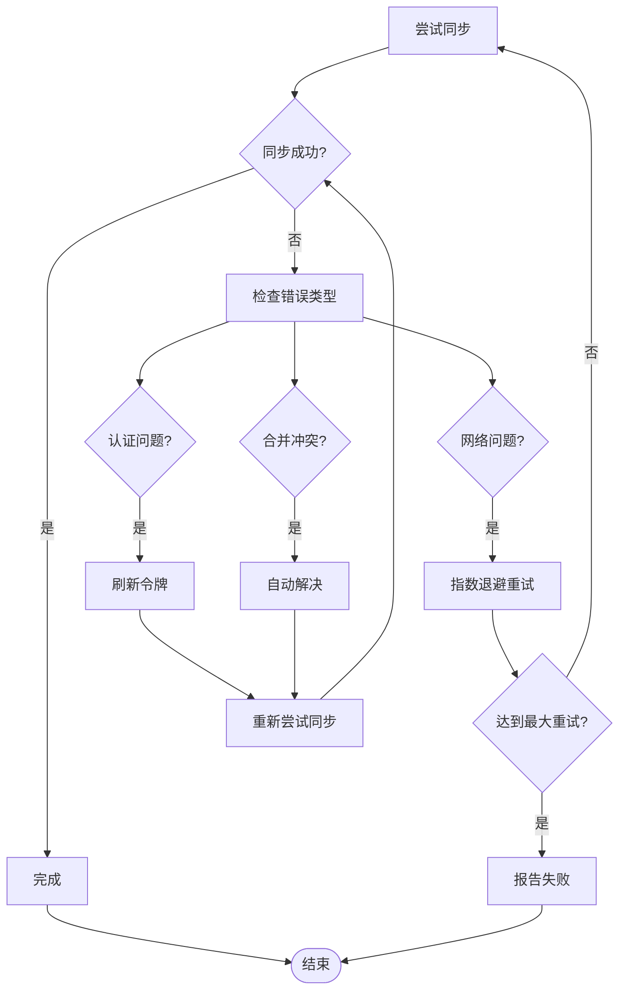

# 同步API

<cite>
**本文档中引用的文件**
- [api/src/lib.rs](file://api/src/lib.rs)
- [api/src/models.rs](file://api/src/models.rs)
- [api/src/handlers/mod.rs](file://api/src/handlers/mod.rs)
- [api/src/error.rs](file://api/src/error.rs)
- [api/src/state.rs](file://api/src/state.rs)
- [core/src/git_sync.rs](file://core/src/git_sync.rs)
- [core/src/errors.rs](file://core/src/errors.rs)
- [cli/src/sync_daemon.rs](file://cli/src/sync_daemon.rs)
- [cli/src/main.rs](file://cli/src/main.rs)
</cite>

## 目录
1. [简介](#简介)
2. [项目结构](#项目结构)
3. [核心组件](#核心组件)
4. [架构概览](#架构概览)
5. [详细组件分析](#详细组件分析)
6. [依赖关系分析](#依赖关系分析)
7. [性能考虑](#性能考虑)
8. [故障排除指南](#故障排除指南)
9. [结论](#结论)

## 简介

SecureFox同步API提供了强大的版本控制功能，通过Git协议实现密码库的自动同步。该系统支持双向同步（推拉），能够处理网络问题、合并冲突，并提供完善的错误处理机制。同步功能基于RESTful API设计，要求有效的会话令牌进行身份验证。

## 项目结构

SecureFox同步功能分布在多个模块中，形成了清晰的分层架构：

**图表来源**
- [api/src/lib.rs](file://api/src/lib.rs#L64-L65)
- [core/src/git_sync.rs](file://core/src/git_sync.rs#L1-L50)
- [cli/src/sync_daemon.rs](file://cli/src/sync_daemon.rs#L1-L20)

**章节来源**
- [api/src/lib.rs](file://api/src/lib.rs#L1-L141)
- [core/src/git_sync.rs](file://core/src/git_sync.rs#L1-L50)

## 核心组件

### 同步响应模型

SyncResponse是同步操作的标准响应格式，包含以下关键字段：

| 字段名 | 类型 | 描述 | 示例值 |
|--------|------|------|--------|
| success | bool | 操作是否成功完成 | true/false |
| message | String | 操作结果的描述性消息 | "Sync completed" |
| items_synced | usize | 同步过程中处理的项目数量 | 0-1000+ |

### 认证与会话管理

所有同步API端点都需要有效的会话令牌进行身份验证。系统使用基于令牌的会话管理机制，确保只有授权用户可以执行同步操作。

**章节来源**
- [api/src/models.rs](file://api/src/models.rs#L131-L135)
- [api/src/state.rs](file://api/src/state.rs#L53-L67)

## 架构概览

同步系统采用分层架构设计，从API接口到底层Git操作形成完整的处理链：

**图表来源**
- [api/src/handlers/mod.rs](file://api/src/handlers/mod.rs#L352-L367)
- [core/src/git_sync.rs](file://core/src/git_sync.rs#L212-L220)

## 详细组件分析

### 同步端点实现

#### `/sync/push` 端点

Push端点负责将本地更改推送到远程仓库：

**图表来源**
- [core/src/git_sync.rs](file://core/src/git_sync.rs#L133-L165)
- [api/src/handlers/mod.rs](file://api/src/handlers/mod.rs#L352-L358)

#### `/sync/pull` 端点

Pull端点从远程仓库获取最新更改：

**图表来源**
- [core/src/git_sync.rs](file://core/src/git_sync.rs#L167-L209)
- [api/src/handlers/mod.rs](file://api/src/handlers/mod.rs#L361-L367)

### 错误处理机制

系统实现了多层次的错误处理机制：

**图表来源**
- [api/src/error.rs](file://api/src/error.rs#L11-L32)
- [core/src/errors.rs](file://core/src/errors.rs#L7-L45)

### 同步状态轮询

系统支持多种同步模式，包括手动和自动模式：

| 模式类型 | 描述 | 适用场景 | 轮询间隔 |
|----------|------|----------|----------|
| Manual | 手动触发同步 | 用户主动操作 | 不适用 |
| Auto | 自动同步模式 | 定期自动拉取，变更时推送 | 可配置间隔 |

**章节来源**
- [api/src/error.rs](file://api/src/error.rs#L1-L74)
- [core/src/errors.rs](file://core/src/errors.rs#L1-L46)

### 冲突解决策略

当检测到合并冲突时，系统采用智能冲突解决策略：

**图表来源**
- [core/src/git_sync.rs](file://core/src/git_sync.rs#L274-L291)

**章节来源**
- [core/src/git_sync.rs](file://core/src/git_sync.rs#L167-L318)

## 依赖关系分析

同步系统的依赖关系展现了清晰的分层结构：

**图表来源**
- [Cargo.toml](file://Cargo.toml)
- [core/src/git_sync.rs](file://core/src/git_sync.rs#L1-L10)

**章节来源**
- [api/src/lib.rs](file://api/src/lib.rs#L1-L20)
- [core/src/git_sync.rs](file://core/src/git_sync.rs#L1-L10)

## 性能考虑

### 同步性能优化

1. **增量同步**: 只同步发生变化的数据项
2. **并发处理**: 使用tokio异步运行时处理网络操作
3. **缓存机制**: 内存中缓存会话信息，减少磁盘访问
4. **智能合并**: 对JSON文件进行智能合并而非简单覆盖

### 网络优化

- 支持SSH密钥认证和用户名密码认证
- 自动处理未知主机密钥
- 实现重试机制处理临时网络故障

## 故障排除指南

### 常见同步问题

#### 网络连接问题
- **症状**: 同步超时或连接失败
- **解决方案**: 检查网络连接，验证远程仓库URL
- **最佳实践**: 实现指数退避重试策略

#### 认证失败
- **症状**: 401未授权错误
- **解决方案**: 验证会话令牌有效性，重新登录
- **预防措施**: 设置合理的会话超时时间

#### 合并冲突
- **症状**: 同步失败，提示冲突
- **解决方案**: 系统自动采用远程版本，用户可手动解决
- **预防措施**: 定期同步避免长时间不一致

### 重试逻辑建议

**章节来源**
- [api/src/error.rs](file://api/src/error.rs#L47-L73)
- [core/src/errors.rs](file://core/src/errors.rs#L36-L45)

## 结论

SecureFox同步API提供了完整而健壮的版本控制解决方案。通过RESTful设计、完善的错误处理和智能冲突解决机制，系统能够可靠地维护密码库的一致性。支持的手动和自动同步模式满足了不同用户的需求，而基于会话令牌的安全机制确保了操作的安全性。

系统的关键优势包括：
- 分层架构设计，职责清晰
- 强大的错误处理和重试机制
- 智能冲突解决策略
- 多种认证方式支持
- 灵活的同步模式配置

未来的改进方向可能包括更智能的冲突解决算法、增量同步优化以及更详细的同步状态报告。