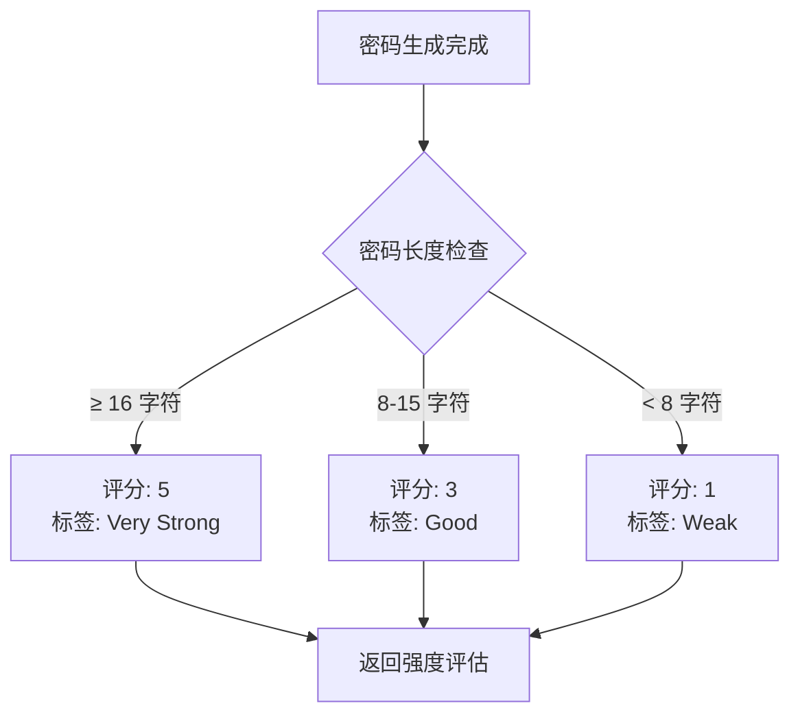
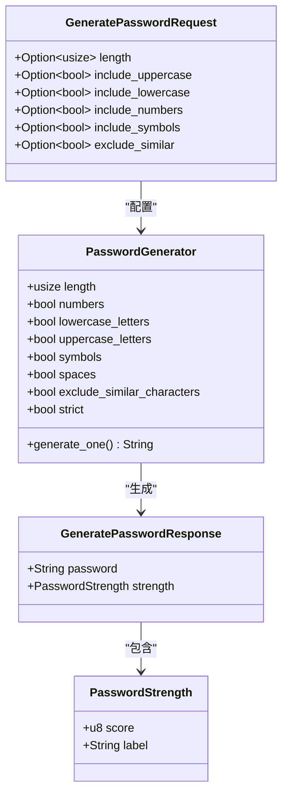
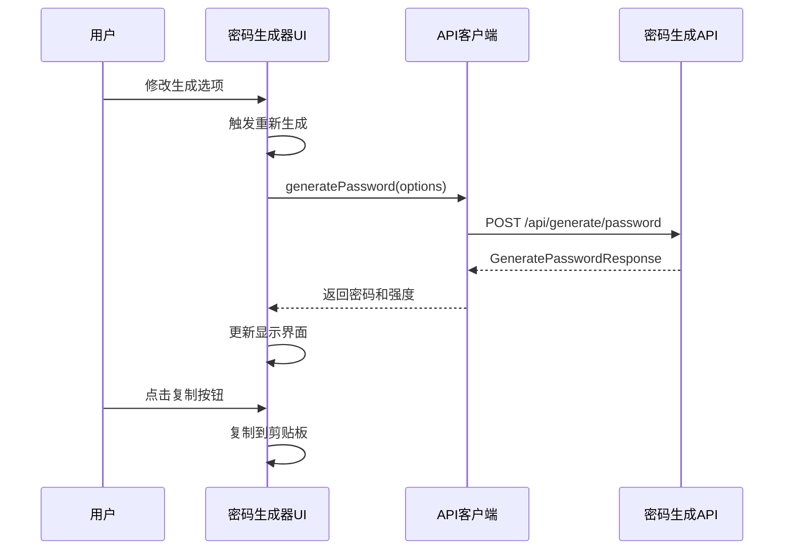
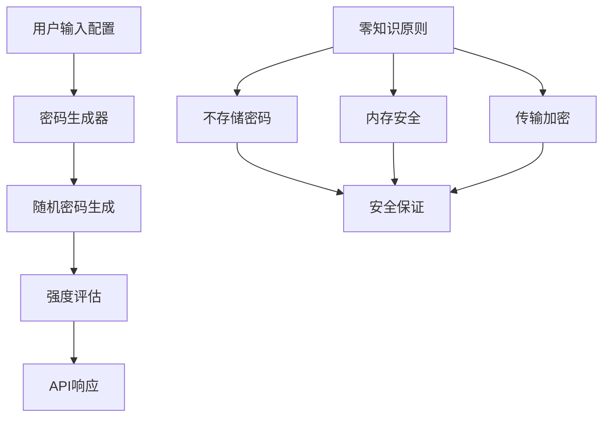

# 密码生成API

<cite>
**本文档中引用的文件**
- [models.rs](file://api/src/models.rs)
- [mod.rs](file://api/src/handlers/mod.rs)
- [entries.ts](file://extension/lib/api/entries.ts)
- [PasswordGenerator.tsx](file://extension/components/PasswordGenerator.tsx)
- [constants.ts](file://extension/utils/constants.ts)
- [lib.rs](file://api/src/lib.rs)
- [crypto.rs](file://core/src/crypto.rs)
- [README.md](file://README.md)
</cite>

## 目录
1. [简介](#简介)
2. [API端点概述](#api端点概述)
3. [请求参数详解](#请求参数详解)
4. [响应结构分析](#响应结构分析)
5. [密码强度评估机制](#密码强度评估机制)
6. [后端实现架构](#后端实现架构)
7. [前端集成指南](#前端集成指南)
8. [安全考虑](#安全考虑)
9. [使用示例](#使用示例)
10. [故障排除](#故障排除)

## 简介

SecureFox密码生成API提供了强大的密码生成功能，支持自定义配置的随机密码生成。该API基于`passwords`库实现，能够根据用户指定的复杂度要求生成高质量的密码，并提供实时的密码强度评估。

### 核心特性
- **灵活的配置选项**：支持长度、字符类型和排除规则的自定义
- **智能强度评估**：基于密码长度和复杂度的动态评分系统
- **零知识设计**：生成的密码不会被记录或存储
- **跨平台兼容**：支持Web浏览器扩展和CLI工具

## API端点概述

### 端点信息

| 属性 | 值 |
|------|-----|
| **HTTP方法** | POST |
| **端点路径** | `/api/generate/password` |
| **内容类型** | `application/json` |
| **认证要求** | 需要有效的会话令牌 |

### 请求URL格式

```http
POST http://localhost:8787/api/generate/password
Content-Type: application/json
Authorization: Bearer <session_token>
```

**节来源**
- [lib.rs](file://api/src/lib.rs#L59-L62)

## 请求参数详解

### GeneratePasswordRequest 结构

密码生成API接受以下可选配置参数：

| 参数名 | 类型 | 默认值 | 描述 | 取值范围 |
|--------|------|--------|------|----------|
| `length` | `Option<usize>` | `16` | 密码长度 | `8-128` 字符 |
| `include_uppercase` | `Option<bool>` | `true` | 是否包含大写字母 | `true/false` |
| `include_lowercase` | `Option<bool>` | `true` | 是否包含小写字母 | `true/false` |
| `include_numbers` | `Option<bool>` | `true` | 是否包含数字 | `true/false` |
| `include_symbols` | `Option<bool>` | `true` | 是否包含特殊符号 | `true/false` |
| `exclude_similar` | `Option<bool>` | `true` | 是否排除相似字符 | `true/false` |

### 字符集配置说明

- **大写字母**：`A-Z`
- **小写字母**：`a-z`
- **数字**：`0-9`
- **特殊符号**：`!@#$%^&*()_+-=[]{}|;':",./<>?`
- **排除相似字符**：默认排除 `iIl1Lo0O` 等易混淆字符

**节来源**
- [models.rs](file://api/src/models.rs#L32-L38)
- [mod.rs](file://api/src/handlers/mod.rs#L285-L294)

## 响应结构分析

### GeneratePasswordResponse 结构

API返回包含生成密码和强度评估的完整响应：

```typescript
interface GeneratePasswordResponse {
    password: string;           // 生成的密码字符串
    strength: PasswordStrength; // 密码强度评估
}
```

### PasswordStrength 结构

| 字段 | 类型 | 描述 |
|------|------|------|
| `score` | `u8` | 强度评分（0-5） |
| `label` | `String` | 强度标签描述 |

**节来源**
- [models.rs](file://api/src/models.rs#L41-L51)

## 密码强度评估机制

### 评分标准

SecureFox采用基于密码长度的简单但有效的强度评估算法：



**图表来源**
- [mod.rs](file://api/src/handlers/mod.rs#L296-L313)

### 强度等级映射

| 分数 | 标签 | 描述 | 推荐用途 |
|------|------|------|----------|
| `5` | Very Strong | 非常强 | 敏感账户、金融系统 |
| `4` | Strong | 强 | 重要账户、企业系统 |
| `3` | Good | 良好 | 一般账户、个人用途 |
| `2` | Fair | 中等 | 临时账户、测试环境 |
| `1` | Weak | 弱 | 不推荐使用 |
| `0` | Very Weak | 非常弱 | 不推荐使用 |

**节来源**
- [mod.rs](file://api/src/handlers/mod.rs#L303-L312)

## 后端实现架构

### 核心组件关系



**图表来源**
- [models.rs](file://api/src/models.rs#L32-L51)
- [mod.rs](file://api/src/handlers/mod.rs#L273-L315)

### 实现细节

后端使用`passwords`库的`PasswordGenerator`结构体实现密码生成：

```rust
let pg = PasswordGenerator {
    length: req.length.unwrap_or(16),
    numbers: req.include_numbers.unwrap_or(true),
    lowercase_letters: req.include_lowercase.unwrap_or(true),
    uppercase_letters: req.include_uppercase.unwrap_or(true),
    symbols: req.include_symbols.unwrap_or(true),
    spaces: false,
    exclude_similar_characters: req.exclude_similar.unwrap_or(true),
    strict: true,
};
```

**节来源**
- [mod.rs](file://api/src/handlers/mod.rs#L285-L294)

## 前端集成指南

### 浏览器扩展集成

SecureFox浏览器扩展提供了完整的密码生成器组件，支持实时预览和配置：



**图表来源**
- [PasswordGenerator.tsx](file://extension/components/PasswordGenerator.tsx#L39-L58)
- [entries.ts](file://extension/lib/api/entries.ts#L101-L109)

### 配置选项管理

前端使用统一的默认配置常量：

| 配置项 | 默认值 | 最小值 | 最大值 |
|--------|--------|--------|--------|
| `LENGTH` | `16` | `8` | `128` |
| `USE_UPPERCASE` | `true` | - | - |
| `USE_LOWERCASE` | `true` | - | - |
| `USE_NUMBERS` | `true` | - | - |
| `USE_SYMBOLS` | `true` | - | - |

**节来源**
- [constants.ts](file://extension/utils/constants.ts#L44-L53)

### 添加/编辑条目集成

在添加或编辑登录条目时，密码生成器可以直接集成到表单中：

```typescript
// 在AddItemModal或EditItemModal中使用
const handleGeneratePassword = async () => {
    try {
        const response = await generatePassword({
            length: options.length,
            include_uppercase: options.useUppercase,
            include_lowercase: options.useLowercase,
            include_numbers: options.useNumbers,
            include_symbols: options.useSymbols,
        });
        
        // 设置生成的密码到表单字段
        setPassword(response.password);
    } catch (error) {
        // 错误处理
    }
};
```

**节来源**
- [PasswordGenerator.tsx](file://extension/components/PasswordGenerator.tsx#L39-L58)

## 安全考虑

### 零知识设计原则

SecureFox密码生成API严格遵循零知识设计原则：

1. **不记录生成历史**：API服务器不会保存任何生成的密码记录
2. **内存安全**：生成的密码在内存中快速使用后立即清理
3. **传输安全**：所有通信通过HTTPS加密传输
4. **会话隔离**：每个用户的密码生成完全独立

### 加密基础

系统使用行业标准的加密技术确保数据安全：



**图表来源**
- [crypto.rs](file://core/src/crypto.rs#L1-L43)

### 推荐的安全实践

1. **使用强密码作为主密码**：建议12个字符以上，包含混合字符类型
2. **启用自动锁定**：设置合理的超时时间防止未授权访问
3. **定期更新密码**：使用生成器创建新密码替换旧密码
4. **备份加密**：确保生成的密码可以安全备份

**节来源**
- [README.md](file://README.md#L273-L309)

## 使用示例

### 基本密码生成

```bash
# 生成默认配置的密码（16字符，包含所有字符类型）
curl -X POST http://localhost:8787/api/generate/password \
  -H "Content-Type: application/json" \
  -H "Authorization: Bearer <session_token>" \
  -d '{}'
```

### 自定义配置示例

```bash
# 生成24字符密码，仅包含字母和数字
curl -X POST http://localhost:8787/api/generate/password \
  -H "Content-Type: application/json" \
  -H "Authorization: Bearer <session_token>" \
  -d '{
    "length": 24,
    "include_uppercase": true,
    "include_lowercase": true,
    "include_numbers": true,
    "include_symbols": false,
    "exclude_similar": true
  }'
```

### 前端JavaScript示例

```javascript
// 使用TypeScript/JavaScript调用API
async function generateSecurePassword() {
    try {
        const response = await fetch('/api/generate/password', {
            method: 'POST',
            headers: {
                'Content-Type': 'application/json',
                'Authorization': `Bearer ${sessionToken}`
            },
            body: JSON.stringify({
                length: 32,
                include_uppercase: true,
                include_lowercase: true,
                include_numbers: true,
                include_symbols: true,
                exclude_similar: false
            })
        });
        
        if (!response.ok) {
            throw new Error('密码生成失败');
        }
        
        const data = await response.json();
        return data.password;
    } catch (error) {
        console.error('API错误:', error);
        throw error;
    }
}
```

### React组件集成示例

```typescript
import { useState } from 'react';
import { generatePassword } from '@/lib/api/entries';

function PasswordGenerationForm() {
    const [password, setPassword] = useState('');
    const [strength, setStrength] = useState<number>(0);
    
    const handleGenerate = async () => {
        try {
            const response = await generatePassword({
                length: 20,
                include_uppercase: true,
                include_lowercase: true,
                include_numbers: true,
                include_symbols: true
            });
            
            setPassword(response.password);
            // 计算强度（实际应用中应从API获取）
            setStrength(calculatePasswordStrength(response.password));
        } catch (error) {
            console.error('密码生成失败:', error);
        }
    };
    
    return (
        <div>
            <input value={password} readOnly />
            <button onClick={handleGenerate}>重新生成</button>
        </div>
    );
}
```

**节来源**
- [entries.ts](file://extension/lib/api/entries.ts#L101-L109)
- [PasswordGenerator.tsx](file://extension/components/PasswordGenerator.tsx#L39-L58)

## 故障排除

### 常见问题及解决方案

| 问题 | 可能原因 | 解决方案 |
|------|----------|----------|
| API调用失败 | 缺少会话令牌 | 确保已正确解锁并获取有效令牌 |
| 密码长度无效 | 超出允许范围 | 检查长度是否在8-128之间 |
| 字符集配置错误 | 所有字符类型都禁用 | 至少启用一种字符类型 |
| CORS错误 | 跨域请求限制 | 确保前端域名在API CORS策略中 |

### 调试技巧

1. **检查网络请求**：使用浏览器开发者工具查看API请求和响应
2. **验证会话状态**：确认API服务器处于解锁状态
3. **测试基本功能**：先使用默认配置测试API可用性
4. **查看服务器日志**：检查API服务器是否有错误输出

### 性能优化建议

- **缓存强度计算**：前端可以缓存密码强度计算结果
- **批量生成**：需要多个密码时，一次性生成多个避免多次API调用
- **合理配置长度**：根据实际需求选择合适的密码长度，避免过长影响用户体验

**节来源**
- [PasswordGenerator.tsx](file://extension/components/PasswordGenerator.tsx#L49-L57)