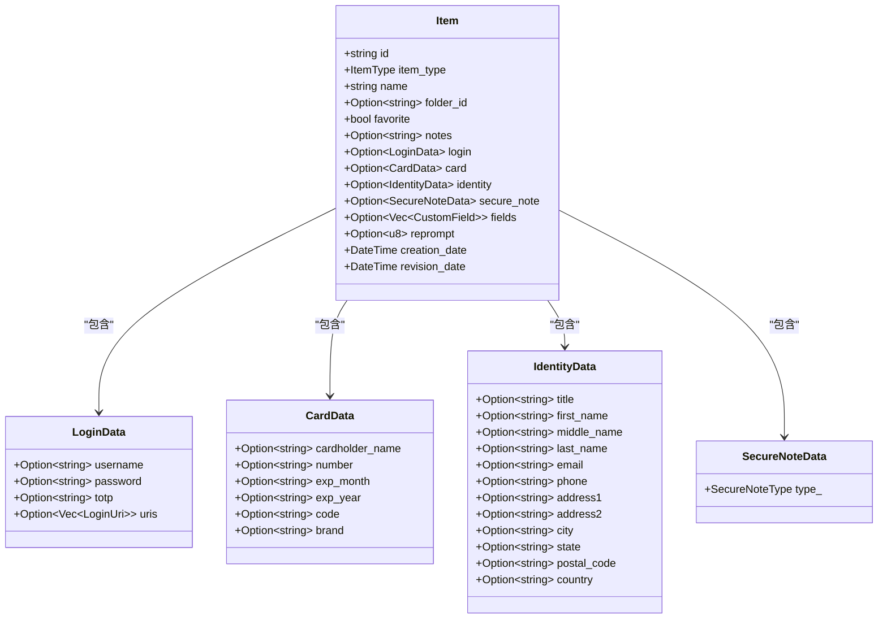
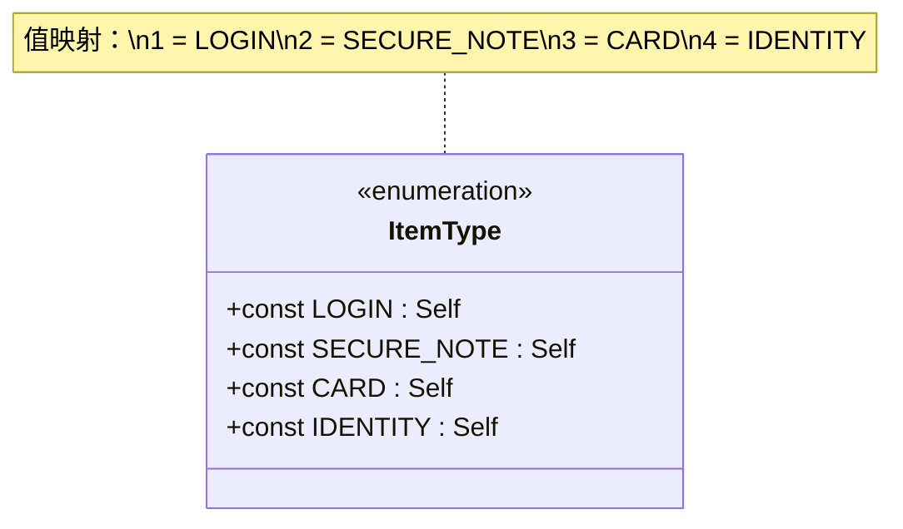
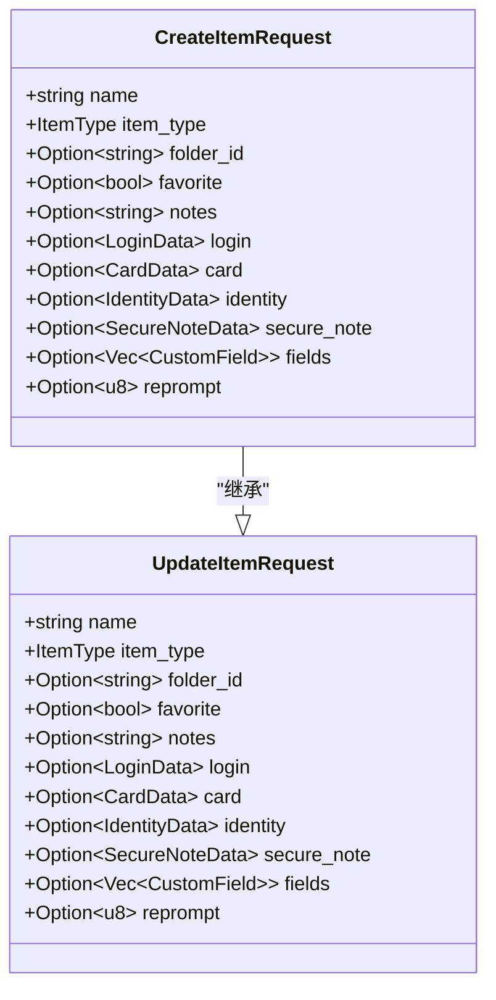
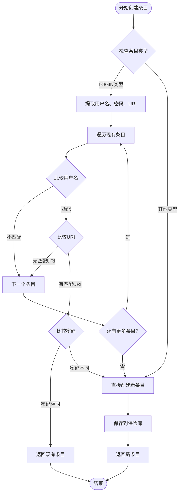
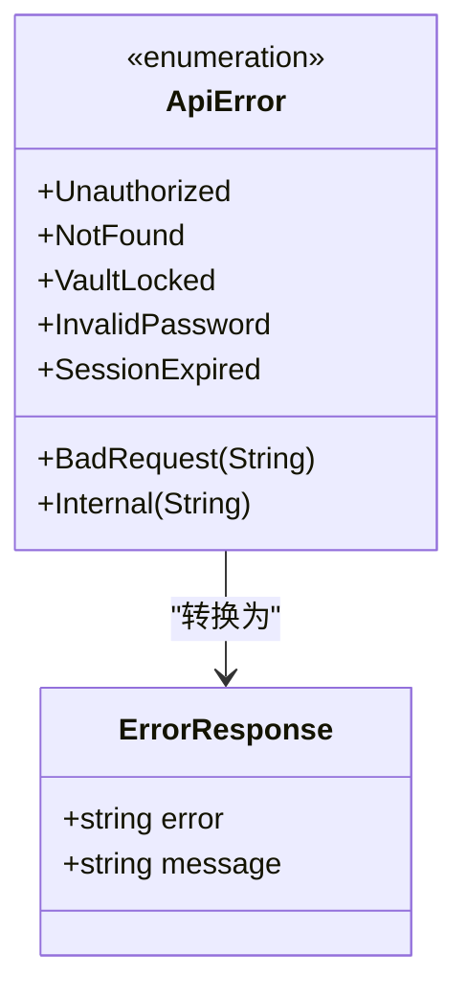
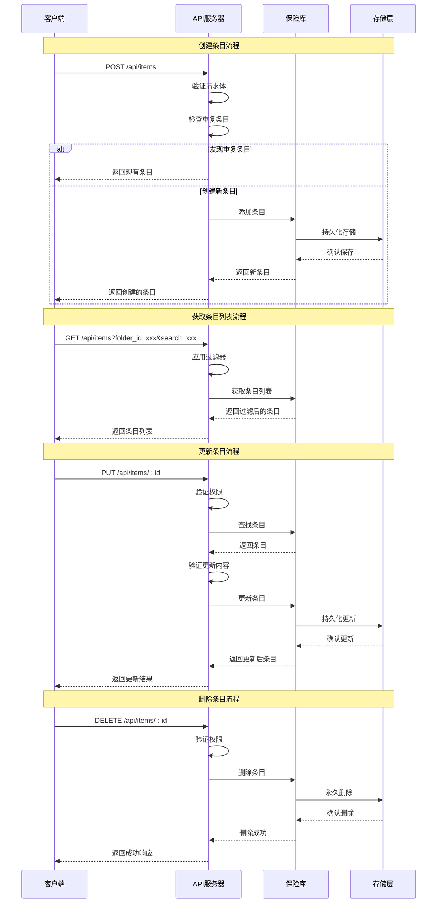

# 条目管理API

<cite>
**本文档中引用的文件**
- [api/src/lib.rs](file://api/src/lib.rs)
- [api/src/handlers/mod.rs](file://api/src/handlers/mod.rs)
- [api/src/models.rs](file://api/src/models.rs)
- [api/src/error.rs](file://api/src/error.rs)
- [core/src/models.rs](file://core/src/models.rs)
- [extension/lib/api/entries.ts](file://extension/lib/api/entries.ts)
- [extension/types/index.ts](file://extension/types/index.ts)
- [extension/store/vaultStore.ts](file://extension/store/vaultStore.ts)
</cite>

## 目录
1. [简介](#简介)
2. [API端点概览](#api端点概览)
3. [核心数据结构](#核心数据结构)
4. [查询参数详解](#查询参数详解)
5. [请求体结构](#请求体结构)
6. [条目类型系统](#条目类型系统)
7. [条目去重逻辑](#条目去重逻辑)
8. [前端调用示例](#前端调用示例)
9. [错误处理机制](#错误处理机制)
10. [完整API流程图](#完整api流程图)

## 简介

SecureFox的条目管理API提供了完整的密码条目生命周期管理功能，支持多种条目类型（登录凭据、信用卡、身份信息、安全笔记）。该API采用RESTful设计，支持CRUD操作，并实现了智能的条目去重机制。

## API端点概览

### 基础端点路径
所有条目管理API都位于 `/api/items` 路径下，基础URL格式为：
```
https://localhost:8080/api/items
```

### 支持的HTTP方法

| 方法 | 端点 | 描述 | 认证要求 |
|------|------|------|----------|
| GET | `/items` | 获取所有条目 | 是 |
| POST | `/items` | 创建新条目 | 是 |
| GET | `/items/:id` | 获取指定条目 | 是 |
| PUT | `/items/:id` | 更新指定条目 | 是 |
| DELETE | `/items/:id` | 删除指定条目 | 是 |

### 搜索和过滤端点

| 方法 | 端点 | 描述 | 认证要求 |
|------|------|------|----------|
| GET | `/items?folder_id=:id&search=:query&domain=:domain` | 带条件过滤的条目列表 | 是 |

**节源**
- [api/src/lib.rs](file://api/src/lib.rs#L49-L54)
- [api/src/handlers/mod.rs](file://api/src/handlers/mod.rs#L62-L256)

## 核心数据结构

### Item 结构体



**图表源**
- [core/src/models.rs](file://core/src/models.rs#L88-L119)
- [core/src/models.rs](file://core/src/models.rs#L166-L259)

### ItemType 枚举



**图表源**
- [core/src/models.rs](file://core/src/models.rs#L75-L85)
- [extension/types/index.ts](file://extension/types/index.ts#L15-L20)

**节源**
- [core/src/models.rs](file://core/src/models.rs#L88-L119)
- [extension/types/index.ts](file://extension/types/index.ts#L37-L52)

## 查询参数详解

### ListItemsQuery 参数结构

| 参数名 | 类型 | 必需 | 描述 | 示例值 |
|--------|------|------|------|--------|
| folder_id | Option\<String\> | 否 | 文件夹ID过滤 | "abc123" |
| search | Option\<String\> | 否 | 按名称搜索 | "google" |
| domain | Option\<String\> | 否 | 按域名过滤 | "example.com" |

### 查询参数使用示例

```typescript
// 获取特定文件夹中的所有条目
GET /api/items?folder_id=abc123

// 搜索包含关键词的条目
GET /api/items?search=google

// 获取特定域名的所有条目
GET /api/items?domain=example.com

// 组合多个过滤条件
GET /api/items?folder_id=abc123&search=google&domain=example.com
```

**节源**
- [api/src/models.rs](file://api/src/models.rs#L60-L64)
- [api/src/handlers/mod.rs](file://api/src/handlers/mod.rs#L62-L77)

## 请求体结构

### CreateItemRequest 结构



**图表源**
- [api/src/models.rs](file://api/src/models.rs#L67-L128)

### 字段验证规则

| 字段 | 验证规则 | 错误处理 |
|------|----------|----------|
| name | 非空字符串 | BadRequest("Item name is required") |
| login.username | 登录类型必需非空 | BadRequest("Username is required for login items") |
| login.uris | 登录类型必需至少一个URI | BadRequest("At least one URI is required for login items") |

**节源**
- [api/src/models.rs](file://api/src/models.rs#L67-L128)
- [api/src/handlers/mod.rs](file://api/src/handlers/mod.rs#L89-L114)

## 条目类型系统

### 登录凭据 (LOGIN)

```typescript
interface LoginItem {
  username?: string;
  password?: string;
  totp?: string;
  uris?: Array<{
    uri: string;
    match?: UriMatchType;
  }>;
}
```

**必需字段：**
- `username`：用户名
- `uris`：至少一个URI对象

### 信用卡 (CARD)

```typescript
interface CardItem {
  cardholderName?: string;
  number?: string;
  expMonth?: string;
  expYear?: string;
  code?: string;
  brand?: string;
}
```

### 身份信息 (IDENTITY)

```typescript
interface IdentityItem {
  title?: string;
  firstName?: string;
  middleName?: string;
  lastName?: string;
  email?: string;
  phone?: string;
  address1?: string;
  address2?: string;
  city?: string;
  state?: string;
  postalCode?: string;
  country?: string;
}
```

### 安全笔记 (SECURE_NOTE)

```typescript
interface SecureNoteItem {
  type: number; // 0 = Generic
}
```

**节源**
- [extension/types/index.ts](file://extension/types/index.ts#L54-L86)
- [core/src/models.rs](file://core/src/models.rs#L166-L259)

## 条目去重逻辑

### 去重算法流程



**图表源**
- [api/src/handlers/mod.rs](file://api/src/handlers/mod.rs#L116-L165)

### 去重判断标准

对于登录类型的条目，系统使用以下组合进行去重检测：
- **URI + 用户名 + 密码** 的完全匹配
- 如果找到匹配的URI和用户名但密码不同，则允许创建新条目（支持同一网站的不同密码）

**节源**
- [api/src/handlers/mod.rs](file://api/src/handlers/mod.rs#L116-L165)

## 前端调用示例

### 扩展API调用封装

```typescript
// 获取所有条目
async function getAllEntries(): Promise<Item[]> {
  return apiCall<Item[]>('get', API_ENDPOINTS.ENTRIES);
}

// 搜索条目
async function searchEntries(params: SearchEntriesRequest): Promise<Item[]> {
  const queryParams = new URLSearchParams();
  
  if (params.query) queryParams.append('q', params.query);
  if (params.domain) queryParams.append('domain', params.domain);
  if (params.folder_id) queryParams.append('folder_id', params.folder_id);
  
  const url = `${API_ENDPOINTS.ENTRIES}${queryParams.toString() ? `?${queryParams}` : ''}`;
  return apiCall<Item[]>('get', url);
}

// 创建条目
async function createEntry(entry: CreateEntryRequest): Promise<Item> {
  return apiCall<Item>('post', API_ENDPOINTS.ENTRIES, entry);
}

// 更新条目
async function updateEntry(entry: UpdateEntryRequest): Promise<Item> {
  const { id, ...data } = entry;
  return apiCall<Item>('put', `${API_ENDPOINTS.ENTRIES}/${id}`, data);
}

// 删除条目
async function deleteEntry(id: string): Promise<void> {
  return apiCall<void>('delete', `${API_ENDPOINTS.ENTRIES}/${id}`);
}
```

### React状态管理集成

```typescript
// 添加条目操作
const addItem = async (itemData: CreateEntryRequest) => {
  set({ isLoading: true, error: null });
  
  try {
    const newItem = await entriesApi.createEntry(itemData);
    
    set(state => ({
      items: [...state.items, newItem],
      isLoading: false,
    }));
    
    return newItem;
  } catch (error: any) {
    set({
      error: error.message || 'Failed to add item',
      isLoading: false,
    });
    return null;
  }
};

// 更新条目操作
const updateItem = async (updatedItem: Item) => {
  set({ isLoading: true, error: null });
  
  try {
    const result = await entriesApi.updateEntry({
      id: updatedItem.id,
      name: updatedItem.name,
      type: updatedItem.type,
      login: updatedItem.login,
      card: updatedItem.card,
      identity: updatedItem.identity,
      notes: updatedItem.notes,
      folderId: updatedItem.folderId,
    });
    
    set(state => ({
      items: state.items.map(i => i.id === updatedItem.id ? result : i),
      isLoading: false,
    }));
    
    return true;
  } catch (error: any) {
    set({
      error: error.message || 'Failed to update item',
      isLoading: false,
    });
    return false;
  }
};
```

**节源**
- [extension/lib/api/entries.ts](file://extension/lib/api/entries.ts#L15-L60)
- [extension/store/vaultStore.ts](file://extension/store/vaultStore.ts#L134-L192)

## 错误处理机制

### API错误类型



**图表源**
- [api/src/error.rs](file://api/src/error.rs#L11-L33)

### 错误响应格式

| HTTP状态码 | 错误类型 | 响应格式 | 描述 |
|------------|----------|----------|------|
| 400 | BadRequest | `{error: "Bad request", message: "具体错误信息"}` | 请求参数无效或缺少必填字段 |
| 401 | Unauthorized | `{error: "Unauthorized", message: "Invalid password"}` | 认证失败 |
| 403 | VaultLocked | `{error: "Forbidden", message: "Vault is locked"}` | 保险库被锁定 |
| 404 | NotFound | `{error: "Not found", message: "Item not found"}` | 条目不存在 |
| 500 | Internal | `{error: "Internal error", message: "服务器内部错误"}` | 内部服务器错误 |

### 具体验证错误

```typescript
// 必填字段缺失
{
  "error": "Bad request",
  "message": "Item name is required"
}

// 登录类型验证失败
{
  "error": "Bad request", 
  "message": "Username is required for login items"
}

// 条目不存在
{
  "error": "Not found",
  "message": "Item not found"
}
```

**节源**
- [api/src/error.rs](file://api/src/error.rs#L35-L53)
- [api/src/handlers/mod.rs](file://api/src/handlers/mod.rs#L89-L114)

## 完整API流程图



**图表源**
- [api/src/handlers/mod.rs](file://api/src/handlers/mod.rs#L62-L256)
- [api/src/lib.rs](file://api/src/lib.rs#L49-L65)

## 总结

SecureFox的条目管理API提供了完整而灵活的密码条目管理解决方案。通过支持多种条目类型、智能去重机制、强大的过滤搜索功能，以及完善的错误处理，该API能够满足各种密码管理场景的需求。前端通过统一的API接口封装，简化了复杂的业务逻辑处理，为用户提供了流畅的操作体验。