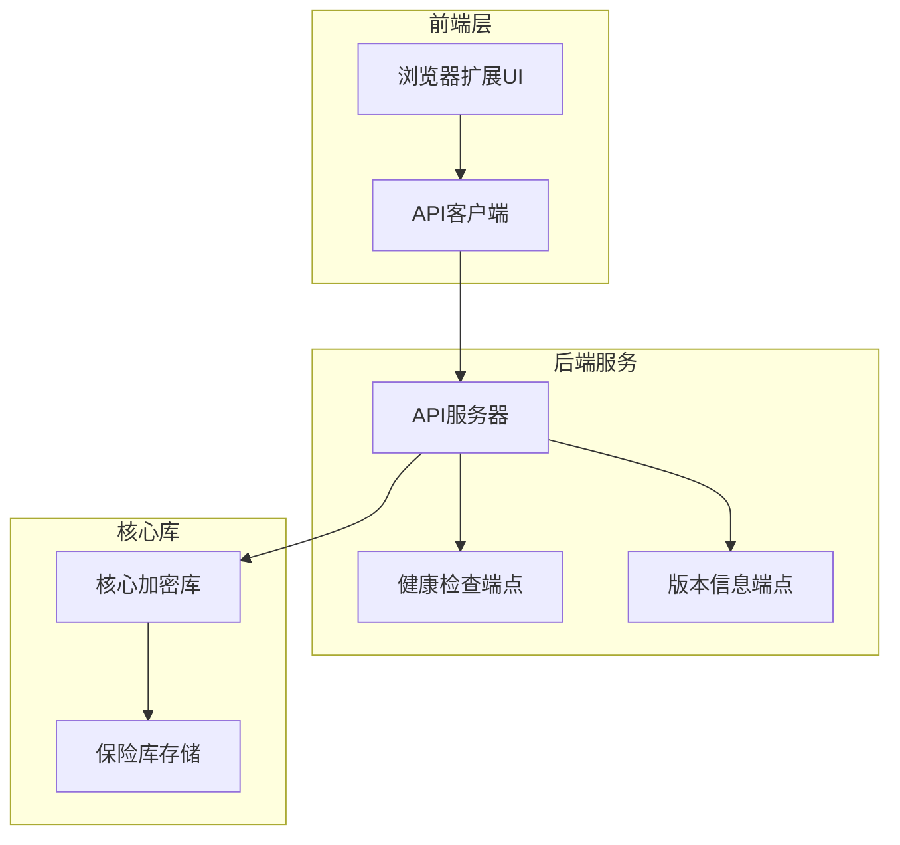
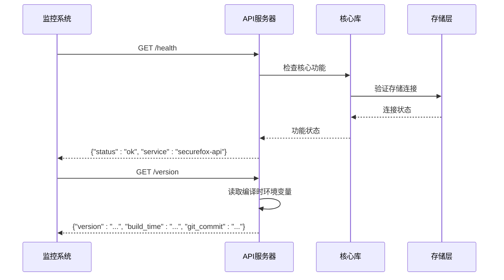
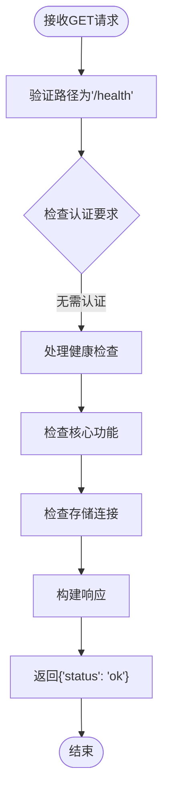
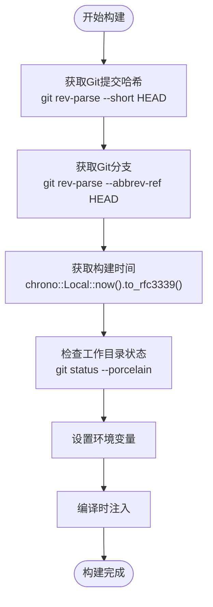
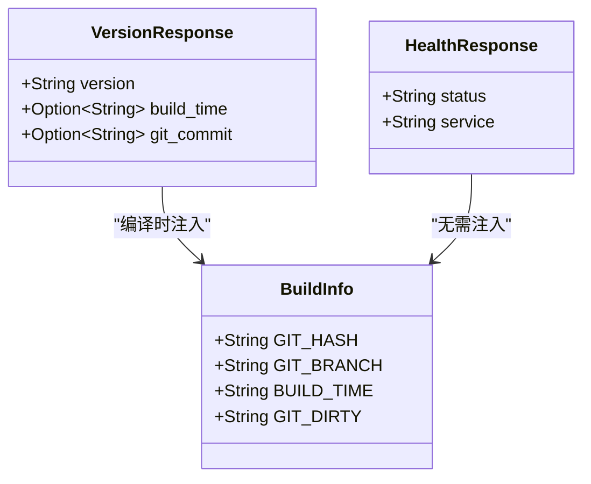
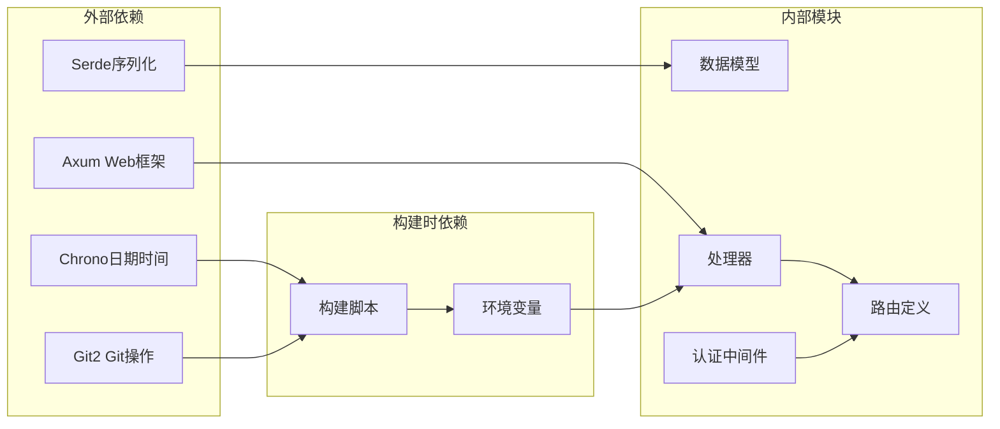

# 系统API

<cite>
**本文档中引用的文件**
- [api/src/handlers/mod.rs](file://api/src/handlers/mod.rs)
- [api/src/models.rs](file://api/src/models.rs)
- [api/src/lib.rs](file://api/src/lib.rs)
- [api/src/auth.rs](file://api/src/auth.rs)
- [api/build.rs](file://api/build.rs)
- [extension/lib/api/system.ts](file://extension/lib/api/system.ts)
- [extension/lib/api/client.ts](file://extension/lib/api/client.ts)
- [extension/lib/api/index.ts](file://extension/lib/api/index.ts)
- [extension/utils/constants.ts](file://extension/utils/constants.ts)
- [cli/build.rs](file://cli/build.rs)
</cite>

## 目录
1. [简介](#简介)
2. [项目结构](#项目结构)
3. [核心组件](#核心组件)
4. [架构概览](#架构概览)
5. [详细端点分析](#详细端点分析)
6. [依赖关系分析](#依赖关系分析)
7. [性能考虑](#性能考虑)
8. [故障排除指南](#故障排除指南)
9. [结论](#结论)

## 简介

SecureFox是一个安全的本地优先密码管理器，采用零知识加密原则设计。该项目包含一个HTTP API服务器，为浏览器扩展提供通信接口。本文档详细介绍了两个关键的系统级API端点：`/health`（健康检查）和`/version`（版本信息），这些端点无需身份验证即可访问，主要用于服务状态监控和部署管理。

## 项目结构

SecureFox采用模块化架构，主要包含以下核心组件：



**图表来源**
- [api/src/lib.rs](file://api/src/lib.rs#L47-L81)
- [extension/lib/api/client.ts](file://extension/lib/api/client.ts#L1-L98)

**章节来源**
- [api/src/lib.rs](file://api/src/lib.rs#L1-L81)
- [extension/utils/constants.ts](file://extension/utils/constants.ts#L1-L79)

## 核心组件

### API服务器架构

SecureFox的API服务器基于Rust的Axum框架构建，提供了类型安全的RESTful接口。服务器支持两种类型的路由：

1. **公共路由**：无需身份验证即可访问
2. **受保护路由**：需要有效会话令牌

### 健康检查机制

健康检查端点提供系统运行状态的基本信息，不涉及任何敏感数据，确保监控工具可以安全地定期查询。

### 版本信息注入

版本信息通过编译时环境变量注入，包含语义化版本号、构建时间和Git提交哈希等关键信息。

**章节来源**
- [api/src/handlers/mod.rs](file://api/src/handlers/mod.rs#L317-L339)
- [api/src/auth.rs](file://api/src/auth.rs#L16-L18)

## 架构概览



**图表来源**
- [api/src/handlers/mod.rs](file://api/src/handlers/mod.rs#L317-L339)
- [api/src/lib.rs](file://api/src/lib.rs#L77-L81)

## 详细端点分析

### `/health` 端点

#### 端点描述
健康检查端点提供系统基本运行状态信息，用于监控服务可用性。

#### 请求方法
- **HTTP方法**: `GET`
- **路径**: `/health`
- **认证**: 无需身份验证

#### 响应格式
```json
{
  "status": "ok",
  "service": "securefox-api"
}
```

#### 实现细节



**图表来源**
- [api/src/handlers/mod.rs](file://api/src/handlers/mod.rs#L317-L327)
- [api/src/auth.rs](file://api/src/auth.rs#L16-L18)

#### 使用场景
- **Kubernetes存活探针**: 配置为`/health`端点
- **负载均衡器健康检查**: 定期验证服务状态
- **监控告警**: 检测服务异常

**章节来源**
- [api/src/handlers/mod.rs](file://api/src/handlers/mod.rs#L317-L327)
- [api/src/auth.rs](file://api/src/auth.rs#L16-L18)

### `/version` 端点

#### 端点描述
版本信息端点返回应用程序的版本详情，包括语义化版本号、构建时间和Git提交信息。

#### 请求方法
- **HTTP方法**: `GET`
- **路径**: `/version`
- **认证**: 无需身份验证

#### 响应格式
```typescript
interface VersionResponse {
  version: string;           // 语义化版本号
  build_time?: string;       // RFC 3339格式的构建时间
  git_commit?: string;       // Git提交哈希
}
```

#### 编译时信息注入

版本信息通过Cargo构建脚本在编译时注入：



**图表来源**
- [api/build.rs](file://api/build.rs#L1-L46)
- [cli/build.rs](file://cli/build.rs#L1-L57)

#### 实现细节



**图表来源**
- [api/src/models.rs](file://api/src/models.rs#L137-L142)
- [api/src/handlers/mod.rs](file://api/src/handlers/mod.rs#L329-L339)

#### 字段说明

| 字段 | 类型 | 描述 | 示例值 |
|------|------|------|--------|
| `version` | string | 语义化版本号 | `"1.2.3"` |
| `build_time` | string \| null | RFC 3339格式的构建时间 | `"2024-01-15T10:30:45+08:00"` |
| `git_commit` | string \| null | Git提交哈希（带dirty标记） | `"abc1234-dirty"` |

**章节来源**
- [api/src/models.rs](file://api/src/models.rs#L137-L142)
- [api/src/handlers/mod.rs](file://api/src/handlers/mod.rs#L329-L339)
- [api/build.rs](file://api/build.rs#L1-L46)

## 依赖关系分析



**图表来源**
- [api/src/lib.rs](file://api/src/lib.rs#L1-L20)
- [api/build.rs](file://api/build.rs#L1-L46)

**章节来源**
- [api/src/lib.rs](file://api/src/lib.rs#L1-L81)
- [api/build.rs](file://api/build.rs#L1-L46)

## 性能考虑

### 健康检查性能

健康检查端点设计为轻量级操作，避免对系统资源造成显著影响：

- **无数据库查询**: 不执行任何数据库操作
- **最小计算开销**: 仅返回预定义的静态响应
- **快速响应**: 通常在毫秒级别内完成

### 版本信息性能

版本信息通过编译时注入，具有以下优势：

- **零运行时开销**: 无需动态查询或计算
- **内存高效**: 只在编译时占用少量内存
- **缓存友好**: 响应内容完全可预测

### 监控集成优化

对于大规模部署，建议采用以下优化策略：

- **异步检查**: 使用非阻塞I/O进行健康检查
- **缓存响应**: 在代理层缓存健康检查结果
- **分层监控**: 结合多个指标进行综合评估

## 故障排除指南

### 常见问题及解决方案

#### 健康检查失败

**症状**: 监控系统报告健康检查失败

**可能原因**:
1. API服务器未启动
2. 网络连接问题
3. 防火墙阻止访问

**解决方案**:
```bash
# 检查服务状态
curl -f http://localhost:8787/health

# 检查进程状态
ps aux | grep securefox

# 检查端口监听
netstat -tlnp | grep 8787
```

#### 版本信息缺失

**症状**: `/version`端点返回空值或错误

**可能原因**:
1. 编译时环境变量未正确设置
2. 构建过程被中断
3. 使用了预编译二进制文件

**解决方案**:
```bash
# 检查编译时环境变量
cargo build --verbose

# 重新构建项目
cargo clean
cargo build --release
```

### Kubernetes集成示例

#### 存活探针配置
```yaml
apiVersion: v1
kind: Pod
metadata:
  name: securefox-api
spec:
  containers:
  - name: securefox
    image: securefox:latest
    ports:
    - containerPort: 8787
    livenessProbe:
      httpGet:
        path: /health
        port: 8787
      initialDelaySeconds: 30
      periodSeconds: 10
      timeoutSeconds: 5
      failureThreshold: 3
```

#### 就绪探针配置
```yaml
readinessProbe:
  httpGet:
    path: /version
    port: 8787
  initialDelaySeconds: 5
  periodSeconds: 5
```

### Prometheus抓取配置

```yaml
scrape_configs:
  - job_name: 'securefox-api'
    static_configs:
      - targets: ['localhost:8787']
    metrics_path: /health
    scrape_interval: 30s
    scrape_timeout: 10s
```

**章节来源**
- [api/src/handlers/mod.rs](file://api/src/handlers/mod.rs#L317-L339)
- [api/build.rs](file://api/build.rs#L1-L46)

## 结论

SecureFox的系统API设计体现了现代Web应用的最佳实践：

### 关键优势

1. **安全性**: 所有系统端点无需身份验证，避免凭据泄露风险
2. **可观测性**: 提供完整的健康检查和版本信息接口
3. **可维护性**: 编译时注入的版本信息确保信息准确性
4. **性能**: 轻量级实现，适合高频监控调用

### 最佳实践

- **监控集成**: 与Prometheus、Kubernetes等主流监控平台无缝集成
- **CI/CD支持**: 版本信息自动注入，支持自动化部署流程
- **跨平台兼容**: 统一的API接口支持多种部署环境

### 未来发展方向

随着项目的发展，可以考虑扩展以下功能：
- **更详细的健康指标**: 包括数据库连接状态、存储空间使用率等
- **自定义监控端点**: 支持用户定义的健康检查逻辑
- **性能监控**: 添加响应时间、吞吐量等性能指标

这些系统级API为SecureFox提供了坚实的基础，确保了服务的高可用性和可维护性，是整个系统架构中不可或缺的重要组成部分。