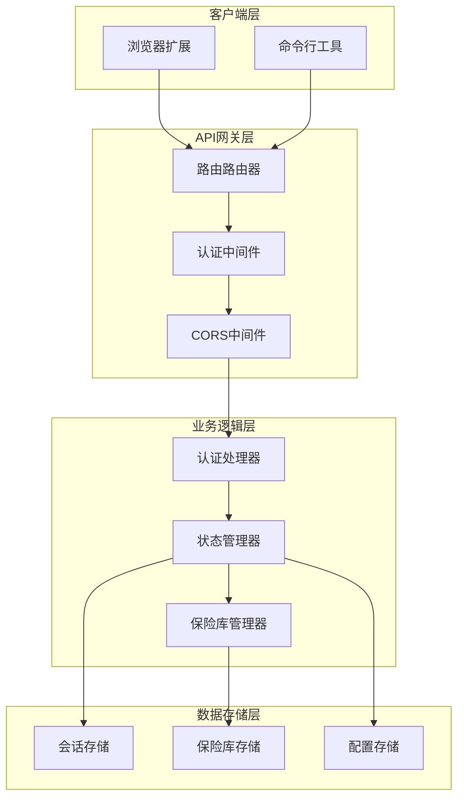
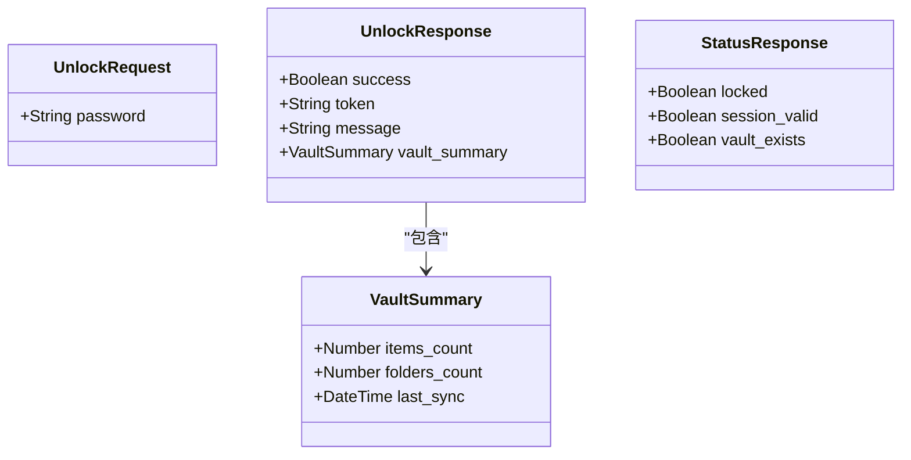
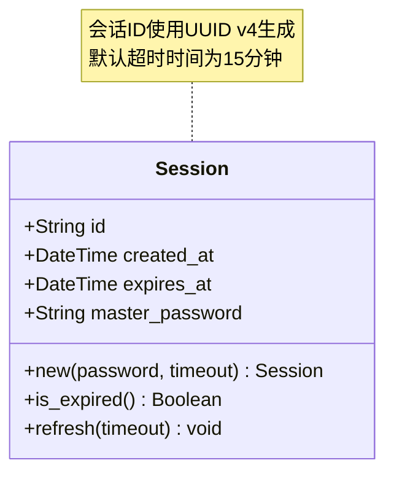
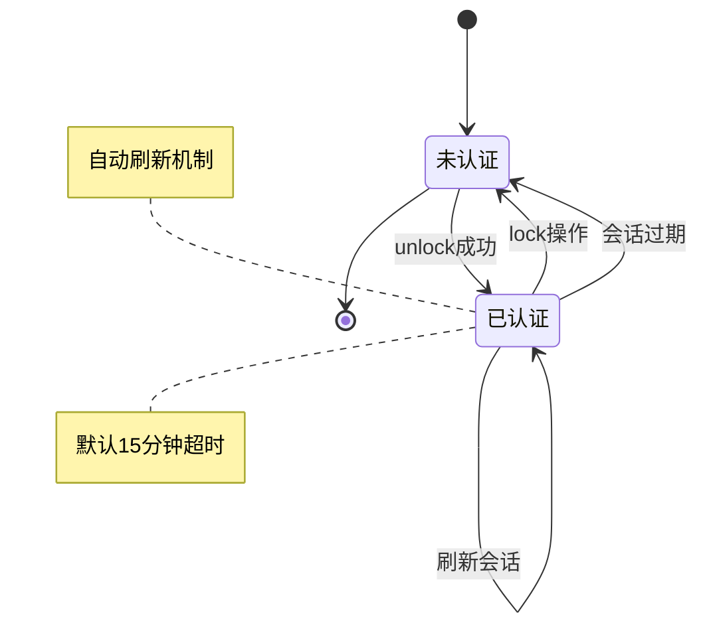
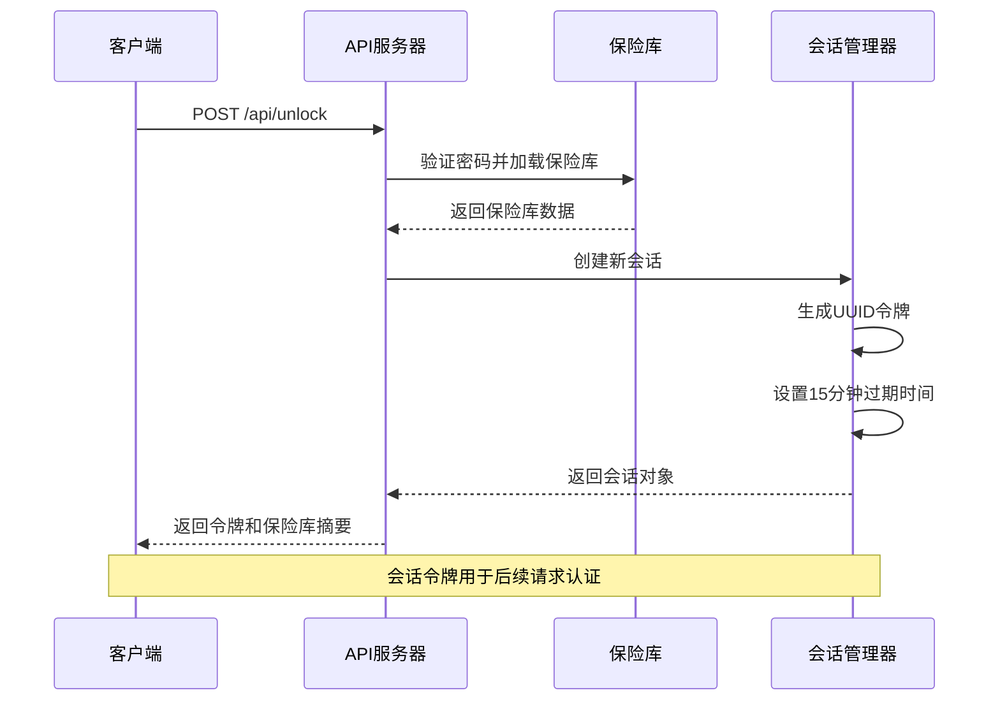
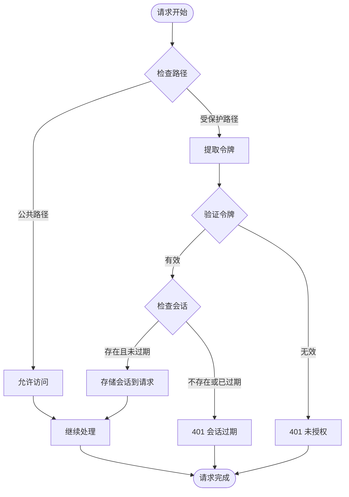
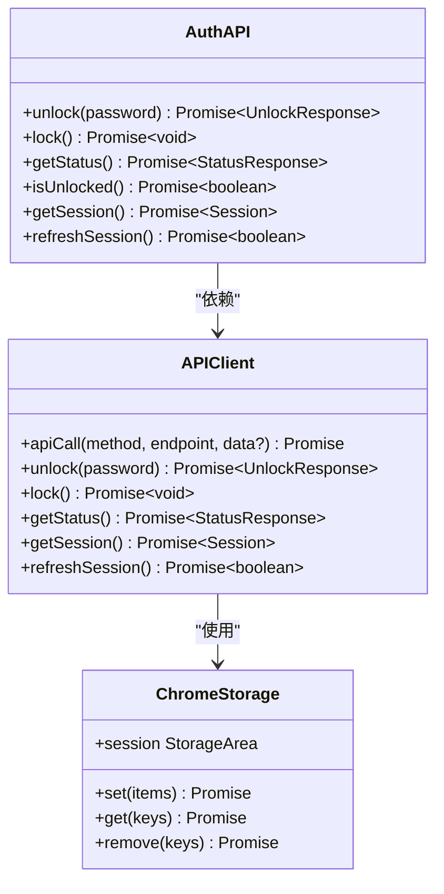
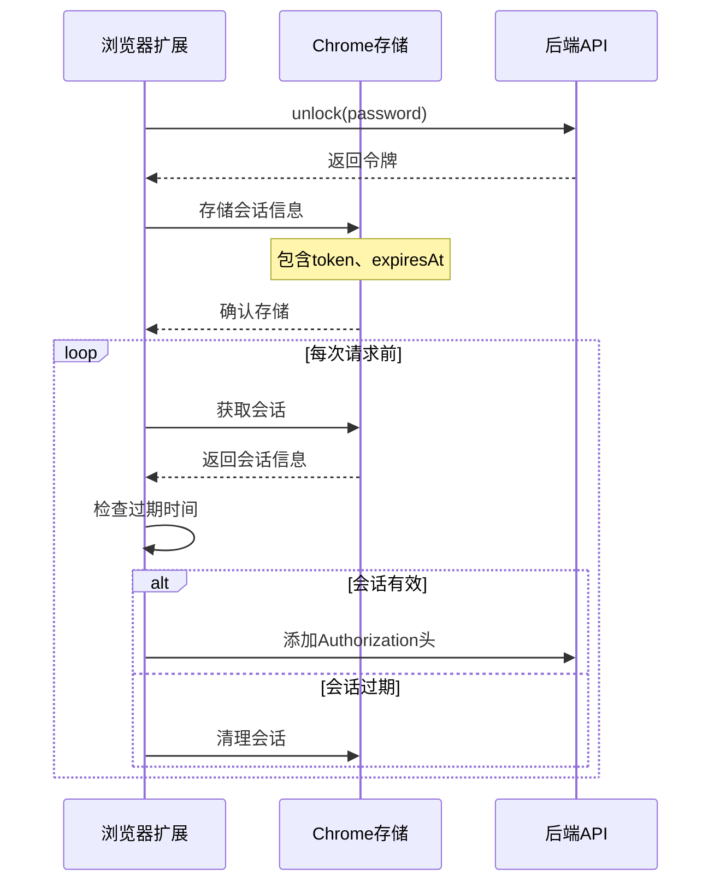
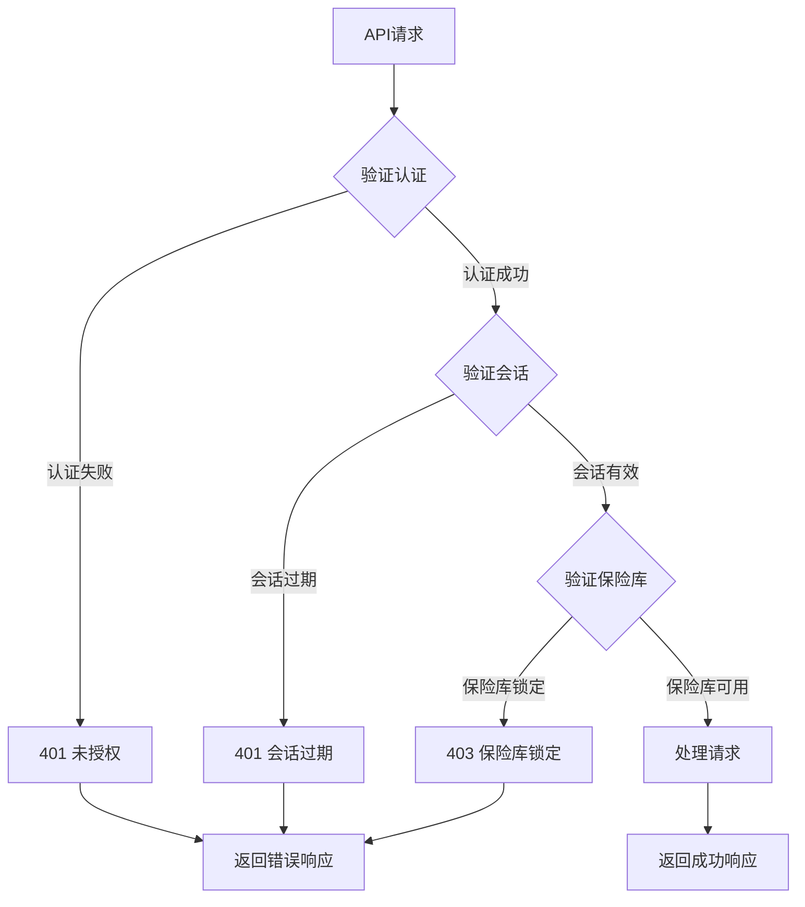

# SecureFox认证API详细文档

<cite>
**本文档中引用的文件**
- [api/src/auth.rs](file://api/src/auth.rs)
- [api/src/models.rs](file://api/src/models.rs)
- [api/src/state.rs](file://api/src/state.rs)
- [api/src/error.rs](file://api/src/error.rs)
- [api/src/handlers/mod.rs](file://api/src/handlers/mod.rs)
- [api/src/lib.rs](file://api/src/lib.rs)
- [extension/lib/api/auth.ts](file://extension/lib/api/auth.ts)
- [extension/lib/api/client.ts](file://extension/lib/api/client.ts)
- [extension/types/index.ts](file://extension/types/index.ts)
- [extension/utils/constants.ts](file://extension/utils/constants.ts)
- [extension/lib/api/entries.ts](file://extension/lib/api/entries.ts)
</cite>

## 目录
1. [简介](#简介)
2. [认证架构概览](#认证架构概览)
3. [核心端点详解](#核心端点详解)
4. [数据模型定义](#数据模型定义)
5. [会话管理机制](#会话管理机制)
6. [浏览器扩展集成](#浏览器扩展集成)
7. [错误处理机制](#错误处理机制)
8. [安全考虑](#安全考虑)
9. [故障排除指南](#故障排除指南)
10. [总结](#总结)

## 简介

SecureFox是一个基于Rust开发的密码管理器，提供了完整的认证API系统来保护用户的数据安全。该系统采用基于会话令牌的认证机制，支持无状态的RESTful API设计，为浏览器扩展和CLI工具提供统一的访问接口。

本文档详细介绍了SecureFox认证API的核心功能，包括解锁、锁定和状态查询三个主要端点，以及相关的数据模型、会话管理和错误处理机制。

## 认证架构概览

SecureFox的认证系统采用分层架构设计，确保了安全性、可扩展性和易维护性。



**图表来源**
- [api/src/lib.rs](file://api/src/lib.rs#L25-L80)
- [api/src/auth.rs](file://api/src/auth.rs#L10-L36)

**章节来源**
- [api/src/lib.rs](file://api/src/lib.rs#L1-L80)
- [api/src/auth.rs](file://api/src/auth.rs#L1-L37)

## 核心端点详解

### /api/unlock - 解锁保险库

**HTTP方法**: POST  
**路径**: `/api/unlock`  
**认证要求**: 无需认证  
**请求格式**: JSON

#### 请求结构

| 字段 | 类型 | 必需 | 描述 |
|------|------|------|------|
| password | String | 是 | 用户主密码 |

#### 响应结构

| 字段 | 类型 | 描述 |
|------|------|------|
| success | Boolean | 操作是否成功 |
| token | String | 会话令牌（成功时返回） |
| message | String | 错误消息（失败时返回） |
| vault_summary | Object | 保险库摘要信息 |

#### 保险库摘要结构

| 字段 | 类型 | 描述 |
|------|------|------|
| items_count | Number | 条目数量 |
| folders_count | Number | 文件夹数量 |

#### 示例请求

```json
{
  "password": "your_master_password"
}
```

#### 示例响应

成功响应：
```json
{
  "success": true,
  "token": "eyJhbGciOiJIUzI1NiIsInR5cCI6IkpXVCJ9...",
  "vault_summary": {
    "items_count": 42,
    "folders_count": 5
  }
}
```

失败响应：
```json
{
  "success": false,
  "message": "Invalid password"
}
```

### /api/lock - 锁定保险库

**HTTP方法**: POST  
**路径**: `/api/lock`  
**认证要求**: 需要有效会话令牌

#### 请求格式

无请求体

#### 响应结构

| 字段 | 类型 | 描述 |
|------|------|------|
| locked | Boolean | 是否已锁定 |
| session_valid | Boolean | 会话是否有效 |
| vault_exists | Boolean | 保险库是否存在 |

#### 示例响应

```json
{
  "locked": true,
  "session_valid": false,
  "vault_exists": true
}
```

### /api/status - 获取状态信息

**HTTP方法**: GET  
**路径**: `/api/status`  
**认证要求**: 无需认证

#### 响应结构

| 字段 | 类型 | 描述 |
|------|------|------|
| locked | Boolean | 保险库是否锁定 |
| session_valid | Boolean | 会话是否有效 |
| vault_exists | Boolean | 保险库是否存在 |

#### 示例响应

```json
{
  "locked": false,
  "session_valid": true,
  "vault_exists": true
}
```

**章节来源**
- [api/src/handlers/mod.rs](file://api/src/handlers/mod.rs#L1-L47)
- [api/src/models.rs](file://api/src/models.rs#L5-L29)

## 数据模型定义

### UnlockRequest模型

`UnlockRequest`结构体定义了解锁请求的数据格式。



**图表来源**
- [api/src/models.rs](file://api/src/models.rs#L5-L29)

### Session结构体

`Session`结构体管理用户的认证会话。



**图表来源**
- [api/src/models.rs](file://api/src/models.rs#L144-L171)

### 扩展类型定义

浏览器扩展使用对应的TypeScript类型定义：

| 类型名称 | 字段 | 类型 | 描述 |
|----------|------|------|------|
| UnlockRequest | password | String | 主密码 |
| UnlockResponse | success | Boolean | 操作结果 |
| UnlockResponse | token | String | 会话令牌 |
| UnlockResponse | message | String | 错误消息 |
| Session | token | String | 会话令牌 |
| Session | locked | Boolean | 锁定状态 |
| Session | expiresAt | Number | 过期时间戳 |

**章节来源**
- [api/src/models.rs](file://api/src/models.rs#L5-L171)
- [extension/types/index.ts](file://extension/types/index.ts#L99-L143)

## 会话管理机制

### 会话生命周期

SecureFox的会话管理系统提供了完整的生命周期控制：



**图表来源**
- [api/src/state.rs](file://api/src/state.rs#L53-L67)

### 会话创建流程



**图表来源**
- [api/src/state.rs](file://api/src/state.rs#L25-L41)

### 会话验证机制

认证中间件负责验证每个受保护请求的会话有效性：



**图表来源**
- [api/src/auth.rs](file://api/src/auth.rs#L15-L35)

**章节来源**
- [api/src/state.rs](file://api/src/state.rs#L1-L113)
- [api/src/auth.rs](file://api/src/auth.rs#L1-L37)

## 浏览器扩展集成

### API客户端实现

浏览器扩展通过专门的API客户端与后端通信：



**图表来源**
- [extension/lib/api/auth.ts](file://extension/lib/api/auth.ts#L1-L145)
- [extension/lib/api/client.ts](file://extension/lib/api/client.ts#L1-L39)

### 会话存储机制

浏览器扩展使用Chrome存储API管理会话状态：



**图表来源**
- [extension/lib/api/auth.ts](file://extension/lib/api/auth.ts#L18-L30)

### 错误处理和重试机制

扩展实现了完善的错误处理策略：

| 错误类型 | 处理方式 | 用户反馈 |
|----------|----------|----------|
| 网络错误 | 自动重试3次 | 显示加载状态 |
| 认证失败 | 清除本地会话 | 显示密码错误 |
| 会话过期 | 尝试刷新会话 | 重新登录提示 |
| 服务不可用 | 显示错误信息 | 提供重试按钮 |

**章节来源**
- [extension/lib/api/auth.ts](file://extension/lib/api/auth.ts#L1-L145)
- [extension/lib/api/client.ts](file://extension/lib/api/client.ts#L1-L39)

## 错误处理机制

### HTTP状态码映射

SecureFox API使用标准HTTP状态码来表示不同的错误情况：

| 状态码 | 错误类型 | 描述 | 常见原因 |
|--------|----------|------|----------|
| 200 | 成功 | 请求成功执行 | 正常操作 |
| 400 | 错误请求 | 请求格式不正确 | JSON解析失败 |
| 401 | 未授权 | 认证失败或会话过期 | 无效令牌 |
| 403 | 禁止访问 | 保险库已锁定 | 调用受保护端点时保险库未解锁 |
| 404 | 未找到 | 资源不存在 | 不存在的条目ID |
| 500 | 内部错误 | 服务器内部错误 | 系统异常 |

### 错误响应格式

所有错误响应都遵循统一的JSON格式：

```json
{
  "error": "错误描述",
  "message": "详细错误信息"
}
```

### 具体错误场景



**图表来源**
- [api/src/error.rs](file://api/src/error.rs#L11-L32)

### 错误处理最佳实践

1. **客户端错误处理**：扩展应该捕获所有网络错误并提供友好的用户界面
2. **自动重试机制**：对于临时性错误（如网络超时），实现指数退避重试
3. **会话恢复**：当检测到会话过期时，尝试自动刷新会话
4. **用户通知**：清晰地告知用户错误原因和建议的操作

**章节来源**
- [api/src/error.rs](file://api/src/error.rs#L1-L74)

## 安全考虑

### 认证安全机制

1. **令牌生成**：使用UUID v4生成不可预测的会话令牌
2. **令牌传输**：所有请求都通过HTTPS加密传输
3. **令牌存储**：客户端使用Chrome存储API的安全存储
4. **会话超时**：默认15分钟自动过期，增强安全性
5. **中间件保护**：所有受保护端点都经过认证中间件验证

### 数据保护措施

1. **密码验证**：服务器端验证密码，不存储明文密码
2. **保险库加密**：保险库数据在内存中加密存储
3. **内存清理**：锁定时立即清除敏感数据
4. **访问控制**：严格的路径级权限控制

### 网络安全

1. **CORS配置**：开发环境允许跨域请求，生产环境需要适当配置
2. **HTTPS强制**：推荐使用HTTPS保护传输安全
3. **请求限制**：实现合理的请求频率限制

## 故障排除指南

### 常见问题及解决方案

| 问题症状 | 可能原因 | 解决方案 |
|----------|----------|----------|
| 401 Unauthorized错误 | 会话过期或令牌无效 | 重新解锁保险库 |
| 403 Forbidden错误 | 保险库已锁定 | 输入正确的主密码解锁 |
| 网络连接失败 | 服务未启动或端口被占用 | 检查服务状态和防火墙设置 |
| 会话无法保存 | Chrome存储权限问题 | 检查扩展权限设置 |

### 调试技巧

1. **启用调试日志**：在开发环境中启用详细的API日志
2. **检查网络请求**：使用浏览器开发者工具监控API请求
3. **验证令牌**：手动验证会话令牌的有效性
4. **测试端点**：使用curl或Postman直接测试API端点

### 性能优化建议

1. **会话预热**：在用户活动期间保持会话活跃
2. **批量操作**：对于大量数据操作，考虑使用批量API
3. **缓存策略**：合理使用浏览器缓存减少重复请求
4. **连接池**：对于高并发场景，优化HTTP连接池配置

## 总结

SecureFox认证API提供了一个完整、安全且易于使用的认证解决方案。通过三个核心端点（`/unlock`、`/lock`、`/status`）和完善的会话管理机制，系统能够有效地保护用户数据的安全性。

### 关键特性

1. **简洁的API设计**：RESTful风格，易于理解和使用
2. **强大的安全机制**：多层认证和会话管理
3. **灵活的扩展性**：支持多种客户端集成
4. **完善的错误处理**：提供详细的错误信息和恢复机制

### 最佳实践建议

1. **客户端实现**：遵循提供的TypeScript类型定义
2. **错误处理**：实现完善的错误捕获和用户反馈
3. **性能优化**：合理使用会话缓存和请求去重
4. **安全考虑**：始终使用HTTPS传输，妥善保管会话令牌

通过遵循本文档的指导原则和最佳实践，开发者可以充分利用SecureFox认证API的强大功能，构建安全可靠的密码管理解决方案。