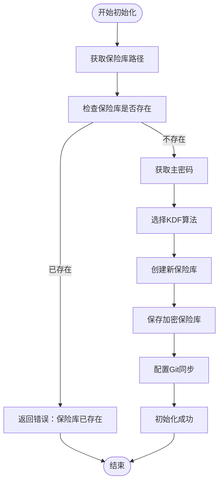
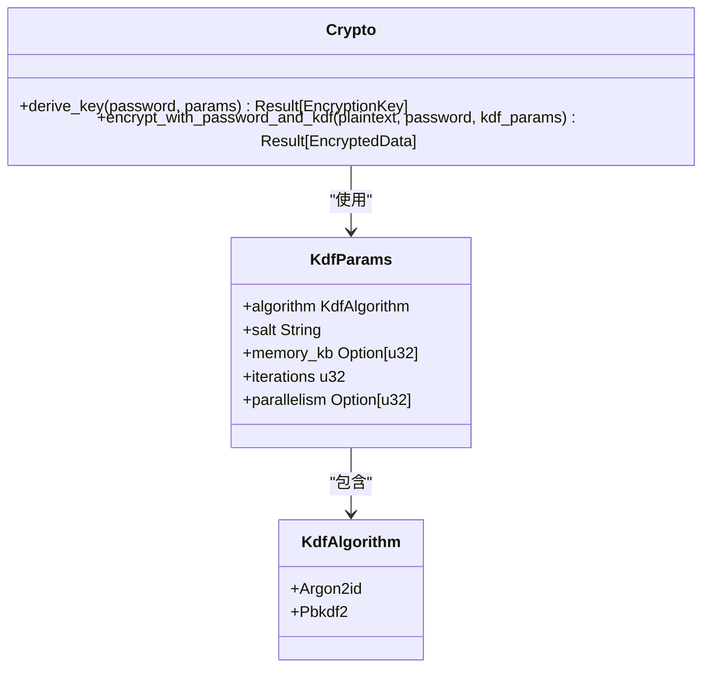
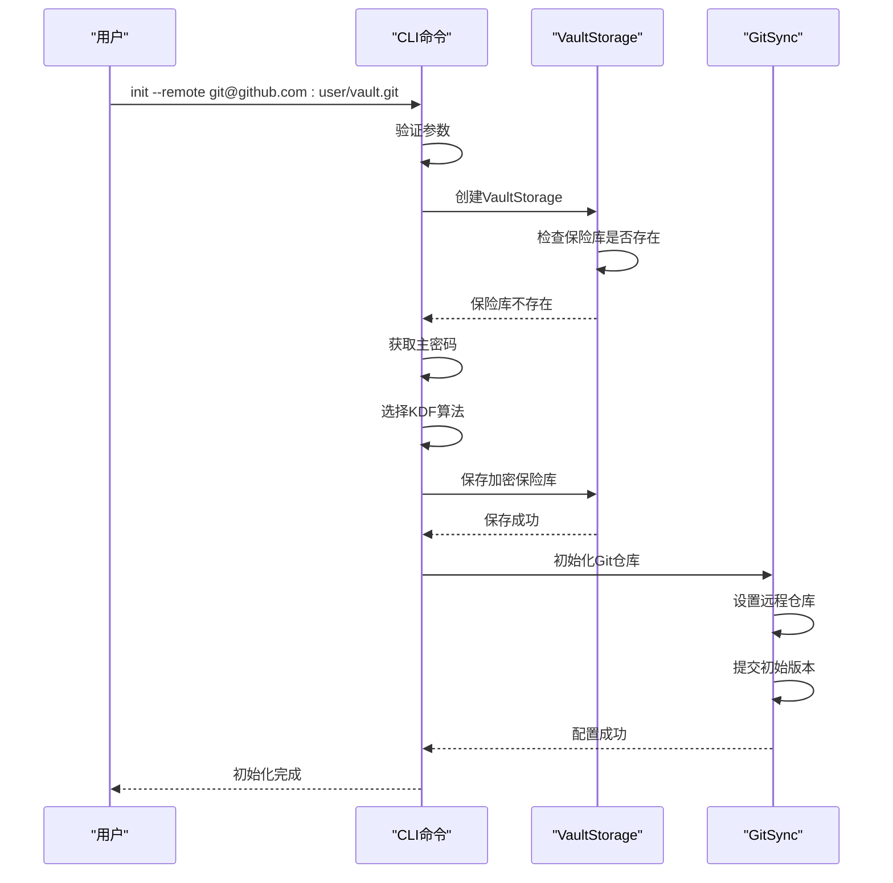
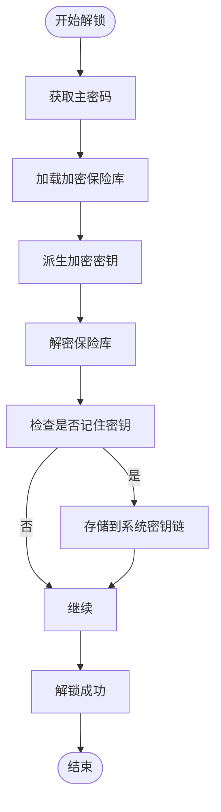
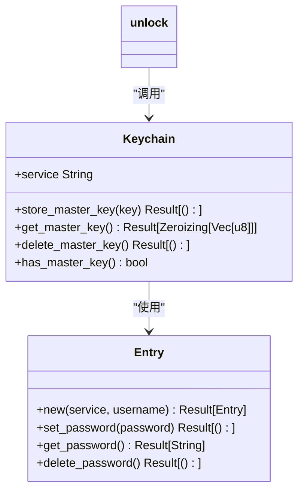
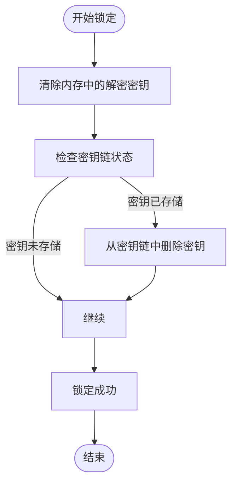
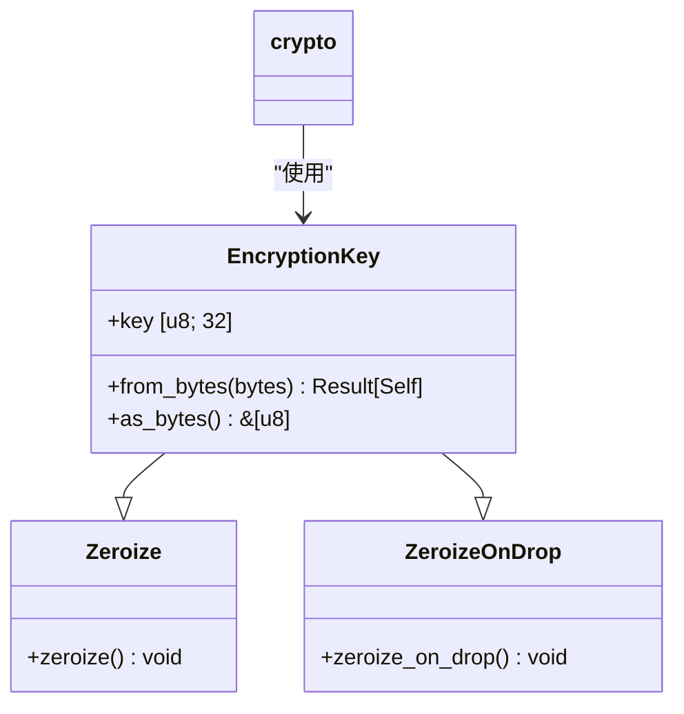
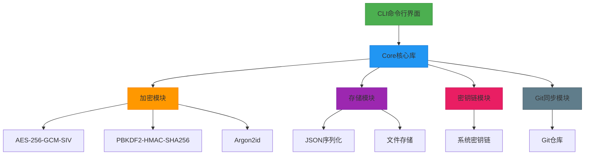

# 保险库管理

<cite>
**本文档引用的文件**  
- [init.rs](file://cli/src/commands/init.rs)
- [unlock.rs](file://cli/src/commands/unlock.rs)
- [lock.rs](file://cli/src/commands/lock.rs)
- [placeholder.rs](file://cli/src/commands/placeholder.rs)
- [crypto.rs](file://core/src/crypto.rs)
- [storage.rs](file://core/src/storage.rs)
- [keychain.rs](file://core/src/keychain.rs)
- [main.rs](file://cli/src/main.rs)
- [models.rs](file://core/src/models.rs)
</cite>

## 目录
1. [简介](#简介)
2. [保险库初始化](#保险库初始化)
3. [保险库解锁](#保险库解锁)
4. [保险库锁定](#保险库锁定)
5. [命令参数说明](#命令参数说明)
6. [错误处理策略](#错误处理策略)
7. [常见问题解决](#常见问题解决)
8. [架构概览](#架构概览)

## 简介
SecureFox 是一个本地优先的密码管理器，提供安全的保险库管理功能。本文档详细介绍了保险库的初始化、解锁和锁定功能，重点说明 `init`、`unlock` 和 `lock` 命令的实现细节和使用方法。文档涵盖了核心加密算法、密钥管理、系统集成等关键技术点，为用户提供全面的操作指导和故障排除方案。

## 保险库初始化
`init` 命令用于创建新的加密保险库，是使用 SecureFox 的第一步。该命令通过交互式流程引导用户完成保险库的创建，包括选择密钥派生函数（KDF）算法和配置远程 Git 仓库。

### 初始化流程


**Diagram sources**
- [init.rs](file://cli/src/commands/init.rs#L7-L88)

**Section sources**
- [init.rs](file://cli/src/commands/init.rs#L7-L88)
- [main.rs](file://cli/src/main.rs#L52-L60)

### KDF算法选择
在初始化过程中，用户可以选择两种密钥派生函数（KDF）算法：`pbkdf2` 或 `argon2`。这两种算法都用于从用户提供的主密码派生加密密钥，但具有不同的安全特性和性能特征。



**Diagram sources**
- [crypto.rs](file://core/src/crypto.rs#L67-L118)
- [init.rs](file://cli/src/commands/init.rs#L30-L58)

**Section sources**
- [crypto.rs](file://core/src/crypto.rs#L67-L118)
- [init.rs](file://cli/src/commands/init.rs#L30-L58)

### 远程Git仓库配置
`init` 命令支持通过 `--remote` 参数配置远程 Git 仓库，实现保险库的自动同步。当指定远程仓库 URL 时，系统会自动初始化 Git 仓库并设置远程连接。



**Diagram sources**
- [init.rs](file://cli/src/commands/init.rs#L73-L84)
- [storage.rs](file://core/src/storage.rs#L129-L131)
- [models.rs](file://core/src/models.rs#L8-L26)

**Section sources**
- [init.rs](file://cli/src/commands/init.rs#L73-L84)
- [storage.rs](file://core/src/storage.rs#L129-L131)

## 保险库解锁
`unlock` 命令用于通过主密码解锁保险库，使用户能够访问存储的敏感信息。该命令支持将解密密钥存储在系统密钥链中，以便在后续操作中无需重复输入主密码。

### 解锁流程


**Diagram sources**
- [placeholder.rs](file://cli/src/commands/placeholder.rs#L212-L214)
- [keychain.rs](file://core/src/keychain.rs#L32-L44)

**Section sources**
- [placeholder.rs](file://cli/src/commands/placeholder.rs#L212-L214)
- [keychain.rs](file://core/src/keychain.rs#L32-L44)

### 密钥链集成
SecureFox 支持将解密密钥安全地存储在系统密钥链中，如 macOS 的 Keychain、Linux 的 SecretService 或 Windows 的 Credential Manager。这通过 `keyring` 库实现，确保密钥不会以明文形式存储在内存或磁盘上。



**Diagram sources**
- [keychain.rs](file://core/src/keychain.rs#L12-L75)
- [placeholder.rs](file://cli/src/commands/placeholder.rs#L212-L214)

**Section sources**
- [keychain.rs](file://core/src/keychain.rs#L12-L75)

## 保险库锁定
`lock` 命令用于安全地锁定保险库，清除内存中的解密密钥，防止未经授权的访问。这是保护敏感数据的重要安全措施。

### 锁定流程


**Diagram sources**
- [placeholder.rs](file://cli/src/commands/placeholder.rs#L126-L128)
- [keychain.rs](file://core/src/keychain.rs#L65-L74)

**Section sources**
- [placeholder.rs](file://cli/src/commands/placeholder.rs#L126-L128)
- [keychain.rs](file://core/src/keychain.rs#L65-L74)

### 内存安全
SecureFox 使用 `zeroize` 库确保敏感数据在使用后被安全清除。`EncryptionKey` 结构体实现了 `Zeroize` 和 `ZeroizeOnDrop` 特性，确保密钥在离开作用域时自动被清零。



**Diagram sources**
- [crypto.rs](file://core/src/crypto.rs#L40-L64)
- [placeholder.rs](file://cli/src/commands/placeholder.rs#L126-L128)

**Section sources**
- [crypto.rs](file://core/src/crypto.rs#L40-L64)

## 命令参数说明
本节详细说明 `init`、`unlock` 和 `lock` 命令的参数及其用法。

### init 命令参数
| 参数 | 简写 | 必需 | 默认值 | 描述 |
|------|------|------|--------|------|
| `--vault` | `-v` | 否 | ~/.securefox | 保险库文件路径 |
| `--remote` | `-r` | 否 | 无 | 远程 Git 仓库 URL |
| `--kdf` | 无 | 否 | pbkdf2 | KDF 算法 (pbkdf2/argon2) |

**使用示例：**
```bash
# 使用默认设置初始化保险库
securefox init

# 指定保险库路径和远程仓库
securefox init --vault /path/to/vault --remote git@github.com:user/vault.git

# 使用 Argon2 算法初始化
securefox init --kdf argon2
```

**Section sources**
- [main.rs](file://cli/src/main.rs#L53-L59)
- [init.rs](file://cli/src/commands/init.rs#L7-L11)

### unlock 命令参数
| 参数 | 简写 | 必需 | 默认值 | 描述 |
|------|------|------|--------|------|
| `--vault` | `-v` | 否 | ~/.securefox | 保险库文件路径 |
| `--remember` | `-r` | 否 | false | 将密钥存储在系统密钥链中 |

**使用示例：**
```bash
# 解锁保险库
securefox unlock

# 解锁并记住密钥
securefox unlock --remember
```

**Section sources**
- [main.rs](file://cli/src/main.rs#L63-L67)
- [placeholder.rs](file://cli/src/commands/placeholder.rs#L212-L214)

### lock 命令参数
| 参数 | 简写 | 必需 | 默认值 | 描述 |
|------|------|------|--------|------|
| `--vault` | `-v` | 否 | ~/.securefox | 保险库文件路径 |

**使用示例：**
```bash
# 锁定保险库
securefox lock
```

**Section sources**
- [main.rs](file://cli/src/main.rs#L69-L70)
- [placeholder.rs](file://cli/src/commands/placeholder.rs#L126-L128)

## 错误处理策略
SecureFox 实现了全面的错误处理机制，确保在各种异常情况下都能提供清晰的反馈和安全的恢复路径。

### 错误类型
```mermaid
classDiagram
class Error {
+Encryption(String)
+Decryption(String)
+VaultNotFound
+Keychain(String)
+Other(String)
}
class Result[T] {
+Ok(T)
+Err(Error)
}
init --> Error : "返回"
unlock --> Error : "返回"
lock --> Error : "返回"
```

**Diagram sources**
- [crypto.rs](file://core/src/crypto.rs#L18-L19)
- [errors.rs](file://core/src/errors.rs)

**Section sources**
- [crypto.rs](file://core/src/crypto.rs#L18-L19)

### 初始化错误处理
当 `init` 命令遇到错误时，系统会提供具体的错误信息和解决方案建议：

- **保险库已存在**：如果指定位置已存在保险库文件，系统会返回错误，防止意外覆盖。
- **无效 KDF 算法**：如果用户指定了不支持的 KDF 算法，系统会提示有效的选项（pbkdf2 或 argon2）。
- **路径无效**：如果指定的保险库路径无效或无法访问，系统会返回相应的错误信息。

**Section sources**
- [init.rs](file://cli/src/commands/init.rs#L20-L21)
- [init.rs](file://cli/src/commands/init.rs#L56-L58)

## 常见问题解决
本节提供常见问题的解决方案和故障排除指南。

### 初始化失败
**问题**：`init` 命令失败，提示"Vault already exists at this location"

**解决方案**：
1. 检查指定路径是否已存在保险库文件
2. 如果需要重新初始化，先删除现有保险库或指定新的路径
3. 使用 `--vault` 参数指定不同的路径

```bash
# 删除现有保险库
rm ~/.securefox/vault.sf

# 或指定新路径
securefox init --vault /new/path/to/vault
```

**Section sources**
- [init.rs](file://cli/src/commands/init.rs#L20-L21)

### 解锁密码错误
**问题**：输入正确的主密码后仍无法解锁保险库

**解决方案**：
1. 确认密码输入正确，注意大小写和特殊字符
2. 检查键盘布局是否正确
3. 如果使用密码管理器填充密码，尝试手动输入
4. 确认保险库文件未损坏

**Section sources**
- [storage.rs](file://core/src/storage.rs#L172-L173)
- [crypto.rs](file://core/src/crypto.rs#L261-L263)

### Git同步问题
**问题**：配置远程仓库后同步失败

**解决方案**：
1. 确认 Git 凭据已正确配置
2. 检查网络连接
3. 验证远程仓库 URL 是否正确
4. 确保有推送权限

```bash
# 测试Git连接
git ls-remote git@github.com:user/vault.git
```

**Section sources**
- [init.rs](file://cli/src/commands/init.rs#L76-L84)
- [storage.rs](file://core/src/storage.rs#L149-L151)

## 架构概览
SecureFox 的保险库管理功能基于清晰的分层架构，各组件职责分明，确保系统的安全性和可维护性。



**Diagram sources**
- [main.rs](file://cli/src/main.rs)
- [crypto.rs](file://core/src/crypto.rs)
- [storage.rs](file://core/src/storage.rs)
- [keychain.rs](file://core/src/keychain.rs)

**Section sources**
- [main.rs](file://cli/src/main.rs)
- [crypto.rs](file://core/src/crypto.rs)
- [storage.rs](file://core/src/storage.rs)
- [keychain.rs](file://core/src/keychain.rs)