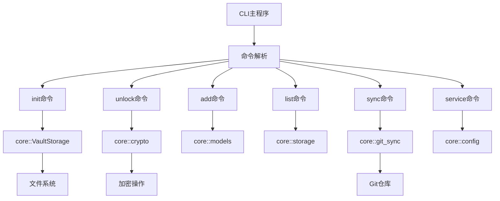
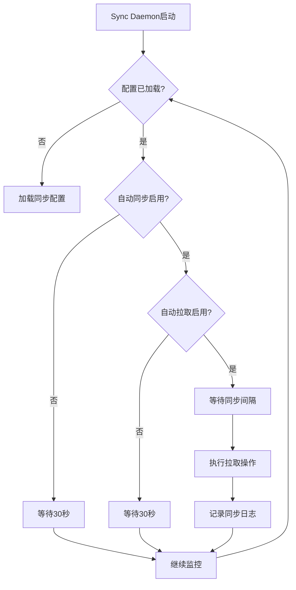
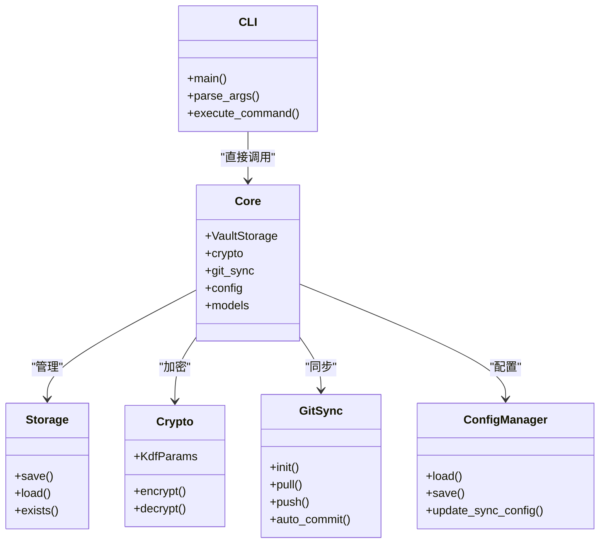

# 命令行工具参考

<cite>
**本文档中引用的文件**  
- [main.rs](file://cli/src/main.rs)
- [sync_daemon.rs](file://cli/src/sync_daemon.rs)
- [utils.rs](file://cli/src/utils.rs)
- [init.rs](file://cli/src/commands/init.rs)
- [add.rs](file://cli/src/commands/add.rs)
- [list.rs](file://cli/src/commands/list.rs)
- [show.rs](file://cli/src/commands/show.rs)
- [import.rs](file://cli/src/commands/import.rs)
- [service_start.rs](file://cli/src/commands/service_start.rs)
- [service_status.rs](file://cli/src/commands/service_status.rs)
- [sync_enable.rs](file://cli/src/commands/sync_enable.rs)
- [sync_status.rs](file://cli/src/commands/sync_status.rs)
</cite>

## 目录
1. [简介](#简介)
2. [CLI架构概述](#cli架构概述)
3. [核心命令参考](#核心命令参考)
4. [服务管理命令](#服务管理命令)
5. [同步功能](#同步功能)
6. [CLI与核心库集成](#cli与核心库集成)
7. [典型工作流示例](#典型工作流示例)
8. [故障排除](#故障排除)

## 简介
SecureFox CLI工具提供了一个强大而灵活的命令行接口，用于管理本地优先的密码保险库。本参考文档详细介绍了所有可用的CLI命令，包括参数说明、使用示例和预期输出。CLI直接与SecureFox核心库交互，无需通过API层，确保了高性能和直接访问所有功能。

**Section sources**
- [main.rs](file://cli/src/main.rs#L28-L415)

## CLI架构概述
SecureFox CLI采用模块化架构，主命令解析在`main.rs`中定义，各个子命令在独立的模块中实现。CLI使用`clap`库进行命令行参数解析，`tokio`进行异步操作，并直接调用`securefox_core`库执行核心功能。



**Diagram sources**
- [main.rs](file://cli/src/main.rs#L28-L415)
- [commands/mod.rs](file://cli/src/commands/mod.rs#L1-L31)

**Section sources**
- [main.rs](file://cli/src/main.rs#L1-L415)
- [commands/mod.rs](file://cli/src/commands/mod.rs#L1-L31)

## 核心命令参考

### init - 初始化保险库
初始化一个新的SecureFox保险库。

**参数说明**
- `--remote`: 远程Git仓库URL（可选）
- `--kdf`: 使用的KDF算法（pbkdf2或argon2，默认为pbkdf2）

**使用示例**
```bash
# 初始化本地保险库
securefox init

# 初始化并配置Git远程
securefox init --remote https://github.com/user/securefox-vault.git --kdf argon2
```

**预期输出**
```
Initializing new SecureFox vault...
Using Argon2id KDF (higher security, slower)
⚠ Note: Argon2 provides stronger protection against GPU-based attacks
  but may take 1-2 seconds for each unlock operation.
Encrypting vault...
✓ Vault initialized successfully
Setting up Git sync...
✓ Git remote configured
```

**Section sources**
- [init.rs](file://cli/src/commands/init.rs#L1-L89)

### add - 添加新项目
向保险库添加新项目。

**参数说明**
- `name`: 项目名称
- `--item-type`: 项目类型（login、note、card、identity，默认为login）
- `--username`: 用户名（仅限登录项目）
- `--generate`: 生成密码
- `--totp`: TOTP密钥

**使用示例**
```bash
# 添加登录项目
securefox add mywebsite --username user@example.com --generate

# 添加带TOTP的登录项目
securefox add google --username user@gmail.com --generate --totp "JBSWY3DPEHPK3PXP"
```

**预期输出**
```
Generated password: xK9#mN2!pL8&qW4*rT7
✓ Item 'mywebsite' added successfully
```

**Section sources**
- [add.rs](file://cli/src/commands/add.rs#L1-L109)

### list - 列出项目
列出保险库中的项目。

**参数说明**
- `--item-type`: 按类型过滤
- `--search`: 搜索查询
- `--detailed`: 显示详细信息

**使用示例**
```bash
# 列出所有项目
securefox list

# 按类型过滤
securefox list --item-type login

# 搜索项目
securefox list --search google --detailed
```

**预期输出**
```
┌─────────────────┬────────┬──────────────┐
│ Name            │ Type   │ Username     │
├─────────────────┼────────┼──────────────┤
│ mywebsite       │ Login  │ user@exam... │
│ work            │ Login  │ employee...  │
│ personal note   │ Note   │ -            │
└─────────────────┴────────┴──────────────┘
```

**Section sources**
- [list.rs](file://cli/src/commands/list.rs#L1-L146)

### show - 显示项目详情
显示特定项目的详细信息。

**参数说明**
- `name`: 项目ID或名称
- `--copy`: 将密码复制到剪贴板
- `--totp`: 显示TOTP代码

**使用示例**
```bash
# 显示项目详情
securefox show mywebsite

# 显示并复制密码
securefox show mywebsite --copy

# 显示TOTP代码
securefox show google --totp
```

**预期输出**
```
Name: mywebsite
Type: LOGIN
Username: user@example.com
Password: **************** (copied to clipboard)
URL 1: https://mywebsite.com
Created: 2024-01-15 10:30:45
Modified: 2024-01-15 10:30:45
```

**Section sources**
- [show.rs](file://cli/src/commands/show.rs#L1-L113)

### import - 导入数据
从其他密码管理器导入数据。

**参数说明**
- `file`: 导入文件路径
- `--format`: 导入格式（bitwarden、csv，默认为bitwarden）

**使用示例**
```bash
# 从Bitwarden导入
securefox import bitwarden_export.json --format bitwarden
```

**预期输出**
```
Importing from bitwarden_export.json
Found 42 items and 8 folders to import
Merging with existing vault...
Importing folder: Work
Importing: Google Account
Importing: GitHub
Import complete
✓ Successfully imported 42 items
```

**Section sources**
- [import.rs](file://cli/src/commands/import.rs#L1-L103)

## 服务管理命令

### service start - 启动后台服务
启动SecureFox后台服务。

**参数说明**
- `--port`: 监听端口（默认8787）
- `--host`: 绑定主机（默认127.0.0.1）
- `--timeout`: 解锁超时（秒，默认900）

**使用示例**
```bash
# 启动服务
securefox service start --port 8787 --host 127.0.0.1 --timeout 900
```

**预期输出**
```
✓ Service started successfully
  PID: 12345
  API: http://127.0.0.1:8787
  Vault: /home/user/.securefox
  Logs: /home/user/.securefox/service.log
```

**Section sources**
- [service_start.rs](file://cli/src/commands/service_start.rs#L1-L131)

### service status - 显示服务状态
显示后台服务的状态。

**使用示例**
```bash
# 检查服务状态
securefox service status
```

**预期输出**
```
Service Status
───────────────────────────────────
Status: Running
PID: 12345
API: http://127.0.0.1:8787
Uptime: 2:15:30
Memory: 45 MB
```

**Section sources**
- [service_status.rs](file://cli/src/commands/service_status.rs#L1-L80)

## 同步功能

### sync enable - 启用自动同步
启用自动同步功能。

**参数说明**
- `--mode`: 同步模式（manual或auto，默认manual）
- `--interval`: 同步间隔（秒，默认600）

**使用示例**
```bash
# 启用自动同步
securefox sync enable --mode auto --interval 600
```

**预期输出**
```
✓ Auto-sync enabled
  Mode: auto
  Pull interval: 600 seconds
  Automatic pull at intervals + push on vault changes
```

**Section sources**
- [sync_enable.rs](file://cli/src/commands/sync_enable.rs#L1-L44)

### sync status - 显示同步状态
显示同步配置和状态。

**使用示例**
```bash
# 检查同步状态
securefox sync status
```

**预期输出**
```
Sync Status
───────────────────────────────────

Git Configuration
Remote URL:  https://github.com/user/securefox-vault.git
Git Status:  Configured

Auto-Sync Configuration
Status:      Enabled
Mode:        Auto
             Pull interval: 600 seconds
             Automatic pull at intervals + push on vault changes
```

**Section sources**
- [sync_status.rs](file://cli/src/commands/sync_status.rs#L1-L57)

### sync_daemon - 自动同步守护进程
`sync_daemon.rs`实现了自动同步功能，通过后台守护进程定期检查并同步保险库更改。

**工作原理**
1. 守护进程在后台持续运行
2. 定期检查同步配置
3. 在自动模式下，按指定间隔执行拉取操作
4. 在保险库更改时自动执行推送操作



**Diagram sources**
- [sync_daemon.rs](file://cli/src/sync_daemon.rs#L1-L112)

**Section sources**
- [sync_daemon.rs](file://cli/src/sync_daemon.rs#L1-L112)

## CLI与核心库集成
SecureFox CLI直接使用核心库（core）来执行所有操作，绕过API层以获得更好的性能和更直接的控制。



**Diagram sources**
- [main.rs](file://cli/src/main.rs#L5-L415)
- [sync_daemon.rs](file://cli/src/sync_daemon.rs#L2-L112)
- [utils.rs](file://cli/src/utils.rs#L2-L40)

**Section sources**
- [main.rs](file://cli/src/main.rs#L5-L415)
- [sync_daemon.rs](file://cli/src/sync_daemon.rs#L2-L112)
- [utils.rs](file://cli/src/utils.rs#L2-L40)

## 典型工作流示例

### 初始化保险库
```bash
# 1. 初始化保险库
securefox init --remote https://github.com/user/securefox-vault.git --kdf argon2

# 2. 添加第一个项目
securefox add mywebsite --username user@example.com --generate

# 3. 启用自动同步
securefox sync enable --mode auto --interval 600

# 4. 启动后台服务
securefox service start --port 8787 --timeout 900
```

### 管理服务
```bash
# 检查服务状态
securefox service status

# 重启服务
securefox service restart --port 8787 --timeout 1800

# 停止服务
securefox service stop
```

### 执行同步
```bash
# 手动推送更改
securefox sync push

# 手动拉取更改
securefox sync pull

# 配置新的远程仓库
securefox sync config https://gitlab.com/user/securefox-vault.git

# 检查同步状态
securefox sync status
```

**Section sources**
- [init.rs](file://cli/src/commands/init.rs#L1-L89)
- [add.rs](file://cli/src/commands/add.rs#L1-L109)
- [sync_enable.rs](file://cli/src/commands/sync_enable.rs#L1-L44)
- [service_start.rs](file://cli/src/commands/service_start.rs#L1-L131)

## 故障排除

### 常见问题及解决方案

**问题：服务无法启动**
- **症状**：`Service failed to start. Check logs...`
- **解决方案**：
  1. 检查端口是否被占用：`lsof -i :8787`
  2. 检查PID文件：`rm ~/.securefox/service.pid`（如果进程未运行）
  3. 查看日志文件：`cat ~/.securefox/service.log`

**问题：同步失败**
- **症状**：`Git remote not configured`
- **解决方案**：
  1. 配置远程仓库：`securefox sync config https://github.com/user/repo.git`
  2. 检查Git凭据
  3. 验证网络连接

**问题：无法找到保险库**
- **症状**：`Vault not found. Run 'securefox init' to create one.`
- **解决方案**：
  1. 确认保险库路径
  2. 使用`--vault`参数指定路径：`securefox --vault /path/to/vault list`
  3. 初始化新保险库

**Section sources**
- [service_start.rs](file://cli/src/commands/service_start.rs#L1-L131)
- [sync_status.rs](file://cli/src/commands/sync_status.rs#L1-L57)
- [utils.rs](file://cli/src/utils.rs#L26-L40)