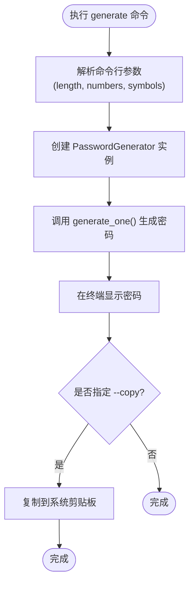
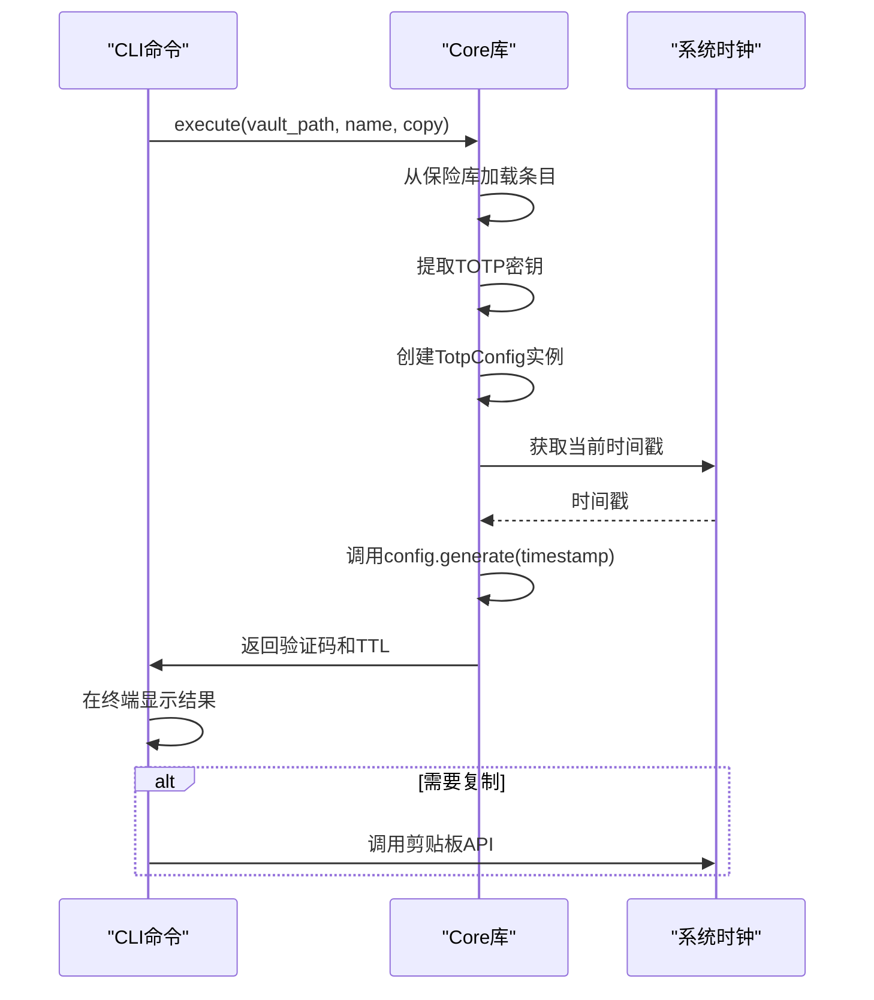
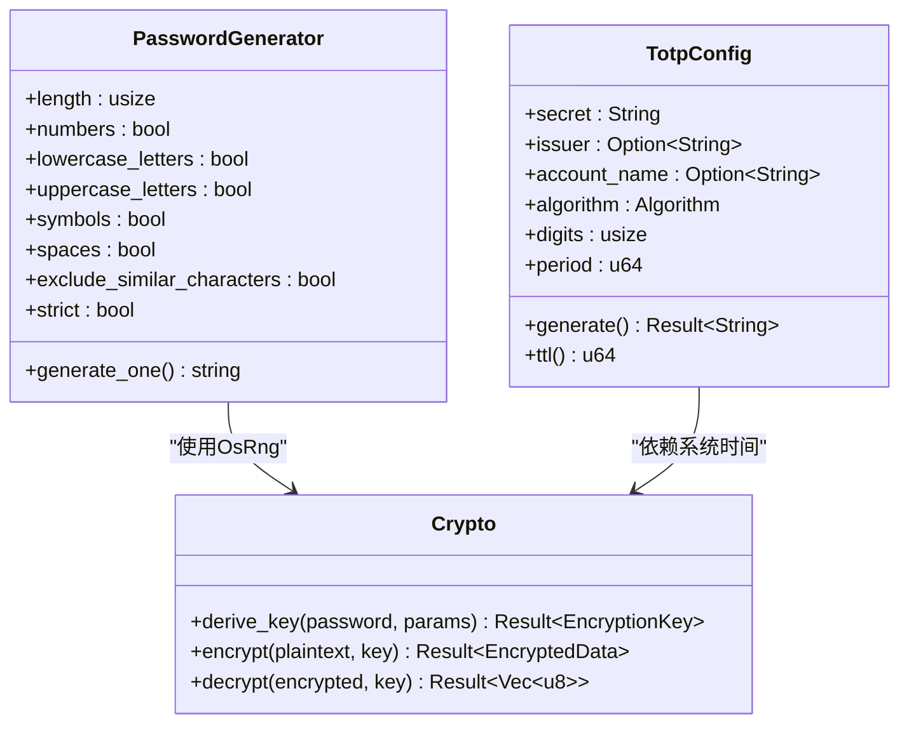

# 实用工具

<cite>
**本文档引用的文件**
- [generate.rs](file://cli/src/commands/generate.rs)
- [totp.rs](file://cli/src/commands/totp.rs)
- [crypto.rs](file://core/src/crypto.rs)
- [totp.rs](file://core/src/totp.rs)
- [PasswordGenerator.tsx](file://extension/components/PasswordGenerator.tsx)
- [mod.rs](file://api/src/handlers/mod.rs)
- [entries.ts](file://extension/lib/api/entries.ts)
</cite>

## 目录
1. [简介](#简介)
2. [密码生成](#密码生成)
3. [TOTP验证码生成](#totp验证码生成)
4. [使用示例](#使用示例)
5. [安全实现细节](#安全实现细节)
6. [常见问题解决](#常见问题解决)
7. [结论](#结论)

## 简介
SecureFox提供了一套强大的实用工具命令，旨在帮助用户安全地管理密码和双因素认证（2FA）凭证。本文档详细介绍了`generate`和`totp`两个核心命令的功能、配置选项和使用方法。`generate`命令能够创建高强度的随机密码，支持自定义长度和字符集；`totp`命令则能为指定账户生成当前有效的TOTP验证码。这些功能通过SecureFox的核心加密库实现，确保了生成结果的随机性和安全性。

**Section sources**
- [generate.rs](file://cli/src/commands/generate.rs)
- [totp.rs](file://cli/src/commands/totp.rs)

## 密码生成
`generate`命令是SecureFox中用于创建高强度密码的核心工具。它通过密码学安全的随机数生成器，确保生成的密码具有足够的熵值，难以被猜测或破解。

### 配置选项
该命令提供了多个配置参数，允许用户根据具体需求定制生成的密码：

- **长度**：通过`--length`或`-l`参数指定密码长度，默认为16位。
- **数字**：通过`--numbers`或`-n`参数决定是否包含数字，默认为`true`。
- **符号**：通过`--symbols`或`-s`参数决定是否包含特殊符号，默认为`false`。
- **复制到剪贴板**：通过`--copy`或`-c`参数，生成后自动将密码复制到系统剪贴板。

### 随机性保证
密码的随机性由`core`库中的`crypto`模块保证。该模块使用操作系统提供的加密安全随机数生成器（`OsRng`）来初始化`PasswordGenerator`，确保了密码生成过程的不可预测性。



**Diagram sources**
- [generate.rs](file://cli/src/commands/generate.rs)
- [placeholder.rs](file://cli/src/commands/placeholder.rs)

**Section sources**
- [generate.rs](file://cli/src/commands/generate.rs)
- [placeholder.rs](file://cli/src/commands/placeholder.rs)
- [crypto.rs](file://core/src/crypto.rs)

## TOTP验证码生成
`totp`命令用于为已存储的账户条目生成当前有效的基于时间的一次性密码（TOTP），这是双因素认证（2FA）的常见形式。

### 工作流程
1. **查找条目**：根据提供的名称或ID在保险库中查找对应的账户条目。
2. **提取密钥**：从条目中获取预先存储的TOTP密钥（Secret）。
3. **生成代码**：使用TOTP算法，结合当前时间戳，生成6位（或指定长度）的验证码。
4. **显示结果**：在终端输出验证码及其剩余有效时间。

### 配置选项
- **账户标识**：通过`name`参数指定需要生成验证码的账户条目。
- **复制到剪贴板**：通过`--copy`或`-c`参数，生成后自动将验证码复制到系统剪贴板。

### TOTP算法实现
TOTP功能由`core`库中的`totp`模块实现。该模块基于`totp-rs`库，遵循RFC 6238标准。`TotpConfig`结构体封装了生成验证码所需的所有参数，包括密钥、算法（默认SHA1）、位数（默认6位）和周期（默认30秒）。



**Diagram sources**
- [totp.rs](file://cli/src/commands/totp.rs)
- [totp.rs](file://core/src/totp.rs)

**Section sources**
- [totp.rs](file://cli/src/commands/totp.rs)
- [totp.rs](file://core/src/totp.rs)

## 使用示例
以下是一些常见的使用场景和命令示例。

### 生成高强度密码
要生成一个16位长、包含数字和符号的密码，并自动复制到剪贴板，可以使用以下命令：
```bash
securefox generate --length 16 --numbers true --symbols true --copy
```

### 获取Google账户的TOTP代码
假设您的Google账户条目在SecureFox中名为`google-account`，要获取其当前的TOTP验证码并复制到剪贴板，可以使用：
```bash
securefox totp google-account --copy
```

**Section sources**
- [main.rs](file://cli/src/main.rs)
- [PasswordGenerator.tsx](file://extension/components/PasswordGenerator.tsx)
- [entries.ts](file://extension/lib/api/entries.ts)

## 安全实现细节
SecureFox的实用工具在设计上高度重视安全性，其核心实现细节如下。

### 密码生成的安全性
- **随机源**：使用`OsRng`（操作系统随机数生成器），这是一个密码学安全的伪随机数生成器（CSPRNG）。
- **字符集**：默认包含大小写字母、数字和符号，可选排除易混淆字符（如`0`和`O`）。
- **熵值**：通过足够长的密码和多样化的字符集，确保密码的熵值远高于常见破解阈值。

### TOTP实现的安全性
- **密钥处理**：TOTP密钥在存储和处理过程中受到保护，`parse_totp_secret`函数会清理输入（去除空格、转为大写）并验证其Base32编码的有效性。
- **时间同步**：生成的验证码基于当前系统时间，`ttl`方法可查询代码的剩余有效期，帮助用户判断是否需要重新生成。
- **错误处理**：对无效的TOTP URI或密钥有明确的错误处理机制，防止信息泄露。



**Diagram sources**
- [crypto.rs](file://core/src/crypto.rs)
- [totp.rs](file://core/src/totp.rs)

**Section sources**
- [crypto.rs](file://core/src/crypto.rs)
- [totp.rs](file://core/src/totp.rs)

## 常见问题解决
### 生成的密码不符合网站要求
某些网站对密码有特殊要求（如必须包含特定符号或不能包含某些字符）。SecureFox的`generate`命令目前不支持排除特定字符集。**解决方案**：如果生成的密码被拒绝，可以多次执行`generate`命令直到获得符合要求的密码，或者手动调整密码。

### TOTP时间同步问题
如果TOTP验证码总是无效，最可能的原因是您的设备系统时间与标准时间不同步。**解决方案**：
1. 检查并确保您的计算机或手机的系统时间是准确的，并开启了自动时间同步。
2. 使用`totp`命令的输出中的`ttl`（Time To Live）值来确认代码是否仍在有效期内。
3. 如果问题持续存在，尝试重新导入TOTP密钥，确保在设置2FA时正确扫描了二维码或输入了密钥。

**Section sources**
- [totp.rs](file://core/src/totp.rs)
- [PasswordGenerator.tsx](file://extension/components/PasswordGenerator.tsx)

## 结论
SecureFox的`generate`和`totp`命令为用户提供了强大且安全的密码管理功能。通过深入理解这些命令的配置选项、工作原理和安全实现，用户可以更有效地保护自己的在线账户。这些工具不仅简化了高强度密码和2FA验证码的创建过程，还通过密码学上可靠的实现，确保了整个过程的安全性。建议用户充分利用这些功能，并结合定期的系统时间校准，以获得最佳的安全体验。