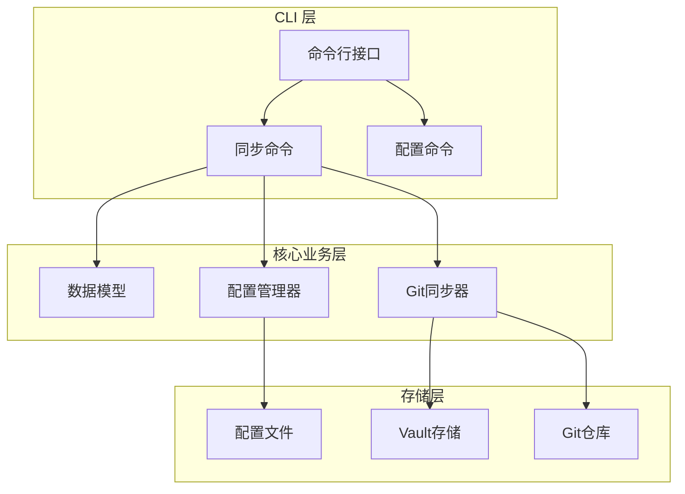

# 同步启用与禁用

<cite>
**本文档中引用的文件**
- [sync_enable.rs](file://cli/src/commands/sync_enable.rs)
- [sync_disable.rs](file://cli/src/commands/sync_disable.rs)
- [sync_config.rs](file://cli/src/commands/sync_config.rs)
- [sync_status.rs](file://cli/src/commands/sync_status.rs)
- [models.rs](file://core/src/models.rs)
- [config.rs](file://core/src/config.rs)
- [sync_daemon.rs](file://cli/src/sync_daemon.rs)
- [git_sync.rs](file://core/src/git_sync.rs)
- [main.rs](file://cli/src/main.rs)
</cite>

## 目录
1. [简介](#简介)
2. [项目结构概览](#项目结构概览)
3. [核心组件分析](#核心组件分析)
4. [架构概览](#架构概览)
5. [详细组件分析](#详细组件分析)
6. [配置管理](#配置管理)
7. [自动同步机制](#自动同步机制)
8. [使用示例](#使用示例)
9. [故障排除指南](#故障排除指南)
10. [总结](#总结)

## 简介

SecureFox 提供了一套完整的密码管理器同步功能，支持手动和自动两种同步模式。通过 `sync enable` 和 `sync disable` 命令，用户可以灵活地控制密码库的同步行为，并通过配置文件持久化设置。

该系统基于 Git 技术实现，支持远程仓库同步，提供了智能的冲突解决机制和定时拉取功能。自动同步模式可以在指定的时间间隔内定期从远程仓库拉取更新，并在本地发生变更时自动推送。

## 项目结构概览

SecureFox 的同步功能分布在多个模块中，形成了清晰的分层架构：



**图表来源**
- [main.rs](file://cli/src/main.rs#L193-L231)
- [models.rs](file://core/src/models.rs#L297-L377)
- [config.rs](file://core/src/config.rs#L18-L98)

**章节来源**
- [main.rs](file://cli/src/main.rs#L193-L231)
- [models.rs](file://core/src/models.rs#L1-L416)

## 核心组件分析

### SyncMode 枚举类型

SyncMode 是同步模式的核心抽象，定义了两种主要的同步策略：


**图表来源**
- [models.rs](file://core/src/models.rs#L335-L362)

### SyncConfig 数据结构

SyncConfig 结构体封装了完整的同步配置信息：

| 字段名 | 类型 | 描述 | 默认值 |
|--------|------|------|--------|
| enabled | bool | 是否启用同步功能 | true |
| mode | SyncMode | 同步模式配置 | Manual |

**章节来源**
- [models.rs](file://core/src/models.rs#L297-L377)

## 架构概览

SecureFox 的同步架构采用事件驱动的设计模式，支持异步操作和定时任务：


**图表来源**
- [sync_enable.rs](file://cli/src/commands/sync_enable.rs#L7-L43)
- [sync_daemon.rs](file://cli/src/sync_daemon.rs#L42-L81)
- [git_sync.rs](file://core/src/git_sync.rs#L167-L209)

## 详细组件分析

### sync enable 命令实现

`sync enable` 命令负责启用自动同步功能，支持手动和自动两种模式：


**图表来源**
- [sync_enable.rs](file://cli/src/commands/sync_enable.rs#L7-L43)

#### 支持的同步模式

| 模式 | 描述 | 使用场景 |
|------|------|----------|
| manual | 手动同步 | 不需要自动同步的场景 |
| auto | 自动同步 | 需要定期同步的场景，可指定同步间隔 |

**章节来源**
- [sync_enable.rs](file://cli/src/commands/sync_enable.rs#L17-L21)

### sync disable 命令实现

`sync disable` 命令用于禁用自动同步功能：


**图表来源**
- [sync_disable.rs](file://cli/src/commands/sync_disable.rs#L7-L28)

**章节来源**
- [sync_disable.rs](file://cli/src/commands/sync_disable.rs#L1-L29)

### 同步守护进程

同步守护进程是自动同步功能的核心组件，负责按计划执行同步操作：


**图表来源**
- [sync_daemon.rs](file://cli/src/sync_daemon.rs#L42-L81)

**章节来源**
- [sync_daemon.rs](file://cli/src/sync_daemon.rs#L1-L112)

## 配置管理

### 配置文件结构

配置文件存储在 `~/.securefox/config` 路径下，采用 JSON 格式：


**图表来源**
- [config.rs](file://core/src/config.rs#L18-L98)
- [models.rs](file://core/src/models.rs#L366-L377)

### 配置持久化流程


**图表来源**
- [config.rs](file://core/src/config.rs#L68-L91)

**章节来源**
- [config.rs](file://core/src/config.rs#L1-L99)

## 自动同步机制

### 定时拉取机制

自动同步采用基于时间间隔的轮询机制：


**图表来源**
- [sync_daemon.rs](file://cli/src/sync_daemon.rs#L48-L76)

### Git 同步工作流

Git 同步器实现了完整的版本控制功能：


**图表来源**
- [git_sync.rs](file://core/src/git_sync.rs#L167-L209)

**章节来源**
- [git_sync.rs](file://core/src/git_sync.rs#L1-L503)

## 使用示例

### 启用自动同步

```bash
# 启用手动同步模式（默认）
securefox sync enable --mode manual

# 启用自动同步，每10分钟拉取一次
securefox sync enable --mode auto --interval 600

# 查看当前同步状态
securefox sync status
```

### 禁用同步

```bash
# 禁用自动同步
securefox sync disable

# 查看禁用后的状态
securefox sync status
```

### 配置远程仓库

```bash
# 配置Git远程仓库
securefox sync config https://github.com/user/vault.git

# 验证配置
securefox sync status
```

### 完整配置示例

以下是一个典型的自动同步配置示例：

```json
{
  "remoteUrl": "https://github.com/user/vault.git",
  "syncConfig": {
    "enabled": true,
    "mode": {
      "type": "Auto",
      "intervalSeconds": 600
    }
  }
}
```

**章节来源**
- [sync_enable.rs](file://cli/src/commands/sync_enable.rs#L7-L43)
- [sync_disable.rs](file://cli/src/commands/sync_disable.rs#L7-L28)
- [sync_status.rs](file://cli/src/commands/sync_status.rs#L7-L56)

## 故障排除指南

### 常见问题及解决方案

| 问题 | 可能原因 | 解决方案 |
|------|----------|----------|
| Vault 不存在 | 未初始化或路径错误 | 先执行 `securefox init` 初始化 |
| 同步失败 | 网络连接或认证问题 | 检查网络连接和SSH密钥配置 |
| 配置文件损坏 | JSON格式错误 | 删除 `~/.securefox/config` 文件重新配置 |
| 权限错误 | 文件权限不足 | 检查配置文件和仓库目录权限 |

### 调试技巧

1. **查看详细状态**：使用 `securefox sync status` 查看完整配置信息
2. **检查配置文件**：直接编辑 `~/.securefox/config` 文件进行调试
3. **测试Git连接**：手动运行Git命令测试远程连接
4. **查看日志**：启用调试模式获取详细日志信息

**章节来源**
- [sync_status.rs](file://cli/src/commands/sync_status.rs#L1-L57)

## 总结

SecureFox 的同步功能提供了一个完整而灵活的密码管理器同步解决方案。通过 `sync enable` 和 `sync disable` 命令，用户可以轻松控制同步行为，支持手动和自动两种模式。自动同步机制基于定时轮询，确保数据的一致性，同时提供了智能的冲突解决能力。

配置文件的持久化设计使得用户的同步偏好能够长期保存，而Git技术的应用则保证了版本控制和协作能力。整个系统采用了事件驱动的架构设计，支持异步操作和定时任务，为用户提供流畅的使用体验。