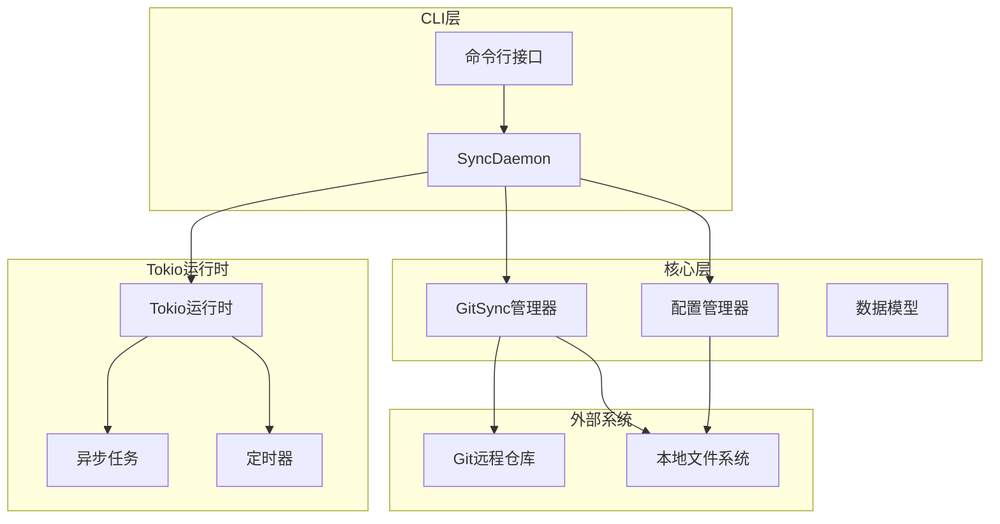
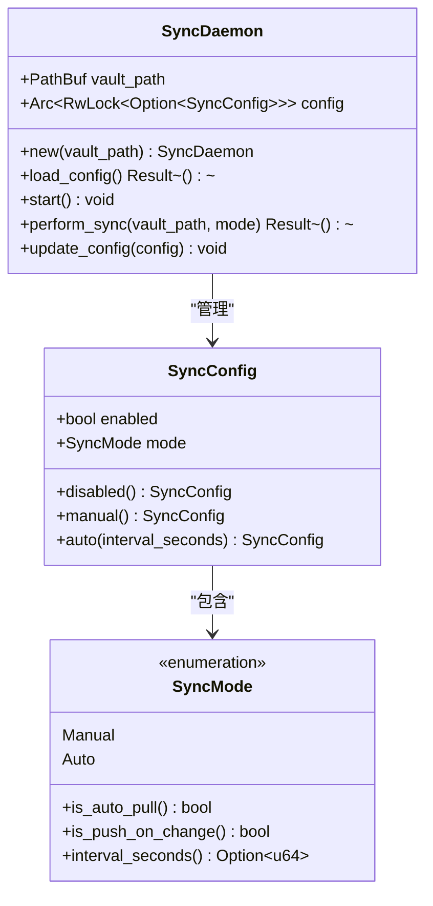
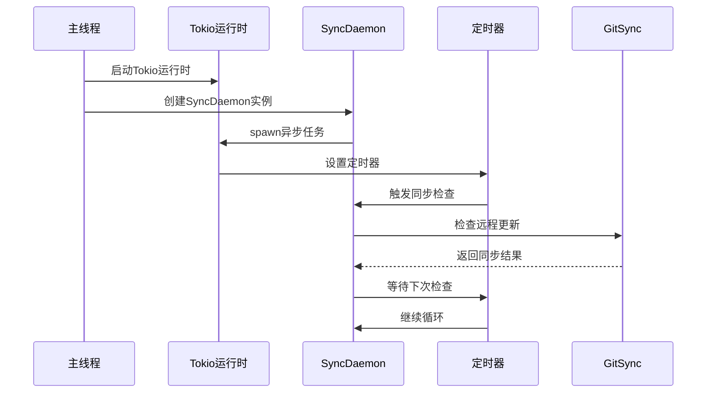
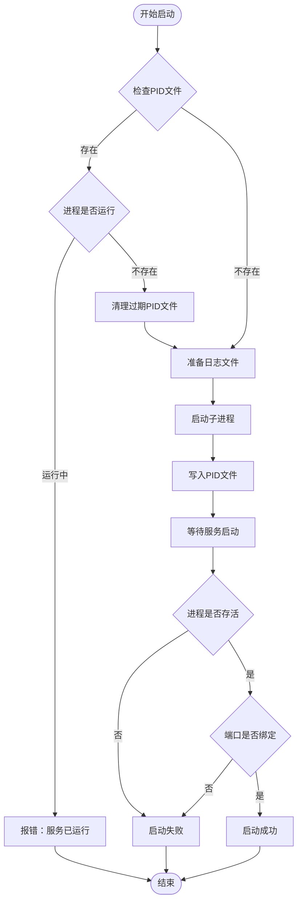
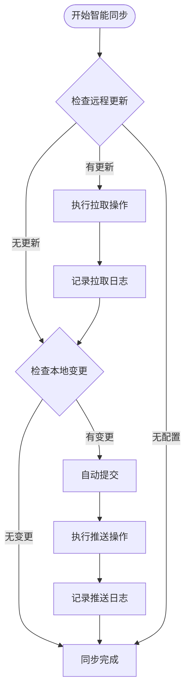
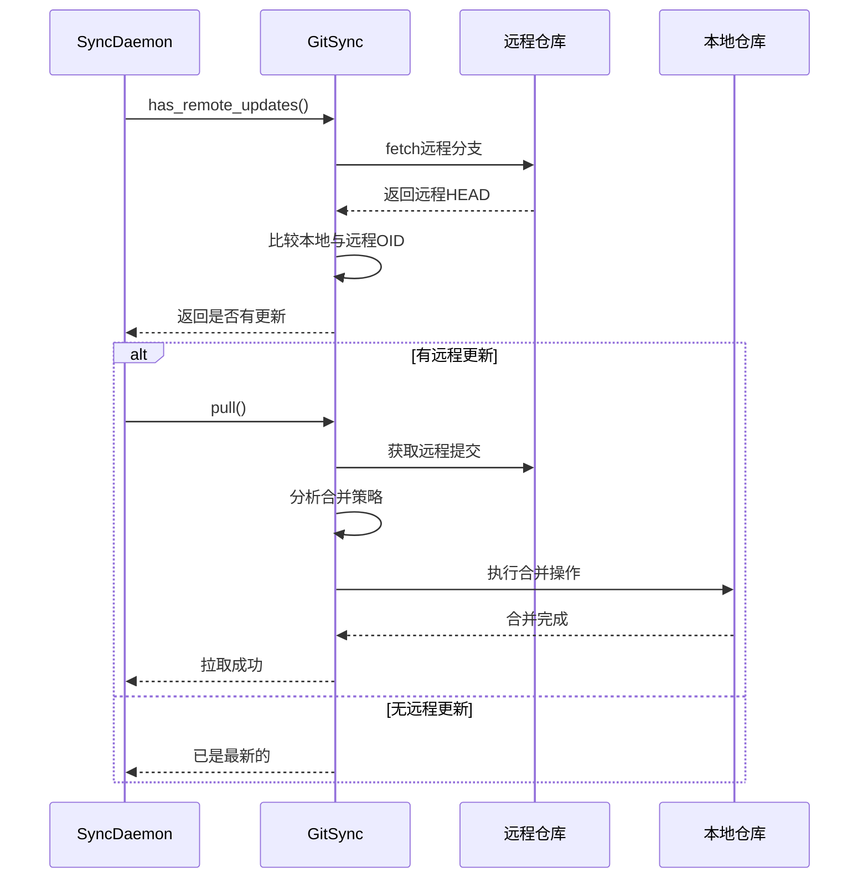
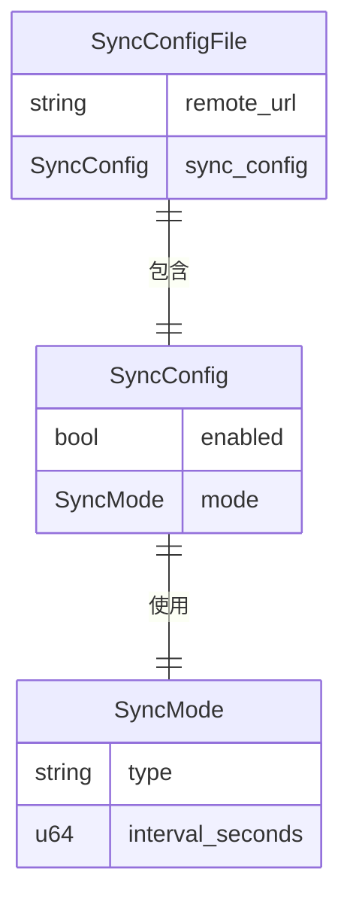
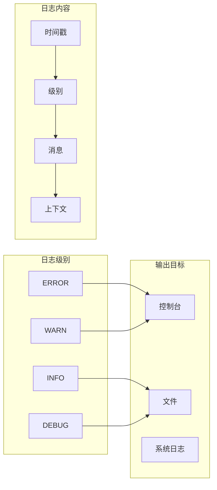

# 同步守护进程

<cite>
**本文档中引用的文件**
- [sync_daemon.rs](file://cli/src/sync_daemon.rs)
- [git_sync.rs](file://core/src/git_sync.rs)
- [main.rs](file://cli/src/main.rs)
- [service_start.rs](file://cli/src/commands/service_start.rs)
- [service_stop.rs](file://cli/src/commands/service_stop.rs)
- [service_run.rs](file://cli/src/commands/service_run.rs)
- [models.rs](file://core/src/models.rs)
- [config.rs](file://core/src/config.rs)
- [sync_enable.rs](file://cli/src/commands/sync_enable.rs)
- [sync_status.rs](file://cli/src/commands/sync_status.rs)
</cite>

## 目录
1. [简介](#简介)
2. [系统架构概览](#系统架构概览)
3. [SyncDaemon核心组件](#syncdaemon核心组件)
4. [Tokio运行时与异步任务管理](#tokio运行时与异步任务管理)
5. [守护进程生命周期管理](#守护进程生命周期管理)
6. [智能同步机制](#智能同步机制)
7. [配置管理系统](#配置管理系统)
8. [日志记录与调试](#日志记录与调试)
9. [故障排除指南](#故障排除指南)
10. [最佳实践建议](#最佳实践建议)

## 简介

SecureFox的同步守护进程是一个基于Tokio异步运行时的后台服务，负责监控保险库变化并自动执行同步操作。该系统采用事件驱动的架构，支持多种同步模式，包括手动同步和自动同步（仅拉取远程更新）。

同步守护进程的核心功能包括：
- 基于时间间隔的自动拉取同步
- 智能检测远程仓库变更
- 配置热重载支持
- 生命周期管理（启动、停止、重启）
- 完整的日志记录和错误处理

## 系统架构概览



**图表来源**
- [sync_daemon.rs](file://cli/src/sync_daemon.rs#L12-L112)
- [git_sync.rs](file://core/src/git_sync.rs#L13-L503)
- [main.rs](file://cli/src/main.rs#L294-L405)

## SyncDaemon核心组件

SyncDaemon是同步守护进程的核心结构体，负责协调所有同步活动。

### 核心数据结构



**图表来源**
- [sync_daemon.rs](file://cli/src/sync_daemon.rs#L14-L112)
- [models.rs](file://core/src/models.rs#L298-L363)

### 初始化与配置加载

SyncDaemon通过以下流程进行初始化：

1. **创建实例**：指定保险库路径并初始化配置锁
2. **配置加载**：从配置文件加载同步设置
3. **配置验证**：确保配置的有效性
4. **状态同步**：建立与远程仓库的连接状态

**章节来源**
- [sync_daemon.rs](file://cli/src/sync_daemon.rs#L19-L59)

## Tokio运行时与异步任务管理

### 异步任务架构



**图表来源**
- [sync_daemon.rs](file://cli/src/sync_daemon.rs#L47-L81)

### 定时器管理机制

SyncDaemon使用Tokio的定时器功能实现周期性同步：

- **活跃状态**：当启用自动同步且配置有效时，使用指定的时间间隔
- **休眠状态**：当配置无效或禁用时，每30秒检查一次配置状态
- **优雅关闭**：支持中断当前同步操作并安全退出

**章节来源**
- [sync_daemon.rs](file://cli/src/sync_daemon.rs#L62-L81)

## 守护进程生命周期管理

### 服务启动流程



**图表来源**
- [service_start.rs](file://cli/src/commands/service_start.rs#L14-L91)

### 服务停止流程

服务停止采用两阶段策略：

1. **优雅停止**：发送SIGTERM信号等待进程正常退出
2. **强制停止**：如果优雅停止失败，发送SIGKILL信号

**章节来源**
- [service_stop.rs](file://cli/src/commands/service_stop.rs#L18-L65)

### 进程监控机制

系统实现了跨平台的进程监控：

- **Unix系统**：使用`kill -0`检查进程是否存在
- **Windows系统**：需要额外的实现支持
- **端口检测**：验证服务是否正确绑定到指定端口

**章节来源**
- [service_start.rs](file://cli/src/commands/service_start.rs#L94-L130)

## 智能同步机制

### smart_sync方法详解

GitSync的smart_sync方法实现了智能双向同步策略：



**图表来源**
- [git_sync.rs](file://core/src/git_sync.rs#L442-L461)

### 自动同步策略

在自动同步模式下，系统采用以下策略：

1. **拉取优先**：定期检查远程仓库是否有新更新
2. **推送触发**：本地保险库发生变化时自动推送
3. **冲突处理**：智能合并JSON格式的保险库数据
4. **状态跟踪**：记录每次同步的结果和状态

**章节来源**
- [git_sync.rs](file://core/src/git_sync.rs#L80-L221)

### 拉取策略实现



**图表来源**
- [git_sync.rs](file://core/src/git_sync.rs#L403-L441)
- [sync_daemon.rs](file://cli/src/sync_daemon.rs#L84-L98)

## 配置管理系统

### 配置层次结构



**图表来源**
- [models.rs](file://core/src/models.rs#L366-L377)
- [models.rs](file://core/src/models.rs#L298-L363)

### 配置管理功能

ConfigManager提供了完整的配置管理能力：

- **配置持久化**：自动保存和加载配置文件
- **默认值处理**：提供合理的默认配置
- **验证机制**：确保配置的一致性和有效性
- **热重载支持**：支持运行时更新配置

**章节来源**
- [config.rs](file://core/src/config.rs#L19-L98)

### 同步模式配置

系统支持两种主要的同步模式：

| 模式 | 描述 | 使用场景 |
|------|------|----------|
| Manual | 手动同步 | 开发环境、测试环境 |
| Auto | 自动同步 | 生产环境、日常使用 |
| Auto模式详细配置 | 包含时间间隔参数 | 可根据需求调整同步频率 |

**章节来源**
- [models.rs](file://core/src/models.rs#L335-L363)
- [sync_enable.rs](file://cli/src/commands/sync_enable.rs#L17-L42)

## 日志记录与调试

### 日志系统架构



### 日志配置选项

系统支持多种日志配置：

- **环境变量过滤**：通过`RUST_LOG`环境变量控制日志级别
- **彩色输出**：开发环境下启用彩色日志
- **结构化日志**：生产环境下使用结构化日志格式
- **性能优化**：异步日志记录避免阻塞主线程

**章节来源**
- [main.rs](file://cli/src/main.rs#L298-L300)
- [service_run.rs](file://cli/src/commands/service_run.rs#L24-L46)

### 调试技巧

1. **启用详细日志**：设置`RUST_LOG=debug`获取详细信息
2. **检查配置文件**：验证`~/.securefox/config`文件的正确性
3. **监控PID文件**：检查`service.pid`文件确认服务状态
4. **查看日志文件**：分析`service.log`和`service.err`文件
5. **网络诊断**：使用Git工具手动测试远程连接

## 故障排除指南

### 常见问题诊断

| 问题类型 | 症状 | 可能原因 | 解决方案 |
|----------|------|----------|----------|
| 启动失败 | 服务无法启动 | PID文件冲突、权限问题 | 清理PID文件，检查权限 |
| 同步失败 | 无法连接远程仓库 | 网络问题、认证失败 | 检查网络连接，验证凭据 |
| 配置无效 | 同步未生效 | 配置文件损坏、模式错误 | 重新配置同步模式 |
| 性能问题 | 同步速度慢 | 网络延迟、大文件传输 | 优化网络环境，分批同步 |

### 调试命令

```bash
# 查看服务状态
securefox service status

# 查看同步配置
securefox sync status

# 启用调试日志
RUST_LOG=debug securefox service start

# 手动同步测试
securefox sync pull
securefox sync push
```

### 日志分析方法

1. **错误定位**：查找ERROR级别的日志条目
2. **时间关联**：结合时间戳分析问题发生时机
3. **上下文提取**：关注相关的上下文信息
4. **重复模式**：识别重复出现的问题模式

**章节来源**
- [service_start.rs](file://cli/src/commands/service_start.rs#L67-L70)
- [service_stop.rs](file://cli/src/commands/service_stop.rs#L49-L50)

## 最佳实践建议

### 部署建议

1. **环境隔离**：为不同环境使用独立的配置文件
2. **权限控制**：确保保险库目录的适当权限设置
3. **备份策略**：定期备份配置文件和保险库数据
4. **监控告警**：设置同步状态的监控和告警机制

### 性能优化

1. **同步频率**：根据实际需求调整自动同步间隔
2. **网络优化**：使用稳定的网络连接和合适的SSH密钥
3. **资源管理**：监控内存和CPU使用情况
4. **并发控制**：避免同时运行多个同步实例

### 安全考虑

1. **密钥管理**：妥善保管SSH私钥和访问凭据
2. **网络加密**：确保使用HTTPS或SSH协议
3. **访问控制**：限制对保险库文件的直接访问
4. **审计日志**：记录重要的同步操作和变更

### 维护建议

1. **定期检查**：定期验证同步配置和连接状态
2. **版本兼容**：注意软件版本升级对配置的影响
3. **故障演练**：定期进行故障恢复演练
4. **文档更新**：保持运维文档的及时更新

通过遵循这些最佳实践，可以确保同步守护进程的稳定运行和高效维护，为用户提供可靠的保险库同步服务。