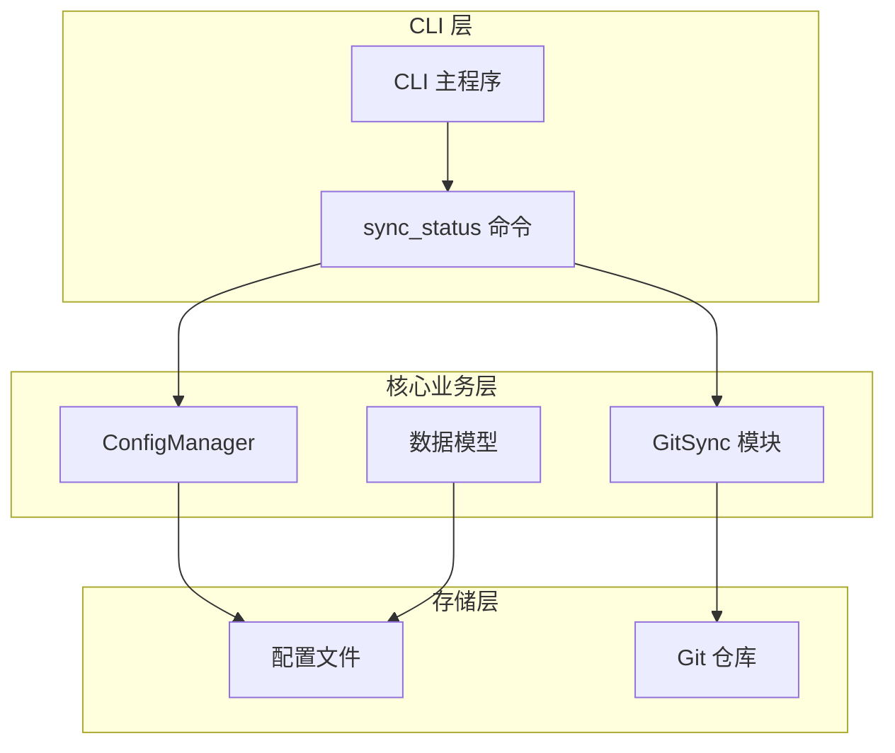
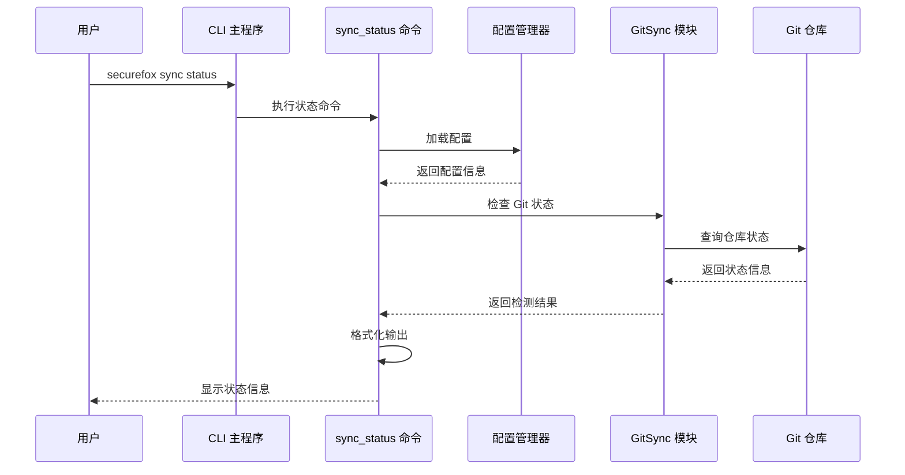
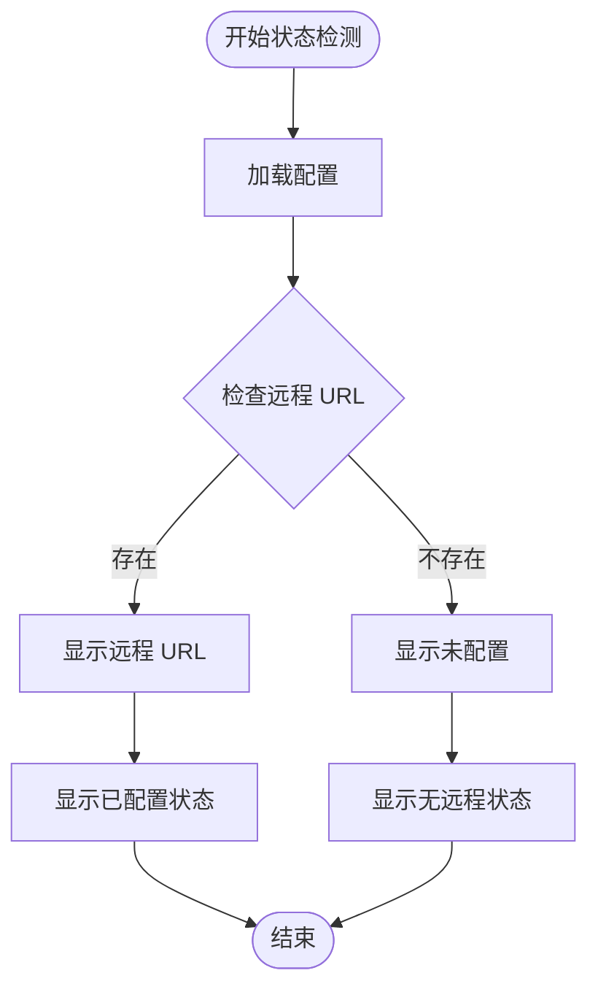
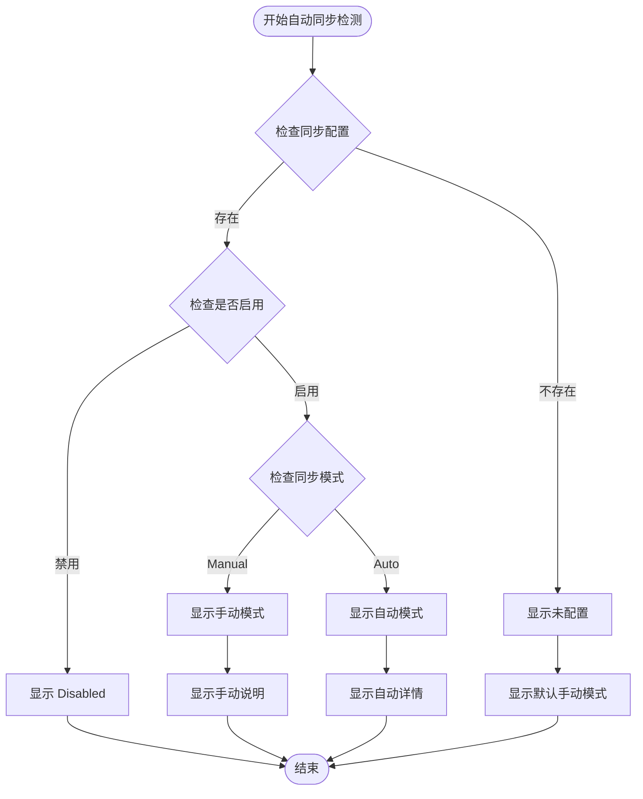
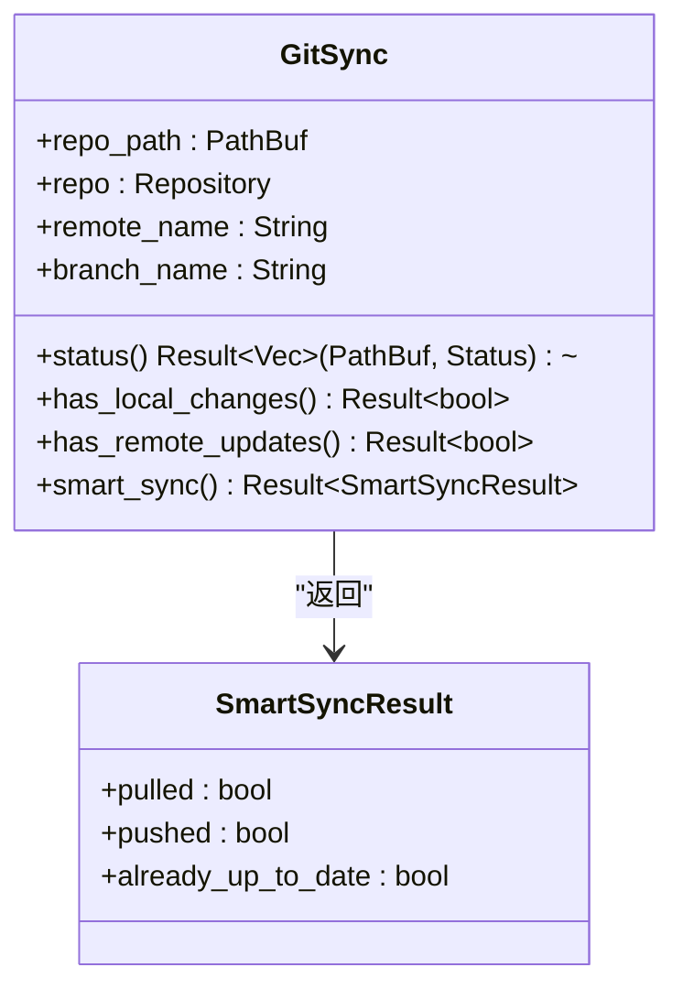
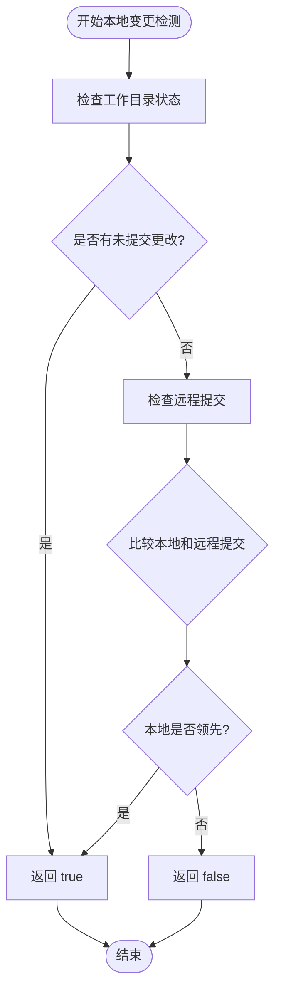
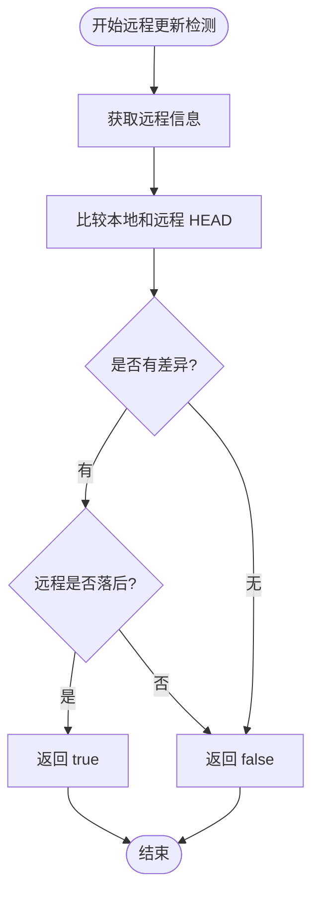

# 同步状态监控

<cite>
**本文档中引用的文件**
- [sync_status.rs](file://cli/src/commands/sync_status.rs)
- [git_sync.rs](file://core/src/git_sync.rs)
- [models.rs](file://core/src/models.rs)
- [config.rs](file://core/src/config.rs)
- [main.rs](file://cli/src/main.rs)
- [sync_daemon.rs](file://cli/src/sync_daemon.rs)
</cite>

## 目录
1. [简介](#简介)
2. [项目结构概览](#项目结构概览)
3. [核心组件分析](#核心组件分析)
4. [架构概览](#架构概览)
5. [详细组件分析](#详细组件分析)
6. [状态检测技术实现](#状态检测技术实现)
7. [实用示例与场景分析](#实用示例与场景分析)
8. [故障排除指南](#故障排除指南)
9. [总结](#总结)

## 简介

SecureFox 是一个本地优先的密码管理器，支持通过 Git 进行同步。同步状态监控功能是 SecureFox 的核心特性之一，它提供了全面的同步状态信息展示，帮助用户了解当前的同步配置和状态。

本文档详细介绍了 `sync status` 命令的输出信息和含义，解释了 Git 配置状态（已配置/未配置）和自动同步配置（启用/禁用）的显示逻辑，并结合 `git_sync` 模块的状态检测方法，为用户提供清晰的同步状态视图。

## 项目结构概览

SecureFox 的同步状态监控功能分布在多个模块中，形成了完整的同步生态系统：



**图表来源**
- [main.rs](file://cli/src/main.rs#L353-L369)
- [sync_status.rs](file://cli/src/commands/sync_status.rs#L1-L57)
- [git_sync.rs](file://core/src/git_sync.rs#L1-L503)

**章节来源**
- [main.rs](file://cli/src/main.rs#L1-L405)
- [sync_status.rs](file://cli/src/commands/sync_status.rs#L1-L57)

## 核心组件分析

### sync_status 命令处理器

`sync_status` 命令是同步状态监控的主要入口点，负责收集和格式化所有相关的同步信息。

主要功能：
- 加载配置管理器
- 获取当前配置状态
- 格式化输出 Git 配置信息
- 显示自动同步配置详情

### GitSync 模块

GitSync 模块提供了完整的 Git 操作能力，包括状态检测、远程更新检查等核心功能。

关键方法：
- `status()` - 获取当前工作目录状态
- `has_local_changes()` - 检查本地是否有未提交更改
- `has_remote_updates()` - 检查远程是否有可用更新

### 配置管理系统

配置管理系统负责管理同步相关的配置信息，包括远程仓库 URL 和自动同步设置。

**章节来源**
- [sync_status.rs](file://cli/src/commands/sync_status.rs#L7-L56)
- [git_sync.rs](file://core/src/git_sync.rs#L351-L440)
- [config.rs](file://core/src/config.rs#L1-L99)

## 架构概览

同步状态监控系统采用分层架构设计，确保了功能的模块化和可维护性：



**图表来源**
- [main.rs](file://cli/src/main.rs#L363-L364)
- [sync_status.rs](file://cli/src/commands/sync_status.rs#L8-L9)
- [git_sync.rs](file://core/src/git_sync.rs#L351-L440)

## 详细组件分析

### Git 配置状态检测

Git 配置状态的检测逻辑相对简单但关键：



**图表来源**
- [sync_status.rs](file://cli/src/commands/sync_status.rs#L17-L23)

#### Git 配置状态的显示逻辑

1. **远程 URL 存在时**：
   - 显示绿色的远程 URL
   - 显示 "Configured"（已配置）
   - 表示 Git 同步功能已正确配置

2. **远程 URL 不存在时**：
   - 显示黄色的 "Not configured"
   - 显示 "No remote"（无远程）
   - 表示尚未配置 Git 远程仓库

### 自动同步配置状态

自动同步配置提供了更复杂的状态信息：



**图表来源**
- [sync_status.rs](file://cli/src/commands/sync_status.rs#L29-L53)
- [models.rs](file://core/src/models.rs#L334-L363)

#### 自动同步配置的详细信息

1. **启用状态**：
   - 绿色显示 "Enabled"（启用）
   - 红色显示 "Disabled"（禁用）

2. **同步模式**：
   - **Manual（手动）**：用户需要手动执行同步操作
   - **Auto（自动）**：系统会定期自动拉取更新，并在本地有更改时推送

3. **自动同步详情**：
   - 显示拉取间隔时间（秒）
   - 说明自动同步的工作原理

**章节来源**
- [sync_status.rs](file://cli/src/commands/sync_status.rs#L26-L53)
- [models.rs](file://core/src/models.rs#L334-L363)

## 状态检测技术实现

### status 方法实现

`status` 方法用于获取当前 Git 工作目录的状态信息：



**图表来源**
- [git_sync.rs](file://core/src/git_sync.rs#L351-L462)

### has_local_changes 方法

该方法检测本地是否有未提交或未推送的更改：



**图表来源**
- [git_sync.rs](file://core/src/git_sync.rs#L365-L401)

### has_remote_updates 方法

该方法检测远程仓库是否有可用的更新：



**图表来源**
- [git_sync.rs](file://core/src/git_sync.rs#L403-L440)

**章节来源**
- [git_sync.rs](file://core/src/git_sync.rs#L351-L440)

## 实用示例与场景分析

### 场景一：首次配置后的状态

当用户完成 Git 远程仓库配置后，状态输出可能如下：

```
Sync Status
───────────────────────────────────

Git Configuration
Remote URL:  https://github.com/user/vault.git
Git Status:  Configured

Auto-Sync Configuration
Status:      Enabled
Mode:        Auto
             Pull interval: 600 seconds
             Automatic pull at intervals + push on vault changes
```

### 场景二：未配置远程仓库的状态

```
Sync Status
───────────────────────────────────

Git Configuration
Remote URL:  Not configured
Git Status:  No remote

Auto-Sync Configuration
Status:      Not configured
Mode:        Manual (default)
```

### 场景三：禁用自动同步的状态

```
Sync Status
───────────────────────────────────

Git Configuration
Remote URL:  https://github.com/user/vault.git
Git Status:  Configured

Auto-Sync Configuration
Status:      Disabled
Mode:        Manual
             No automatic synchronization
```

### 场景四：手动同步模式的状态

```
Sync Status
───────────────────────────────────

Git Configuration
Remote URL:  https://github.com/user/vault.git
Git Status:  Configured

Auto-Sync Configuration
Status:      Enabled
Mode:        Manual
             No automatic synchronization
```

### 状态判断实用指南

| Git 状态 | 自动同步状态 | 同步行为 | 推荐操作 |
|---------|------------|---------|---------|
| 已配置 | 启用（自动） | 定期拉取 + 变更推送 | 正常使用，无需干预 |
| 已配置 | 启用（手动） | 仅手动同步 | 使用 `securefox sync` 命令 |
| 已配置 | 禁用 | 不自动同步 | 手动配置自动同步 |
| 未配置 | 启用（自动） | 无法同步 | 配置远程仓库 URL |
| 未配置 | 启用（手动） | 无法同步 | 配置远程仓库 URL |
| 未配置 | 禁用 | 无法同步 | 配置远程仓库 URL |

**章节来源**
- [sync_status.rs](file://cli/src/commands/sync_status.rs#L15-L53)

## 故障排除指南

### 常见问题及解决方案

#### 1. Git 配置状态异常

**问题**：显示 "No remote" 但实际已配置远程仓库

**排查步骤**：
- 检查配置文件是否存在且格式正确
- 验证远程仓库 URL 是否有效
- 确认网络连接正常

#### 2. 自动同步配置错误

**问题**：自动同步状态显示异常

**排查步骤**：
- 检查配置文件中的 `sync_config` 字段
- 验证同步模式配置是否正确
- 确认权限设置是否允许访问远程仓库

#### 3. 权限相关问题

**问题**：无法访问远程仓库

**解决方案**：
- 检查 SSH 密钥配置
- 验证用户名密码认证
- 确认防火墙设置

**章节来源**
- [git_sync.rs](file://core/src/git_sync.rs#L307-L348)
- [config.rs](file://core/src/config.rs#L68-L91)

## 总结

SecureFox 的同步状态监控功能提供了全面而直观的同步状态信息展示。通过 `sync status` 命令，用户可以快速了解：

1. **Git 配置状态**：远程仓库是否正确配置
2. **自动同步配置**：同步功能是否启用以及工作模式
3. **实时状态信息**：帮助用户做出正确的同步决策

该系统的设计充分考虑了用户体验和实用性，通过颜色编码、详细的说明文本和清晰的分类，使用户能够轻松理解和管理他们的同步配置。无论是初学者还是高级用户，都能从这个状态监控系统中获得有价值的信息，确保他们的密码数据得到安全可靠的同步保护。