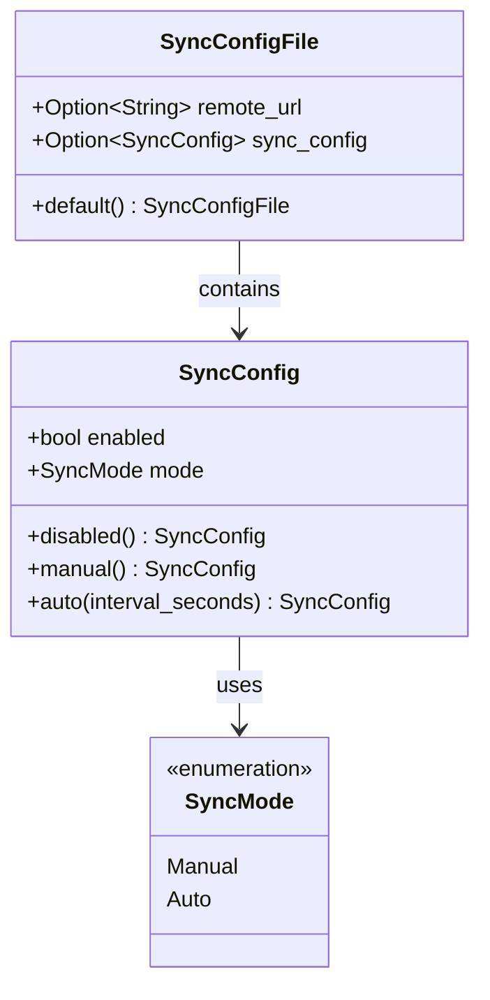
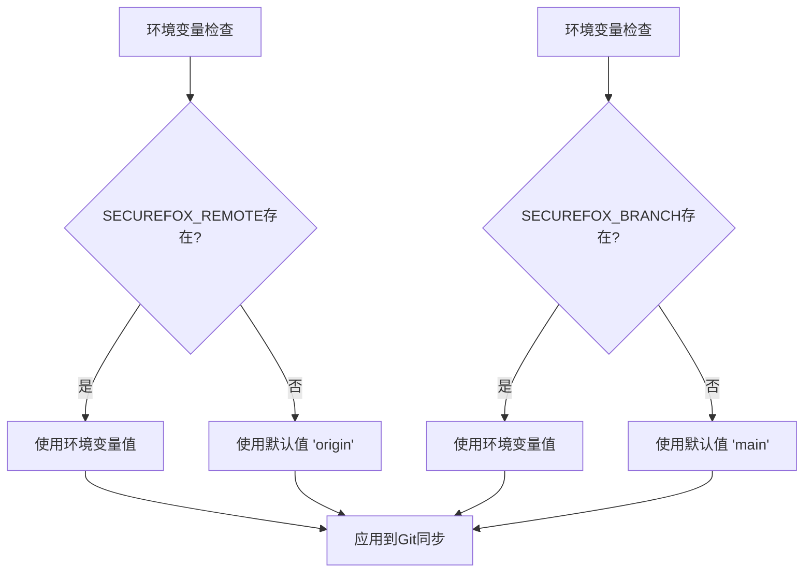
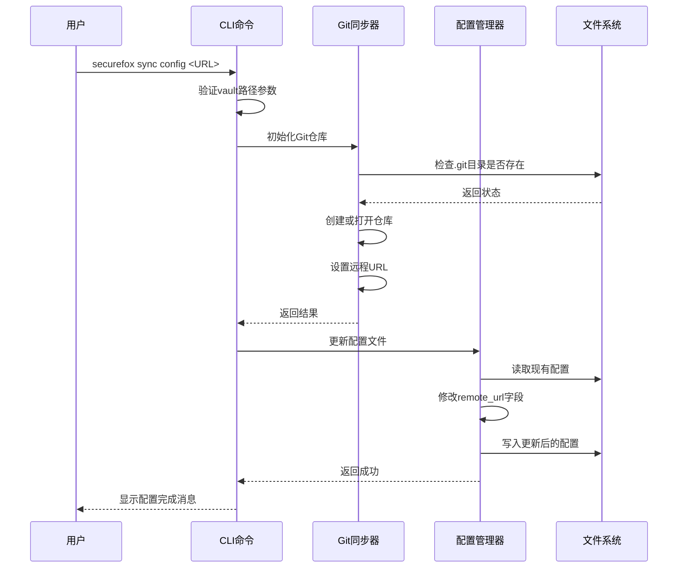
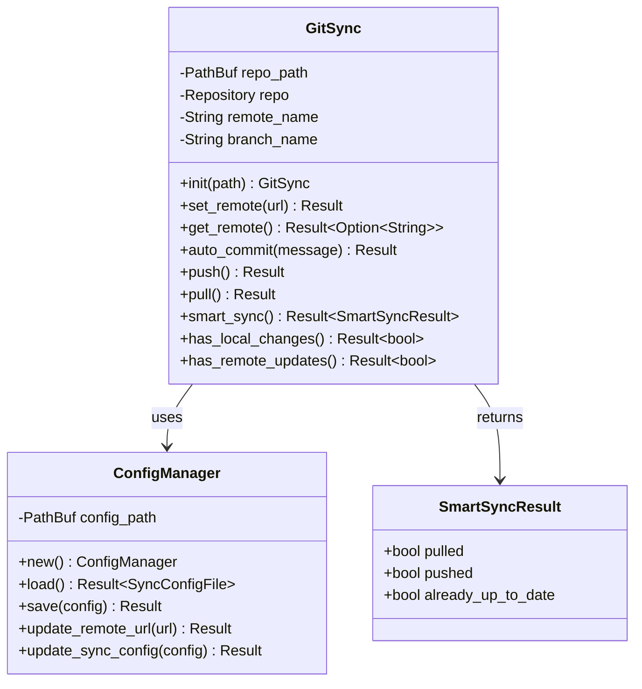
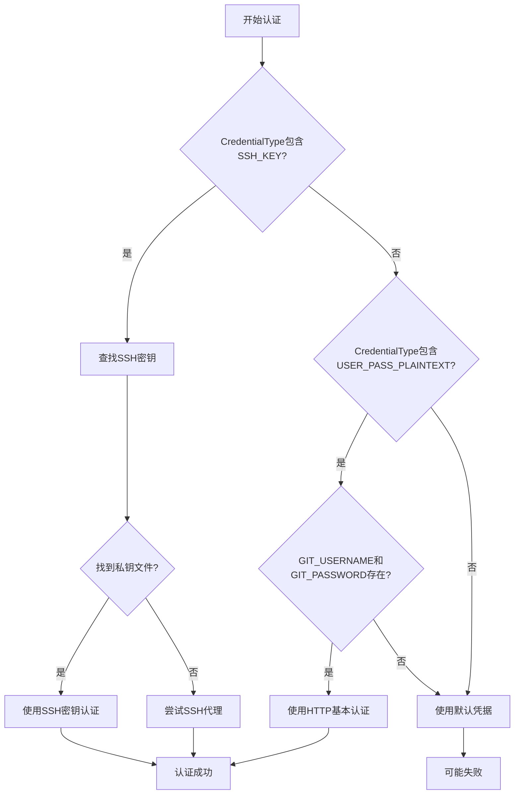
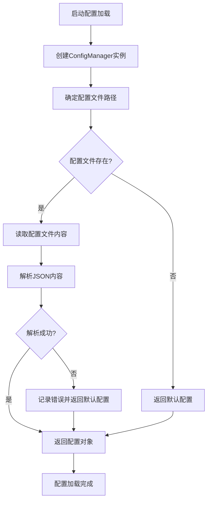
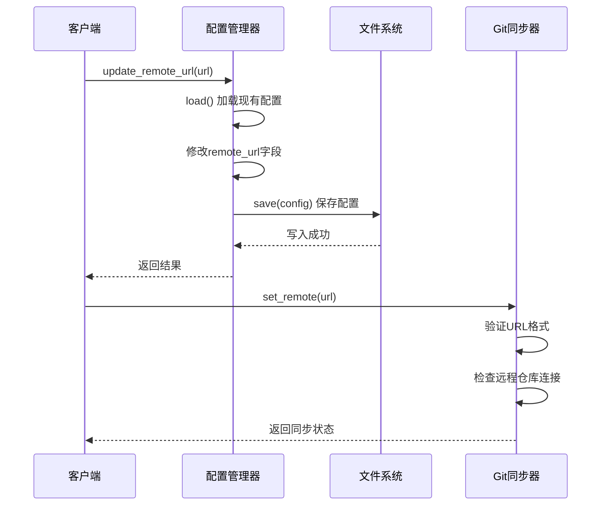

# 同步配置

<cite>
**本文档中引用的文件**
- [cli/src/commands/sync_config.rs](file://cli/src/commands/sync_config.rs)
- [core/src/git_sync.rs](file://core/src/git_sync.rs)
- [core/src/config.rs](file://core/src/config.rs)
- [core/src/models.rs](file://core/src/models.rs)
- [core/src/errors.rs](file://core/src/errors.rs)
- [cli/src/main.rs](file://cli/src/main.rs)
- [cli/src/sync_daemon.rs](file://cli/src/sync_daemon.rs)
- [cli/src/commands/sync_status.rs](file://cli/src/commands/sync_status.rs)
</cite>

## 目录
1. [简介](#简介)
2. [配置文件结构](#配置文件结构)
3. [环境变量配置](#环境变量配置)
4. [`sync config` 命令详解](#sync-config-命令详解)
5. [Git同步架构](#git同步架构)
6. [配置加载和验证流程](#配置加载和验证流程)
7. [常见配置问题及解决方案](#常见配置问题及解决方案)
8. [完整配置示例](#完整配置示例)
9. [故障排除指南](#故障排除指南)

## 简介

SecureFox提供了强大的Git同步功能，允许用户将密码保管库安全地存储在远程Git仓库中。通过`sync config`命令，用户可以轻松配置远程仓库URL、分支名称和认证信息，实现本地密码数据的版本控制和备份。

该同步系统采用本地优先的设计理念，在确保数据安全的前提下提供便捷的跨设备同步能力。所有敏感数据都经过加密处理，只有授权用户才能访问完整的密码信息。

## 配置文件结构

SecureFox使用位于`~/.securefox/config`的JSON配置文件来存储同步相关设置。该文件包含以下核心字段：



**图表来源**
- [core/src/models.rs](file://core/src/models.rs#L365-L377)
- [core/src/models.rs](file://core/src/models.rs#L297-L346)

### 配置文件字段说明

| 字段名 | 类型 | 描述 | 默认值 |
|--------|------|------|--------|
| `remote_url` | `Option<String>` | 远程Git仓库URL | `None` |
| `sync_config` | `Option<SyncConfig>` | 自动同步配置 | `Some(SyncConfig { enabled: true, mode: Manual })` |

### 同步模式配置

| 模式类型 | 描述 | 使用场景 |
|----------|------|----------|
| `Manual` | 手动同步模式 | 不需要自动同步，手动控制每次同步操作 |
| `Auto` | 自动同步模式 | 需要定期自动拉取远程更新，同时在本地有变更时自动推送 |

**章节来源**
- [core/src/models.rs](file://core/src/models.rs#L365-L377)
- [core/src/models.rs](file://core/src/models.rs#L297-L346)

## 环境变量配置

SecureFox支持通过环境变量覆盖配置文件中的设置，提供灵活的部署选项：

### 核心环境变量

| 变量名 | 描述 | 默认值 | 示例 |
|--------|------|--------|------|
| `SECUREFOX_REMOTE` | Git远程仓库名称 | `"origin"` | `"upstream"` |
| `SECUREFOX_BRANCH` | 默认分支名称 | `"main"` | `"master"` |
| `GIT_AUTHOR_NAME` | Git提交作者名称 | 用户名或`"SecureFox"` | `"John Doe"` |
| `GIT_AUTHOR_EMAIL` | Git提交作者邮箱 | `"{name}@securefox.local"` | `"john@example.com"` |
| `GIT_USERNAME` | HTTP基本认证用户名 | 无 | `"gituser"` |
| `GIT_PASSWORD` | HTTP基本认证密码 | 无 | `"password123"` |

### 环境变量优先级

环境变量具有最高优先级，会覆盖配置文件中的相应设置：



**图表来源**
- [core/src/git_sync.rs](file://core/src/git_sync.rs#L33-L34)

**章节来源**
- [core/src/git_sync.rs](file://core/src/git_sync.rs#L33-L34)
- [core/src/git_sync.rs](file://core/src/git_sync.rs#L296-L302)

## `sync config` 命令详解

### 命令语法

```bash
securefox sync config <URL>
```

### 参数说明

| 参数 | 类型 | 必需 | 描述 |
|------|------|------|------|
| `URL` | `String` | 是 | 远程Git仓库的完整URL地址 |

### 执行流程



**图表来源**
- [cli/src/commands/sync_config.rs](file://cli/src/commands/sync_config.rs#L9-L34)

### 错误处理机制

命令执行过程中可能遇到的错误类型：

| 错误类型 | 原因 | 解决方案 |
|----------|------|----------|
| `Vault path not specified` | 未提供保管库路径 | 使用`--vault`参数指定保管库路径 |
| `Failed to initialize git sync` | Git仓库初始化失败 | 检查目录权限和Git可用性 |
| `Failed to set remote URL` | 远程URL设置失败 | 验证URL格式和网络连接 |
| `Failed to update config file` | 配置文件写入失败 | 检查配置文件所在目录权限 |

**章节来源**
- [cli/src/commands/sync_config.rs](file://cli/src/commands/sync_config.rs#L9-L34)

## Git同步架构

### 核心组件架构



**图表来源**
- [core/src/git_sync.rs](file://core/src/git_sync.rs#L12-L18)
- [core/src/config.rs](file://core/src/config.rs#L18-L21)

### 认证机制

SecureFox支持多种认证方式，按优先级顺序：



**图表来源**
- [core/src/git_sync.rs](file://core/src/git_sync.rs#L307-L348)

### 支持的远程仓库协议

| 协议类型 | URL格式示例 | 认证方式 | 适用场景 |
|----------|-------------|----------|----------|
| HTTPS | `https://github.com/user/repo.git` | SSH密钥或HTTP基本认证 | 公开仓库、团队协作 |
| SSH | `git@github.com:user/repo.git` | SSH密钥 | 私有仓库、个人项目 |
| HTTP | `http://server/repo.git` | HTTP基本认证 | 内部私有服务器 |

**章节来源**
- [core/src/git_sync.rs](file://core/src/git_sync.rs#L307-L348)

## 配置加载和验证流程

### 配置加载流程



**图表来源**
- [core/src/config.rs](file://core/src/config.rs#L67-L76)

### 配置验证规则

| 验证项 | 规则 | 错误处理 |
|--------|------|----------|
| `remote_url`格式 | 必须是有效的Git URL | 返回`InvalidUrl`错误 |
| `branch_name` | 不能为空字符串 | 使用默认值"main" |
| `sync_config.enabled` | 布尔值 | 默认为`true` |
| `sync_config.mode` | 枚举值 | 默认为`Manual`模式 |

### 配置更新机制



**图表来源**
- [core/src/config.rs](file://core/src/config.rs#L80-L91)
- [core/src/git_sync.rs](file://core/src/git_sync.rs#L60-L69)

**章节来源**
- [core/src/config.rs](file://core/src/config.rs#L67-L91)
- [core/src/git_sync.rs](file://core/src/git_sync.rs#L60-L69)

## 常见配置问题及解决方案

### 无效的远程仓库URL

**问题症状：**
- `Failed to set remote URL` 错误
- Git操作超时或失败

**解决方案：**

1. **验证URL格式**
   ```bash
   # 正确格式示例
   securefox sync config https://github.com/username/repository.git
   securefox sync config git@github.com:username/repository.git
   ```

2. **检查网络连接**
   ```bash
   # 测试HTTPS连接
   curl -I https://github.com/username/repository.git
   
   # 测试SSH连接
   ssh -T git@github.com
   ```

3. **验证仓库存在性**
   - 确认远程仓库已创建
   - 检查仓库是否公开或需要认证

### 权限不足问题

**问题症状：**
- `Permission denied` 错误
- 无法推送或拉取代码

**解决方案：**

1. **SSH密钥配置**
   ```bash
   # 生成新的SSH密钥
   ssh-keygen -t ed25519 -C "your_email@example.com"
   
   # 添加公钥到GitHub/GitLab等平台
   cat ~/.ssh/id_ed25519.pub
   ```

2. **检查SSH代理**
   ```bash
   # 启动SSH代理
   eval "$(ssh-agent -s)"
   
   # 添加私钥
   ssh-add ~/.ssh/id_ed25519
   ```

3. **HTTP基本认证**
   ```bash
   # 设置环境变量
   export GIT_USERNAME="your_username"
   export GIT_PASSWORD="your_token_or_password"
   ```

### SSH密钥配置问题

**问题症状：**
- `Could not find home directory` 错误
- SSH密钥认证失败

**解决方案：**

1. **检查SSH密钥文件**
   ```bash
   # 检查常用密钥类型
   ls ~/.ssh/
   # 应该看到 id_rsa, id_ed25519 或 id_ecdsa 文件
   ```

2. **设置正确的文件权限**
   ```bash
   chmod 600 ~/.ssh/id_rsa
   chmod 644 ~/.ssh/id_rsa.pub
   ```

3. **验证密钥有效性**
   ```bash
   ssh-keygen -y -f ~/.ssh/id_rsa
   ```

### 分支名称冲突

**问题症状：**
- `Already up to date` 提示但实际有更新
- 分支重命名失败

**解决方案：**

1. **检查当前分支**
   ```bash
   cd ~/.securefox
   git branch
   ```

2. **手动切换分支**
   ```bash
   git checkout main  # 或其他目标分支
   ```

3. **强制同步**
   ```bash
   securefox sync pull
   securefox sync push
   ```

**章节来源**
- [core/src/git_sync.rs](file://core/src/git_sync.rs#L307-L348)
- [core/src/errors.rs](file://core/src/errors.rs#L36-L45)

## 完整配置示例

### 基础HTTPS配置

```json
{
  "remoteUrl": "https://github.com/username/securefox-backup.git",
  "syncConfig": {
    "enabled": true,
    "mode": "Manual"
  }
}
```

### 自动同步配置

```json
{
  "remoteUrl": "https://github.com/username/securefox-backup.git",
  "syncConfig": {
    "enabled": true,
    "mode": {
      "type": "Auto",
      "intervalSeconds": 300
    }
  }
}
```

### SSH密钥认证配置

```json
{
  "remoteUrl": "git@github.com:username/securefox-backup.git",
  "syncConfig": {
    "enabled": true,
    "mode": "Manual"
  }
}
```

### 环境变量覆盖配置

```bash
# 设置远程仓库名称
export SECUREFOX_REMOTE="origin"

# 设置分支名称
export SECUREFOX_BRANCH="main"

# 设置Git作者信息
export GIT_AUTHOR_NAME="John Doe"
export GIT_AUTHOR_EMAIL="john@example.com"

# 设置HTTP认证（可选）
export GIT_USERNAME="your_github_username"
export GIT_PASSWORD="your_personal_access_token"
```

### 复杂配置示例

```json
{
  "remoteUrl": "https://gitlab.com/company/securefox-vault.git",
  "syncConfig": {
    "enabled": true,
    "mode": {
      "type": "Auto",
      "intervalSeconds": 600
    }
  }
}
```

**章节来源**
- [core/src/models.rs](file://core/src/models.rs#L365-L377)
- [core/src/models.rs](file://core/src/models.rs#L334-L346)

## 故障排除指南

### 同步状态诊断

使用状态命令检查当前同步状态：

```bash
# 查看同步状态
securefox sync status

# 输出示例：
# Status:     Configured
# Remote:     https://github.com/username/securefox-backup.git
# Mode:       Auto
#            Pull interval: 300 seconds
#            Automatic pull at intervals + push on vault changes
```

### 日志分析

启用详细日志进行问题诊断：

```bash
# 设置详细输出
export SECUREFOX_VERBOSE=true

# 执行同步操作
securefox sync pull
```

### 常见错误代码

| 错误代码 | 描述 | 解决方法 |
|----------|------|----------|
| `Io` | 文件系统操作失败 | 检查磁盘空间和文件权限 |
| `Json` | JSON解析失败 | 检查配置文件格式 |
| `Git` | Git操作失败 | 检查Git安装和仓库状态 |
| `InvalidPassword` | 密码验证失败 | 重新输入正确密码 |
| `VaultNotFound` | 保管库文件不存在 | 使用`securefox init`初始化新保管库 |

### 清理和重置

如果配置出现问题，可以执行以下清理步骤：

```bash
# 删除配置文件
rm ~/.securefox/config

# 重新初始化Git仓库
cd ~/.securefox
git init

# 重新配置远程仓库
securefox sync config <NEW_URL>
```

### 性能优化建议

1. **选择合适的同步间隔**
   - 手动模式：无需设置间隔
   - 自动模式：建议300-900秒

2. **优化网络连接**
   - 使用稳定的网络环境
   - 考虑使用本地Git服务器

3. **定期维护**
   - 定期清理旧的备份分支
   - 监控仓库大小增长

**章节来源**
- [cli/src/commands/sync_status.rs](file://cli/src/commands/sync_status.rs#L39-L56)
- [core/src/errors.rs](file://core/src/errors.rs#L7-L45)