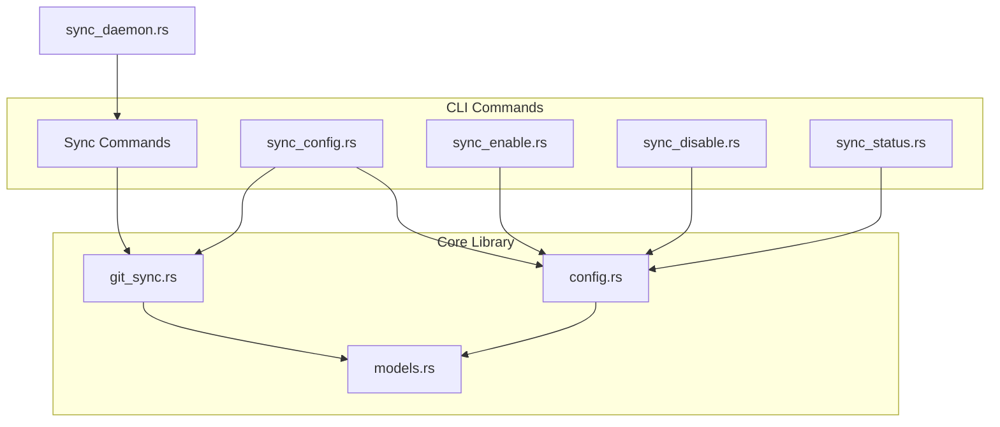
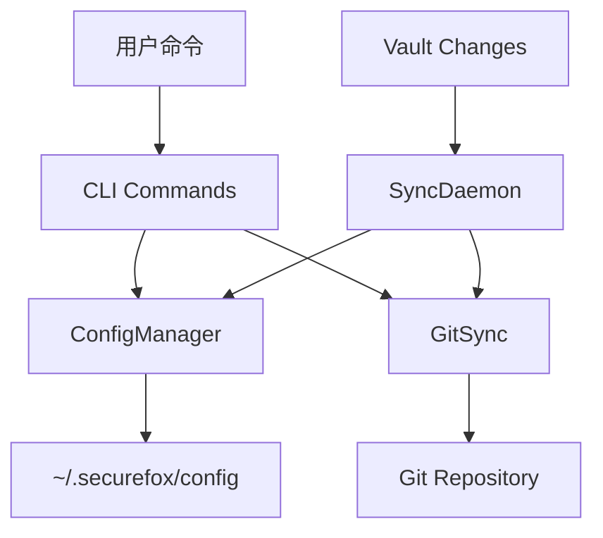
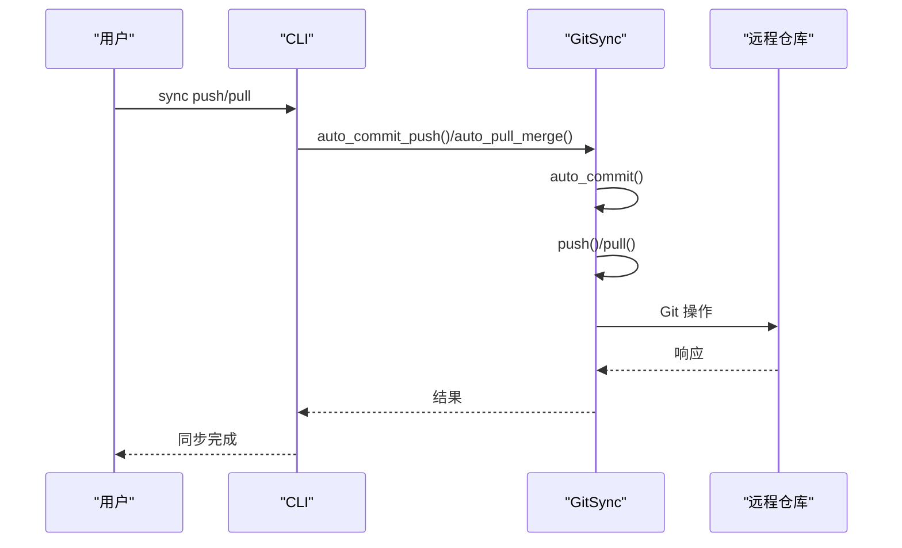
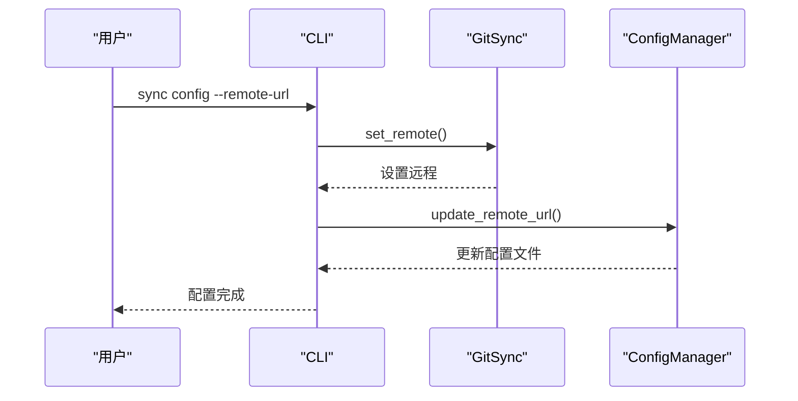
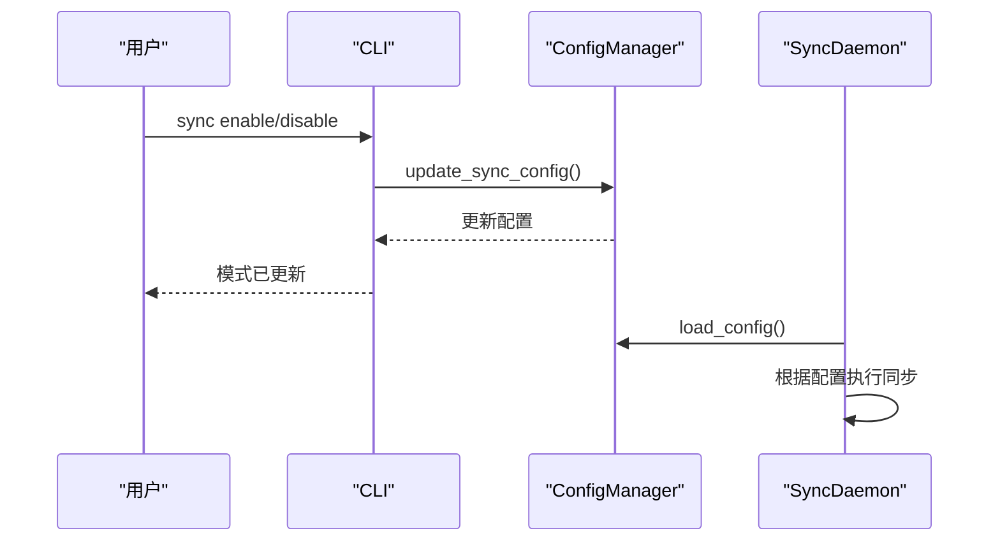
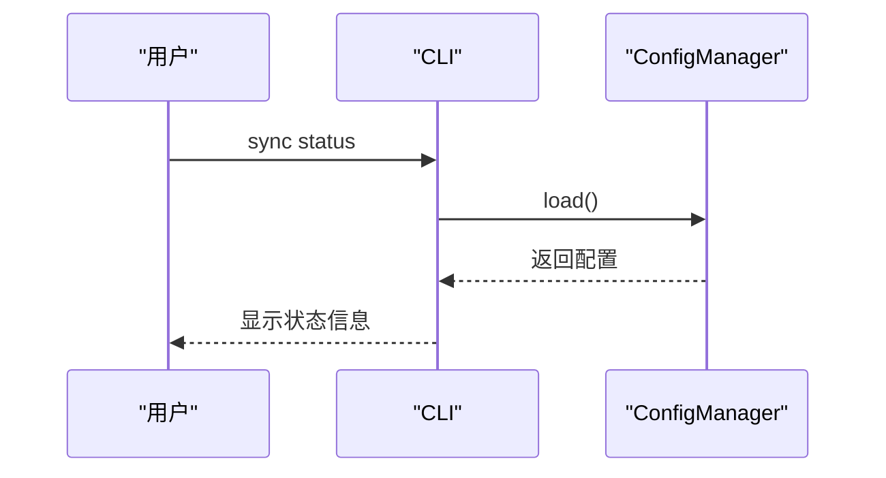
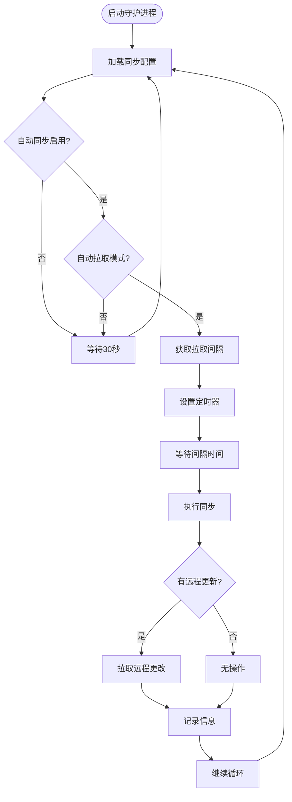
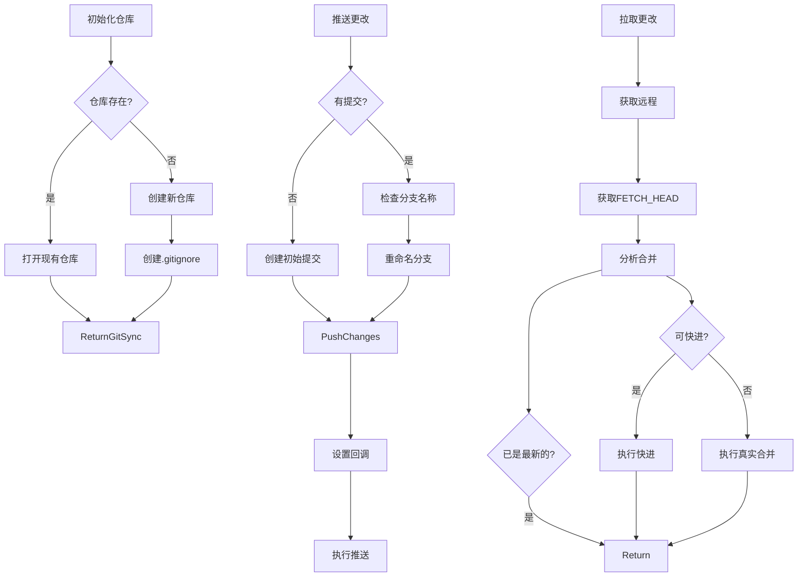
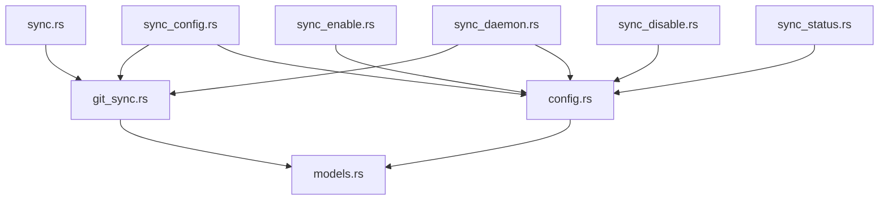

# 数据同步

<cite>
**本文档中引用的文件**   
- [sync.rs](file://cli/src/commands/sync.rs)
- [sync_config.rs](file://cli/src/commands/sync_config.rs)
- [sync_enable.rs](file://cli/src/commands/sync_enable.rs)
- [sync_disable.rs](file://cli/src/commands/sync_disable.rs)
- [sync_status.rs](file://cli/src/commands/sync_status.rs)
- [sync_daemon.rs](file://cli/src/sync_daemon.rs)
- [git_sync.rs](file://core/src/git_sync.rs)
- [models.rs](file://core/src/models.rs)
- [config.rs](file://core/src/config.rs)
</cite>

## 目录
1. [简介](#简介)
2. [项目结构](#项目结构)
3. [核心组件](#核心组件)
4. [架构概述](#架构概述)
5. [详细组件分析](#详细组件分析)
6. [依赖分析](#依赖分析)
7. [性能考虑](#性能考虑)
8. [故障排除指南](#故障排除指南)
9. [结论](#结论)

## 简介
SecureFox 提供基于 Git 的跨设备数据同步功能，允许用户在多个设备间安全地同步密码库。本文档详细介绍了 `sync` 命令的各种操作，包括 push/pull 与远程 Git 仓库的交互方式，`sync config` 如何设置远程仓库 URL，以及 `sync status` 如何显示同步状态。同时，文档深入分析了 `sync_daemon.rs` 的实现机制，解释了后台守护进程如何监控变化并自动执行同步。此外，还提供了配置自动同步的完整示例，并结合 core 库的 git_sync 模块，说明了同步过程中的冲突检测和解决策略。

## 项目结构
SecureFox 的数据同步功能分布在 CLI 和核心库中，主要文件位于 `cli/src/commands/` 和 `core/src/` 目录下。同步相关的命令实现位于 CLI 的 commands 模块中，而核心同步逻辑则封装在 core 库的 git_sync 模块中。



**Diagram sources**
- [sync.rs](file://cli/src/commands/sync.rs)
- [sync_config.rs](file://cli/src/commands/sync_config.rs)
- [sync_enable.rs](file://cli/src/commands/sync_enable.rs)
- [sync_disable.rs](file://cli/src/commands/sync_disable.rs)
- [sync_status.rs](file://cli/src/commands/sync_status.rs)
- [sync_daemon.rs](file://cli/src/sync_daemon.rs)
- [git_sync.rs](file://core/src/git_sync.rs)
- [models.rs](file://core/src/models.rs)
- [config.rs](file://core/src/config.rs)

**Section sources**
- [sync.rs](file://cli/src/commands/sync.rs)
- [sync_config.rs](file://cli/src/commands/sync_config.rs)
- [sync_enable.rs](file://cli/src/commands/sync_enable.rs)
- [sync_disable.rs](file://cli/src/commands/sync_disable.rs)
- [sync_status.rs](file://cli/src/commands/sync_status.rs)
- [sync_daemon.rs](file://cli/src/sync_daemon.rs)
- [git_sync.rs](file://core/src/git_sync.rs)
- [models.rs](file://core/src/models.rs)
- [config.rs](file://core/src/config.rs)

## 核心组件
SecureFox 的数据同步系统由多个核心组件构成：`sync` 命令处理手动同步操作，`sync_config` 管理远程仓库配置，`sync_enable` 和 `sync_disable` 控制自动同步模式，`sync_status` 提供同步状态信息，`sync_daemon` 实现后台自动同步守护进程，`git_sync` 模块提供底层 Git 操作功能，`config` 模块管理同步配置文件，`models` 模块定义同步相关的数据模型。

**Section sources**
- [sync.rs](file://cli/src/commands/sync.rs#L1-L2)
- [sync_config.rs](file://cli/src/commands/sync_config.rs#L1-L35)
- [sync_enable.rs](file://cli/src/commands/sync_enable.rs#L1-L44)
- [sync_disable.rs](file://cli/src/commands/sync_disable.rs#L1-L29)
- [sync_status.rs](file://cli/src/commands/sync_status.rs#L1-L57)
- [sync_daemon.rs](file://cli/src/sync_daemon.rs#L1-L112)
- [git_sync.rs](file://core/src/git_sync.rs#L1-L503)
- [models.rs](file://core/src/models.rs#L1-L416)
- [config.rs](file://core/src/config.rs#L1-L99)

## 架构概述
SecureFox 的数据同步架构采用分层设计，上层 CLI 命令通过调用核心库的 API 来执行同步操作。配置管理独立于加密的密码库，存储在用户主目录下的 `.securefox/config` 文件中，包含远程仓库 URL 和同步模式等信息。



**Diagram sources**
- [sync_daemon.rs](file://cli/src/sync_daemon.rs#L1-L112)
- [git_sync.rs](file://core/src/git_sync.rs#L1-L503)
- [config.rs](file://core/src/config.rs#L1-L99)

## 详细组件分析

### Sync 命令分析
`sync` 命令是用户执行手动同步操作的主要接口。它通过 placeholder 模块间接调用实际的同步逻辑，实现了 push 和 pull 操作与远程 Git 仓库的交互。

#### 对于 API/Service 组件：


**Diagram sources**
- [sync.rs](file://cli/src/commands/sync.rs#L1-L2)
- [git_sync.rs](file://core/src/git_sync.rs#L213-L229)

### Sync Config 分析
`sync config` 命令用于设置远程仓库 URL，它同时更新 Git 仓库的远程配置和本地的配置文件。

#### 对于 API/Service 组件：


**Diagram sources**
- [sync_config.rs](file://cli/src/commands/sync_config.rs#L1-L35)
- [git_sync.rs](file://core/src/git_sync.rs#L60-L70)
- [config.rs](file://core/src/config.rs#L79-L84)

### Sync Enable/Disable 分析
`sync enable` 和 `sync disable` 命令用于配置自动同步模式和间隔，它们通过更新配置文件来控制同步行为。

#### 对于 API/Service 组件：


**Diagram sources**
- [sync_enable.rs](file://cli/src/commands/sync_enable.rs#L1-L44)
- [sync_disable.rs](file://cli/src/commands/sync_disable.rs#L1-L29)
- [config.rs](file://core/src/config.rs#L86-L91)
- [sync_daemon.rs](file://cli/src/sync_daemon.rs#L31-L39)

### Sync Status 分析
`sync status` 命令显示当前的同步状态，包括 Git 配置和自动同步配置。

#### 对于 API/Service 组件：


**Diagram sources**
- [sync_status.rs](file://cli/src/commands/sync_status.rs#L1-L57)
- [config.rs](file://core/src/config.rs#L68-L77)

### Sync Daemon 分析
`sync_daemon` 是后台守护进程，负责监控变化并自动执行同步操作。

#### 对于复杂逻辑组件：


**Diagram sources**
- [sync_daemon.rs](file://cli/src/sync_daemon.rs#L41-L81)
- [git_sync.rs](file://core/src/git_sync.rs#L403-L440)

### Git Sync 模块分析
`git_sync` 模块实现了底层的 Git 操作功能，包括初始化仓库、设置远程、自动提交、推送、拉取等。

#### 对于复杂逻辑组件：


**Diagram sources**
- [git_sync.rs](file://core/src/git_sync.rs#L22-L43)

### 模型定义分析
`models` 模块定义了同步相关的数据模型，包括 `SyncConfig`、`SyncMode` 和 `SyncConfigFile`。

#### 对于面向对象的组件：
```mermaid
classDiagram
class SyncConfig {
+enabled : bool
+mode : SyncMode
+disabled() SyncConfig
+manual() SyncConfig
+auto(interval_seconds : u64) SyncConfig
}
class SyncMode {
+Manual
+Auto {interval_seconds : u64}
+is_auto_pull() bool
+is_push_on_change() bool
+interval_seconds() Option<u64>
}
class SyncConfigFile {
+remote_url : Option<String>
+sync_config : Option<SyncConfig>
}
SyncConfig --> SyncMode : "包含"
SyncConfigFile --> SyncConfig : "包含"
```

**Diagram sources**
- [models.rs](file://core/src/models.rs#L297-L363)

## 依赖分析
SecureFox 的数据同步系统具有清晰的依赖关系，CLI 命令依赖于核心库的 API，而核心库的各个模块之间也有明确的依赖。



**Diagram sources**
- [sync.rs](file://cli/src/commands/sync.rs)
- [sync_config.rs](file://cli/src/commands/sync_config.rs)
- [sync_enable.rs](file://cli/src/commands/sync_enable.rs)
- [sync_disable.rs](file://cli/src/commands/sync_disable.rs)
- [sync_status.rs](file://cli/src/commands/sync_status.rs)
- [sync_daemon.rs](file://cli/src/sync_daemon.rs)
- [git_sync.rs](file://core/src/git_sync.rs)
- [config.rs](file://core/src/config.rs)
- [models.rs](file://core/src/models.rs)

**Section sources**
- [sync.rs](file://cli/src/commands/sync.rs)
- [sync_config.rs](file://cli/src/commands/sync_config.rs)
- [sync_enable.rs](file://cli/src/commands/sync_enable.rs)
- [sync_disable.rs](file://cli/src/commands/sync_disable.rs)
- [sync_status.rs](file://cli/src/commands/sync_status.rs)
- [sync_daemon.rs](file://cli/src/sync_daemon.rs)
- [git_sync.rs](file://core/src/git_sync.rs)
- [config.rs](file://core/src/config.rs)
- [models.rs](file://core/src/models.rs)

## 性能考虑
SecureFox 的数据同步系统在性能方面进行了优化，包括：
- 使用 `has_remote_updates()` 方法在执行 pull 操作前检查远程是否有更新，避免不必要的网络请求
- 在自动同步模式下，使用定时器来控制拉取间隔，避免频繁的同步操作
- 在推送前检查是否有本地更改，避免不必要的提交和推送
- 使用 Git 的 fast-forward 合并策略，当可能时直接移动指针而不是创建合并提交

## 故障排除指南
### 常见同步问题及解决方案

#### 网络错误
当出现网络连接问题时，可以检查：
- 网络连接是否正常
- 远程仓库 URL 是否正确
- 防火墙或代理设置是否阻止了 Git 操作

**Section sources**
- [git_sync.rs](file://core/src/git_sync.rs#L148-L157)

#### 认证失败
认证失败通常与 SSH 密钥或用户名/密码配置有关：
- 检查 SSH 密钥是否存在于 `~/.ssh/` 目录下
- 确认 SSH 密钥权限设置正确（通常为 600）
- 如果使用用户名/密码，确保 `GIT_USERNAME` 和 `GIT_PASSWORD` 环境变量已正确设置

**Section sources**
- [git_sync.rs](file://core/src/git_sync.rs#L306-L349)

#### 合并冲突
当多个设备同时修改密码库时可能出现合并冲突：
- 系统会尝试自动解决 JSON 文件的冲突，目前策略是采用远程版本
- 在未来版本中，计划实现更智能的 JSON 合并策略
- 用户可以通过手动执行 `sync pull` 来解决冲突

**Section sources**
- [git_sync.rs](file://core/src/git_sync.rs#L274-L292)

## 结论
SecureFox 的数据同步系统提供了一套完整的基于 Git 的跨设备同步解决方案。通过 CLI 命令和后台守护进程的结合，用户可以灵活地选择手动或自动同步模式。系统通过独立的配置文件管理同步设置，确保了配置的持久性和安全性。核心的 git_sync 模块实现了完整的 Git 操作功能，包括冲突检测和基础的冲突解决策略。整体架构清晰，组件职责明确，为用户提供了可靠的数据同步体验。