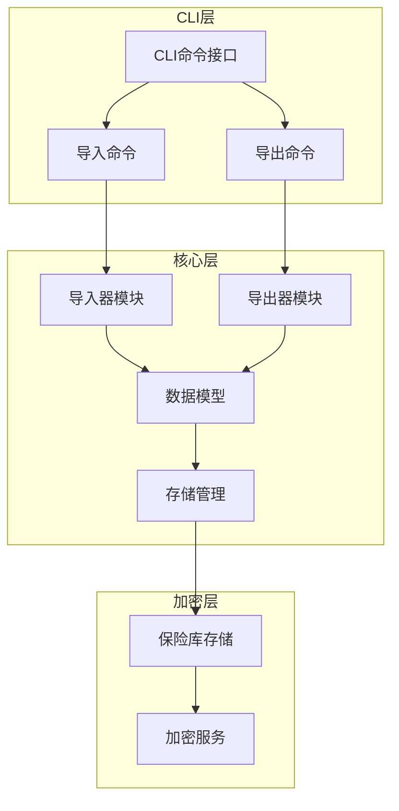
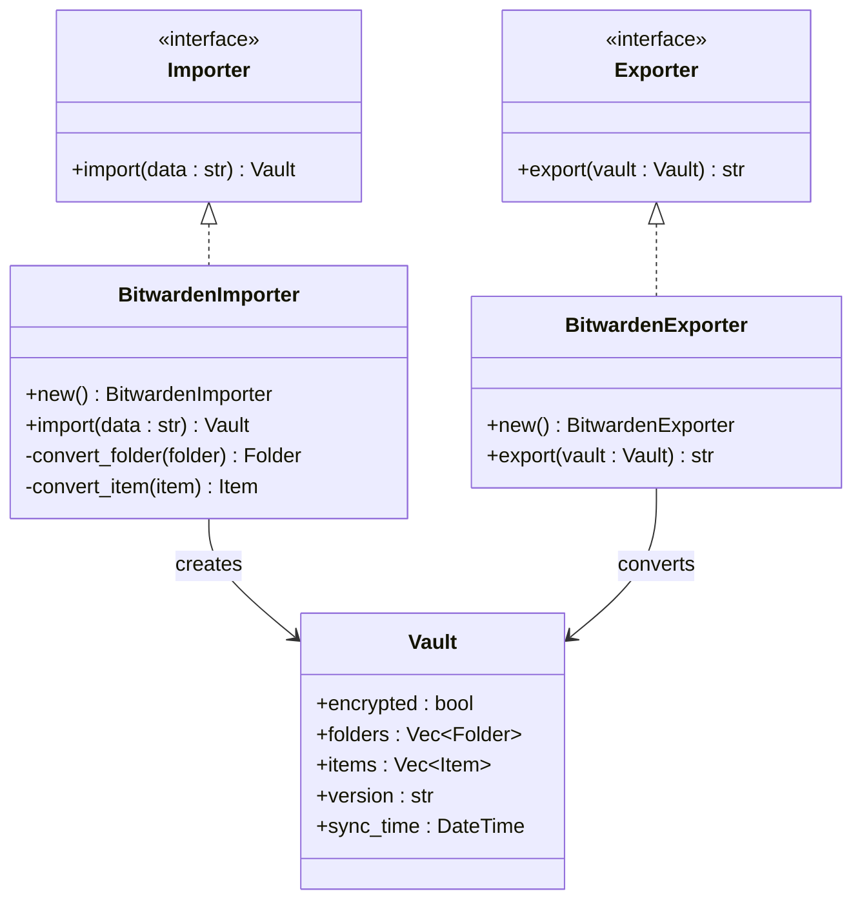
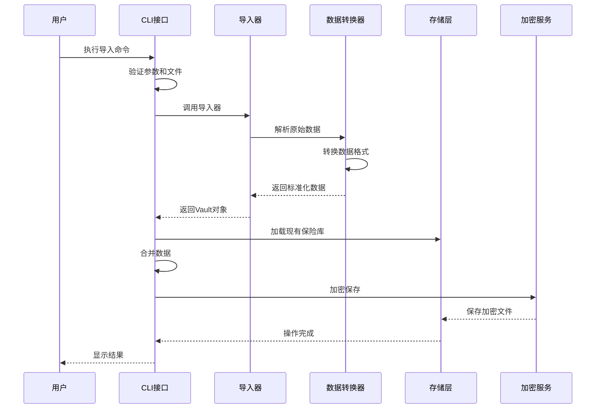
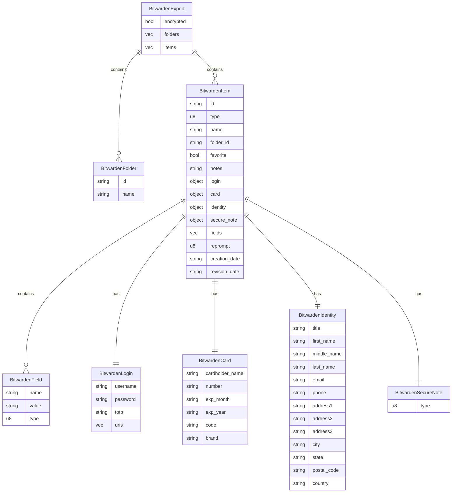
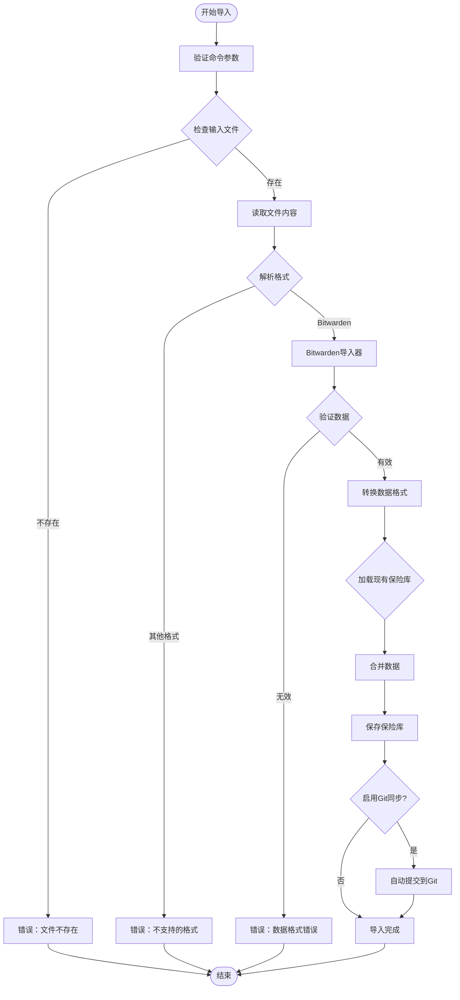
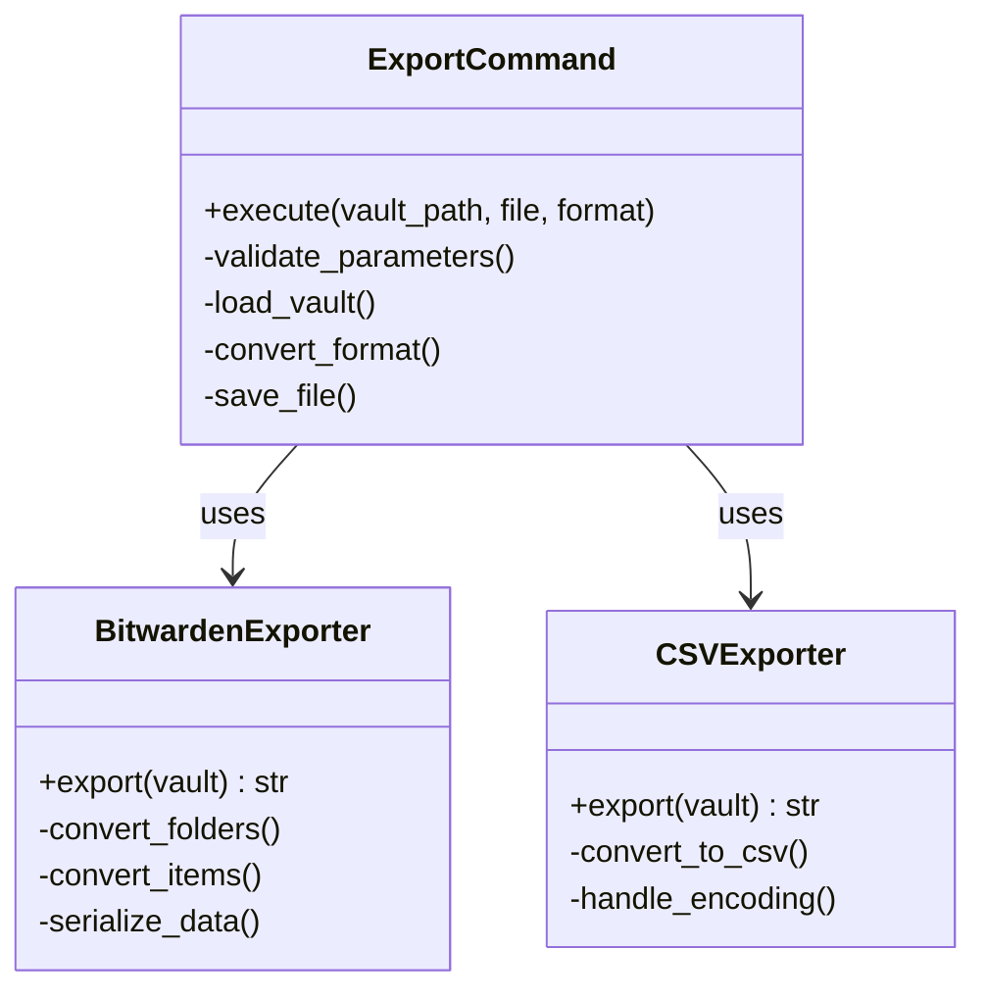
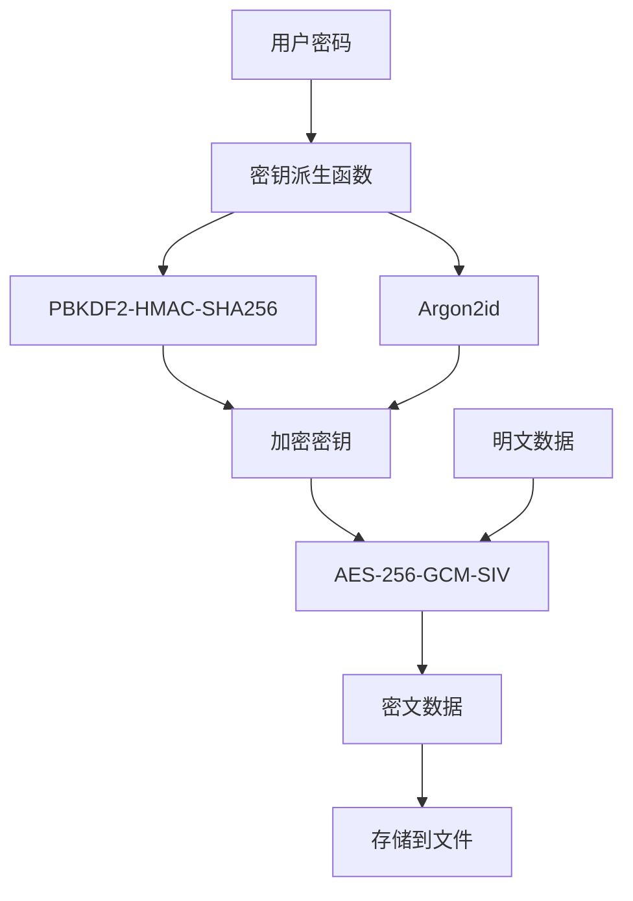

# 数据导入导出

<cite>
**本文档中引用的文件**
- [cli/src/commands/import.rs](file://cli/src/commands/import.rs)
- [cli/src/commands/export.rs](file://cli/src/commands/export.rs)
- [core/src/importers/bitwarden.rs](file://core/src/importers/bitwarden.rs)
- [core/src/importers/mod.rs](file://core/src/importers/mod.rs)
- [core/src/models.rs](file://core/src/models.rs)
- [core/src/storage.rs](file://core/src/storage.rs)
- [core/src/crypto.rs](file://core/src/crypto.rs)
- [cli/src/main.rs](file://cli/src/main.rs)
- [cli/src/commands/placeholder.rs](file://cli/src/commands/placeholder.rs)
</cite>

## 目录
1. [简介](#简介)
2. [项目结构概览](#项目结构概览)
3. [核心组件分析](#核心组件分析)
4. [架构概览](#架构概览)
5. [详细组件分析](#详细组件分析)
6. [导入功能详解](#导入功能详解)
7. [导出功能详解](#导出功能详解)
8. [数据格式支持](#数据格式支持)
9. [加密与安全](#加密与安全)
10. [使用示例](#使用示例)
11. [故障排除指南](#故障排除指南)
12. [总结](#总结)

## 简介

SecureFox提供了强大的数据导入导出功能，支持从多种密码管理器格式（主要是Bitwarden）导入数据，并能够将保险库数据导出为标准格式。该系统采用模块化设计，通过统一的接口处理不同格式的数据转换，确保数据迁移的安全性和完整性。

## 项目结构概览

SecureFox的数据导入导出功能分布在以下关键模块中：



**图表来源**
- [cli/src/main.rs](file://cli/src/main.rs#L168-L186)
- [core/src/importers/mod.rs](file://core/src/importers/mod.rs#L1-L19)
- [core/src/models.rs](file://core/src/models.rs#L1-L416)

## 核心组件分析

### 导入器接口

SecureFox定义了统一的导入器和导出器接口，支持多种数据格式的转换：



**图表来源**
- [core/src/importers/mod.rs](file://core/src/importers/mod.rs#L8-L18)
- [core/src/importers/bitwarden.rs](file://core/src/importers/bitwarden.rs#L112-L271)

**章节来源**
- [core/src/importers/mod.rs](file://core/src/importers/mod.rs#L1-L19)
- [core/src/importers/bitwarden.rs](file://core/src/importers/bitwarden.rs#L1-L402)

## 架构概览

SecureFox的数据导入导出系统采用分层架构设计，确保功能的可扩展性和维护性：



**图表来源**
- [cli/src/commands/import.rs](file://cli/src/commands/import.rs#L10-L103)
- [core/src/importers/bitwarden.rs](file://core/src/importers/bitwarden.rs#L245-L271)

## 详细组件分析

### Bitwarden格式支持

SecureFox主要支持Bitwarden格式的数据交换，这是当前最广泛使用的密码管理器格式之一。

#### Bitwarden数据结构



**图表来源**
- [core/src/importers/bitwarden.rs](file://core/src/importers/bitwarden.rs#L14-L111)

**章节来源**
- [core/src/importers/bitwarden.rs](file://core/src/importers/bitwarden.rs#L14-L111)

## 导入功能详解

### 命令行接口

导入功能通过`securefox import`命令提供，支持指定文件路径和格式：

```bash
# 基本导入语法
securefox import --file <文件路径> --format <格式>

# 示例：从Bitwarden格式导入
securefox import --file ~/Downloads/bitwarden-export.json --format bitwarden

# 指定保险库路径
securefox --vault /path/to/vault import --file export.json --format bitwarden
```

### 导入流程



**图表来源**
- [cli/src/commands/import.rs](file://cli/src/commands/import.rs#L10-L103)

### 数据转换逻辑

Bitwarden导入器的核心转换逻辑包括：

1. **文件夹转换**：将Bitwarden文件夹映射到SecureFox文件夹结构
2. **项目转换**：根据项目类型（登录、卡片、身份、安全笔记）进行相应转换
3. **字段映射**：处理自定义字段和特殊属性
4. **时间戳处理**：正确转换日期时间格式

**章节来源**
- [cli/src/commands/import.rs](file://cli/src/commands/import.rs#L1-L103)
- [core/src/importers/bitwarden.rs](file://core/src/importers/bitwarden.rs#L112-L271)

## 导出功能详解

### 当前状态

目前导出功能处于占位符状态，实际的导出实现需要进一步开发。根据代码结构，导出功能应该支持以下特性：



**图表来源**
- [cli/src/commands/export.rs](file://cli/src/commands/export.rs#L1-L2)
- [core/src/importers/bitwarden.rs](file://core/src/importers/bitwarden.rs#L274-L354)

### 预期功能

基于导入功能的设计，导出功能应具备以下能力：

1. **多格式支持**：支持Bitwarden JSON和CSV格式
2. **数据过滤**：可以选择导出特定类型的项目
3. **加密选项**：提供加密导出选项
4. **进度反馈**：显示导出进度和状态

**章节来源**
- [cli/src/commands/export.rs](file://cli/src/commands/export.rs#L1-L2)
- [cli/src/commands/placeholder.rs](file://cli/src/commands/placeholder.rs#L33-L44)

## 数据格式支持

### 支持的导入格式

| 格式 | 描述 | 支持程度 | 特殊要求 |
|------|------|----------|----------|
| Bitwarden JSON | Bitwarden原生格式 | 完全支持 | 必须为未加密的导出文件 |
| CSV | 逗号分隔值格式 | 计划支持 | 需要正确的列映射 |
| KeePass XML | KeePass兼容格式 | 计划支持 | 需要密码解密 |
| LastPass JSON | LastPass格式 | 计划支持 | 需要解密处理 |

### 数据映射表

| SecureFox字段 | Bitwarden字段 | 类型转换 | 备注 |
|---------------|---------------|----------|------|
| `id` | `id` | 字符串 | 自动分配UUID（如果缺失） |
| `name` | `name` | 字符串 | 直接映射 |
| `item_type` | `type` | 枚举 | Login: 1, SecureNote: 2, Card: 3, Identity: 4 |
| `folder_id` | `folderId` | 字符串 | 可选字段 |
| `favorite` | `favorite` | 布尔值 | 默认false |
| `notes` | `notes` | 字符串 | 可选字段 |
| `login.username` | `login.username` | 字符串 | 登录项专用 |
| `login.password` | `login.password` | 字符串 | 登录项专用 |
| `card.number` | `card.number` | 字符串 | 卡片项专用 |
| `identity.first_name` | `identity.firstName` | 字符串 | 身份项专用 |

**章节来源**
- [core/src/importers/bitwarden.rs](file://core/src/importers/bitwarden.rs#L112-L236)
- [core/src/models.rs](file://core/src/models.rs#L75-L295)

## 加密与安全

### 加密机制

SecureFox使用AES-256-GCM-SIV算法对保险库数据进行加密，确保数据安全性：



**图表来源**
- [core/src/crypto.rs](file://core/src/crypto.rs#L129-L200)

### 导出数据处理

在导出过程中，敏感数据的处理遵循以下原则：

1. **密码字段保护**：密码字段保持加密状态，不会被解密导出
2. **敏感信息过滤**：某些高度敏感的信息可能被省略
3. **格式兼容性**：确保导出格式与目标系统兼容

**章节来源**
- [core/src/crypto.rs](file://core/src/crypto.rs#L1-L200)
- [core/src/storage.rs](file://core/src/storage.rs#L70-L133)

## 使用示例

### 完整导入流程示例

```bash
# 1. 准备Bitwarden导出文件
# 从Bitwarden导出保险库，确保选择"未加密"选项

# 2. 创建新的SecureFox保险库
securefox init --vault ~/securefox-vault

# 3. 导入数据
securefox --vault ~/securefox-vault import \
  --file ~/Downloads/bitwarden-export.json \
  --format bitwarden

# 4. 验证导入结果
securefox --vault ~/securefox-vault list

# 5. 设置Git同步（可选）
securefox --vault ~/securefox-vault sync enable --mode auto --interval 300
```

### 导入文件格式示例

以下是Bitwarden导出文件的基本结构：

```json
{
  "encrypted": false,
  "folders": [
    {
      "id": "folder-uuid-1",
      "name": "工作账户"
    }
  ],
  "items": [
    {
      "id": "item-uuid-1",
      "type": 1,
      "name": "GitHub",
      "folderId": "folder-uuid-1",
      "favorite": true,
      "login": {
        "username": "user@example.com",
        "password": "encrypted-password",
        "totp": "otpauth://totp/GitHub:user?secret=JBSWY3DPEHPK3PXP"
      }
    }
  ]
}
```

### 错误处理示例

```bash
# 处理常见的导入错误

# 1. 文件不存在
securefox import --file missing-file.json --format bitwarden
# 错误：无法读取文件：没有那个文件或目录

# 2. 格式不支持
securefox import --file data.txt --format txt
# 错误：不支持的导入格式：txt

# 3. 数据格式错误
securefox import --file corrupted.json --format bitwarden
# 错误：无效的Bitwarden JSON：JSON解析错误
```

## 故障排除指南

### 常见问题及解决方案

#### 1. 导入文件格式错误

**问题**：Bitwarden导出文件被加密
**原因**：Bitwarden默认导出包含加密数据
**解决方案**：
```bash
# 在Bitwarden中重新导出，选择"未加密"选项
securefox import --file export.json --format bitwarden
```

#### 2. 编码问题

**问题**：文件编码不兼容
**原因**：Windows系统使用UTF-16编码
**解决方案**：
```bash
# 转换文件编码
iconv -f UTF-16 -t UTF-8 input.json -o output.json
securefox import --file output.json --format bitwarden
```

#### 3. 数据丢失风险

**问题**：重复项目ID导致数据覆盖
**原因**：导入的项目ID与现有项目冲突
**解决方案**：
```bash
# 导入前备份现有保险库
securefox --vault /path/to/vault backup

# 使用合并模式导入
securefox import --file export.json --format bitwarden
```

#### 4. 内存不足

**问题**：大型保险库导入失败
**原因**：系统内存不足以处理大量数据
**解决方案**：
```bash
# 分批导入较小的保险库
# 或增加系统虚拟内存
```

### 性能优化建议

1. **定期备份**：导入前创建保险库备份
2. **网络同步**：启用Git同步以防止数据丢失
3. **分批处理**：对于大型保险库，考虑分批导入
4. **资源监控**：监控系统内存和CPU使用情况

**章节来源**
- [cli/src/commands/import.rs](file://cli/src/commands/import.rs#L21-L27)
- [core/src/importers/bitwarden.rs](file://core/src/importers/bitwarden.rs#L245-L255)

## 总结

SecureFox的数据导入导出功能提供了强大而灵活的密码管理器迁移解决方案。通过支持Bitwarden格式和其他潜在的格式扩展，用户可以轻松地在不同密码管理器之间迁移数据。

### 主要优势

1. **格式兼容性**：专注于Bitwarden格式，确保最佳兼容性
2. **数据完整性**：完整的数据映射和转换逻辑
3. **安全性**：端到端加密保护用户数据
4. **用户友好**：直观的命令行界面和详细的错误信息
5. **可扩展性**：模块化设计支持新格式的添加

### 未来发展方向

1. **CSV格式支持**：实现更广泛的CSV导出功能
2. **多格式导入**：支持更多密码管理器格式
3. **批量操作**：提高大型保险库的处理效率
4. **图形界面**：提供Web界面的导入导出工具

通过持续的功能改进和社区贡献，SecureFox将继续为用户提供更好的数据迁移体验。