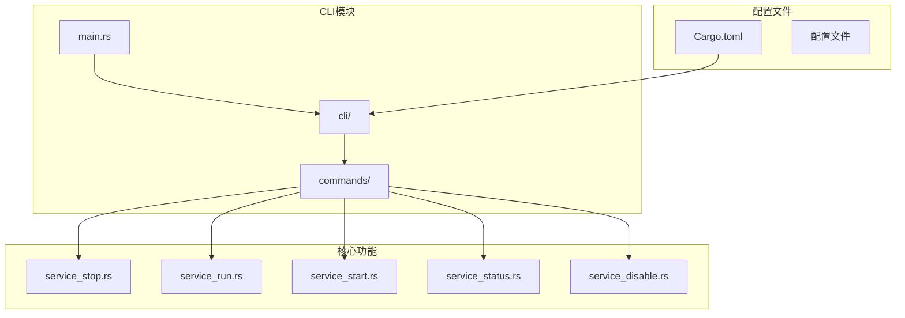
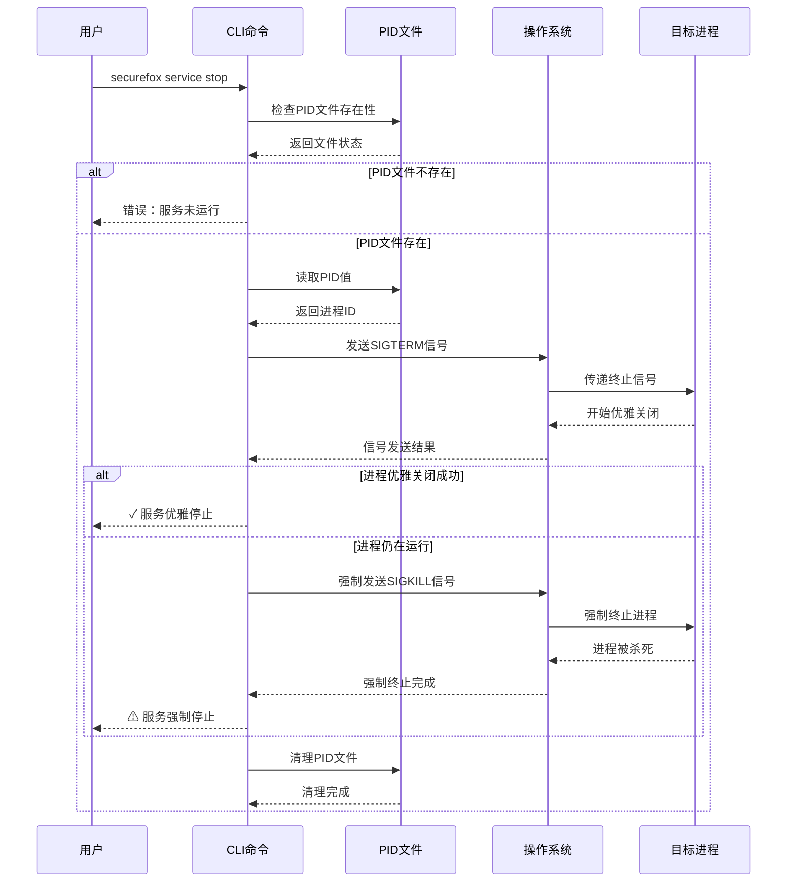
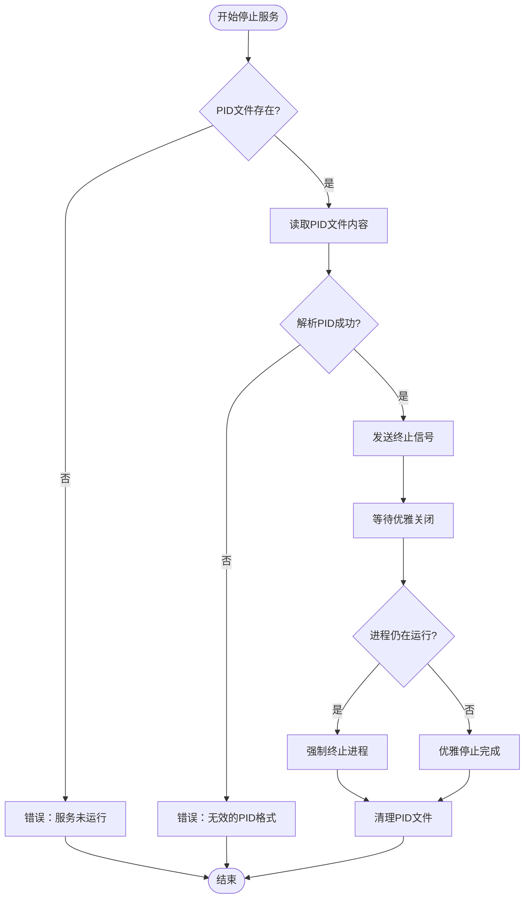
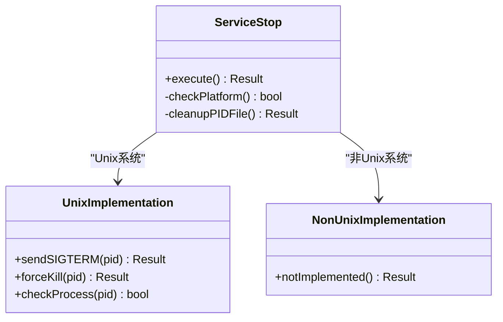
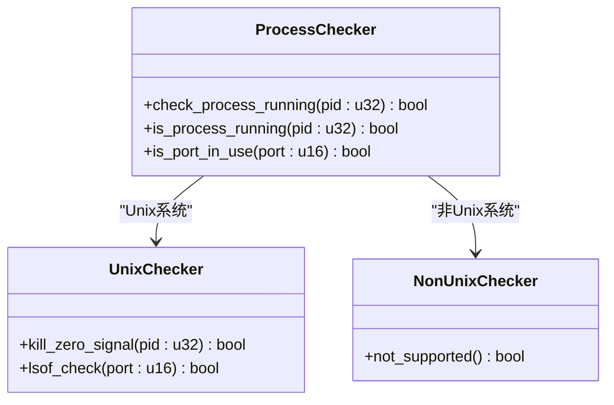
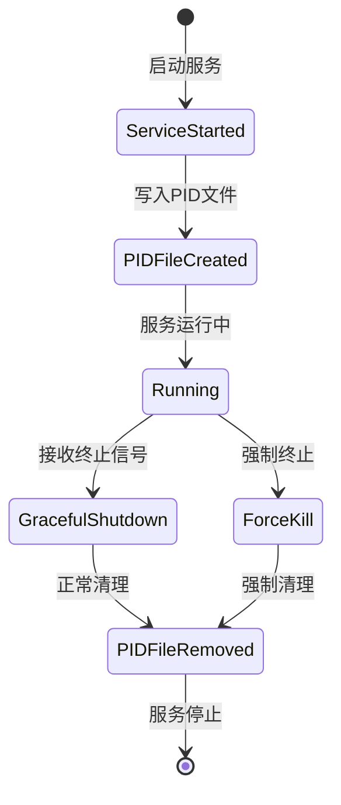
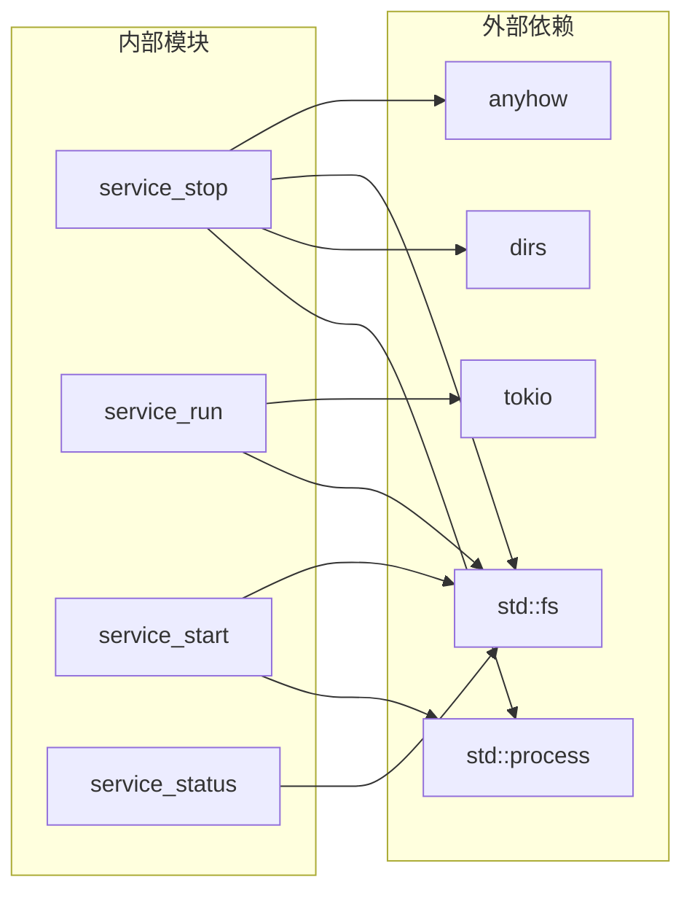
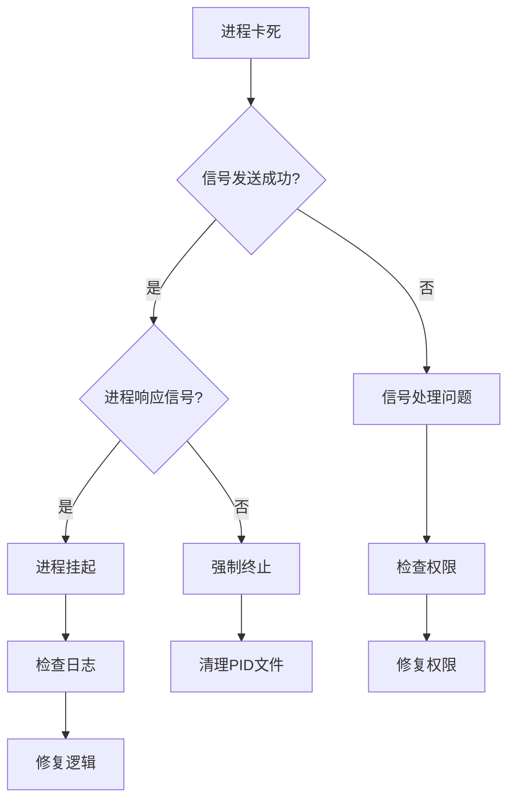

# 停止服务

<cite>
**本文档中引用的文件**
- [service_stop.rs](file://cli/src/commands/service_stop.rs)
- [service_run.rs](file://cli/src/commands/service_run.rs)
- [service_start.rs](file://cli/src/commands/service_start.rs)
- [service_status.rs](file://cli/src/commands/service_status.rs)
- [service_disable.rs](file://cli/src/commands/service_disable.rs)
- [main.rs](file://cli/src/main.rs)
- [Cargo.toml](file://cli/Cargo.toml)
</cite>

## 目录
1. [简介](#简介)
2. [项目结构](#项目结构)
3. [核心组件](#核心组件)
4. [架构概览](#架构概览)
5. [详细组件分析](#详细组件分析)
6. [依赖关系分析](#依赖关系分析)
7. [性能考虑](#性能考虑)
8. [故障排除指南](#故障排除指南)
9. [结论](#结论)

## 简介

SecureFox是一个密码管理器应用程序，提供了完整的服务生命周期管理功能。其中，`securefox service stop`命令负责优雅地终止正在运行的后台服务进程。该命令通过读取PID文件定位目标进程，发送终止信号，并在必要时执行强制终止操作。

本文档深入分析了服务停止机制的实现细节，包括进程定位、信号处理、优雅关闭与强制终止的区别，以及在不同平台上的兼容性处理。

## 项目结构

SecureFox项目采用模块化架构，主要包含以下关键目录：



**图表来源**
- [main.rs](file://cli/src/main.rs#L229-L286)
- [service_stop.rs](file://cli/src/commands/service_stop.rs#L1-L66)

**章节来源**
- [main.rs](file://cli/src/main.rs#L229-L286)
- [Cargo.toml](file://cli/Cargo.toml#L1-L77)

## 核心组件

### PID文件管理系统

PID文件是服务进程标识的核心机制，存储在用户主目录下的`.securefox`目录中：

- **PID文件路径**: `~/.securefox/service.pid`
- **文件内容**: 包含服务进程的PID值
- **用途**: 用于定位和管理服务进程

### 信号处理机制

系统实现了多层次的信号处理策略：

1. **优雅关闭信号**: 发送SIGTERM信号
2. **强制终止信号**: 发送SIGKILL信号（-9）
3. **状态检查信号**: 使用kill -0检查进程存在性

### 平台兼容性

- **Unix系统**: 完整支持所有功能
- **非Unix系统**: 仅支持PID文件清理，不支持实际进程终止

**章节来源**
- [service_stop.rs](file://cli/src/commands/service_stop.rs#L5-L65)
- [service_run.rs](file://cli/src/commands/service_run.rs#L15-L21)

## 架构概览

服务停止系统的整体架构展示了从命令调用到进程终止的完整流程：



**图表来源**
- [service_stop.rs](file://cli/src/commands/service_stop.rs#L4-L65)
- [service_run.rs](file://cli/src/commands/service_run.rs#L53-L72)

## 详细组件分析

### 服务停止命令实现

#### PID文件验证与读取

服务停止命令首先验证PID文件的存在性和有效性：



**图表来源**
- [service_stop.rs](file://cli/src/commands/service_stop.rs#L11-L65)

#### Unix系统信号处理

在Unix系统上，服务停止采用分阶段的信号处理策略：

1. **第一阶段：优雅关闭**
   - 发送SIGTERM信号（默认kill行为）
   - 等待1秒让进程处理关闭逻辑
   - 检查进程是否仍然运行

2. **第二阶段：强制终止**
   - 如果进程仍在运行，发送SIGKILL信号（kill -9）
   - 强制终止进程

3. **清理阶段**
   - 删除PID文件以释放资源
   - 提供用户反馈

#### 非Unix系统限制

在非Unix系统上，由于缺乏原生信号支持，服务停止功能受到限制：



**图表来源**
- [service_stop.rs](file://cli/src/commands/service_stop.rs#L55-L59)

**章节来源**
- [service_stop.rs](file://cli/src/commands/service_stop.rs#L4-L65)

### 进程状态监控

#### 进程存在性检查

系统使用多种方法检测进程状态：



**图表来源**
- [service_start.rs](file://cli/src/commands/service_start.rs#L94-L130)
- [service_status.rs](file://cli/src/commands/service_status.rs#L76-L92)

#### 优雅关闭vs强制终止

两种终止方式的关键区别：

| 特性 | 优雅关闭 | 强制终止 |
|------|----------|----------|
| 信号类型 | SIGTERM | SIGKILL (-9) |
| 处理时间 | 可配置 | 即刻生效 |
| 资源清理 | 完整执行 | 不执行 |
| 数据完整性 | 保证 | 可能损坏 |
| 用户体验 | 平滑 | 突然中断 |
| 触发条件 | 默认行为 | 进程无响应 |

**章节来源**
- [service_stop.rs](file://cli/src/commands/service_stop.rs#L28-L46)

### PID文件生命周期管理

#### 创建与维护

PID文件在服务启动时创建，在正常退出或异常终止时清理：



**图表来源**
- [service_run.rs](file://cli/src/commands/service_run.rs#L15-L21)
- [service_run.rs](file://cli/src/commands/service_run.rs#L53-L72)

#### 错误恢复策略

系统实现了多层错误处理机制：

1. **文件访问错误**: 提供友好的错误消息
2. **进程通信失败**: 尝试备用方法
3. **权限问题**: 明确指出权限不足
4. **竞态条件**: 实现重试机制

**章节来源**
- [service_run.rs](file://cli/src/commands/service_run.rs#L53-L72)
- [service_start.rs](file://cli/src/commands/service_start.rs#L55-L57)

## 依赖关系分析

### 核心依赖

服务停止功能依赖以下关键组件：



**图表来源**
- [service_stop.rs](file://cli/src/commands/service_stop.rs#L1-L3)
- [Cargo.toml](file://cli/Cargo.toml#L12-L77)

### 功能依赖关系

各服务命令之间存在明确的依赖关系：

| 命令 | 依赖 | 提供 |
|------|------|------|
| service start | PID文件创建 | 进程标识 |
| service stop | PID文件读取 | 进程终止 |
| service status | PID文件检查 | 状态查询 |
| service run | PID文件写入 | 实际运行 |

**章节来源**
- [service_start.rs](file://cli/src/commands/service_start.rs#L14-L27)
- [service_stop.rs](file://cli/src/commands/service_stop.rs#L9-L13)

## 性能考虑

### 响应时间优化

服务停止操作的时间特性：

- **正常情况**: 1-2秒完成
- **强制终止**: 即刻生效
- **PID文件清理**: 几毫秒内完成

### 资源使用

系统在停止过程中保持低资源占用：

- **CPU使用**: 主要集中在信号发送和状态检查
- **内存占用**: 维持在最小水平
- **磁盘I/O**: 仅涉及PID文件的读写操作

### 并发安全性

虽然当前实现为单线程操作，但设计考虑了并发场景：

- **竞态条件防护**: 通过原子操作避免数据竞争
- **资源清理**: 确保即使在异常情况下也能正确清理
- **错误隔离**: 单个操作失败不影响其他功能

## 故障排除指南

### 常见问题及解决方案

#### PID文件残留问题

**症状**: 服务已停止，但PID文件仍然存在

**原因分析**:
- 进程异常终止
- 文件系统权限问题
- 系统崩溃

**解决步骤**:
1. 手动删除PID文件: `rm ~/.securefox/service.pid`
2. 检查是否有残留进程: `ps aux | grep securefox`
3. 强制终止残留进程: `kill -9 <PID>`

#### 进程卡死问题

**症状**: 发送终止信号后进程仍然运行

**诊断流程**:


**图表来源**
- [service_stop.rs](file://cli/src/commands/service_stop.rs#L26-L46)

#### 平台兼容性问题

**Unix系统问题**:
- 缺少必要的工具: `kill`, `ps`, `lsof`
- 权限不足: 无法终止其他用户的进程
- 系统限制: 进程数量超过限制

**非Unix系统问题**:
- 功能不可用: 仅支持PID文件清理
- 替代方案: 使用系统任务管理器

### 调试技巧

#### 日志分析

启用详细日志记录来诊断问题：

```bash
# 设置环境变量启用调试
export RUST_LOG=debug
securefox service stop --verbose
```

#### 状态检查

使用状态命令验证系统状态：

```bash
# 检查服务状态
securefox service status

# 检查端口占用
lsof -i :8787  # Unix系统
netstat -ano | findstr :8787  # Windows系统
```

**章节来源**
- [service_status.rs](file://cli/src/commands/service_status.rs#L15-L71)
- [service_start.rs](file://cli/src/commands/service_start.rs#L113-L130)

### 错误恢复最佳实践

1. **定期备份**: 在重要操作前备份PID文件
2. **监控告警**: 设置进程监控和告警机制
3. **自动化脚本**: 编写自动化的故障恢复脚本
4. **文档记录**: 记录常见问题和解决方案

## 结论

SecureFox的服务停止机制提供了一个完整、可靠的进程管理解决方案。通过PID文件定位、分阶段信号处理、以及跨平台兼容性设计，确保了服务能够安全、有效地停止。

### 主要优势

1. **优雅关闭优先**: 首先尝试优雅关闭，保护数据完整性
2. **强制终止保障**: 在必要时提供强制终止选项
3. **跨平台支持**: 在Unix系统上提供完整功能
4. **错误处理完善**: 提供详细的错误信息和恢复建议

### 改进建议

1. **Windows支持**: 实现Windows平台的进程终止功能
2. **超时控制**: 添加可配置的等待超时时间
3. **批量操作**: 支持同时停止多个服务实例
4. **监控集成**: 与系统监控工具深度集成

该实现为SecureFox提供了坚实的基础服务管理能力，确保用户能够可靠地控制应用程序的生命周期。