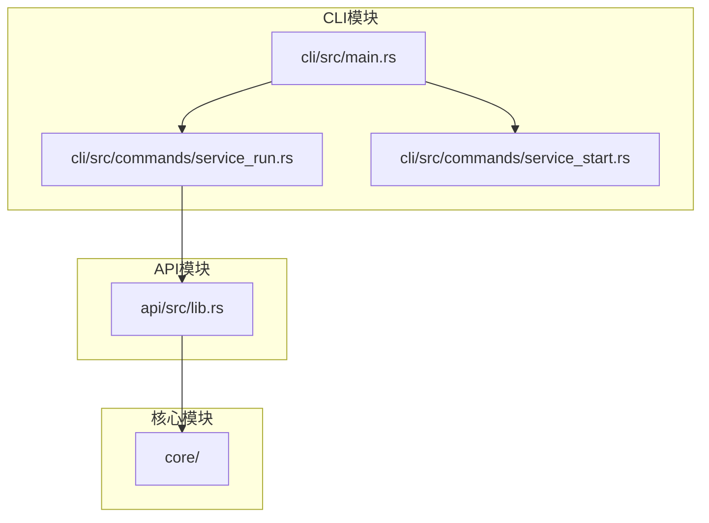
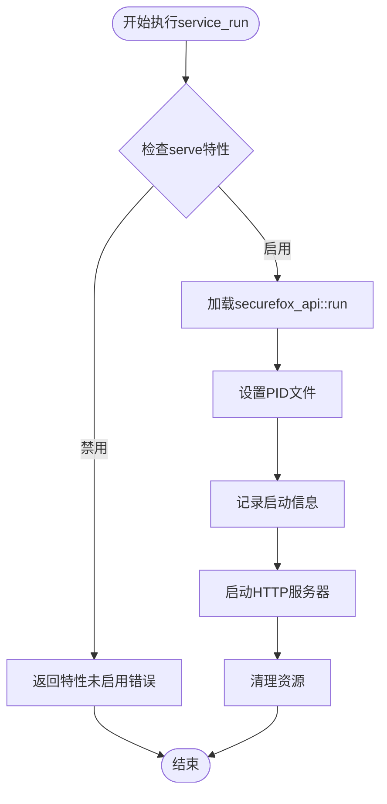
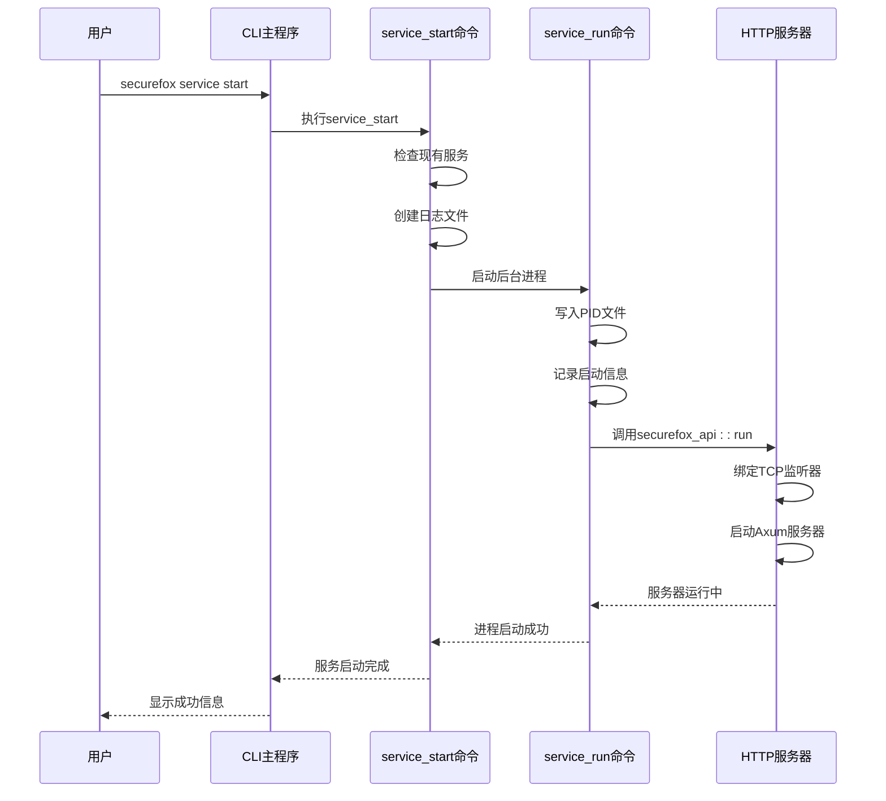
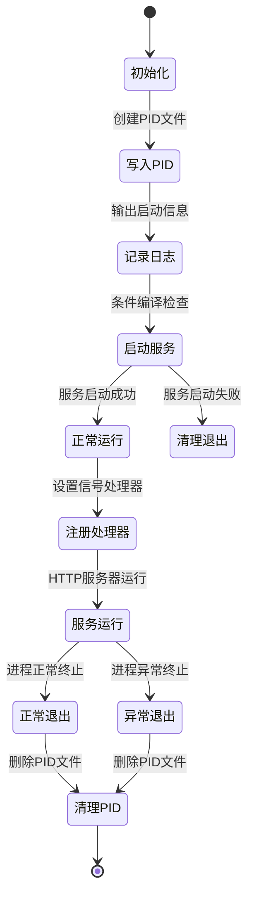
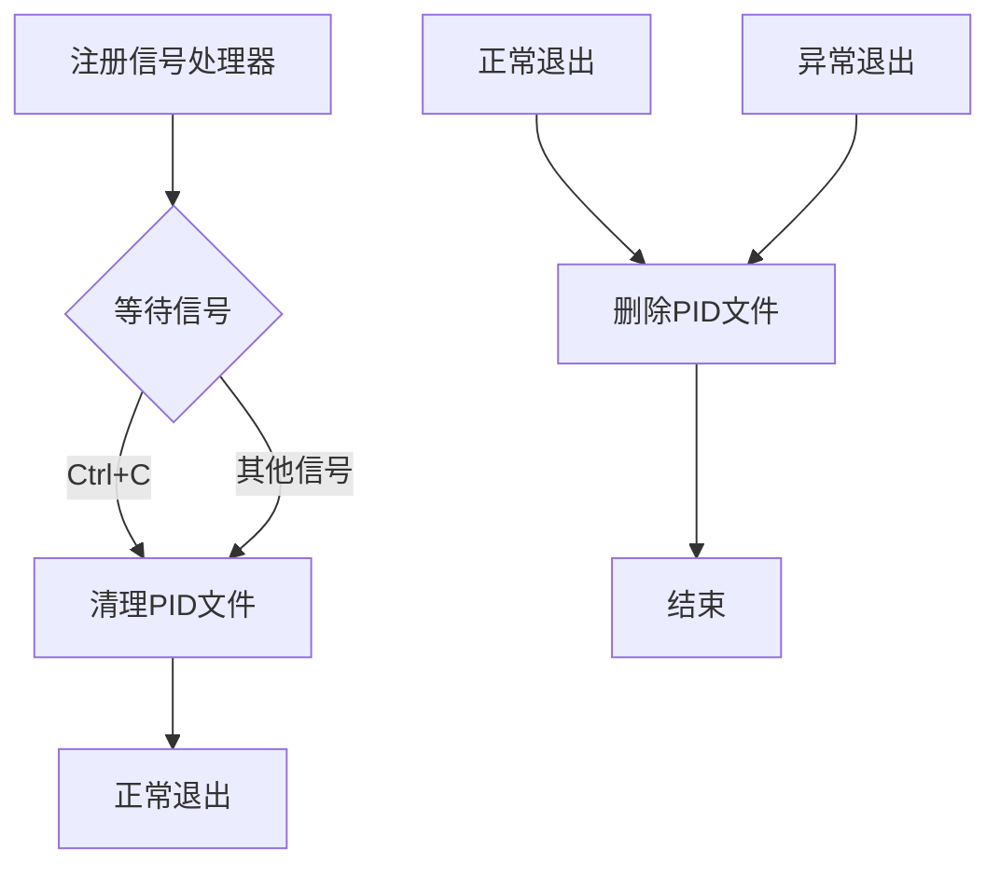
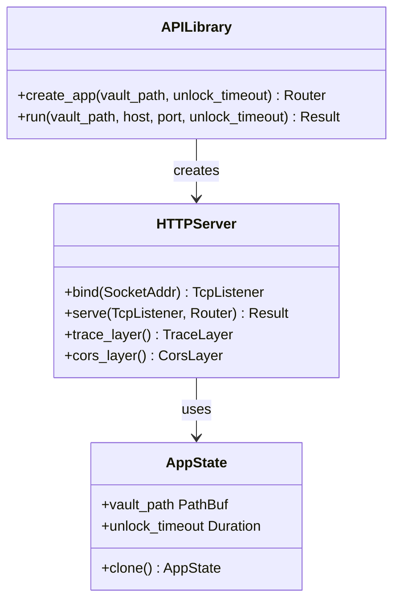
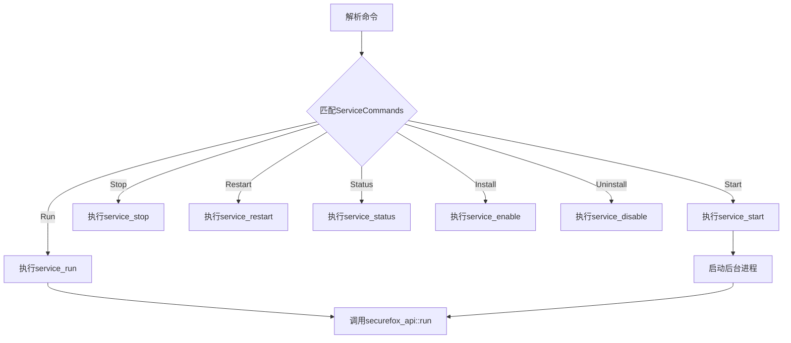
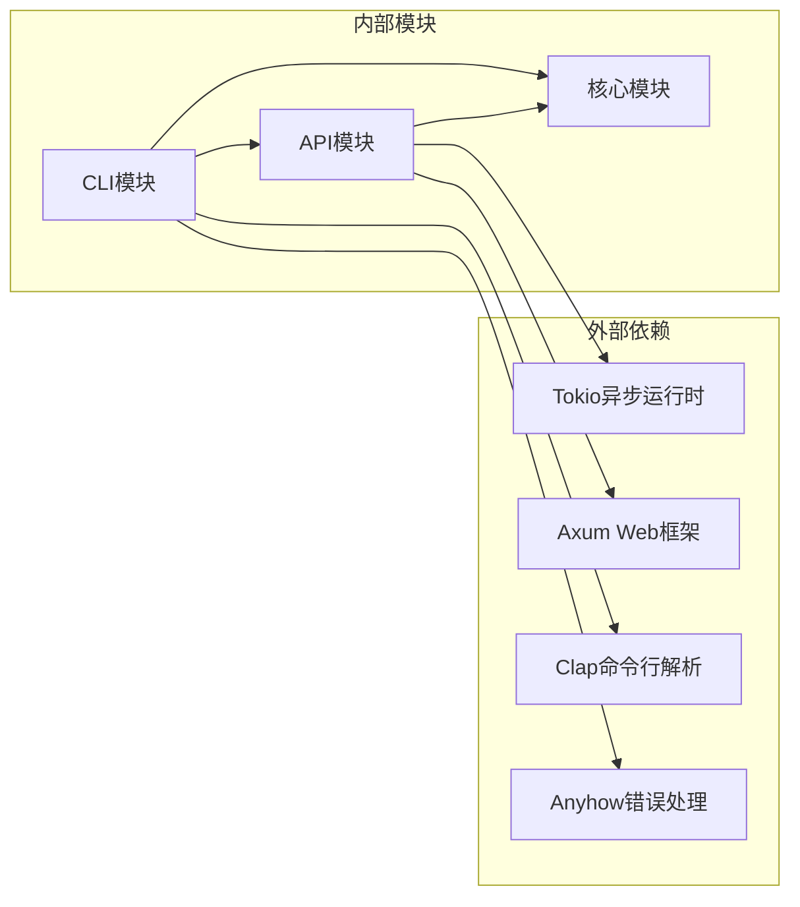

# 内部运行命令

<cite>
**本文档中引用的文件**
- [service_run.rs](file://cli/src/commands/service_run.rs)
- [main.rs](file://cli/src/main.rs)
- [service_start.rs](file://cli/src/commands/service_start.rs)
- [lib.rs](file://api/src/lib.rs)
- [Cargo.toml](file://Cargo.toml)
</cite>

## 目录
1. [简介](#简介)
2. [项目结构概述](#项目结构概述)
3. [核心组件分析](#核心组件分析)
4. [架构概览](#架构概览)
5. [详细组件分析](#详细组件分析)
6. [依赖关系分析](#依赖关系分析)
7. [性能考虑](#性能考虑)
8. [故障排除指南](#故障排除指南)
9. [结论](#结论)

## 简介

`service_run`是SecureFox密码管理器中的一个内部命令，专门用于作为后台服务的实际入口点。该命令通过`service start`命令派生的子进程调用，负责启动HTTP服务器并运行`securefox_api::run`函数来提供RESTful API服务。该命令具有特殊的设计原则，不应被用户直接调用，而是作为CLI主命令的调用隔离机制的一部分。

## 项目结构概述

SecureFox采用模块化架构，主要包含以下核心模块：



**图表来源**
- [main.rs](file://cli/src/main.rs#L1-L50)
- [service_run.rs](file://cli/src/commands/service_run.rs#L1-L30)
- [lib.rs](file://api/src/lib.rs#L1-L20)

**章节来源**
- [main.rs](file://cli/src/main.rs#L1-L405)
- [Cargo.toml](file://Cargo.toml#L1-L23)

## 核心组件分析

### service_run命令的核心功能

`service_run`命令实现了以下关键功能：

1. **PID文件管理**：自动创建和清理PID文件以跟踪服务进程
2. **服务启动日志**：提供详细的服务启动信息和时间戳
3. **条件编译支持**：基于`serve`特性标志控制API服务器的启用
4. **优雅关闭处理**：注册信号处理器确保服务正常终止

### 特性标志机制

该命令使用Rust的条件编译特性来控制API服务器的功能可用性：



**图表来源**
- [service_run.rs](file://cli/src/commands/service_run.rs#L48-L76)

**章节来源**
- [service_run.rs](file://cli/src/commands/service_run.rs#L1-L80)

## 架构概览

### 命令调用流程

`service_run`作为内部命令，其调用流程体现了清晰的分层架构：



**图表来源**
- [main.rs](file://cli/src/main.rs#L371-L391)
- [service_start.rs](file://cli/src/commands/service_start.rs#L37-L52)
- [service_run.rs](file://cli/src/commands/service_run.rs#L64-L70)

## 详细组件分析

### service_run命令实现

#### 函数签名和参数处理

`service_run`命令接受四个关键参数：
- `vault_path`: 密码库路径，必须指定
- `host`: 服务器绑定地址，默认为127.0.0.1
- `port`: 服务器端口号，默认为8787
- `timeout`: 解锁超时时间，单位秒，默认为1800秒

#### PID文件管理机制

命令实现了完整的PID文件生命周期管理：



**图表来源**
- [service_run.rs](file://cli/src/commands/service_run.rs#L16-L70)

#### 特性编译控制

该命令使用Rust的条件编译特性来控制API服务器的可用性：

| 特性标志 | 功能状态 | 描述 |
|---------|---------|------|
| `serve` | 启用 | 允许启动HTTP服务器和API功能 |
| 无特性标志 | 禁用 | 仅允许基本命令功能，API服务器不可用 |

当`serve`特性启用时，命令会调用`securefox_api::run`函数启动HTTP服务器；否则返回特性未启用的错误。

#### 信号处理和优雅关闭

命令实现了完整的信号处理机制：



**图表来源**
- [service_run.rs](file://cli/src/commands/service_run.rs#L51-L62)

**章节来源**
- [service_run.rs](file://cli/src/commands/service_run.rs#L1-L80)

### API服务器集成

#### securefox_api::run函数

API服务器由`securefox_api::run`函数提供，该函数位于API模块中：



**图表来源**
- [lib.rs](file://api/src/lib.rs#L26-L102)
- [lib.rs](file://api/src/lib.rs#L104-L140)

#### RESTful API路由结构

API服务器提供了完整的RESTful API接口：

| 路由类型 | 路径模式 | 方法 | 功能描述 |
|---------|---------|------|----------|
| 公共认证 | `/unlock` | POST | 用户解锁密码库 |
| 公共认证 | `/status` | GET | 获取服务状态 |
| 公共认证 | `/version` | GET | 获取版本信息 |
| 受保护路由 | `/items` | GET | 列出所有条目 |
| 受保护路由 | `/items` | POST | 创建新条目 |
| 受保护路由 | `/items/:id` | GET | 获取单个条目 |
| 受保护路由 | `/items/:id` | PUT | 更新条目 |
| 受保护路由 | `/items/:id` | DELETE | 删除条目 |
| 受保护路由 | `/items/:id/totp` | GET | 获取TOTP代码 |
| 受保护路由 | `/generate/password` | POST | 生成密码 |
| 受保护路由 | `/sync/push` | POST | 推送同步 |
| 受保护路由 | `/sync/pull` | POST | 拉取同步 |
| 健康检查 | `/health` | GET | 健康状态检查 |
| WebSocket | `/ws` | GET | 实时更新连接 |

**章节来源**
- [lib.rs](file://api/src/lib.rs#L1-L141)

### CLI主程序集成

#### 命令隐藏机制

`service_run`命令在CLI主程序中被标记为隐藏命令：

```rust
#[command(hide = true)]
Run {
    // 参数定义
}
```

这种设计原则确保了：
1. **用户界面简洁**：普通用户不会看到内部命令
2. **功能隔离**：防止用户误操作
3. **维护便利**：便于内部功能的演进

#### 命令解析流程

CLI主程序通过模式匹配处理不同的服务命令：



**图表来源**
- [main.rs](file://cli/src/main.rs#L371-L391)

**章节来源**
- [main.rs](file://cli/src/main.rs#L233-L292)

## 依赖关系分析

### 模块间依赖关系



**图表来源**
- [Cargo.toml](file://Cargo.toml#L12-L22)

### 特性标志依赖

| 特性名称 | 依赖模块 | 功能描述 |
|---------|---------|----------|
| `serve` | API模块 | 启用HTTP服务器功能 |
| 默认特性 | CLI模块 | 基本命令行功能 |

**章节来源**
- [Cargo.toml](file://Cargo.toml#L1-L23)

## 性能考虑

### 启动性能优化

1. **异步启动**：使用Tokio异步运行时提高并发性能
2. **延迟初始化**：按需加载API组件
3. **资源预分配**：提前分配必要的内存和网络资源

### 内存管理

1. **PID文件清理**：确保进程终止时正确清理资源
2. **优雅关闭**：通过信号处理器实现平滑退出
3. **连接池管理**：合理配置HTTP连接池大小

### 网络性能

1. **TCP监听器复用**：避免频繁的套接字创建和销毁
2. **连接超时控制**：设置合理的连接超时时间
3. **并发限制**：通过Axum中间件控制并发请求数量

## 故障排除指南

### 常见问题及解决方案

#### 1. 服务启动失败

**症状**：`service start`命令执行后服务无法启动

**可能原因**：
- 端口已被占用
- 密码库路径不存在或权限不足
- 缺少`serve`特性标志

**解决步骤**：
1. 检查端口占用情况：`lsof -i :8787`
2. 验证密码库路径：`ls -la ~/.securefox`
3. 重新编译带`serve`特性的版本

#### 2. PID文件相关问题

**症状**：服务启动后PID文件存在但服务不可用

**可能原因**：
- 前次服务异常退出
- PID文件权限问题

**解决步骤**：
1. 检查进程状态：`ps aux | grep securefox`
2. 手动删除PID文件：`rm ~/.securefox/service.pid`
3. 重启服务

#### 3. API服务器功能缺失

**症状**：尝试访问API端点时收到"API server feature not enabled"错误

**解决步骤**：
1. 确认编译时启用了`serve`特性
2. 重新编译项目：`cargo build --features serve`
3. 验证特性标志：`cargo tree --features serve`

**章节来源**
- [service_run.rs](file://cli/src/commands/service_run.rs#L73-L76)
- [service_start.rs](file://cli/src/commands/service_start.rs#L14-L26)

## 结论

`service_run`命令作为SecureFox系统中的关键内部组件，体现了良好的软件工程实践：

1. **清晰的职责分离**：将服务启动逻辑与CLI命令解析分离
2. **条件编译支持**：通过特性标志实现灵活的功能控制
3. **优雅的资源管理**：完善的PID文件管理和信号处理机制
4. **安全的设计原则**：隐藏内部命令防止误操作
5. **可扩展的架构**：模块化设计便于功能扩展

该命令的设计充分考虑了生产环境的需求，提供了稳定、可靠的服务启动机制，同时保持了良好的用户体验和系统安全性。通过合理的抽象和封装，它成功地将复杂的HTTP服务器启动逻辑与用户友好的CLI界面分离，展现了优秀的软件架构设计。