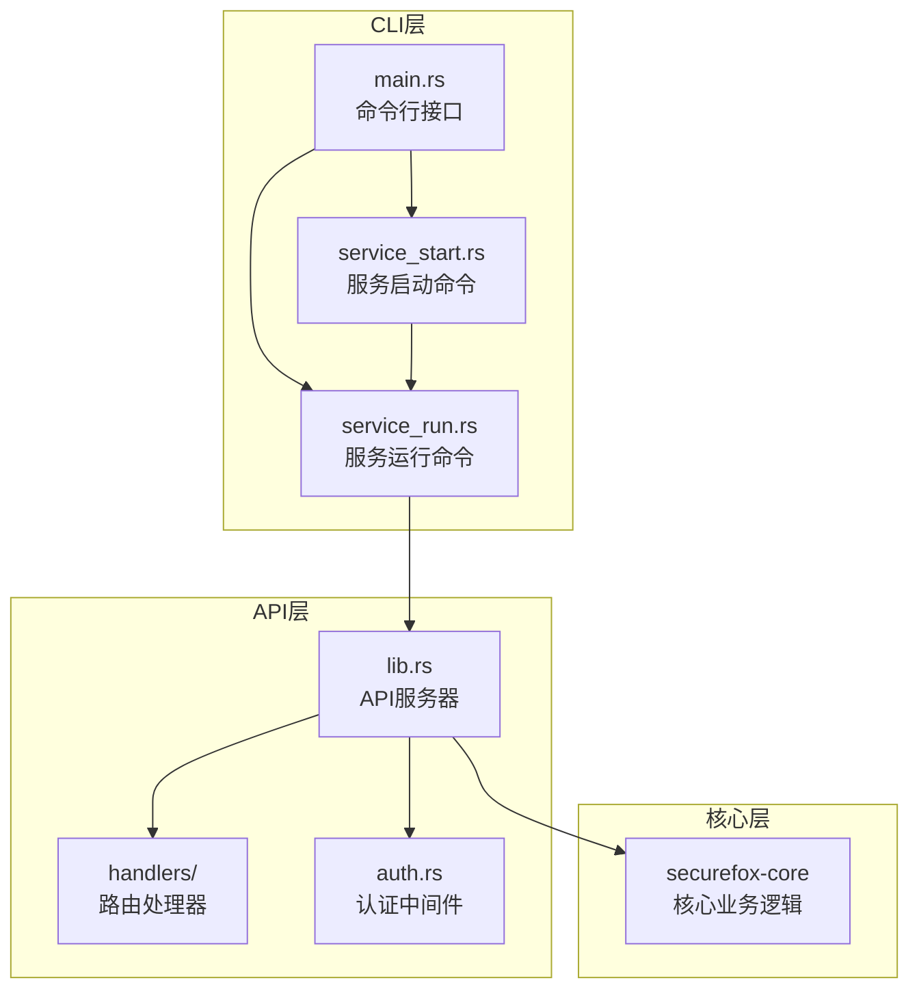
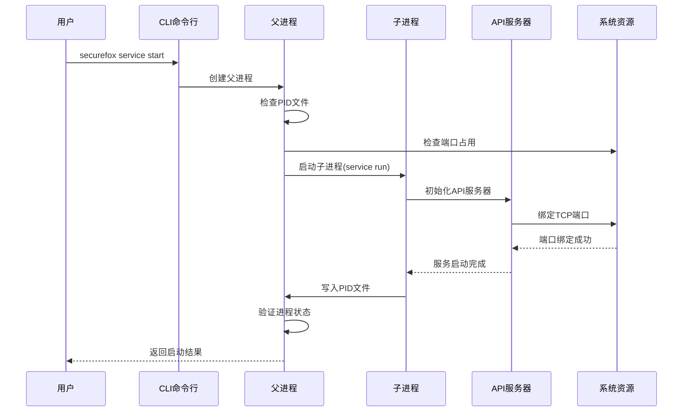
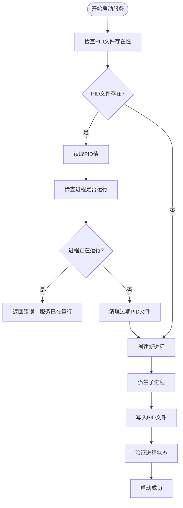
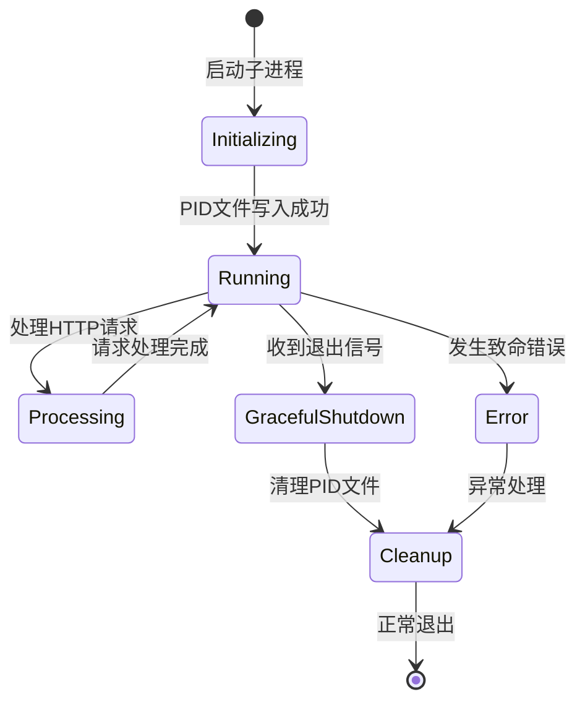
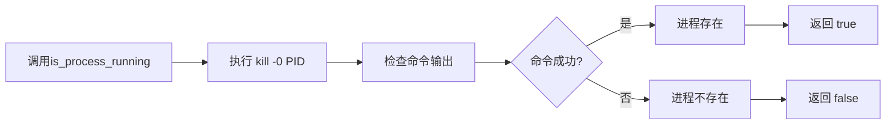
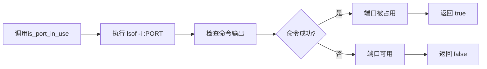
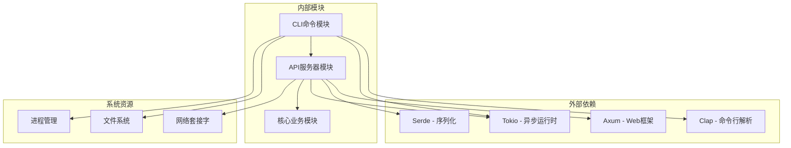

# 启动服务

<cite>
**本文档中引用的文件**
- [service_start.rs](file://cli/src/commands/service_start.rs)
- [service_run.rs](file://cli/src/commands/service_run.rs)
- [main.rs](file://cli/src/main.rs)
- [lib.rs](file://api/src/lib.rs)
- [auth.rs](file://api/src/auth.rs)
- [handlers/mod.rs](file://api/src/handlers/mod.rs)
- [Cargo.toml](file://api/Cargo.toml)
</cite>

## 目录
1. [简介](#简介)
2. [项目结构概览](#项目结构概览)
3. [核心组件分析](#核心组件分析)
4. [架构概述](#架构概述)
5. [详细组件分析](#详细组件分析)
6. [依赖关系分析](#依赖关系分析)
7. [性能考虑](#性能考虑)
8. [故障排除指南](#故障排除指南)
9. [结论](#结论)

## 简介

SecureFox的`securefox service start`命令是一个复杂的后台服务启动机制，它通过派生子进程的方式运行API服务器，提供了完整的进程管理、端口绑定检测和日志重定向功能。该命令实现了Unix系统上的进程监控、PID文件管理和端口占用检测等关键特性，确保服务的稳定运行和可靠管理。

## 项目结构概览

SecureFox采用模块化架构设计，主要包含以下核心模块：



**图表来源**
- [main.rs](file://cli/src/main.rs#L294-L392)
- [service_start.rs](file://cli/src/commands/service_start.rs#L1-L131)
- [service_run.rs](file://cli/src/commands/service_run.rs#L1-L83)

**章节来源**
- [main.rs](file://cli/src/main.rs#L1-L405)
- [service_start.rs](file://cli/src/commands/service_start.rs#L1-L131)

## 核心组件分析

### 命令行接口层

SecureFox的命令行接口基于Clap库构建，支持丰富的子命令和参数配置。`service start`命令是其中的重要组成部分，提供了完整的服务生命周期管理功能。

### API服务器层

API服务器基于Axum框架构建，支持异步处理和WebSocket连接。服务器实现了完整的RESTful API，包括认证、授权、数据CRUD操作等功能。

### 进程管理机制

服务启动采用了双进程模型：父进程负责服务管理和状态监控，子进程实际运行API服务器。这种设计确保了服务的稳定性和可管理性。

**章节来源**
- [main.rs](file://cli/src/main.rs#L294-L392)
- [lib.rs](file://api/src/lib.rs#L1-L141)

## 架构概述

SecureFox的服务启动架构采用了分层设计模式，确保了各层之间的松耦合和高内聚：



**图表来源**
- [service_start.rs](file://cli/src/commands/service_start.rs#L6-L90)
- [service_run.rs](file://cli/src/commands/service_run.rs#L8-L82)

## 详细组件分析

### 服务启动命令实现

`service_start.rs`文件实现了`securefox service start`命令的核心逻辑，包括以下关键步骤：

#### PID文件管理



**图表来源**
- [service_start.rs](file://cli/src/commands/service_start.rs#L14-L70)

#### 日志重定向机制

服务启动过程中实现了完整的日志重定向功能：

| 文件类型 | 路径格式 | 用途 | 权限要求 |
|---------|---------|------|----------|
| 主日志文件 | `{vault_path}/service.log` | 记录正常运行日志 | 可写权限 |
| 错误日志文件 | `{vault_path}/service.err` | 记录错误和异常信息 | 可写权限 |
| PID文件 | `{vault_path}/service.pid` | 存储服务进程ID | 可写权限 |

#### 参数配置系统

服务启动支持以下关键参数：

| 参数名称 | 类型 | 默认值 | 安全建议 | 作用描述 |
|---------|------|--------|----------|----------|
| `host` | String | "127.0.0.1" | 限制为本地地址 | API服务器监听地址 |
| `port` | u16 | 8787 | 使用非特权端口 | TCP监听端口号 |
| `timeout` | u64 | 1800 | 设置合理超时时间 | 解锁超时秒数 |

**章节来源**
- [service_start.rs](file://cli/src/commands/service_start.rs#L6-L90)

### 子进程运行机制

`service_run.rs`负责实际的API服务器启动和运行：

#### 进程生命周期管理



**图表来源**
- [service_run.rs](file://cli/src/commands/service_run.rs#L52-L82)

#### API服务器初始化

API服务器的初始化过程包括以下关键步骤：

1. **应用状态初始化**：创建`AppState`实例，设置存储路径和解锁超时
2. **路由配置**：注册公共和受保护的API路由
3. **中间件配置**：设置CORS、认证和追踪中间件
4. **服务器启动**：绑定TCP监听器并启动HTTP服务器

**章节来源**
- [service_run.rs](file://cli/src/commands/service_run.rs#L8-L82)
- [lib.rs](file://api/src/lib.rs#L26-L80)

### Unix系统进程监控实现

#### `is_process_running`函数实现

该函数利用Unix系统的`kill -0`机制实现进程监控：



**图表来源**
- [service_start.rs](file://cli/src/commands/service_start.rs#L94-L110)

#### `is_port_in_use`函数实现

该函数使用`lsof`工具检测端口占用情况：



**图表来源**
- [service_start.rs](file://cli/src/commands/service_start.rs#L113-L129)

**章节来源**
- [service_start.rs](file://cli/src/commands/service_start.rs#L94-L131)

### API路由系统

API服务器实现了完整的RESTful路由系统：

#### 公共认证路由

| 路由路径 | HTTP方法 | 功能描述 | 认证要求 |
|---------|---------|----------|----------|
| `/unlock` | POST | 用户解锁凭据 | 无 |
| `/status` | GET | 获取服务状态 | 无 |
| `/version` | GET | 获取版本信息 | 无 |

#### 受保护的业务路由

| 路由路径 | HTTP方法 | 功能描述 | 认证要求 |
|---------|---------|----------|----------|
| `/lock` | POST | 用户锁定凭据 | 是 |
| `/items` | GET | 列出所有项目 | 是 |
| `/items` | POST | 创建新项目 | 是 |
| `/items/:id` | GET | 获取单个项目 | 是 |
| `/items/:id` | PUT | 更新项目信息 | 是 |
| `/items/:id` | DELETE | 删除项目 | 是 |
| `/items/:id/totp` | GET | 获取TOTP验证码 | 是 |
| `/generate/password` | POST | 生成密码 | 是 |
| `/sync/push` | POST | 推送同步数据 | 是 |
| `/sync/pull` | POST | 拉取同步数据 | 是 |

#### WebSocket实时通信

| 路由路径 | 协议类型 | 功能描述 | 认证要求 |
|---------|---------|----------|----------|
| `/ws` | WebSocket | 实时数据推送 | 是 |

**章节来源**
- [lib.rs](file://api/src/lib.rs#L42-L70)
- [handlers/mod.rs](file://api/src/handlers/mod.rs#L1-L389)

## 依赖关系分析

SecureFox的服务启动机制涉及多个层次的依赖关系：



**图表来源**
- [Cargo.toml](file://api/Cargo.toml#L12-L53)
- [main.rs](file://cli/src/main.rs#L1-L405)

**章节来源**
- [Cargo.toml](file://api/Cargo.toml#L1-L53)

## 性能考虑

### 并发处理能力

API服务器基于Tokio异步运行时构建，能够高效处理大量并发请求。通过使用异步I/O和连接池技术，系统能够在高负载情况下保持良好的响应性能。

### 内存管理优化

- **零拷贝字符串处理**：使用`&str`和`Cow`类型减少内存分配
- **连接复用**：支持HTTP/1.1和HTTP/2连接复用
- **内存池化**：对频繁分配的对象进行池化管理

### 网络性能优化

- **Keep-Alive连接**：启用HTTP Keep-Alive减少连接建立开销
- **压缩传输**：支持Gzip和Brotli压缩减少带宽使用
- **缓存策略**：实现适当的HTTP缓存头控制

## 故障排除指南

### 常见启动失败场景

#### 端口冲突问题

**症状表现**：
- 启动时提示"Failed to bind: Address already in use"
- 服务启动后立即停止

**诊断方法**：
```bash
# 检查端口占用情况
lsof -i :8787
netstat -tulpn | grep :8787
```

**解决方案**：
1. 更改服务端口：`securefox service start --port 8788`
2. 终止占用端口的进程
3. 检查防火墙设置

#### 权限不足问题

**症状表现**：
- 提示"Permission denied"错误
- 无法创建PID文件或日志文件

**诊断方法**：
```bash
# 检查目录权限
ls -la ~/.securefox/
# 检查文件权限
ls -la ~/.securefox/service.pid
```

**解决方案**：
1. 修改目录权限：`chmod 755 ~/.securefox/`
2. 更改文件所有者：`chown $USER:$USER ~/.securefox/`
3. 使用不同目录：`securefox --vault /tmp/securefox service start`

#### 进程监控失败

**症状表现**：
- 服务看似启动但无法访问
- PID文件存在但进程已退出

**诊断方法**：
1. 检查日志文件：`cat ~/.securefox/service.log`
2. 检查错误日志：`cat ~/.securefox/service.err`
3. 验证进程状态：`ps aux | grep securefox`

**解决方案**：
1. 查看详细错误信息
2. 检查配置文件语法
3. 验证依赖服务状态

### 调试技巧

#### 启用详细日志

```bash
# 启用调试模式
export RUST_LOG=debug
securefox service start
```

#### 验证网络连接

```bash
# 测试API服务
curl -X POST http://localhost:8787/api/unlock \
  -H "Content-Type: application/json" \
  -d '{"password":"test"}'
```

**章节来源**
- [service_start.rs](file://cli/src/commands/service_start.rs#L60-L82)
- [service_run.rs](file://cli/src/commands/service_run.rs#L23-L49)

## 结论

SecureFox的`securefox service start`命令实现了一个完整、可靠的后台服务启动机制。通过精心设计的双进程架构、完善的错误处理机制和全面的系统监控功能，该命令确保了服务的稳定运行和良好的用户体验。

### 主要优势

1. **可靠性**：通过PID文件管理和进程监控确保服务不重复启动
2. **安全性**：支持本地绑定和合理的默认配置
3. **可观测性**：完整的日志记录和状态监控
4. **可维护性**：清晰的错误处理和故障诊断机制

### 最佳实践建议

1. **定期监控**：使用`securefox service status`定期检查服务状态
2. **日志轮转**：配置日志文件轮转避免磁盘空间耗尽
3. **健康检查**：集成到系统监控体系中进行健康检查
4. **备份策略**：定期备份服务配置和数据文件

该服务启动机制为SecureFox提供了坚实的基础，支持其作为本地优先密码管理器的核心功能需求。