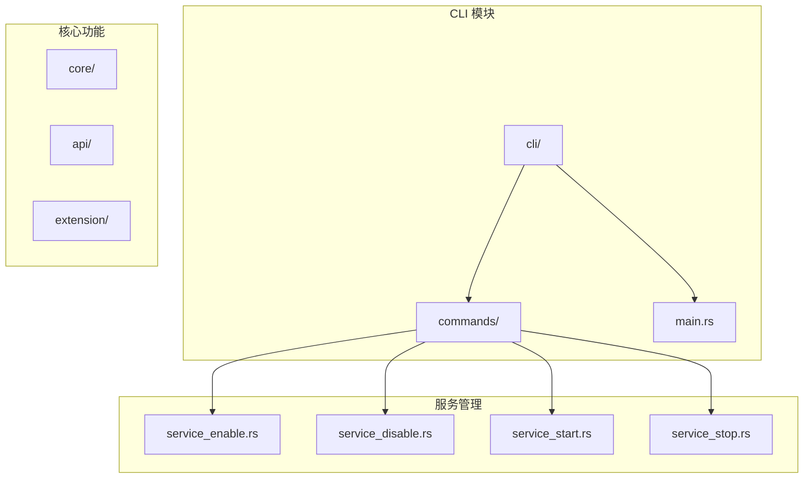
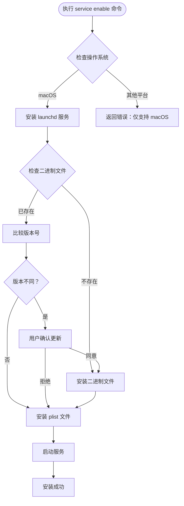
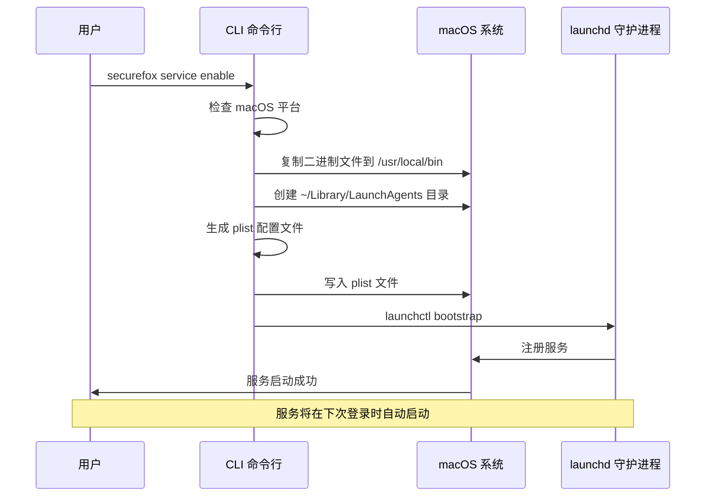
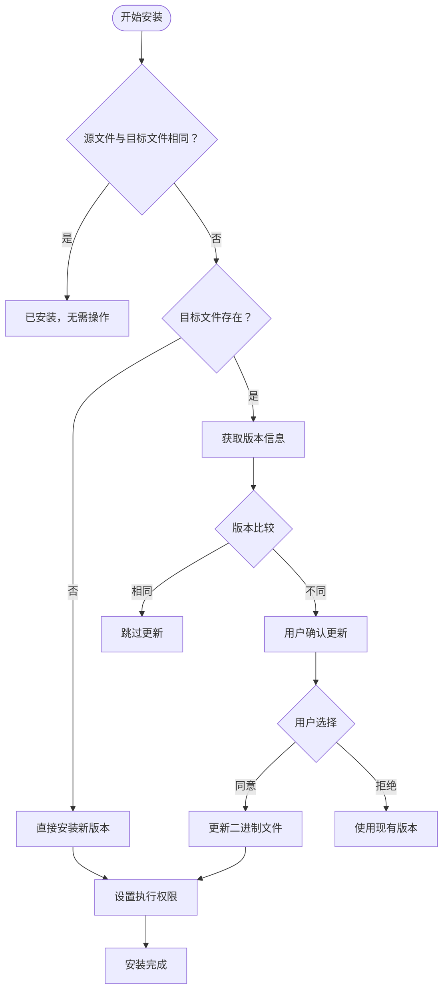
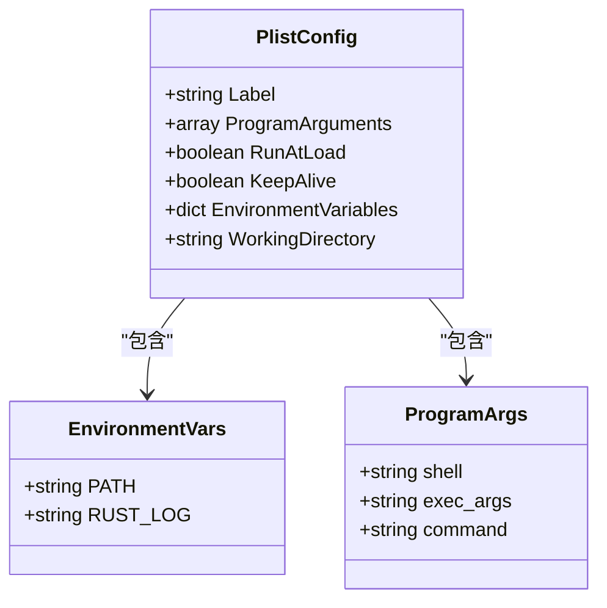
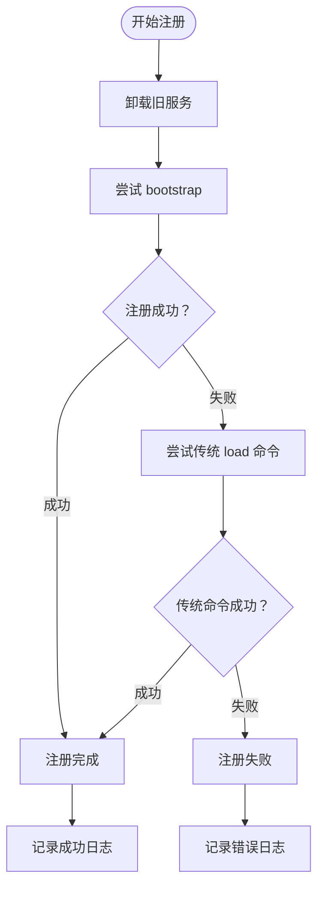
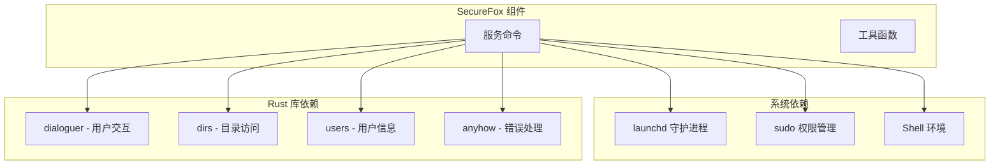

# 启用开机自启

<cite>
**本文档中引用的文件**
- [service_enable.rs](file://cli/src/commands/service_enable.rs)
- [service_disable.rs](file://cli/src/commands/service_disable.rs)
- [main.rs](file://cli/src/main.rs)
- [README.md](file://README.md)
</cite>

## 目录
1. [简介](#简介)
2. [项目结构概述](#项目结构概述)
3. [核心组件分析](#核心组件分析)
4. [架构概览](#架构概览)
5. [详细组件分析](#详细组件分析)
6. [依赖关系分析](#依赖关系分析)
7. [性能考虑](#性能考虑)
8. [故障排除指南](#故障排除指南)
9. [结论](#结论)

## 简介

SecureFox 是一个本地优先的密码管理器，提供了强大的开机自启动功能，允许用户在 macOS 系统上配置服务在系统启动时自动运行。本文档详细介绍了 `securefox service enable` 命令的实现原理，包括如何通过生成 launchd plist 文件并使用 `launchctl bootstrap` 注册系统服务，以及二进制文件安装到 `/usr/local/bin` 的必要性和版本检测机制。

该功能专为 macOS 平台设计，利用了 macOS 的 launchd 服务管理系统，确保 SecureFox 能够在用户登录时自动启动，提供无缝的用户体验。

## 项目结构概述

SecureFox 采用模块化架构，主要包含以下核心模块：



**图表来源**
- [main.rs](file://cli/src/main.rs#L371-L391)
- [service_enable.rs](file://cli/src/commands/service_enable.rs#L1-L302)

**章节来源**
- [main.rs](file://cli/src/main.rs#L1-L405)
- [service_enable.rs](file://cli/src/commands/service_enable.rs#L1-L302)

## 核心组件分析

### 平台特定的实现

SecureFox 使用条件编译来确保服务管理功能仅在 macOS 上可用：



**图表来源**
- [service_enable.rs](file://cli/src/commands/service_enable.rs#L5-L15)
- [service_enable.rs](file://cli/src/commands/service_enable.rs#L18-L222)

**章节来源**
- [service_enable.rs](file://cli/src/commands/service_enable.rs#L5-L15)
- [service_enable.rs](file://cli/src/commands/service_enable.rs#L18-L222)

## 架构概览

SecureFox 的服务管理架构基于 macOS 的 launchd 系统，通过以下关键组件实现开机自启动：



**图表来源**
- [service_enable.rs](file://cli/src/commands/service_enable.rs#L148-L206)

## 详细组件分析

### 二进制文件安装机制

#### `/usr/local/bin` 安装的必要性

SecureFox 将二进制文件安装到 `/usr/local/bin` 目录，这是 macOS 系统的标准可执行文件路径，具有以下优势：

1. **PATH 环境变量包含**：默认情况下，`/usr/local/bin` 包含在系统的 PATH 环境变量中
2. **管理员权限要求**：确保只有授权用户可以安装和修改系统级可执行文件
3. **统一管理**：便于系统管理和维护

#### 版本检测机制

系统实现了智能的版本检测和更新机制：



**图表来源**
- [service_enable.rs](file://cli/src/commands/service_enable.rs#L41-L102)

**章节来源**
- [service_enable.rs](file://cli/src/commands/service_enable.rs#L34-L139)

### launchd plist 文件生成

#### plist 文件结构分析

生成的 plist 文件包含了完整的服务配置信息：



**图表来源**
- [service_enable.rs](file://cli/src/commands/service_enable.rs#L256-L301)

#### 关键配置键值说明

1. **RunAtLoad 键**
   - 类型：布尔值
   - 作用：当服务被加载时立即启动
   - 值：`true`
   - 效果：确保服务在用户登录时立即启动

2. **KeepAlive 键**
   - 类型：布尔值
   - 作用：保持服务持续运行
   - 值：`true`
   - 效果：如果服务意外终止，系统会自动重启

3. **EnvironmentVariables 配置**
   - PATH：设置完整的环境变量路径
   - RUST_LOG：配置日志级别为 info

**章节来源**
- [service_enable.rs](file://cli/src/commands/service_enable.rs#L256-L301)

### 服务注册流程

#### launchctl 命令序列

服务注册采用了多步骤的健壮策略：



**图表来源**
- [service_enable.rs](file://cli/src/commands/service_enable.rs#L155-L206)

#### 兼容性处理

系统实现了多层次的兼容性处理：

1. **现代 macOS 版本**：使用 `launchctl bootstrap`
2. **传统 macOS 版本**：回退到 `launchctl load`
3. **错误处理**：优雅处理各种错误情况

**章节来源**
- [service_enable.rs](file://cli/src/commands/service_enable.rs#L155-L206)

### 交互式用户提示

#### 版本更新确认

当检测到版本不同时，系统会显示详细的版本对比信息，并提供明确的用户确认选项：

```
Found existing securefox installation:
  Current binary: /path/to/current/securefox (version: 1.2.3)
  Installed binary: /usr/local/bin/securefox (version: 1.1.0)

Do you want to update from 1.1.0 to 1.2.3? [y/N]:
```

#### 二进制文件移除确认

在禁用服务时，系统会询问是否同时移除二进制文件：

```
Do you want to remove the binary at /usr/local/bin/securefox? [y/N]:
```

**章节来源**
- [service_enable.rs](file://cli/src/commands/service_enable.rs#L65-L72)
- [service_disable.rs](file://cli/src/commands/service_disable.rs#L103-L110)

## 依赖关系分析

### 外部依赖

SecureFox 的服务管理功能依赖以下外部组件：



**图表来源**
- [service_enable.rs](file://cli/src/commands/service_enable.rs#L1-L5)
- [service_disable.rs](file://cli/src/commands/service_disable.rs#L1-L5)

### 编译时依赖

项目使用条件编译来确保跨平台兼容性：

| 宏定义 | 用途 | 支持平台 |
|--------|------|----------|
| `#[cfg(target_os = "macos")]` | macOS 特定功能 | macOS |
| `#[cfg(not(target_os = "macos"))]` | 非 macOS 功能 | 所有其他平台 |

**章节来源**
- [service_enable.rs](file://cli/src/commands/service_enable.rs#L2-L3)
- [service_disable.rs](file://cli/src/commands/service_disable.rs#L2-L3)

## 性能考虑

### 启动性能优化

1. **延迟加载**：服务在用户登录后才启动，避免影响系统启动速度
2. **内存管理**：合理配置工作目录和环境变量，减少内存占用
3. **日志控制**：默认使用 info 级别日志，平衡调试信息和性能

### 稳定性保证

1. **KeepAlive 机制**：确保服务意外终止时能够自动恢复
2. **错误处理**：完善的错误捕获和恢复机制
3. **版本兼容**：支持多种 macOS 版本的兼容性处理

## 故障排除指南

### 常见问题及解决方案

#### 1. 权限不足错误

**症状**：无法复制二进制文件到 `/usr/local/bin`
**解决方案**：确保以管理员权限运行安装命令

#### 2. launchctl 命令失败

**症状**：服务注册失败，出现 "Failed to execute launchctl" 错误
**解决方案**：
- 检查系统权限设置
- 验证 plist 文件格式正确性
- 尝试重新启动终端

#### 3. 服务无法启动

**症状**：服务已注册但无法正常启动
**解决方案**：
- 检查二进制文件是否存在且可执行
- 验证环境变量配置
- 查看服务日志文件

**章节来源**
- [service_enable.rs](file://cli/src/commands/service_enable.rs#L203-L205)
- [service_disable.rs](file://cli/src/commands/service_disable.rs#L48-L71)

### 调试技巧

1. **检查服务状态**：使用 `securefox service status` 查看服务状态
2. **查看日志文件**：检查 `~/.securefox/service.log` 和 `~/.securefox/service.err`
3. **手动测试**：直接运行 `/usr/local/bin/securefox service run` 测试服务

## 结论

SecureFox 的 `securefox service enable` 命令提供了一个完整、可靠的 macOS 开机自启动解决方案。通过精心设计的架构和健壮的实现，它成功地解决了以下关键问题：

1. **平台限制**：明确只支持 macOS 平台，避免在不支持的平台上产生混淆
2. **安装管理**：智能的二进制文件安装和版本管理机制
3. **服务注册**：基于 launchd 的可靠服务注册和管理
4. **用户体验**：友好的交互式提示和错误处理

该实现展示了如何在受限平台上（macOS）充分利用系统特性来提供优秀的用户体验，同时保持代码的清晰性和可维护性。对于希望在类似环境中实现开机自启动功能的开发者来说，这是一个值得参考的最佳实践案例。