# 服务管理

<cite>
**本文档中引用的文件**
- [service_start.rs](file://cli/src/commands/service_start.rs)
- [service_stop.rs](file://cli/src/commands/service_stop.rs)
- [service_restart.rs](file://cli/src/commands/service_restart.rs)
- [service_status.rs](file://cli/src/commands/service_status.rs)
- [service_enable.rs](file://cli/src/commands/service_enable.rs)
- [service_disable.rs](file://cli/src/commands/service_disable.rs)
- [service_run.rs](file://cli/src/commands/service_run.rs)
- [main.rs](file://cli/src/main.rs)
- [lib.rs](file://api/src/lib.rs)
- [error.rs](file://api/src/error.rs)
</cite>

## 目录
1. [简介](#简介)
2. [服务架构概览](#服务架构概览)
3. [服务启动机制](#服务启动机制)
4. [服务停止与重启](#服务停止与重启)
5. [服务状态监控](#服务状态监控)
6. [系统级自动启动](#系统级自动启动)
7. [内部执行命令](#内部执行命令)
8. [配置最佳实践](#配置最佳实践)
9. [资源初始化过程](#资源初始化过程)
10. [故障排除指南](#故障排除指南)
11. [总结](#总结)

## 简介

SecureFox是一个本地优先的密码管理器，其核心功能通过后台服务提供。该服务管理系统提供了完整的生命周期控制，包括启动、停止、重启、状态监控以及系统级自动启动配置。本文档详细介绍了SecureFox服务管理系统的各个组件及其工作机制。

## 服务架构概览

SecureFox服务采用分层架构设计，主要包含以下核心组件：

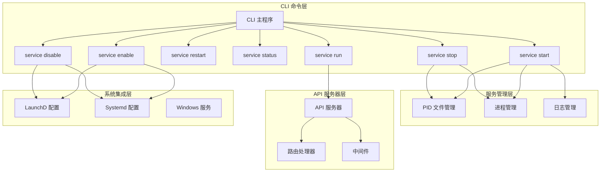

**图表来源**
- [main.rs](file://cli/src/main.rs#L233-L292)
- [service_start.rs](file://cli/src/commands/service_start.rs#L6-L131)
- [service_run.rs](file://cli/src/commands/service_run.rs#L7-L51)

## 服务启动机制

### service start 命令详解

`service start`命令是启动SecureFox服务的核心入口点，负责创建后台进程并建立服务连接。

#### 启动流程图

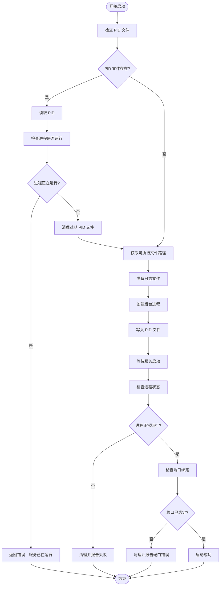

**图表来源**
- [service_start.rs](file://cli/src/commands/service_start.rs#L14-L91)

#### 关键参数配置

| 参数 | 默认值 | 描述 | 安全考虑 |
|------|--------|------|----------|
| `--port` | 8787 | API 服务器监听端口 | 避免使用常用端口，防止冲突 |
| `--host` | 127.0.0.1 | 绑定主机地址 | 生产环境建议使用 localhost |
| `--timeout` | 1800 | 解锁超时时间（秒） | 根据安全需求调整 |
| `--vault` | ~/.securefox | 密钥库路径 | 使用专用目录，限制访问权限 |

#### 进程管理机制

服务启动过程中实现了多层保护机制：

1. **PID 文件检查**：防止重复启动多个实例
2. **进程验证**：确认目标进程确实存在
3. **优雅启动检测**：验证服务是否成功启动
4. **端口绑定验证**：确保API服务器正常工作

**章节来源**
- [service_start.rs](file://cli/src/commands/service_start.rs#L1-L131)

### 端口绑定与主机配置

#### 安全的绑定地址选择

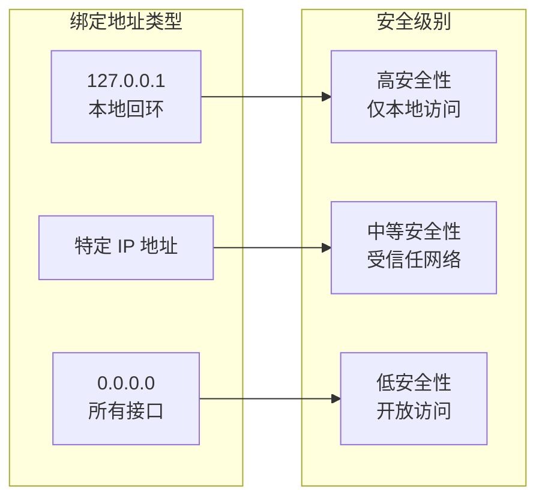

**图表来源**
- [service_start.rs](file://cli/src/commands/service_start.rs#L37-L47)

#### 超时设置策略

| 超时类型 | 推荐值 | 用途 | 影响 |
|----------|--------|------|------|
| 解锁超时 | 1800 秒 (30分钟) | 用户解锁后无操作超时 | 平衡安全性和用户体验 |
| 连接超时 | 30 秒 | 客户端连接超时 | 影响客户端体验 |
| 请求超时 | 60 秒 | API 请求处理超时 | 影响服务响应性 |

**章节来源**
- [main.rs](file://cli/src/main.rs#L236-L247)

## 服务停止与重启

### service stop 命令实现

`service stop`命令提供了优雅和服务强制两种停止方式：

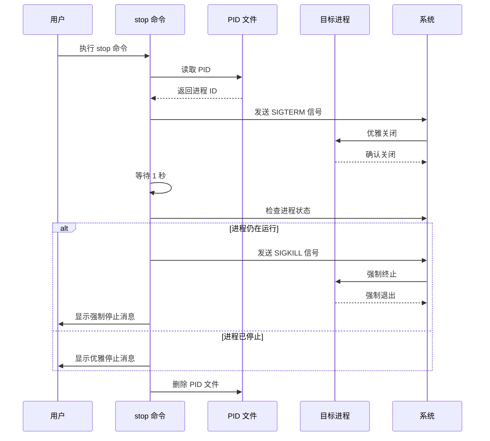

**图表来源**
- [service_stop.rs](file://cli/src/commands/service_stop.rs#L18-L65)

### service restart 命令流程

`service restart`命令整合了停止和启动两个阶段：

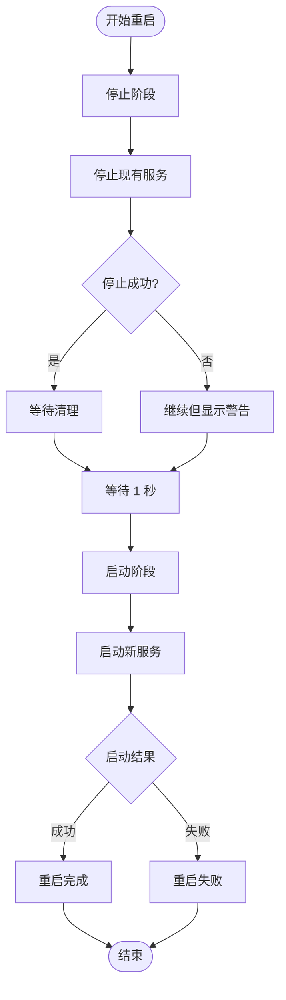

**图表来源**
- [service_restart.rs](file://cli/src/commands/service_restart.rs#L13-L34)

**章节来源**
- [service_stop.rs](file://cli/src/commands/service_stop.rs#L1-L66)
- [service_restart.rs](file://cli/src/commands/service_restart.rs#L1-L35)

## 服务状态监控

### service status 命令功能

`service status`命令提供了全面的服务状态信息：

#### 状态检测流程

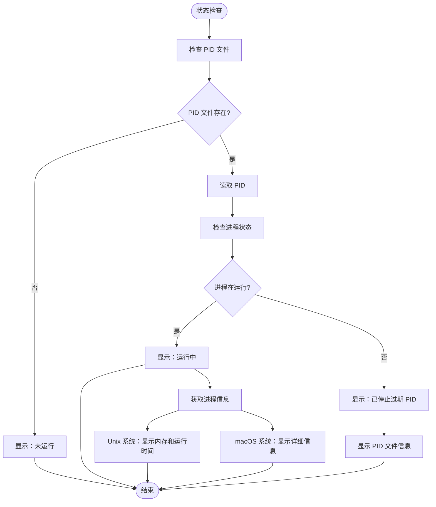

**图表来源**
- [service_status.rs](file://cli/src/commands/service_status.rs#L5-L80)

#### 状态信息展示

| 状态类型 | 显示内容 | 检测方法 | 用途 |
|----------|----------|----------|------|
| 运行状态 | Running/Green 或 Not Running/Yellow | PID 文件 + 进程检查 | 快速判断服务状态 |
| 进程 ID | PID 数字 | 从 PID 文件读取 | 用于进程管理 |
| API 地址 | http://127.0.0.1:8787 | 固定配置 | 客户端连接指导 |
| 内存使用 | MB 单位 | 系统命令查询 | 性能监控 |
| 运行时间 | 时间格式 | 系统命令输出 | 服务稳定性评估 |

**章节来源**
- [service_status.rs](file://cli/src/commands/service_status.rs#L1-L80)

## 系统级自动启动

### service enable 命令（macOS LaunchD）

`service enable`命令为macOS系统配置了LaunchD服务，实现开机自启动：

#### LaunchD 配置流程

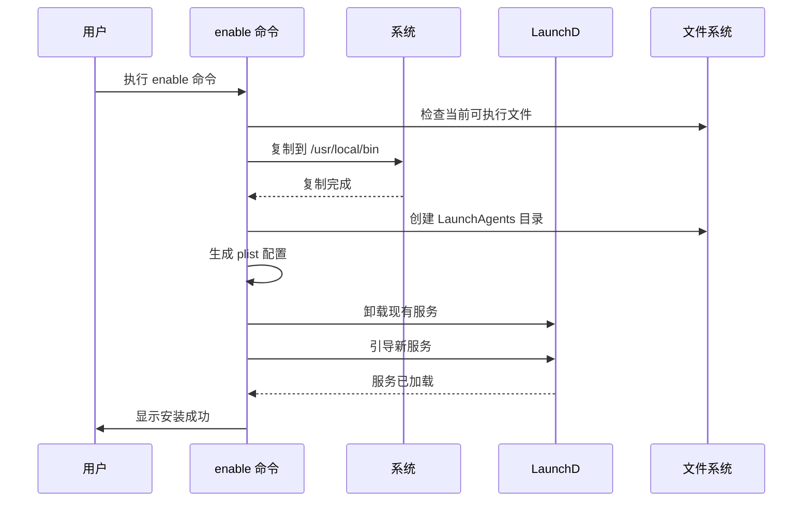

**图表来源**
- [service_enable.rs](file://cli/src/commands/service_enable.rs#L18-L222)

#### LaunchD 配置详情

| 配置项 | 值 | 说明 |
|--------|-----|------|
| Label | club.gclmit.securefox | 服务标识符 |
| ProgramArguments | `/bin/sh -c "exec ..."` | 启动命令 |
| RunAtLoad | true | 加载时立即启动 |
| KeepAlive | true | 保持服务运行 |
| WorkingDirectory | ~/.securefox | 工作目录 |
| EnvironmentVariables.PATH | 标准路径 | 环境变量配置 |

### 服务禁用与卸载

`service disable`命令提供了完整的服务卸载功能：

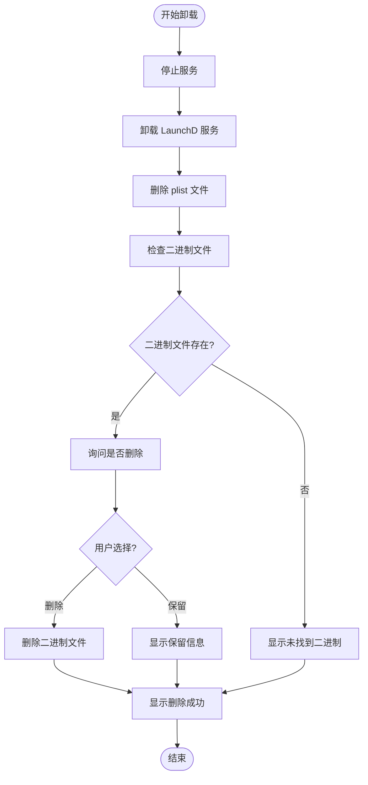

**图表来源**
- [service_disable.rs](file://cli/src/commands/service_disable.rs#L18-L150)

**章节来源**
- [service_enable.rs](file://cli/src/commands/service_enable.rs#L1-L302)
- [service_disable.rs](file://cli/src/commands/service_disable.rs#L1-L150)

## 内部执行命令

### service run 命令作用

`service run`是服务的实际执行命令，由`service start`调用创建的子进程执行：

#### 执行流程

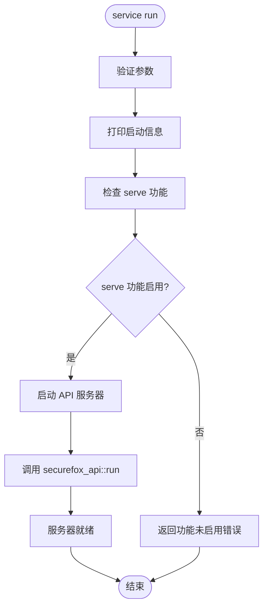

**图表来源**
- [service_run.rs](file://cli/src/commands/service_run.rs#L7-L51)

#### 启动信息格式化

服务启动时会输出结构化的启动信息：

| 信息类型 | 格式 | 示例 |
|----------|------|------|
| 时间戳 | `[YYYY-MM-DD HH:mm:ss]` | `[2024-01-15 10:30:45]` |
| 服务名称 | `SecureFox Service Starting...` | `SecureFox Service Starting...` |
| 存储路径 | `  Vault: /path/to/vault` | `  Vault: ~/.securefox` |
| API 地址 | `  API: http://host:port` | `  API: http://127.0.0.1:8787` |
| 超时设置 | `  Timeout: N seconds` | `  Timeout: 1800 seconds` |

**章节来源**
- [service_run.rs](file://cli/src/commands/service_run.rs#L1-L51)

## 配置最佳实践

### 安全配置建议

#### 网络安全配置

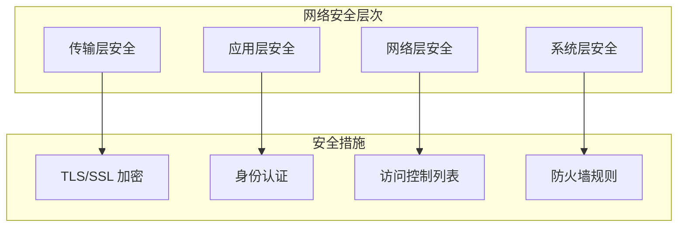

#### 推荐配置参数

| 配置项 | 推荐值 | 安全理由 | 性能影响 |
|--------|--------|----------|----------|
| 绑定地址 | 127.0.0.1 | 限制本地访问，防止外部攻击 | 最小化网络暴露 |
| 监听端口 | 8787+ | 避免与系统服务冲突 | 中等，取决于并发数 |
| 超时时间 | 1800 秒 | 平衡安全性和用户体验 | 较小，内存占用 |
| 日志级别 | info | 记录关键信息，避免敏感数据泄露 | 中等，磁盘 I/O |
| 进程权限 | 最小权限原则 | 限制系统访问能力 | 几乎无影响 |

### 性能优化配置

#### 资源使用优化

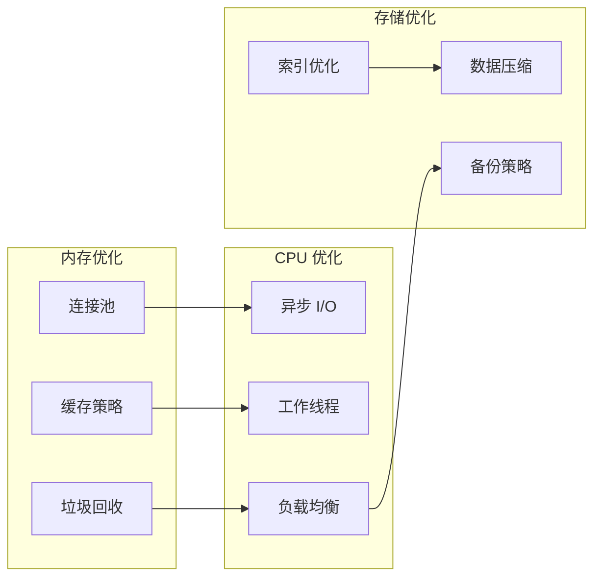

#### 监控指标建议

| 监控指标 | 正常范围 | 警告阈值 | 严重阈值 | 监控频率 |
|----------|----------|----------|----------|----------|
| CPU 使用率 | < 50% | > 70% | > 90% | 1分钟 |
| 内存使用率 | < 60% | > 80% | > 95% | 1分钟 |
| 磁盘 I/O | < 100MB/s | > 200MB/s | > 500MB/s | 30秒 |
| 网络带宽 | < 10MB/s | > 20MB/s | > 50MB/s | 1分钟 |
| 连接数 | < 100 | > 200 | > 500 | 1分钟 |

## 资源初始化过程

### API 服务器启动流程

当`service run`命令执行时，API服务器会经历完整的初始化过程：

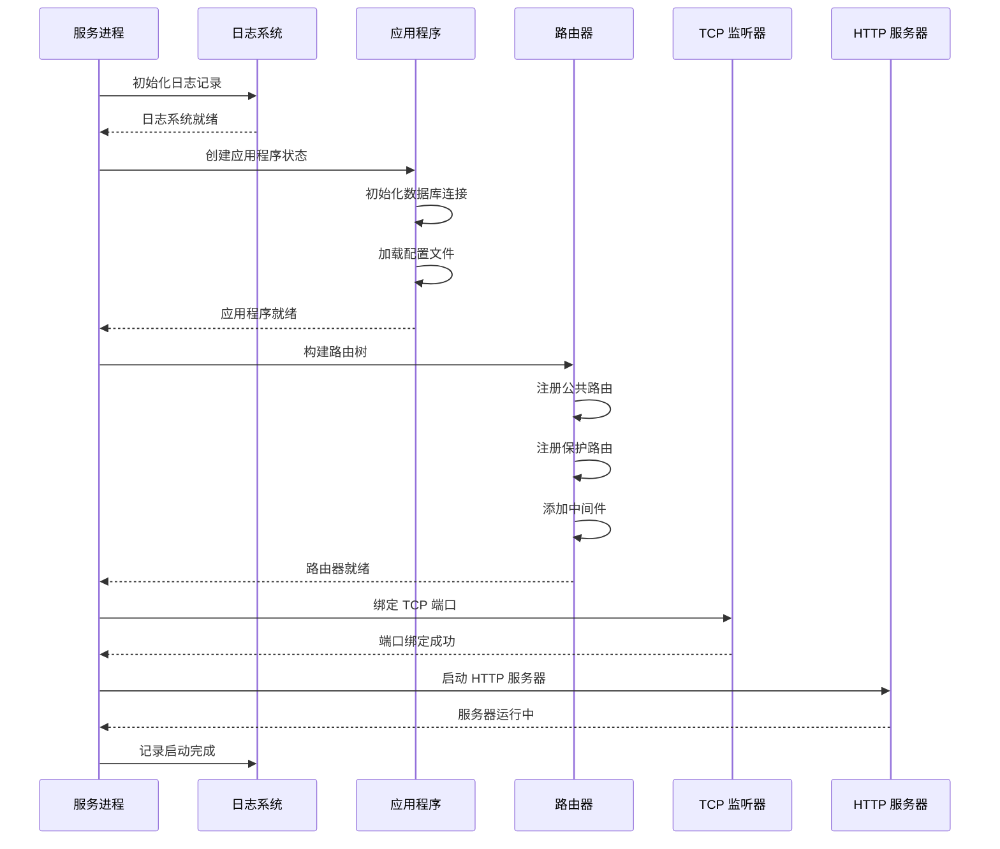

**图表来源**
- [lib.rs](file://api/src/lib.rs#L104-L140)

### 初始化阶段详解

#### 1. 日志系统初始化

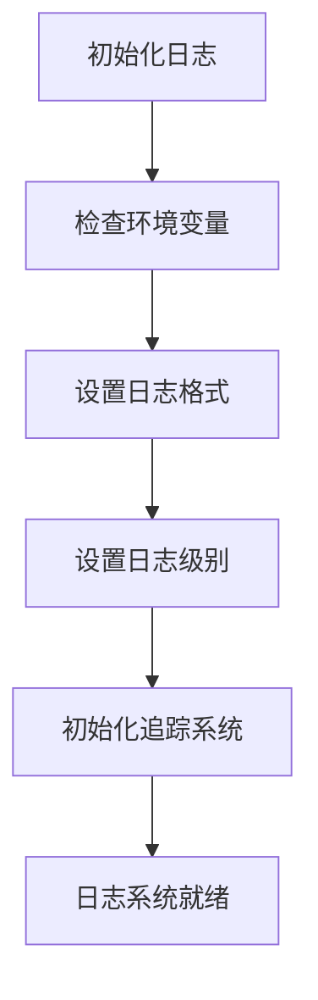

#### 2. 应用状态创建

| 组件 | 功能 | 初始化顺序 | 错误处理 |
|------|------|------------|----------|
| 数据库连接 | 持久化存储 | 第一优先 | 重试机制 |
| 配置加载 | 服务配置 | 第二优先 | 默认值fallback |
| 中间件注册 | 请求处理 | 第三优先 | 顺序依赖 |
| 路由构建 | URL映射 | 第四优先 | 验证路由 |

#### 3. 服务器启动

服务器启动过程包括端口绑定和请求处理准备：

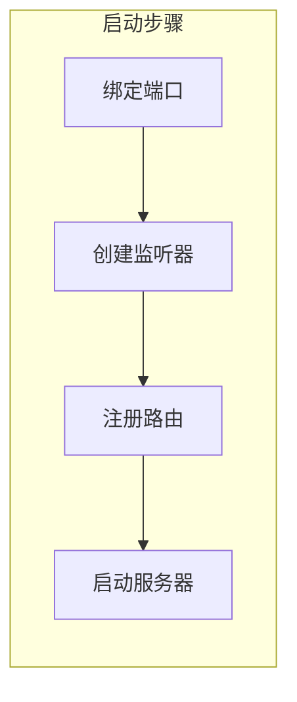

**章节来源**
- [lib.rs](file://api/src/lib.rs#L104-L140)

## 故障排除指南

### 常见问题及解决方案

#### 端口占用问题

**症状**：服务启动失败，提示端口已被占用

**诊断步骤**：
1. 检查端口占用情况：`lsof -i :8787`（Unix）或 `netstat -an | grep 8787`（Windows）
2. 查找占用进程：`ps aux | grep securefox`
3. 杀死冲突进程：`kill -9 <PID>`

**解决方案**：
- 更改服务端口：`securefox service start --port 8788`
- 停止冲突服务
- 检查防火墙设置

#### 权限错误

**症状**：无法创建 PID 文件或访问密钥库

**诊断方法**：
```bash
# 检查目录权限
ls -la ~/.securefox/

# 检查文件权限
ls -la ~/.securefox/service.pid
```

**解决方案**：
```bash
# 修复权限
chmod 700 ~/.securefox
chmod 600 ~/.securefox/service.pid
chown $USER:$USER ~/.securefox/*
```

#### 自动启动失败

**症状**：系统启动后服务未自动运行

**诊断流程**：
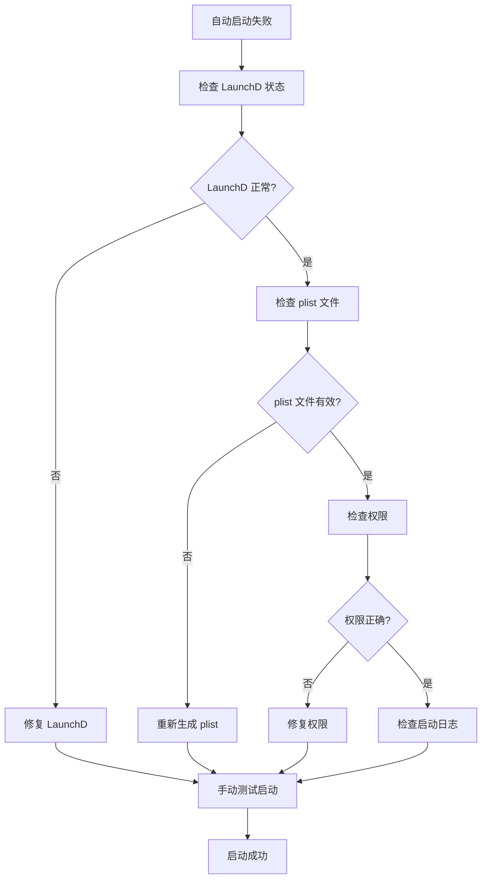

#### 服务状态异常

**症状**：`service status`显示服务已停止，但实际仍在运行

**解决方案**：
1. 手动删除 PID 文件：`rm ~/.securefox/service.pid`
2. 重新启动服务：`securefox service start`
3. 检查系统资源使用情况

### 日志分析指南

#### 日志文件位置

| 日志类型 | 文件路径 | 内容 |
|----------|----------|------|
| 服务日志 | `~/.securefox/service.log` | 服务运行信息 |
| 错误日志 | `~/.securefox/service.err` | 错误和异常信息 |
| API 访问日志 | 应用程序日志 | HTTP 请求响应 |

#### 关键错误模式

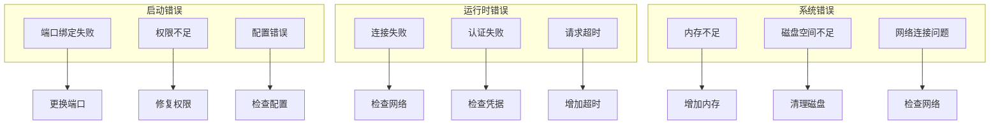

**章节来源**
- [service_start.rs](file://cli/src/commands/service_start.rs#L73-L82)
- [service_stop.rs](file://cli/src/commands/service_stop.rs#L18-L65)

## 总结

SecureFox的服务管理系统提供了完整的服务生命周期控制功能，包括：

### 核心功能特性

1. **多平台支持**：Unix/Linux 和 macOS 特定的实现
2. **优雅停机**：支持 SIGTERM 和 SIGKILL 信号处理
3. **状态监控**：实时服务状态检查和性能指标
4. **自动启动**：系统级服务配置和管理
5. **错误恢复**：完善的错误检测和恢复机制

### 安全考虑要点

- **最小权限原则**：服务运行使用受限权限
- **本地访问限制**：默认绑定到 localhost
- **加密通信**：支持 TLS 加密
- **审计日志**：详细的操作记录

### 性能优化建议

- **合理超时设置**：根据使用场景调整超时参数
- **资源监控**：定期检查系统资源使用情况
- **日志轮转**：实施日志文件大小和时间限制
- **连接池管理**：优化数据库和网络连接池

通过遵循本文档提供的最佳实践和故障排除指南，可以确保 SecureFox 服务稳定、安全、高效地运行，为用户提供可靠的密码管理体验。