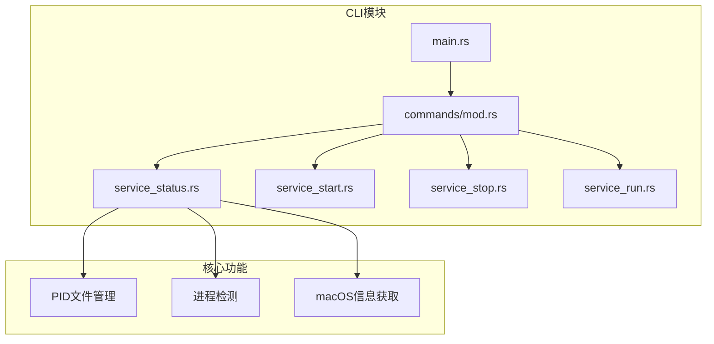
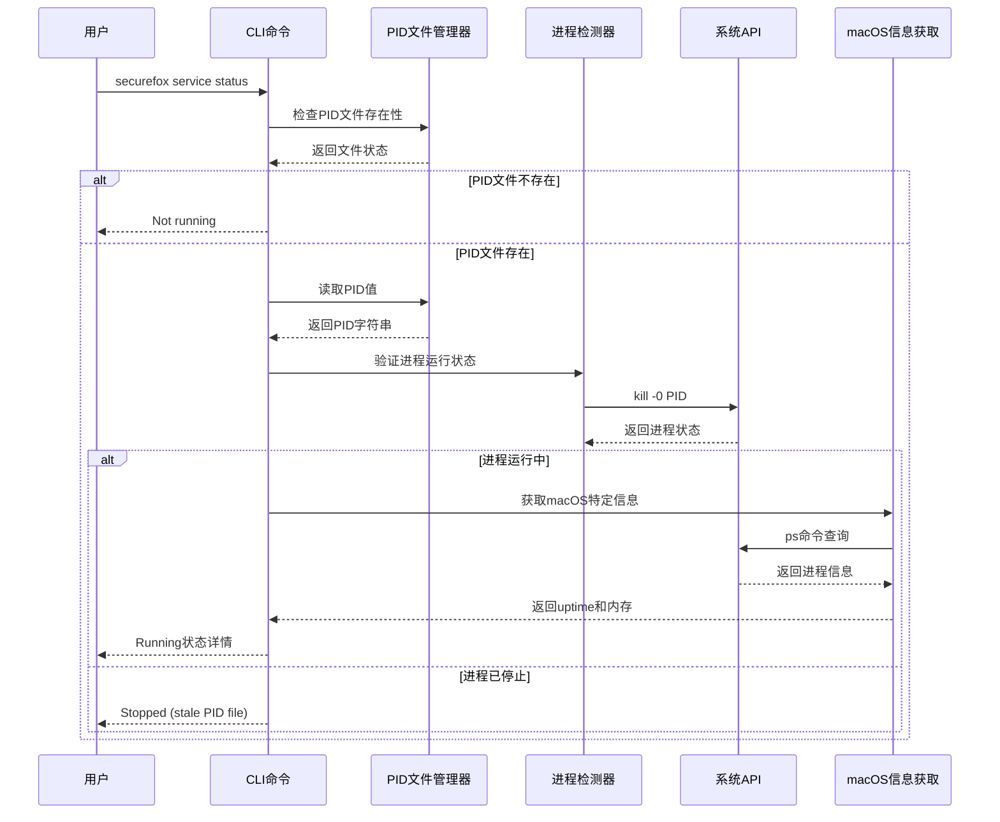
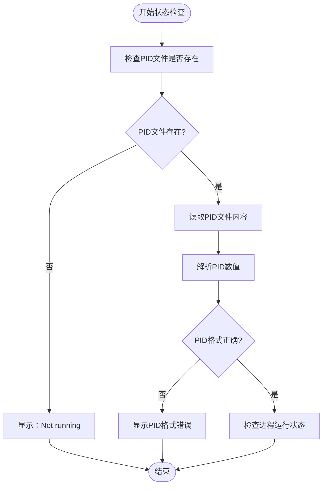
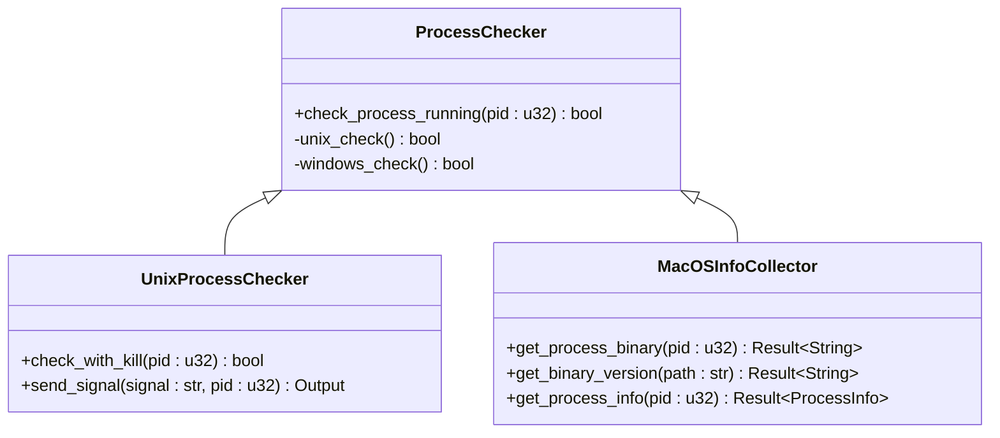
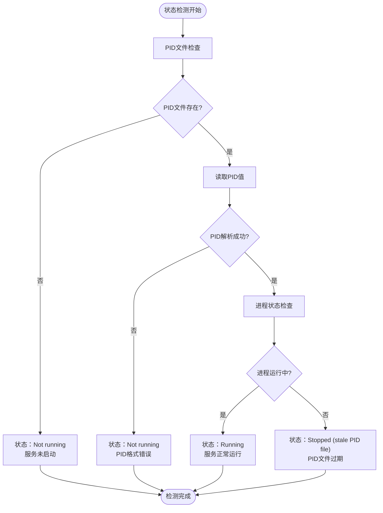
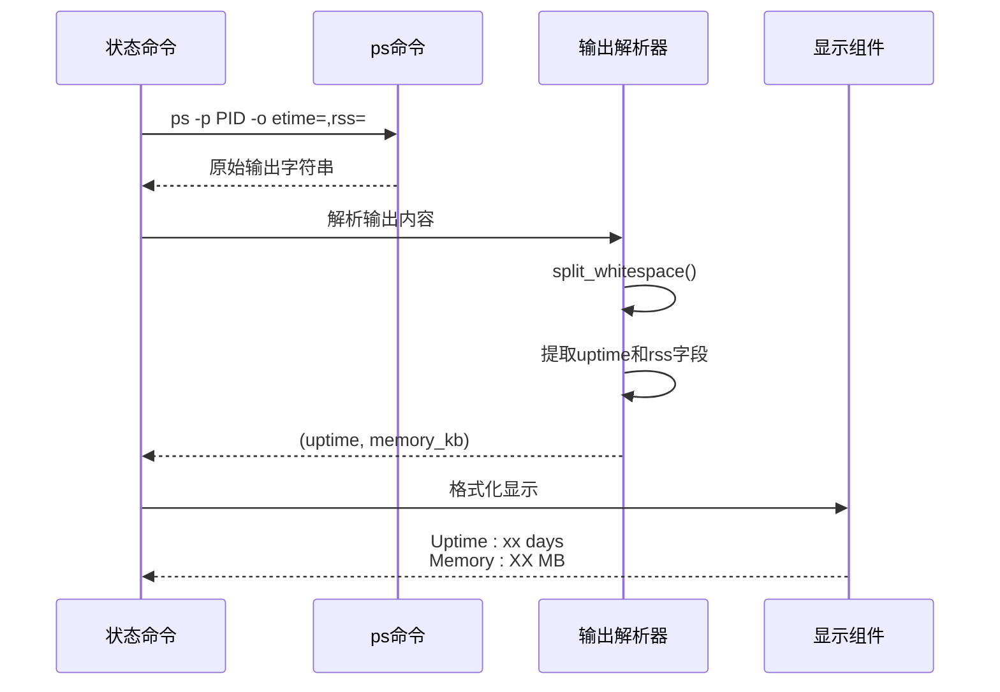
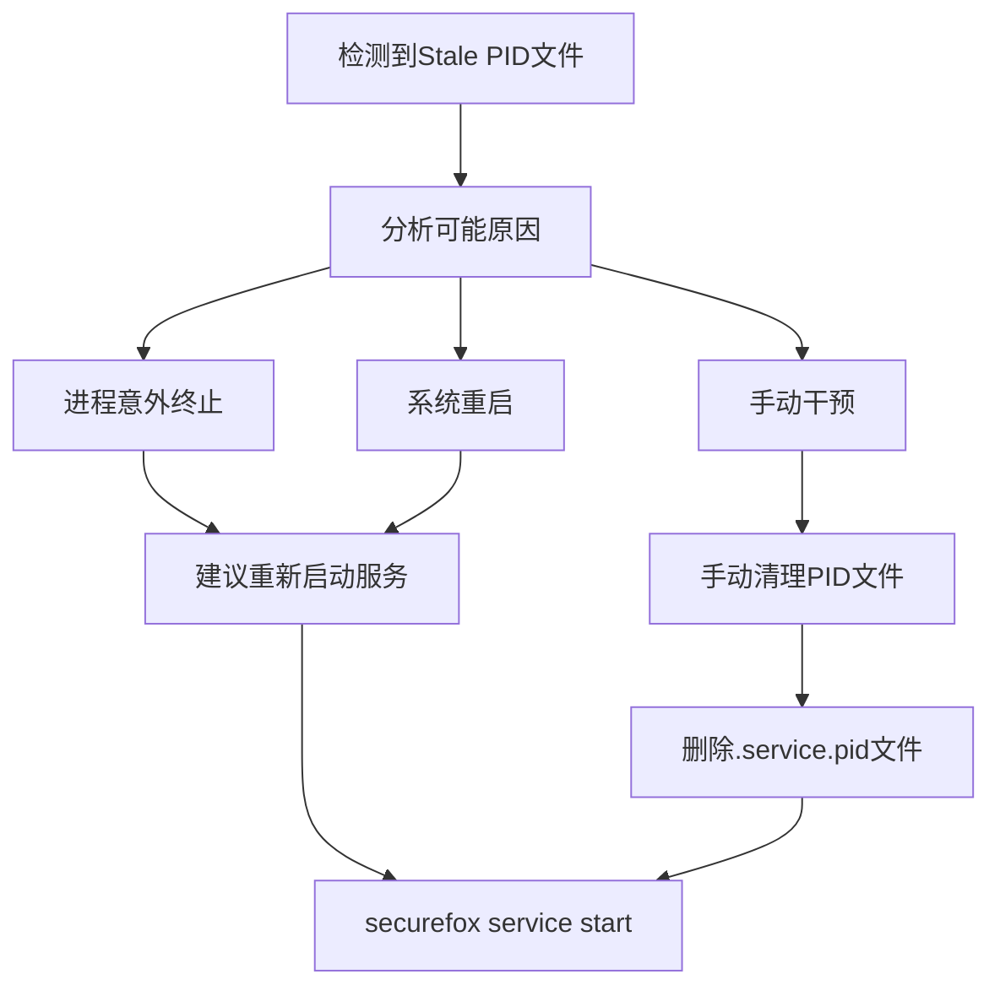

# 查询服务状态

<cite>
**本文档中引用的文件**
- [service_status.rs](file://cli/src/commands/service_status.rs)
- [service_start.rs](file://cli/src/commands/service_start.rs)
- [service_stop.rs](file://cli/src/commands/service_stop.rs)
- [service_run.rs](file://cli/src/commands/service_run.rs)
- [mod.rs](file://cli/src/commands/mod.rs)
- [main.rs](file://cli/src/main.rs)
- [README.md](file://README.md)
</cite>

## 目录
1. [简介](#简介)
2. [项目结构概览](#项目结构概览)
3. [核心组件分析](#核心组件分析)
4. [架构概览](#架构概览)
5. [详细组件分析](#详细组件分析)
6. [状态检测机制](#状态检测机制)
7. [macOS平台特定功能](#macos平台特定功能)
8. [异常状态处理](#异常状态处理)
9. [状态查询结果解读](#状态查询结果解读)
10. [故障排除指南](#故障排除指南)
11. [总结](#总结)

## 简介

SecureFox是一个安全的本地优先密码管理器，提供了完整的命令行界面用于服务管理。其中`securefox service status`命令是服务状态检测的核心工具，通过检查PID文件和实际进程状态来判断服务运行情况，并在macOS系统上提供额外的运行时长和内存占用信息。

该命令实现了多层次的服务状态验证机制，确保用户能够准确了解SecureFox服务的健康状况，为故障诊断和运维管理提供重要支持。

## 项目结构概览

SecureFox项目采用模块化架构设计，服务相关功能集中在CLI模块中：



**图表来源**
- [main.rs](file://cli/src/main.rs#L371-L383)
- [mod.rs](file://cli/src/commands/mod.rs#L23-L30)

**章节来源**
- [main.rs](file://cli/src/main.rs#L371-L383)
- [mod.rs](file://cli/src/commands/mod.rs#L1-L31)

## 核心组件分析

SecureFox服务状态检测系统包含以下核心组件：

### PID文件管理系统
负责存储和管理服务进程的PID信息，作为服务状态的第一层验证依据。

### 进程检测引擎
通过系统调用验证进程的实际运行状态，提供第二层验证机制。

### 平台特定信息收集器
针对不同操作系统提供定制化的系统信息获取功能。

### 错误处理和异常恢复机制
处理各种异常情况，包括stale PID文件、进程不存在等场景。

**章节来源**
- [service_status.rs](file://cli/src/commands/service_status.rs#L1-L73)
- [service_start.rs](file://cli/src/commands/service_start.rs#L14-L26)

## 架构概览

服务状态检测的整体架构采用分层设计，确保可靠性和可维护性：



**图表来源**
- [service_status.rs](file://cli/src/commands/service_status.rs#L5-L73)
- [service_start.rs](file://cli/src/commands/service_start.rs#L14-L26)

## 详细组件分析

### PID文件检查组件

PID文件检查是服务状态验证的第一步，通过检查`.securefox/service.pid`文件的存在性来确定服务是否可能正在运行。



**图表来源**
- [service_status.rs](file://cli/src/commands/service_status.rs#L15-L25)

### 进程状态验证组件

进程状态验证使用系统级的`kill -0`信号来检查指定PID的进程是否仍然运行：



**图表来源**
- [service_status.rs](file://cli/src/commands/service_status.rs#L76-L92)
- [service_status.rs](file://cli/src/commands/service_status.rs#L94-L133)

**章节来源**
- [service_status.rs](file://cli/src/commands/service_status.rs#L76-L92)

## 状态检测机制

### 多层次验证流程

SecureFox实现了三层验证机制来确保服务状态的准确性：

1. **第一层：PID文件存在性检查**
   - 验证`.securefox/service.pid`文件是否存在
   - 如果文件不存在，直接判定服务未运行

2. **第二层：PID有效性验证**
   - 读取PID文件内容并解析为数字
   - 验证PID格式的正确性

3. **第三层：进程实际运行状态检查**
   - 使用`kill -0 PID`系统调用
   - 检查进程是否仍然在运行

### 状态判断逻辑



**图表来源**
- [service_status.rs](file://cli/src/commands/service_status.rs#L15-L73)

**章节来源**
- [service_status.rs](file://cli/src/commands/service_status.rs#L15-L73)

## macOS平台特定功能

在macOS平台上，SecureFox提供了额外的系统信息获取功能，包括：

### 进程二进制路径获取

通过`ps -p PID -o comm=`命令获取运行中的SecureFox进程的完整二进制路径。

### 版本信息查询

利用获取到的二进制路径执行`binary_path version`命令，提取版本号信息。

### 运行时长和内存占用统计

使用`ps -p PID -o etime=,rss=`命令获取：
- **uptime**: 进程运行时间（格式如：days-hh:mm:ss）
- **memory**: 内存占用量（以KB为单位）



**图表来源**
- [service_status.rs](file://cli/src/commands/service_status.rs#L48-L67)

**章节来源**
- [service_status.rs](file://cli/src/commands/service_status.rs#L48-L67)

## 异常状态处理

### Stale PID文件异常

当PID文件存在但对应的进程已经不存在时，系统会报告"Stopped (stale PID file)"状态。这种情况通常由以下原因造成：

#### 成因分析

1. **进程意外终止**
   - 程序崩溃或被强制终止
   - 系统资源不足导致进程被杀死

2. **系统重启**
   - 操作系统重启后所有进程被终止
   - PID文件未被清理

3. **手动干预**
   - 用户手动删除了PID文件
   - 其他进程误用了相同的PID

#### 处理建议



### PID文件读取异常

当无法读取PID文件时，系统会显示具体的错误信息，帮助用户定位问题：

- **权限不足**: 文件访问权限不够
- **文件损坏**: PID文件内容不完整或被破坏
- **磁盘空间不足**: 无法写入或读取文件

**章节来源**
- [service_status.rs](file://cli/src/commands/service_status.rs#L68-L71)

## 状态查询结果解读

### 正常运行状态

当服务正常运行时，状态命令会返回以下信息：

| 字段 | 描述 | 示例值 |
|------|------|--------|
| Status | 服务状态 | Running |
| PID | 进程标识符 | 12345 |
| API | API服务器地址 | http://127.0.0.1:8787 |
| Binary | 可执行文件路径 | /usr/local/bin/securefox |
| Version | 软件版本号 | v1.2.3 |
| Uptime | 运行时间 | 2 days 03:15:22 |
| Memory | 内存占用 | 45 MB |

### 异常状态解读

#### 服务未运行
```
Status: Not running
```
**含义**: PID文件不存在，服务未启动。

#### Stale PID文件
```
Status: Stopped (stale PID file)
PID file exists but process is not running
```
**含义**: PID文件存在但对应的进程已停止运行，可能是进程意外终止或系统重启。

#### PID文件读取失败
```
Failed to read PID file: Permission denied
```
**含义**: 无法读取PID文件，可能是权限不足或文件不存在。

#### PID格式错误
```
Invalid PID in file: invalid digit found in string
```
**含义**: PID文件内容不是有效的数字格式。

**章节来源**
- [service_status.rs](file://cli/src/commands/service_status.rs#L15-L73)

## 故障排除指南

### 常见问题诊断

#### 问题1：服务状态显示"Stopped (stale PID file)"

**诊断步骤**:
1. 检查PID文件是否存在
2. 验证进程是否真的停止
3. 分析可能的崩溃原因

**解决方案**:
```bash
# 清理stale PID文件
rm ~/.securefox/service.pid

# 重新启动服务
securefox service start
```

#### 问题2：服务启动后立即显示"Stopped"

**诊断步骤**:
1. 检查日志文件：`~/.securefox/service.log`
2. 验证端口是否被占用
3. 检查配置文件

**解决方案**:
```bash
# 查看详细日志
cat ~/.securefox/service.log

# 检查端口占用
lsof -i :8787
```

#### 问题3：macOS平台无法获取进程信息

**诊断步骤**:
1. 确认系统是否为macOS
2. 检查ps命令可用性
3. 验证进程权限

**解决方案**:
```bash
# 手动测试ps命令
ps -p $(cat ~/.securefox/service.pid) -o etime=,rss=

# 检查进程权限
ls -la ~/.securefox/service.pid
```

### 性能监控建议

#### 内存使用监控
定期检查服务的内存占用，设置合理的告警阈值：
- 正常范围：20-100 MB
- 警告阈值：>200 MB
- 危险阈值：>500 MB

#### 运行时间跟踪
记录服务的平均运行时间，识别异常重启模式：
- 正常重启周期：每天1-2次
- 异常重启：频繁重启或无法启动

**章节来源**
- [service_status.rs](file://cli/src/commands/service_status.rs#L48-L67)
- [service_run.rs](file://cli/src/commands/service_run.rs#L16-L21)

## 总结

SecureFox的`securefox service status`命令提供了一个全面而可靠的服务状态检测机制。通过多层次的验证流程，结合平台特定的功能增强，该命令能够准确反映服务的真实状态，为用户和管理员提供重要的运维信息。

### 主要特性总结

1. **多层验证**: PID文件检查 + 进程状态验证 + 平台特定信息收集
2. **跨平台兼容**: 支持Unix-like系统，macOS平台提供额外功能
3. **异常处理**: 完善的错误处理和异常状态报告
4. **信息丰富**: 不仅提供状态信息，还包含性能指标
5. **易于使用**: 直观的输出格式，便于快速诊断

### 最佳实践建议

- 定期检查服务状态，建立监控机制
- 记录服务启动和停止的时间点
- 关注内存使用趋势，及时发现潜在问题
- 在自动化脚本中使用状态检查作为健康检查点

通过合理使用`securefox service status`命令，用户可以有效地监控和管理SecureFox服务，确保密码管理系统的稳定运行。