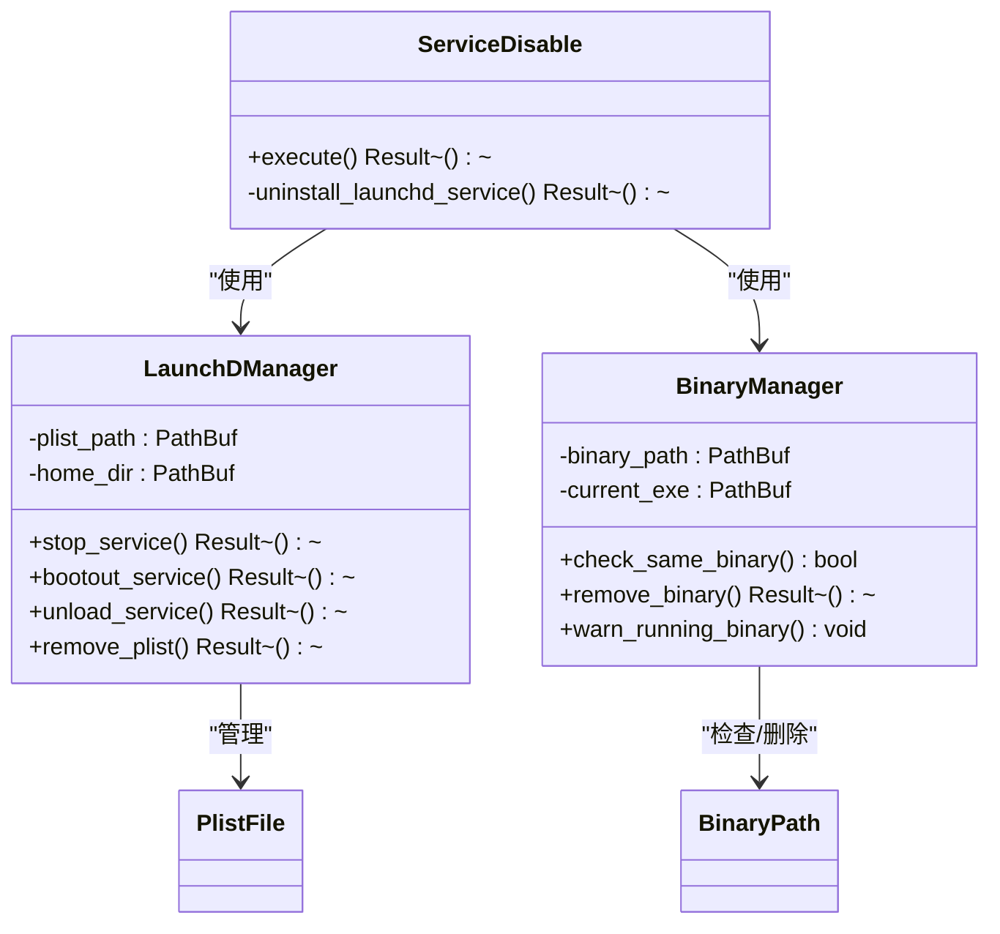
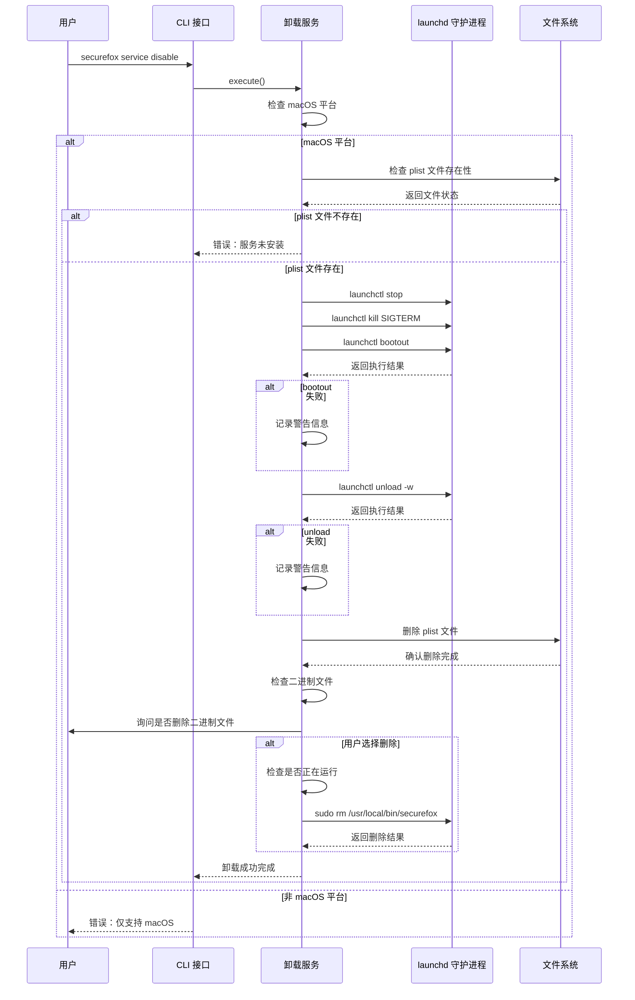
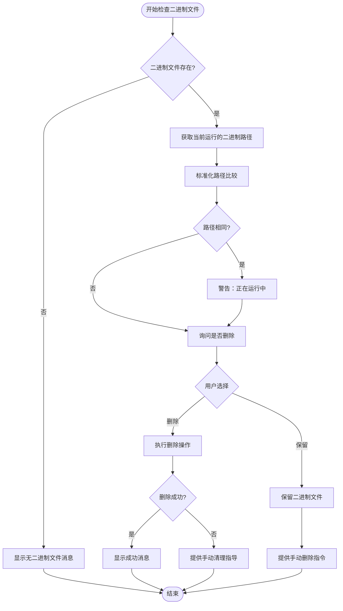
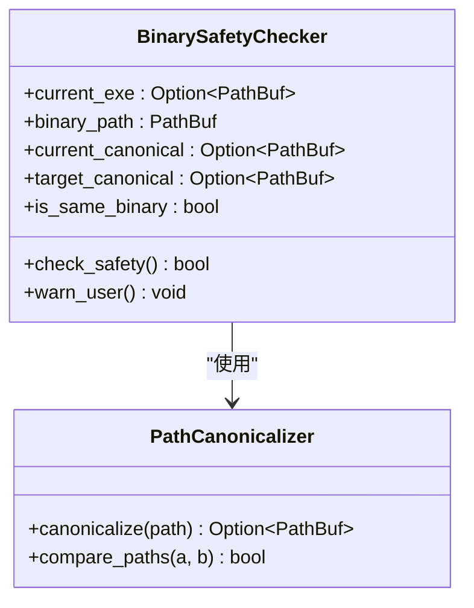
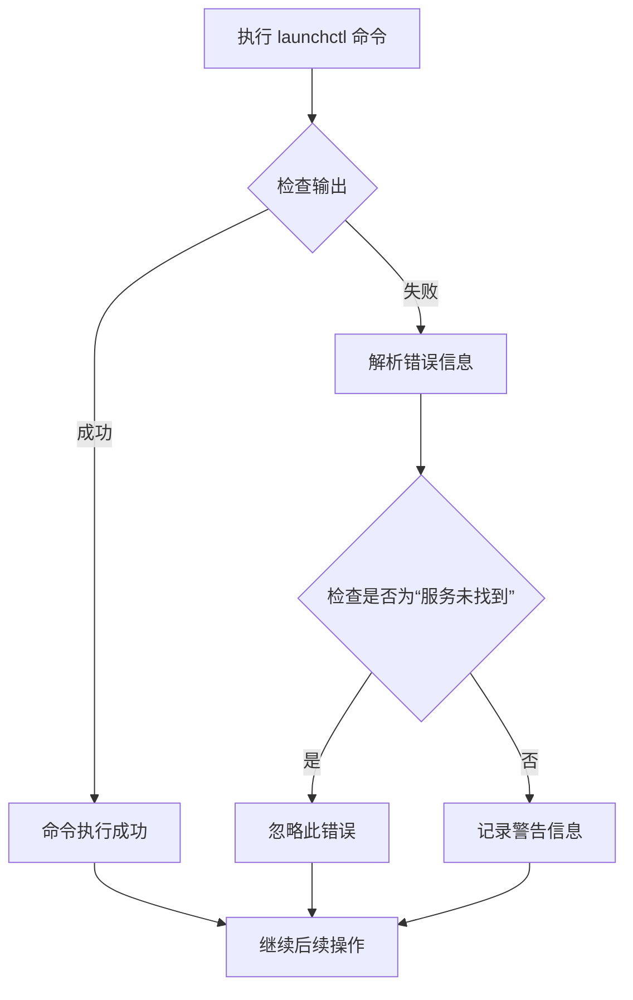

# 禁用开机自启

<cite>
**本文档中引用的文件**
- [service_disable.rs](file://cli/src/commands/service_disable.rs)
- [service_enable.rs](file://cli/src/commands/service_enable.rs)
- [main.rs](file://cli/src/main.rs)
- [README.md](file://README.md)
</cite>

## 目录
1. [简介](#简介)
2. [系统架构概述](#系统架构概述)
3. [核心组件分析](#核心组件分析)
4. [详细流程分析](#详细流程分析)
5. [安全机制设计](#安全机制设计)
6. [错误处理与故障排除](#错误处理与故障排除)
7. [手动清理指南](#手动清理指南)
8. [总结](#总结)

## 简介

SecureFox 是一个本地优先的密码管理器，支持在 macOS 系统上作为后台服务自动启动。当用户执行 `securefox service disable` 命令时，系统会移除开机自启动配置，包括卸载 launchd 服务和可选地删除二进制文件。本文档详细介绍了这一过程的技术实现、安全考虑和最佳实践。

## 系统架构概述

SecureFox 的服务管理系统基于 macOS 的 launchd 服务框架，通过生成和管理 plist 配置文件来实现服务的自动启动功能。

```mermaid
graph TB
subgraph "用户操作"
CLI[CLI 命令行接口]
DisableCmd[service disable 命令]
end
subgraph "服务管理模块"
ServiceDisable[service_disable.rs]
LaunchD[launchd 服务管理]
PlistFile[plist 配置文件]
end
subgraph "系统资源"
HomeDir[~/.securefox]
LaunchAgents[~/Library/LaunchAgents]
BinaryPath[/usr/local/bin/securefox]
end
CLI --> DisableCmd
DisableCmd --> ServiceDisable
ServiceDisable --> LaunchD
ServiceDisable --> PlistFile
LaunchD --> LaunchAgents
PlistFile --> HomeDir
ServiceDisable --> BinaryPath
```

**图表来源**
- [service_disable.rs](file://cli/src/commands/service_disable.rs#L1-L150)
- [service_enable.rs](file://cli/src/commands/service_enable.rs#L140-L210)

## 核心组件分析

### 服务卸载主控制器

服务卸载功能的核心实现在 [`service_disable.rs`](file://cli/src/commands/service_disable.rs#L5-L15) 文件中，该模块负责协调整个卸载过程。



**图表来源**
- [service_disable.rs](file://cli/src/commands/service_disable.rs#L17-L149)

### launchd 服务配置结构

系统使用标准的 macOS plist 配置文件来定义服务行为，配置包含以下关键参数：

| 配置项 | 值 | 说明 |
|--------|-----|------|
| Label | club.gclmit.securefox | 服务标识符 |
| ProgramArguments | `/bin/sh -c "exec ..."` | 启动命令 |
| RunAtLoad | true | 加载时运行 |
| KeepAlive | true | 保持运行状态 |
| WorkingDirectory | ~/.securefox | 工作目录 |
| EnvironmentVariables.PATH | /usr/local/bin:/usr/bin:/bin:/usr/sbin:/sbin | 环境变量路径 |

**节来源**
- [service_enable.rs](file://cli/src/commands/service_enable.rs#L256-L301)

## 详细流程分析

### 服务卸载流程

服务卸载过程遵循严格的步骤顺序，确保系统的稳定性和数据完整性。



**图表来源**
- [service_disable.rs](file://cli/src/commands/service_disable.rs#L8-L149)

### launchctl 命令序列详解

卸载过程中使用了多个 launchctl 命令来确保服务被完全停止和移除：

| 命令 | 参数 | 功能 | 备注 |
|------|------|------|------|
| stop | club.gclmit.securefox | 停止服务 | 尝试优雅关闭 |
| kill | SIGTERM club.gclmit.securefox | 强制终止服务 | 发送终止信号 |
| bootout | gui/{uid} plist_path | 移除服务配置 | 现代 macOS 方式 |
| unload | -w plist_path | 卸载服务 | 传统方式 |

**节来源**
- [service_disable.rs](file://cli/src/commands/service_disable.rs#L28-L76)

### 二进制文件安全检查机制

系统实现了智能的二进制文件检查机制，防止意外删除正在运行的程序。



**图表来源**
- [service_disable.rs](file://cli/src/commands/service_disable.rs#L81-L142)

**节来源**
- [service_disable.rs](file://cli/src/commands/service_disable.rs#L81-L149)

## 安全机制设计

### 当前运行二进制检测

系统通过路径标准化技术确保准确识别正在运行的二进制文件：



**图表来源**
- [service_disable.rs](file://cli/src/commands/service_disable.rs#L84-L94)

### 权限提升安全考虑

删除二进制文件需要管理员权限，系统通过以下方式确保安全性：

1. **sudo 提示**：明确告知用户需要管理员权限
2. **路径验证**：确认目标路径的正确性
3. **失败处理**：提供手动清理的备选方案
4. **错误报告**：详细记录失败原因

**节来源**
- [service_disable.rs](file://cli/src/commands/service_disable.rs#L113-L134)

## 错误处理与故障排除

### launchctl 执行错误处理

系统对 launchctl 命令的执行结果进行了全面的错误处理：



**图表来源**
- [service_disable.rs](file://cli/src/commands/service_disable.rs#L48-L72)

### 常见错误场景及解决方案

| 错误类型 | 可能原因 | 解决方案 |
|----------|----------|----------|
| 服务未找到 | 服务已手动移除或从未安装 | 忽略此错误，继续卸载流程 |
| 权限不足 | 缺少管理员权限 | 使用 sudo 重新执行命令 |
| 文件不存在 | plist 文件被外部工具修改 | 手动检查并删除残留文件 |
| 二进制文件无法删除 | 文件被其他进程占用 | 重启系统后重试 |

**节来源**
- [service_disable.rs](file://cli/src/commands/service_disable.rs#L50-L72)

## 手动清理指南

### 残留文件检查清单

如果自动卸载过程未能完全清理所有文件，可以按照以下清单进行手动清理：

#### 1. launchd 服务配置文件
```bash
# 检查并删除 plist 文件
ls ~/Library/LaunchAgents/club.gclmit.securefox.plist
rm ~/Library/LaunchAgents/club.gclmit.securefox.plist
```

#### 2. 二进制文件
```bash
# 检查二进制文件是否存在
ls /usr/local/bin/securefox

# 如果存在，手动删除
sudo rm /usr/local/bin/securefox
```

#### 3. 日志文件
```bash
# 检查服务日志文件
ls ~/.securefox/*.log
ls ~/.securefox/*.err
```

#### 4. 验证清理状态
```bash
# 检查服务是否仍然存在
launchctl list | grep club.gclmit.securefox

# 检查二进制文件是否已删除
which securefox
```

### 清理后的验证步骤

1. **服务状态检查**：确认服务不再出现在 launchctl 列表中
2. **文件存在性验证**：确保所有相关文件已被删除
3. **功能测试**：验证系统正常运行，没有残留的服务影响
4. **权限恢复**：确认文件权限已恢复到正常状态

## 总结

SecureFox 的 `service disable` 命令提供了一个完整且安全的服务卸载解决方案。通过以下关键特性确保了卸载过程的安全性和可靠性：

### 主要优势

1. **多层保护机制**：从服务停止到文件删除的完整保护链
2. **智能安全检查**：防止意外删除正在运行的程序
3. **优雅降级**：多种卸载方法确保兼容不同版本的 macOS
4. **用户友好界面**：清晰的交互提示和错误处理
5. **完善的错误恢复**：提供手动清理的备选方案

### 最佳实践建议

1. **定期备份**：在执行卸载前备份重要数据
2. **权限管理**：确保有足够的管理员权限
3. **系统监控**：卸载后检查系统状态
4. **文档记录**：记录自定义配置以便后续参考

通过遵循本文档的指导，用户可以安全、可靠地移除 SecureFox 的开机自启动配置，同时确保系统的稳定性和数据的安全性。