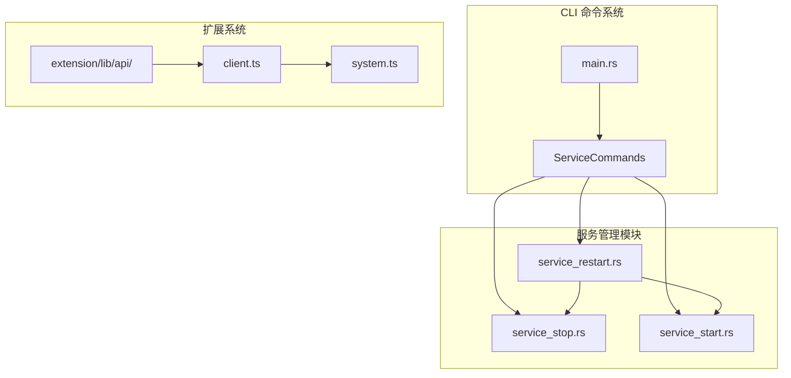
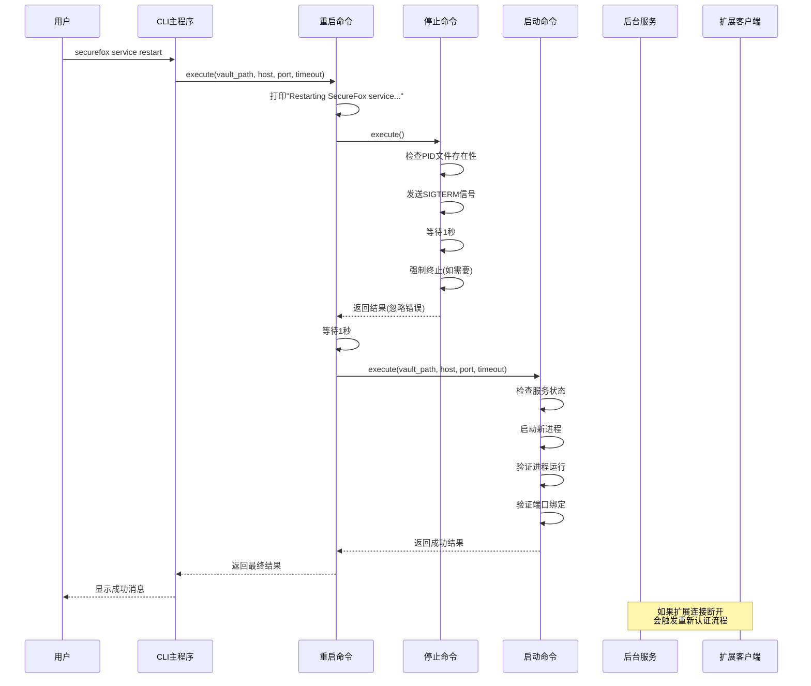
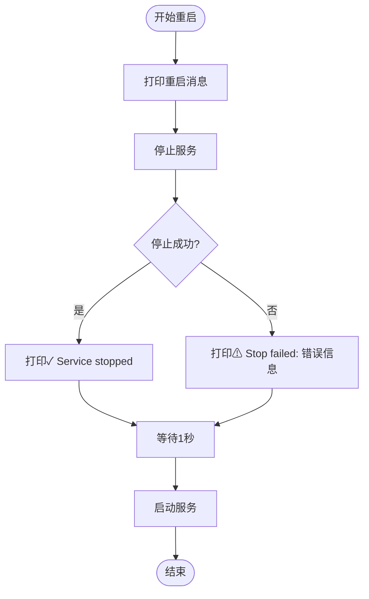
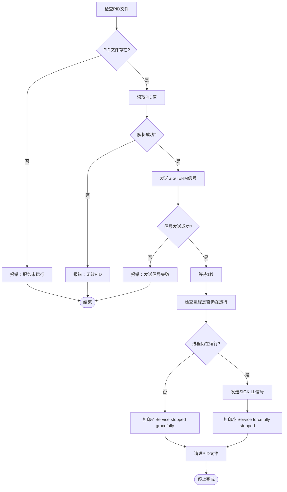
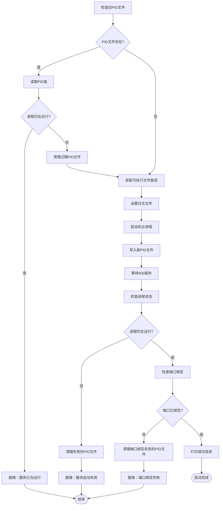
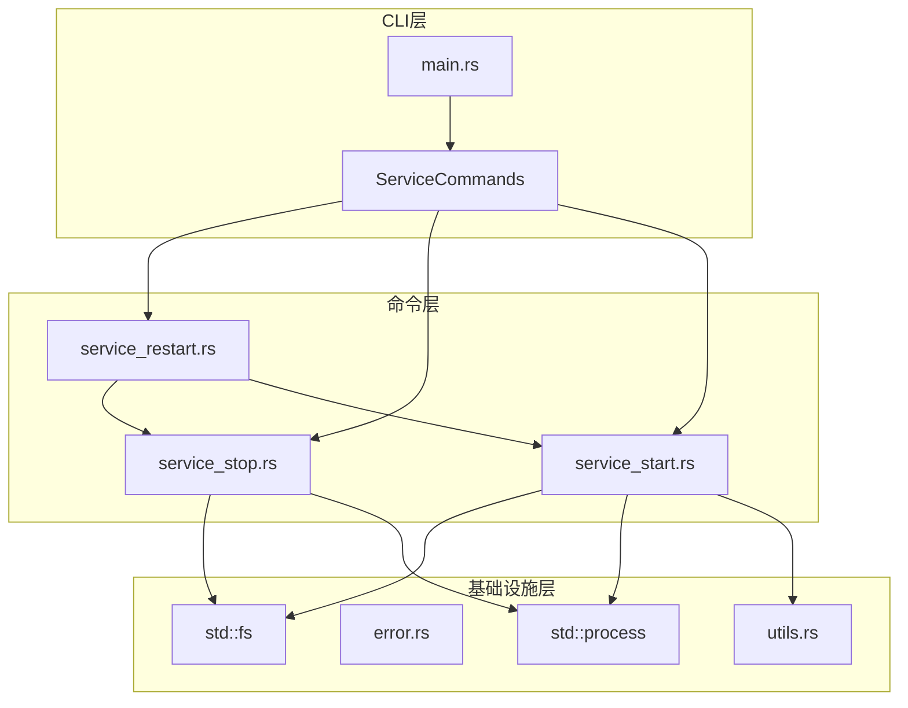

# 重启服务

<cite>
**本文档中引用的文件**
- [service_restart.rs](file://cli/src/commands/service_restart.rs)
- [service_stop.rs](file://cli/src/commands/service_stop.rs)
- [service_start.rs](file://cli/src/commands/service_start.rs)
- [main.rs](file://cli/src/main.rs)
- [client.ts](file://extension/lib/api/client.ts)
- [system.ts](file://extension/lib/api/system.ts)
- [mod.rs](file://cli/src/commands/mod.rs)
</cite>

## 目录
1. [简介](#简介)
2. [项目结构](#项目结构)
3. [核心组件](#核心组件)
4. [架构概览](#架构概览)
5. [详细组件分析](#详细组件分析)
6. [依赖关系分析](#依赖关系分析)
7. [性能考虑](#性能考虑)
8. [故障排除指南](#故障排除指南)
9. [结论](#结论)

## 简介

SecureFox是一个本地优先的密码管理器，提供了强大的后台服务管理系统。其中`securefox service restart`命令是服务管理的核心功能之一，它通过组合调用`service stop`和`service start`来实现服务的优雅重启。本文档深入分析了该命令的实现逻辑、错误容忍机制、时间窗口管理以及对前端扩展的影响。

## 项目结构

SecureFox项目采用模块化架构，服务管理功能分布在多个专门的模块中：

**图表来源**
- [main.rs](file://cli/src/main.rs#L233-L292)
- [service_restart.rs](file://cli/src/commands/service_restart.rs#L1-L35)

**章节来源**
- [main.rs](file://cli/src/main.rs#L1-L405)
- [mod.rs](file://cli/src/commands/mod.rs#L1-L31)

## 核心组件

### 服务重启命令执行器

`service_restart.rs`是整个重启流程的核心入口点，它实现了以下关键功能：

- **服务停止阶段**：调用`service_stop::execute()`尝试停止当前运行的服务
- **错误容忍机制**：即使停止失败也继续执行启动流程
- **等待间隔**：使用1秒的异步等待确保服务完全停止
- **服务启动阶段**：调用`service_start::execute()`启动新实例

### 服务停止控制器

`service_stop.rs`负责优雅地终止正在运行的服务：

- **PID文件检查**：验证服务是否实际运行
- **信号发送**：向目标进程发送SIGTERM信号
- **优雅关闭等待**：等待1秒让服务进行清理工作
- **强制终止**：如果服务未响应，则发送SIGKILL信号
- **资源清理**：删除PID文件和其他临时资源

### 服务启动控制器

`service_start.rs`负责启动新的服务实例：

- **状态检查**：验证服务是否已停止
- **进程启动**：创建后台进程并捕获PID
- **健康检查**：验证进程运行状态和端口绑定
- **日志记录**：配置标准输出和错误输出重定向

**章节来源**
- [service_restart.rs](file://cli/src/commands/service_restart.rs#L1-L35)
- [service_stop.rs](file://cli/src/commands/service_stop.rs#L1-L66)
- [service_start.rs](file://cli/src/commands/service_start.rs#L1-L131)

## 架构概览

服务重启系统采用分层架构设计，确保各个组件职责明确且相互独立：

**图表来源**
- [service_restart.rs](file://cli/src/commands/service_restart.rs#L4-L33)
- [service_stop.rs](file://cli/src/commands/service_stop.rs#L4-L65)
- [service_start.rs](file://cli/src/commands/service_start.rs#L6-L131)

## 详细组件分析

### 重启命令实现分析

#### 组合调用模式

重启命令采用了经典的组合调用模式，将复杂的重启操作分解为两个独立的步骤：

**图表来源**
- [service_restart.rs](file://cli/src/commands/service_restart.rs#L10-L33)

#### 错误容忍机制

重启命令实现了智能的错误容忍策略：

1. **停止阶段错误处理**：即使`service_stop`失败，重启过程也不会中断
2. **渐进式恢复**：通过等待间隔给系统恢复时间
3. **启动阶段验证**：确保新服务实例正常启动

**章节来源**
- [service_restart.rs](file://cli/src/commands/service_restart.rs#L13-L33)

### 服务停止机制分析

#### 多阶段停止策略

服务停止采用了多阶段的优雅关闭策略：

**图表来源**
- [service_stop.rs](file://cli/src/commands/service_stop.rs#L4-L65)

#### 平台兼容性设计

停止机制针对Unix系统进行了优化，支持以下特性：

- **信号处理**：使用`kill`命令发送信号
- **进程检查**：通过`kill -0`检查进程是否存在
- **强制终止**：当优雅关闭失败时使用`kill -9`
- **平台限制**：Windows平台目前不支持此功能

**章节来源**
- [service_stop.rs](file://cli/src/commands/service_stop.rs#L18-L65)

### 服务启动机制分析

#### 启动验证链

服务启动包含严格的验证链，确保新实例的可靠性：

**图表来源**
- [service_start.rs](file://cli/src/commands/service_start.rs#L14-L91)

#### 进程监控机制

启动过程包含了多层监控机制：

1. **进程存活检查**：验证子进程是否成功创建
2. **端口占用检查**：确保服务监听正确的端口
3. **日志文件监控**：提供详细的调试信息
4. **资源清理**：失败时自动清理残留资源

**章节来源**
- [service_start.rs](file://cli/src/commands/service_start.rs#L62-L83)

### 异步等待间隔设计

#### 时间窗口考量

代码中使用了两个不同长度的等待间隔，每个都有其特定的设计目的：

| 等待间隔 | 时长 | 用途 | 设计考量 |
|---------|------|------|----------|
| 1秒 | 1000毫秒 | 停止阶段等待 | 给服务足够时间进行优雅关闭和资源清理 |
| 500毫秒 | 500毫秒 | 启动阶段等待 | 让新服务实例有时间初始化和绑定端口 |
| 1秒 | 1000毫秒 | 重启中间等待 | 确保前一个服务完全停止后再启动新实例 |

#### 设计权衡分析

这种设计体现了以下权衡：

- **用户体验**：较短的等待时间提升响应速度
- **系统稳定性**：充分的等待时间确保操作完整性
- **资源利用**：平衡CPU使用和等待时间
- **错误容忍**：为各种异常情况提供缓冲空间

**章节来源**
- [service_restart.rs](file://cli/src/commands/service_restart.rs#L26-L27)
- [service_start.rs](file://cli/src/commands/service_start.rs#L59-L60)

## 依赖关系分析

### 模块间依赖图

**图表来源**
- [main.rs](file://cli/src/main.rs#L233-L292)
- [service_restart.rs](file://cli/src/commands/service_restart.rs#L1-L3)
- [service_stop.rs](file://cli/src/commands/service_stop.rs#L1-L3)
- [service_start.rs](file://cli/src/commands/service_start.rs#L1-L5)

### 外部依赖分析

#### 核心依赖项

| 依赖项 | 版本要求 | 用途 | 影响范围 |
|--------|----------|------|----------|
| `anyhow` | 最新稳定版 | 错误处理和链式错误传播 | 所有命令模块 |
| `tokio` | 最新稳定版 | 异步运行时和定时器 | 重启和启动命令 |
| `dirs` | 最新稳定版 | 跨平台目录访问 | PID文件管理 |
| `std::fs` | Rust标准库 | 文件系统操作 | PID文件和日志管理 |
| `std::process` | Rust标准库 | 进程控制 | 服务启动和停止 |

#### 平台依赖

| 平台 | 支持程度 | 实现方式 | 限制 |
|------|----------|----------|------|
| Unix/Linux | 完全支持 | 使用`kill`命令和信号 | 无 |
| macOS | 完全支持 | 使用`kill`命令和信号 | 无 |
| Windows | 部分支持 | 信号处理受限 | 强制终止功能有限 |

**章节来源**
- [main.rs](file://cli/src/main.rs#L1-L15)
- [service_stop.rs](file://cli/src/commands/service_stop.rs#L1-L66)

## 性能考虑

### 重启时间分析

服务重启的总时间由以下因素决定：

1. **停止阶段**：最多2秒（1秒等待 + 1秒强制终止）
2. **中间等待**：1秒（确保完全停止）
3. **启动阶段**：约1秒（500毫秒等待 + 500毫秒验证）

**总重启时间**：约4-5秒（理想情况下）

### 内存和CPU影响

#### 重启期间的资源使用

- **内存使用**：重启过程中会有短暂的内存峰值
- **CPU使用**：主要集中在进程管理和信号处理
- **I/O操作**：PID文件读写和日志文件操作

#### 对前端扩展的影响

由于服务重启会导致API连接中断，前端扩展需要处理以下情况：

1. **连接丢失**：扩展检测到API不可用时的处理
2. **重新认证**：服务重启后需要重新建立会话
3. **状态同步**：保持用户界面与服务状态的一致性

**章节来源**
- [service_restart.rs](file://cli/src/commands/service_restart.rs#L26-L27)
- [service_start.rs](file://cli/src/commands/service_start.rs#L59-L60)

## 故障排除指南

### 常见重启问题

#### 服务停止失败

**症状**：重启命令显示"Stop failed"警告但继续执行

**可能原因**：
- 服务进程已被外部进程终止
- PID文件损坏或过期
- 权限不足无法发送信号

**解决方案**：
1. 手动检查进程是否存在
2. 删除过期的PID文件
3. 检查文件权限设置

#### 启动验证失败

**症状**：服务启动后立即报告失败

**可能原因**：
- 端口被其他进程占用
- 配置文件损坏
- 权限不足

**解决方案**：
1. 更换监听端口
2. 检查配置文件完整性
3. 验证文件系统权限

#### 扩展连接问题

**症状**：服务重启后扩展无法连接

**可能原因**：
- 重启时间窗口导致连接中断
- 会话令牌失效
- 网络配置变更

**解决方案**：
1. 实现自动重连机制
2. 增强错误处理和重试逻辑
3. 提供连接状态指示器

**章节来源**
- [service_restart.rs](file://cli/src/commands/service_restart.rs#L18-L21)
- [service_start.rs](file://cli/src/commands/service_start.rs#L62-L83)

### 最佳实践建议

#### 更新配置后的重启流程

1. **备份当前配置**：在重启前保存重要配置
2. **验证新配置**：确保配置文件语法正确
3. **执行重启**：使用`securefox service restart`命令
4. **验证服务状态**：检查服务是否正常运行
5. **测试功能**：验证关键功能是否正常工作

#### 监控和日志分析

- **启用详细日志**：使用`--verbose`标志获取更多信息
- **监控系统资源**：观察重启过程中的资源使用情况
- **定期健康检查**：实施自动化服务状态检查

## 结论

SecureFox的服务重启功能展现了优秀的软件工程实践：

### 设计优势

1. **模块化架构**：清晰的职责分离和接口定义
2. **错误容忍机制**：智能的错误处理和恢复策略
3. **跨平台兼容**：针对不同平台的适配方案
4. **用户体验优化**：合理的等待时间和进度反馈

### 技术亮点

- **优雅关闭**：通过信号处理实现平滑的服务终止
- **健康检查**：多层次的启动验证确保服务可靠性
- **异步处理**：使用Tokio运行时提高并发性能
- **资源管理**：完善的资源清理和错误回滚机制

### 改进建议

1. **增强平台支持**：扩展Windows平台的信号处理能力
2. **改进错误报告**：提供更详细的诊断信息
3. **优化等待时间**：根据系统性能动态调整等待间隔
4. **加强监控集成**：提供更丰富的监控指标

这个重启系统不仅满足了基本的功能需求，还在可靠性、用户体验和系统集成方面达到了较高的水准，为SecureFox的整体服务质量提供了坚实的基础。