# 条目管理

<cite>
**本文档中引用的文件**
- [add.rs](file://cli/src/commands/add.rs)
- [list.rs](file://cli/src/commands/list.rs)
- [show.rs](file://cli/src/commands/show.rs)
- [placeholder.rs](file://cli/src/commands/placeholder.rs)
- [models.rs](file://core/src/models.rs)
- [storage.rs](file://core/src/storage.rs)
- [totp.rs](file://core/src/totp.rs)
- [main.rs](file://cli/src/main.rs)
- [entries.ts](file://extension/lib/api/entries.ts)
- [vaultStore.ts](file://extension/store/vaultStore.ts)
</cite>

## 目录
1. [简介](#简介)
2. [项目结构概览](#项目结构概览)
3. [核心数据模型](#核心数据模型)
4. [条目生命周期管理](#条目生命周期管理)
5. [详细组件分析](#详细组件分析)
6. [加密存储机制](#加密存储机制)
7. [常见问题与解决方案](#常见问题与解决方案)
8. [总结](#总结)

## 简介

SecureFox是一个本地优先的密码管理器，提供了完整的条目管理功能，支持多种类型的密码条目（登录、笔记、信用卡、身份信息）。本文档深入解析SecureFox中条目管理的全生命周期操作，包括创建、编辑、查询、显示和删除等功能。

## 项目结构概览

SecureFox采用模块化架构设计，主要分为以下几个核心模块：

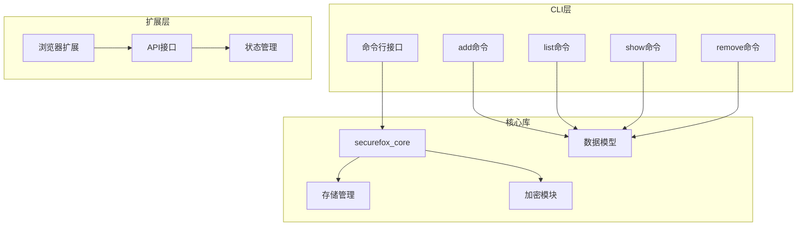

**图表来源**
- [main.rs](file://cli/src/main.rs#L1-L50)
- [models.rs](file://core/src/models.rs#L1-L50)
- [storage.rs](file://core/src/storage.rs#L1-L50)

## 核心数据模型

SecureFox使用统一的数据模型来表示所有类型的条目，确保了系统的一致性和可扩展性。

### 主要数据结构

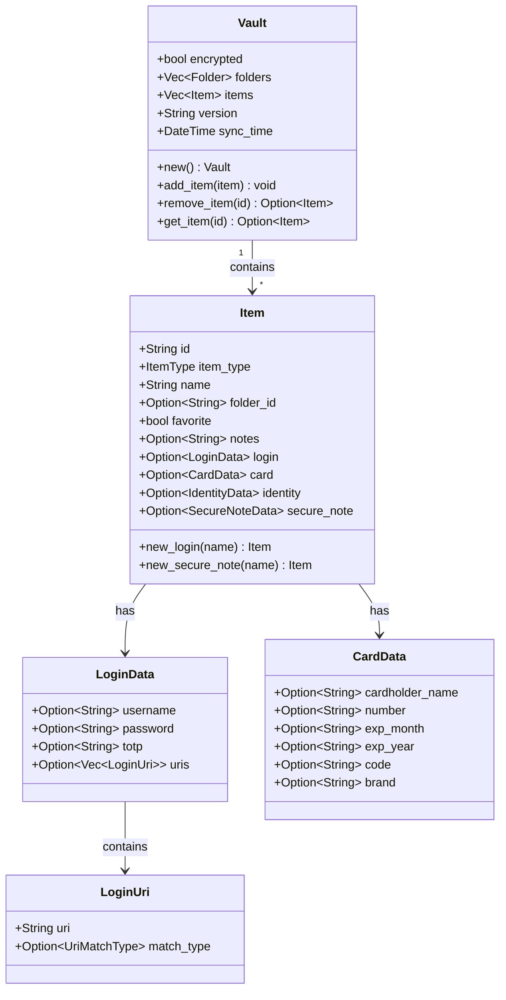

**图表来源**
- [models.rs](file://core/src/models.rs#L8-L160)

### 支持的条目类型

| 类型 | 常量值 | 描述 | 特殊字段 |
|------|--------|------|----------|
| 登录 | 1 | 网站登录凭证 | username, password, totp, uris |
| 安全笔记 | 2 | 文本类敏感信息 | notes |
| 信用卡 | 3 | 金融支付信息 | cardholder_name, number, exp_month, exp_year, code, brand |
| 身份信息 | 4 | 个人身份资料 | 多个个人信息字段 |

**节来源**
- [models.rs](file://core/src/models.rs#L75-L85)

## 条目生命周期管理

### 添加条目（Add）

`add`命令是创建新条目的主要入口点，支持多种条目类型的创建和自动密码生成功能。

#### 功能特性

- **多类型支持**：支持登录、笔记等条目类型
- **自动密码生成**：内置密码生成器，可配置复杂度
- **TOTP集成**：支持时间基础一次性密码
- **交互式输入**：使用dialoguer库提供友好的用户界面

#### 实现流程

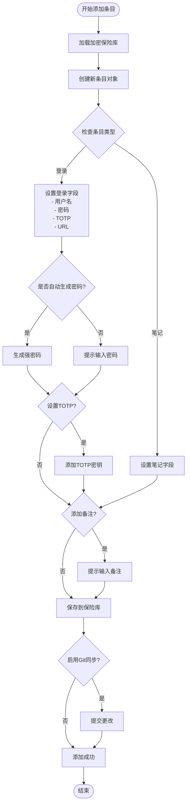

**图表来源**
- [add.rs](file://cli/src/commands/add.rs#L8-L109)

#### 使用示例

```bash
# 添加网站登录凭证
securefox add "GitHub" --item-type login --username "user@example.com" --generate

# 添加带有TOTP的条目
securefox add "Google" --item-type login --username "google@example.com" --totp "JBSWY3DPEHPK3PXP"

# 添加安全笔记
securefox add "Important Notes" --item-type note
```

**节来源**
- [add.rs](file://cli/src/commands/add.rs#L8-L109)

### 列表查询（List）

`list`命令提供强大的过滤和搜索功能，帮助用户快速定位所需的条目。

#### 搜索功能

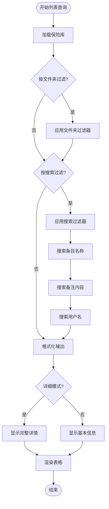

**图表来源**
- [list.rs](file://cli/src/commands/list.rs#L7-L146)

#### 过滤选项

| 参数 | 类型 | 描述 | 示例 |
|------|------|------|------|
| `--folder` | 字符串 | 按文件夹名称过滤 | `--folder "工作"` |
| `--search` | 字符串 | 按关键词搜索 | `--search "github"` |
| `-d, --detailed` | 布尔 | 显示详细信息 | `-d` |

**节来源**
- [list.rs](file://cli/src/commands/list.rs#L7-L146)

### 显示详情（Show）

`show`命令用于查看单个条目的详细信息，并支持密码复制到剪贴板的功能。

#### 功能特性

- **详细信息展示**：显示所有相关字段和元数据
- **密码复制**：安全地将密码复制到剪贴板
- **TOTP支持**：实时生成并显示TOTP验证码
- **时间戳显示**：显示创建和修改时间

#### 实现架构

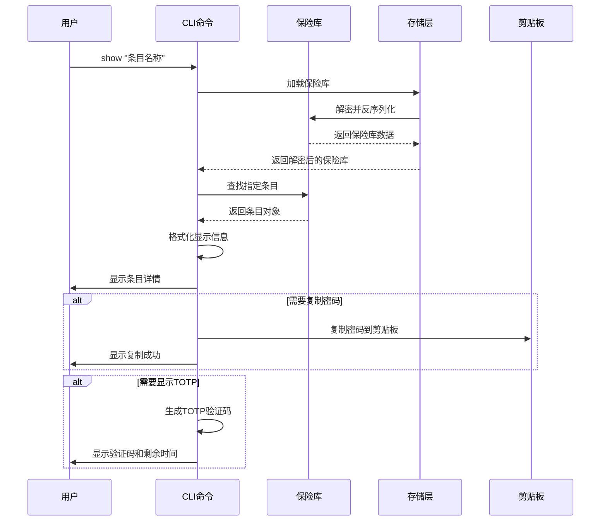

**图表来源**
- [show.rs](file://cli/src/commands/show.rs#L8-L113)

**节来源**
- [show.rs](file://cli/src/commands/show.rs#L8-L113)

### 删除条目（Remove）

虽然当前版本中`remove`命令使用占位符实现，但其设计遵循安全删除的原则。

#### 安全删除原则

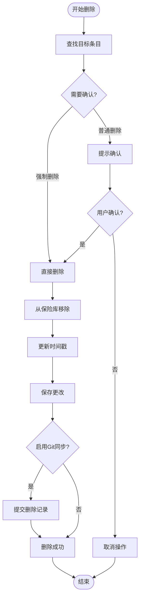

**图表来源**
- [placeholder.rs](file://cli/src/commands/placeholder.rs#L131-L138)

**节来源**
- [placeholder.rs](file://cli/src/commands/placeholder.rs#L131-L138)

## 详细组件分析

### 密码生成器集成

SecureFox集成了强大的密码生成功能，支持多种复杂度配置：

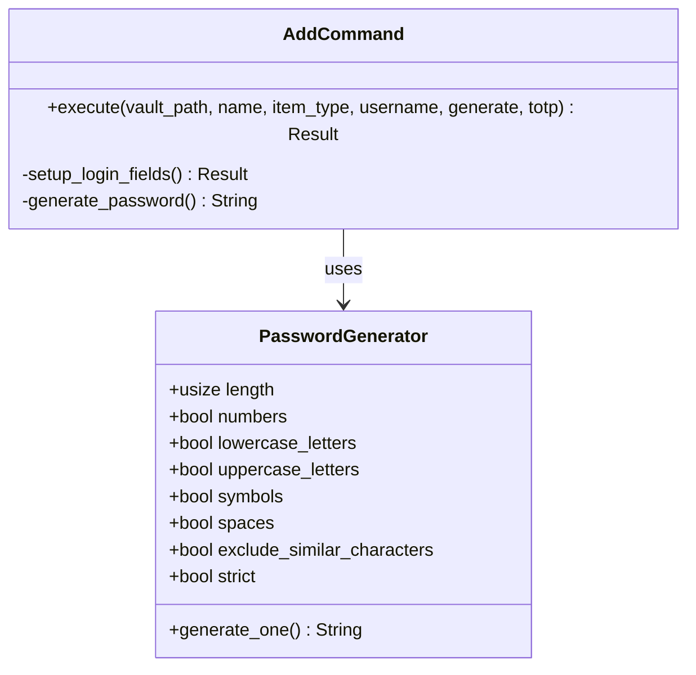

**图表来源**
- [add.rs](file://cli/src/commands/add.rs#L43-L52)

### TOTP（时间基础一次性密码）集成

TOTP功能为双因素认证提供了完整的支持：

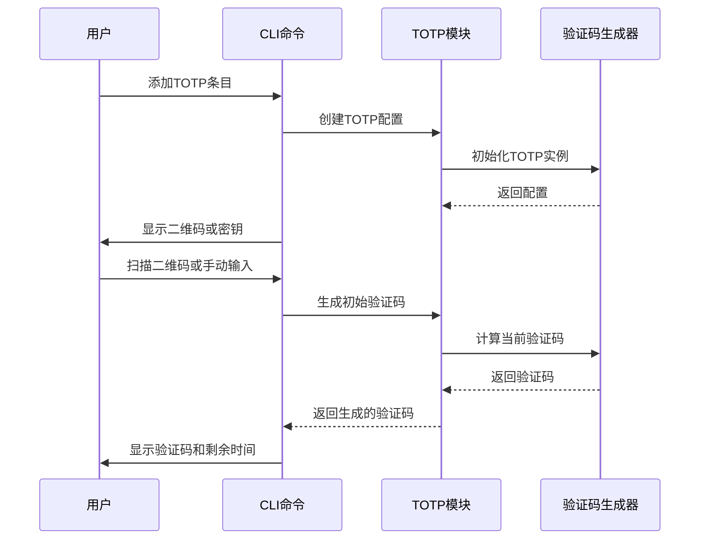

**图表来源**
- [totp.rs](file://core/src/totp.rs#L1-L211)

**节来源**
- [totp.rs](file://core/src/totp.rs#L1-L211)

### 浏览器扩展集成

扩展模块提供了Web界面的条目管理功能：

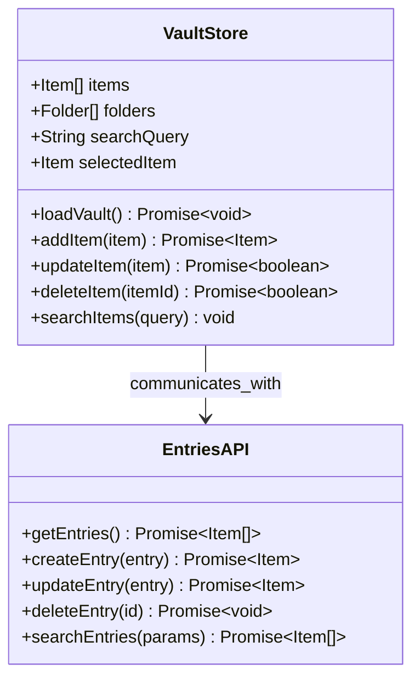

**图表来源**
- [vaultStore.ts](file://extension/store/vaultStore.ts#L1-L233)
- [entries.ts](file://extension/lib/api/entries.ts#L1-L152)

**节来源**
- [vaultStore.ts](file://extension/store/vaultStore.ts#L1-L233)
- [entries.ts](file://extension/lib/api/entries.ts#L1-L152)

## 加密存储机制

SecureFox采用端到端加密保护用户的敏感数据：

### 存储架构

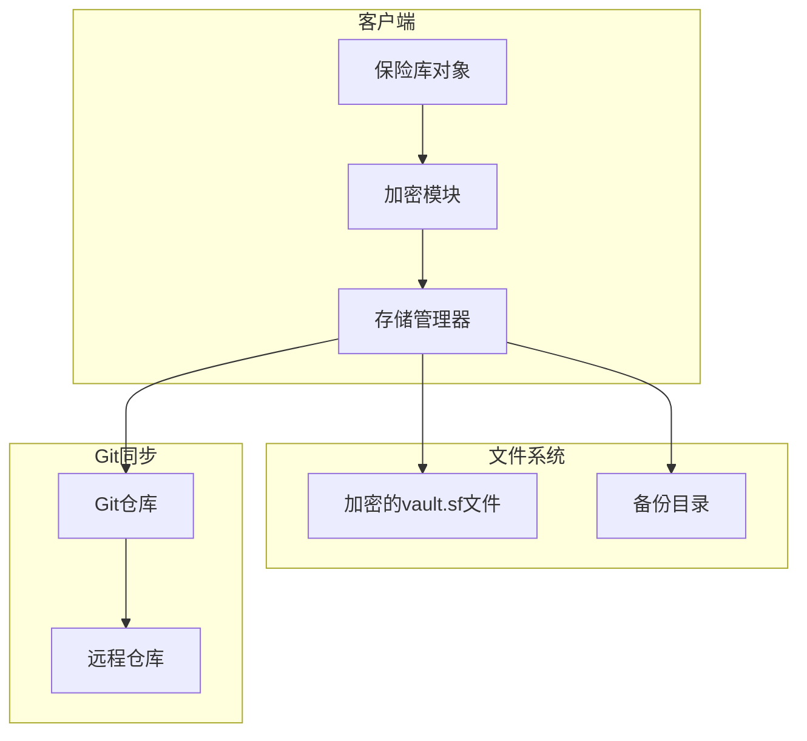

**图表来源**
- [storage.rs](file://core/src/storage.rs#L1-L318)

### 加密流程

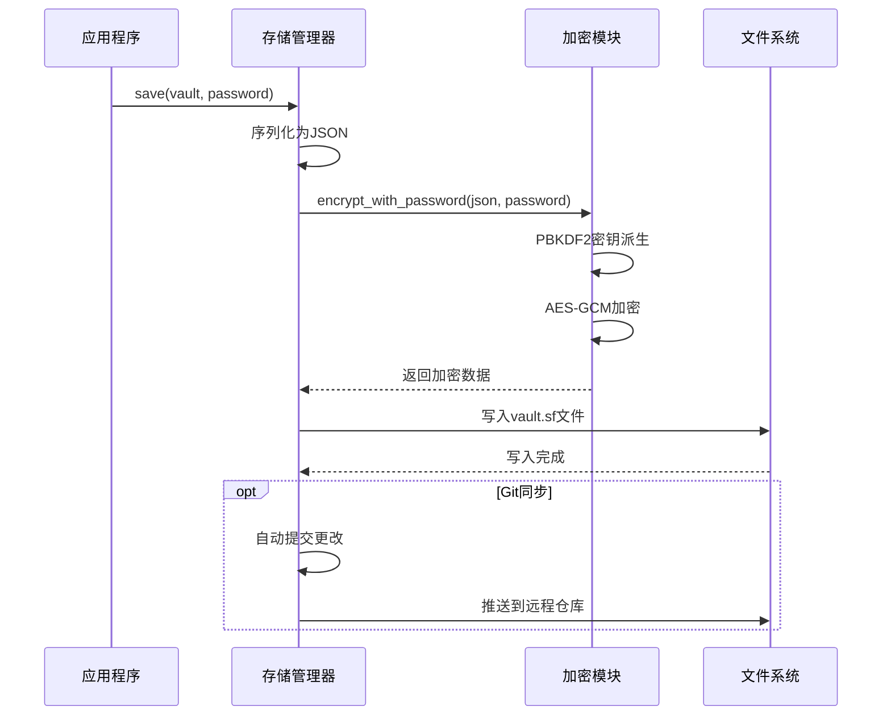

**图表来源**
- [storage.rs](file://core/src/storage.rs#L69-L133)

**节来源**
- [storage.rs](file://core/src/storage.rs#L1-L318)

## 常见问题与解决方案

### 条目名称冲突

**问题描述**：尝试添加具有相同名称的条目时可能产生冲突。

**解决方案**：
- SecureFox使用UUID作为唯一标识符，避免名称冲突
- 支持通过ID精确匹配条目
- 在列表中显示条目的创建时间和修改时间帮助区分重复名称

### 删除确认流程

**问题描述**：误删除重要条目。

**解决方案**：
- 当前版本提供`--force`参数进行强制删除
- 后续版本将实现交互式确认机制
- Git同步功能提供撤销删除的能力

### 密码复制安全性

**问题描述**：密码复制到剪贴板的安全性。

**解决方案**：
- 使用平台特定的剪贴板API
- 支持自动清除剪贴板内容
- 提供明文显示选项而非复制

### TOTP密钥管理

**问题描述**：TOTP密钥的安全存储和传输。

**解决方案**：
- 支持QR码扫描和手动输入
- 验证密钥格式的有效性
- 提供TOTP验证码的实时生成

## 总结

SecureFox的条目管理系统提供了完整的密码条目生命周期管理功能，具有以下特点：

1. **多样化条目类型**：支持登录、笔记、信用卡、身份信息等多种类型
2. **强大的搜索功能**：支持按名称、备注、用户名等多维度搜索
3. **安全的加密存储**：采用端到端加密保护用户数据
4. **跨平台一致性**：CLI和浏览器扩展提供一致的用户体验
5. **自动化备份同步**：支持Git同步和自动备份

该系统的设计充分考虑了安全性、可用性和可扩展性，为用户提供了可靠而便捷的密码管理解决方案。随着功能的不断完善，SecureFox将继续为用户提供更加优秀的密码管理体验。