# SecureFox加密实现详细文档

<cite>
**本文档引用的文件**
- [crypto.rs](file://core/src/crypto.rs)
- [models.rs](file://core/src/models.rs)
- [storage.rs](file://core/src/storage.rs)
- [lib.rs](file://core/src/lib.rs)
- [errors.rs](file://core/src/errors.rs)
- [init.rs](file://cli/src/commands/init.rs)
- [bitwarden.rs](file://core/src/importers/bitwarden.rs)
</cite>

## 目录
1. [简介](#简介)
2. [项目架构概览](#项目架构概览)
3. [核心加密组件](#核心加密组件)
4. [AES-256-GCM-SIV加密机制](#aes-256-gcm-siv加密机制)
5. [密钥派生函数(KDF)](#密钥派生函数kdf)
6. [EncryptionKey结构体与内存安全](#encryptionkey结构体与内存安全)
7. [加密数据格式](#加密数据格式)
8. [实际使用示例](#实际使用示例)
9. [性能考量与安全性分析](#性能考量与安全性分析)
10. [故障排除指南](#故障排除指南)
11. [总结](#总结)

## 简介

SecureFox是一个基于Rust开发的密码管理器，采用先进的加密技术保护用户数据。本文档深入分析了SecureFox中Crypto模块的实现，重点介绍了AES-256-GCM-SIV认证加密、多种密钥派生函数以及完整的加密数据生命周期管理。

该系统的设计遵循了现代密码学的最佳实践，提供了高安全性和易用性的平衡，同时支持多种加密算法以满足不同用户的需求。

## 项目架构概览

SecureFox的加密架构采用分层设计，主要包含以下核心模块：

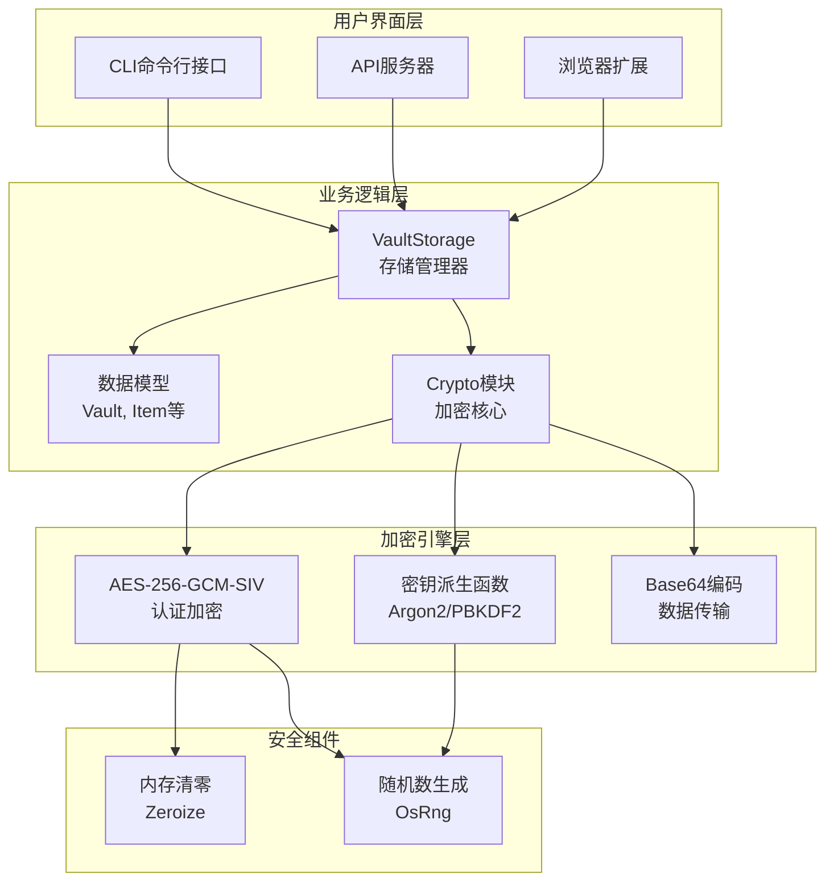

**图表来源**
- [lib.rs](file://core/src/lib.rs#L1-L37)
- [storage.rs](file://core/src/storage.rs#L1-L50)
- [crypto.rs](file://core/src/crypto.rs#L1-L50)

**章节来源**
- [lib.rs](file://core/src/lib.rs#L1-L37)
- [storage.rs](file://core/src/storage.rs#L1-L318)

## 核心加密组件

SecureFox的加密系统由以下几个核心组件构成：

### 加密常量定义

系统定义了关键的加密参数常量：

| 常量名称 | 数值 | 用途 |
|---------|------|------|
| KEY_SIZE | 32字节 | AES-256密钥长度 |
| NONCE_SIZE | 12字节 | GCM-SIV非重复数长度 |
| ARGON2_MEMORY_KB | 19456KB (19MB) | Argon2内存成本 |
| ARGON2_ITERATIONS | 2 | Argon2迭代次数 |
| ARGON2_PARALLELISM | 1 | Argon2并行度 |
| PBKDF2_ITERATIONS | 100,000 | PBKDF2迭代次数 |

### 主要加密类型

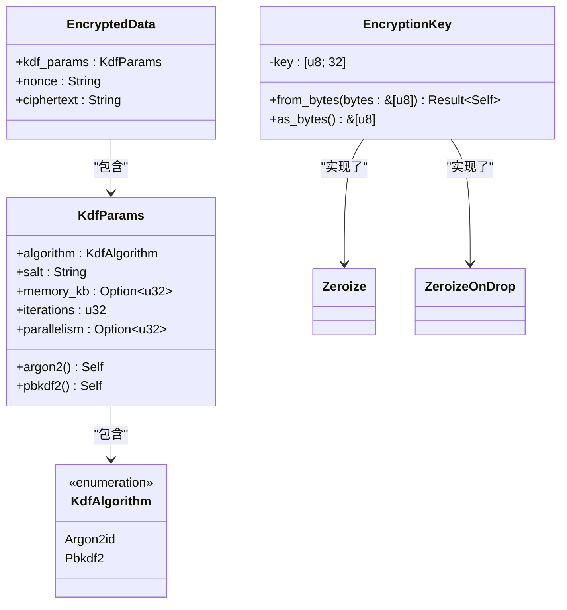

**图表来源**
- [crypto.rs](file://core/src/crypto.rs#L39-L127)

**章节来源**
- [crypto.rs](file://core/src/crypto.rs#L20-L127)

## AES-256-GCM-SIV加密机制

### 认证加密原理

SecureFox采用AES-256-GCM-SIV作为主要的对称加密算法，这是一种具有以下特性的高级加密模式：

#### 安全优势分析

1. **真实性保证**：防止篡改攻击
2. **完整性验证**：确保数据未被修改
3. **重放攻击防护**：通过唯一nonce防止重放
4. **并发安全性**：支持多线程并行处理

#### 非重复数(NONCE)生成

系统使用操作系统提供的安全随机数生成器：

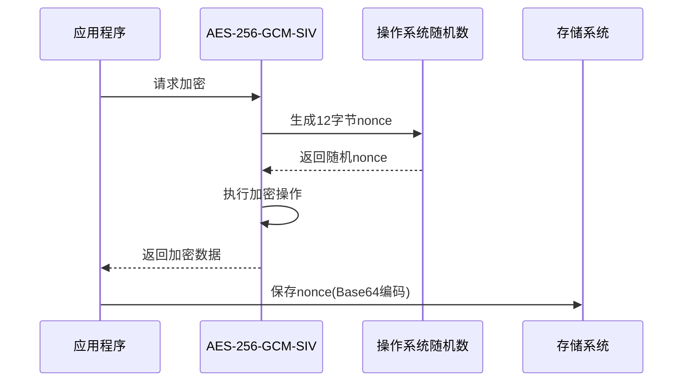

**图表来源**
- [crypto.rs](file://core/src/crypto.rs#L188-L192)

### 密文编码机制

加密后的密文采用Base64编码进行安全传输和存储：

| 编码前 | 编码后 | 处理方式 |
|--------|--------|----------|
| 原始二进制数据 | Base64字符串 | 标准URL安全编码 |
| 12字节nonce | 16字符字符串 | URL安全编码 |
| 可变长度密文 | 可变长度字符串 | 标准Base64编码 |

**章节来源**
- [crypto.rs](file://core/src/crypto.rs#L183-L228)

## 密钥派生函数(KDF)

### KDF算法对比

SecureFox支持两种主要的密钥派生函数：

#### Argon2id算法

Argon2id是当前推荐的密钥派生算法，具有以下特点：

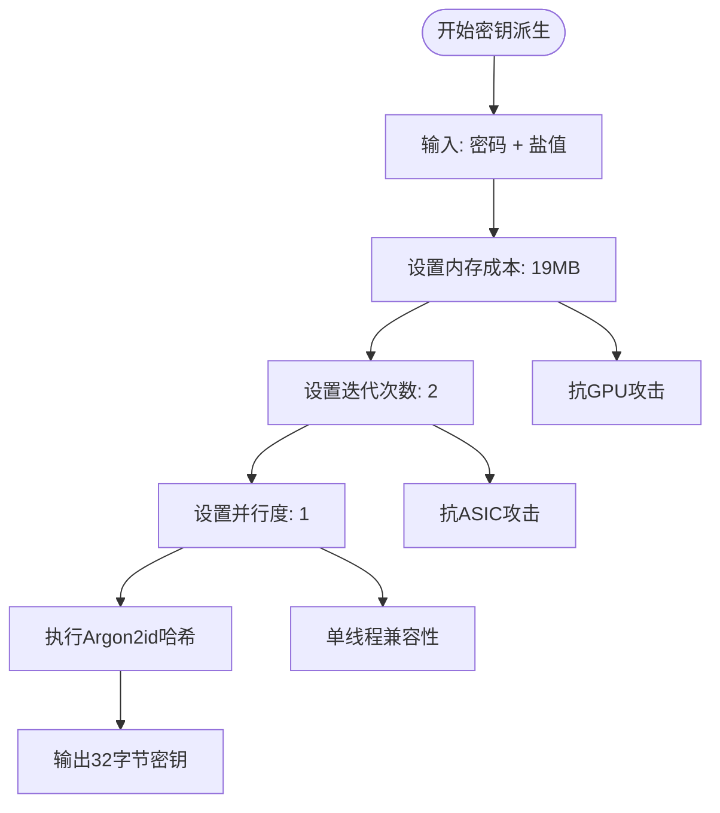

**图表来源**
- [crypto.rs](file://core/src/crypto.rs#L104-L118)

#### PBKDF2算法

PBKDF2-HMAC-SHA256提供标准的安全级别：

| 参数 | 值 | 安全考量 |
|------|-----|----------|
| 迭代次数 | 100,000 | 平衡安全性和性能 |
| 哈希函数 | HMAC-SHA256 | 标准SHA2系列 |
| 内存使用 | 最小 | 兼容性更好 |
| CPU需求 | 中等 | 更快的解锁速度 |

### KDF参数配置

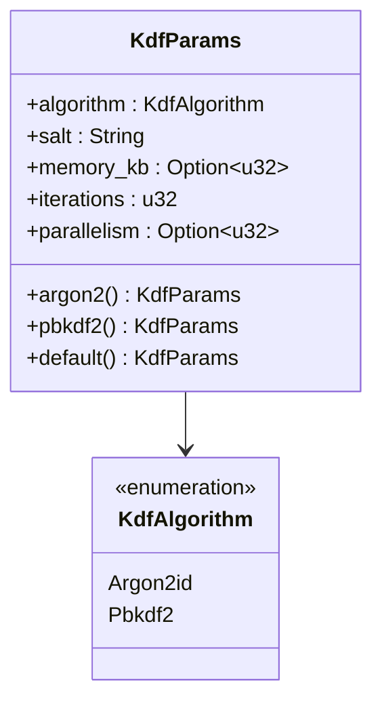

**图表来源**
- [crypto.rs](file://core/src/crypto.rs#L66-L119)

**章节来源**
- [crypto.rs](file://core/src/crypto.rs#L129-L173)

## EncryptionKey结构体与内存安全

### 内存安全设计

EncryptionKey结构体采用了严格的内存安全措施：

#### Zeroize特性实现

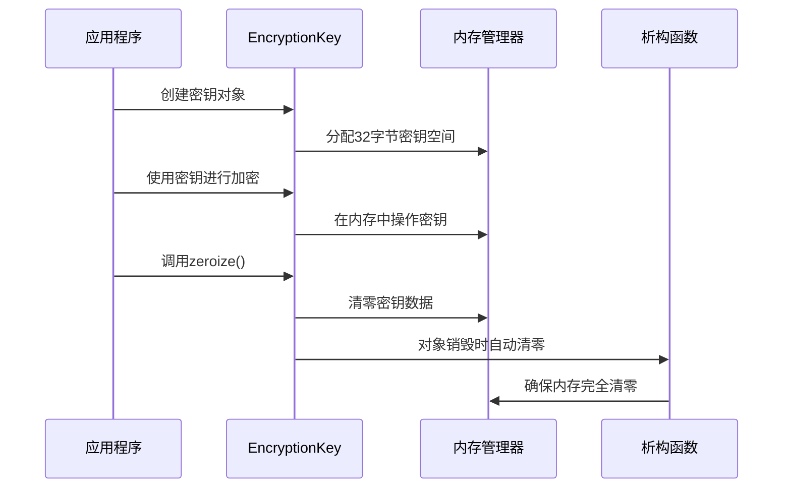

**图表来源**
- [crypto.rs](file://core/src/crypto.rs#L39-L64)

#### 安全特性

1. **自动清零**：实现ZeroizeOnDrop特性
2. **内存保护**：防止密钥泄露到交换文件
3. **边界检查**：严格验证密钥长度
4. **安全初始化**：使用安全随机数生成

### 密钥生命周期管理

| 阶段 | 操作 | 安全措施 |
|------|------|----------|
| 创建 | 从随机字节生成 | OsRng安全随机数 |
| 使用 | 加密/解密操作 | 内存中临时处理 |
| 清理 | zeroize()调用 | 手动清零 |
| 销毁 | Drop析构 | 自动清零+内存释放 |

**章节来源**
- [crypto.rs](file://core/src/crypto.rs#L39-L64)

## 加密数据格式

### EncryptedData结构

加密数据采用统一的容器格式：

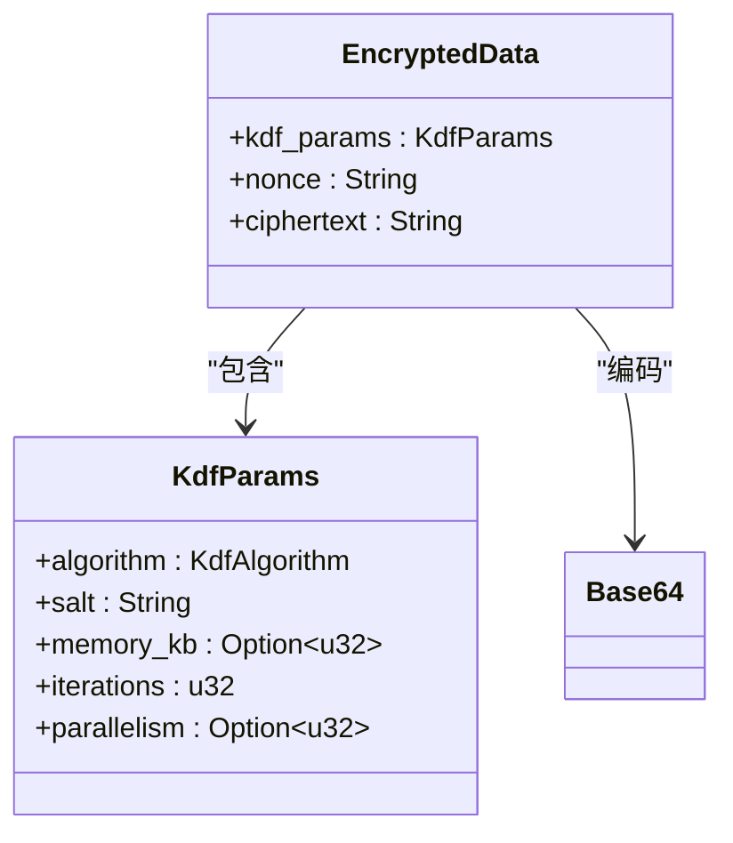

**图表来源**
- [crypto.rs](file://core/src/crypto.rs#L121-L127)

### 数据格式详解

| 字段 | 类型 | 编码方式 | 长度范围 |
|------|------|----------|----------|
| kdf_params | KdfParams | JSON序列化 | 变长 |
| nonce | String | Base64 | 16字符 |
| ciphertext | String | Base64 | 变长 |

### 序列化设计优势

1. **向后兼容**：支持未来算法扩展
2. **版本控制**：包含版本信息字段
3. **元数据完整**：保留所有加密参数
4. **可读性强**：JSON格式便于调试

**章节来源**
- [crypto.rs](file://core/src/crypto.rs#L121-L127)

## 实际使用示例

### 基本加密流程

以下是典型的加密操作流程：

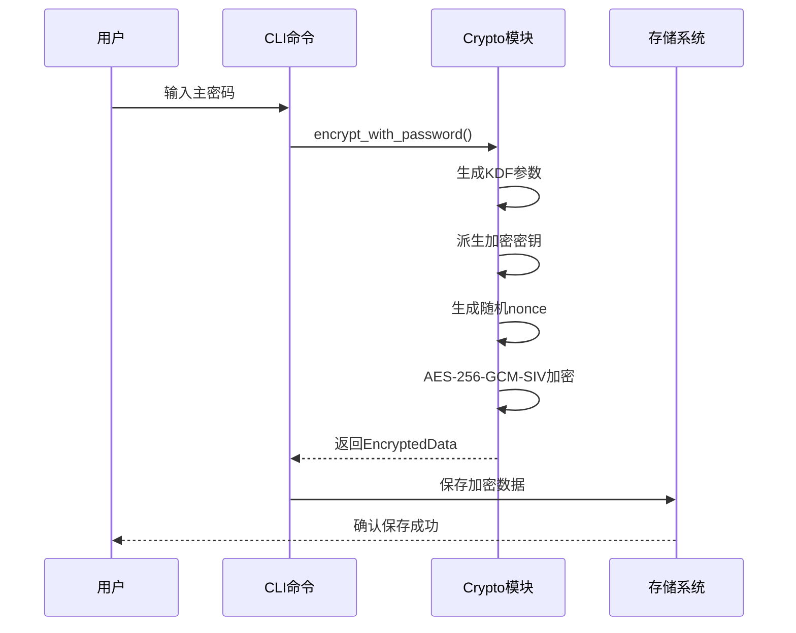

**图表来源**
- [crypto.rs](file://core/src/crypto.rs#L201-L228)
- [storage.rs](file://core/src/storage.rs#L70-L92)

### 初始化场景示例

在Vault初始化过程中，用户可以选择不同的KDF算法：

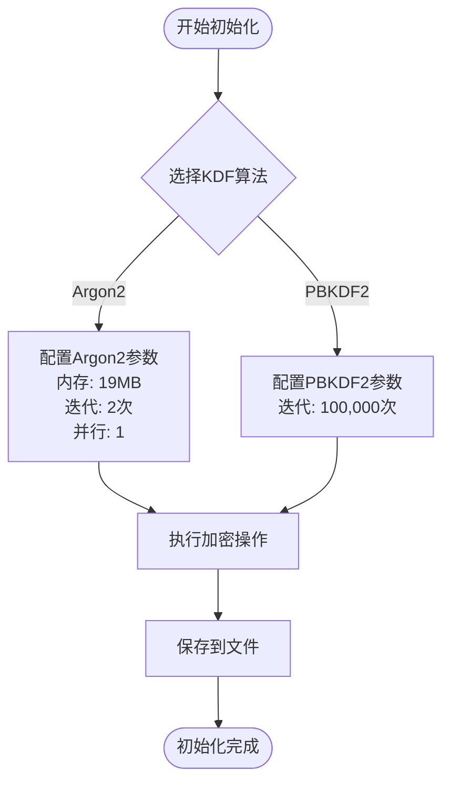

**图表来源**
- [init.rs](file://cli/src/commands/init.rs#L29-L68)

### 解密恢复流程

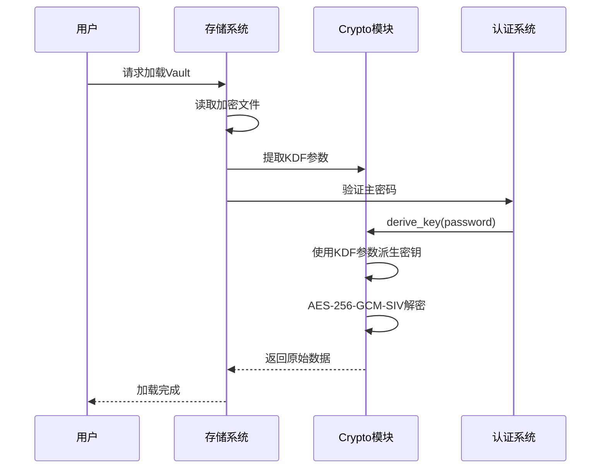

**图表来源**
- [storage.rs](file://core/src/storage.rs#L161-L177)

**章节来源**
- [crypto.rs](file://core/src/crypto.rs#L201-L263)
- [storage.rs](file://core/src/storage.rs#L70-L177)

## 性能考量与安全性分析

### 性能特征对比

| 特性 | Argon2id | PBKDF2 |
|------|----------|--------|
| 密钥派生时间 | 1-2秒 | 0.1-0.2秒 |
| 内存使用 | 19MB | 最小 |
| CPU需求 | 高 | 中等 |
| GPU抗性 | 强 | 弱 |
| 兼容性 | 良好 | 优秀 |

### 安全威胁防护

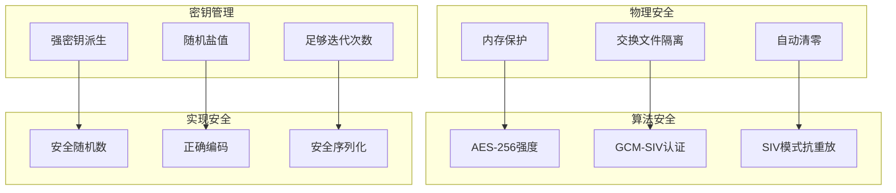

### 安全最佳实践

1. **密钥轮换**：定期更新主密码
2. **备份策略**：安全的密钥备份
3. **访问控制**：多因素认证支持
4. **审计日志**：操作记录追踪

**章节来源**
- [crypto.rs](file://core/src/crypto.rs#L26-L37)

## 故障排除指南

### 常见问题诊断

| 问题类型 | 症状 | 可能原因 | 解决方案 |
|----------|------|----------|----------|
| 解密失败 | "Decryption failed" | 密码错误/数据损坏 | 验证密码/检查文件完整性 |
| 密钥派生错误 | "Key derivation failed" | KDF参数不匹配 | 使用正确的KDF配置 |
| 内存泄漏 | 内存使用持续增长 | 密钥未正确清零 | 更新到最新版本 |
| 性能问题 | 解锁速度过慢 | Argon2参数过高 | 考虑使用PBKDF2 |

### 调试技巧

1. **启用详细日志**：编译时添加调试信息
2. **检查文件权限**：确保vault文件可读写
3. **验证依赖版本**：确认加密库版本兼容
4. **测试环境隔离**：在独立环境中测试

**章节来源**
- [errors.rs](file://core/src/errors.rs#L15-L21)

## 总结

SecureFox的加密实现体现了现代密码学的最佳实践，通过以下关键特性确保了数据安全：

### 核心优势

1. **算法先进性**：采用AES-256-GCM-SIV这一业界领先的加密算法
2. **算法灵活性**：支持Argon2id和PBKDF2两种密钥派生函数
3. **内存安全性**：通过Zeroize确保敏感数据的安全清理
4. **格式标准化**：采用JSON格式便于跨平台兼容
5. **性能平衡**：在安全性和用户体验之间找到最佳平衡点

### 技术创新

- **自动内存管理**：EncryptionKey的ZeroizeOnDrop特性
- **灵活的KDF设计**：支持未来算法扩展的序列化结构
- **完整的数据生命周期**：从创建到销毁的全程安全保障
- **用户友好性**：透明的加密过程，无需用户干预

### 发展方向

随着密码学技术的发展，SecureFox的加密架构具备良好的扩展性，可以：
- 集成新的加密算法
- 支持量子抗性密码学
- 实现硬件加速优化
- 增强多设备同步安全

这个加密系统为用户提供了企业级的数据保护，同时保持了良好的使用体验，是现代密码管理器设计的优秀范例。