# 受保护的威胁

<cite>
**本文档中引用的文件**
- [core/src/crypto.rs](file://core/src/crypto.rs)
- [core/src/storage.rs](file://core/src/storage.rs)
- [core/src/git_sync.rs](file://core/src/git_sync.rs)
- [core/src/keychain.rs](file://core/src/keychain.rs)
- [core/src/models.rs](file://core/src/models.rs)
- [core/src/errors.rs](file://core/src/errors.rs)
- [api/src/state.rs](file://api/src/state.rs)
- [core/Cargo.toml](file://core/Cargo.toml)
- [README.md](file://README.md)
- [README.zh-CN.md](file://README.zh-CN.md)
</cite>

## 目录
1. [简介](#简介)
2. [零知识架构](#零知识架构)
3. [加密算法与密钥派生](#加密算法与密钥派生)
4. [静态数据保护](#静态数据保护)
5. [端到端加密同步](#端到端加密同步)
6. [安全内存管理](#安全内存管理)
7. [威胁模型分析](#威胁模型分析)
8. [系统架构图](#系统架构图)
9. [总结](#总结)

## 简介

SecureFox是一个采用零知识架构的本地优先密码管理器，通过多层安全机制提供全面的数据保护。该系统的核心设计理念是确保用户的主密码和解密密钥永远不会离开用户设备，所有敏感数据都经过强加密保护，并通过端到端加密技术确保传输过程中的安全性。

## 零知识架构

### 核心原则

SecureFox的零知识架构确保了以下关键安全原则：

1. **主密码控制权**：用户的主密码完全由用户控制，Never离开用户设备
2. **服务器无访问权限**：API服务器无法访问用户的明文数据
3. **客户端处理**：所有加密和解密操作都在客户端完成
4. **数据隔离**：用户数据与系统配置完全分离

### 架构实现

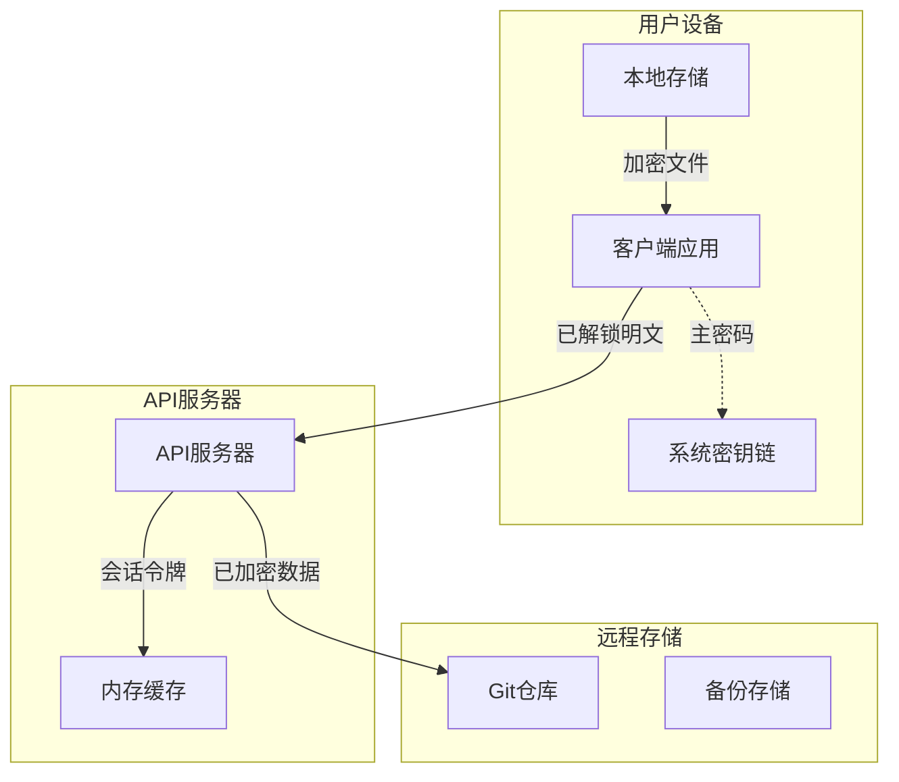

**图表来源**
- [api/src/state.rs](file://api/src/state.rs#L1-L113)
- [core/src/storage.rs](file://core/src/storage.rs#L1-L318)

### 数据流保护

系统通过以下机制确保数据流的安全性：

- **解锁时处理**：只有在用户解锁后，API服务器才处理明文数据
- **自动锁定**：系统在超时后自动清理内存中的敏感数据
- **会话管理**：基于令牌的会话控制，支持超时自动失效

**章节来源**
- [api/src/state.rs](file://api/src/state.rs#L25-L64)

## 加密算法与密钥派生

### AES-256-GCM-SIV 认证加密

SecureFox采用AES-256-GCM-SIV作为主要的加密算法，提供以下安全特性：

| 特性 | 实现细节 | 安全优势 |
|------|----------|----------|
| **密钥长度** | 256位 | 抵御量子计算攻击 |
| **认证加密** | GCM-SIV模式 | 防止篡改和重放攻击 |
| **随机数生成** | OS CSPRNG | 提供高熵随机性 |
| **完整性验证** | 自动标签验证 | 检测数据篡改 |

### 密钥派生函数选择

系统支持两种密钥派生函数，根据安全需求和性能要求灵活选择：

#### Argon2id 密钥派生

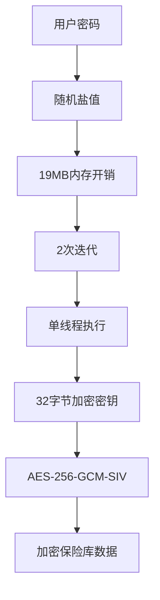

**图表来源**
- [core/src/crypto.rs](file://core/src/crypto.rs#L130-L157)

#### PBKDF2 密钥派生

PBKDF2-HMAC-SHA256提供平衡的安全性和性能：

| 参数 | 值 | 安全考虑 |
|------|-----|----------|
| **迭代次数** | 100,000 | OWASP推荐600,000的折衷方案 |
| **哈希算法** | SHA-256 | 行业标准哈希函数 |
| **内存使用** | 最小 | 适合资源受限环境 |
| **计算时间** | 快速响应 | 优化用户体验 |

### 密钥管理机制

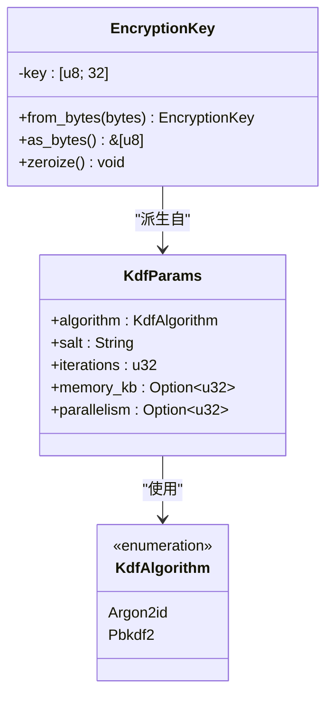

**图表来源**
- [core/src/crypto.rs](file://core/src/crypto.rs#L39-L101)

**章节来源**
- [core/src/crypto.rs](file://core/src/crypto.rs#L130-L172)

## 静态数据保护

### 文件级加密保护

SecureFox对所有存储的保险库文件实施严格的加密保护：

#### 加密容器结构

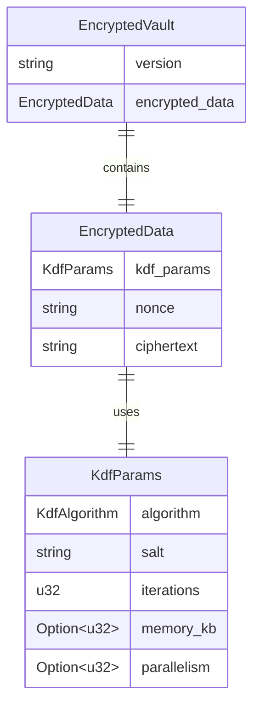

**图表来源**
- [core/src/storage.rs](file://core/src/storage.rs#L21-L26)
- [core/src/crypto.rs](file://core/src/crypto.rs#L121-L127)

#### 存储安全特性

1. **原子性写入**：确保文件写入的原子性，防止部分写入损坏
2. **版本控制**：支持保险库版本跟踪和回滚
3. **备份保护**：自动创建加密备份，防止数据丢失
4. **目录隔离**：保险库文件与配置文件分离存储

### 备份与恢复安全

系统提供多重备份保护机制：

- **自动备份**：每次修改都会创建时间戳备份
- **轮换策略**：支持保留最近N个备份版本
- **加密存储**：备份文件同样经过AES-256-GCM-SIV加密
- **完整性校验**：备份文件包含完整性验证信息

**章节来源**
- [core/src/storage.rs](file://core/src/storage.rs#L180-L249)

## 端到端加密同步

### Git 同步架构

SecureFox的Git同步功能实现了真正的端到端加密，确保数据在传输和存储过程中的安全性：

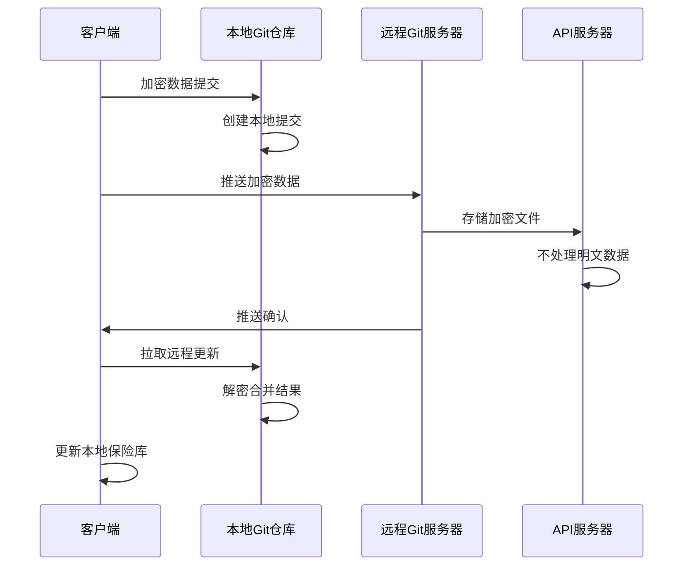

**图表来源**
- [core/src/git_sync.rs](file://core/src/git_sync.rs#L1-L503)

### 同步安全特性

#### 传输层保护

1. **HTTPS/SSH支持**：支持多种安全传输协议
2. **凭据管理**：自动管理SSH密钥和用户名密码
3. **主机密钥验证**：防止中间人攻击

#### 存储层保护

1. **加密存储**：远程仓库只存储加密文件
2. **不可读内容**：即使服务器被攻破也无法读取数据
3. **审计追踪**：完整的同步历史记录

#### 冲突解决机制

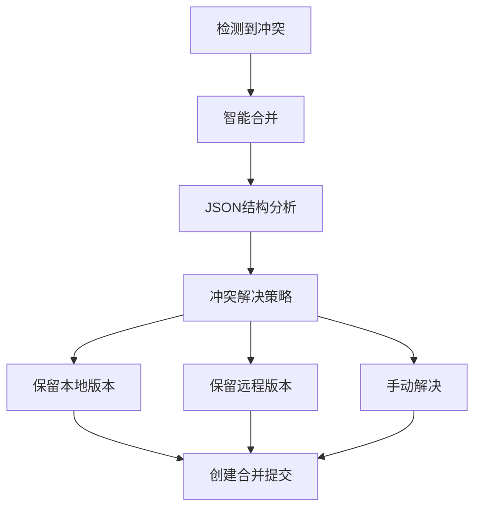

**图表来源**
- [core/src/git_sync.rs](file://core/src/git_sync.rs#L274-L292)

### 同步模式配置

| 模式 | 描述 | 安全级别 | 性能影响 |
|------|------|----------|----------|
| **手动同步** | 用户主动触发 | 高 | 最低 |
| **推送变更** | 修改时自动推送 | 中 | 中等 |
| **智能同步** | 检测到更新时拉取 | 中 | 中等 |
| **定时同步** | 固定间隔自动同步 | 低 | 高 |

**章节来源**
- [core/src/git_sync.rs](file://core/src/git_sync.rs#L442-L462)
- [core/src/models.rs](file://core/src/models.rs#L297-L367)

## 安全内存管理

### 内存安全机制

SecureFox实现了多层次的安全内存管理，防止敏感数据在内存中残留：

#### 自动内存清理

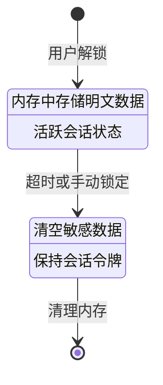

**图表来源**
- [api/src/state.rs](file://api/src/state.rs#L44-L51)

#### 零化内存保护

系统使用`zeroize`库实现安全的内存清理：

1. **自动零化**：对象销毁时自动清零敏感数据
2. **手动零化**：支持程序化内存清理
3. **堆栈保护**：防止编译器优化导致的数据残留

#### 系统密钥链集成

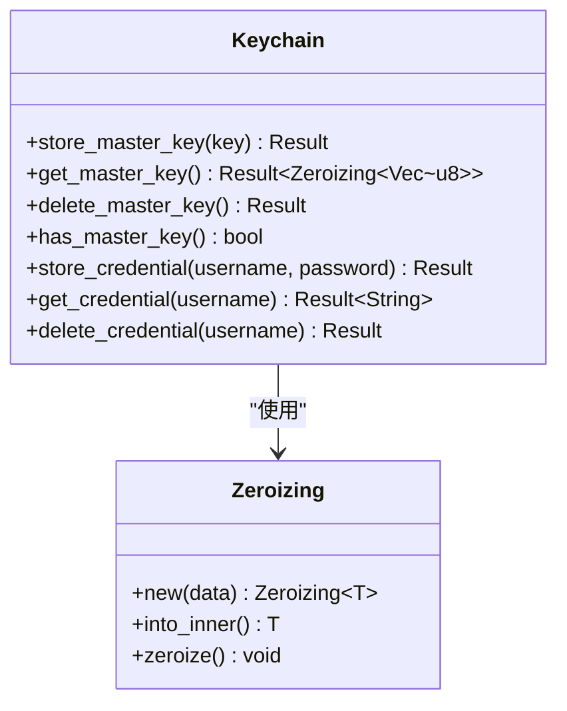

**图表来源**
- [core/src/keychain.rs](file://core/src/keychain.rs#L1-L169)

### 内存保护特性

| 保护机制 | 实现方式 | 安全效果 |
|----------|----------|----------|
| **自动清理** | Drop trait实现 | 防止意外泄漏 |
| **手动清理** | explicit zeroize调用 | 主动清除敏感数据 |
| **系统集成** | 平台特定密钥链 | 利用操作系统安全特性 |
| **内存隔离** | 进程边界保护 | 防止其他进程访问 |

**章节来源**
- [core/src/keychain.rs](file://core/src/keychain.rs#L47-L84)
- [core/src/crypto.rs](file://core/src/crypto.rs#L39-L64)

## 威胁模型分析

### 受保护的威胁类型

SecureFox针对以下威胁类型提供了全面的防护：

#### 数据泄露防护

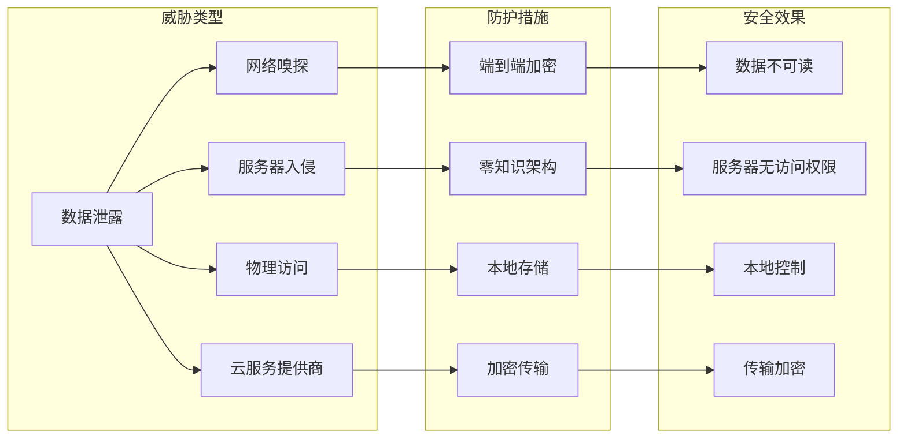

#### 攻击向量分析

| 攻击向量 | 防护级别 | 防护机制 | 效果 |
|----------|----------|----------|------|
| **Brute Force** | 强 | Argon2id/PBKDF2 | 计算成本高，难以暴力破解 |
| **Memory Dump** | 强 | 安全内存清理 | 敏感数据及时清除 |
| **Network Sniffing** | 强 | E2E加密同步 | 传输数据始终加密 |
| **Malicious Server** | 强 | 零知识架构 | 服务器无法访问明文 |
| **Keylogging** | 中 | 依赖用户安全 | 需要配合2FA |

### 不受保护的威胁

系统明确识别了一些无法防护的威胁：

1. **键盘记录器**：需要配合双因素认证
2. **弱主密码**：用户需要选择强密码
3. **设备物理访问**：解锁后的设备访问
4. **浏览器/操作系统漏洞**：依赖底层安全

**章节来源**
- [README.md](file://README.md#L286-L299)

## 系统架构图

### 整体安全架构

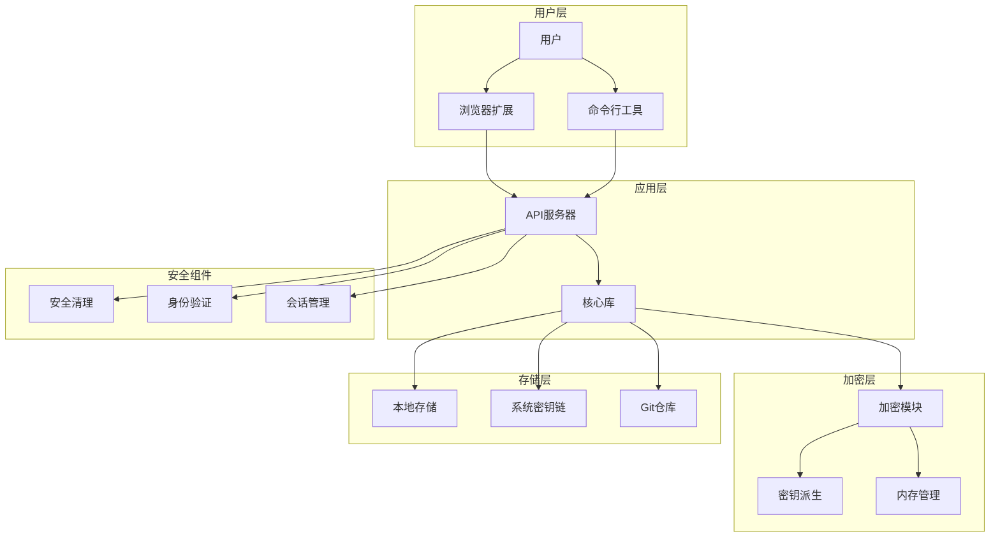

**图表来源**
- [api/src/state.rs](file://api/src/state.rs#L1-L113)
- [core/src/crypto.rs](file://core/src/crypto.rs#L1-L321)
- [core/src/storage.rs](file://core/src/storage.rs#L1-L318)

### 数据流安全路径

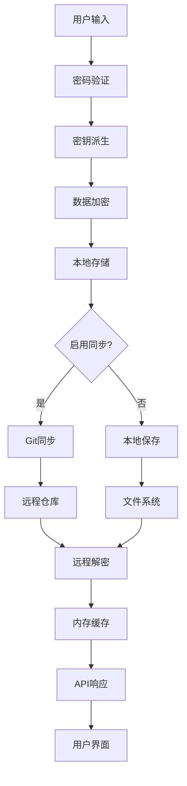

**图表来源**
- [core/src/storage.rs](file://core/src/storage.rs#L69-L133)
- [core/src/crypto.rs](file://core/src/crypto.rs#L183-L229)

## 总结

SecureFox通过以下核心安全机制提供了全面的数据保护：

### 核心安全特性

1. **零知识架构**：确保服务器无法访问用户明文数据
2. **强加密算法**：AES-256-GCM-SIV提供认证加密保护
3. **动态密钥派生**：Argon2id和PBKDF2提供抗暴力破解保护
4. **安全内存管理**：自动内存清理防止数据残留
5. **端到端同步**：Git同步确保传输和存储安全

### 安全优势

- **数据隐私**：用户完全控制自己的数据
- **传输安全**：所有网络通信都经过加密
- **存储保护**：本地文件和远程存储都得到加密保护
- **用户友好**：平衡安全性和可用性的设计

### 最佳实践建议

1. **选择强密码**：使用复杂且独特的主密码
2. **启用双因素认证**：配合TOTP功能提高安全性
3. **定期备份**：利用内置备份功能保护重要数据
4. **监控同步状态**：定期检查Git同步配置
5. **保持更新**：及时更新软件以获得最新安全修复

通过这些综合性的安全措施，SecureFox为用户提供了企业级的数据保护水平，同时保持了良好的用户体验。