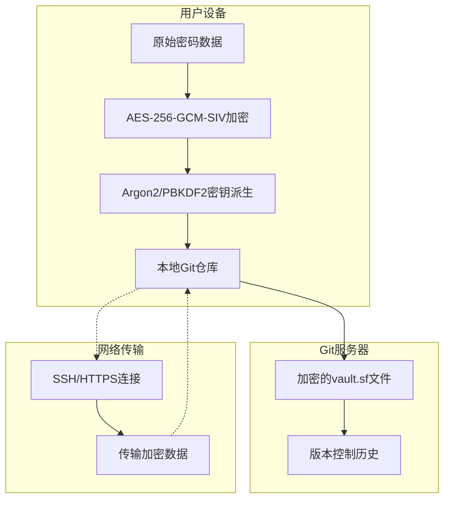
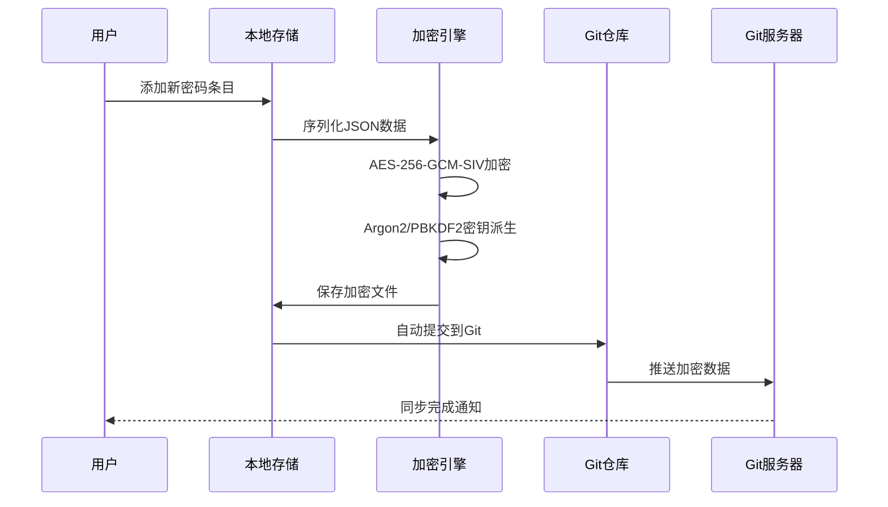
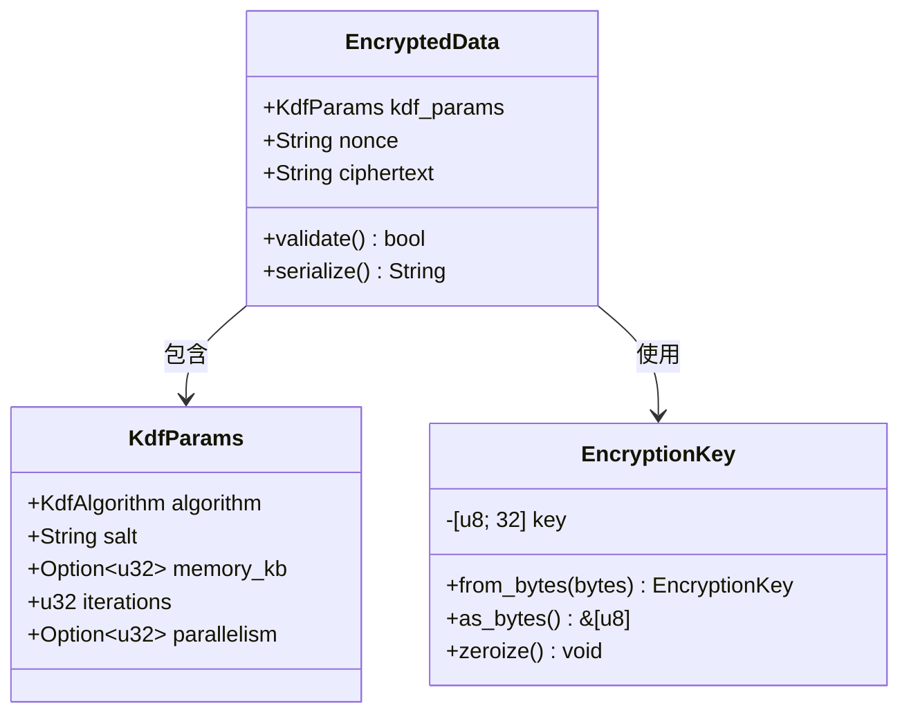
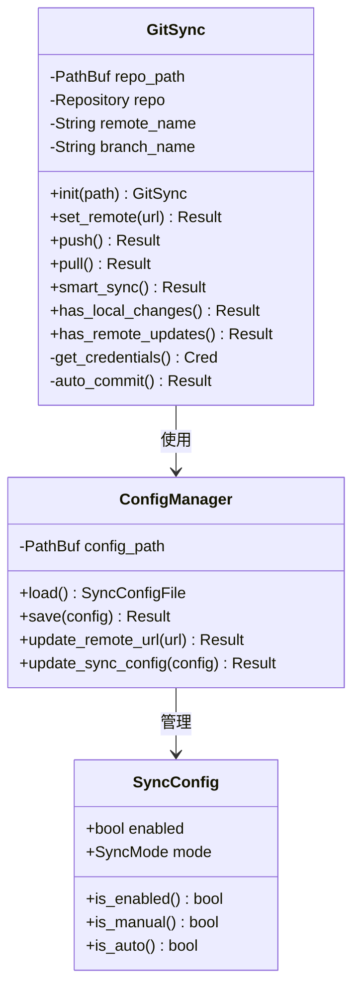
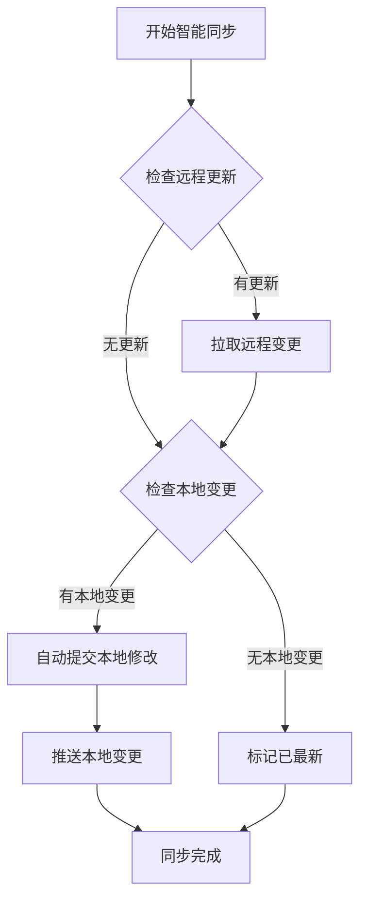
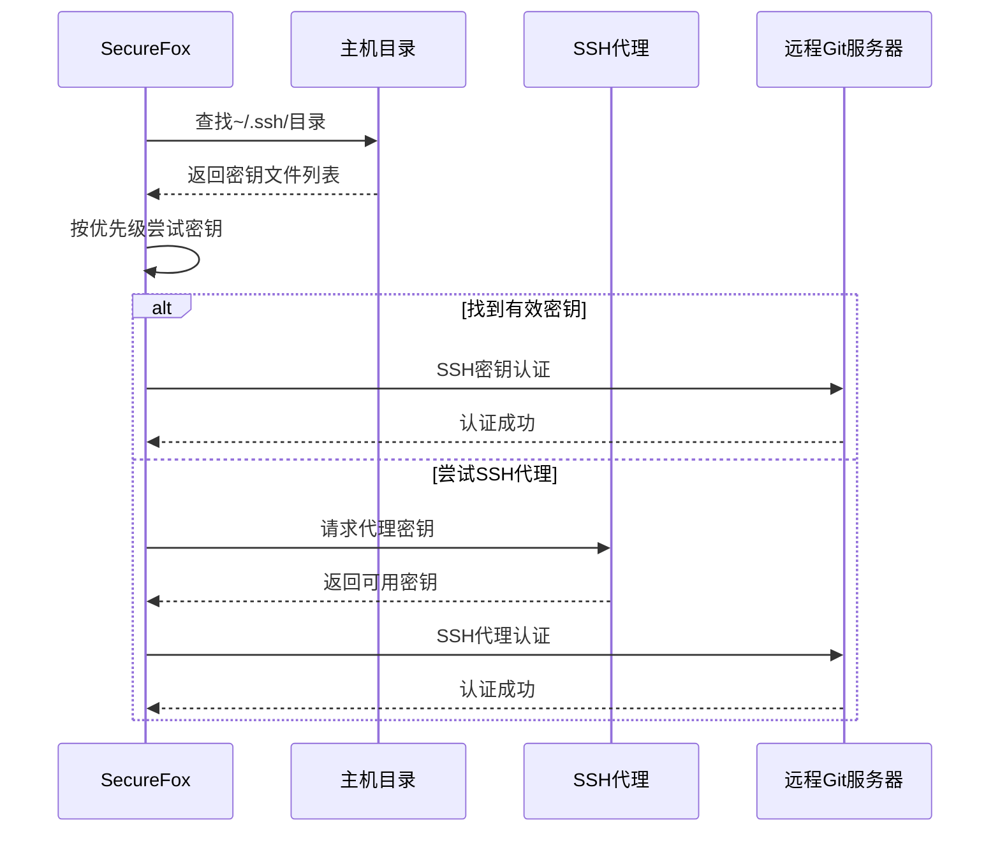
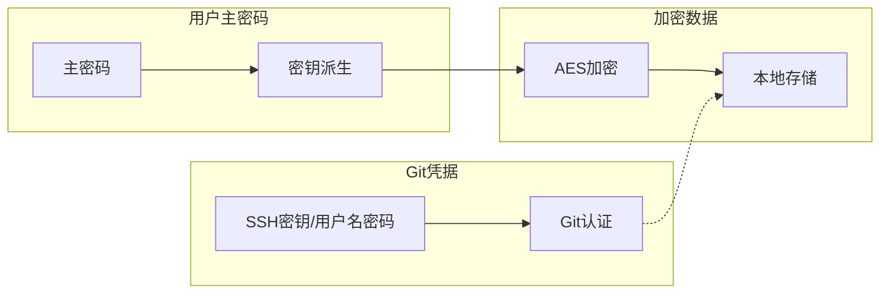
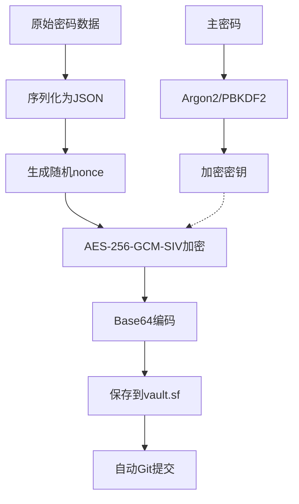
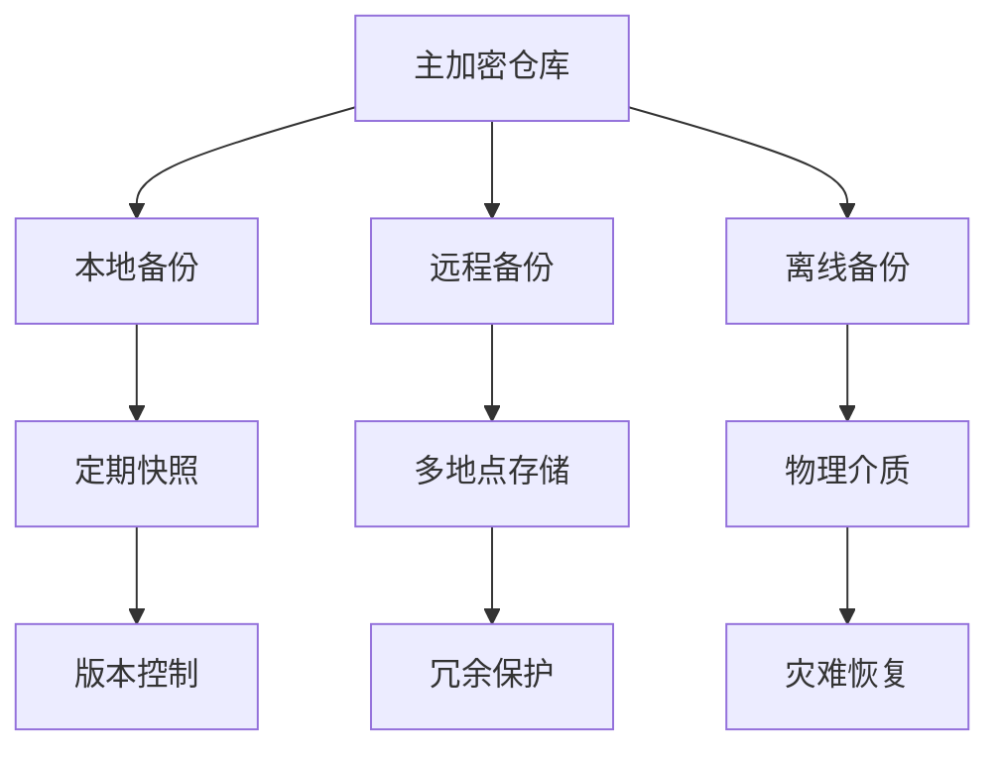
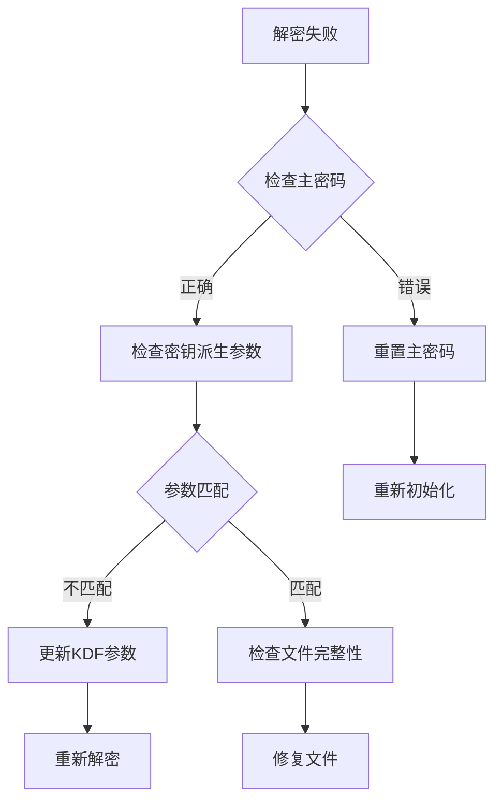

# 同步安全机制

<cite>
**本文档引用的文件**
- [git_sync.rs](file://core/src/git_sync.rs)
- [crypto.rs](file://core/src/crypto.rs)
- [storage.rs](file://core/src/storage.rs)
- [config.rs](file://core/src/config.rs)
- [models.rs](file://core/src/models.rs)
- [errors.rs](file://core/src/errors.rs)
- [sync_daemon.rs](file://cli/src/sync_daemon.rs)
- [README.md](file://README.md)
</cite>

## 目录
1. [概述](#概述)
2. [端到端加密架构](#端到端加密架构)
3. [核心加密组件](#核心加密组件)
4. [Git同步机制](#git同步机制)
5. [身份验证安全模型](#身份验证安全模型)
6. [数据流安全分析](#数据流安全分析)
7. [安全权衡与最佳实践](#安全权衡与最佳实践)
8. [故障排除指南](#故障排除指南)
9. [总结](#总结)

## 概述

SecureFox采用创新的端到端加密同步机制，确保密码数据在传输和存储过程中始终保持机密性。该系统的核心设计理念是"零知识"同步：即使Git服务器被恶意控制或发生数据泄露，攻击者也无法解密任何敏感信息。

### 核心安全原则

1. **本地加密优先**：所有敏感数据在本地使用强加密算法进行加密
2. **传输安全**：通过SSH或HTTPS协议传输加密数据
3. **身份验证分离**：Git凭据与主密码完全独立管理
4. **透明同步**：用户无需担心加密细节即可享受同步功能

## 端到端加密架构

### 加密层次结构



**图表来源**
- [crypto.rs](file://core/src/crypto.rs#L184-L228)
- [storage.rs](file://core/src/storage.rs#L70-L92)

### 数据保护流程



**图表来源**
- [storage.rs](file://core/src/storage.rs#L70-L101)
- [git_sync.rs](file://core/src/git_sync.rs#L212-L218)

**章节来源**
- [crypto.rs](file://core/src/crypto.rs#L184-L228)
- [storage.rs](file://core/src/storage.rs#L70-L101)

## 核心加密组件

### 密钥派生函数(KDF)

SecureFox支持两种主要的密钥派生算法：

#### Argon2id算法
- **内存成本**: 19MB (OWASP推荐最小值)
- **迭代次数**: 2 (OWASP推荐最小值)
- **并行度**: 单线程 (更好的兼容性)
- **安全性**: 防止GPU加速攻击

#### PBKDF2算法
- **迭代次数**: 100,000 (平衡性能与安全性)
- **哈希函数**: SHA-256
- **兼容性**: 广泛支持，启动更快

### 加密算法选择

| 组件 | 算法 | 目的 | 安全特性 |
|------|------|------|----------|
| **密钥派生** | Argon2id 或 PBKDF2-HMAC-SHA256 | 从主密码生成加密密钥 | 抗暴力破解，可调参数 |
| **数据加密** | AES-256-GCM-SIV | 对称加密 | 认证加密，防止篡改 |
| **随机数生成** | OS CSPRNG | 生成加密随机值 | 密码学安全随机性 |

### 加密数据结构



**图表来源**
- [crypto.rs](file://core/src/crypto.rs#L121-L127)
- [crypto.rs](file://core/src/crypto.rs#L39-L64)

**章节来源**
- [crypto.rs](file://core/src/crypto.rs#L129-L228)

## Git同步机制

### GitSync核心架构



**图表来源**
- [git_sync.rs](file://core/src/git_sync.rs#L12-L18)
- [config.rs](file://core/src/config.rs#L19-L31)
- [models.rs](file://core/src/models.rs#L315-L326)

### 同步模式

#### 手动同步模式
- 用户明确控制每次同步操作
- 最高安全性，无自动风险
- 适合高度敏感环境

#### 自动同步模式
- 支持定时拉取远程更新
- 增量推送本地变更
- 可配置同步间隔

### 智能同步算法



**图表来源**
- [git_sync.rs](file://core/src/git_sync.rs#L442-L461)

**章节来源**
- [git_sync.rs](file://core/src/git_sync.rs#L212-L228)
- [models.rs](file://core/src/models.rs#L334-L362)

## 身份验证安全模型

### SSH密钥认证

SecureFox优先使用SSH密钥进行身份验证，这是最安全的方式：

#### SSH密钥发现顺序
1. **Ed25519密钥** (`id_ed25519`, `id_ed25519.pub`)
2. **RSA密钥** (`id_rsa`, `id_rsa.pub`)
3. **ECDSA密钥** (`id_ecdsa`, `id_ecdsa.pub`)
4. **SSH代理** (如果配置)

#### SSH认证流程



**图表来源**
- [git_sync.rs](file://core/src/git_sync.rs#L312-L337)

### HTTPS凭据管理

当使用HTTPS时，SecureFox支持以下凭据方式：

#### 环境变量凭据
- `GIT_USERNAME`: Git用户名
- `GIT_PASSWORD`: Git密码或个人访问令牌

#### 凭据优先级
1. SSH密钥 (最高优先级)
2. SSH代理
3. 环境变量凭据
4. 默认凭据 (最低优先级)

### 凭据隔离机制



**图表来源**
- [git_sync.rs](file://core/src/git_sync.rs#L307-L348)

**章节来源**
- [git_sync.rs](file://core/src/git_sync.rs#L307-L348)

## 数据流安全分析

### 本地加密流程



**图表来源**
- [storage.rs](file://core/src/storage.rs#L70-L92)
- [crypto.rs](file://core/src/crypto.rs#L184-L228)

### Git仓库安全特性

#### 文件级别保护
- **单向加密**：每个vault.sf文件都是独立加密的
- **时间隔离**：不同时间点的数据无法关联
- **完整性校验**：Git SHA-1哈希确保数据完整性

#### 提交历史安全
- **内容隐藏**：加密内容在Git历史中不可读
- **元数据保护**：仅保留文件名和时间戳等基本信息
- **分支隔离**：不同分支的数据相互独立

### 网络传输安全

#### SSH传输
- **端到端加密**：从客户端到Git服务器的完整加密通道
- **主机密钥验证**：防止中间人攻击
- **密钥交换**：安全的密钥协商过程

#### HTTPS传输
- **TLS加密**：标准的HTTPS TLS层保护
- **证书验证**：Git服务器证书验证
- **会话隔离**：每个会话使用独立的加密参数

**章节来源**
- [storage.rs](file://core/src/storage.rs#L70-L101)
- [git_sync.rs](file://core/src/git_sync.rs#L156-L162)

## 安全权衡与最佳实践

### 自托管vs公共托管

#### 自托管Git服务器 (如GitLab, Gitea)
**优势**：
- **完全控制**：用户完全掌控基础设施
- **隐私保护**：数据不经过第三方
- **定制权限**：细粒度的访问控制

**劣势**：
- **维护成本**：需要自行维护服务器
- **备份复杂性**：需要建立完整的备份策略
- **扩展性**：可能面临扩展限制

#### 公共托管服务 (如GitHub, GitLab.com)
**优势**：
- **高可用性**：专业的基础设施保证
- **免费使用**：大多数服务提供免费计划
- **社区支持**：丰富的工具和集成

**劣势**：
- **信任假设**：需要信任服务提供商
- **合规限制**：可能受到法律要求影响
- **成本增长**：私有仓库可能产生费用

### 最佳实践建议

#### SSH密钥配置
```bash
# 生成强SSH密钥
ssh-keygen -t ed25519 -C "securefox@yourdomain.com"

# 设置适当的权限
chmod 700 ~/.ssh
chmod 600 ~/.ssh/id_ed25519
chmod 644 ~/.ssh/id_ed25519.pub
```

#### Git配置优化
```bash
# 设置全局Git配置
git config --global user.name "SecureFox User"
git config --global user.email "securefox@local"
git config --global init.defaultBranch main
```

#### 安全监控建议

| 监控项目 | 检查频率 | 建议措施 |
|----------|----------|----------|
| **提交历史** | 每次同步前 | 验证提交者身份和消息 |
| **远程URL** | 定期检查 | 确认远程仓库地址正确 |
| **密钥状态** | 每月一次 | 检查SSH密钥有效性 |
| **同步状态** | 实时监控 | 关注同步失败或异常 |

#### 备份策略



### 异常情况处理

#### 仓库损坏检测
- **文件完整性检查**：验证vault.sf文件格式
- **加密验证**：尝试解密以确认数据完整性
- **历史一致性**：检查提交历史的连续性

#### 同步冲突解决
- **自动合并**：对于JSON结构的智能合并
- **手动干预**：复杂冲突的手动解决
- **备份恢复**：从最近备份恢复

**章节来源**
- [git_sync.rs](file://core/src/git_sync.rs#L231-L269)
- [storage.rs](file://core/src/storage.rs#L180-L207)

## 故障排除指南

### 常见问题诊断

#### 同步失败问题

| 错误类型 | 可能原因 | 解决方案 |
|----------|----------|----------|
| **认证失败** | SSH密钥过期或权限错误 | 更新密钥或检查权限 |
| **网络超时** | 网络连接不稳定 | 检查网络连接或使用VPN |
| **权限拒绝** | Git仓库权限不足 | 检查仓库访问权限 |
| **密钥不匹配** | SSH密钥与服务器不匹配 | 重新添加公钥到服务器 |

#### 加密相关问题



### 调试工具

#### 状态检查命令
```bash
# 检查同步状态
securefox sync-status

# 验证Git配置
securefox sync-config show

# 测试连接
securefox sync --dry-run
```

#### 日志分析
- **详细日志**：设置环境变量启用调试输出
- **错误追踪**：分析错误堆栈信息
- **性能监控**：监控加密和同步性能

**章节来源**
- [errors.rs](file://core/src/errors.rs#L8-L45)
- [git_sync.rs](file://core/src/git_sync.rs#L442-L461)

## 总结

SecureFox的同步安全机制代表了现代密码管理器设计的重要创新。通过将端到端加密与分布式版本控制系统相结合，它实现了前所未有的安全性和可用性的平衡。

### 核心优势

1. **真正的零知识同步**：即使Git服务器被攻破，数据仍然保持安全
2. **灵活的身份验证**：支持多种认证方式，满足不同安全需求
3. **透明的用户体验**：用户无需理解复杂的加密概念即可使用
4. **强大的安全保证**：采用业界标准的加密算法和最佳实践

### 技术创新

- **本地优先加密**：所有敏感数据在本地处理
- **智能同步算法**：自动检测和处理同步冲突
- **多层次安全**：从应用层到网络层的全方位保护
- **用户控制**：完全由用户掌控加密密钥和同步设置

### 未来发展方向

随着密码管理需求的不断演进，SecureFox的同步安全机制将继续发展，可能的方向包括：

- **量子抗性加密**：为未来的量子计算威胁做好准备
- **去中心化同步**：探索区块链等去中心化技术的应用
- **生物识别集成**：结合生物识别技术提升用户体验
- **跨平台互操作**：与其他密码管理器的互操作性

这种创新的安全模型不仅解决了传统密码管理器的同步安全问题，更为整个行业的安全标准树立了新的标杆。