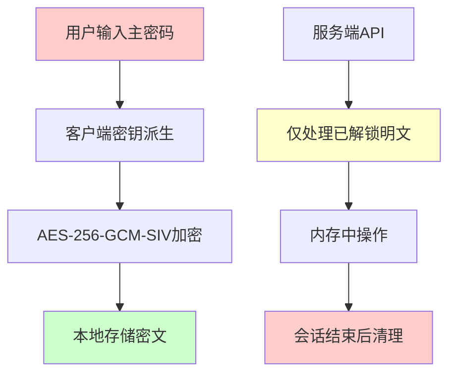
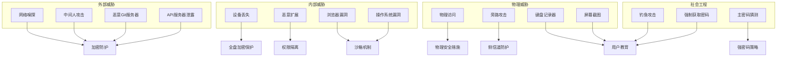
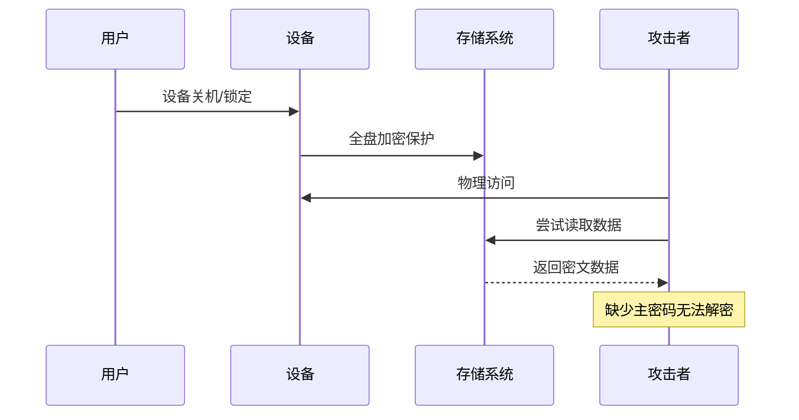
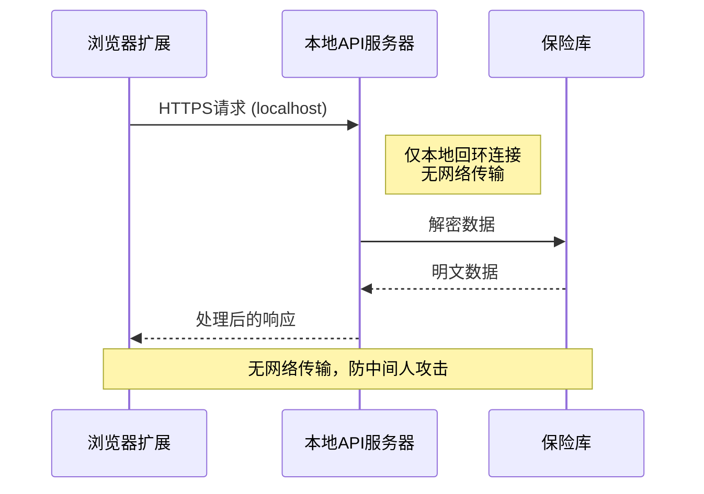
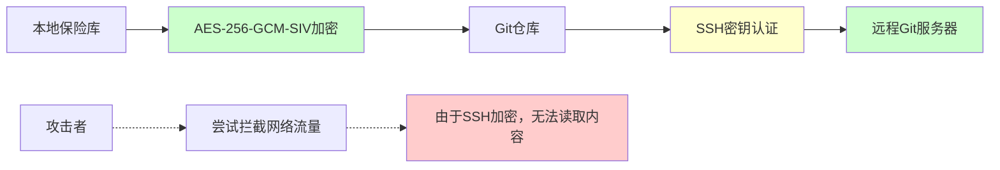
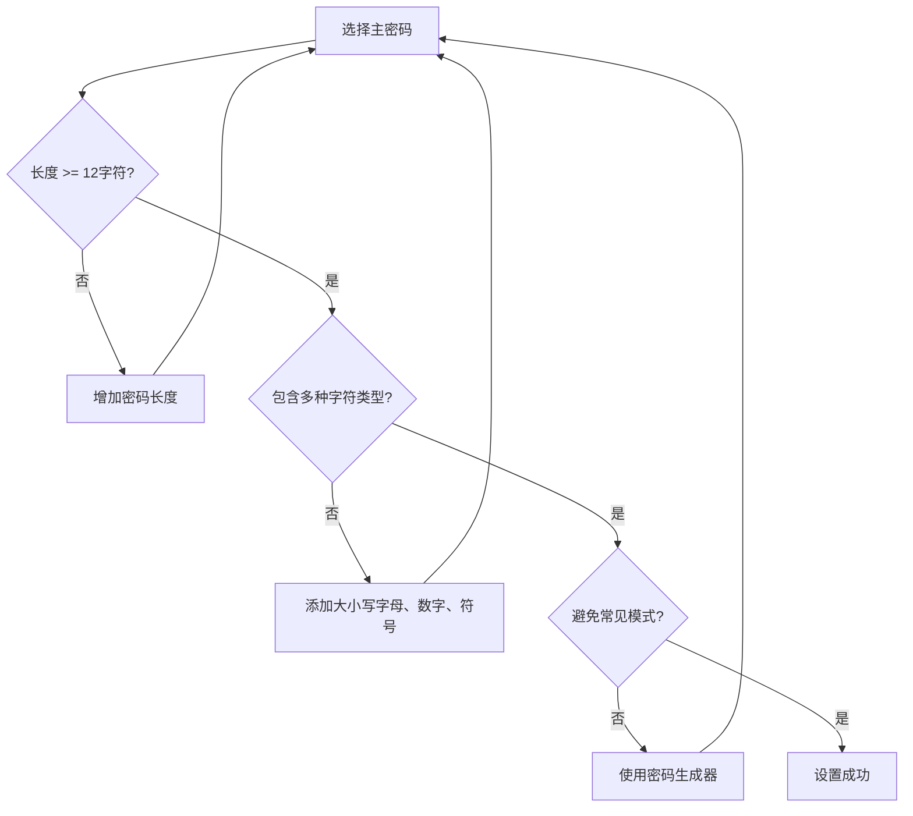

# SecureFox威胁模型

<cite>
**本文档中引用的文件**
- [README.md](file://README.md)
- [core/src/crypto.rs](file://core/src/crypto.rs)
- [core/src/keychain.rs](file://core/src/keychain.rs)
- [core/src/storage.rs](file://core/src/storage.rs)
- [core/src/git_sync.rs](file://core/src/git_sync.rs)
- [api/src/lib.rs](file://api/src/lib.rs)
- [api/src/auth.rs](file://api/src/auth.rs)
- [extension/lib/api/client.ts](file://extension/lib/api/client.ts)
- [core/src/models.rs](file://core/src/models.rs)
</cite>

## 目录
1. [简介](#简介)
2. [零知识架构核心原则](#零知识架构核心原则)
3. [系统威胁模型](#系统威胁模型)
4. [防御机制分析](#防御机制分析)
5. [无法防御的威胁](#无法防御的威胁)
6. [Git同步安全性](#git同步安全性)
7. [安全最佳实践](#安全最佳实践)
8. [总结](#总结)

## 简介

SecureFox是一个基于零知识架构的现代密码管理器，采用本地优先设计，确保用户的敏感数据始终处于加密状态。本文档系统性地分析SecureFox面临的各种安全威胁，并详细阐述其防御能力。

## 零知识架构核心原则

### 主密码保护机制

SecureFox的核心安全原则是零知识架构，这意味着：

**图表来源**
- [core/src/crypto.rs](file://core/src/crypto.rs#L130-L173)
- [core/src/storage.rs](file://core/src/storage.rs#L70-L120)

### 关键安全特性

1. **主密码永不离开用户设备** - 主密码仅在客户端进行密钥派生
2. **解密密钥仅存在于内存中** - 解密后的数据不会持久化到磁盘
3. **服务端API仅处理明文** - 服务端不存储任何加密密钥或明文数据
4. **会话管理** - 基于令牌的认证机制，支持超时自动锁定

**章节来源**
- [core/src/crypto.rs](file://core/src/crypto.rs#L130-L173)
- [api/src/auth.rs](file://api/src/auth.rs#L10-L36)

## 系统威胁模型

### 攻击向量分类

## 防御机制分析

### 1. 设备丢失防护

**全盘加密保护**：SecureFox与操作系统全盘加密功能协同工作，即使设备丢失，数据仍然受到保护。

**图表来源**
- [core/src/storage.rs](file://core/src/storage.rs#L70-L120)

### 2. API服务器泄露防护

**本地回环连接**：SecureFox API服务器默认绑定到本地回环地址，防止外部访问。

| 防护措施 | 实现方式 | 效果 |
|----------|----------|------|
| 本地绑定 | `127.0.0.1` 或 `localhost` | 防止远程访问 |
| 令牌认证 | Bearer Token机制 | 确保合法访问 |
| 会话超时 | 自动锁定机制 | 减少暴露时间 |
| 内存清理 | 解密后立即清零 | 防止内存转储攻击 |

**章节来源**
- [api/src/lib.rs](file://api/src/lib.rs#L26-L101)
- [api/src/auth.rs](file://api/src/auth.rs#L10-L36)

### 3. 中间人攻击防护

**本地通信保证**：所有API通信都在本地网络中进行，无需担心网络传输安全。

**图表来源**
- [extension/lib/api/client.ts](file://extension/lib/api/client.ts#L1-L98)

### 4. 恶意扩展防护

**权限隔离机制**：浏览器扩展通过严格的权限控制和沙箱环境运行。

| 防护层级 | 实现方式 | 保护范围 |
|----------|----------|----------|
| 权限限制 | Manifest v3权限模型 | 最小权限原则 |
| 沙箱执行 | 浏览器沙箱环境 | 隔离恶意代码 |
| 通信验证 | API令牌验证 | 确保合法调用 |
| 内容脚本隔离 | 独立执行上下文 | 防止跨脚本攻击 |

**章节来源**
- [extension/lib/api/client.ts](file://extension/lib/api/client.ts#L14-L60)

## 无法防御的威胁

### 1. 键盘记录器攻击

**威胁描述**：恶意软件记录用户输入的主密码，绕过所有加密保护。

**缓解措施**：
- 使用强主密码（12+字符，包含大小写字母、数字和特殊符号）
- 启用双因素认证（2FA）
- 在可信设备上使用密码管理器
- 考虑使用硬件安全密钥

### 2. 屏幕截图攻击

**威胁描述**：攻击者通过屏幕截图捕获解锁状态下的敏感信息。

**缓解措施**：
- 不要在公共场合使用密码管理器
- 启用操作系统屏幕保护程序
- 使用隐私保护软件
- 定期检查设备上的可疑活动

### 3. 物理访问时的旁路攻击

**威胁描述**：攻击者直接访问解锁状态下的设备内存。

**缓解措施**：
- 设置强设备锁屏密码
- 启用自动锁定功能
- 使用TPM芯片（如果可用）
- 定期重启设备

### 4. 主密码弱口令攻击

**威胁描述**：用户选择容易被暴力破解的主密码。

**缓解措施**：
- 使用密码生成器
- 采用记忆术策略
- 定期更换主密码
- 启用高安全级别的密钥派生函数（Argon2id）

**章节来源**
- [README.md](file://README.md#L295-L300)

## Git同步安全性

### SSH密钥保护

SecureFox支持通过SSH密钥进行Git同步，提供端到端加密保护：

**图表来源**
- [core/src/git_sync.rs](file://core/src/git_sync.rs#L307-L348)

### 同步配置安全

| 安全措施 | 实现方式 | 保护目标 |
|----------|----------|----------|
| SSH密钥认证 | 支持Ed25519/RSA/ECDSA密钥 | 身份验证 |
| 公钥验证 | 服务器公钥指纹检查 | 防止中间人攻击 |
| 本地加密 | Git内容始终加密 | 存储安全 |
| 强制HTTPS | Git协议强制使用SSH | 传输安全 |

### 个人访问令牌保护

对于使用HTTP/HTTPS的Git仓库，SecureFox支持个人访问令牌：

- **令牌存储**：仅在内存中临时存储
- **传输加密**：通过HTTPS协议传输
- **权限最小化**：只授予必要的仓库访问权限

**章节来源**
- [core/src/git_sync.rs](file://core/src/git_sync.rs#L307-L348)

## 安全最佳实践

### 1. 密码策略

### 2. 系统配置

| 配置项 | 推荐设置 | 安全收益 |
|--------|----------|----------|
| 密钥派生算法 | Argon2id | 更强的GPU攻击防护 |
| 解锁超时 | 5-15分钟 | 减少未锁定暴露时间 |
| Git同步 | SSH密钥 | 端到端加密 |
| 系统密钥链 | 启用 | 安全存储主密钥 |
| 自动锁定 | 启用 | 防止遗忘锁定 |

### 3. 运维安全

- **定期备份**：创建加密的保险库备份
- **版本控制**：监控Git历史变更
- **多设备同步**：在多个可信设备间同步
- **安全审计**：定期检查系统安全状态

**章节来源**
- [README.md](file://README.md#L301-L309)

## 总结

SecureFox通过零知识架构提供了强大的安全保护，有效防御了大多数常见的攻击向量：

### 主要防御优势

1. **数据加密**：所有数据在本地进行端到端加密
2. **密钥分离**：主密码与加密密钥完全分离
3. **本地处理**：敏感操作仅在用户设备上执行
4. **多重保护**：结合多种安全机制提供纵深防御

### 需要注意的限制

虽然SecureFox提供了强大的安全保护，但仍存在一些无法完全防御的威胁，需要用户配合采取额外的安全措施：

- 物理访问保护
- 社交工程防护
- 系统完整性维护
- 安全意识培养

通过遵循本文档中的安全最佳实践，用户可以最大化SecureFox的安全效益，同时保持良好的用户体验。