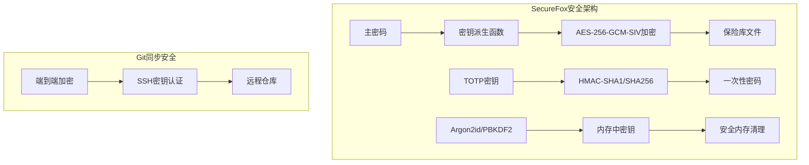
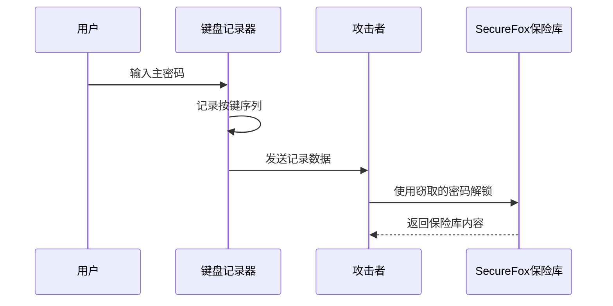
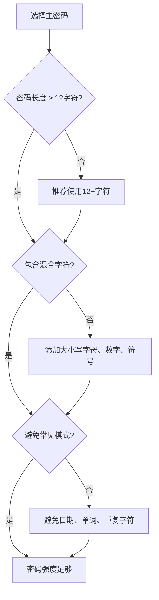
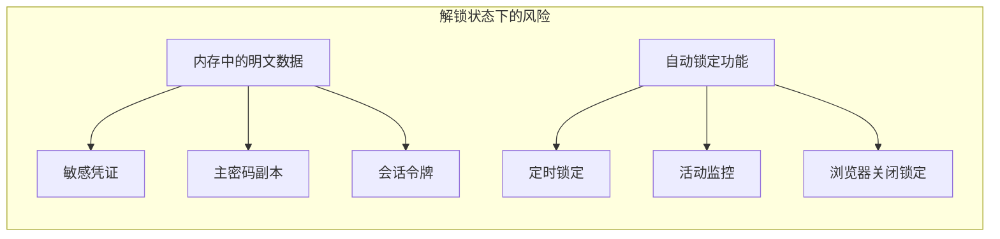
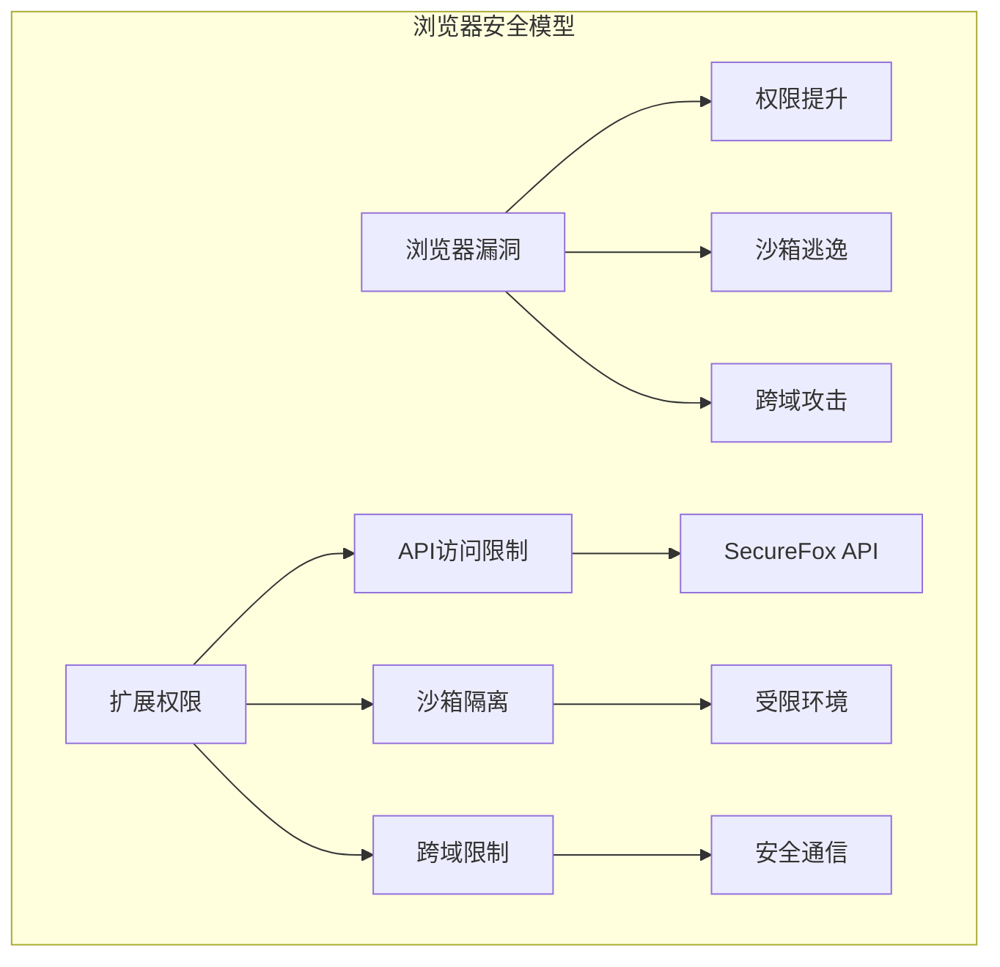
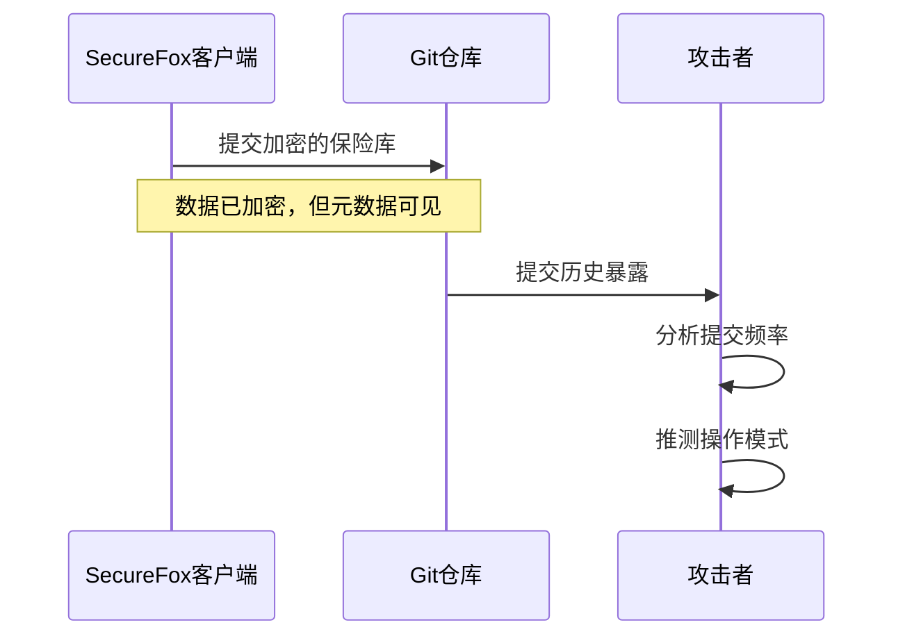

# SecureFox未受保护的威胁

<cite>
**本文档引用的文件**
- [README.md](file://README.md)
- [core/src/crypto.rs](file://core/src/crypto.rs)
- [core/src/storage.rs](file://core/src/storage.rs)
- [core/src/models.rs](file://core/src/models.rs)
- [core/src/config.rs](file://core/src/config.rs)
- [core/src/git_sync.rs](file://core/src/git_sync.rs)
- [core/src/totp.rs](file://core/src/totp.rs)
- [extension/lib/api/auth.ts](file://extension/lib/api/auth.ts)
- [extension/entrypoints/background.ts](file://extension/entrypoints/background.ts)
- [api/src/state.rs](file://api/src/state.rs)
- [extension/components/UnlockForm.tsx](file://extension/components/UnlockForm.tsx)
- [cli/src/commands/unlock.rs](file://cli/src/commands/unlock.rs)
</cite>

## 目录
1. [简介](#简介)
2. [系统安全边界](#系统安全边界)
3. [键盘记录器威胁](#键盘记录器威胁)
4. [弱主密码风险](#弱主密码风险)
5. [物理访问威胁](#物理访问威胁)
6. [浏览器和操作系统漏洞](#浏览器和操作系统漏洞)
7. [Git同步安全风险](#git同步安全风险)
8. [实际场景示例](#实际场景示例)
9. [缓解策略](#缓解策略)
10. [结论](#结论)

## 简介

SecureFox是一个零知识加密的本地优先密码管理器，采用行业标准的加密技术保护用户数据。然而，正如所有密码管理系统一样，SecureFox也有其安全边界和局限性。本文档旨在明确界定这些边界，帮助用户理解系统无法防护的安全威胁，并提供相应的缓解策略。

## 系统安全边界

### SecureFox提供的保护

SecureFox通过以下机制提供强大的安全保障：



**图表来源**
- [core/src/crypto.rs](file://core/src/crypto.rs#L129-L173)
- [core/src/git_sync.rs](file://core/src/git_sync.rs#L307-L348)

**节来源**
- [README.md](file://README.md#L273-L294)
- [core/src/crypto.rs](file://core/src/crypto.rs#L1-L321)

### 无法防护的威胁

根据SecureFox的设计原则，以下威胁是系统无法主动检测或阻止的：

| 威胁类型 | 描述 | 影响范围 | 防护级别 |
|---------|------|----------|----------|
| 键盘记录器 | 记录用户输入以窃取主密码 | 全局 | 无法防护 |
| 主密码泄露 | 弱密码或已知密码完全破坏安全性 | 整个保险库 | 无法防护 |
| 物理访问 | 已解锁设备的直接访问 | 当前会话 | 无法防护 |
| 浏览器漏洞 | 利用扩展权限绕过限制 | 扩展功能 | 依赖浏览器安全 |
| 操作系统漏洞 | 内存转储攻击 | 系统级 | 依赖系统安全 |

**节来源**
- [README.md](file://README.md#L295-L299)

## 键盘记录器威胁

### 键盘记录器的工作原理

键盘记录器是一种恶意软件，能够记录用户的键盘输入，包括在SecureFox中输入的主密码。这种攻击具有以下特点：



**图表来源**
- [extension/components/UnlockForm.tsx](file://extension/components/UnlockForm.tsx#L64-L130)
- [extension/lib/api/auth.ts](file://extension/lib/api/auth.ts#L8-L38)

### 防御措施

1. **使用双因素认证（2FA）**
   - 启用TOTP支持，配合Google Authenticator等应用
   - 即使主密码泄露，攻击者仍需第二因子

2. **使用可信设备**
   - 仅在受信任的设备上安装和使用SecureFox
   - 避免在公共或共享计算机上使用

3. **硬件安全模块（HSM）**
   - 考虑使用支持HSM的密码管理器
   - 将主密码存储在硬件安全模块中

**节来源**
- [core/src/totp.rs](file://core/src/totp.rs#L1-L211)
- [README.md](file://README.md#L296)

## 弱主密码风险

### 密码强度要求

即使使用强加密算法，弱主密码仍然可能导致保险库被破解：



**图表来源**
- [core/src/crypto.rs](file://core/src/crypto.rs#L26-L37)

### 密钥派生函数的安全性

SecureFox支持两种密钥派生函数：

| 函数类型 | 迭代次数 | 内存使用 | 推荐用途 |
|---------|----------|----------|----------|
| Argon2id | 19MB × 2次迭代 | 高 | 最高安全性 |
| PBKDF2-HMAC-SHA256 | 100,000次迭代 | 中等 | 平衡性能与安全 |

**节来源**
- [core/src/crypto.rs](file://core/src/crypto.rs#L26-L37)
- [core/src/crypto.rs](file://core/src/crypto.rs#L104-L118)

## 物理访问威胁

### 已解锁设备的风险

当SecureFox保险库处于解锁状态时，攻击者可以直接访问：



**图表来源**
- [extension/entrypoints/background.ts](file://extension/entrypoints/background.ts#L56-L94)
- [api/src/state.rs](file://api/src/state.rs#L44-L51)

### 自动锁定机制

SecureFox提供了多种自动锁定机制：

| 锁定类型 | 触发条件 | 默认时间 | 配置方式 |
|---------|----------|----------|----------|
| 定时锁定 | 无活动X分钟后 | 15分钟 | 可配置 |
| 浏览器关闭锁定 | 关闭所有浏览器窗口 | 立即 | 特殊设置 |
| 活动重置 | 用户操作时 | 实时 | 自动 |

**节来源**
- [extension/entrypoints/background.ts](file://extension/entrypoints/background.ts#L56-L94)
- [extension/lib/api/auth.ts](file://extension/lib/api/auth.ts#L116-L145)

## 浏览器和操作系统漏洞

### 扩展权限限制

浏览器扩展的安全性依赖于浏览器的权限模型：



**图表来源**
- [extension/entrypoints/background.ts](file://extension/entrypoints/background.ts#L1-L454)

### 系统级漏洞风险

操作系统漏洞可能允许攻击者：

1. **内存转储攻击**：读取运行中的SecureFox进程内存
2. **系统调用劫持**：拦截文件系统访问
3. **网络流量嗅探**：捕获API通信数据

**节来源**
- [README.md](file://README.md#L299)

## Git同步安全风险

### Git同步的安全机制

虽然SecureFox提供Git同步功能，但存在以下安全考虑：



**图表来源**
- [core/src/git_sync.rs](file://core/src/git_sync.rs#L80-L122)

### 同步安全最佳实践

1. **使用SSH密钥认证**
   - 配置专用SSH密钥用于同步
   - 避免使用密码认证

2. **私有仓库**
   - 仅使用私有Git仓库
   - 避免公开仓库同步

3. **定期审查**
   - 定期检查Git历史
   - 检查是否有异常提交

**节来源**
- [core/src/git_sync.rs](file://core/src/git_sync.rs#L307-L348)

## 实际场景示例

### 场景一：办公室环境攻击

**攻击链**：
1. 攻击者在同事的办公桌上安装键盘记录器
2. 同事每天使用相同的主密码解锁SecureFox
3. 键盘记录器捕获主密码
4. 攻击者使用窃取的密码访问保险库

**影响**：整个保险库中的所有凭证被完全访问

### 场景二：家庭网络攻击

**攻击链**：
1. 攻击者通过路由器漏洞获得网络访问
2. 监听网络流量，发现SecureFox API通信
3. 利用浏览器漏洞获取扩展权限
4. 读取内存中的明文凭证

**影响**：当前会话中的所有敏感信息被泄露

### 场景三：物理盗窃

**攻击链**：
1. 攻击者偷走用户的笔记本电脑
2. 使用系统恢复工具绕过BIOS密码
3. 直接访问已解锁的SecureFox保险库
4. 复制所有凭证数据

**影响**：所有未加密的凭证数据被永久访问

## 缓解策略

### 密码安全策略

1. **强密码要求**
   ```bash
   # 生成强密码
   securefox generate --length 32 --symbols --numbers --copy
   
   # 使用密码管理器生成
   # 推荐密码长度：32+字符
   # 包含：大写字母、小写字母、数字、特殊符号
   ```

2. **密钥派生函数选择**
   ```toml
   # 配置文件 ~/.securefox/config.toml
   [vault]
   kdf = "argon2"  # 推荐使用Argon2id
   ```

**节来源**
- [core/src/crypto.rs](file://core/src/crypto.rs#L104-L118)

### 设备安全策略

1. **多设备验证**
   - 在多个可信设备上安装SecureFox
   - 使用不同的主密码（如果可能）

2. **硬件安全**
   - 使用支持TPM的现代计算机
   - 启用全磁盘加密

3. **物理安全**
   - 不要在公共场所使用SecureFox
   - 设置快速锁定时间（5-10分钟）

### 网络安全策略

1. **Git同步配置**
   ```bash
   # 使用SSH密钥而非HTTPS
   securefox sync-config --remote git@github.com:username/vault.git
   
   # 启用自动推送
   securefox sync-enable --auto-push
   ```

2. **网络监控**
   - 监控异常的网络连接
   - 使用VPN保护网络通信

**节来源**
- [core/src/git_sync.rs](file://core/src/git_sync.rs#L60-L70)

### 应急响应计划

1. **密码重置流程**
   ```bash
   # 1. 立即锁定保险库
   securefox lock
   
   # 2. 生成新主密码
   securefox generate --length 32 --symbols --numbers
   
   # 3. 初始化新保险库
   securefox init --vault ~/new-vault
   
   # 4. 导入重要凭证
   securefox import backup.json --format bitwarden
   ```

2. **备份恢复**
   - 保持加密备份
   - 定期测试恢复流程
   - 存储在安全位置

**节来源**
- [core/src/storage.rs](file://core/src/storage.rs#L180-L208)

## 结论

SecureFox是一个高度安全的密码管理系统，但在面对某些类型的攻击时存在局限性。用户必须理解这些安全边界，并采取适当的防护措施：

### 关键要点总结

1. **主密码是唯一防线**：选择强密码并定期更换
2. **多因素认证至关重要**：启用TOTP等2FA功能
3. **设备安全不可忽视**：确保使用可信设备
4. **网络环境需要保护**：使用安全的网络连接
5. **应急准备必不可少**：制定密码重置和数据恢复计划

### 持续改进建议

1. **定期安全评估**：每年至少进行一次安全审计
2. **关注安全更新**：及时更新SecureFox版本
3. **监控异常行为**：留意任何可疑的系统行为
4. **教育意识提升**：提高个人和团队的安全意识

通过理解和实施这些策略，用户可以最大化SecureFox的安全性，同时认识到其固有的局限性，并采取适当的防护措施。