# SecureFox安全最佳实践指南

<cite>
**本文档引用的文件**
- [README.md](file://README.md)
- [core/src/crypto.rs](file://core/src/crypto.rs)
- [core/src/git_sync.rs](file://core/src/git_sync.rs)
- [core/src/keychain.rs](file://core/src/keychain.rs)
- [core/src/storage.rs](file://core/src/storage.rs)
- [api/src/auth.rs](file://api/src/auth.rs)
- [cli/src/main.rs](file://cli/src/main.rs)
- [Cargo.toml](file://Cargo.toml)
</cite>

## 目录
1. [简介](#简介)
2. [用户安全最佳实践](#用户安全最佳实践)
3. [开发者安全实践](#开发者安全实践)
4. [系统架构安全设计](#系统架构安全设计)
5. [安全编码实践](#安全编码实践)
6. [依赖管理与安全审计](#依赖管理与安全审计)
7. [安全事件响应](#安全事件响应)
8. [总结](#总结)

## 简介

SecureFox是一个零知识本地优先密码管理器，采用行业标准加密技术保护用户数据。本指南旨在为用户和开发者提供全面的安全最佳实践，确保密码管理器的安全性和可靠性。

## 用户安全最佳实践

### 主密码安全

#### 选择高强度主密码
主密码是保护所有其他密码的第一道防线，必须满足以下要求：

- **长度要求**：至少12个字符，推荐16-32个字符
- **复杂性要求**：包含大写字母、小写字母、数字和特殊符号
- **唯一性原则**：不要在任何其他服务中使用相同的主密码

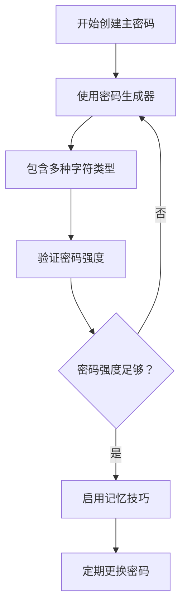

**图表来源**
- [cli/src/main.rs](file://cli/src/main.rs#L139-L156)

#### 使用密码生成器
SecureFox内置了强大的密码生成功能：

```bash
# 生成强密码
securefox generate --length 32 --symbols --numbers --copy
```

### Git同步安全配置

#### 推荐使用SSH密钥认证
为了确保Git同步的安全性，强烈建议使用SSH密钥而非密码认证：

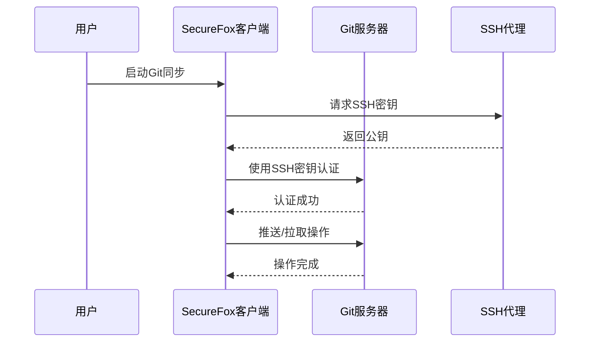

**图表来源**
- [core/src/git_sync.rs](file://core/src/git_sync.rs#L307-L350)

#### SSH密钥配置步骤
1. **生成SSH密钥对**：
   ```bash
   ssh-keygen -t ed25519 -C "your_email@example.com"
   ```
   
2. **添加公钥到Git服务器**：
   - GitHub/GitLab：在账户设置中添加公钥
   - 自托管服务器：配置authorized_keys文件

3. **设置SSH代理**：
   ```bash
   eval "$(ssh-agent -s)"
   ssh-add ~/.ssh/id_ed25519
   ```

#### 配置Git远程仓库
```bash
# 配置SSH远程仓库
securefox sync config git@github.com:username/securefox-vault.git

# 启用自动同步
securefox sync enable --mode auto --interval 300
```

### 系统安全配置

#### 自动锁定机制
启用自动锁定功能，在一段时间不活动后自动锁定密码库：

```bash
# 设置自动锁定时间（分钟）
securefox service start --timeout 1800  # 30分钟
```

#### 系统密钥链集成
SecureFox支持将主密钥存储在系统密钥链中：

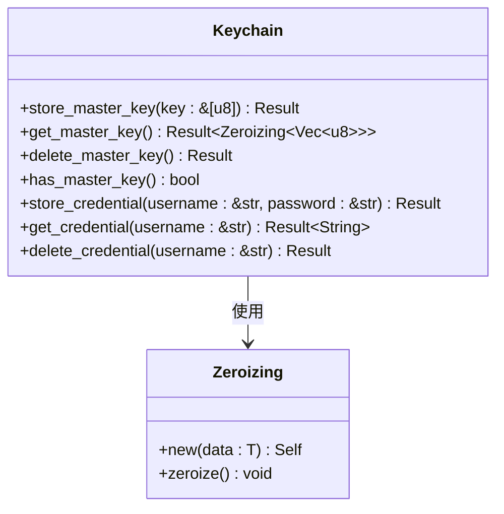

**图表来源**
- [core/src/keychain.rs](file://core/src/keychain.rs#L12-L118)

### 安全意识

#### 警惕钓鱼攻击
- **验证URL**：确保访问的是官方SecureFox网站
- **检查证书**：确认HTTPS证书的有效性
- **识别可疑邮件**：不要点击不明链接或下载附件

#### 备份策略
- **定期备份**：使用加密的备份副本
- **多地存放**：将备份存储在不同位置
- **验证恢复**：定期测试备份的可恢复性

**章节来源**
- [core/src/keychain.rs](file://core/src/keychain.rs#L32-L75)
- [core/src/storage.rs](file://core/src/storage.rs#L180-L208)

## 开发者安全实践

### 代码安全开发

#### 密码学实现安全
SecureFox采用业界标准的加密算法：

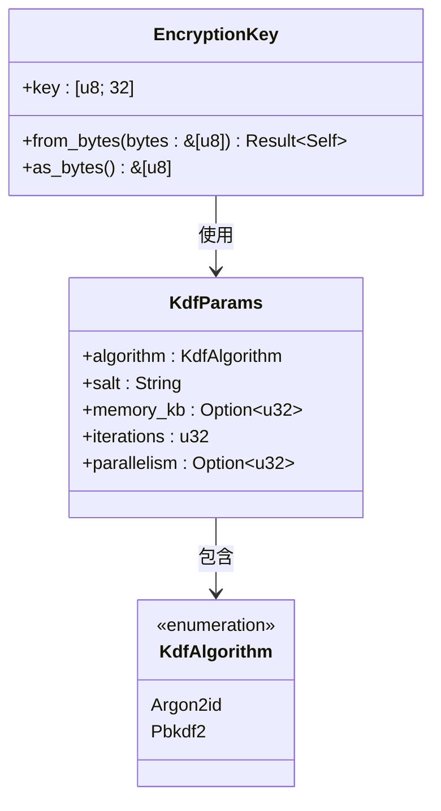

**图表来源**
- [core/src/crypto.rs](file://core/src/crypto.rs#L39-L85)

#### 内存安全处理
使用`zeroize`库防止敏感数据在内存中残留：

```rust
// 加密密钥包装器，自动清理内存
#[derive(Clone, Zeroize, ZeroizeOnDrop)]
pub struct EncryptionKey {
    key: [u8; KEY_SIZE],
}

// 系统密钥链中的敏感数据
pub fn get_master_key(&self) -> Result<Zeroizing<Vec<u8>>> {
    // 返回自动清理的敏感数据
    Ok(Zeroizing::new(decoded))
}
```

### 日志安全

#### 敏感信息保护
避免在日志中记录敏感信息：

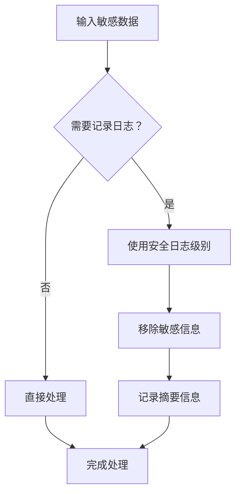

#### 日志过滤示例
- 不要记录：主密码、加密密钥、明文密码
- 可以记录：操作结果、错误代码、性能指标

### 输入验证

#### 参数验证
对所有外部输入进行严格验证：

```rust
// 示例：参数验证模式
pub fn validate_input(input: &str) -> Result<()> {
    // 长度检查
    if input.len() < MIN_LENGTH || input.len() > MAX_LENGTH {
        return Err(Error::InvalidInput("Length validation failed".to_string()));
    }
    
    // 字符集检查
    if !input.chars().all(|c| VALID_CHARS.contains(&c)) {
        return Err(Error::InvalidInput("Character validation failed".to_string()));
    }
    
    Ok(())
}
```

**章节来源**
- [core/src/crypto.rs](file://core/src/crypto.rs#L39-L43)
- [core/src/keychain.rs](file://core/src/keychain.rs#L48-L62)

## 系统架构安全设计

### 零知识架构

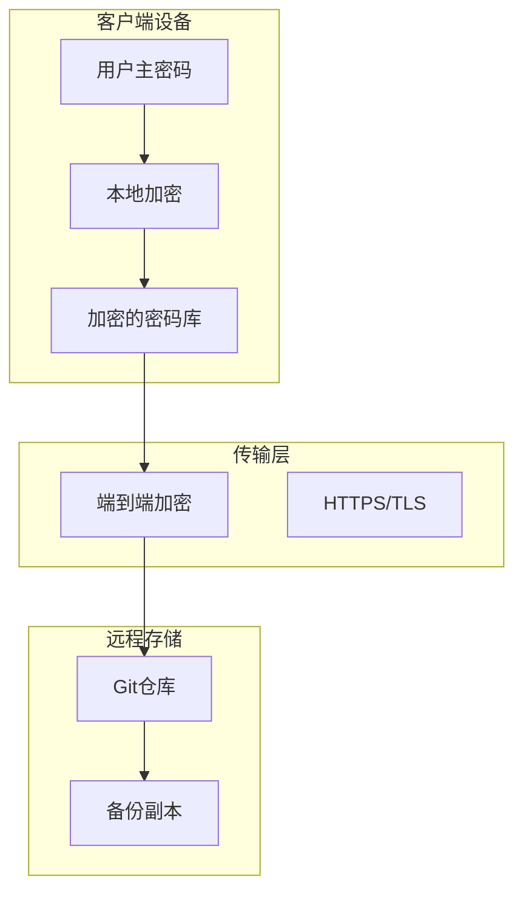

**图表来源**
- [README.md](file://README.md#L21-L26)

### 数据保护层次

#### 存储加密
- **AES-256-GCM-SIV**：用于数据加密
- **Argon2id/PBKDF2**：用于密钥派生
- **随机数生成**：使用操作系统CSPRNG

#### 传输安全
- **Git协议**：支持SSH和HTTPS
- **证书验证**：确保通信完整性
- **中间人防护**：验证服务器身份

### 访问控制

#### API认证机制
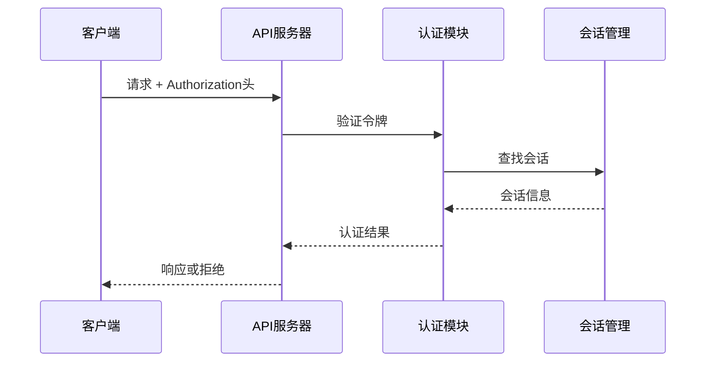

**图表来源**
- [api/src/auth.rs](file://api/src/auth.rs#L10-L36)

**章节来源**
- [core/src/crypto.rs](file://core/src/crypto.rs#L1-L321)
- [api/src/auth.rs](file://api/src/auth.rs#L1-L37)

## 安全编码实践

### 密码学安全

#### 强随机数生成
使用操作系统提供的加密安全随机数生成器：

```rust
use aes_gcm_siv::aead::{Aead, AeadCore, KeyInit, OsRng};
use rand::RngCore;

// 生成加密密钥
let mut key = [0u8; KEY_SIZE];
OsRng.fill_bytes(&mut key);

// 生成随机非ces
let nonce = Aes256GcmSiv::generate_nonce(&mut OsRng);
```

#### 密钥派生参数
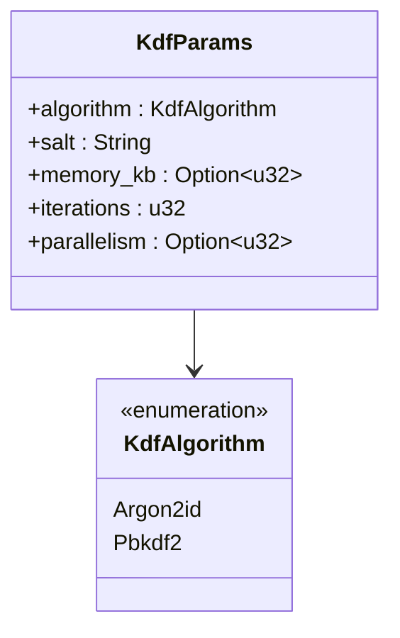

**图表来源**
- [core/src/crypto.rs](file://core/src/crypto.rs#L66-L85)

### 错误处理安全

#### 敏感信息泄露防护
避免在错误消息中暴露敏感信息：

```rust
// 安全的错误处理模式
pub fn decrypt_with_password(encrypted: &EncryptedData, password: &str) -> Result<Vec<u8>> {
    let key = derive_key(password, &encrypted.kdf_params)?;
    decrypt(encrypted, &key)
}

// 错误处理不会泄露密钥派生信息
```

### 内存安全

#### 自动内存清理
使用`zeroize`库确保敏感数据被彻底清除：

```rust
// 密钥派生后的自动清理
let key = derive_key(password, &params)?;
// 使用完毕后自动清理内存
```

**章节来源**
- [core/src/crypto.rs](file://core/src/crypto.rs#L176-L181)
- [core/src/crypto.rs](file://core/src/crypto.rs#L265-L271)

## 依赖管理与安全审计

### 依赖安全检查

#### 使用cargo-audit
定期运行依赖安全审计：

```bash
# 检查已知漏洞
cargo audit

# 更新依赖
cargo update

# 修复发现的问题
cargo fix --allow-dirty
```

#### 依赖清单管理
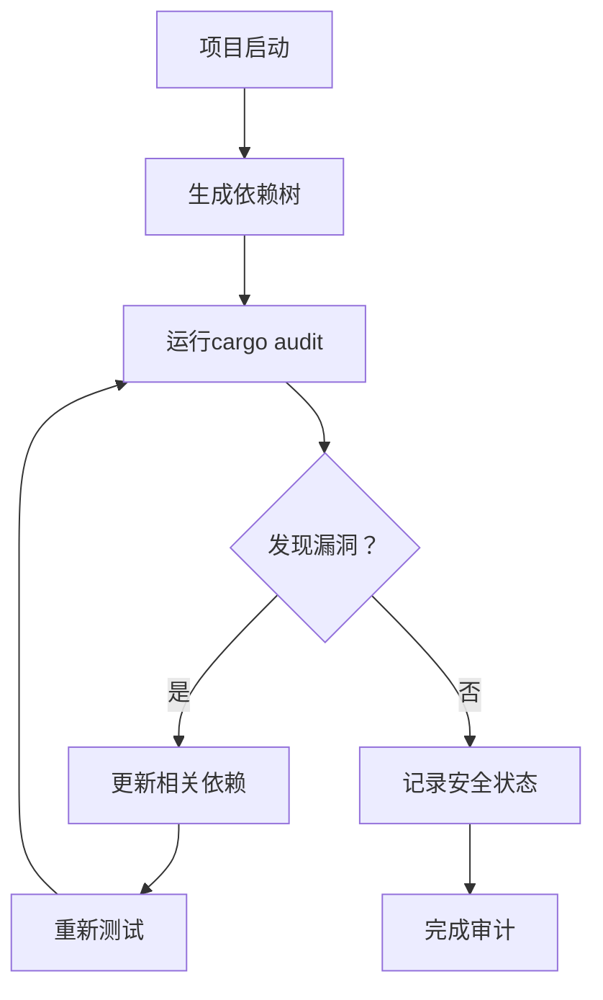

### 安全更新策略

#### 版本管理
- **定期更新**：及时更新依赖包
- **测试兼容性**：确保新版本兼容性
- **渐进式升级**：逐步替换旧版本

#### 关键依赖安全
```toml
# 关键安全依赖
[dependencies]
# 加密库
aes-gcm-siv = "0.11"
argon2 = "0.5"
pbkdf2 = "0.12"

# 系统集成
keyring = "1.2"
dirs = "5.0"

# 安全工具
zeroize = "1.6"
```

**章节来源**
- [Cargo.toml](file://Cargo.toml#L12-L22)

## 安全事件响应

### 主密码泄露应对

#### 应急响应流程

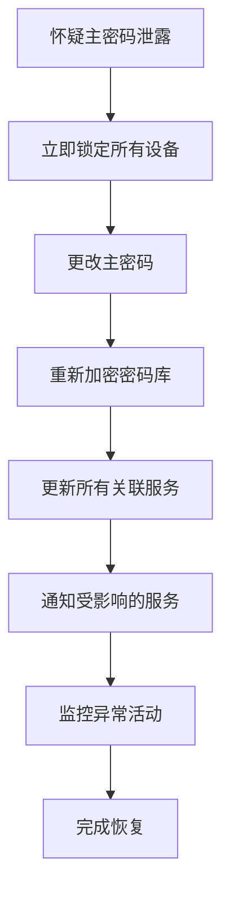

#### 具体操作步骤

1. **立即行动**
   ```bash
   # 锁定当前会话
   securefox lock
   
   # 如果无法访问，删除缓存数据
   rm -rf ~/.securefox/cache/*
   ```

2. **密码重置**
   ```bash
   # 生成新的强密码
   securefox generate --length 32 --symbols --numbers --copy
   
   # 初始化新密码库
   securefox init --kdf argon2
   ```

3. **数据迁移**
   ```bash
   # 导出现有数据
   securefox export backup.json --format bitwarden
   
   # 导入到新密码库
   securefox import backup.json --format bitwarden
   ```

### Git同步安全

#### 远程仓库安全检查
```bash
# 检查Git历史
securefox sync status

# 验证远程仓库
securefox sync config --url git@github.com:username/securefox-vault.git
```

#### 恢复策略
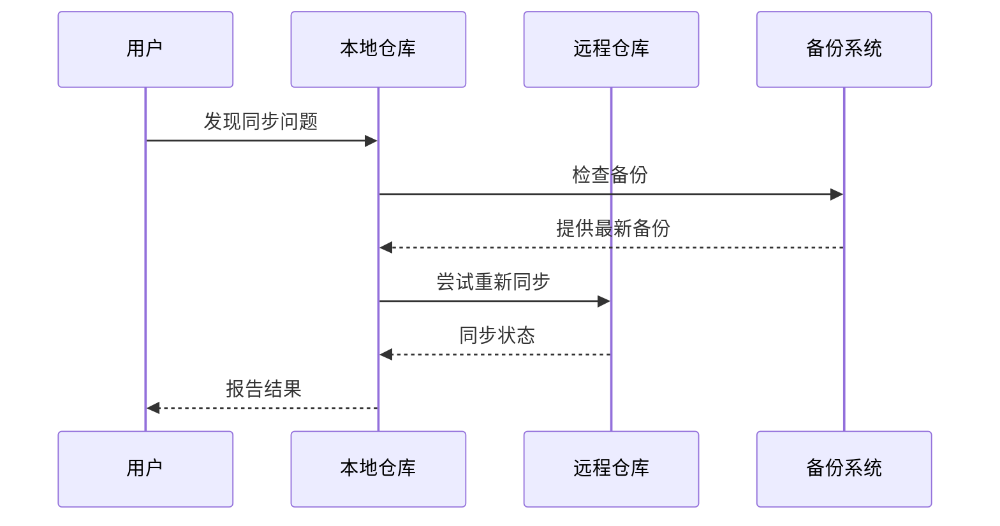

### 监控与告警

#### 异常检测
- **登录异常**：检测来自新设备的登录尝试
- **同步异常**：监控Git同步频率和内容
- **访问模式**：分析用户行为模式

#### 日志分析
```bash
# 检查系统日志
journalctl -u securefox --since "1 hour ago"

# 分析访问模式
grep "authentication" /var/log/syslog | tail -10
```

**章节来源**
- [core/src/git_sync.rs](file://core/src/git_sync.rs#L442-L462)
- [core/src/storage.rs](file://core/src/storage.rs#L180-L208)

## 总结

SecureFox的安全最佳实践涵盖了从用户层面到开发者层面的全方位安全考虑。通过遵循这些指导原则，可以显著提高密码管理器的安全性：

### 用户层面要点
- 使用强主密码并定期更换
- 启用SSH密钥认证进行Git同步
- 启用自动锁定和系统密钥链集成
- 保持系统和应用程序更新
- 建立完善的备份策略

### 开发者层面要点
- 遵循安全编码规范
- 使用经过验证的加密库
- 实施严格的输入验证
- 定期进行安全审计
- 建立应急响应机制

### 持续改进
- 定期审查安全策略
- 关注最新的安全威胁
- 参与社区安全讨论
- 贡献安全改进建议

通过持续的安全实践和改进，SecureFox能够为用户提供最高等级的数据保护，确保用户的密码和敏感信息得到充分的安全保障。