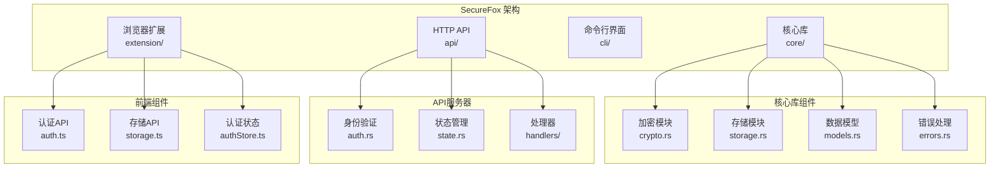
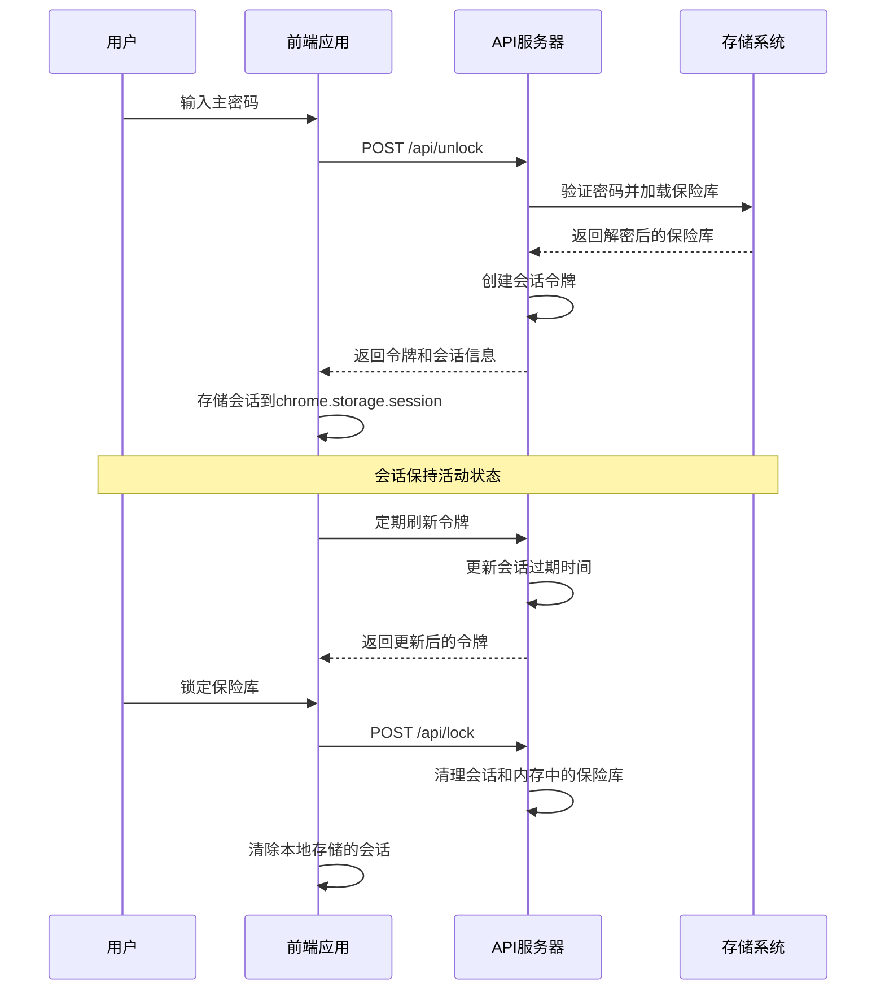
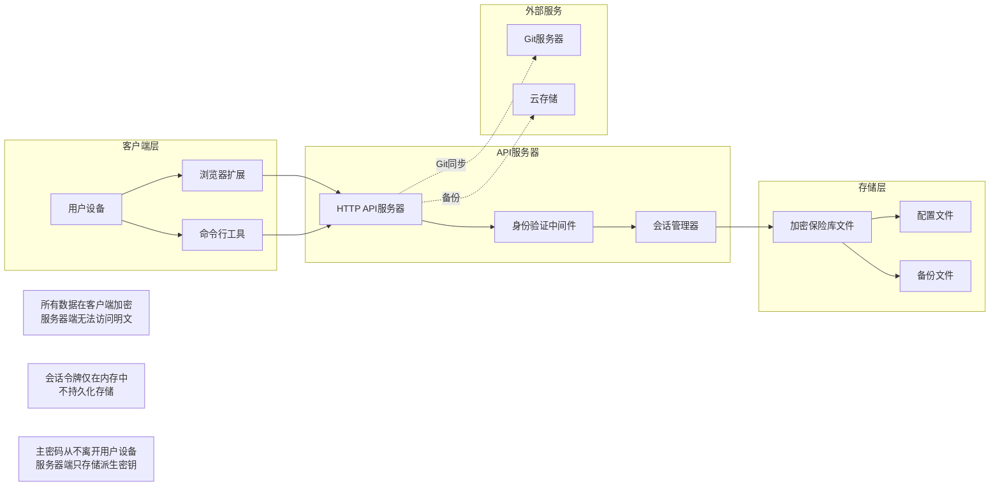
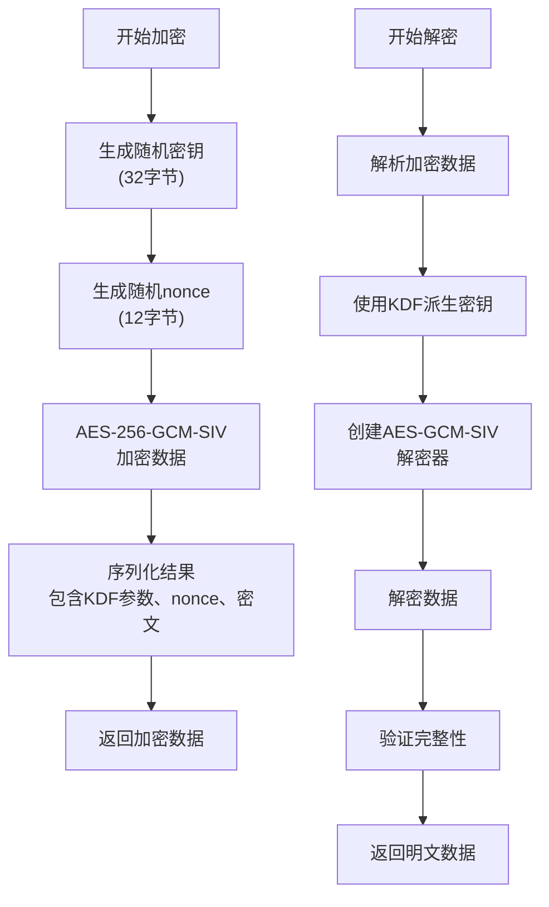
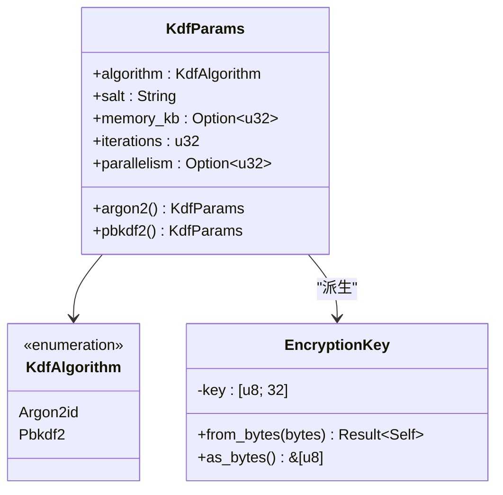
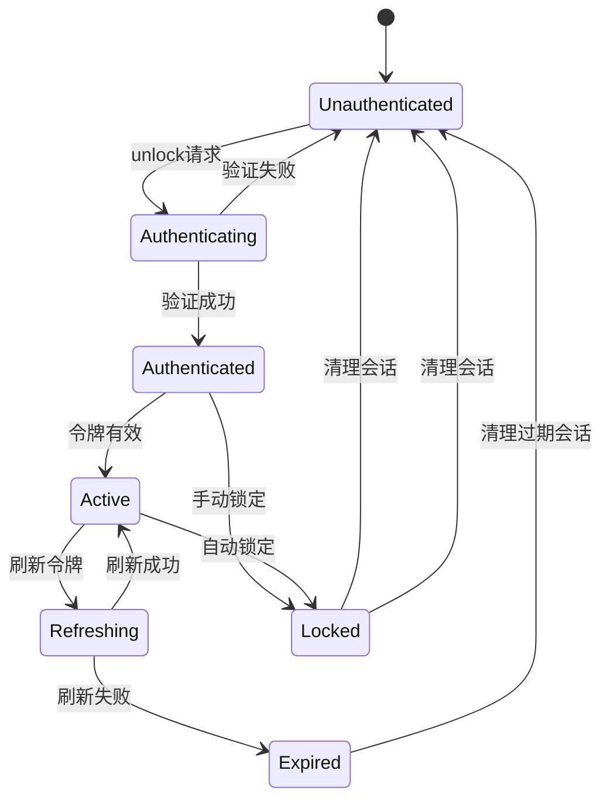
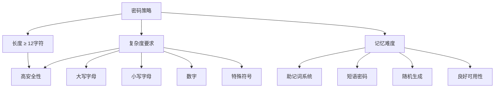
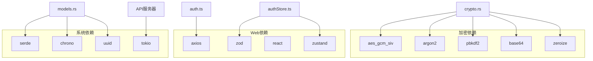
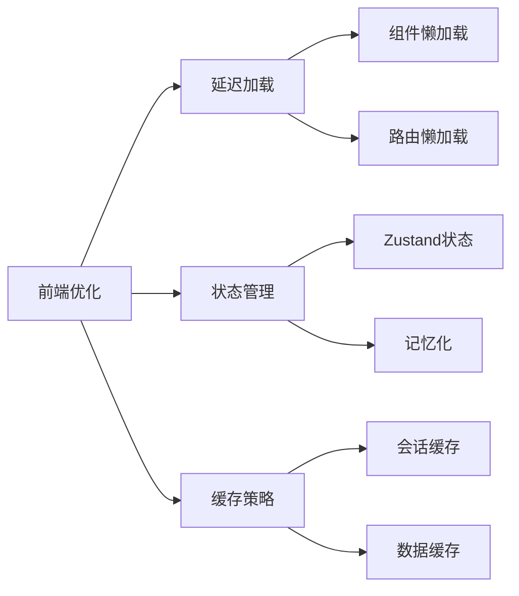
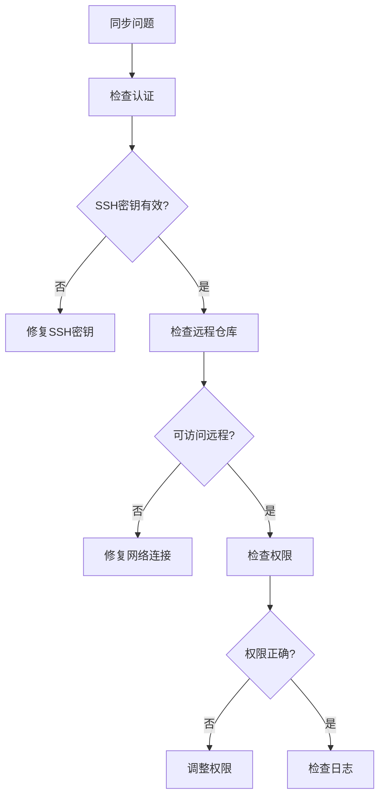

# 安全架构

<cite>
**本文档中引用的文件**
- [crypto.rs](file://core/src/crypto.rs)
- [auth.rs](file://api/src/auth.rs)
- [storage.ts](file://extension/lib/storage.ts)
- [auth.ts](file://extension/lib/api/auth.ts)
- [authStore.ts](file://extension/store/authStore.ts)
- [models.rs](file://core/src/models.rs)
- [state.rs](file://api/src/state.rs)
- [storage.rs](file://core/src/storage.rs)
- [constants.ts](file://extension/utils/constants.ts)
- [index.ts](file://extension/types/index.ts)
- [errors.rs](file://core/src/errors.rs)
- [models.rs](file://api/src/models.rs)
</cite>

## 目录
1. [简介](#简介)
2. [项目结构](#项目结构)
3. [核心组件](#核心组件)
4. [架构概览](#架构概览)
5. [详细组件分析](#详细组件分析)
6. [依赖关系分析](#依赖关系分析)
7. [性能考虑](#性能考虑)
8. [故障排除指南](#故障排除指南)
9. [结论](#结论)

## 简介

SecureFox是一个采用零知识加密原则构建的密码管理器，确保用户的主密码和解密密钥永远不会离开用户设备。该系统通过多层安全机制保护敏感数据，包括强大的加密算法、安全的身份验证流程和全面的威胁模型分析。

## 项目结构

SecureFox采用模块化架构，主要分为四个核心部分：

**图表来源**
- [crypto.rs](file://core/src/crypto.rs#L1-L50)
- [storage.rs](file://core/src/storage.rs#L1-L50)
- [auth.rs](file://api/src/auth.rs#L1-L37)
- [auth.ts](file://extension/lib/api/auth.ts#L1-L50)

**章节来源**
- [crypto.rs](file://core/src/crypto.rs#L1-L321)
- [storage.rs](file://core/src/storage.rs#L1-L318)
- [models.rs](file://core/src/models.rs#L1-L416)

## 核心组件

### 加密引擎

SecureFox的核心安全特性基于以下加密组件：

| 组件 | 算法 | 参数配置 | 用途 |
|------|------|----------|------|
| **密钥派生函数** | Argon2id 或 PBKDF2-HMAC-SHA256 | 内存: 19MB, 迭代: 2, 并行度: 1 | 从主密码派生加密密钥 |
| **对称加密** | AES-256-GCM-SIV | 256位密钥, 12字节nonce | 使用认证加密保护保险库数据 |
| **随机数生成** | OS CSPRNG | 系统级安全随机数 | 生成加密密钥和nonce |
| **哈希函数** | SHA-256 | 用于PBKDF2 | 密钥派生过程中的哈希计算 |

### 身份验证系统

系统实现了基于会话令牌的身份验证机制：

**图表来源**
- [auth.ts](file://extension/lib/api/auth.ts#L8-L40)
- [authStore.ts](file://extension/store/authStore.ts#L31-L70)
- [state.rs](file://api/src/state.rs#L25-L42)

**章节来源**
- [crypto.rs](file://core/src/crypto.rs#L26-L37)
- [auth.ts](file://extension/lib/api/auth.ts#L1-L145)
- [state.rs](file://api/src/state.rs#L1-L113)

## 架构概览

SecureFox的安全架构遵循零知识原则，确保服务器端无法访问用户的明文数据：

**图表来源**
- [auth.rs](file://api/src/auth.rs#L10-L36)
- [state.rs](file://api/src/state.rs#L8-L22)
- [storage.rs](file://core/src/storage.rs#L30-L50)

## 详细组件分析

### 零知识加密实现

#### AES-256-GCM-SIV 加密

SecureFox使用AES-256-GCM-SIV作为主要的对称加密算法，提供以下安全特性：

**图表来源**
- [crypto.rs](file://core/src/crypto.rs#L183-L228)
- [crypto.rs](file://core/src/crypto.rs#L231-L256)

#### Argon2id 密钥派生

系统支持两种密钥派生函数，Argon2id提供抗ASIC攻击的内存密集型特性：

**图表来源**
- [crypto.rs](file://core/src/crypto.rs#L66-L119)
- [crypto.rs](file://core/src/crypto.rs#L39-L64)

**章节来源**
- [crypto.rs](file://core/src/crypto.rs#L129-L271)

### API 认证流程

#### 会话令牌管理

API服务器实现了严格的会话管理机制：

**图表来源**
- [auth.rs](file://api/src/auth.rs#L10-L36)
- [state.rs](file://api/src/state.rs#L53-L67)

#### 前端安全存储

浏览器扩展使用Chrome的`chrome.storage.session` API安全存储会话信息：

| 存储特性 | 实现方式 | 安全优势 |
|----------|----------|----------|
| **临时存储** | `chrome.storage.session` | 关闭浏览器后自动清除 |
| **内存保护** | 内存中的会话对象 | 不持久化到磁盘 |
| **自动清理** | 会话过期自动移除 | 防止长期未使用的会话 |
| **跨标签页同步** | 共享存储空间 | 确保所有标签页使用同一会话 |

**章节来源**
- [auth.ts](file://extension/lib/api/auth.ts#L18-L30)
- [storage.ts](file://extension/lib/storage.ts#L1-L84)

### 威胁模型分析

#### 可防御的攻击类型

SecureFox能够有效防御以下攻击：

| 攻击类型 | 防御机制 | 实现细节 |
|----------|----------|----------|
| **数据泄露** | 静态加密 | 所有数据在存储前加密 |
| **网络嗅探** | E2E加密 | API通信使用HTTPS，数据加密传输 |
| **恶意Git服务器** | E2E加密 | 同步数据在客户端加密 |
| **暴力攻击** | Argon2id KDF | 内存密集型，抗ASIC攻击 |
| **内存转储** | 安全内存擦除 | 使用zeroize库自动清零敏感数据 |

#### 无法防御的攻击类型

某些攻击场景无法完全防护：

| 攻击类型 | 原因 | 建议缓解措施 |
|----------|------|--------------|
| **键盘记录器** | 无法阻止输入捕获 | 使用双因素认证，限制设备信任 |
| **主密码泄露** | 无法控制用户密码选择 | 强制使用强密码策略 |
| **物理访问** | 无法防止设备物理访问 | 启用屏幕锁定，使用TPM |
| **浏览器漏洞** | 无法控制浏览器安全性 | 保持浏览器和扩展更新 |

**章节来源**
- [README.zh-CN.md](file://README.zh-CN.md#L286-L300)

### 安全最佳实践

#### 密码策略建议

为了最大化安全性，建议采用以下密码策略：

#### Git同步安全配置

使用SSH密钥进行Git同步提供最高级别的安全性：

| 配置项 | 推荐设置 | 安全优势 |
|--------|----------|----------|
| **认证方式** | SSH密钥 | 无需密码，抗暴力破解 |
| **远程仓库** | 私有仓库 | 防止未经授权的访问 |
| **密钥轮换** | 定期更新 | 降低密钥泄露风险 |
| **权限控制** | 最小权限原则 | 限制可访问范围 |

**章节来源**
- [README.zh-CN.md](file://README.zh-CN.md#L301-L309)

## 依赖关系分析

### 核心依赖图

**图表来源**
- [crypto.rs](file://core/src/crypto.rs#L3-L16)
- [auth.ts](file://extension/lib/api/auth.ts#L1-L2)
- [models.rs](file://core/src/models.rs#L3-L6)

**章节来源**
- [crypto.rs](file://core/src/crypto.rs#L1-L16)
- [auth.ts](file://extension/lib/api/auth.ts#L1-L2)

## 性能考虑

### 加密性能优化

SecureFox在安全性和性能之间进行了精心平衡：

| 优化策略 | 实现方式 | 性能影响 |
|----------|----------|----------|
| **默认PBKDF2** | 100,000次迭代 | 良好的用户体验 |
| **Argon2id可选** | 2次迭代，19MB内存 | 更高安全性 |
| **内存清理** | zeroize库自动清零 | 防止残留数据 |
| **会话缓存** | 内存中缓存解密后的保险库 | 减少重复解密开销 |

### 前端性能优化

浏览器扩展采用了多种前端性能优化技术：

**图表来源**
- [authStore.ts](file://extension/store/authStore.ts#L145-L157)
- [constants.ts](file://extension/utils/constants.ts#L26-L28)

## 故障排除指南

### 常见安全问题

#### 解锁失败问题

当遇到解锁失败时，可能的原因和解决方案：

| 问题类型 | 可能原因 | 解决方案 |
|----------|----------|----------|
| **密码错误** | 主密码输入错误 | 检查密码拼写，使用密码生成器 |
| **会话过期** | 会话令牌已过期 | 重新解锁保险库 |
| **存储损坏** | 保险库文件损坏 | 检查备份，恢复数据 |
| **内存泄漏** | 长时间运行导致内存不足 | 重启扩展或API服务器 |

#### 同步问题诊断

Git同步相关的常见问题：

**章节来源**
- [errors.rs](file://core/src/errors.rs#L1-L46)
- [authStore.ts](file://extension/store/authStore.ts#L31-L70)

## 结论

SecureFox通过实施零知识加密原则和多层次安全机制，为用户提供了业界领先的安全保护。系统的核心优势包括：

1. **零知识架构**：确保服务器端无法访问用户明文数据
2. **强大的加密算法**：使用AES-256-GCM-SIV和Argon2id提供企业级安全
3. **严格的身份验证**：基于会话令牌的安全认证机制
4. **全面的威胁防护**：有效防御多种常见攻击类型
5. **用户友好的安全**：在保证安全的同时提供良好的用户体验

通过遵循本文档中描述的最佳实践和安全建议，用户可以最大化SecureFox的安全效益，保护其敏感的密码和身份信息免受各种威胁。