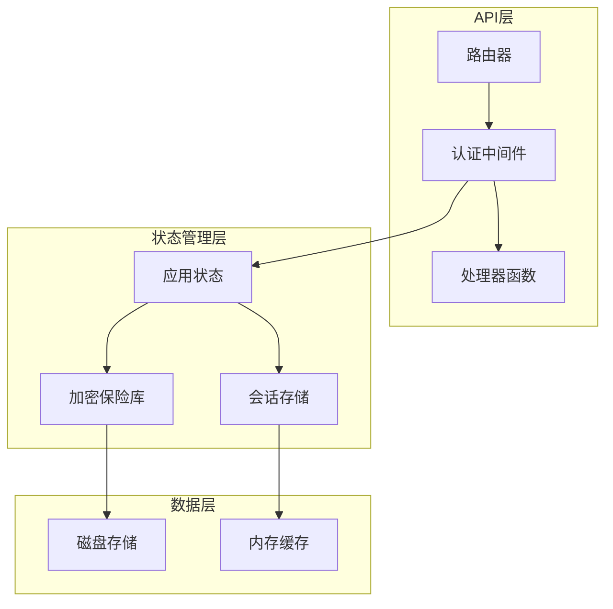
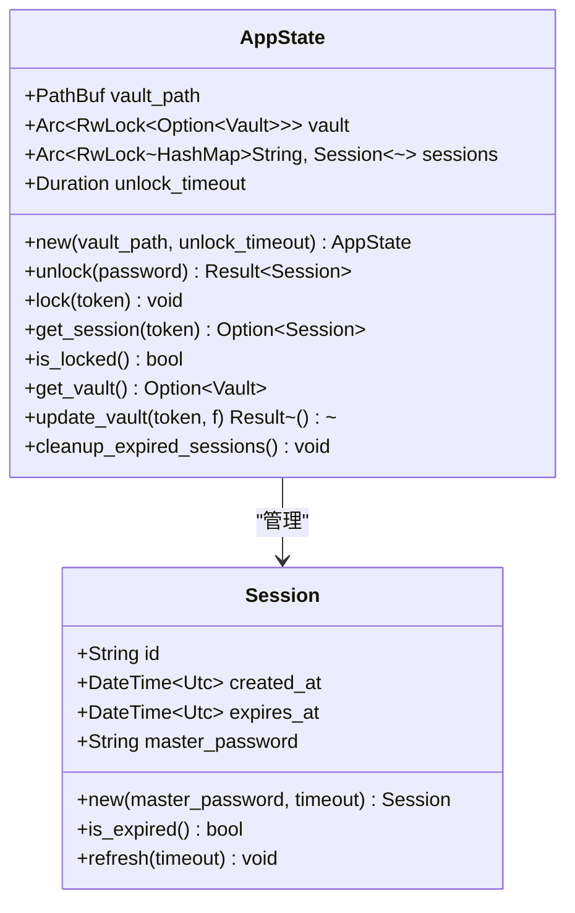
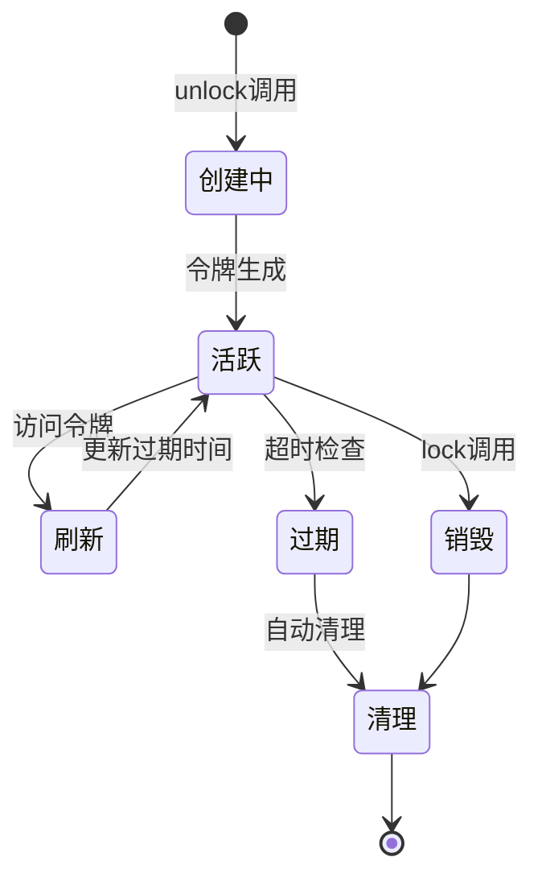
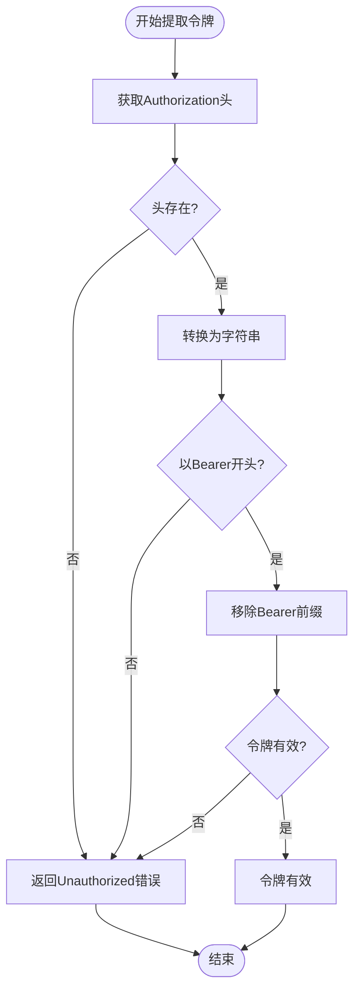
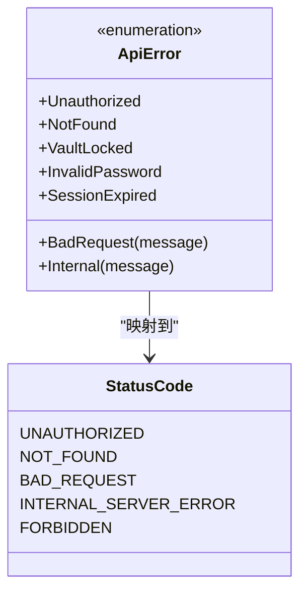
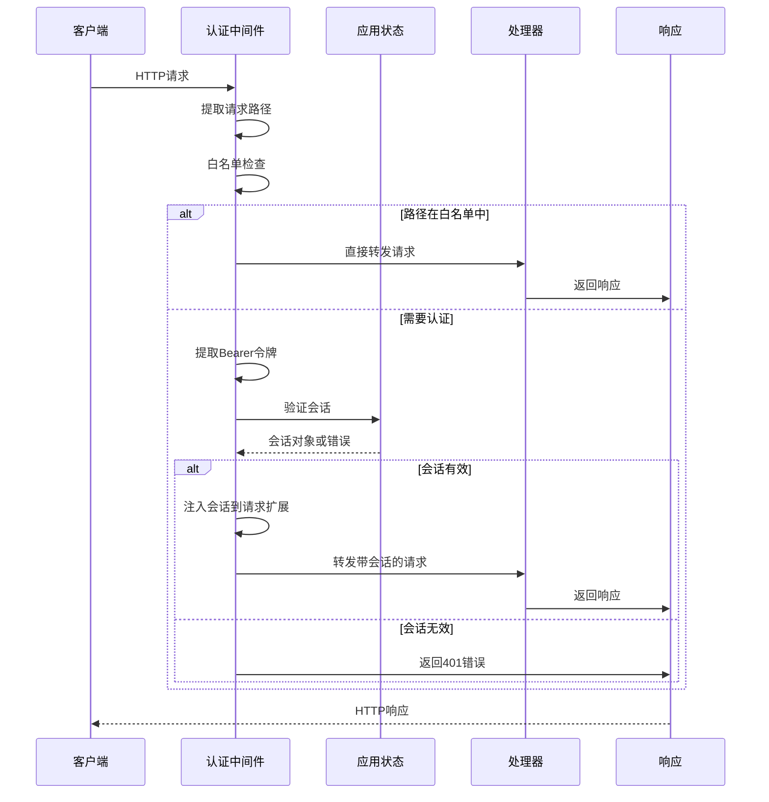
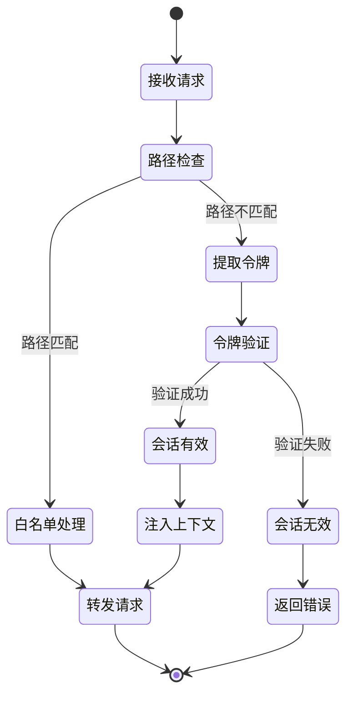

# SecureFox API认证中间件深度技术文档

<cite>
**本文档引用的文件**
- [auth.rs](file://api/src/auth.rs)
- [state.rs](file://api/src/state.rs)
- [handlers/mod.rs](file://api/src/handlers/mod.rs)
- [error.rs](file://api/src/error.rs)
- [models.rs](file://api/src/models.rs)
- [lib.rs](file://api/src/lib.rs)
</cite>

## 目录
1. [简介](#简介)
2. [项目架构概览](#项目架构概览)
3. [认证中间件核心实现](#认证中间件核心实现)
4. [会话管理系统](#会话管理系统)
5. [白名单路径处理](#白名单路径处理)
6. [令牌提取与验证](#令牌提取与验证)
7. [请求上下文注入](#请求上下文注入)
8. [错误处理机制](#错误处理机制)
9. [中间件执行流程](#中间件执行流程)
10. [性能优化考虑](#性能优化考虑)
11. [故障排除指南](#故障排除指南)
12. [总结](#总结)

## 简介

SecureFox API认证中间件是SecureFox密码管理器系统的核心安全组件，负责保护所有受保护的API端点。该中间件实现了基于Bearer令牌的身份验证机制，确保只有经过授权的客户端才能访问敏感的密码管理功能。

本文档深入分析了`auth_middleware`函数的执行流程，详细说明了从HTTP请求头中提取令牌、验证会话有效性、以及将验证后的会话对象注入请求上下文的技术细节。

## 项目架构概览

SecureFox采用模块化架构设计，API认证中间件作为中间层组件，与应用状态管理、处理器函数和错误处理系统紧密集成。



**图表来源**
- [lib.rs](file://api/src/lib.rs#L26-L101)
- [state.rs](file://api/src/state.rs#L7-L113)

**章节来源**
- [lib.rs](file://api/src/lib.rs#L1-L141)
- [state.rs](file://api/src/state.rs#L1-L113)

## 认证中间件核心实现

认证中间件的核心实现位于[`auth.rs`](file://api/src/auth.rs#L10-L36)文件中，该函数作为Axum框架的中间件，拦截所有受保护的API请求。

### 中间件函数签名

中间件函数采用标准的Axum中间件模式：

```rust
pub async fn auth_middleware(
    State(state): State<AppState>,
    mut request: Request,
    next: Next,
) -> Result<Response, ApiError>
```

### 核心执行逻辑

中间件的执行遵循以下步骤：

1. **路径白名单检查** - 跳过特定公共路径的认证
2. **令牌提取** - 从请求头中解析Bearer令牌
3. **会话验证** - 在内存存储中验证令牌有效性
4. **上下文注入** - 将验证后的会话对象添加到请求扩展
5. **请求转发** - 继续处理链中的下一个中间件或处理器

**章节来源**
- [auth.rs](file://api/src/auth.rs#L10-L36)

## 会话管理系统

会话管理系统是认证中间件的核心依赖，由[`AppState`](file://api/src/state.rs#L7-L113)结构体管理。

### 应用状态结构



**图表来源**
- [state.rs](file://api/src/state.rs#L7-L113)
- [models.rs](file://api/src/models.rs#L144-L170)

### 会话生命周期管理

会话的创建、存储和销毁遵循严格的生命周期管理：



**图表来源**
- [state.rs](file://api/src/state.rs#L25-L67)

**章节来源**
- [state.rs](file://api/src/state.rs#L15-L113)
- [models.rs](file://api/src/models.rs#L144-L170)

## 白名单路径处理

认证中间件通过预定义的白名单路径跳过认证检查，这些路径包括：

| 路径 | 功能 | 安全级别 |
|------|------|----------|
| `/api/unlock` | 解锁保险库 | 公共 |
| `/api/status` | 获取系统状态 | 公共 |
| `/health` | 健康检查 | 公共 |
| `/ws` | WebSocket连接 | 公共 |

### 白名单检查逻辑

白名单检查在中间件的早期阶段执行，避免不必要的令牌解析和验证开销：

```rust
let path = request.uri().path();
if path == "/api/unlock" || path == "/api/status" || path == "/health" || path == "/ws" {
    return Ok(next.run(request).await);
}
```

这种设计确保了系统的关键功能可以在未认证状态下正常工作，同时保持安全性。

**章节来源**
- [auth.rs](file://api/src/auth.rs#L15-L19)

## 令牌提取与验证

### Bearer令牌提取

令牌提取过程采用链式操作，确保安全性和健壮性：



**图表来源**
- [auth.rs](file://api/src/auth.rs#L21-L27)

### 令牌验证机制

令牌验证通过`state.get_session(token)`方法实现：

```rust
let session = state.get_session(token).ok_or(ApiError::SessionExpired)?;
```

该方法执行以下验证步骤：

1. **令牌查找** - 在内存哈希表中查找对应令牌
2. **过期检查** - 验证会话是否已过期
3. **自动清理** - 移除过期会话
4. **刷新机制** - 对活跃会话更新过期时间
5. **返回副本** - 返回会话的克隆版本

### 内存会话存储

会话存储采用线程安全的共享可变数据结构：

```rust
pub sessions: Arc<RwLock<HashMap<String, Session>>>
```

这种设计提供了：
- **并发访问** - 多个请求可以同时读取会话
- **原子更新** - 写操作的原子性保证
- **内存效率** - 高效的内存使用模式

**章节来源**
- [auth.rs](file://api/src/auth.rs#L21-L30)
- [state.rs](file://api/src/state.rs#L53-L67)

## 请求上下文注入

### 扩展机制

验证后的会话对象通过Axum的扩展机制注入到请求上下文中：

```rust
request.extensions_mut().insert(session);
```

### 后续处理器访问

后续的处理器函数可以通过`Extension<Session>`提取会话信息：

```rust
async fn create_item(
    State(state): State<AppState>,
    Extension(session): Extension<Session>,
    Json(req): Json<CreateItemRequest>,
) -> Result<Json<Item>>
```

这种设计实现了：
- **类型安全** - 编译时类型检查
- **解耦合** - 处理器无需直接依赖中间件
- **可测试性** - 易于单元测试和模拟

**章节来源**
- [auth.rs](file://api/src/auth.rs#L32-L35)
- [handlers/mod.rs](file://api/src/handlers/mod.rs#L53-L82)

## 错误处理机制

### 错误类型定义

API错误通过枚举类型统一管理：



**图表来源**
- [error.rs](file://api/src/error.rs#L11-L32)

### 错误响应格式

所有错误都遵循统一的JSON响应格式：

```json
{
    "error": "错误描述",
    "message": "详细错误信息"
}
```

### 特定错误处理

| 错误类型 | HTTP状态码 | 描述 |
|----------|------------|------|
| `Unauthorized` | 401 | 未提供有效的认证凭据 |
| `SessionExpired` | 401 | 会话已过期 |
| `VaultLocked` | 403 | 保险库被锁定 |
| `NotFound` | 404 | 请求的资源不存在 |

**章节来源**
- [error.rs](file://api/src/error.rs#L11-L74)

## 中间件执行流程

### 完整执行流程图



**图表来源**
- [auth.rs](file://api/src/auth.rs#L10-L36)
- [state.rs](file://api/src/state.rs#L53-L67)

### 状态机视图



**图表来源**
- [auth.rs](file://api/src/auth.rs#L15-L36)

**章节来源**
- [auth.rs](file://api/src/auth.rs#L10-L36)

## 性能优化考虑

### 内存存储优势

- **快速访问** - O(1)时间复杂度的会话查找
- **低延迟** - 避免数据库I/O开销
- **高并发** - 支持多线程并发访问

### 会话自动清理

定期清理过期会话防止内存泄漏：

```rust
pub fn cleanup_expired_sessions(&self) {
    let mut sessions = self.sessions.write();
    sessions.retain(|_, session| !session.is_expired());
}
```

### 令牌刷新机制

每次访问活跃会话都会刷新过期时间，延长用户会话：

```rust
session.refresh(self.unlock_timeout);
```

### 并发控制

使用读写锁确保并发安全：

```rust
pub sessions: Arc<RwLock<HashMap<String, Session>>>
```

## 故障排除指南

### 常见问题及解决方案

#### 1. 401 Unauthorized错误

**症状**: 请求返回401状态码

**可能原因**:
- 缺少Authorization头
- Bearer令牌格式错误
- 令牌已过期

**解决方案**:
- 检查请求头格式：`Authorization: Bearer <token>`
- 验证令牌有效性
- 重新登录获取新令牌

#### 2. 401 Session Expired错误

**症状**: 会话验证失败

**可能原因**:
- 会话超时
- 保险库已锁定
- 令牌被手动清除

**解决方案**:
- 重新解锁保险库
- 检查系统状态
- 重新获取会话令牌

#### 3. 403 Vault Locked错误

**症状**: 保险库访问被拒绝

**可能原因**:
- 保险库未解锁
- 会话关联的保险库已被锁定

**解决方案**:
- 调用`/api/unlock`接口解锁
- 检查保险库状态

### 调试技巧

#### 日志记录

启用详细的日志记录来跟踪认证流程：

```rust
tracing::info!("认证中间件处理请求: path={}", request.uri().path());
tracing::debug!("提取的令牌: {}", token);
```

#### 状态监控

监控会话数量和内存使用：

```rust
let session_count = state.sessions.read().len();
tracing::info!("当前活跃会话数: {}", session_count);
```

**章节来源**
- [error.rs](file://api/src/error.rs#L35-L53)
- [state.rs](file://api/src/state.rs#L108-L112)

## 总结

SecureFox API认证中间件是一个精心设计的安全组件，它通过以下关键特性确保系统的安全性：

### 核心优势

1. **简洁高效** - 单一职责的中间件设计
2. **安全可靠** - 基于Bearer令牌的标准认证机制
3. **性能优异** - 内存存储和智能缓存策略
4. **易于维护** - 清晰的错误处理和日志记录
5. **扩展性强** - 模块化设计支持功能扩展

### 技术亮点

- **链式令牌提取** - 安全可靠的令牌解析
- **自动会话管理** - 智能的过期检测和清理
- **上下文注入** - 类型安全的请求数据传递
- **白名单机制** - 灵活的公共路径配置

### 最佳实践建议

1. **定期清理** - 实施定期的会话清理任务
2. **监控告警** - 设置会话数量和错误率监控
3. **安全审计** - 记录认证相关的安全事件
4. **性能优化** - 根据负载调整会话超时设置

该认证中间件为SecureFox系统提供了坚实的安全基础，确保用户的密码数据得到妥善保护，同时保持良好的用户体验。