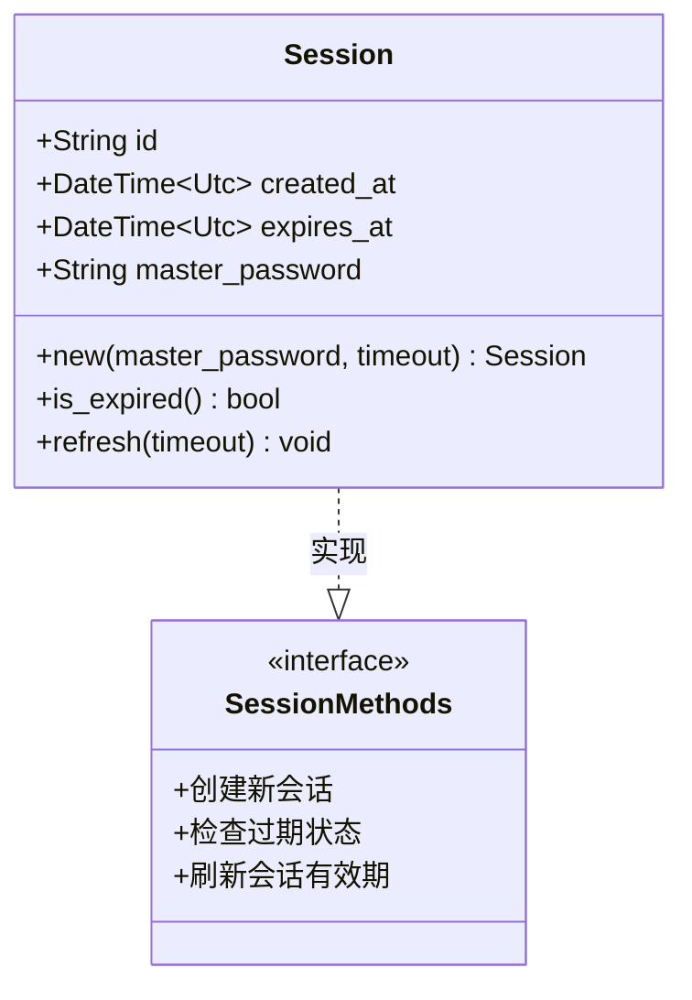
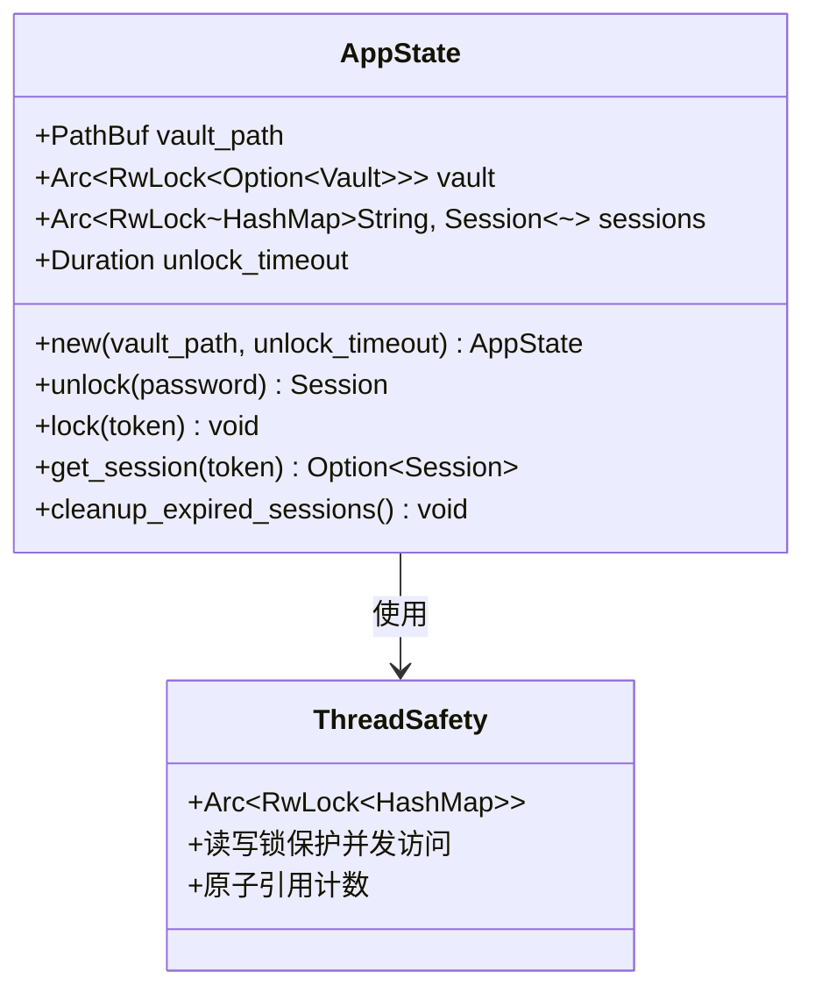
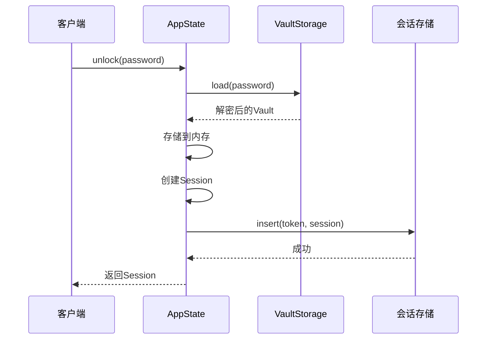
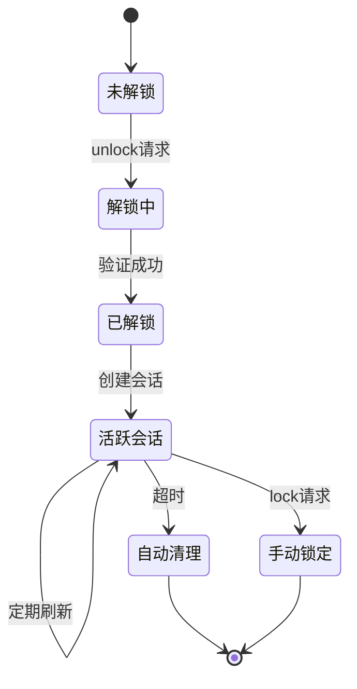
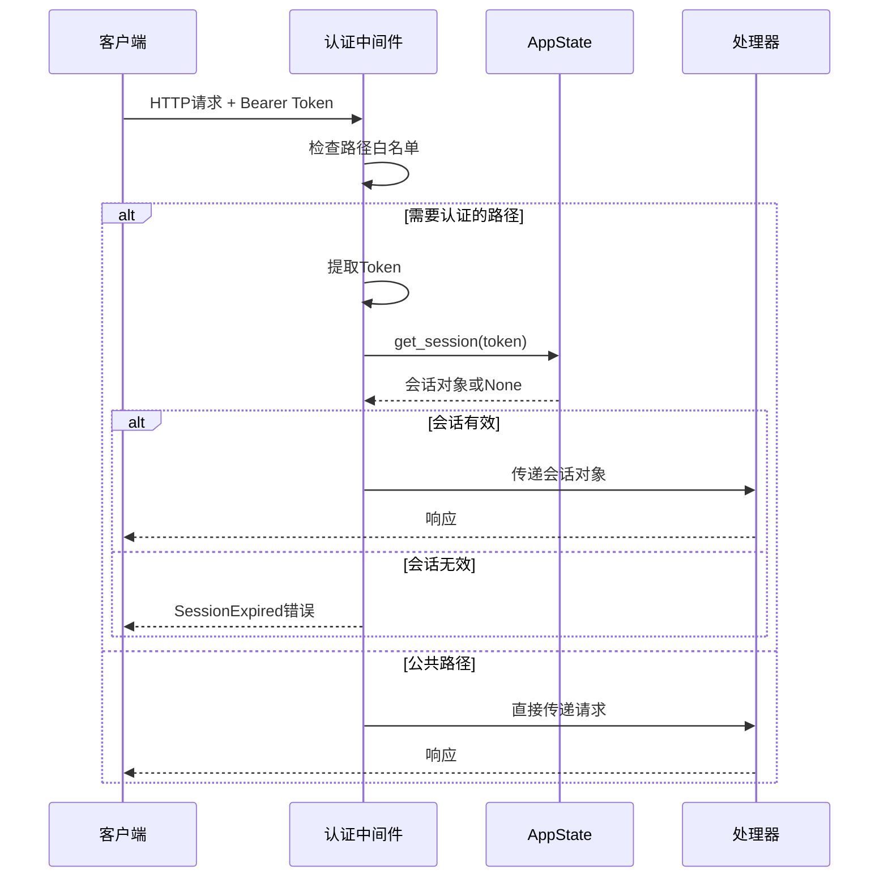
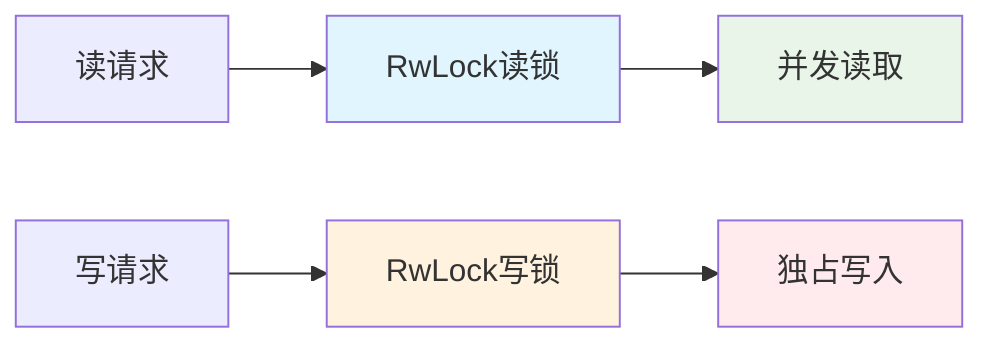

# 会话管理机制

<cite>
**本文档引用的文件**
- [models.rs](file://api/src/models.rs) - *会话结构体定义*
- [state.rs](file://api/src/state.rs) - *全局状态管理*
- [auth.ts](file://extension/lib/api/auth.ts) - *前端认证逻辑*
- [background.ts](file://extension/entrypoints/background.ts) - *后台服务逻辑*
- [authStore.ts](file://extension/store/authStore.ts) - *状态存储管理*
</cite>

## 更新摘要
**变更内容**
- 更新了会话生命周期管理机制，反映前端不再存储`expiresAt`字段的变更
- 修订了会话保持机制，说明会话有效性完全由后端状态决定
- 调整了前端会话验证流程，401错误触发本地会话清理
- 移除了前端过期检查相关描述
- 更新了相关代码文件引用和注释

### 目录
1. [简介](#简介)
2. [Session结构体设计](#session结构体设计)
3. [AppState状态管理](#appstate状态管理)
4. [会话生命周期](#会话生命周期)
5. [认证中间件](#认证中间件)
6. [会话保持机制](#会话保持机制)
7. [安全性分析](#安全性分析)
8. [性能考虑](#性能考虑)
9. [故障排除指南](#故障排除指南)
10. [总结](#总结)

## 简介

SecureFox采用基于内存的会话管理系统来维护用户解锁状态和访问令牌。该系统通过`Session`结构体管理会话信息，并使用`AppState`作为全局状态容器，在内存中维护所有活动会话。本文档详细分析了会话管理机制的设计原理、实现细节和安全特性。

## Session结构体设计

### 核心字段架构

`Session`结构体是会话管理的核心数据结构，包含以下关键字段：



**图表来源**
- [models.rs](file://api/src/models.rs#L144-L170)

### 字段详细说明

| 字段名 | 类型 | 描述 | 安全考虑 |
|--------|------|------|----------|
| `id` | `String` | UUID v4生成的唯一标识符 | 使用标准UUID库确保随机性和唯一性 |
| `created_at` | `DateTime<Utc>` | 会话创建时间戳 | UTC时间确保跨时区一致性 |
| `expires_at` | `DateTime<Utc>` | 会话过期时间戳 | 动态计算，支持会话刷新 |
| `master_password` | `String` | 主密码（生产环境应存储派生密钥） | 明文存储仅为示例，实际应用需加密 |

### 方法实现详解

#### new方法 - 会话创建

`new`方法负责创建新的会话实例，其核心逻辑包括：

- **UUID生成**：使用`Uuid::new_v4()`生成不可预测的会话ID
- **时间戳设置**：记录当前UTC时间作为创建时间
- **过期时间计算**：基于传入的超时参数计算过期时间
- **密码存储**：保存主密码用于后续验证（注意：生产环境应存储派生密钥）

#### is_expired方法 - 过期检查

该方法通过比较当前时间与过期时间来判断会话是否有效：
- 使用`Utc::now()`获取当前时间
- 比较`self.expires_at`与当前时间
- 返回布尔值表示会话状态

#### refresh方法 - 会话刷新

`refresh`方法允许延长会话的有效期：
- 更新`expires_at`为当前时间加上新的超时值
- 支持动态调整会话持续时间
- 自动延长活跃用户的会话时间

**章节来源**
- [models.rs](file://api/src/models.rs#L144-L170)

## AppState状态管理

### 内存存储架构

`AppState`使用线程安全的数据结构来管理所有活动会话：



**图表来源**
- [state.rs](file://api/src/state.rs#L7-L13)

### 关键组件分析

#### 会话存储结构

- **类型**：`Arc<RwLock<HashMap<String, Session>>>`
- **作用**：在多线程环境中安全地存储和管理所有活动会话
- **优势**：
  - `Arc`提供原子引用计数，支持多线程共享
  - `RwLock`允许多个读取者或单个写入者并发访问
  - `HashMap`提供O(1)的查找性能

#### 核心方法实现

##### unlock方法 - 创建会话



**图表来源**
- [state.rs](file://api/src/state.rs#L25-L41)

##### get_session方法 - 会话检索

该方法实现了会话的自动管理和刷新机制：

1. **并发控制**：使用写锁确保线程安全
2. **过期检查**：验证会话是否已过期
3. **自动清理**：移除过期会话
4. **自动刷新**：延长活跃会话的有效期

##### lock方法 - 会话终止

- 移除指定会话
- 清空内存中的Vault数据
- 释放资源

##### cleanup_expired_sessions方法 - 定期清理

定期执行的后台任务，清理所有过期的会话，防止内存泄漏。

**章节来源**
- [state.rs](file://api/src/state.rs#L15-L112)

## 会话生命周期

### 完整生命周期流程



### 生命周期阶段详解

#### 1. 未解锁状态
- 初始状态，Vault数据未加载到内存
- 只能访问公共接口（如状态查询）
- 所有其他操作返回未授权错误

#### 2. 解锁过程
- 验证用户提供的主密码
- 加载并解密Vault数据
- 创建新的会话实例
- 将会话存储到内存中

#### 3. 活跃会话状态
- 会话具有有效的时间窗口
- 允许对受保护资源的访问
- 支持自动刷新机制

#### 4. 会话刷新
- 访问受保护资源时自动刷新
- 定期心跳机制保持活跃
- 延长会话有效期

#### 5. 会话终止
- 自动清理：超时或手动锁定
- 手动清理：显式调用lock方法
- 资源回收：释放内存中的Vault数据

**章节来源**
- [state.rs](file://api/src/state.rs#L25-L67)
- [handlers/mod.rs](file://api/src/handlers/mod.rs#L9-L46)

## 认证中间件

### 中间件架构

SecureFox使用基于Axum框架的认证中间件来保护API路由：



**图表来源**
- [auth.rs](file://api/src/auth.rs#L10-L35)

### 白名单路由

认证中间件跳过以下公共路由：
- `/api/unlock` - 用户解锁接口
- `/api/status` - 状态查询接口  
- `/health` - 健康检查接口
- `/ws` - WebSocket连接

### Token提取机制

中间件从HTTP头部提取认证信息：
- 检查`Authorization`头
- 提取Bearer Token格式
- 验证Token格式和存在性

**章节来源**
- [auth.rs](file://api/src/auth.rs#L10-L35)

## 会话保持机制

### 前端保持策略

前端实现了多层次的会话保持机制：

#### 1. 自动锁定定时器

```mermaid
flowchart TD
A[用户操作] --> B[重置自动锁定计时器]
B --> C{检查锁定模式}
C --> |15分钟| D[设置15分钟定时器]
C --> |60分钟| E[设置60分钟定时器]
C --> |-1(浏览器关闭)| F[不设置定时器]
D --> G[定时器到期]
E --> G
F --> H[浏览器关闭]
G --> I[自动锁定]
H --> J[触发自动锁定]
```

**图表来源**
- [background.ts](file://extension/entrypoints/background.ts#L56-L62)

#### 2. 心跳保持机制

对于"浏览器关闭时锁定"模式，前端每10分钟发送一次心跳：

- **触发条件**：会话处于解锁状态
- **执行频率**：每10分钟一次
- **保持方式**：调用轻量级的`getStatus`接口
- **异常处理**：失败时停止心跳机制

#### 3. 后端心跳支持

后端同样支持心跳机制：
- 接收定期的健康检查请求
- 自动刷新会话有效期
- 维护会话活跃状态

### 会话刷新策略

| 触发场景 | 刷新方式 | 时间间隔 | 目的 |
|----------|----------|----------|------|
| API访问 | 自动刷新 | 请求时 | 维持活跃状态 |
| 心跳机制 | 定期刷新 | 10分钟 | 防止超时 |
| 手动操作 | 立即刷新 | 即时 | 用户体验优化 |

**章节来源**
- [background.ts](file://extension/entrypoints/background.ts#L24-L44)
- [auth.ts](file://extension/lib/api/auth.ts#L116-L145)

## 安全性分析

### 安全威胁模型

#### 1. 会话劫持防护

- **UUID强度**：使用标准UUID v4确保不可预测性
- **传输安全**：依赖HTTPS保护Token传输
- **过期机制**：自动过期防止长期劫持

#### 2. 密码存储安全

**当前实现问题**：
- `master_password`字段直接存储明文
- 缺少密钥派生函数（KDF）

**改进建议**：
- 使用PBKDF2、Argon2等密钥派生算法
- 添加盐值增强安全性
- 实现渐进式密钥更新

#### 3. 并发访问安全

- **读写锁**：`RwLock`提供适当的并发控制
- **原子引用**：`Arc`确保线程安全的引用计数
- **细粒度锁定**：最小化锁的持有时间

### 安全最佳实践

#### 1. 会话管理
- 设置合理的超时时间（默认15分钟）
- 实现自动清理机制
- 支持手动锁定功能

#### 2. 数据保护
- 敏感数据及时清理
- 内存中的数据加密
- 防止敏感信息泄露

#### 3. 错误处理
- 详细的错误日志记录
- 隐藏敏感信息的错误详情
- 适当的错误响应格式

**章节来源**
- [models.rs](file://api/src/models.rs#L149)
- [state.rs](file://api/src/state.rs#L108-L112)

## 性能考虑

### 内存使用优化

#### 1. 会话存储效率

- **哈希表查找**：O(1)的平均查找复杂度
- **内存占用**：每个会话约1KB内存
- **垃圾回收**：定期清理过期会话

#### 2. 并发性能



**图表来源**
- [state.rs](file://api/src/state.rs#L11-L11)

#### 3. 性能指标

| 操作类型 | 时间复杂度 | 内存复杂度 | 说明 |
|----------|------------|------------|------|
| 会话创建 | O(1) | O(1) | UUID生成+哈希插入 |
| 会话查找 | O(1) | O(1) | 哈希表直接访问 |
| 会话刷新 | O(1) | O(1) | 时间更新操作 |
| 过期清理 | O(n) | O(1) | 遍历清理过期项 |

### 扩展性考虑

#### 1. 当前限制
- **内存限制**：所有会话存储在内存中
- **单节点**：不支持集群部署
- **持久化缺失**：重启后会话丢失

#### 2. 扩展方案
- **分布式缓存**：Redis/Memcached存储会话
- **数据库持久化**：MySQL/PostgreSQL存储会话数据
- **负载均衡**：支持多实例部署

#### 3. 性能监控

建议监控以下指标：
- 活跃会话数量
- 内存使用情况
- 并发访问频率
- 会话创建/销毁速率

**章节来源**
- [state.rs](file://api/src/state.rs#L108-L112)

## 故障排除指南

### 常见问题诊断

#### 1. 会话过期问题

**症状**：API调用返回401 Unauthorized
**原因**：会话超时或被手动锁定
**解决方案**：
- 检查自动锁定设置
- 验证心跳机制是否正常工作
- 重新执行解锁操作

#### 2. 并发访问冲突

**症状**：偶尔出现会话不存在错误
**原因**：多个请求同时访问同一会话
**解决方案**：
- 检查并发访问模式
- 验证中间件配置
- 增加重试机制

#### 3. 内存泄漏问题

**症状**：长时间运行后内存使用持续增长
**原因**：过期会话未及时清理
**解决方案**：
- 检查清理定时器配置
- 监控会话数量变化
- 手动触发清理操作

### 调试工具

#### 1. 日志分析

启用详细日志记录：
```rust
// 在state.rs中添加调试输出
println!("Creating session: {:?}", session.id);
println!("Cleaning up expired sessions, remaining: {}", sessions.len());
```

#### 2. 性能监控

监控关键指标：
- 会话创建速率
- 平均响应时间
- 内存使用峰值
- 错误率统计

#### 3. 测试验证

编写单元测试验证：
- 会话创建和验证
- 过期检查逻辑
- 并发访问安全性
- 边界条件处理

**章节来源**
- [state.rs](file://api/src/state.rs#L108-L112)

## 总结

SecureFox的会话管理机制通过精心设计的`Session`结构体和`AppState`状态管理器，实现了高效、安全的会话控制。该系统的主要特点包括：

### 技术优势
- **简洁高效**：基于内存的存储方案提供快速的会话访问
- **线程安全**：使用RwLock确保多线程环境下的数据一致性
- **自动管理**：智能的过期检测和自动清理机制
- **灵活扩展**：支持多种锁定模式和刷新策略

### 安全特性
- **强随机性**：UUID v4确保会话ID的不可预测性
- **时间驱动**：基于时间的过期机制防止长期会话滥用
- **并发保护**：完善的锁机制防止竞态条件
- **资源清理**：及时的内存清理防止资源泄漏

### 改进建议
- **密码安全**：实现密钥派生存储替代明文密码
- **持久化**：考虑添加会话持久化机制
- **监控告警**：增加会话状态监控和异常告警
- **性能优化**：实现会话池化减少频繁创建销毁

该会话管理机制为SecureFox提供了可靠的基础服务，支撑整个应用的安全访问控制，是系统架构中的重要组成部分。