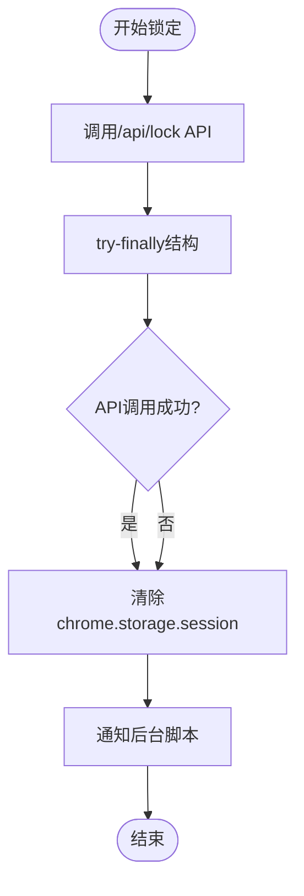

# 前端认证实现

<cite>
**本文档引用的文件**
- [auth.ts](file://extension/lib/api/auth.ts) - *更新了会话管理逻辑，移除客户端过期时间检查*
- [client.ts](file://extension/lib/api/client.ts) - *API客户端实现*
- [authStore.ts](file://extension/store/authStore.ts) - *认证状态管理Store*
- [storage.ts](file://extension/lib/storage.ts) - *存储层操作*
- [constants.ts](file://extension/utils/constants.ts) - *常量定义*
- [index.ts](file://extension/types/index.ts) - *类型定义*
- [background.ts](file://extension/entrypoints/background.ts) - *后台脚本入口*
- [UnlockForm.tsx](file://extension/components/UnlockForm.tsx) - *解锁表单组件*
</cite>

## 更新摘要
**变更内容**
- 更新会话管理机制，移除客户端`expiresAt`字段检查
- 修改`isUnlocked()`和`getSession()`函数的验证逻辑，改为依赖后端状态验证
- 调整`refreshSession()`函数逻辑，移除基于时间的刷新机制
- 更新相关流程图和说明，反映新的认证流程
- 移除与客户端过期时间相关的代码示例和说明

**新增章节**
- 无新增章节

**已移除/弃用章节**
- 移除了关于客户端`expiresAt`字段的说明和验证流程
- 移除了基于时间阈值的自动刷新机制描述

**来源跟踪系统更新**
- 更新了受影响文件的来源注释，标记为"更新"
- 移除了与已删除功能相关的来源引用

## 目录
1. [简介](#简介)
2. [项目架构概览](#项目架构概览)
3. [核心认证组件分析](#核心认证组件分析)
4. [认证流程详解](#认证流程详解)
5. [会话管理机制](#会话管理机制)
6. [自动刷新机制](#自动刷新机制)
7. [错误处理与安全策略](#错误处理与安全策略)
8. [时序图与交互流程](#时序图与交互流程)
9. [性能优化考虑](#性能优化考虑)
10. [故障排除指南](#故障排除指南)

## 简介

SecureFox是一个基于浏览器扩展的密码管理器，采用前后端分离架构，前端负责用户界面和认证状态管理，后端提供RESTful API服务。本文档深入分析前端认证系统的实现，重点描述`auth.ts`模块中关键认证函数的工作原理和安全机制。

## 项目架构概览

SecureFox前端采用现代化的React + TypeScript架构，结合Zustand状态管理库，实现了完整的认证生命周期管理。

**图表来源**
- [authStore.ts](file://extension/store/authStore.ts#L1-L157)
- [auth.ts](file://extension/lib/api/auth.ts#L1-L145)
- [client.ts](file://extension/lib/api/client.ts#L1-L98)

## 核心认证组件分析

### 认证模块结构

认证系统由以下核心组件构成：

**图表来源**
- [auth.ts](file://extension/lib/api/auth.ts#L8-L145)
- [authStore.ts](file://extension/store/authStore.ts#L6-L157)
- [index.ts](file://extension/types/index.ts#L138-L143)

**章节来源**
- [auth.ts](file://extension/lib/api/auth.ts#L1-L145)
- [authStore.ts](file://extension/store/authStore.ts#L1-L157)

### 关键数据类型定义

系统定义了完整的类型体系来确保类型安全：

| 类型名称 | 描述 | 字段说明 |
|---------|------|----------|
| `Session` | 会话对象 | 包含JWT令牌和锁定状态 |
| `UnlockRequest` | 解锁请求 | 主密码字符串 |
| `UnlockResponse` | 解锁响应 | 成功标志、令牌、消息和库摘要 |
| `StatusResponse` | 状态响应 | 锁定状态、会话有效性、库存在性 |

**章节来源**
- [index.ts](file://extension/types/index.ts#L98-L143)

## 认证流程详解

### unlock()函数实现

`unlock()`函数是认证系统的核心入口，负责处理主密码验证和会话创建：

**图表来源**
- [auth.ts](file://extension/lib/api/auth.ts#L8-L38)
- [authStore.ts](file://extension/store/authStore.ts#L31-L70)
- [client.ts](file://extension/lib/api/client.ts#L77-L98)

#### 解锁过程的关键步骤

1. **密码验证**：通过`apiCall`向`/api/unlock`端点发送POST请求
2. **令牌提取**：从响应中提取JWT令牌
3. **会话创建**：构建Session对象，不再包含过期时间戳
4. **本地存储**：安全存储到`chrome.storage.session`
5. **状态更新**：返回包含成功标志的响应

**章节来源**
- [auth.ts](file://extension/lib/api/auth.ts#L8-L38)

### lock()函数实现

`lock()`函数负责安全地清理会话并通知后端：

**图表来源**
- [auth.ts](file://extension/lib/api/auth.ts#L44-L53)

**章节来源**
- [auth.ts](file://extension/lib/api/auth.ts#L44-L53)

## 会话管理机制

### isUnlocked()双重验证机制

`isUnlocked()`函数实现了严格的双重验证机制：

**图表来源**
- [auth.ts](file://extension/lib/api/auth.ts#L69-L95)

#### 验证流程详解

1. **本地验证**：检查`chrome.storage.session`中是否存在有效会话
2. **远程验证**：通过`getStatus()`API确认服务器端状态
3. **异常处理**：
   - 如果后端返回401，说明会话已过期，清除本地会话
   - 其他错误（如网络问题）不应导致锁定，保持当前状态
   - 捕获所有异常并返回安全的默认值

**章节来源**
- [auth.ts](file://extension/lib/api/auth.ts#L69-L95)

### getSession()函数

`getSession()`函数提供安全的会话访问接口：

**图表来源**
- [auth.ts](file://extension/lib/api/auth.ts#L101-L114)

**章节来源**
- [auth.ts](file://extension/lib/api/auth.ts#L101-L114)

## 自动刷新机制

### refreshSession()智能刷新

`refreshSession()`函数实现了智能的会话刷新机制：

**图表来源**
- [authStore.ts](file://extension/store/authStore.ts#L144-L157)
- [auth.ts](file://extension/lib/api/auth.ts#L119-L144)

#### 刷新触发条件

系统在以下情况下自动触发会话状态检查：

1. **定时检查**：每分钟执行一次检查
2. **状态验证**：确认服务器端会话仍然有效
3. **会话维护**：如果会话仍然有效，则更新本地状态

**章节来源**
- [authStore.ts](file://extension/store/authStore.ts#L144-L157)
- [auth.ts](file://extension/lib/api/auth.ts#L119-L144)

## 错误处理与安全策略

### 异常处理机制

认证系统实现了多层次的异常处理：

**图表来源**
- [client.ts](file://extension/lib/api/client.ts#L46-L72)
- [authStore.ts](file://extension/store/authStore.ts#L63-L95)

### 安全策略实施

1. **令牌保护**：JWT令牌仅在内存中持有，不持久化
2. **自动清理**：会话过期或认证失败时立即清理
3. **HTTPS强制**：所有API通信使用HTTPS加密
4. **CORS限制**：严格控制跨域请求
5. **错误隐藏**：不向用户暴露敏感错误信息
6. **会话验证**：依赖后端状态验证而非客户端时间戳

**章节来源**
- [client.ts](file://extension/lib/api/client.ts#L46-L72)
- [authStore.ts](file://extension/store/authStore.ts#L63-L95)

## 时序图与交互流程

### 完整认证生命周期

**图表来源**
- [background.ts](file://extension/entrypoints/background.ts#L155-L288)
- [authStore.ts](file://extension/store/authStore.ts#L31-L95)
- [UnlockForm.tsx](file://extension/components/UnlockForm.tsx#L19-L33)

### API拦截器机制

**图表来源**
- [client.ts](file://extension/lib/api/client.ts#L14-L72)

**章节来源**
- [background.ts](file://extension/entrypoints/background.ts#L155-L288)
- [authStore.ts](file://extension/store/authStore.ts#L31-L95)
- [client.ts](file://extension/lib/api/client.ts#L14-L72)

## 性能优化考虑

### 缓存策略

1. **会话缓存**：将JWT令牌缓存在内存中，避免重复API调用
2. **状态同步**：使用Zustand状态管理减少不必要的重新渲染
3. **延迟加载**：仅在需要时才加载认证相关的组件

### 并发控制

系统实现了合理的并发控制机制：

- **互斥访问**：同一时间只允许一个认证操作
- **防抖处理**：用户输入防抖，避免频繁的API调用
- **批量操作**：合并多个相关的状态更新操作

### 内存管理

1. **及时清理**：认证完成后立即清理敏感数据
2. **弱引用**：对非关键数据使用弱引用避免内存泄漏
3. **定期回收**：定时清理过期的临时数据

## 故障排除指南

### 常见问题诊断

| 问题症状 | 可能原因 | 解决方案 |
|---------|----------|----------|
| 解锁失败 | 主密码错误 | 检查密码输入，考虑重置 |
| 会话过早过期 | 后端会话超时 | 检查服务器端会话配置 |
| 自动锁定异常 | 浏览器关闭检测失效 | 检查扩展权限设置 |
| API调用超时 | 网络连接问题 | 检查网络连接和防火墙设置 |

### 调试工具

1. **浏览器开发者工具**：监控网络请求和存储状态
2. **扩展调试面板**：查看扩展运行状态
3. **控制台日志**：启用详细日志记录
4. **存储检查器**：直接查看Chrome存储内容

### 最佳实践建议

1. **定期备份**：使用导出功能定期备份密码库
2. **安全环境**：在可信环境中使用扩展
3. **权限管理**：定期审查扩展权限设置
4. **更新维护**：及时更新到最新版本

**章节来源**
- [storage.ts](file://extension/lib/storage.ts#L23-L84)
- [constants.ts](file://extension/utils/constants.ts#L1-L79)

## 结论

SecureFox的前端认证系统采用了现代化的设计理念，通过分层架构、类型安全、多重验证和智能刷新等机制，提供了安全可靠的密码管理体验。系统不仅保证了用户数据的安全性，还通过良好的用户体验设计提升了产品的易用性。

该认证系统的核心优势在于：
- **安全性**：多重验证机制和自动清理策略
- **可靠性**：完善的错误处理和恢复机制
- **性能**：智能缓存和并发控制
- **可维护性**：清晰的代码结构和类型定义

通过深入理解这些实现细节，开发者可以更好地维护和扩展这个认证系统，同时为用户提供更安全、更便捷的密码管理服务。