# SecureFox认证流程详细文档

<cite>
**本文档引用的文件**
- [extension/lib/api/auth.ts](file://extension/lib/api/auth.ts)
- [extension/store/authStore.ts](file://extension/store/authStore.ts)
- [api/src/auth.rs](file://api/src/auth.rs)
- [api/src/state.rs](file://api/src/state.rs)
- [api/src/models.rs](file://api/src/models.rs)
- [extension/lib/api/client.ts](file://extension/lib/api/client.ts)
- [extension/types/index.ts](file://extension/types/index.ts)
- [extension/utils/constants.ts](file://extension/utils/constants.ts)
- [extension/entrypoints/background.ts](file://extension/entrypoints/background.ts)
- [api/src/error.rs](file://api/src/error.rs)
- [extension/components/UnlockForm.tsx](file://extension/components/UnlockForm.tsx)
</cite>

## 目录
1. [简介](#简介)
2. [系统架构概览](#系统架构概览)
3. [认证流程详解](#认证流程详解)
4. [前端认证组件](#前端认证组件)
5. [后端认证中间件](#后端认证中间件)
6. [会话管理机制](#会话管理机制)
7. [自动锁定与保活机制](#自动锁定与保活机制)
8. [错误处理流程](#错误处理流程)
9. [安全特性](#安全特性)
10. [故障排除指南](#故障排除指南)

## 简介

SecureFox采用基于Bearer Token的认证机制，为用户提供安全可靠的密码管理体验。认证系统涵盖了从用户解锁到会话管理的完整生命周期，确保用户数据的安全性和系统的可用性。

## 系统架构概览

SecureFox认证系统采用前后端分离架构，主要由以下组件构成：

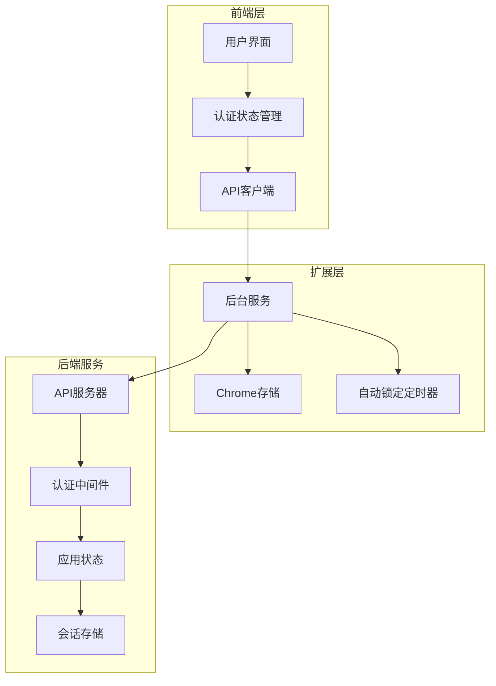

**图表来源**
- [extension/store/authStore.ts](file://extension/store/authStore.ts#L1-L157)
- [extension/lib/api/client.ts](file://extension/lib/api/client.ts#L1-L98)
- [api/src/auth.rs](file://api/src/auth.rs#L1-L37)

## 认证流程详解

### 用户解锁流程

用户解锁是认证流程的核心环节，涉及多个组件的协调工作：

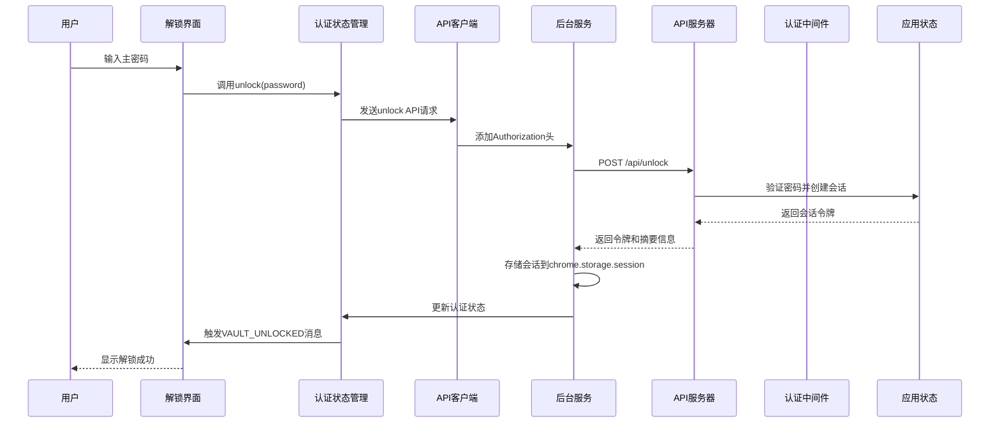

**图表来源**
- [extension/lib/api/auth.ts](file://extension/lib/api/auth.ts#L8-L39)
- [extension/store/authStore.ts](file://extension/store/authStore.ts#L30-L70)
- [api/src/handlers/mod.rs](file://api/src/handlers/mod.rs#L9-L26)

**章节来源**
- [extension/lib/api/auth.ts](file://extension/lib/api/auth.ts#L8-L39)
- [extension/store/authStore.ts](file://extension/store/authStore.ts#L30-L70)

### API端点认证

#### unlock API端点

unlock端点负责验证用户提供的主密码并创建新的会话：

| 参数 | 类型 | 描述 | 必需 |
|------|------|------|------|
| password | string | 用户主密码 | 是 |

| 响应字段 | 类型 | 描述 |
|----------|------|------|
| success | boolean | 解锁是否成功 |
| token | string | 会话令牌 |
| message | string | 错误消息（如有） |
| vault_summary | object | 密码库摘要信息 |

#### lock API端点

lock端点用于手动锁定密码库：

| 参数 | 类型 | 描述 | 必需 |
|------|------|------|------|
| 无 | - | 无需参数 |

| 响应字段 | 类型 | 描述 |
|----------|------|------|
| locked | boolean | 是否已锁定 |
| session_valid | boolean | 会话是否有效 |
| vault_exists | boolean | 密码库是否存在 |

**章节来源**
- [api/src/handlers/mod.rs](file://api/src/handlers/mod.rs#L9-L47)
- [extension/types/index.ts](file://extension/types/index.ts#L99-L111)

## 前端认证组件

### authApi模块

前端认证功能通过专门的API模块实现，提供统一的认证接口：

#### unlock函数实现

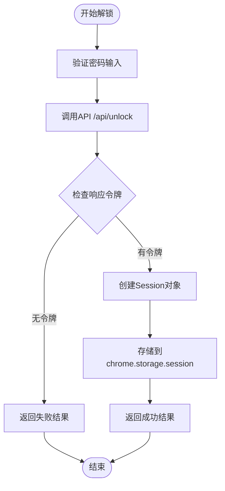

**图表来源**
- [extension/lib/api/auth.ts](file://extension/lib/api/auth.ts#L8-L39)

#### lock函数实现

lock操作执行同步清理和通知：

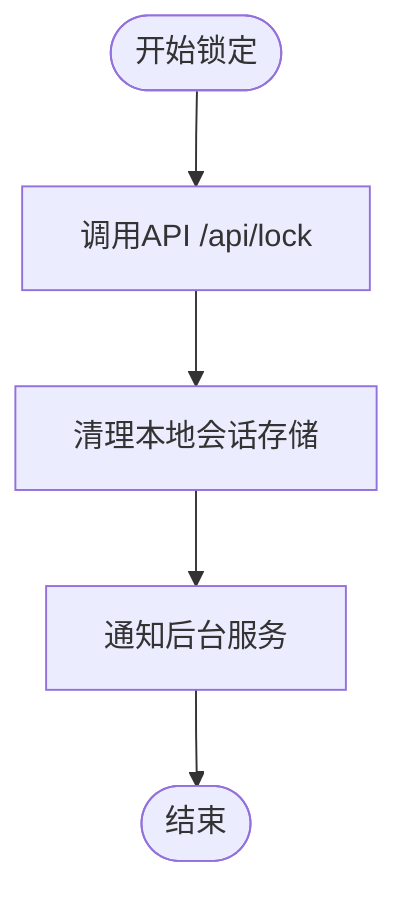

**图表来源**
- [extension/lib/api/auth.ts](file://extension/lib/api/auth.ts#L44-L53)

#### 会话状态检查

前端提供多种会话状态检查方法：

| 函数 | 功能 | 返回值 |
|------|------|--------|
| isUnlocked() | 检查是否已解锁 | boolean |
| getSession() | 获取当前会话 | Session \| null |
| getStatus() | 获取服务器状态 | StatusResponse |

**章节来源**
- [extension/lib/api/auth.ts](file://extension/lib/api/auth.ts#L44-L145)

### Zustand状态管理

认证状态通过Zustand进行集中管理：

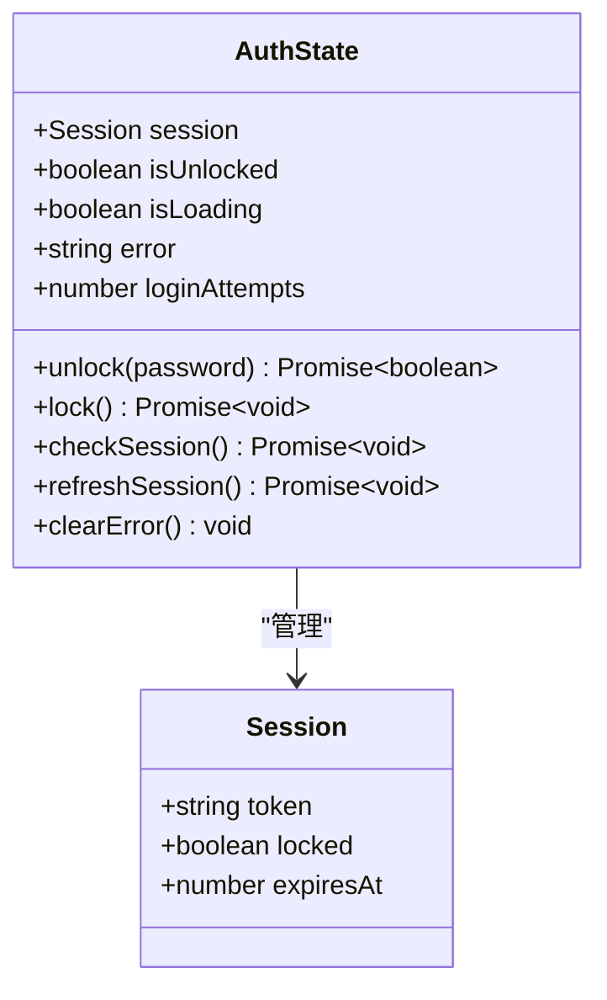

**图表来源**
- [extension/store/authStore.ts](file://extension/store/authStore.ts#L6-L20)
- [extension/types/index.ts](file://extension/types/index.ts#L139-L143)

**章节来源**
- [extension/store/authStore.ts](file://extension/store/authStore.ts#L1-L157)

## 后端认证中间件

### auth_middleware实现

认证中间件负责拦截所有受保护的API请求并验证Bearer Token：

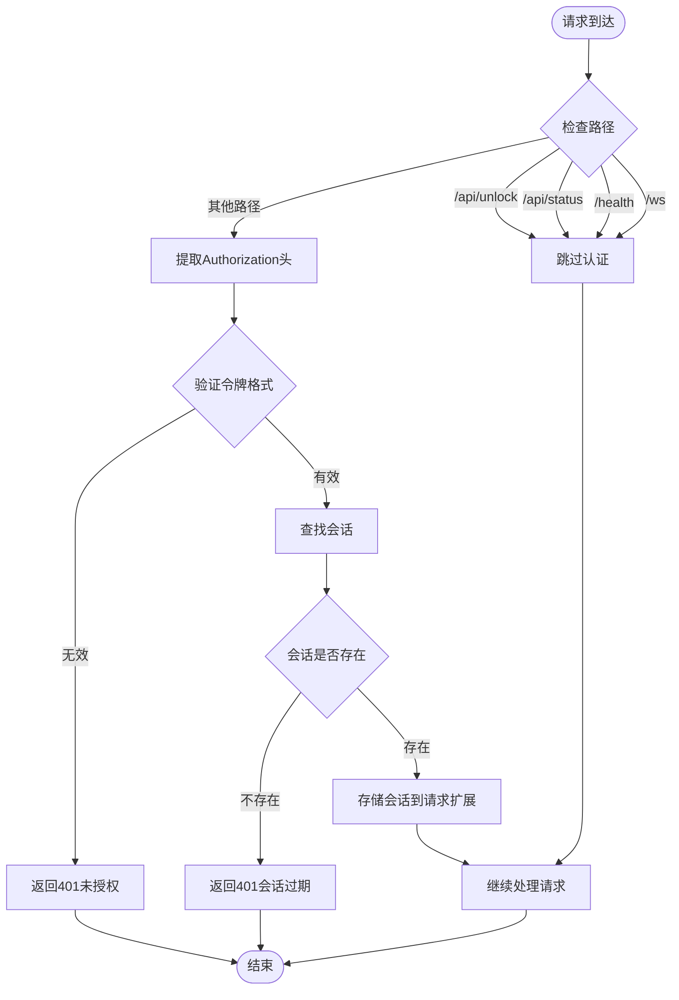

**图表来源**
- [api/src/auth.rs](file://api/src/auth.rs#L10-L36)

### Session结构体设计

后端Session结构体包含完整的会话信息：

| 字段 | 类型 | 描述 | 安全考虑 |
|------|------|------|----------|
| id | String | 唯一会话标识符 | UUID生成，不可预测 |
| created_at | DateTime<Utc> | 创建时间 | UTC时间戳 |
| expires_at | DateTime<Utc> | 过期时间 | 基于超时配置 |
| master_password | String | 主密码（明文） | 生产环境应存储派生密钥 |

**章节来源**
- [api/src/models.rs](file://api/src/models.rs#L144-L171)
- [api/src/auth.rs](file://api/src/auth.rs#L1-L37)

## 会话管理机制

### 内存中的会话存储

后端使用HashMap存储活跃会话：

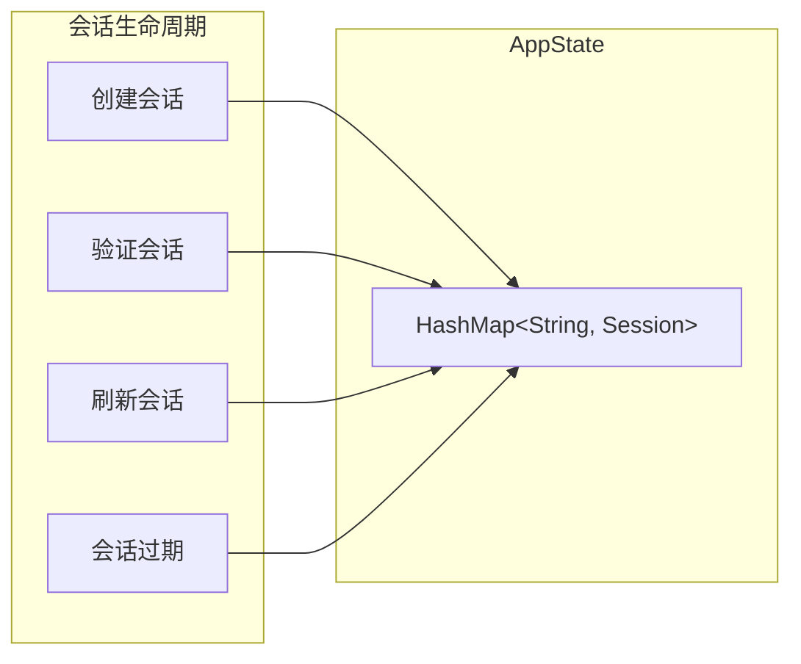

**图表来源**
- [api/src/state.rs](file://api/src/state.rs#L11-L113)

### 自动刷新逻辑

前端实现智能的会话自动刷新机制：

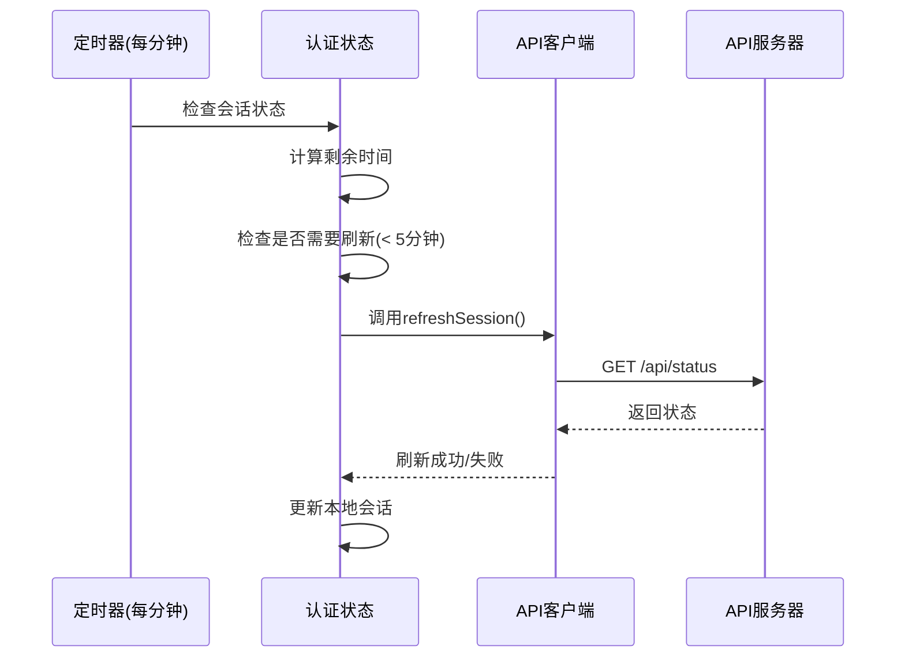

**图表来源**
- [extension/store/authStore.ts](file://extension/store/authStore.ts#L144-L157)

**章节来源**
- [api/src/state.rs](file://api/src/state.rs#L53-L68)
- [extension/store/authStore.ts](file://extension/store/authStore.ts#L144-L157)

## 自动锁定与保活机制

### 自动锁定策略

SecureFox提供灵活的自动锁定配置：

| 锁定模式 | 时间间隔 | 实现方式 | 适用场景 |
|----------|----------|----------|----------|
| 15分钟 | 15分钟 | 定时器 | 日常使用 |
| 1小时 | 60分钟 | 定时器 | 长时间工作 |
| 6小时 | 360分钟 | 定时器 | 批量操作 |
| 浏览器关闭时锁定 | -1分钟 | 保活心跳 | 高安全性需求 |

### 保活机制实现

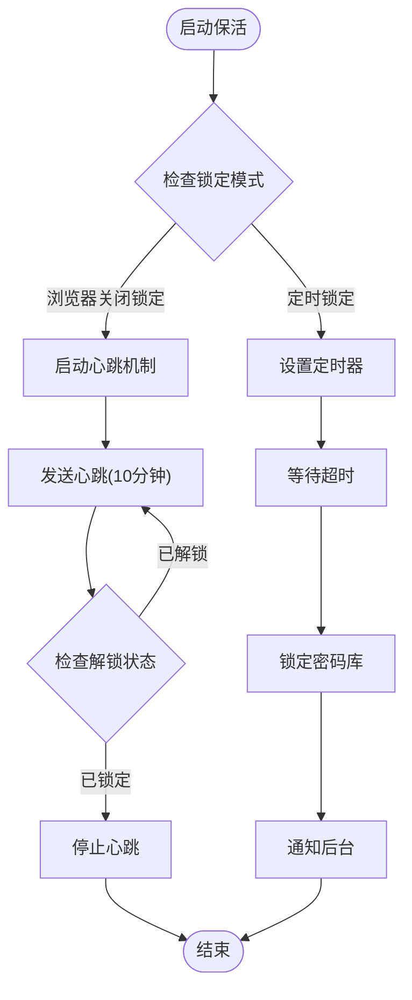

**图表来源**
- [extension/entrypoints/background.ts](file://extension/entrypoints/background.ts#L16-L89)

**章节来源**
- [extension/entrypoints/background.ts](file://extension/entrypoints/background.ts#L16-L89)

## 错误处理流程

### 认证失败处理

认证失败时的完整处理流程：

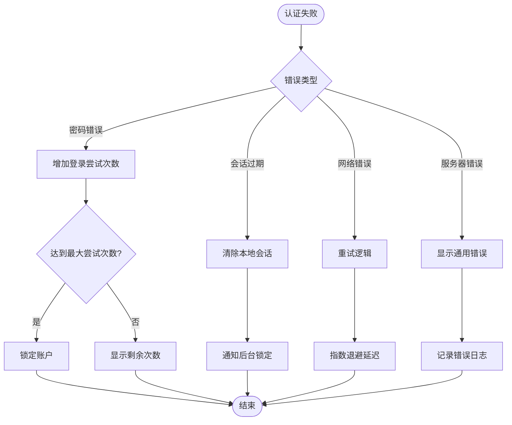

**图表来源**
- [extension/store/authStore.ts](file://extension/store/authStore.ts#L56-L70)
- [extension/lib/api/client.ts](file://extension/lib/api/client.ts#L47-L58)

### 会话过期处理

会话过期的优雅降级处理：

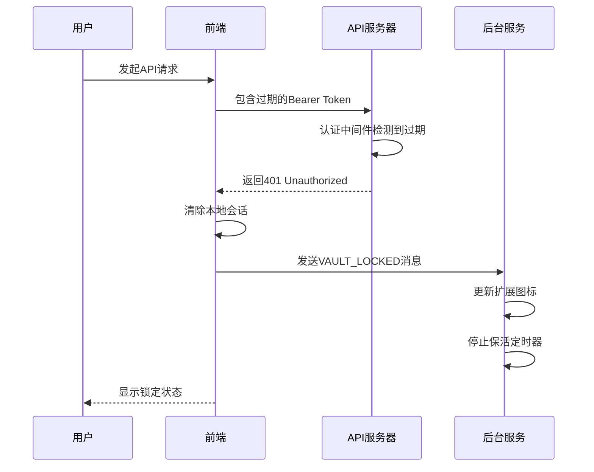

**图表来源**
- [extension/lib/api/client.ts](file://extension/lib/api/client.ts#L47-L58)

**章节来源**
- [extension/store/authStore.ts](file://extension/store/authStore.ts#L56-L70)
- [extension/lib/api/client.ts](file://extension/lib/api/client.ts#L47-L58)
- [api/src/error.rs](file://api/src/error.rs#L1-L74)

## 安全特性

### 传输安全

1. **HTTPS加密传输**：所有API通信均通过HTTPS加密
2. **Bearer Token认证**：使用标准的Bearer Token认证机制
3. **CSRF防护**：通过Origin和Referer头部验证

### 存储安全

1. **Chrome存储隔离**：使用`chrome.storage.session`进行会话存储
2. **内存保护**：敏感信息仅在内存中临时存储
3. **自动清理**：会话过期后立即清理本地存储

### 会话安全

1. **短生命周期**：默认15分钟会话有效期
2. **随机令牌**：使用UUID v4生成唯一会话令牌
3. **定期刷新**：自动刷新机制防止长期使用同一令牌

**章节来源**
- [extension/lib/api/client.ts](file://extension/lib/api/client.ts#L1-L98)
- [api/src/auth.rs](file://api/src/auth.rs#L1-L37)

## 故障排除指南

### 常见问题诊断

| 问题症状 | 可能原因 | 解决方案 |
|----------|----------|----------|
| 解锁失败 | 主密码错误 | 检查密码输入，确认无误后重试 |
| 会话过期频繁 | 自动锁定设置过短 | 调整自动锁定时间间隔 |
| API请求被拒绝 | 网络连接问题 | 检查网络连接，重启扩展 |
| 扩展图标不更新 | 后台服务异常 | 重新安装扩展或重启浏览器 |

### 调试信息收集

启用调试模式收集详细信息：

```typescript
// 在开发环境中启用详细日志
console.log('[Auth] 解锁请求:', {password: '***', timestamp: new Date()});
console.log('[API] 请求头:', config.headers);
console.log('[Session] 当前状态:', {isUnlocked, session, error});
```

### 性能监控指标

关键性能指标监控：

- **认证响应时间**：< 500ms
- **会话刷新成功率**：> 95%
- **自动锁定准确率**：± 1分钟
- **错误恢复时间**：< 30秒

**章节来源**
- [extension/components/UnlockForm.tsx](file://extension/components/UnlockForm.tsx#L1-L156)
- [extension/entrypoints/background.ts](file://extension/entrypoints/background.ts#L1-L454)