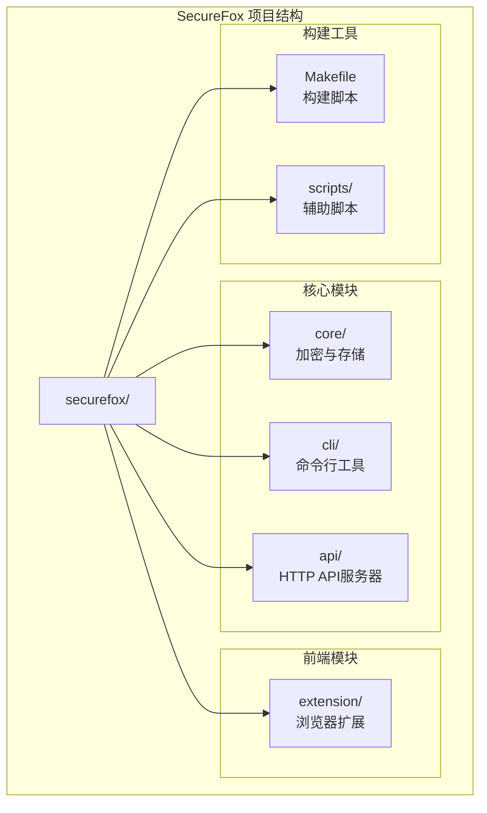
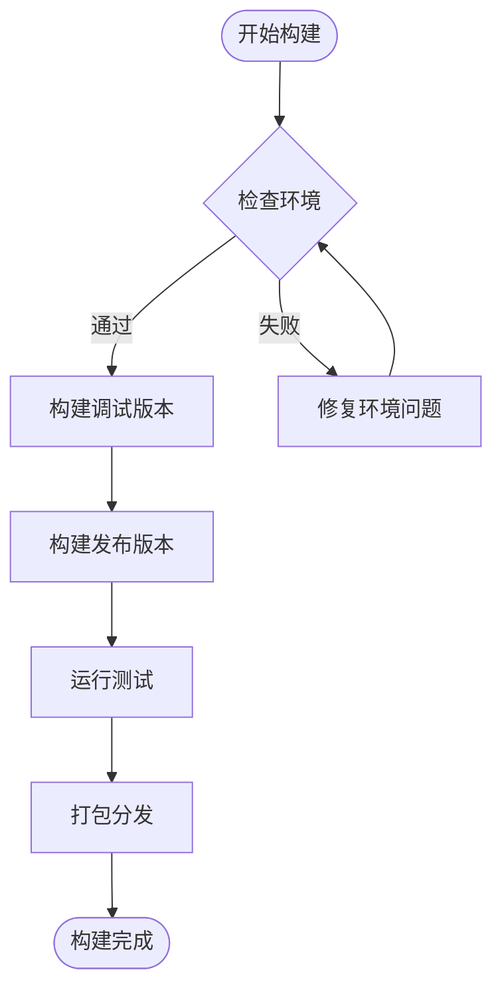
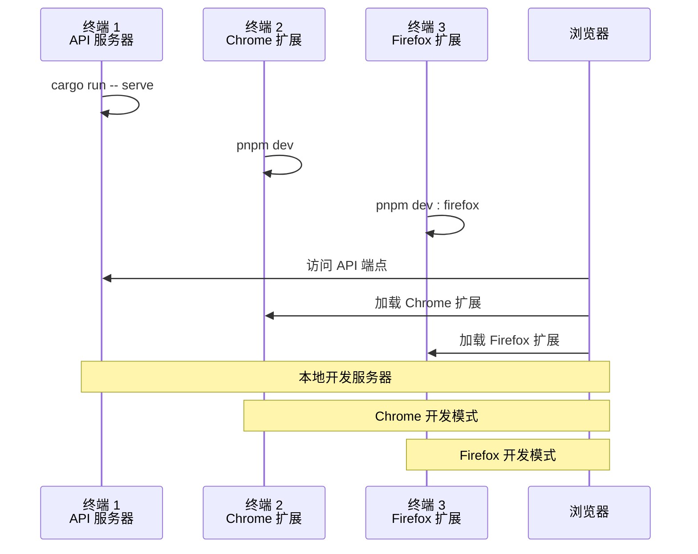
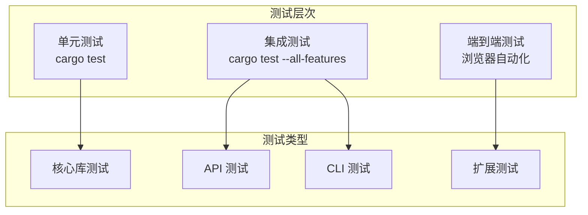
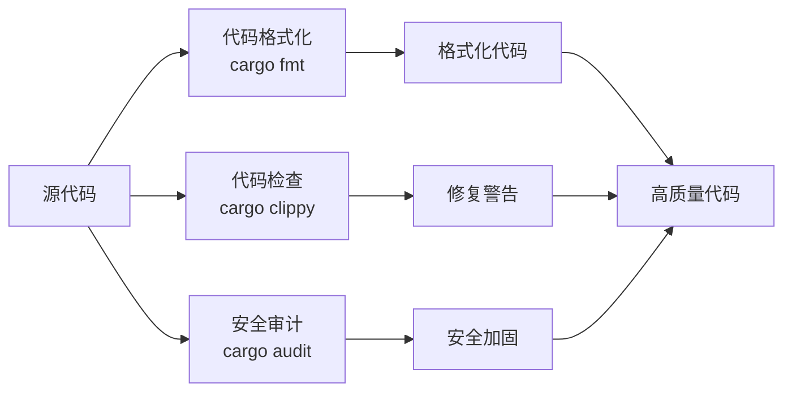
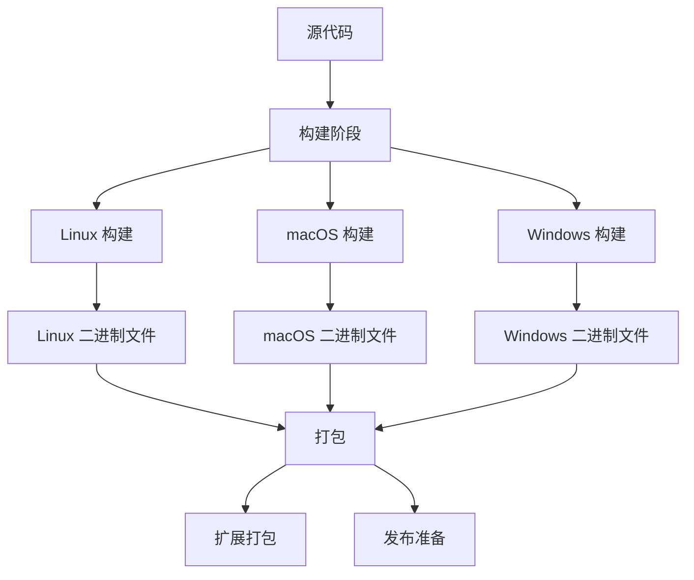

# SecureFox 开发者指南

<cite>
**本文档中引用的文件**
- [README.md](file://README.md)
- [Cargo.toml](file://Cargo.toml)
- [Makefile](file://Makefile)
- [extension/package.json](file://extension/package.json)
- [extension/wxt.config.ts](file://extension/wxt.config.ts)
- [extension/pnpm-workspace.yaml](file://extension/pnpm-workspace.yaml)
- [core/Cargo.toml](file://core/Cargo.toml)
- [api/Cargo.toml](file://api/Cargo.toml)
- [cli/Cargo.toml](file://cli/Cargo.toml)
- [scripts/generate-changelog.sh](file://scripts/generate-changelog.sh)
</cite>

## 目录
1. [简介](#简介)
2. [项目结构](#项目结构)
3. [开发环境搭建](#开发环境搭建)
4. [项目构建](#项目构建)
5. [开发服务器运行](#开发服务器运行)
6. [测试策略](#测试策略)
7. [代码质量检查](#代码质量检查)
8. [构建和发布流程](#构建和发布流程)
9. [故障排除指南](#故障排除指南)
10. [总结](#总结)

## 简介

SecureFox 是一个安全的本地优先密码管理器，具有 Git 同步功能和现代浏览器扩展。本指南将帮助您设置开发环境，运行项目，并为 SecureFox 贡献代码。

SecureFox 采用模块化架构设计：
- **核心库 (core)**: 加密、存储和数据模型
- **命令行界面 (cli)**: 完整的功能 CLI 工具
- **API 服务器 (api)**: HTTP 服务器用于浏览器扩展通信
- **浏览器扩展 (extension)**: 基于 React 和 TypeScript 的用户界面

## 项目结构



**图表来源**
- [Cargo.toml](file://Cargo.toml#L1-L23)
- [Makefile](file://Makefile#L1-L130)

**章节来源**
- [README.md](file://README.md#L227-L270)

## 开发环境搭建

### 必需条件

在开始开发之前，请确保您的系统满足以下要求：

| 组件 | 最低版本 | 推荐版本 | 用途 |
|------|----------|----------|------|
| Rust | 1.70+ | 最新稳定版 | 后端开发 |
| Node.js | 20+ | 最新 LTS | 前端开发 |
| pnpm | 8+ | 最新版本 | 包管理 |
| Git | 2.20+ | 最新版本 | 版本控制 |

### Rust 环境配置

1. **安装 Rust (推荐使用 rustup)**

```bash
# 使用官方安装脚本
curl --proto '=https' --tlsv1.2 -sSf https://sh.rustup.rs | sh

# 或者手动安装
rustup install stable
rustup default stable
```

2. **验证安装**

```bash
rustc --version
cargo --version
```

3. **添加目标平台支持**（可选）

```bash
# 为交叉编译添加目标
rustup target add x86_64-unknown-linux-gnu
rustup target add aarch64-apple-darwin
```

### Node.js 和 pnpm 配置

1. **安装 Node.js**

```bash
# 使用 nvm (推荐)
curl -o- https://raw.githubusercontent.com/nvm-sh/nvm/v0.39.0/install.sh | bash
nvm install 20
nvm use 20

# 或直接下载安装
# 从 https://nodejs.org 下载 LTS 版本
```

2. **安装 pnpm**

```bash
# 使用 npm
npm install -g pnpm

# 或使用 curl
curl -fsSL https://get.pnpm.io/install.sh | sh -
```

3. **验证安装**

```bash
node --version
pnpm --version
```

### 项目克隆和依赖安装

```bash
# 克隆仓库
git clone https://github.com/gclm/securefox.git
cd securefox

# 安装 Rust 依赖
cargo build

# 安装前端依赖
cd extension
pnpm install
```

**章节来源**
- [README.md](file://README.md#L314-L335)

## 项目构建

### 构建系统概述

SecureFox 使用 Makefile 作为主要构建工具，提供统一的构建命令：



**图表来源**
- [Makefile](file://Makefile#L1-L130)

### 基本构建命令

| 命令 | 功能 | 输出位置 |
|------|------|----------|
| `make build` | 构建调试版本 | `target/debug/` |
| `make release` | 构建优化版本 | `target/release/` |
| `make check` | 检查代码语法 | 无输出 |
| `make clean` | 清理构建产物 | 删除 `target/` |

### 构建详细步骤

1. **快速构建调试版本**

```bash
# 基本构建
make build

# 或直接使用 cargo
cargo build
```

2. **构建发布版本**

```bash
# 优化构建
make release

# 或指定目标
cargo build --release --target x86_64-apple-darwin
```

3. **增量构建**

```bash
# 只构建特定包
cargo build -p securefox-core
cargo build -p securefox-cli
cargo build -p securefox-api
```

**章节来源**
- [Makefile](file://Makefile#L33-L44)
- [Cargo.toml](file://Cargo.toml#L1-L23)

## 开发服务器运行

### API 服务器启动

SecureFox 提供了一个 HTTP API 服务器，供浏览器扩展使用：

```bash
# 在单独终端中启动 API 服务器
cargo run --bin securefox -- serve --host 127.0.0.1 --port 8787
```

**服务器配置选项：**

| 参数 | 默认值 | 描述 |
|------|--------|------|
| `--host` | `127.0.0.1` | 监听地址 |
| `--port` | `8787` | 监听端口 |
| `--timeout` | `300` | 请求超时时间(秒) |

### 浏览器扩展开发模式

#### Chrome 扩展开发

```bash
# 进入扩展目录
cd extension

# 启动 Chrome 开发模式
pnpm dev
```

开发模式特性：
- 自动热重载
- TypeScript 类型检查
- 开发工具集成
- 实时错误提示

#### Firefox 扩展开发

```bash
# 启动 Firefox 开发模式
pnpm dev:firefox
```

### 多终端开发工作流



**图表来源**
- [README.md](file://README.md#L351-L366)
- [extension/package.json](file://extension/package.json#L7-L15)

### 开发服务器配置

扩展开发服务器配置：

| 配置项 | Chrome | Firefox |
|--------|--------|---------|
| 开发端口 | 3000 | 3000 |
| 热重载 | ✓ | ✓ |
| TypeScript | ✓ | ✓ |
| CSS 预处理 | ✓ | ✓ |
| 权限配置 | Manifest V3 | Manifest V3 |

**章节来源**
- [README.md](file://README.md#L351-L366)
- [extension/wxt.config.ts](file://extension/wxt.config.ts#L1-L43)

## 测试策略

### 测试框架概览

SecureFox 采用多层次测试策略：



**图表来源**
- [README.md](file://README.md#L368-L382)
- [Makefile](file://Makefile#L51-L56)

### 单元测试

1. **运行所有单元测试**

```bash
# 基本测试
cargo test

# 包含所有特性
cargo test --all-features

# 特定包测试
cargo test -p securefox-core
cargo test -p securefox-cli
cargo test -p securefox-api
```

2. **测试过滤和控制**

```bash
# 运行特定测试
cargo test test_name

# 显示测试输出
cargo test test_name -- --nocapture

# 并行测试
cargo test -- --test-threads=4
```

### 集成测试

```bash
# 完整集成测试
cargo test --all-features

# 包含可选特性
cargo test --features git,keychain
```

### 性能测试和基准测试

```bash
# 基准测试
cargo bench

# 代码覆盖率
cargo tarpaulin --all-features --workspace --out Html
```

### 测试配置表

| 测试类型 | 命令 | 输出格式 | 用途 |
|----------|------|----------|------|
| 单元测试 | `cargo test` | 控制台输出 | 快速反馈 |
| 集成测试 | `cargo test --all-features` | HTML 报告 | 全面覆盖 |
| 基准测试 | `cargo bench` | 性能指标 | 性能优化 |
| 覆盖率测试 | `cargo tarpaulin` | HTML 报告 | 质量评估 |

**章节来源**
- [README.md](file://README.md#L368-L382)
- [Makefile](file://Makefile#L51-L56)

## 代码质量检查

### Rust 代码质量工具

SecureFox 使用多个工具确保代码质量：



**图表来源**
- [README.md](file://README.md#L384-L398)

### 代码格式化

```bash
# 格式化所有 Rust 文件
cargo fmt --all

# 检查格式而不修改
cargo fmt --all -- --check

# 格式化特定包
cargo fmt -p securefox-core
```

### 代码检查 (Clippy)

```bash
# 运行 Clippy 检查
cargo clippy --all-targets --all-features -- -D warnings

# 特定包检查
cargo clippy -p securefox-api -- -D warnings
```

### 安全审计

```bash
# 检查依赖安全漏洞
cargo audit

# 更新依赖并重新审计
cargo update
cargo audit
```

### 代码质量检查表

| 工具 | 命令 | 检查内容 | 错误级别 |
|------|------|----------|----------|
| 格式化 | `cargo fmt` | 代码风格 | 无 |
| Linter | `cargo clippy` | 代码质量 | 警告/错误 |
| 审计 | `cargo audit` | 依赖安全 | 警告/错误 |

### 开发工作流中的质量检查

```bash
# 完整的质量检查流程
cargo fmt --all -- --check
cargo clippy --all-targets --all-features -- -D warnings
cargo audit
cargo test --all-features
```

**章节来源**
- [README.md](file://README.md#L384-L398)

## 构建和发布流程

### 发布版本构建

SecureFox 支持多平台发布：



**图表来源**
- [Makefile](file://Makefile#L40-L44)
- [scripts/generate-changelog.sh](file://scripts/generate-changelog.sh#L1-L65)

### CLI 和 API 构建

```bash
# 构建优化版本
cargo build --release --all-features

# 针对特定平台
cargo build --release --target x86_64-apple-darwin
cargo build --release --target aarch64-unknown-linux-gnu
```

### 浏览器扩展构建

#### Chrome 扩展构建

```bash
cd extension

# 生产构建
pnpm build

# 创建 ZIP 包
pnpm zip
```

#### Firefox 扩展构建

```bash
cd extension

# Firefox 特定构建
pnpm build:firefox

# Firefox 特定 ZIP 包
pnpm zip:firefox
```

### 发布流程配置

| 平台 | 目标 | 输出格式 | 签名 |
|------|------|----------|------|
| Linux | `x86_64-unknown-linux-gnu` | `.tar.gz` | GPG |
| macOS | `x86_64-apple-darwin` | `.tar.gz` | Apple |
| macOS | `aarch64-apple-darwin` | `.tar.gz` | Apple |
| Windows | `x86_64-pc-windows-msvc` | `.zip` | Authenticode |

### 版本管理

```bash
# 查看当前版本
securefox version

# 生成变更日志
./scripts/generate-changelog.sh v1.0.3

# 版本发布检查清单
echo "✅ 所有测试通过"
echo "✅ 代码格式化正确"
echo "✅ 安全审计通过"
echo "✅ 文档更新"
echo "✅ 版本号更新"
```

### 自动化发布脚本

项目包含自动生成变更日志的脚本：

```bash
# 使用最新标签
./scripts/generate-changelog.sh

# 指定版本
./scripts/generate-changelog.sh v1.0.3
```

**章节来源**
- [README.md](file://README.md#L400-L414)
- [scripts/generate-changelog.sh](file://scripts/generate-changelog.sh#L1-L65)

## 故障排除指南

### 常见开发问题

#### Rust 编译问题

| 问题 | 解决方案 | 命令 |
|------|----------|------|
| 内存不足 | 增加内存或减少并行任务 | `cargo build --jobs 1` |
| 依赖冲突 | 清理并重新安装 | `cargo clean && cargo build` |
| 目标平台缺失 | 添加目标支持 | `rustup target add x86_64-unknown-linux-gnu` |

#### Node.js 环境问题

```bash
# 清理 pnpm 缓存
pnpm store prune

# 重新安装依赖
cd extension
pnpm install --force

# 检查 Node.js 版本兼容性
node --version
pnpm --version
```

#### API 服务器问题

```bash
# 检查端口占用
lsof -i :8787
netstat -tulpn | grep 8787

# 重启服务
kill $(lsof -t -i:8787)
cargo run --bin securefox -- serve
```

### 调试技巧

#### 启用详细日志

```bash
# 设置日志级别
export RUST_LOG=debug
cargo run --bin securefox -- serve

# 前端调试
cd extension
pnpm dev --verbose
```

#### 性能分析

```bash
# 使用 perf 分析
perf record cargo run --bin securefox -- serve
perf report

# 内存分析
valgrind --tool=memcheck cargo run --bin securefox -- serve
```

### 开发环境验证

```bash
# 环境检查清单
echo "=== SecureFox 开发环境检查 ==="
echo "Rust 版本: $(rustc --version)"
echo "Cargo 版本: $(cargo --version)"
echo "Node.js 版本: $(node --version)"
echo "pnpm 版本: $(pnpm --version)"

# 项目依赖检查
cd extension
pnpm install --dry-run

# 构建测试
cargo build --quiet
echo "✅ 开发环境就绪"
```

## 总结

本开发者指南涵盖了 SecureFox 项目开发的各个方面：

### 关键要点

1. **环境搭建**: 确保 Rust 1.70+, Node.js 20+, 和 pnpm 8+ 正确安装
2. **项目结构**: 理解模块化架构和各组件职责
3. **构建流程**: 掌握 Makefile 和 Cargo 构建命令
4. **开发工作流**: 学会同时运行 API 服务器和浏览器扩展
5. **测试策略**: 实施全面的测试覆盖和质量保证
6. **代码质量**: 使用格式化、检查和审计工具维护代码质量
7. **发布流程**: 了解多平台构建和打包过程

### 开发建议

- 使用 `make dev` 进行快速开发更新
- 定期运行完整测试套件确保代码质量
- 遵循代码格式化和 Lint 规则
- 关注安全审计结果及时修复漏洞
- 利用热重载功能提高开发效率

### 贡献指南

欢迎为 SecureFox 贡献代码！请遵循项目的编码规范和测试要求，提交 Pull Request 前确保所有检查通过。

通过本指南，您应该能够成功设置开发环境，运行项目，并为 SecureFox 的持续改进做出贡献。