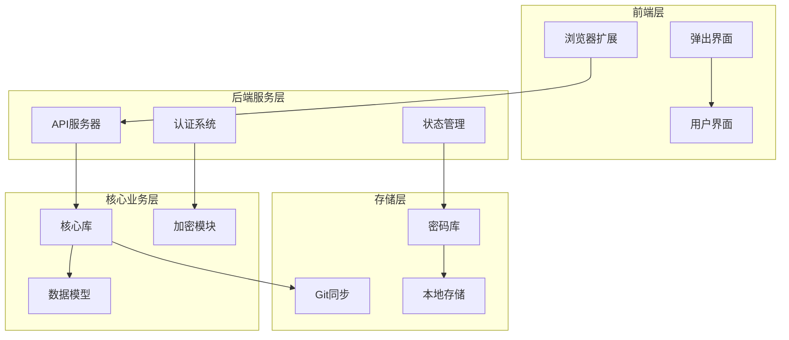
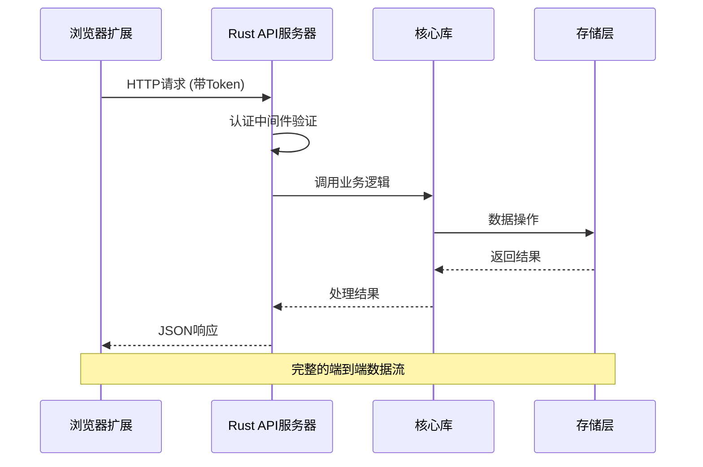
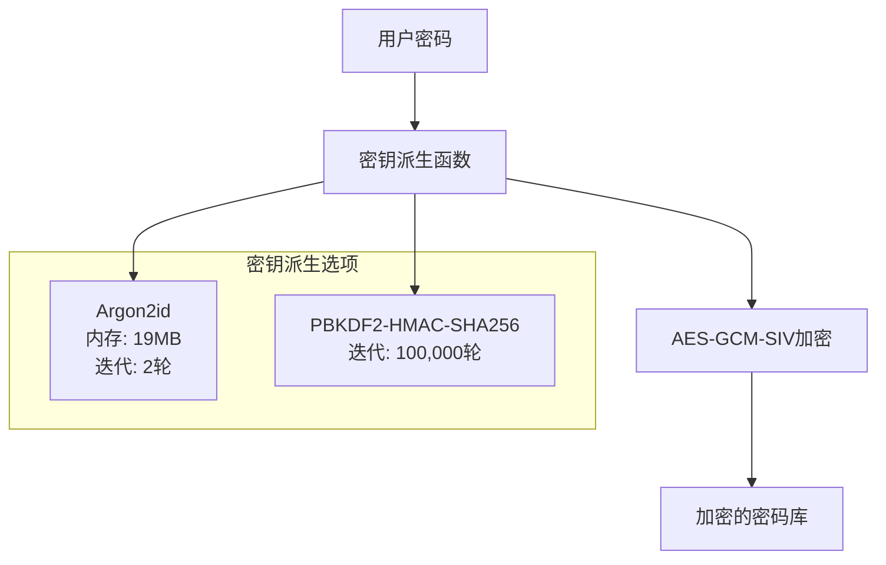

# 技术栈

<cite>
**本文档中引用的文件**
- [Cargo.toml](file://Cargo.toml)
- [api/Cargo.toml](file://api/Cargo.toml)
- [cli/Cargo.toml](file://cli/Cargo.toml)
- [core/Cargo.toml](file://core/Cargo.toml)
- [extension/package.json](file://extension/package.json)
- [api/src/lib.rs](file://api/src/lib.rs)
- [core/src/crypto.rs](file://core/src/crypto.rs)
- [extension/wxt.config.ts](file://extension/wxt.config.ts)
- [extension/tailwind.config.js](file://extension/tailwind.config.js)
- [extension/tsconfig.json](file://extension/tsconfig.json)
- [extension/store/index.ts](file://extension/store/index.ts)
- [extension/lib/api/client.ts](file://extension/lib/api/client.ts)
- [extension/entrypoints/popup/App.tsx](file://extension/entrypoints/popup/App.tsx)
- [extension/postcss.config.js](file://extension/postcss.config.js)
- [core/src/models.rs](file://core/src/models.rs)
- [api/src/state.rs](file://api/src/state.rs)
- [extension/store/vaultStore.ts](file://extension/store/vaultStore.ts)
</cite>

## 目录
1. [概述](#概述)
2. [项目架构](#项目架构)
3. [Rust 后端技术栈](#rust-后端技术栈)
4. [TypeScript 前端技术栈](#typescript-前端技术栈)
5. [技术选型原因](#技术选型原因)
6. [全栈协作机制](#全栈协作机制)
7. [安全特性](#安全特性)
8. [性能考虑](#性能考虑)
9. [总结](#总结)

## 概述

SecureFox 是一个本地优先的密码管理器，采用 Rust 和 TypeScript 双技术栈构建，为用户提供安全、高效的密码管理解决方案。该项目通过前后端分离的设计模式，实现了强大的密码加密存储、同步功能和浏览器扩展支持。

## 项目架构

SecureFox 采用模块化的架构设计，包含以下主要组件：

**图表来源**
- [api/src/lib.rs](file://api/src/lib.rs#L25-L93)
- [core/src/models.rs](file://core/src/models.rs#L1-L50)
- [extension/entrypoints/popup/App.tsx](file://extension/entrypoints/popup/App.tsx#L1-L31)

**章节来源**
- [Cargo.toml](file://Cargo.toml#L1-L23)
- [api/Cargo.toml](file://api/Cargo.toml#L1-L54)
- [extension/package.json](file://extension/package.json#L1-L47)

## Rust 后端技术栈

### 核心框架与运行时

SecureFox 的后端基于 Rust 构建，采用了现代化的异步编程技术和企业级框架：

#### Axum Web 框架
- **版本**: 0.7.x
- **功能**: 提供高性能的 HTTP 服务器和路由处理
- **特性**: 支持 WebSocket、中间件、请求/响应拦截
- **应用场景**: RESTful API 端点、认证中间件、CORS 配置

#### Tokio 异步运行时
- **版本**: 1.35+
- **功能**: 提供异步 I/O、任务调度和并发控制
- **特性**: 全功能异步运行时，支持多线程执行器
- **应用场景**: 数据库连接、网络请求、文件操作

#### Serde 序列化框架
- **版本**: 1.0.x
- **功能**: 提供类型安全的数据序列化和反序列化
- **特性**: 支持 derive 宏，自动实现序列化接口
- **应用场景**: API 请求/响应处理、配置文件读写

### 加密与安全技术

SecureFox 实现了业界标准的加密方案：

#### AES-GCM-SIV 加密算法
- **版本**: 0.11.x
- **算法**: AES-256-GCM-SIV（合成身份验证加密）
- **特性**: 无随机数依赖的 AEAD 加密
- **应用场景**: 敏感数据的端到端加密

#### Argon2 密钥派生函数
- **版本**: 0.5.x
- **算法**: Argon2id（内存硬函数）
- **参数**: 19MB 内存、2 轮迭代、单线程并行
- **应用场景**: 用户密码的安全存储和验证

### 数据持久化与同步

#### Git 版本控制集成
- **库**: git2 0.18.x
- **功能**: 自动化的数据版本控制和同步
- **特性**: 支持 HTTPS 和 SSH 协议
- **应用场景**: 密码库的分布式备份和恢复

#### 文件系统存储
- **库**: dirs 5.0.x
- **功能**: 跨平台的配置文件和数据目录管理
- **应用场景**: 密码库文件的本地存储

**章节来源**
- [api/Cargo.toml](file://api/Cargo.toml#L16-L28)
- [core/Cargo.toml](file://core/Cargo.toml#L9-L20)
- [core/src/crypto.rs](file://core/src/crypto.rs#L1-L321)

## TypeScript 前端技术栈

### React 19 UI 框架

SecureFox 使用最新的 React 19 构建用户界面：

#### React 19 核心特性
- **版本**: ^19.1.1
- **功能**: 组件化 UI 开发，虚拟 DOM 渲染
- **特性**: 新的并发渲染特性、改进的错误边界
- **应用场景**: 浏览器扩展的主界面和弹出窗口

#### WXT 浏览器扩展框架
- **版本**: ^0.20.6
- **功能**: 现代化的浏览器扩展开发工具链
- **特性**: 支持 MV3 规范、热重载开发、跨浏览器兼容
- **应用场景**: Chrome/Firefox 扩展的构建和打包

### 状态管理与数据流

#### Zustand 状态管理
- **版本**: ^4.4.0
- **功能**: 轻量级的状态管理解决方案
- **特性**: 类型安全、极简 API、中间件支持
- **应用场景**: 全局状态管理、用户认证状态、密码库数据

#### TanStack Query 数据获取
- **版本**: ^5.0.0
- **功能**: 服务端状态管理，数据缓存和同步
- **特性**: 自动重试、后台刷新、乐观更新
- **应用场景**: 与后端 API 的数据同步、离线支持

### 样式与布局系统

#### Tailwind CSS 工具类框架
- **版本**: ^3.3.0
- **功能**: 实用优先的 CSS 框架
- **特性**: 响应式设计、主题定制、性能优化
- **应用场景**: 组件样式定义、主题一致性

#### PostCSS 处理管道
- **功能**: CSS 后处理器，提供现代 CSS 特性
- **特性**: Autoprefixer、Tailwind CSS 集成
- **应用场景**: CSS 预处理和优化

**章节来源**
- [extension/package.json](file://extension/package.json#L18-L32)
- [extension/wxt.config.ts](file://extension/wxt.config.ts#L1-L43)
- [extension/tailwind.config.js](file://extension/tailwind.config.js#L1-L70)

## 技术选型原因

### Rust 后端的优势

#### 性能与安全性
- **内存安全**: Rust 的所有权系统确保内存安全，防止常见的安全漏洞
- **零成本抽象**: 异步编程开销最小化，提供接近 C 的性能
- **编译时检查**: 大量的编译时错误检查，减少运行时错误

#### 生态系统成熟度
- **活跃社区**: Rust 社区快速增长，生态系统日益完善
- **工具链完整**: Cargo 包管理器、Rustfmt、Clippy 等工具
- **跨平台支持**: 良好的跨平台编译支持

### TypeScript 前端的优势

#### 开发体验
- **类型安全**: 强类型系统减少运行时错误
- **现代语法**: 支持最新的 JavaScript 特性
- **丰富的生态**: 丰富的第三方库和工具支持

#### 浏览器扩展开发
- **标准化**: WXT 提供标准化的扩展开发流程
- **热重载**: 开发时的热重载支持提高开发效率
- **跨浏览器**: 统一的开发体验支持多个浏览器

### 技术栈协同优势

#### 全栈统一语言
- **类型一致性**: Rust 和 TypeScript 的类型系统相互补充
- **API 设计**: 共享的数据模型确保前后端数据结构一致
- **错误处理**: 统一的错误处理机制

#### 安全性保障
- **端到端加密**: Rust 后端提供强加密，TypeScript 前端负责用户体验
- **零信任架构**: 每次交互都需要认证，确保数据安全
- **本地优先**: 数据主要存储在本地，减少云端暴露风险

## 全栈协作机制

### API 通信架构

**图表来源**
- [extension/lib/api/client.ts](file://extension/lib/api/client.ts#L1-L98)
- [api/src/state.rs](file://api/src/state.rs#L25-L67)

### 状态同步机制

#### 前端状态管理
- **Zustand Store**: 管理全局状态，包括认证状态、密码库数据
- **React Query**: 处理与后端的异步数据同步
- **实时更新**: 通过 WebSocket 或轮询机制保持状态同步

#### 后端状态管理
- **内存缓存**: 使用 Arc<RwLock> 实现线程安全的状态共享
- **会话管理**: 基于 JWT 的认证令牌管理
- **数据持久化**: 自动保存和 Git 同步机制

**章节来源**
- [extension/store/vaultStore.ts](file://extension/store/vaultStore.ts#L1-L233)
- [api/src/state.rs](file://api/src/state.rs#L1-L113)

## 安全特性

### 加密体系架构

**图表来源**
- [core/src/crypto.rs](file://core/src/crypto.rs#L129-L173)

### 安全最佳实践

#### 数据保护
- **端到端加密**: 所有敏感数据在客户端加密存储
- **密钥管理**: 使用安全的密钥派生函数
- **内存安全**: 自动清理敏感数据，防止内存泄露

#### 网络安全
- **HTTPS 通信**: 所有 API 通信都使用 HTTPS
- **认证机制**: 基于 JWT 的无状态认证
- **会话超时**: 自动的会话过期机制

#### 存储安全
- **本地优先**: 数据主要存储在本地设备
- **Git 同步**: 可选的版本控制同步，支持私有仓库
- **访问控制**: 基于密码的访问控制

**章节来源**
- [core/src/crypto.rs](file://core/src/crypto.rs#L265-L271)
- [extension/lib/api/client.ts](file://extension/lib/api/client.ts#L47-L58)

## 性能考虑

### 后端性能优化

#### 异步处理
- **非阻塞 I/O**: 使用 Tokio 运行时处理并发请求
- **连接池**: 数据库连接的高效管理
- **缓存策略**: 内存缓存减少磁盘 I/O

#### 内存管理
- **零拷贝**: 尽可能使用引用避免不必要的数据复制
- **智能指针**: 使用 Arc 和 RwLock 实现高效的内存共享
- **垃圾回收**: Rust 的自动内存管理减少泄漏风险

### 前端性能优化

#### React 19 优化
- **并发渲染**: 利用新的并发特性提升用户体验
- **懒加载**: 组件级别的代码分割
- **记忆化**: React.memo 和 useMemo 的合理使用

#### 状态管理优化
- **细粒度更新**: Zustand 的精确状态更新
- **查询缓存**: TanStack Query 的智能缓存策略
- **批量操作**: 减少不必要的重新渲染

### 网络性能

#### API 优化
- **请求合并**: 减少网络往返次数
- **压缩传输**: Gzip 压缩减少传输数据量
- **长连接**: WebSocket 支持实时通信

**章节来源**
- [api/src/lib.rs](file://api/src/lib.rs#L95-L113)
- [extension/store/vaultStore.ts](file://extension/store/vaultStore.ts#L87-L104)

## 总结

SecureFox 的技术栈体现了现代软件开发的最佳实践：

### 技术栈优势

1. **安全性优先**: Rust 的内存安全特性和强加密算法确保数据安全
2. **性能卓越**: 异步编程和现代框架提供优秀的用户体验
3. **开发效率**: 类型安全和完善的工具链提高开发质量
4. **可维护性**: 模块化设计和清晰的架构便于长期维护

### 技术创新

- **本地优先理念**: 强调数据隐私和离线可用性
- **全栈统一**: Rust 和 TypeScript 的完美结合
- **现代化工具链**: 最新技术和最佳实践的应用

### 发展前景

SecureFox 的技术栈为未来的功能扩展奠定了坚实基础：
- **插件系统**: 域名匹配和自动填充功能
- **多平台支持**: 跨平台的密码管理器
- **云同步**: 可选的云端同步服务
- **生物识别**: 集成现代设备的生物识别功能

通过精心选择的技术栈，SecureFox 成功地平衡了安全性、性能和开发效率，为用户提供了可靠、高效的密码管理解决方案。