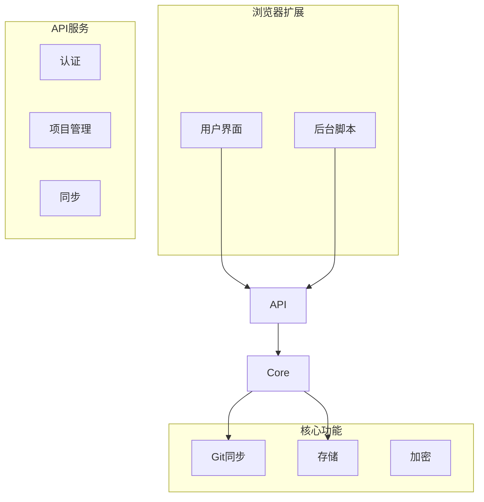
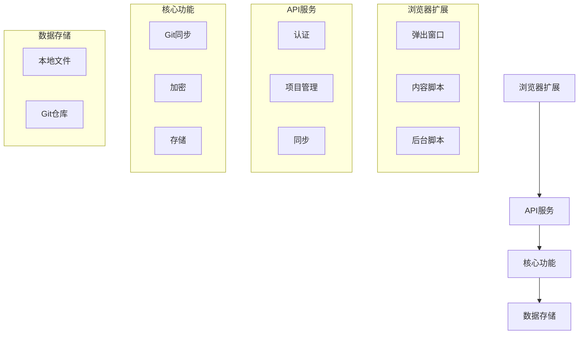
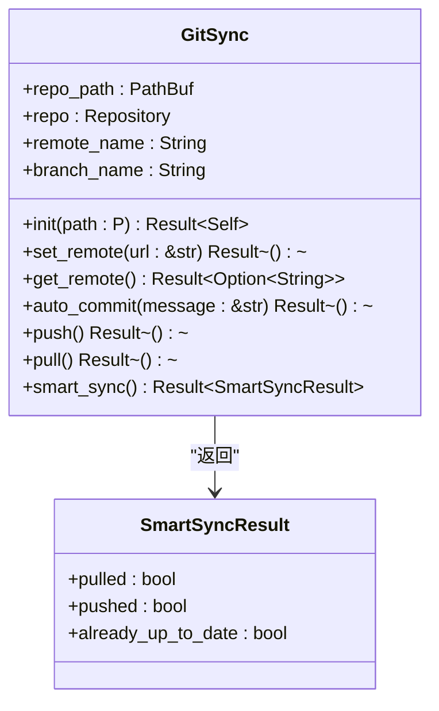
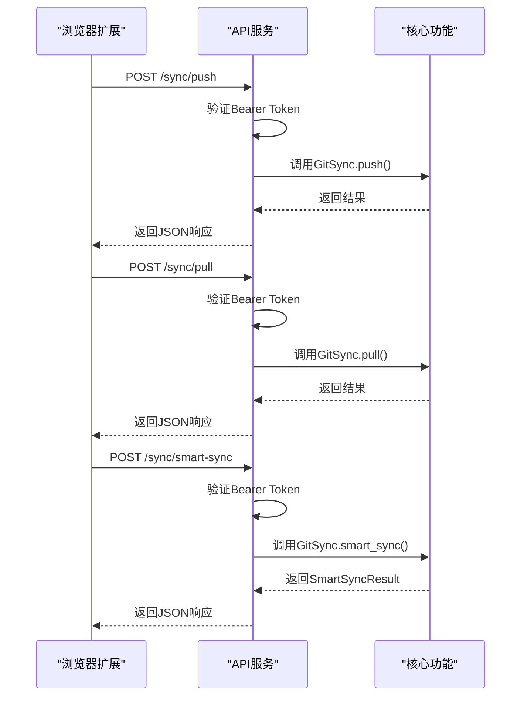
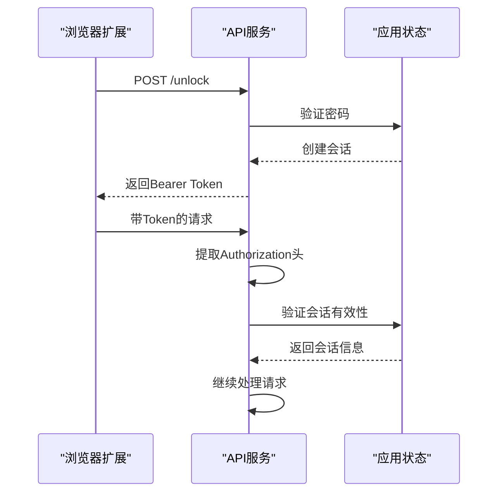
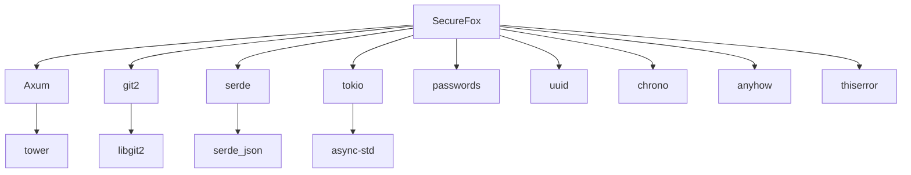

# API同步端点

<cite>
**本文档引用的文件**
- [lib.rs](file://api/src/lib.rs)
- [handlers/mod.rs](file://api/src/handlers/mod.rs)
- [models.rs](file://api/src/models.rs)
- [error.rs](file://api/src/error.rs)
- [auth.rs](file://api/src/auth.rs)
- [git_sync.rs](file://core/src/git_sync.rs)
- [client.ts](file://extension/lib/api/client.ts)
</cite>

## 目录
1. [简介](#简介)
2. [项目结构](#项目结构)
3. [核心组件](#核心组件)
4. [架构概述](#架构概述)
5. [详细组件分析](#详细组件分析)
6. [依赖分析](#依赖分析)
7. [性能考虑](#性能考虑)
8. [故障排除指南](#故障排除指南)
9. [结论](#结论)

## 简介
本文档详细介绍了SecureFox浏览器扩展如何通过HTTP接口与核心同步功能进行交互。文档重点说明了`/sync/pull`、`/sync/push`和`/sync/status`等RESTful端点的HTTP方法、请求/响应格式和认证机制（Bearer Token）。文档还解释了每个端点如何调用`core`模块的`GitSync`实例执行相应操作，并将结果序列化为JSON返回。此外，文档描述了`/sync/smart-sync`端点如何封装`smart_sync`逻辑，实现一键同步功能。文档提供了curl命令示例展示如何手动调用这些API，并包含了错误处理策略，如网络不可达、Git认证失败等情况下的HTTP状态码（400, 401, 500）和错误响应体结构。

## 项目结构
SecureFox项目采用模块化设计，主要分为API、CLI、核心功能和浏览器扩展四个部分。API模块负责提供HTTP接口，CLI模块提供命令行工具，核心功能模块实现密码管理的核心逻辑，浏览器扩展则提供用户界面和与浏览器的集成。

**图示来源**
- [lib.rs](file://api/src/lib.rs#L26-L102)
- [git_sync.rs](file://core/src/git_sync.rs#L13-L462)

**本节来源**
- [lib.rs](file://api/src/lib.rs#L1-L141)
- [project_structure](file://project_structure)

## 核心组件
本文档的核心组件包括API服务、Git同步功能和浏览器扩展。API服务通过Axum框架提供RESTful接口，Git同步功能通过git2库实现，浏览器扩展则通过TypeScript和React实现用户界面。

**本节来源**
- [lib.rs](file://api/src/lib.rs#L1-L141)
- [git_sync.rs](file://core/src/git_sync.rs#L1-L503)
- [client.ts](file://extension/lib/api/client.ts#L1-L39)

## 架构概述
SecureFox的架构采用分层设计，从上到下分为用户界面层、API服务层、核心功能层和数据存储层。用户界面层由浏览器扩展实现，API服务层由Rust编写的Axum应用实现，核心功能层包含密码管理的所有核心逻辑，数据存储层负责数据的持久化。

**图示来源**
- [lib.rs](file://api/src/lib.rs#L26-L102)
- [git_sync.rs](file://core/src/git_sync.rs#L13-L462)

## 详细组件分析
### 同步端点分析
同步端点是SecureFox的核心功能之一，允许用户在不同设备间同步密码数据。这些端点通过Git实现分布式版本控制，确保数据的一致性和完整性。

#### 同步端点实现

**图示来源**
- [git_sync.rs](file://core/src/git_sync.rs#L13-L462)

**本节来源**
- [git_sync.rs](file://core/src/git_sync.rs#L1-L503)
- [handlers/mod.rs](file://api/src/handlers/mod.rs#L349-L367)

#### API端点调用流程

**图示来源**
- [lib.rs](file://api/src/lib.rs#L64-L65)
- [git_sync.rs](file://core/src/git_sync.rs#L126-L219)
- [git_sync.rs](file://core/src/git_sync.rs#L443-L462)

**本节来源**
- [lib.rs](file://api/src/lib.rs#L1-L141)
- [handlers/mod.rs](file://api/src/handlers/mod.rs#L349-L367)
- [git_sync.rs](file://core/src/git_sync.rs#L1-L503)

### 认证机制
SecureFox使用Bearer Token进行API认证，确保只有授权用户才能访问敏感数据。

#### 认证流程

**图示来源**
- [auth.rs](file://api/src/auth.rs#L10-L36)
- [handlers/mod.rs](file://api/src/handlers/mod.rs#L9-L47)

**本节来源**
- [auth.rs](file://api/src/auth.rs#L1-L36)
- [handlers/mod.rs](file://api/src/handlers/mod.rs#L1-L47)
- [models.rs](file://api/src/models.rs#L144-L170)

## 依赖分析
SecureFox项目依赖多个外部库来实现其功能，包括Axum用于Web服务，git2用于Git操作，serde用于序列化，以及各种加密和安全相关的库。

**图示来源**
- [Cargo.toml](file://Cargo.toml)
- [api/Cargo.toml](file://api/Cargo.toml)
- [core/Cargo.toml](file://core/Cargo.toml)

**本节来源**
- [Cargo.toml](file://Cargo.toml)
- [api/Cargo.toml](file://api/Cargo.toml)
- [core/Cargo.toml](file://core/Cargo.toml)

## 性能考虑
在设计API同步端点时，需要考虑多个性能因素，包括网络延迟、Git操作的效率以及并发访问的处理。

- **网络优化**：使用HTTP/2和压缩来减少传输时间
- **Git效率**：通过智能同步减少不必要的拉取和推送操作
- **并发处理**：使用异步I/O和非阻塞操作提高并发性能
- **缓存策略**：在客户端和服务器端实现适当的缓存机制

## 故障排除指南
### 常见错误及解决方案
当使用API同步端点时，可能会遇到各种错误。以下是常见错误及其解决方案：

| 错误代码 | 错误信息 | 可能原因 | 解决方案 |
|---------|--------|--------|--------|
| 400 | Bad request | 请求格式错误 | 检查请求体格式是否正确 |
| 401 | Unauthorized | 认证失败 | 检查Bearer Token是否有效 |
| 404 | Not found | 资源不存在 | 检查请求的URL是否正确 |
| 500 | Internal error | 服务器内部错误 | 检查服务器日志获取详细信息 |
| 502 | Bad Gateway | 网络连接问题 | 检查网络连接和Git远程地址 |

**本节来源**
- [error.rs](file://api/src/error.rs#L1-L74)
- [git_sync.rs](file://core/src/git_sync.rs#L307-L349)

### 调试技巧
- 使用curl命令测试API端点
- 检查服务器日志获取详细错误信息
- 验证Git远程地址和凭据
- 确保Vault已解锁

## 结论
SecureFox的API同步端点提供了一套完整的解决方案，用于在不同设备间安全地同步密码数据。通过Git实现的分布式版本控制确保了数据的一致性和完整性，而Bearer Token认证机制则保证了数据的安全性。浏览器扩展通过HTTP接口与核心同步功能交互，为用户提供了一个无缝的跨设备体验。