# CLI后台同步守护进程

<cite>
**本文档中引用的文件**
- [sync_daemon.rs](file://cli/src/sync_daemon.rs)
- [models.rs](file://core/src/models.rs)
- [config.rs](file://core/src/config.rs)
- [git_sync.rs](file://core/src/git_sync.rs)
- [sync_config.rs](file://cli/src/commands/sync_config.rs)
- [sync_enable.rs](file://cli/src/commands/sync_enable.rs)
- [sync_status.rs](file://cli/src/commands/sync_status.rs)
- [main.rs](file://cli/src/main.rs)
</cite>

## 目录
1. [简介](#简介)
2. [项目结构](#项目结构)
3. [核心组件](#核心组件)
4. [架构概览](#架构概览)
5. [详细组件分析](#详细组件分析)
6. [依赖关系分析](#依赖关系分析)
7. [性能考虑](#性能考虑)
8. [故障排除指南](#故障排除指南)
9. [结论](#结论)

## 简介

SecureFox CLI同步守护进程是一个基于Rust的后台服务，专门负责自动同步密码保险库。该守护进程采用异步架构设计，支持定时拉取远程更新并在保险库发生变更时自动推送本地更改。守护进程的核心设计理念是"仅负责自动拉取，推送操作由用户主动修改保险库时触发"，这种设计确保了数据同步的安全性和可控性。

## 项目结构

CLI同步守护进程位于SecureFox项目的`cli/src/`目录下，主要包含以下关键文件：

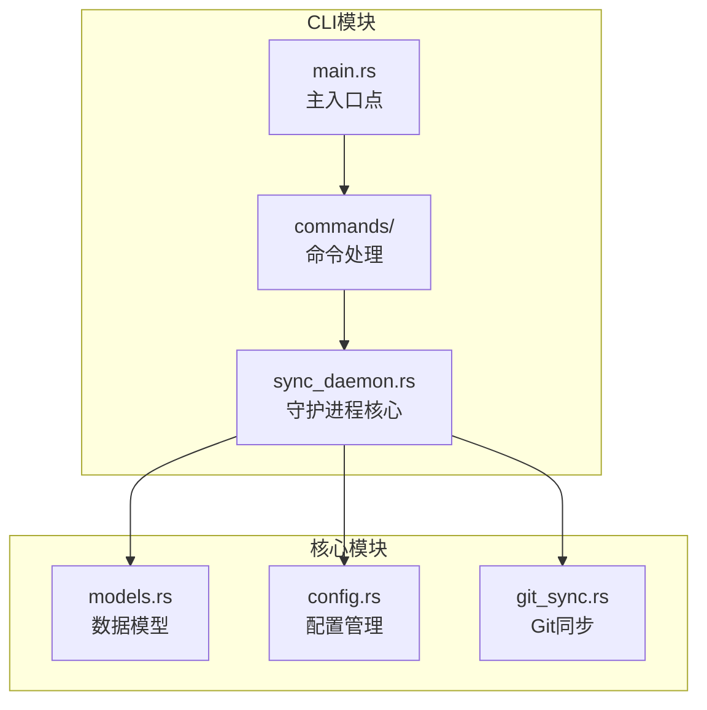

**图表来源**
- [sync_daemon.rs](file://cli/src/sync_daemon.rs#L1-L112)
- [models.rs](file://core/src/models.rs#L1-L416)
- [config.rs](file://core/src/config.rs#L1-L98)

**章节来源**
- [sync_daemon.rs](file://cli/src/sync_daemon.rs#L1-L112)
- [models.rs](file://core/src/models.rs#L1-L416)

## 核心组件

### SyncDaemon结构体

SyncDaemon是守护进程的核心结构体，负责管理整个同步过程：

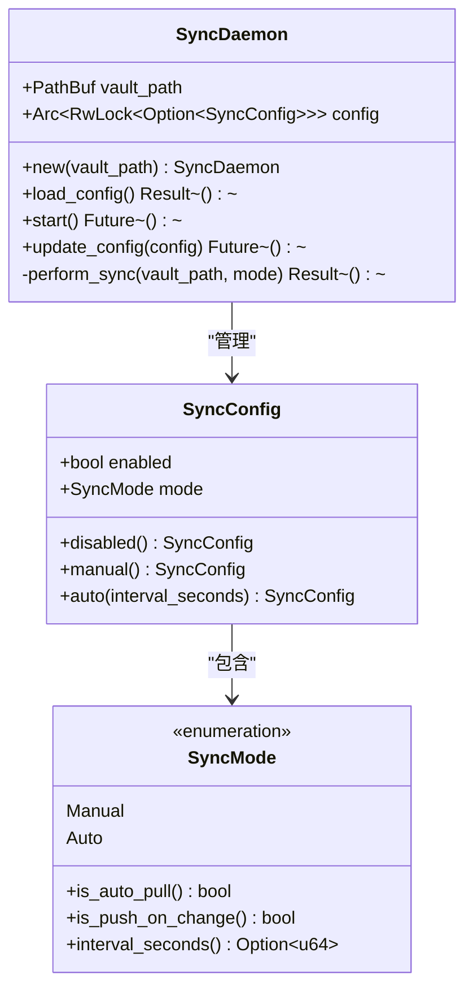

**图表来源**
- [sync_daemon.rs](file://cli/src/sync_daemon.rs#L14-L17)
- [models.rs](file://core/src/models.rs#L298-L326)
- [models.rs](file://core/src/models.rs#L335-L362)

### 配置系统

守护进程使用分层配置系统，通过`SyncConfigFile`结构体管理配置信息：

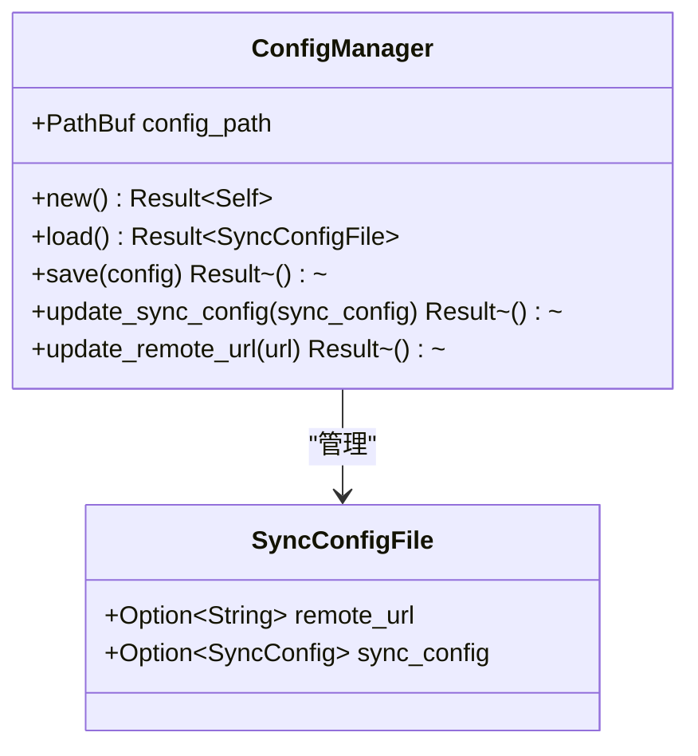

**图表来源**
- [models.rs](file://core/src/models.rs#L367-L377)
- [config.rs](file://core/src/config.rs#L18-L98)

**章节来源**
- [sync_daemon.rs](file://cli/src/sync_daemon.rs#L14-L17)
- [models.rs](file://core/src/models.rs#L298-L377)
- [config.rs](file://core/src/config.rs#L18-L98)

## 架构概览

CLI同步守护进程采用事件驱动的异步架构，通过Tokio运行时管理并发任务：

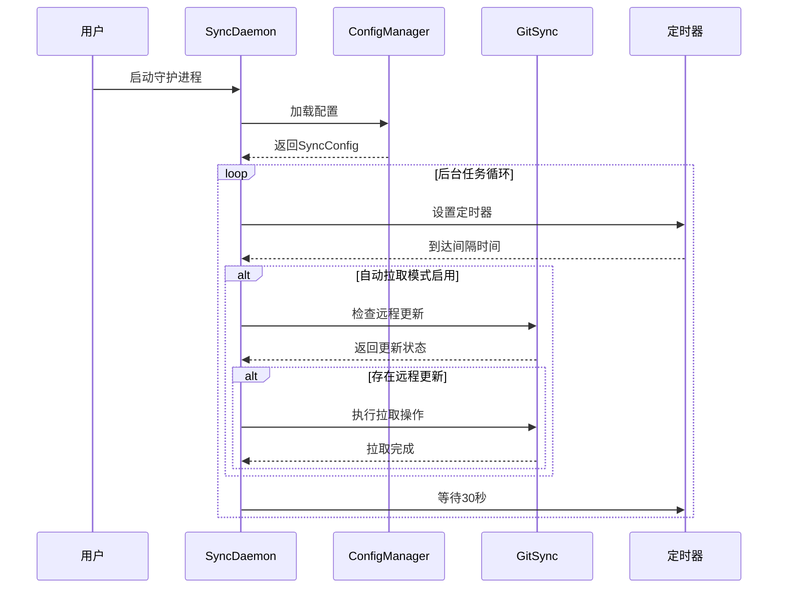

**图表来源**
- [sync_daemon.rs](file://cli/src/sync_daemon.rs#L43-L81)
- [git_sync.rs](file://core/src/git_sync.rs#L403-L439)

## 详细组件分析

### SyncDaemon初始化与配置加载

SyncDaemon的初始化过程展示了其并发安全的设计：

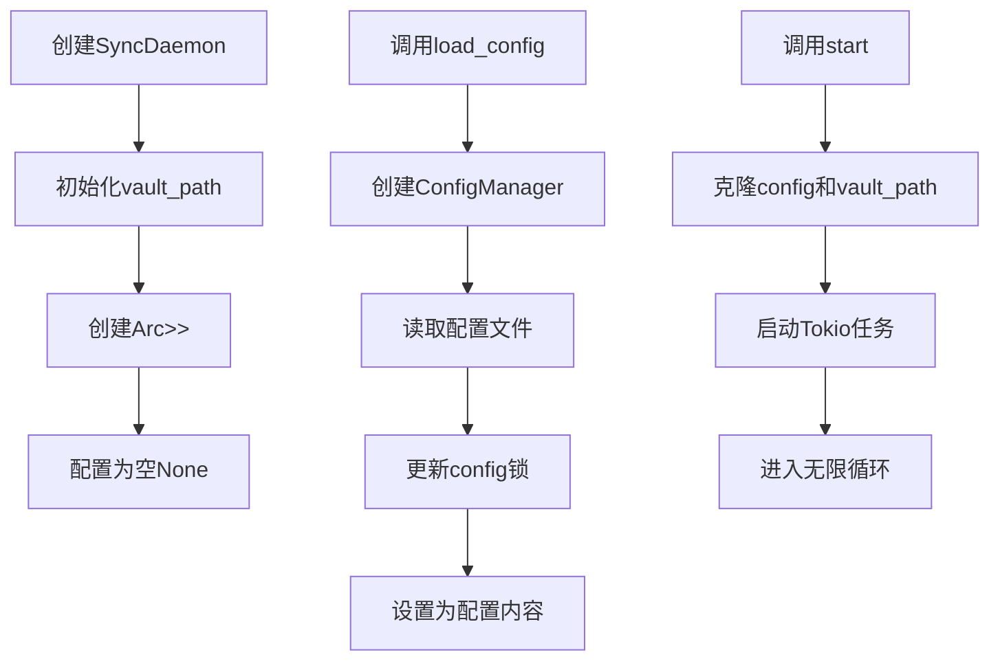

**图表来源**
- [sync_daemon.rs](file://cli/src/sync_daemon.rs#L22-L39)
- [sync_daemon.rs](file://cli/src/sync_daemon.rs#L43-L81)

#### 并发安全设计

守护进程使用`Arc<RwLock<Option<SyncConfig>>>`实现线程安全的配置访问：

- **Arc (Atomic Reference Counted)**：允许多个任务共享配置所有权
- **RwLock (Read-Write Lock)**：支持多个读者或单个写者
- **Option<SyncConfig>**：表示配置可能不存在（初始状态）

这种设计允许：
- 多个后台任务同时读取配置
- 单个任务安全地更新配置
- 避免竞态条件和数据竞争

**章节来源**
- [sync_daemon.rs](file://cli/src/sync_daemon.rs#L22-L39)

### 异步配置加载机制

`load_config`方法展示了异步配置加载的完整流程：

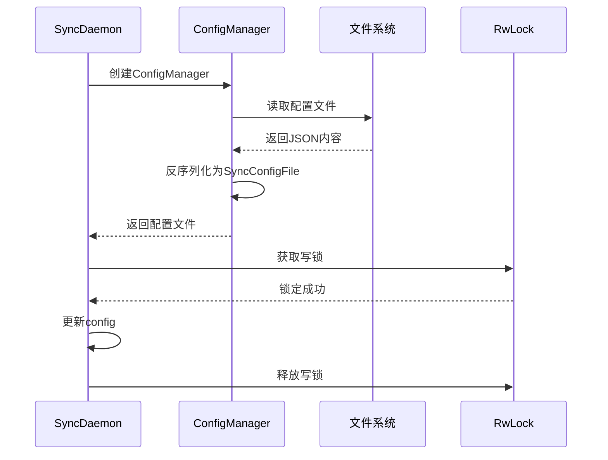

**图表来源**
- [sync_daemon.rs](file://cli/src/sync_daemon.rs#L31-L39)
- [config.rs](file://core/src/config.rs#L68-L77)

**章节来源**
- [sync_daemon.rs](file://cli/src/sync_daemon.rs#L31-L39)
- [config.rs](file://core/src/config.rs#L68-L77)

### 后台任务循环实现

`start`方法实现了守护进程的核心逻辑，采用智能轮询策略：

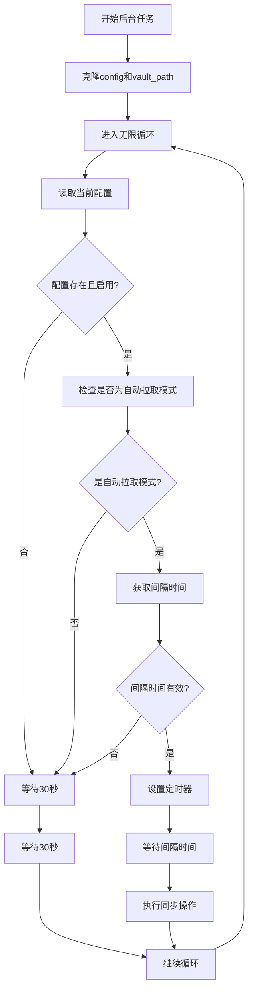

**图表来源**
- [sync_daemon.rs](file://cli/src/sync_daemon.rs#L43-L81)

#### 智能轮询策略

守护进程采用"智能轮询"策略，根据配置动态调整检查频率：

- **启用状态检查**：只有当配置启用且为自动拉取模式时才进行同步
- **间隔时间验证**：确保配置中的间隔时间有效
- **默认退避**：未配置或禁用时每30秒检查一次

**章节来源**
- [sync_daemon.rs](file://cli/src/sync_daemon.rs#L43-L81)

### 自动同步执行机制

`perform_sync`函数在Auto模式下执行具体的同步操作：

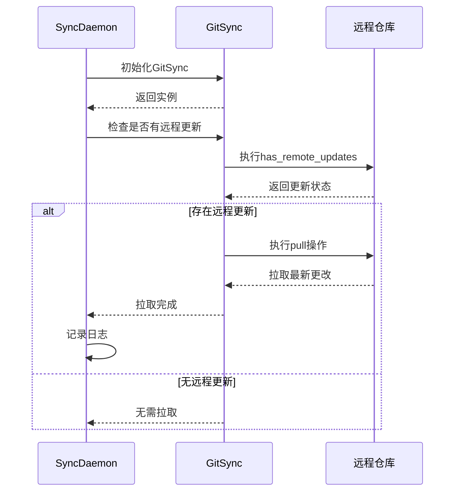

**图表来源**
- [sync_daemon.rs](file://cli/src/sync_daemon.rs#L86-L97)
- [git_sync.rs](file://core/src/git_sync.rs#L403-L439)

#### 同步模式特性

守护进程支持两种同步模式：

| 模式 | 特性 | 触发时机 | 数据流向 |
|------|------|----------|----------|
| Manual | 手动同步 | 用户主动执行 | 双向 |
| Auto | 自动同步 | 定时+变更 | 拉取定时，推送变更 |

**章节来源**
- [sync_daemon.rs](file://cli/src/sync_daemon.rs#L86-L97)
- [models.rs](file://core/src/models.rs#L335-L362)

### 配置热更新机制

`update_config`方法实现了运行时配置更新：

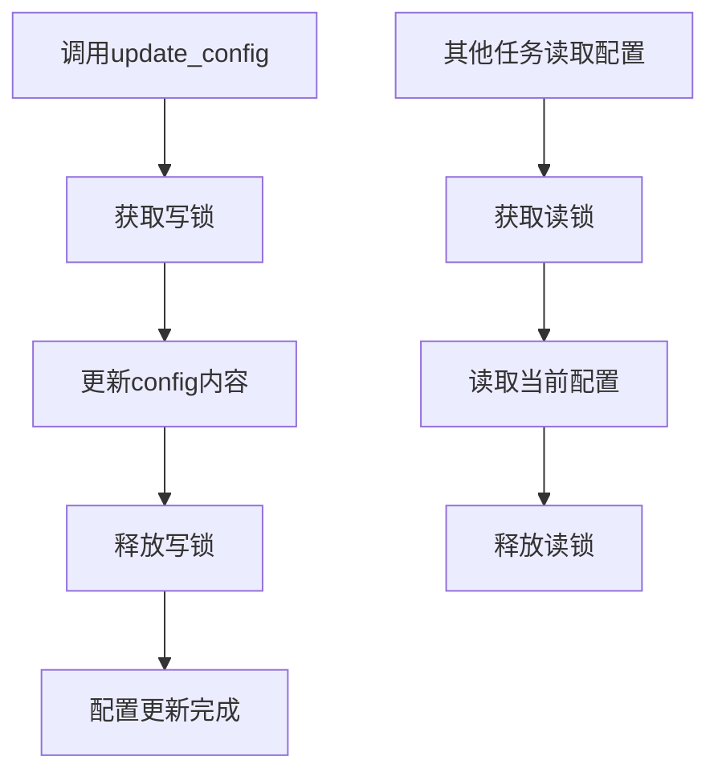

**图表来源**
- [sync_daemon.rs](file://cli/src/sync_daemon.rs#L107-L110)

#### 热更新优势

- **零停机时间**：配置更新不影响正在运行的任务
- **实时生效**：新配置立即应用于后续操作
- **线程安全**：通过RwLock保证并发安全

**章节来源**
- [sync_daemon.rs](file://cli/src/sync_daemon.rs#L107-L110)

### SyncMode枚举与间隔时间计算

`SyncMode`枚举定义了同步行为模式，并提供了间隔时间计算功能：

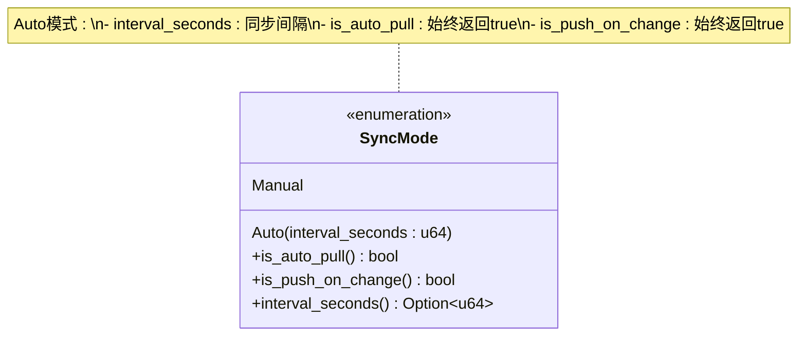

**图表来源**
- [models.rs](file://core/src/models.rs#L335-L362)

#### 间隔时间计算表

| SyncMode变体 | interval_seconds()返回值 | is_auto_pull() | is_push_on_change() |
|--------------|-------------------------|----------------|-------------------|
| Manual | None | false | false |
| Auto { interval_seconds: 600 } | Some(600) | true | true |

**章节来源**
- [models.rs](file://core/src/models.rs#L335-L362)

## 依赖关系分析

CLI同步守护进程的依赖关系展现了清晰的分层架构：

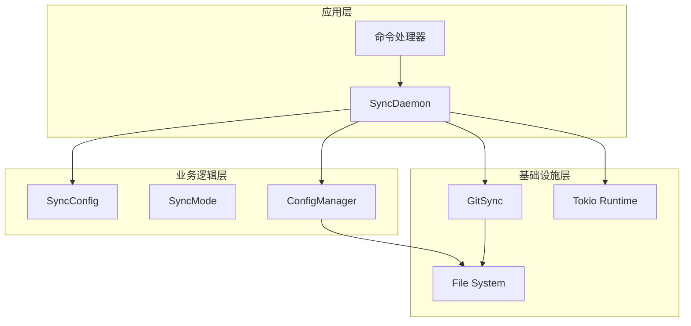

**图表来源**
- [sync_daemon.rs](file://cli/src/sync_daemon.rs#L1-L11)
- [models.rs](file://core/src/models.rs#L1-L416)
- [config.rs](file://core/src/config.rs#L1-L98)

### 关键依赖项

| 组件 | 依赖项 | 用途 |
|------|--------|------|
| SyncDaemon | tokio::sync::RwLock | 并发控制 |
| SyncDaemon | securefox_core::models::SyncConfig | 配置数据结构 |
| SyncDaemon | securefox_core::git_sync::GitSync | Git操作 |
| ConfigManager | serde_json | 配置序列化 |
| GitSync | git2 | Git仓库操作 |

**章节来源**
- [sync_daemon.rs](file://cli/src/sync_daemon.rs#L1-L11)
- [config.rs](file://core/src/config.rs#L1-L98)

## 性能考虑

### 内存优化策略

1. **Arc共享所有权**：避免配置的重复拷贝
2. **RwLock读写分离**：最大化并发读取性能
3. **Option包装**：延迟分配不必要的配置对象

### 异步I/O优化

1. **非阻塞文件操作**：配置文件读写使用异步API
2. **定时器复用**：避免频繁创建新的定时器实例
3. **智能轮询**：根据配置动态调整检查频率

### 资源管理

1. **连接池**：Git操作使用连接池减少开销
2. **缓存机制**：避免重复的远程状态检查
3. **优雅关闭**：支持任务的正常终止

## 故障排除指南

### 常见问题诊断

#### 配置加载失败

**症状**：守护进程无法启动或配置不生效
**原因**：配置文件格式错误或权限不足
**解决方案**：
1. 检查`~/.securefox/config`文件格式
2. 验证文件权限设置
3. 使用`sync status`命令查看配置状态

#### 同步超时

**症状**：自动同步长时间无响应
**原因**：网络连接问题或远程仓库不可达
**解决方案**：
1. 检查网络连接状态
2. 验证远程仓库URL配置
3. 查看守护进程日志文件

#### 权限错误

**症状**：Git操作失败
**原因**：SSH密钥或认证凭据问题
**解决方案**：
1. 验证SSH密钥配置
2. 检查环境变量设置
3. 重新配置远程仓库认证

**章节来源**
- [sync_daemon.rs](file://cli/src/sync_daemon.rs#L31-L39)
- [git_sync.rs](file://core/src/git_sync.rs#L307-L348)

### 调试技巧

1. **启用详细日志**：使用`--verbose`参数增加输出信息
2. **检查配置状态**：使用`sync status`命令验证配置
3. **监控系统资源**：观察CPU和内存使用情况
4. **测试网络连接**：验证远程仓库可达性

## 结论

SecureFox CLI同步守护进程是一个设计精良的异步系统，具有以下核心优势：

### 设计亮点

1. **并发安全**：通过Arc和RwLock实现线程安全的配置管理
2. **异步架构**：基于Tokio的非阻塞I/O提升性能
3. **智能调度**：根据配置动态调整同步策略
4. **热更新支持**：运行时配置更新无需重启服务
5. **模块化设计**：清晰的职责分离便于维护和扩展

### 应用场景

- **个人密码管理**：安全可靠的密码保险库同步
- **团队协作**：多设备间的数据同步
- **备份保护**：定期自动备份重要数据
- **离线工作**：支持离线操作后的数据合并

### 未来发展方向

1. **冲突解决**：实现更智能的合并策略
2. **性能优化**：引入增量同步机制
3. **监控增强**：添加健康检查和指标收集
4. **插件系统**：支持多种同步后端

该守护进程体现了现代Rust应用程序的最佳实践，为SecureFox项目提供了稳定可靠的数据同步能力。