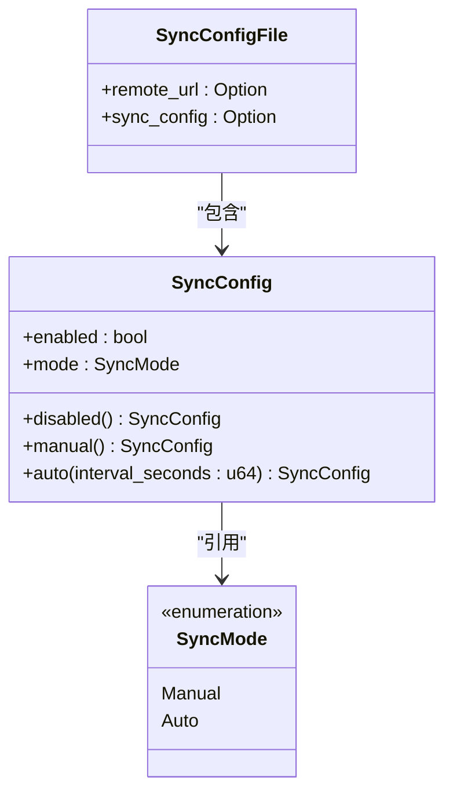
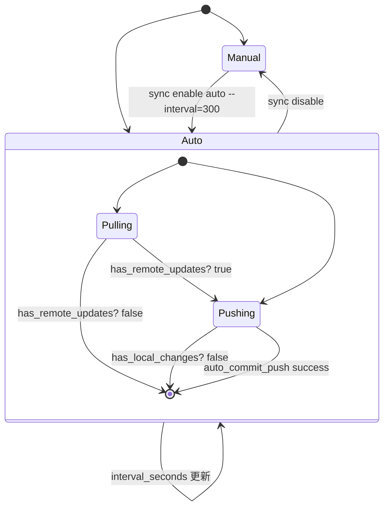
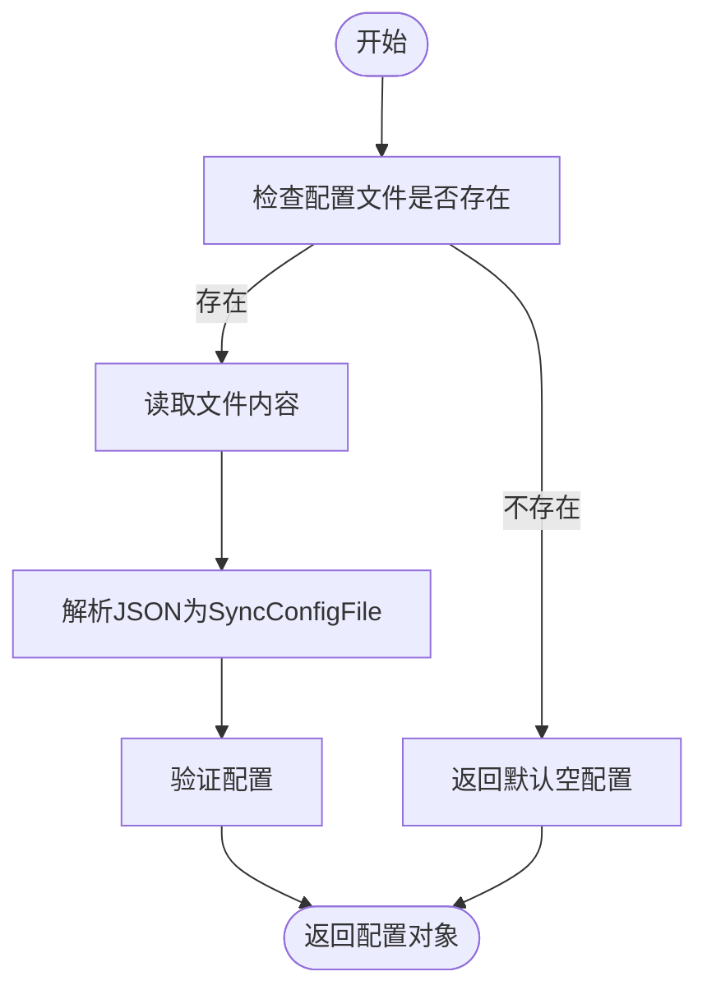
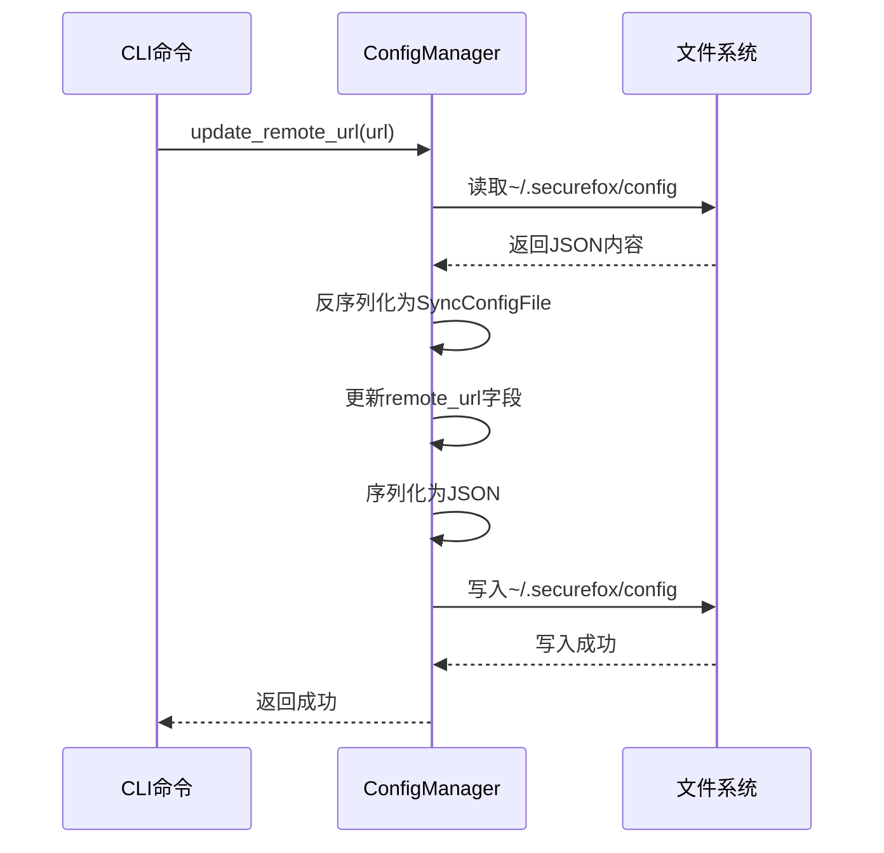
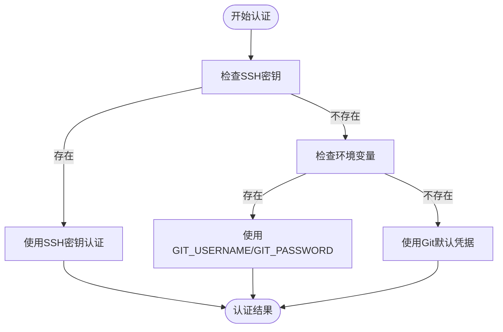

# 同步配置管理

<cite>
**本文档引用的文件**  
- [SyncConfig 和 SyncConfigFile 模型](file://core/src/models.rs#L297-L377)
- [配置管理器实现](file://core/src/config.rs#L1-L98)
- [同步配置命令](file://cli/src/commands/sync_config.rs#L1-L35)
- [启用同步命令](file://cli/src/commands/sync_enable.rs#L1-L44)
- [禁用同步命令](file://cli/src/commands/sync_disable.rs#L1-L29)
- [同步状态命令](file://cli/src/commands/sync_status.rs#L1-L57)
- [Git 同步实现](file://core/src/git_sync.rs#L1-L503)
- [API 路由定义](file://api/src/lib.rs#L47-L81)
</cite>

## 目录
1. [简介](#简介)
2. [数据模型](#数据模型)
3. [同步模式详解](#同步模式详解)
4. [配置管理器](#配置管理器)
5. [增量更新机制](#增量更新机制)
6. [配置文件示例](#配置文件示例)
7. [远程URL配置](#远程url配置)
8. [CLI和API配置流程](#cli和api配置流程)
9. [结论](#结论)

## 简介
本文档全面介绍 SecureFox 应用程序的同步配置管理系统。该系统基于 Git 实现密码库的跨设备同步，支持手动和自动同步模式。核心功能由 `SyncConfig` 和 `SyncConfigFile` 数据模型驱动，通过 `ConfigManager` 类管理配置文件的持久化。系统支持通过 CLI 命令行工具或 REST API 进行配置，并处理 SSH 和 HTTPS 协议的远程仓库连接。

**Section sources**
- [models.rs](file://core/src/models.rs#L297-L377)
- [config.rs](file://core/src/config.rs#L1-L98)

## 数据模型

### SyncConfig 数据结构
`SyncConfig` 结构体定义了同步的核心配置，包含两个主要字段：
- `enabled`: 布尔值，表示同步功能是否启用
- `mode`: `SyncMode` 枚举类型，指定同步的具体模式

该结构体的默认实例通过 `manual()` 方法创建，即启用但为手动模式。

### SyncConfigFile 数据结构
`SyncConfigFile` 是存储在 `~/.securefox/config` 文件中的顶级配置结构，包含：
- `remote_url`: 可选的字符串字段，存储 Git 远程仓库的 URL
- `sync_config`: 可选的 `SyncConfig` 实例，存储同步配置

当配置文件不存在时，系统会返回一个默认的空配置，确保系统始终有有效的配置可用。



**Diagram sources**
- [models.rs](file://core/src/models.rs#L297-L377)

**Section sources**
- [models.rs](file://core/src/models.rs#L297-L377)

## 同步模式详解

### Manual 模式
手动同步模式 (`Manual`) 是最基础的同步方式。在此模式下：
- 系统不会自动执行任何同步操作
- 用户必须通过 CLI 命令或 API 调用显式触发同步
- 适用于对同步时机有严格控制需求的用户
- 不会消耗后台资源进行自动检查

### Auto 模式
自动同步模式 (`Auto`) 提供了更便捷的同步体验，其特点包括：
- **定时拉取**：根据配置的 `interval_seconds` 间隔，定期从远程仓库拉取更新
- **变更推送**：当本地密码库发生更改时，自动将更改推送到远程仓库
- **双向同步**：结合了自动拉取和自动推送，确保数据一致性

`Auto` 模式通过 `interval_seconds` 参数控制拉取频率，用户可根据网络状况和使用习惯进行调整。

### 模式使用场景对比
| 模式 | 适用场景 | 资源消耗 | 数据一致性 |
|------|---------|---------|----------|
| Manual | 高安全性要求、低网络环境、手动控制偏好 | 低 | 用户控制 |
| Auto | 多设备频繁使用、追求无缝体验 | 中等 | 高（自动维护） |



**Diagram sources**
- [models.rs](file://core/src/models.rs#L334-L363)
- [sync_daemon.rs](file://cli/src/sync_daemon.rs#L84-L98)

**Section sources**
- [models.rs](file://core/src/models.rs#L334-L363)
- [sync_daemon.rs](file://cli/src/sync_daemon.rs#L84-L98)

## 配置管理器

### ConfigManager 类
`ConfigManager` 是负责管理 `~/.securefox/config` 配置文件的核心类，其主要功能包括：

#### 目录和文件管理
- **路径管理**：默认管理 `~/.securefox/config` 文件，支持自定义路径
- **目录创建**：`ensure_directory` 方法确保配置目录存在，不存在时自动创建
- **存在性检查**：`exists` 方法检查配置文件是否存在

#### 配置读写操作
- **加载配置**：`load` 方法读取配置文件，若文件不存在则返回默认空配置
- **保存配置**：`save` 方法将配置对象序列化为格式化的 JSON 并写入文件
- **原子更新**：所有更新操作都遵循"加载-修改-保存"模式，确保数据一致性

### 默认值处理
系统在多个层面实现了智能的默认值处理：
- 当配置文件不存在时，`load` 方法返回 `SyncConfigFile::default()`，即所有字段为 `None` 的空配置
- `SyncConfig` 结构体的 `Default` 实现返回 `manual()` 模式，确保有合理的默认同步行为
- 远程仓库名称默认为 `origin`，分支名称默认为 `main`，可通过环境变量 `SECUREFOX_REMOTE` 和 `SECUREFOX_BRANCH` 覆盖



**Diagram sources**
- [config.rs](file://core/src/config.rs#L67-L77)
- [config.rs](file://core/src/config.rs#L51-L57)

**Section sources**
- [config.rs](file://core/src/config.rs#L1-L98)

## 增量更新机制

### update_remote_url 方法
`update_remote_url` 方法实现了远程 URL 的增量更新：
1. 调用 `load` 方法读取当前配置
2. 更新 `remote_url` 字段为新值
3. 调用 `save` 方法将修改后的配置写回文件
4. 同时调用 `GitSync::set_remote` 更新 Git 仓库的远程配置

此方法确保了配置文件和 Git 仓库配置的一致性。

### update_sync_config 方法
`update_sync_config` 方法的工作流程与 `update_remote_url` 类似：
1. 加载当前配置
2. 更新 `sync_config` 字段
3. 保存修改后的配置
4. 触发同步守护进程更新其内部状态

这种方法避免了全量配置的复杂性，允许用户单独更新特定配置项。

### 线程安全考虑
虽然当前实现没有显式的锁机制，但通过以下方式保证了基本的安全性：
- 每次操作都是独立的读-改-写周期
- 文件操作由操作系统保证原子性
- 配置更新频率较低，冲突概率小

对于高并发场景，建议在应用层添加适当的同步机制。



**Diagram sources**
- [config.rs](file://core/src/config.rs#L79-L91)
- [sync_config.rs](file://cli/src/commands/sync_config.rs#L21-L24)

**Section sources**
- [config.rs](file://core/src/config.rs#L79-L91)
- [sync_config.rs](file://cli/src/commands/sync_config.rs#L1-L35)

## 配置文件示例

### JSON 结构
```json
{
  "remoteUrl": "git@github.com:user/securefox-vault.git",
  "syncConfig": {
    "enabled": true,
    "mode": {
      "type": "auto",
      "intervalSeconds": 300
    }
  }
}
```

### 字段说明
- `remoteUrl`: Git 远程仓库的 URL，支持 SSH 和 HTTPS 协议
- `syncConfig`: 同步配置对象
  - `enabled`: 同步功能开关
  - `mode`: 同步模式
    - `type`: 模式类型，可为 `manual` 或 `auto`
    - `intervalSeconds`: 自动拉取的时间间隔（秒）

### 空配置示例
当系统刚安装或未配置同步时，配置文件可能为空或不存在：
```json
{}
```
在这种情况下，系统会使用默认值：同步启用但为手动模式。

**Section sources**
- [models.rs](file://core/src/models.rs#L365-L377)
- [config.rs](file://core/src/config.rs#L70-L72)

## 远程URL配置

### 协议支持
系统支持两种主要的 Git 协议：

#### SSH 协议
- 格式：`git@github.com:user/repo.git`
- 认证方式：SSH 密钥对
- 默认查找 `~/.ssh/` 目录下的密钥文件
- 支持的密钥类型：`id_ed25519`, `id_rsa`, `id_ecdsa`
- 若未找到特定密钥，则尝试通过 SSH 代理认证

#### HTTPS 协议
- 格式：`https://github.com/user/repo.git`
- 认证方式：用户名和密码（或个人访问令牌）
- 通过环境变量 `GIT_USERNAME` 和 `GIT_PASSWORD` 提供凭据
- 适用于无法使用 SSH 密钥的环境

### 凭据处理机制
系统采用分层的凭据处理策略：
1. **SSH 密钥优先**：首先尝试使用 SSH 密钥进行认证
2. **环境变量回退**：若 SSH 认证失败，则尝试使用环境变量中的用户名密码
3. **默认凭据**：若以上都失败，则使用 Git 库的默认凭据处理

这种机制确保了在不同环境下的兼容性和安全性。



**Diagram sources**
- [git_sync.rs](file://core/src/git_sync.rs#L307-L349)
- [sync_config.rs](file://cli/src/commands/sync_config.rs#L17-L18)

**Section sources**
- [git_sync.rs](file://core/src/git_sync.rs#L307-L349)
- [sync_config.rs](file://cli/src/commands/sync_config.rs#L1-L35)

## CLI和API配置流程

### CLI 配置流程
通过命令行工具配置同步的完整流程：

#### 1. 配置远程仓库
```bash
securefox sync config git@github.com:user/securefox-vault.git
```
此命令会：
- 调用 `GitSync::set_remote` 设置 Git 远程
- 调用 `ConfigManager::update_remote_url` 更新配置文件

#### 2. 启用自动同步
```bash
securefox sync enable auto --interval=300
```
此命令会：
- 创建 `SyncConfig::auto(300)` 实例
- 调用 `ConfigManager::update_sync_config` 更新配置

#### 3. 检查同步状态
```bash
securefox sync status
```
显示当前的远程 URL 和同步模式配置。

### API 配置流程
通过 REST API 进行配置：

#### 启用同步的 API 调用
```http
POST /sync/config
Content-Type: application/json
Authorization: Bearer <token>

{
  "enabled": true,
  "mode": {
    "type": "auto",
    "intervalSeconds": 300
  }
}
```

#### 相关 API 端点
- `POST /sync/push`: 手动推送更改
- `POST /sync/pull`: 手动拉取更新
- `GET /sync/status`: 获取同步状态
- `POST /sync/config`: 更新同步配置

API 路由由 `api/src/lib.rs` 中的路由定义管理，所有同步相关端点都需要身份验证。

```mermaid
flowchart LR
subgraph CLI
A["sync config URL"] --> B["sync enable auto"]
B --> C["sync status"]
end
subgraph API
D["POST /sync/config"] --> E["POST /sync/push"]
E --> F["POST /sync/pull"]
end
G[ConfigManager] < --> A
G < --> D
H[GitSync] < --> B
H < --> E
H < --> F
```

**Diagram sources**
- [main.rs](file://cli/src/main.rs#L353-L368)
- [lib.rs](file://api/src/lib.rs#L47-L81)
- [sync_enable.rs](file://cli/src/commands/sync_enable.rs#L7-L44)

**Section sources**
- [main.rs](file://cli/src/main.rs#L353-L368)
- [lib.rs](file://api/src/lib.rs#L47-L81)
- [sync_config.rs](file://cli/src/commands/sync_config.rs#L9-L35)
- [sync_enable.rs](file://cli/src/commands/sync_enable.rs#L7-L44)
- [sync_disable.rs](file://cli/src/commands/sync_disable.rs#L7-L29)
- [sync_status.rs](file://cli/src/commands/sync_status.rs#L7-L57)

## 结论
SecureFox 的同步配置管理系统通过清晰的分层设计实现了灵活而可靠的跨设备同步功能。`SyncConfig` 和 `SyncConfigFile` 数据模型提供了结构化的配置定义，`ConfigManager` 确保了配置的持久化和默认值处理。系统支持手动和自动两种同步模式，满足不同用户的需求。通过 CLI 和 API 两种方式，用户可以方便地配置和管理同步设置。远程仓库支持 SSH 和 HTTPS 协议，并通过分层的凭据处理机制确保了安全性。整个系统设计注重用户体验和数据一致性，为密码管理提供了可靠的同步基础。