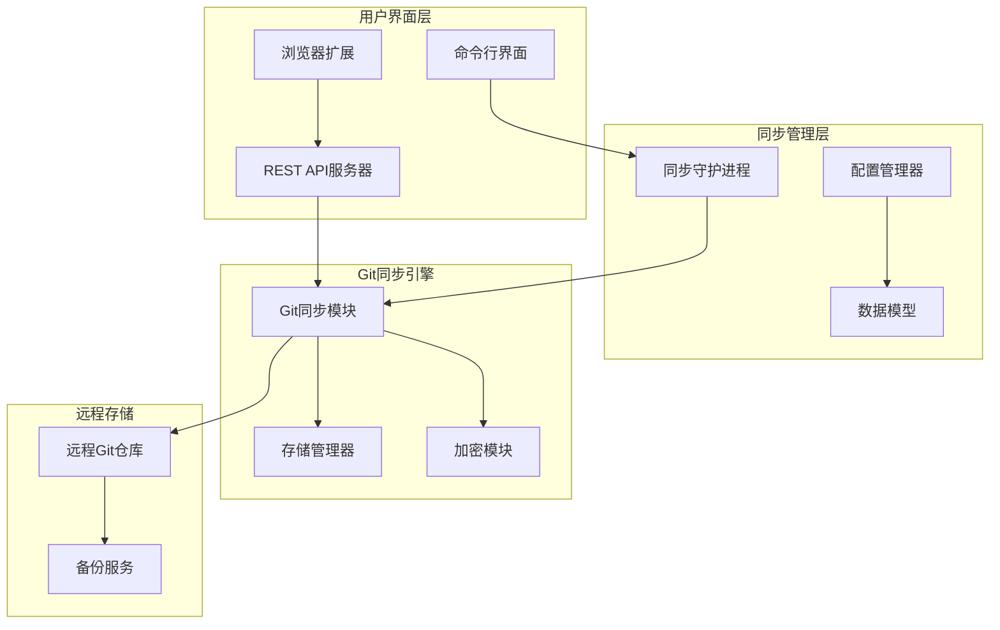
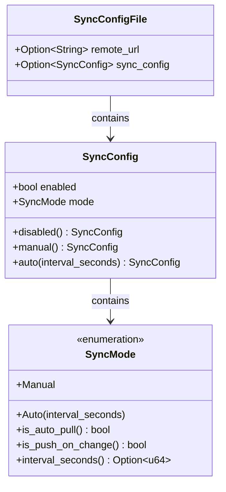
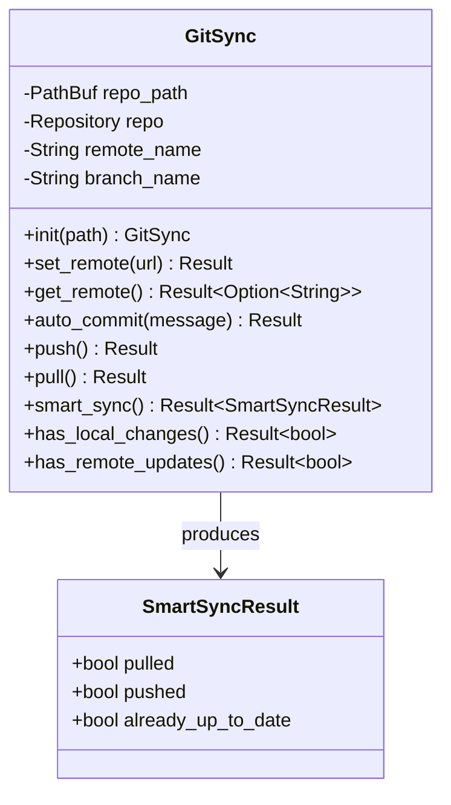
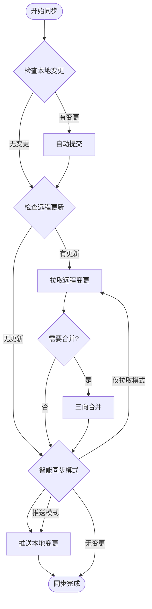
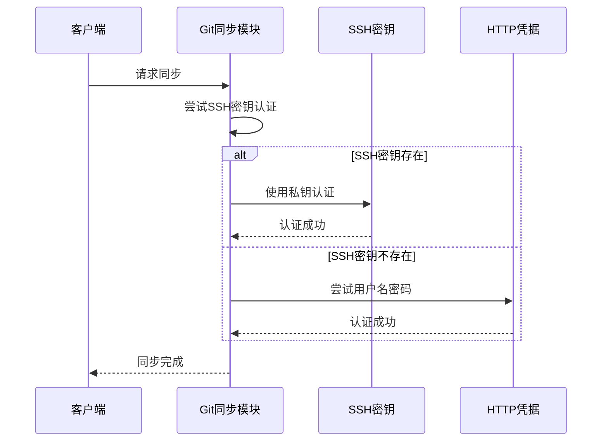
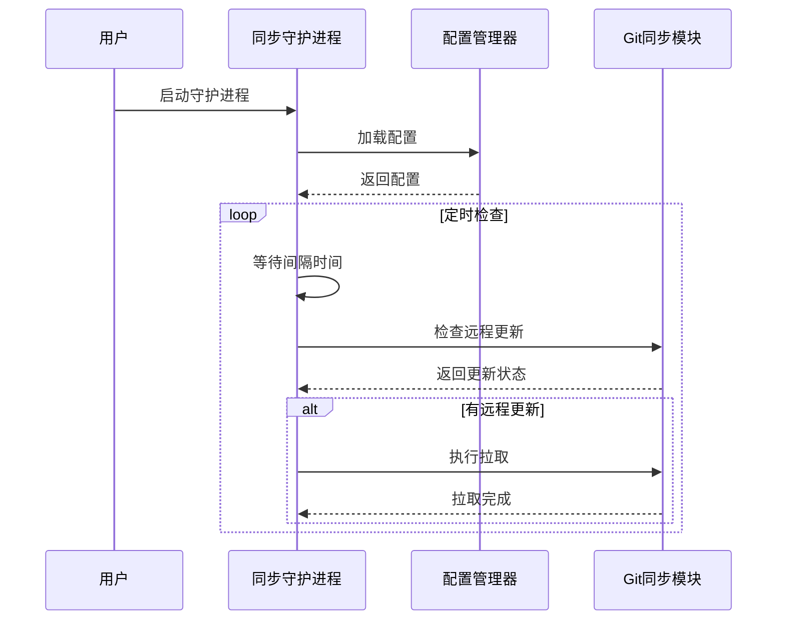
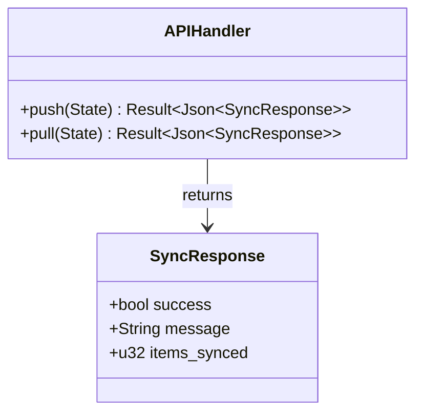
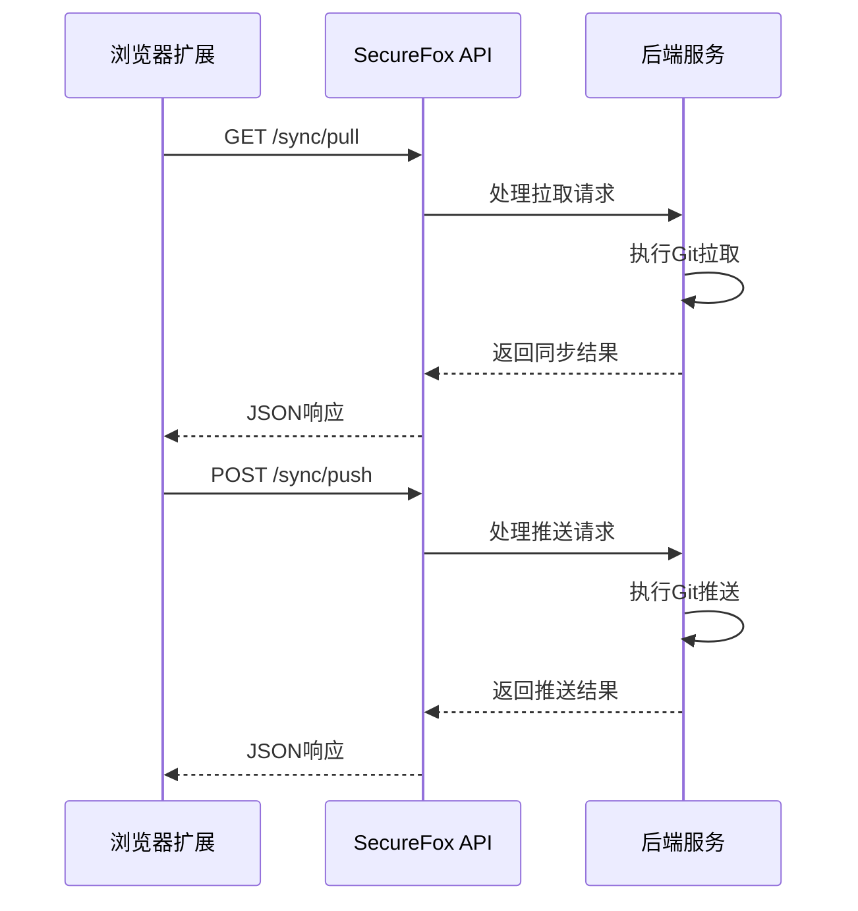
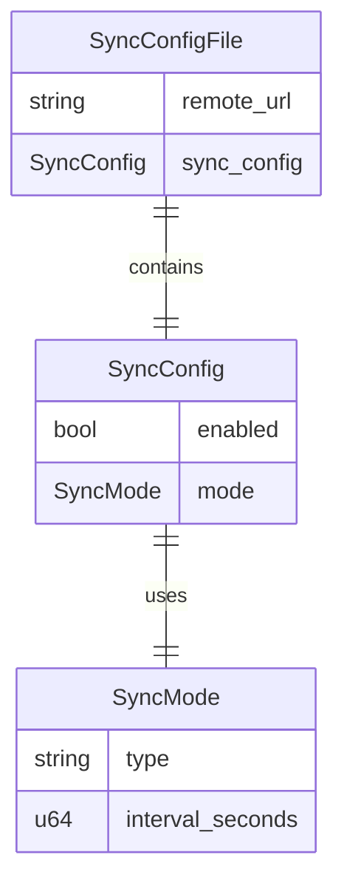
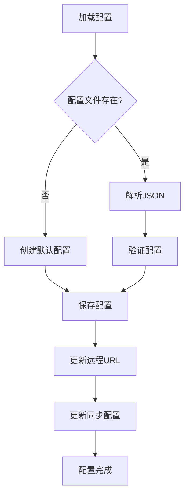

# 数据同步

<cite>
**本文档中引用的文件**
- [core/src/git_sync.rs](file://core/src/git_sync.rs)
- [cli/src/sync_daemon.rs](file://cli/src/sync_daemon.rs)
- [cli/src/commands/sync.rs](file://cli/src/commands/sync.rs)
- [cli/src/commands/sync_config.rs](file://cli/src/commands/sync_config.rs)
- [cli/src/commands/sync_enable.rs](file://cli/src/commands/sync_enable.rs)
- [cli/src/commands/sync_disable.rs](file://cli/src/commands/sync_disable.rs)
- [cli/src/commands/sync_status.rs](file://cli/src/commands/sync_status.rs)
- [api/src/handlers/mod.rs](file://api/src/handlers/mod.rs)
- [core/src/models.rs](file://core/src/models.rs)
- [core/src/config.rs](file://core/src/config.rs)
- [extension/lib/api/index.ts](file://extension/lib/api/index.ts)
- [extension/lib/api/system.ts](file://extension/lib/api/system.ts)
</cite>

## 目录
1. [简介](#简介)
2. [系统架构概览](#系统架构概览)
3. [核心数据模型](#核心数据模型)
4. [Git同步机制详解](#git同步机制详解)
5. [CLI同步工具](#cli同步工具)
6. [API同步端点](#api同步端点)
7. [浏览器扩展集成](#浏览器扩展集成)
8. [同步配置管理](#同步配置管理)
9. [安全考虑](#安全考虑)
10. [使用示例](#使用示例)
11. [故障排除](#故障排除)

## 简介

SecureFox提供了基于Git的端到端加密数据同步功能，确保用户的密码库能够在多个设备间安全、可靠地同步。该系统采用分布式版本控制技术，结合强加密机制，为用户提供透明且安全的跨设备同步体验。

## 系统架构概览

SecureFox的数据同步系统由以下核心组件构成：



**图表来源**
- [core/src/git_sync.rs](file://core/src/git_sync.rs#L1-L503)
- [cli/src/sync_daemon.rs](file://cli/src/sync_daemon.rs#L1-L112)
- [api/src/handlers/mod.rs](file://api/src/handlers/mod.rs#L1-L429)

## 核心数据模型

### SyncConfig 数据模型

SyncConfig是同步系统的核心配置数据结构，定义了同步行为和模式：



**图表来源**
- [core/src/models.rs](file://core/src/models.rs#L297-L377)

### 同步模式类型

系统支持两种主要的同步模式：

| 模式 | 描述 | 自动拉取 | 推送时机 |
|------|------|----------|----------|
| Manual | 手动同步模式 | ❌ | 需要手动执行 |
| Auto | 自动同步模式 | ✅ | 定时拉取 + 变化推送 |

**节来源**
- [core/src/models.rs](file://core/src/models.rs#L334-L362)

## Git同步机制详解

### GitSync 核心类

GitSync类是整个同步系统的核心，负责与Git仓库的所有交互操作：



**图表来源**
- [core/src/git_sync.rs](file://core/src/git_sync.rs#L12-L463)

### 同步流程图



**图表来源**
- [core/src/git_sync.rs](file://core/src/git_sync.rs#L442-L461)

### 认证机制

GitSync支持多种认证方式以适应不同的部署环境：



**图表来源**
- [core/src/git_sync.rs](file://core/src/git_sync.rs#L307-L348)

**节来源**
- [core/src/git_sync.rs](file://core/src/git_sync.rs#L1-L503)

## CLI同步工具

### 命令行接口

SecureFox提供了丰富的命令行工具来管理同步配置和执行同步操作：

| 命令 | 功能 | 参数 |
|------|------|------|
| `sync` | 执行同步操作 | `--push/--pull` |
| `sync config` | 配置远程仓库 | `<URL>` |
| `sync enable` | 启用自动同步 | `<mode> <interval>` |
| `sync disable` | 禁用同步 | 无 |
| `sync status` | 查看同步状态 | 无 |

### 同步守护进程



**图表来源**
- [cli/src/sync_daemon.rs](file://cli/src/sync_daemon.rs#L42-L81)

**节来源**
- [cli/src/sync_daemon.rs](file://cli/src/sync_daemon.rs#L1-L112)
- [cli/src/commands/sync_config.rs](file://cli/src/commands/sync_config.rs#L1-L35)
- [cli/src/commands/sync_enable.rs](file://cli/src/commands/sync_enable.rs#L1-L44)
- [cli/src/commands/sync_disable.rs](file://cli/src/commands/sync_disable.rs#L1-L29)
- [cli/src/commands/sync_status.rs](file://cli/src/commands/sync_status.rs#L1-L57)

## API同步端点

### REST API端点

SecureFox提供了标准化的REST API端点供浏览器扩展调用：

| 端点 | 方法 | 功能 | 路径参数 |
|------|------|------|----------|
| `/sync/push` | POST | 推送本地变更到远程 | 无 |
| `/sync/pull` | POST | 从远程拉取最新变更 | 无 |

### API响应格式



**图表来源**
- [api/src/handlers/mod.rs](file://api/src/handlers/mod.rs#L349-L367)

**节来源**
- [api/src/handlers/mod.rs](file://api/src/handlers/mod.rs#L349-L367)

## 浏览器扩展集成

### 扩展API调用

浏览器扩展通过标准的HTTP客户端调用SecureFox API：



**图表来源**
- [extension/lib/api/index.ts](file://extension/lib/api/index.ts#L1-L5)
- [extension/lib/api/system.ts](file://extension/lib/api/system.ts#L1-L19)

**节来源**
- [extension/lib/api/index.ts](file://extension/lib/api/index.ts#L1-L5)
- [extension/lib/api/system.ts](file://extension/lib/api/system.ts#L1-L19)

## 同步配置管理

### 配置文件结构

SyncConfigFile包含所有同步相关的非加密配置：



**图表来源**
- [core/src/models.rs](file://core/src/models.rs#L366-L377)
- [core/src/config.rs](file://core/src/config.rs#L1-L99)

### 配置管理器

ConfigManager负责配置文件的读写操作：



**图表来源**
- [core/src/config.rs](file://core/src/config.rs#L68-L91)

**节来源**
- [core/src/config.rs](file://core/src/config.rs#L1-L99)

## 安全考虑

### 数据加密策略

SecureFox在同步过程中实施多层安全保护：

1. **传输加密**: 使用HTTPS或SSH进行远程通信
2. **本地加密**: 密码库文件在本地保持加密状态
3. **审计日志**: 所有同步操作都有详细的日志记录
4. **权限控制**: 严格的访问控制和身份验证机制

### 安全最佳实践

| 实践 | 描述 | 实现方式 |
|------|------|----------|
| SSH密钥认证 | 使用强SSH密钥进行身份验证 | 支持Ed25519、RSA、ECDSA密钥 |
| 密码轮换 | 定期更换同步凭据 | 环境变量管理 |
| 审计跟踪 | 记录所有同步活动 | 日志系统 |
| 权限最小化 | 最小权限原则 | 基于角色的访问控制 |

## 使用示例

### 基本同步配置

```bash
# 初始化同步配置
securefox sync config https://github.com/user/vault.git

# 启用手动同步模式
securefox sync enable manual

# 启用自动同步（每300秒）
securefox sync enable auto 300

# 查看同步状态
securefox sync status

# 执行手动同步
securefox sync
```

### 高级配置场景

```bash
# 设置自定义分支名称
export SECUREFOX_BRANCH=main

# 设置自定义远程名称
export SECUREFOX_REMOTE=origin

# 配置SSH密钥路径
export GIT_SSH_COMMAND="ssh -i ~/.ssh/custom_key"
```

### API调用示例

```javascript
// 拉取最新同步
fetch('http://localhost:8080/api/sync/pull', {
    method: 'POST',
    headers: {
        'Authorization': 'Bearer <token>'
    }
});

// 推送本地变更
fetch('http://localhost:8080/api/sync/push', {
    method: 'POST',
    headers: {
        'Authorization': 'Bearer <token>'
    }
});
```

## 故障排除

### 常见问题及解决方案

| 问题 | 症状 | 解决方案 |
|------|------|----------|
| 连接超时 | 同步失败，网络错误 | 检查网络连接和防火墙设置 |
| 认证失败 | SSH/HTTP认证错误 | 验证凭据和密钥有效性 |
| 分支冲突 | 合并冲突错误 | 手动解决冲突或重置分支 |
| 权限拒绝 | 文件访问被拒绝 | 检查文件系统权限 |

### 调试技巧

1. **启用详细日志**: 设置环境变量`RUST_LOG=debug`
2. **检查配置**: 使用`securefox sync status`查看配置状态
3. **测试连接**: 使用`git ls-remote`测试远程连接
4. **验证凭据**: 确认SSH密钥或用户名密码正确性

### 性能优化

- **增量同步**: 利用Git的增量特性减少传输量
- **压缩传输**: 启用Git压缩以减少带宽使用
- **本地缓存**: 本地维护Git对象数据库提高性能
- **并发控制**: 合理设置同步间隔避免资源竞争

**节来源**
- [core/src/git_sync.rs](file://core/src/git_sync.rs#L439-L461)
- [cli/src/sync_daemon.rs](file://cli/src/sync_daemon.rs#L84-L111)