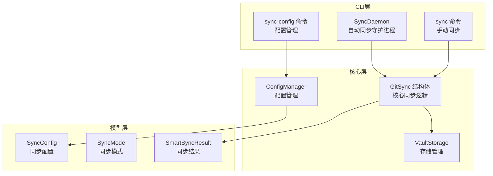
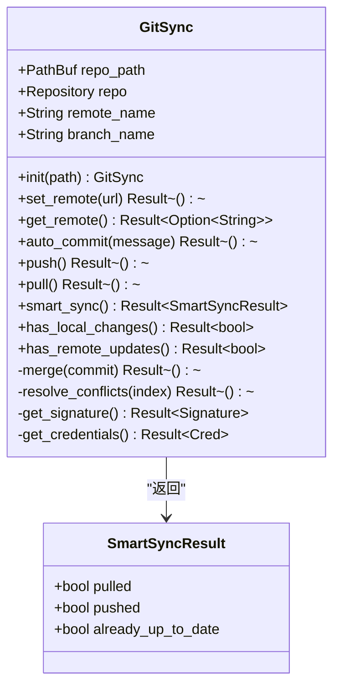
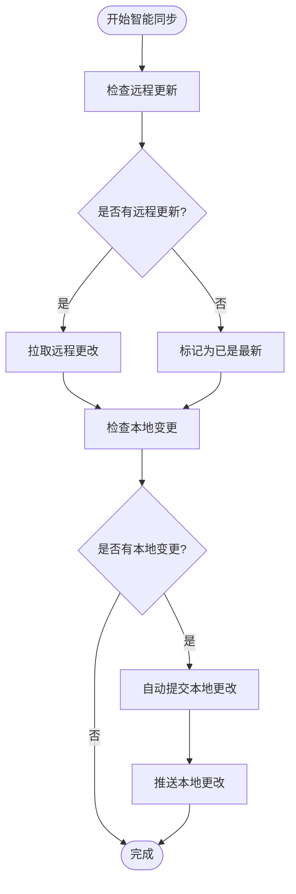
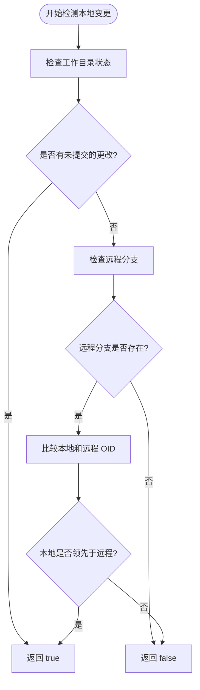
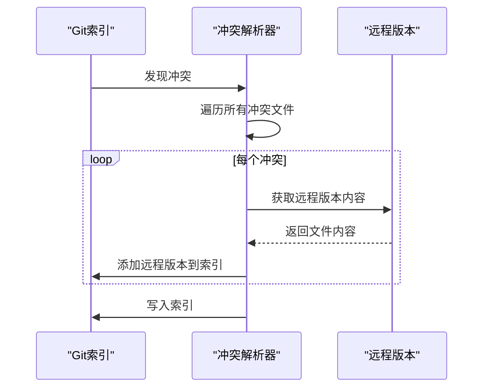
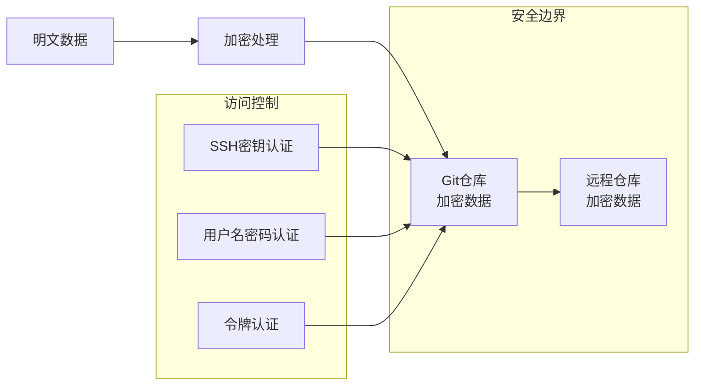
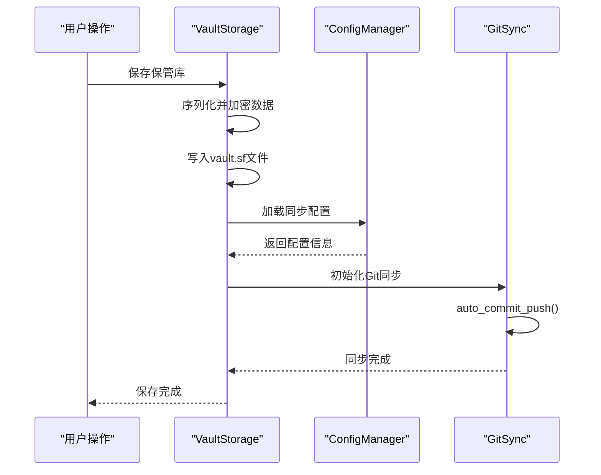
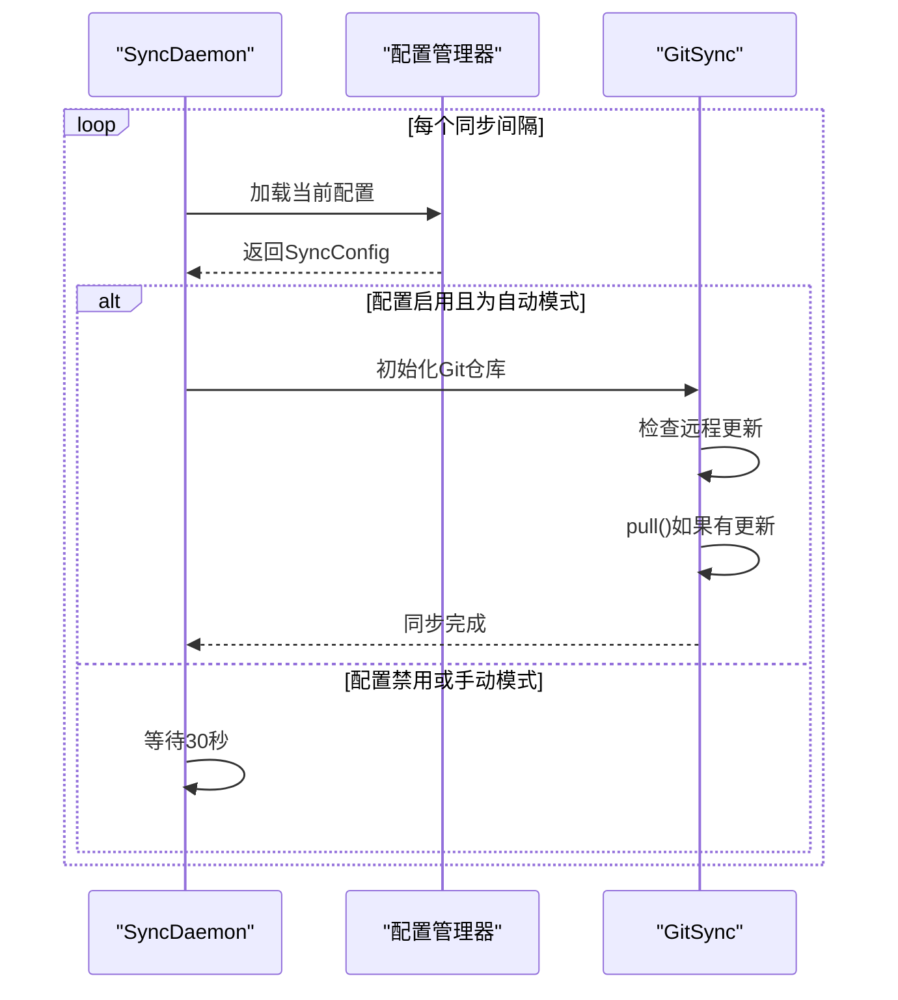
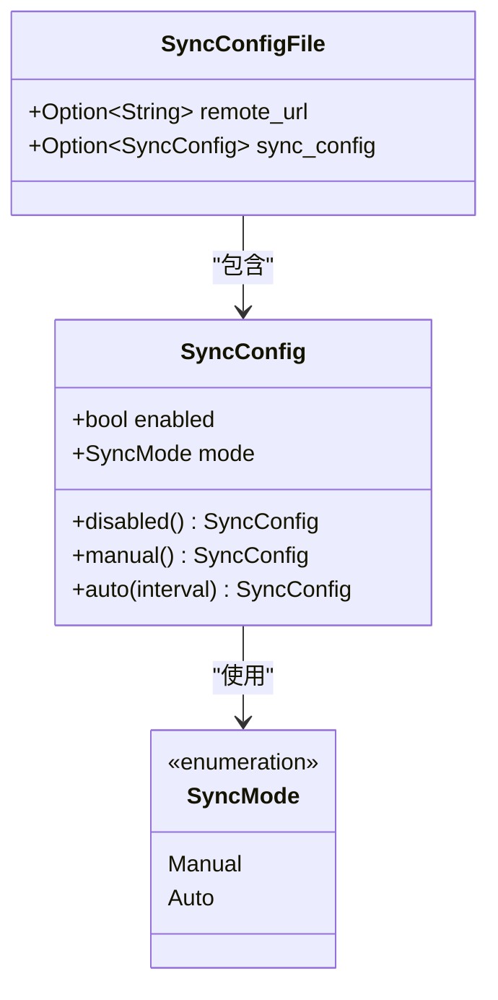

# 核心同步逻辑

<cite>
**本文档中引用的文件**
- [git_sync.rs](file://core/src/git_sync.rs)
- [lib.rs](file://core/src/lib.rs)
- [storage.rs](file://core/src/storage.rs)
- [config.rs](file://core/src/config.rs)
- [sync_daemon.rs](file://cli/src/sync_daemon.rs)
- [sync_config.rs](file://cli/src/commands/sync_config.rs)
- [models.rs](file://core/src/models.rs)
</cite>

## 目录
1. [简介](#简介)
2. [项目结构概览](#项目结构概览)
3. [GitSync核心结构体](#gitsync核心结构体)
4. [智能同步机制](#智能同步机制)
5. [同步状态检测](#同步状态检测)
6. [冲突解决策略](#冲突解决策略)
7. [安全设计](#安全设计)
8. [同步流程集成](#同步流程集成)
9. [配置管理](#配置管理)
10. [性能考虑](#性能考虑)
11. [故障排除指南](#故障排除指南)
12. [总结](#总结)

## 简介

SecureFox的核心同步机制基于Git技术，为密码保管库提供了分布式备份和多设备同步功能。该系统通过`GitSync`结构体实现了完整的Git操作封装，包括仓库初始化、远程连接管理、自动提交、推送和拉取操作。核心设计遵循"数据始终以加密形式存储在Git仓库中"的安全原则，确保用户数据在传输和存储过程中的安全性。

## 项目结构概览

SecureFox的同步功能分布在多个模块中，形成了层次化的架构：

**图表来源**
- [git_sync.rs](file://core/src/git_sync.rs#L12-L18)
- [storage.rs](file://core/src/storage.rs#L29-L32)
- [config.rs](file://core/src/config.rs#L19-L21)

**章节来源**
- [lib.rs](file://core/src/lib.rs#L1-L37)
- [git_sync.rs](file://core/src/git_sync.rs#L1-L20)

## GitSync核心结构体

`GitSync`是整个同步系统的核心组件，负责管理本地Git仓库并与远程仓库进行交互。

### 结构体定义

**图表来源**
- [git_sync.rs](file://core/src/git_sync.rs#L12-L18)
- [git_sync.rs](file://core/src/git_sync.rs#L466-L471)

### 初始化过程

`GitSync::init()`方法实现了智能的仓库初始化逻辑：

1. **仓库检测**: 检查目标路径是否已存在`.git`目录
2. **仓库创建**: 如果不存在，则初始化新的Git仓库
3. **默认配置**: 创建`.gitignore`文件，设置默认忽略规则
4. **环境变量**: 从环境变量读取远程名称和分支名称

**章节来源**
- [git_sync.rs](file://core/src/git_sync.rs#L21-L43)

## 智能同步机制

智能同步是SecureFox的核心特性，通过`smart_sync`方法实现"先拉后推"的同步策略。

### 智能同步算法

**图表来源**
- [git_sync.rs](file://core/src/git_sync.rs#L442-L461)

### SmartSyncResult结构体

`SmartSyncResult`结构体用于记录智能同步的结果：

| 字段名 | 类型 | 含义 | 默认值 |
|--------|------|------|--------|
| `pulled` | `bool` | 是否成功拉取了远程更新 | `false` |
| `pushed` | `bool` | 是否成功推送了本地更改 | `false` |
| `already_up_to_date` | `bool` | 远程已经是最新版本 | `false` |

**章节来源**
- [git_sync.rs](file://core/src/git_sync.rs#L466-L471)

**章节来源**
- [git_sync.rs](file://core/src/git_sync.rs#L442-L461)

## 同步状态检测

系统提供了两个关键方法来检测同步状态：`has_local_changes`和`has_remote_updates`。

### 本地变更检测

`has_local_changes`方法检查是否存在未提交或未推送的本地更改：

**图表来源**
- [git_sync.rs](file://core/src/git_sync.rs#L365-L401)

### 远程更新检测

`has_remote_updates`方法检测远程仓库是否有可用的更新：

1. **获取远程信息**: 执行`git fetch`但不合并
2. **比较OID**: 比较本地HEAD与远程分支的OID
3. **计算差异**: 使用`graph_ahead_behind`确定远程是否领先

**章节来源**
- [git_sync.rs](file://core/src/git_sync.rs#L365-L440)

## 冲突解决策略

当发生合并冲突时，系统采用保守的冲突解决策略。

### 当前实现

**图表来源**
- [git_sync.rs](file://core/src/git_sync.rs#L274-L291)

### 未来改进方向

当前实现采用"优先采用远程版本"的简单策略，未来的改进可能包括：

1. **智能JSON合并**: 对于JSON格式的保管库文件，实现结构化合并
2. **三向合并**: 支持更复杂的三向合并算法
3. **用户交互**: 提供冲突解决的用户界面选项
4. **增量合并**: 实现细粒度的增量合并策略

**章节来源**
- [git_sync.rs](file://core/src/git_sync.rs#L274-L291)

## 安全设计

SecureFox的同步系统采用了多层次的安全设计，确保数据在整个同步过程中的安全性。

### 加密存储原则

**图表来源**
- [storage.rs](file://core/src/storage.rs#L70-L82)
- [git_sync.rs](file://core/src/git_sync.rs#L307-L348)

### 认证机制

系统支持多种认证方式：

| 认证类型 | 优先级 | 用途 | 安全性 |
|----------|--------|------|--------|
| SSH密钥 | 最高 | 私有仓库访问 | 高 |
| SSH代理 | 高 | 便捷认证 | 中 |
| 用户名密码 | 中 | 公共仓库访问 | 中 |
| 环境变量 | 低 | 自动化脚本 | 低 |

**章节来源**
- [git_sync.rs](file://core/src/git_sync.rs#L307-L348)

## 同步流程集成

同步功能与Vault存储系统紧密集成，在多个关键操作点触发自动同步。

### 存储层集成

**图表来源**
- [storage.rs](file://core/src/storage.rs#L70-L98)
- [storage.rs](file://core/src/storage.rs#L136-L151)

### 自动同步守护进程

**图表来源**
- [sync_daemon.rs](file://cli/src/sync_daemon.rs#L42-L80)
- [sync_daemon.rs](file://cli/src/sync_daemon.rs#L85-L97)

**章节来源**
- [storage.rs](file://core/src/storage.rs#L136-L151)
- [sync_daemon.rs](file://cli/src/sync_daemon.rs#L42-L80)

## 配置管理

同步功能的配置通过独立的配置文件管理系统进行维护。

### 配置文件结构

**图表来源**
- [models.rs](file://core/src/models.rs#L298-L377)

### 配置管理器

`ConfigManager`提供了完整的配置文件管理功能：

| 方法名 | 功能 | 参数 | 返回值 |
|--------|------|------|--------|
| `new()` | 创建配置管理器 | 无 | `Result<Self>` |
| `load()` | 加载配置文件 | 无 | `Result<SyncConfigFile>` |
| `save()` | 保存配置文件 | `&SyncConfigFile` | `Result<()>` |
| `update_remote_url()` | 更新远程URL | `Option<String>` | `Result<()>` |
| `update_sync_config()` | 更新同步配置 | `Option<SyncConfig>` | `Result<()>` |

**章节来源**
- [config.rs](file://core/src/config.rs#L24-L91)
- [models.rs](file://core/src/models.rs#L298-L377)

## 性能考虑

### 异步操作优化

系统在多个层面实现了性能优化：

1. **延迟初始化**: Git仓库只在需要时才初始化
2. **条件同步**: 只有在检测到变更时才执行同步操作
3. **批量操作**: 将多个Git操作组合在一起执行
4. **缓存机制**: 缓存远程状态信息，避免重复查询

### 内存管理

- **流式处理**: 大文件采用流式读写，避免内存溢出
- **及时清理**: 同步完成后及时释放临时资源
- **错误恢复**: 实现完善的错误恢复机制

## 故障排除指南

### 常见问题及解决方案

| 问题类型 | 症状 | 可能原因 | 解决方案 |
|----------|------|----------|----------|
| 认证失败 | 无法推送/拉取 | SSH密钥或凭据配置错误 | 检查SSH密钥和远程URL |
| 同步超时 | 操作长时间无响应 | 网络连接问题 | 检查网络连接和防火墙设置 |
| 冲突解决失败 | 合并过程中断 | 复杂的文件冲突 | 手动解决冲突后重试 |
| 权限错误 | 文件写入失败 | 目录权限不足 | 检查vault目录权限 |

### 调试技巧

1. **启用详细日志**: 设置适当的日志级别查看详细信息
2. **检查仓库状态**: 使用`git status`检查本地仓库状态
3. **验证远程连接**: 测试SSH连接到远程仓库
4. **监控同步频率**: 检查自动同步配置是否正确

**章节来源**
- [git_sync.rs](file://core/src/git_sync.rs#L125-L165)
- [git_sync.rs](file://core/src/git_sync.rs#L167-L209)

## 总结

SecureFox的Git同步机制通过精心设计的架构实现了安全、可靠的数据同步功能。核心特点包括：

1. **安全优先**: 数据始终以加密形式存储在Git仓库中
2. **智能同步**: 采用"先拉后推"的智能同步策略
3. **灵活配置**: 支持手动和自动两种同步模式
4. **错误处理**: 完善的错误检测和恢复机制
5. **性能优化**: 多层次的性能优化策略

该系统为用户提供了可靠的跨设备数据同步能力，同时保持了数据的安全性和隐私保护。通过持续的功能增强和性能优化，SecureFox的同步机制将继续为用户提供优质的密码管理体验。