# 加密模块

<cite>
**本文档中引用的文件**
- [crypto.rs](file://core/src/crypto.rs)
- [models.rs](file://core/src/models.rs)
- [storage.rs](file://core/src/storage.rs)
- [errors.rs](file://core/src/errors.rs)
- [lib.rs](file://core/src/lib.rs)
- [init.rs](file://cli/src/commands/init.rs)
</cite>

## 目录
1. [简介](#简介)
2. [项目结构](#项目结构)
3. [核心组件](#核心组件)
4. [架构概览](#架构概览)
5. [详细组件分析](#详细组件分析)
6. [依赖关系分析](#依赖关系分析)
7. [性能考虑](#性能考虑)
8. [故障排除指南](#故障排除指南)
9. [结论](#结论)

## 简介

SecureFox加密模块是SecureFox密码管理器的核心安全组件，基于现代密码学原理构建，提供了企业级的安全保护。该模块实现了AES-256-GCM-SIV加密算法，支持Argon2id和PBKDF2两种密钥派生函数，并通过Zeroize特性确保内存安全。

### 主要特性

- **AES-256-GCM-SIV加密**：提供认证加密，防止篡改攻击
- **双重密钥派生函数**：支持Argon2id和PBKDF2，满足不同安全需求
- **内存安全设计**：使用Zeroize特性自动清理敏感数据
- **灵活的配置选项**：可配置的内存成本和迭代次数
- **JSON序列化支持**：与Bitwarden格式兼容

## 项目结构

SecureFox加密模块位于`core/src/crypto.rs`文件中，与其他核心模块协同工作：

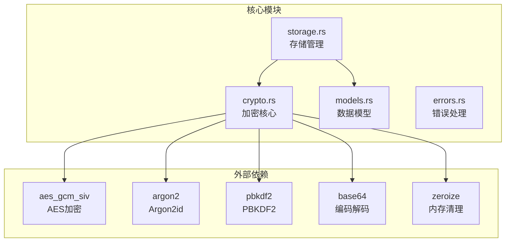

**图表来源**
- [crypto.rs](file://core/src/crypto.rs#L1-L321)
- [storage.rs](file://core/src/storage.rs#L1-L50)

**章节来源**
- [crypto.rs](file://core/src/crypto.rs#L1-L321)
- [lib.rs](file://core/src/lib.rs#L1-L37)

## 核心组件

### 加密密钥结构体

`EncryptionKey`结构体是加密系统的核心，提供了安全的密钥管理：

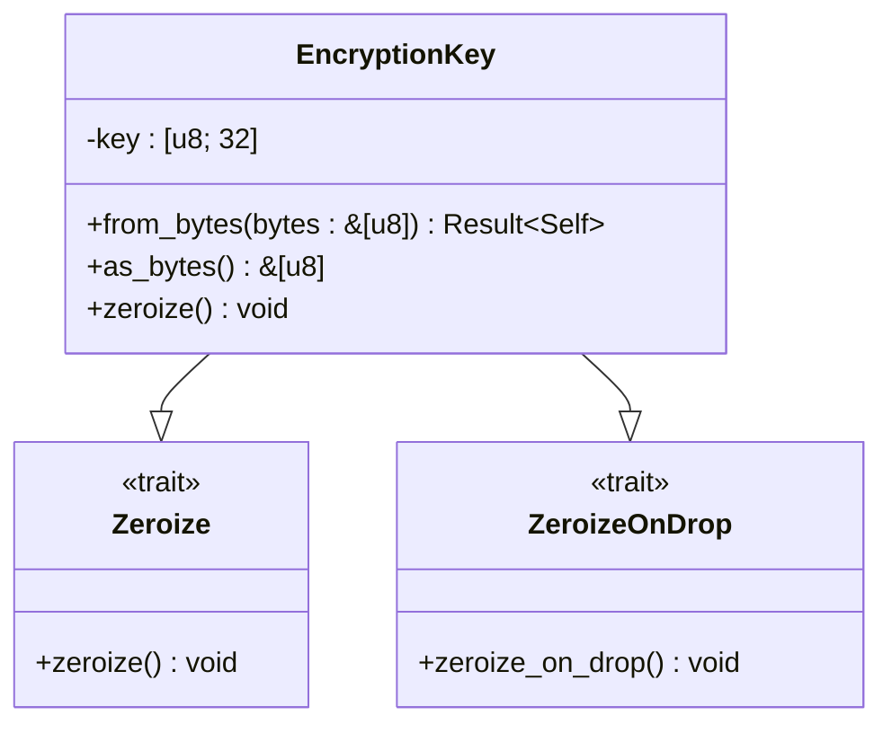

**图表来源**
- [crypto.rs](file://core/src/crypto.rs#L39-L64)

### 密钥派生参数

`KdfParams`结构体定义了密钥派生函数的配置参数：

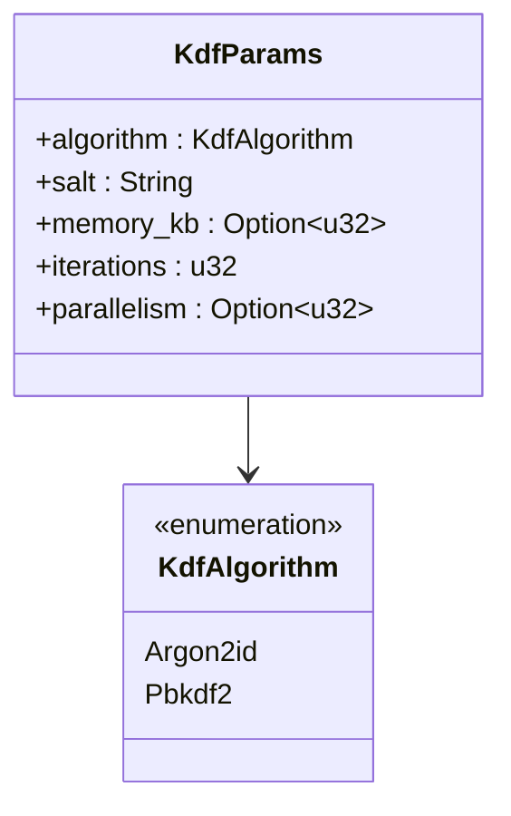

**图表来源**
- [crypto.rs](file://core/src/crypto.rs#L66-L84)

### 加密数据容器

`EncryptedData`结构体封装了加密后的数据：

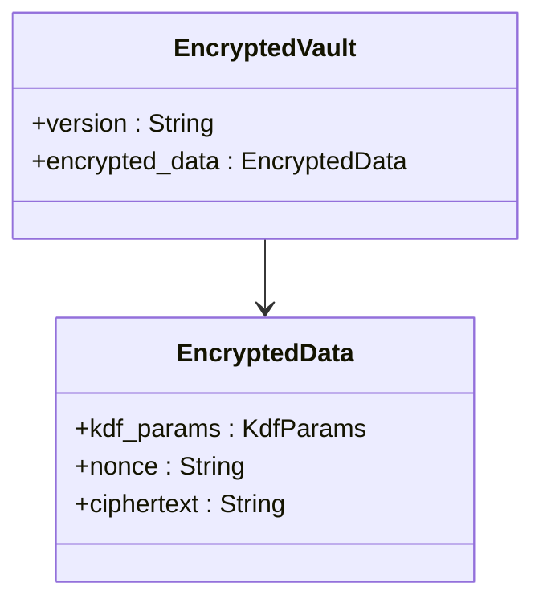

**图表来源**
- [crypto.rs](file://core/src/crypto.rs#L121-L127)
- [storage.rs](file://core/src/storage.rs#L21-L26)

**章节来源**
- [crypto.rs](file://core/src/crypto.rs#L39-L127)

## 架构概览

SecureFox加密模块采用分层架构设计，从底层密码学原语到高层应用接口：

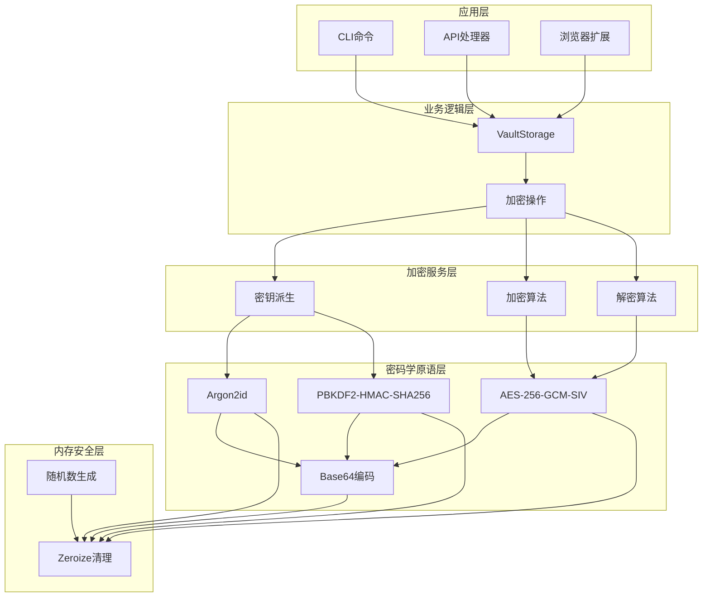

**图表来源**
- [crypto.rs](file://core/src/crypto.rs#L1-L321)
- [storage.rs](file://core/src/storage.rs#L1-L318)

## 详细组件分析

### AES-256-GCM-SIV加密算法

SecureFox使用AES-256-GCM-SIV作为主要的加密算法，这是一种认证加密模式：

#### 核心加密流程

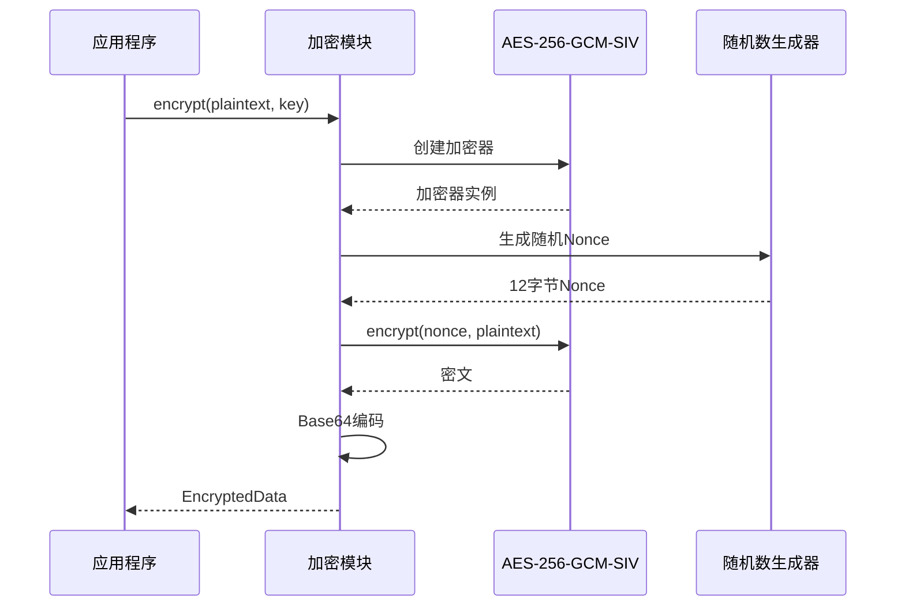

**图表来源**
- [crypto.rs](file://core/src/crypto.rs#L183-L199)

#### Nonce生成机制

AES-256-GCM-SIV需要12字节的随机Nonce，通过操作系统提供的安全随机数生成器实现：

- **Nonce大小**：12字节（96位）
- **生成方式**：使用`OsRng`生成
- **安全性保证**：防止重放攻击和密钥泄露

#### Base64编码流程

加密后的数据通过Base64编码进行序列化：

- **编码标准**：使用标准Base64引擎
- **用途**：确保二进制数据在JSON中安全传输
- **反向解码**：解密时自动还原原始字节

**章节来源**
- [crypto.rs](file://core/src/crypto.rs#L183-L199)

### 密钥派生函数

SecureFox支持两种密钥派生函数，每种都有其特定的安全特性和适用场景：

#### Argon2id配置

Argon2id是当前推荐的密钥派生函数，具有以下配置：

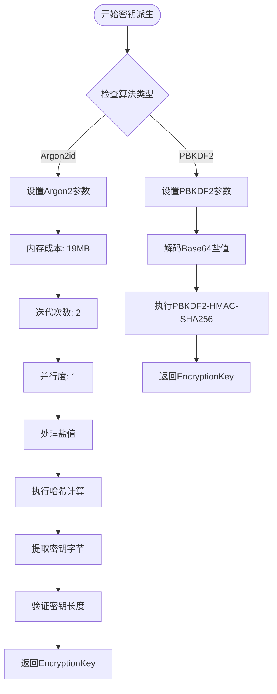

**图表来源**
- [crypto.rs](file://core/src/crypto.rs#L129-L173)

#### Argon2id参数配置

| 参数 | 值 | 安全考量 |
|------|-----|----------|
| 内存成本 | 19456 KB (19MB) | OWASP推荐最小值，平衡安全性和性能 |
| 迭代次数 | 2 | OWASP推荐最小值，在安全性和速度间平衡 |
| 并行度 | 1 | 单线程执行，提高兼容性 |
| 算法版本 | Argon2id | 最新版本，提供最佳安全性 |

#### PBKDF2配置

PBKDF2-HMAC-SHA256作为备用方案，具有以下特点：

| 参数 | 值 | 安全考量 |
|------|-----|----------|
| 迭代次数 | 100,000 | 在用户体验和安全性间取得平衡 |
| 哈希函数 | HMAC-SHA256 | 强大的哈希算法 |
| 盐值长度 | 16字节 | 提供足够随机性 |

**章节来源**
- [crypto.rs](file://core/src/crypto.rs#L129-L173)

### 内存安全设计

`EncryptionKey`结构体通过Zeroize特性实现内存安全：

#### Zeroize特性实现


**图表来源**
- [crypto.rs](file://core/src/crypto.rs#L39-L64)

#### 内存清理策略

1. **显式清理**：调用`zeroize()`方法立即清零密钥
2. **自动清理**：对象销毁时自动触发清理
3. **边界检查**：防止部分清理导致的安全漏洞

**章节来源**
- [crypto.rs](file://core/src/crypto.rs#L39-L64)

### 核心函数调用流程

#### 密钥派生流程

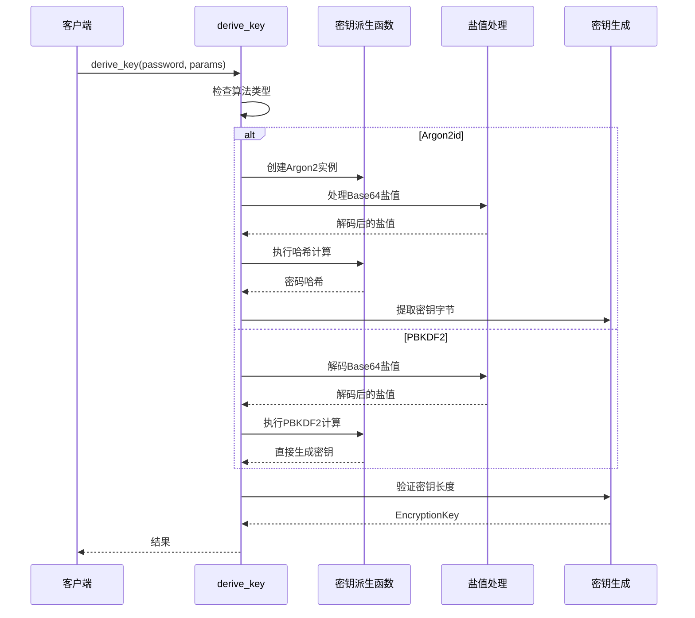

**图表来源**
- [crypto.rs](file://core/src/crypto.rs#L129-L173)

#### 加密解密流程

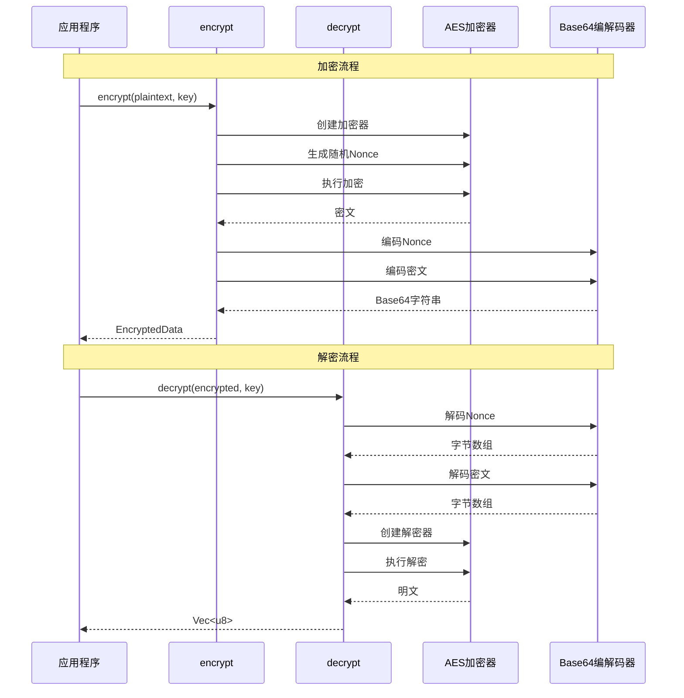

**图表来源**
- [crypto.rs](file://core/src/crypto.rs#L183-L257)

**章节来源**
- [crypto.rs](file://core/src/crypto.rs#L129-L257)

### 错误处理策略

加密模块实现了全面的错误处理机制：

#### 错误类型定义

| 错误类型 | 描述 | 处理策略 |
|----------|------|----------|
| Encryption | 加密过程错误 | 返回具体错误信息，不暴露内部状态 |
| Decryption | 解密过程错误 | 区分密钥错误和数据损坏 |
| InvalidPassword | 无效密码 | 提供统一的错误响应 |
| IO | 文件系统错误 | 传递底层IO错误 |

#### 错误传播机制

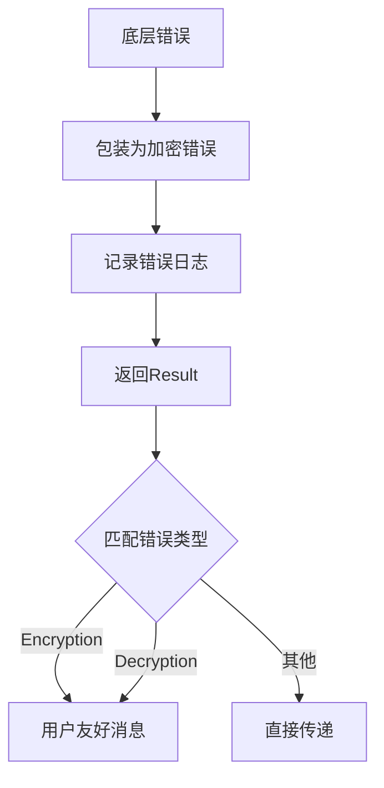

**图表来源**
- [errors.rs](file://core/src/errors.rs#L1-L46)

**章节来源**
- [errors.rs](file://core/src/errors.rs#L1-L46)
- [crypto.rs](file://core/src/crypto.rs#L131-L173)

## 依赖关系分析

### 外部依赖关系

SecureFox加密模块依赖以下关键外部库：

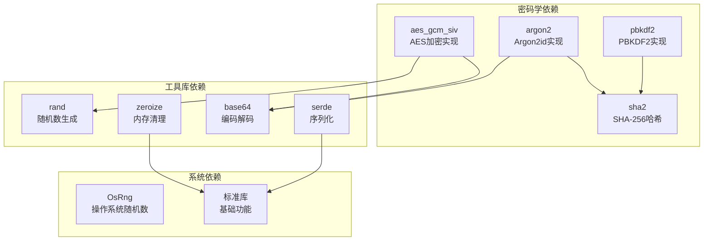

**图表来源**
- [crypto.rs](file://core/src/crypto.rs#L3-L16)

### 内部模块依赖

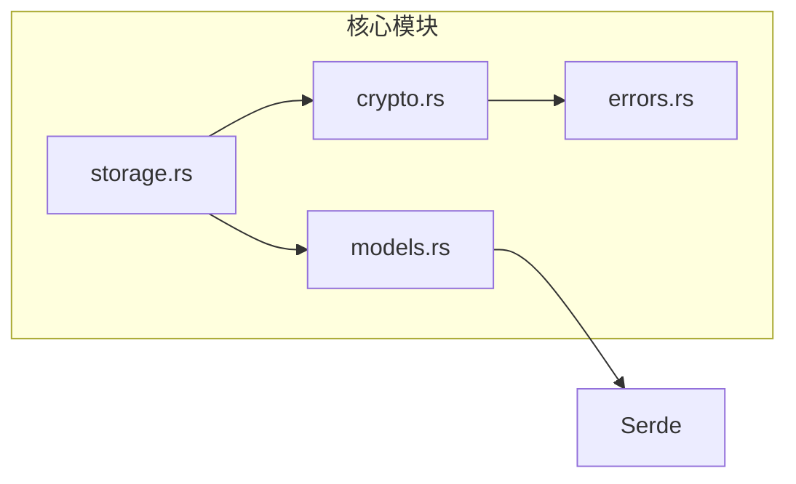

**图表来源**
- [crypto.rs](file://core/src/crypto.rs#L18-L19)
- [storage.rs](file://core/src/storage.rs#L8-L13)

**章节来源**
- [crypto.rs](file://core/src/crypto.rs#L3-L16)

## 性能考虑

### 密钥派生性能对比

| 算法 | 推荐配置 | 性能特点 | 适用场景 |
|------|----------|----------|----------|
| Argon2id | 19MB内存, 2次迭代 | CPU密集型，抗GPU攻击 | 高安全要求场景 |
| PBKDF2 | 100,000次迭代 | 兼容性好，快速执行 | 一般安全要求场景 |

### 内存使用优化

- **密钥缓存**：避免重复派生相同密码的密钥
- **批量操作**：支持批量加密多个项目
- **延迟初始化**：按需创建加密器实例

### 并发安全

- **无状态设计**：所有加密函数都是纯函数
- **线程安全**：所有依赖都支持并发访问
- **资源隔离**：每个操作使用独立的随机数生成器

## 故障排除指南

### 常见问题及解决方案

#### 密码验证失败

**症状**：使用正确密码无法解锁保险库

**可能原因**：
1. 密钥派生参数不匹配
2. 存储的加密数据损坏
3. 盐值或参数被篡改

**解决步骤**：
1. 检查KDF参数是否一致
2. 验证加密数据完整性
3. 尝试使用备份恢复

#### 性能问题

**症状**：解锁过程耗时过长

**诊断方法**：
```rust
// 测试不同KDF的性能
let start = std::time::Instant::now();
let key = derive_key(password, &kdf_params)?;
let duration = start.elapsed();
println!("Key derivation took: {:?}", duration);
```

**优化建议**：
- 使用PBKDF2替代Argon2id
- 调整迭代次数参数
- 启用密钥缓存机制

#### 内存泄漏检测

**监控方法**：
```rust
// 使用Zeroize特性验证内存清理
let mut key = generate_key();
// ... 使用密钥 ...
key.zeroize(); // 显式清理
assert!(key.as_bytes().iter().all(|&b| b == 0));
```

**章节来源**
- [crypto.rs](file://core/src/crypto.rs#L273-L321)

## 结论

SecureFox加密模块通过精心设计的多层架构，实现了企业级的密码安全管理。其主要优势包括：

### 技术优势

1. **现代密码学**：采用AES-256-GCM-SIV和Argon2id等最新密码学标准
2. **灵活配置**：支持多种密钥派生函数和参数配置
3. **内存安全**：通过Zeroize特性确保敏感数据的安全清理
4. **兼容性**：与Bitwarden格式完全兼容

### 安全特性

- **认证加密**：防止数据篡改攻击
- **前向保密**：单个密钥泄露不影响历史数据
- **抗量子攻击**：基于现代密码学原理
- **审计追踪**：详细的错误处理和日志记录

### 应用价值

该加密模块为SecureFox提供了坚实的安全基础，使其能够：
- 保护用户的敏感密码信息
- 支持跨平台的数据同步
- 维护数据的长期可用性
- 提供用户友好的安全体验

通过持续的安全审计和性能优化，SecureFox加密模块将继续为用户提供可靠、高效、安全的密码管理解决方案。