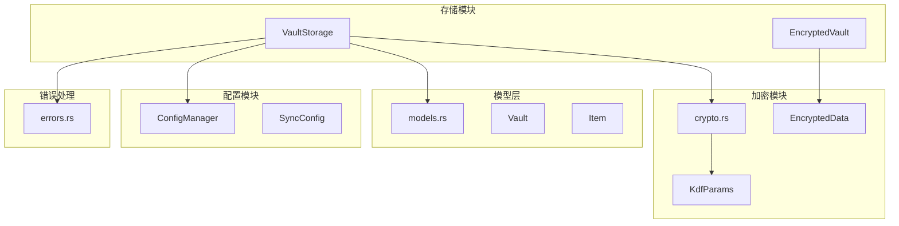
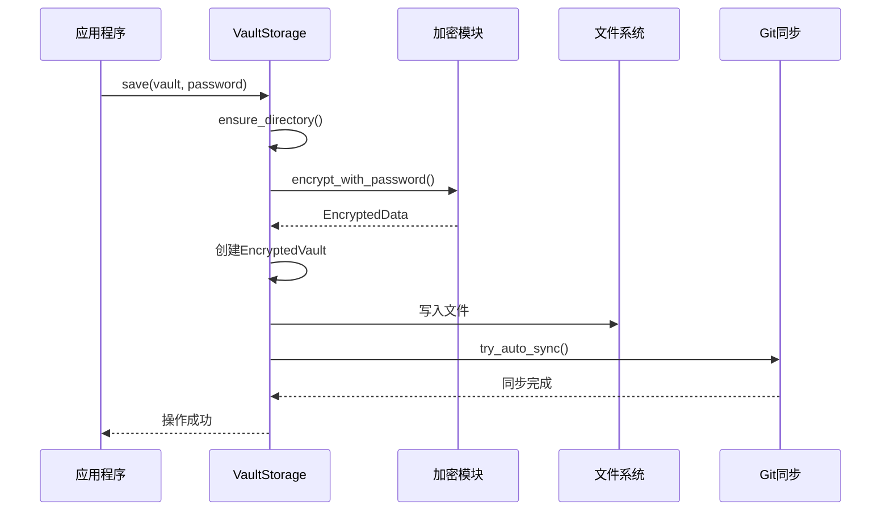
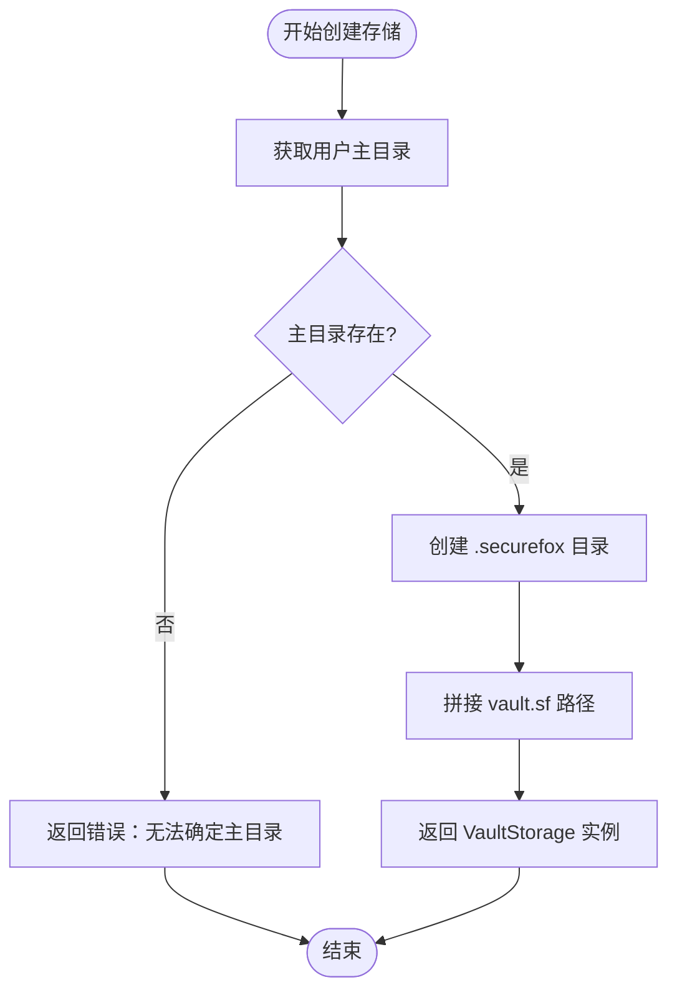
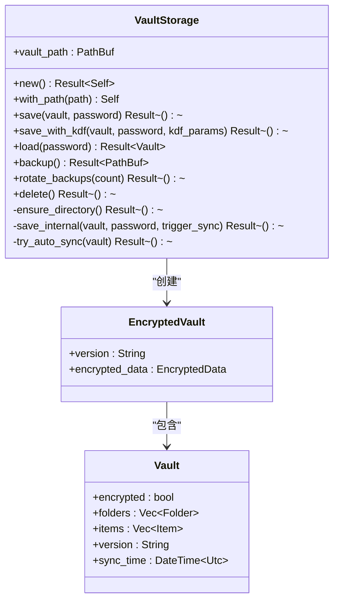
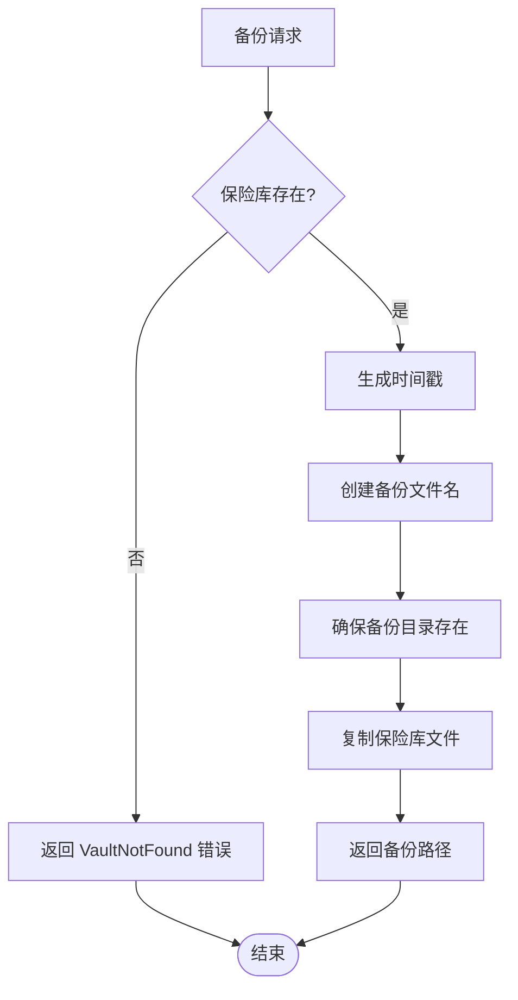
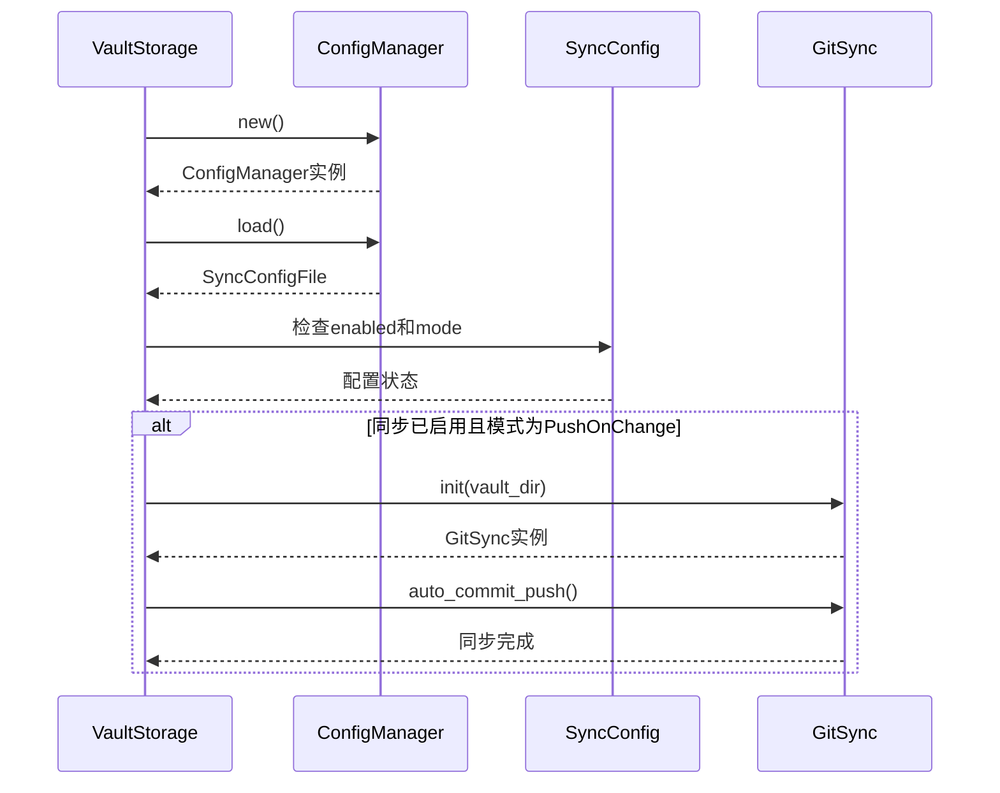
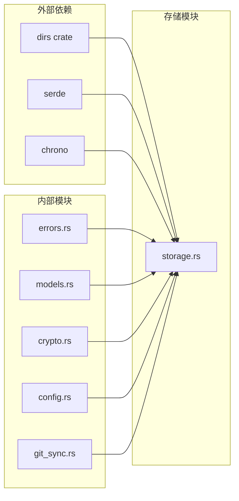
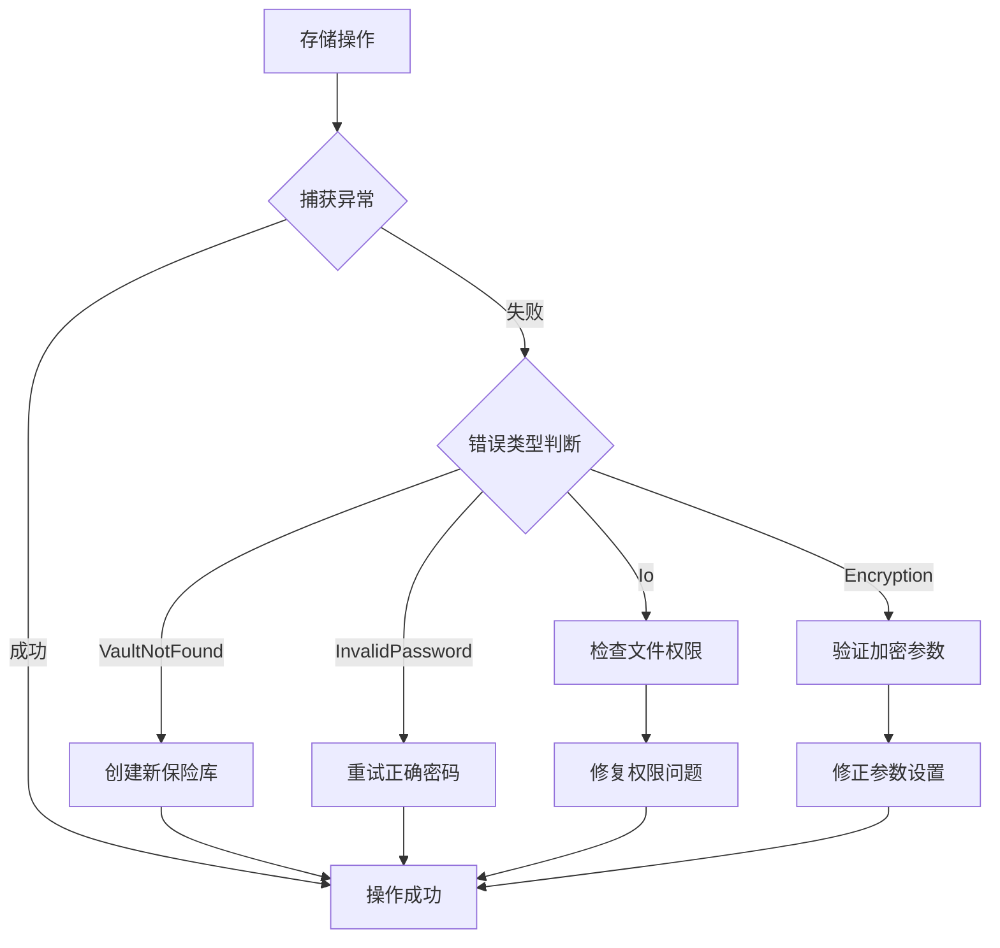

# 存储模块

<cite>
**本文档中引用的文件**
- [storage.rs](file://core/src/storage.rs)
- [crypto.rs](file://core/src/crypto.rs)
- [models.rs](file://core/src/models.rs)
- [errors.rs](file://core/src/errors.rs)
- [config.rs](file://core/src/config.rs)
- [git_sync.rs](file://core/src/git_sync.rs)
- [sync_daemon.rs](file://cli/src/sync_daemon.rs)
- [init.rs](file://cli/src/commands/init.rs)
</cite>

## 目录
1. [简介](#简介)
2. [项目结构](#项目结构)
3. [核心组件](#核心组件)
4. [架构概览](#架构概览)
5. [详细组件分析](#详细组件分析)
6. [依赖关系分析](#依赖关系分析)
7. [性能考虑](#性能考虑)
8. [故障排除指南](#故障排除指南)
9. [结论](#结论)

## 简介

SecureFox存储模块是SecureFox核心库中的关键组件，负责管理本地保险库文件的持久化存储。该模块通过`VaultStorage`结构体实现了安全的数据存储解决方案，支持加密存储、自动备份、Git同步等功能。存储模块采用分层架构设计，确保数据的安全性、可靠性和可扩展性。

## 项目结构

存储模块的核心文件位于`core/src/storage.rs`，与其他核心组件紧密协作：

**图表来源**
- [storage.rs](file://core/src/storage.rs#L1-L318)
- [crypto.rs](file://core/src/crypto.rs#L1-L200)
- [models.rs](file://core/src/models.rs#L1-L200)

**章节来源**
- [storage.rs](file://core/src/storage.rs#L1-L318)

## 核心组件

### VaultStorage 结构体

`VaultStorage`是存储模块的核心结构体，负责管理保险库文件的完整生命周期：

- **默认路径管理**：自动在`~/.securefox/vault.sf`创建保险库文件
- **路径灵活性**：支持自定义存储路径
- **目录确保**：自动创建必要的目录结构
- **文件操作**：提供完整的CRUD操作接口

### EncryptedVault 容器格式

`EncryptedVault`是加密保险库的标准容器格式：

- **版本控制**：当前版本为"1.0.0"
- **加密数据封装**：包含加密后的原始数据
- **序列化兼容**：使用JSON格式便于跨平台兼容

**章节来源**
- [storage.rs](file://core/src/storage.rs#L21-L26)

## 架构概览

存储模块采用分层架构设计，确保职责分离和代码可维护性：

**图表来源**
- [storage.rs](file://core/src/storage.rs#L70-L100)
- [crypto.rs](file://core/src/crypto.rs#L183-L200)

## 详细组件分析

### 默认路径生成逻辑

存储模块通过智能路径管理确保用户无需手动配置：

**图表来源**
- [storage.rs](file://core/src/storage.rs#L35-L41)

### 保存操作流程

保存操作是存储模块的核心功能，涉及多个步骤的协调：

**图表来源**
- [storage.rs](file://core/src/storage.rs#L28-L318)
- [models.rs](file://core/src/models.rs#L8-L27)

### 加密存储机制

存储模块支持两种加密方案：

| 加密算法 | 特点 | 性能 | 安全级别 |
|---------|------|------|----------|
| PBKDF2 | 标准算法，快速 | 高 | 中等 |
| Argon2id | 高安全性，抗GPU攻击 | 中等 | 高 |

### 自动备份功能

备份系统提供时间戳命名和保留策略：

**图表来源**
- [storage.rs](file://core/src/storage.rs#L180-L208)

### Git同步触发机制

自动同步功能通过条件检查确保只在必要时触发：

**图表来源**
- [storage.rs](file://core/src/storage.rs#L135-L158)
- [config.rs](file://core/src/config.rs#L1-L98)

**章节来源**
- [storage.rs](file://core/src/storage.rs#L70-L158)

## 依赖关系分析

存储模块的依赖关系体现了清晰的分层架构：

**图表来源**
- [storage.rs](file://core/src/storage.rs#L1-L14)

### 关键依赖说明

| 依赖项 | 用途 | 版本要求 |
|--------|------|----------|
| `dirs` | 获取用户主目录 | 最新稳定版 |
| `serde` | 序列化/反序列化 | 1.0+ |
| `chrono` | 时间戳处理 | 0.4+ |
| `thiserror` | 错误类型定义 | 最新稳定版 |

**章节来源**
- [storage.rs](file://core/src/storage.rs#L1-L14)

## 性能考虑

### 加密性能优化

- **默认PBKDF2**：在安全性和性能之间取得平衡
- **可选Argon2**：为高安全性需求提供更强保护
- **内存管理**：使用`zeroize`确保敏感数据及时清理

### 文件系统操作优化

- **原子写入**：确保文件写入的原子性
- **目录预创建**：减少运行时目录检查开销
- **批量操作**：备份轮换采用批量删除策略

### 缓存策略

- **配置缓存**：Git同步配置按需加载
- **连接复用**：Git操作复用仓库连接

## 故障排除指南

### 常见错误及解决方案

| 错误类型 | 可能原因 | 解决方案 |
|----------|----------|----------|
| `VaultNotFound` | 保险库文件不存在 | 使用`save()`创建新保险库 |
| `InvalidPassword` | 密码错误 | 确认密码正确性 |
| `Io` | 文件系统权限问题 | 检查目录写入权限 |
| `Encryption` | 加密参数无效 | 验证KDF参数设置 |

### 异常处理最佳实践

### 测试用例验证

存储模块包含全面的测试覆盖：

- **基本CRUD操作**：创建、读取、更新、删除
- **加密解密验证**：确保数据完整性
- **错误场景处理**：密码错误、文件不存在等情况
- **临时目录测试**：验证非标准路径行为

**章节来源**
- [storage.rs](file://core/src/storage.rs#L266-L317)
- [errors.rs](file://core/src/errors.rs#L1-L46)

## 结论

SecureFox存储模块通过精心设计的架构提供了安全、可靠的保险库存储解决方案。其主要优势包括：

1. **安全性**：采用AES-256-GCM-SIV加密和多种KDF算法
2. **可靠性**：完善的错误处理和备份机制
3. **可用性**：简洁的API设计和灵活的配置选项
4. **可扩展性**：模块化设计支持功能扩展

该模块为SecureFox应用提供了坚实的数据存储基础，确保用户数据的安全性和可访问性。通过持续的优化和改进，存储模块将继续为用户提供卓越的体验。