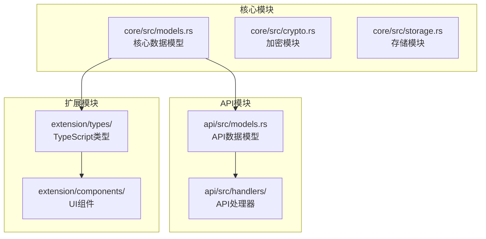
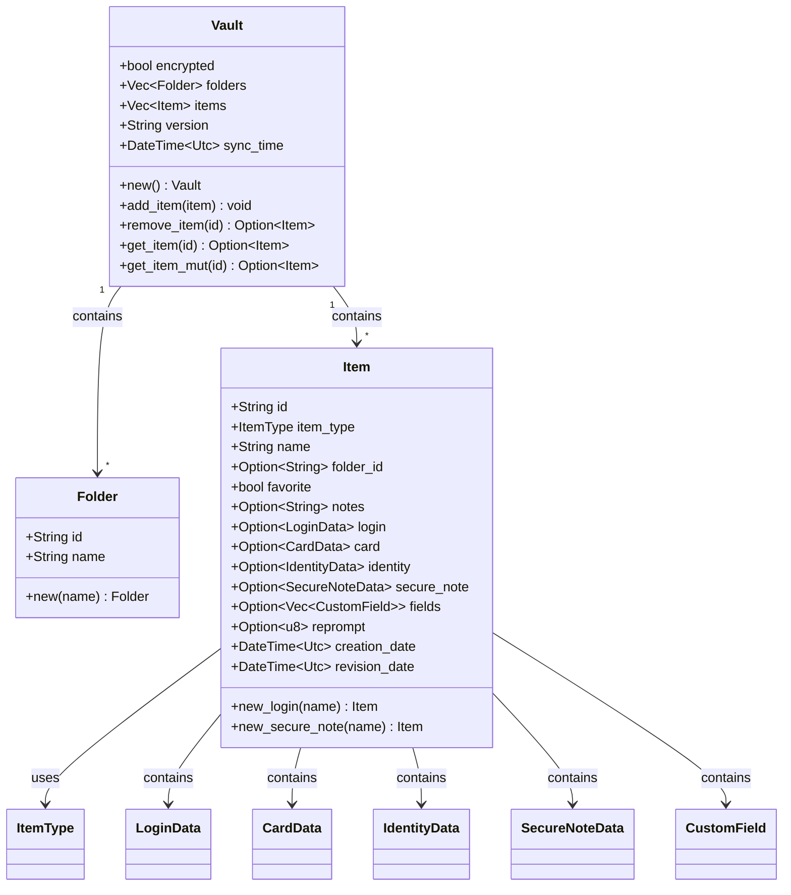
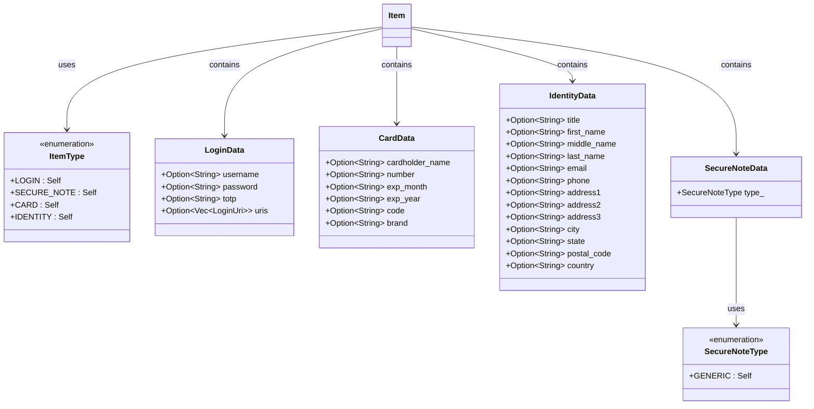
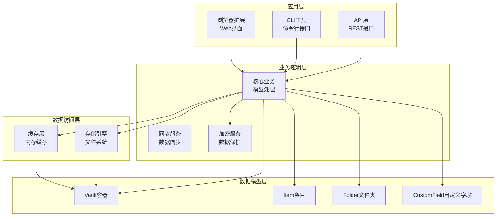
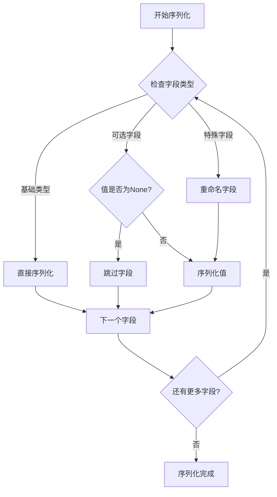
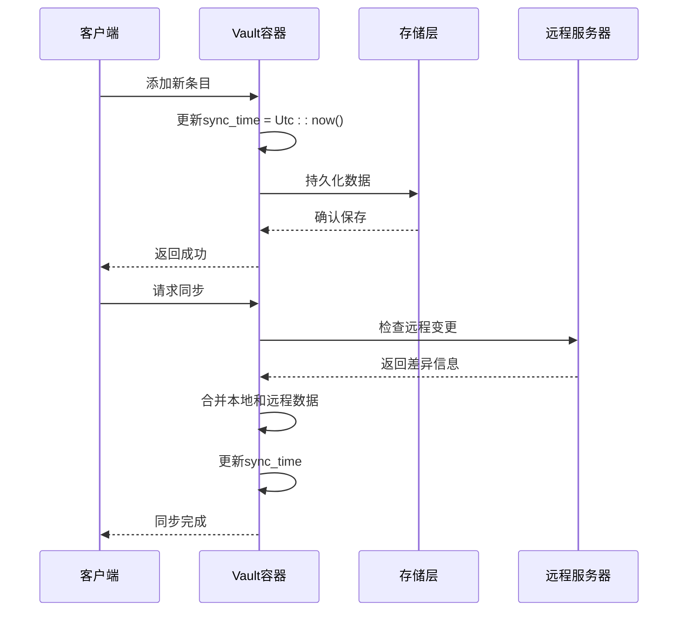
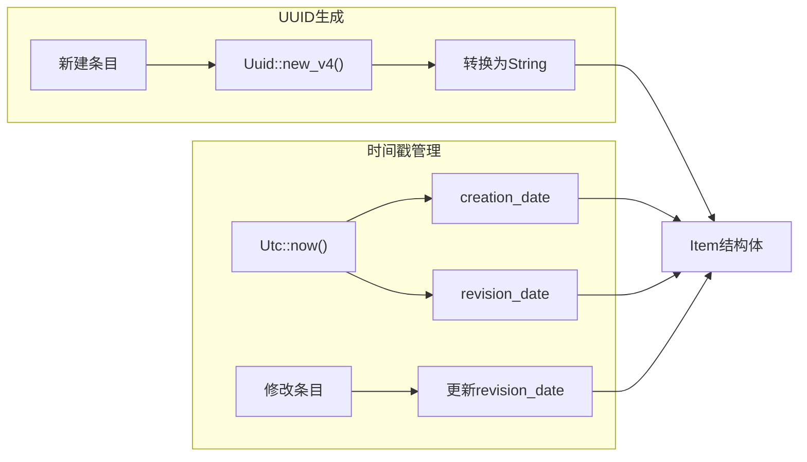
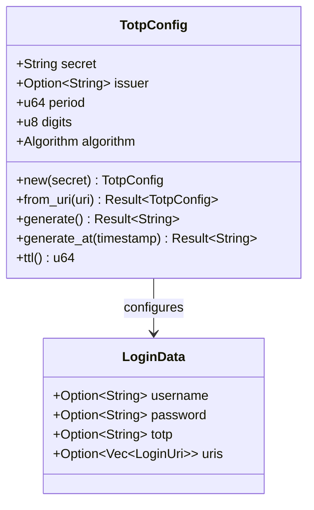
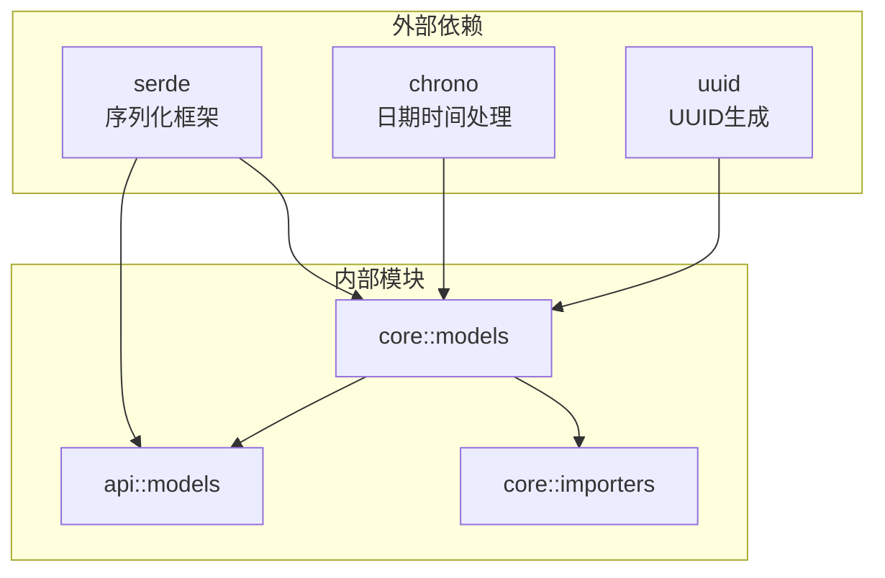
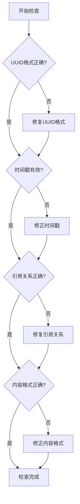

# 数据模型

<cite>
**本文档中引用的文件**
- [core/src/models.rs](file://core/src/models.rs)
- [api/src/models.rs](file://api/src/models.rs)
- [core/src/importers/bitwarden.rs](file://core/src/importers/bitwarden.rs)
- [extension/types/index.ts](file://extension/types/index.ts)
- [api/src/handlers/mod.rs](file://api/src/handlers/mod.rs)
- [extension/components/LoginDetailView.tsx](file://extension/components/LoginDetailView.tsx)
- [extension/components/CardDetailView.tsx](file://extension/components/CardDetailView.tsx)
- [core/src/totp.rs](file://core/src/totp.rs)
</cite>

## 目录
1. [简介](#简介)
2. [项目结构](#项目结构)
3. [核心组件](#核心组件)
4. [架构概览](#架构概览)
5. [详细组件分析](#详细组件分析)
6. [依赖关系分析](#依赖关系分析)
7. [性能考虑](#性能考虑)
8. [故障排除指南](#故障排除指南)
9. [结论](#结论)

## 简介

SecureFox是一个与Bitwarden兼容的密码管理器，其数据模型设计严格遵循Bitwarden格式规范。核心库中的`models.rs`模块提供了完整的数据结构定义，支持多种类型的密码条目（登录、信用卡、身份信息、安全笔记），并实现了高效的JSON序列化机制。

该数据模型系统具有以下关键特性：
- **Bitwarden兼容性**：完全兼容Bitwarden格式，确保无缝迁移
- **类型安全**：通过枚举和结构体实现强类型约束
- **高效序列化**：使用`serde`库实现优化的JSON序列化
- **时间戳管理**：自动维护创建和修改时间戳
- **元数据优化**：智能的字段跳过机制减少存储开销

## 项目结构

SecureFox的数据模型分布在多个模块中，形成了清晰的分层架构：

**图表来源**
- [core/src/models.rs](file://core/src/models.rs#L1-L416)
- [api/src/models.rs](file://api/src/models.rs#L1-L171)
- [extension/types/index.ts](file://extension/types/index.ts#L1-L152)

**章节来源**
- [core/src/models.rs](file://core/src/models.rs#L1-L416)
- [api/src/models.rs](file://api/src/models.rs#L1-L171)

## 核心组件

### Vault主容器

`Vault`是SecureFox的核心数据容器，类似于Bitwarden中的Vault概念。它包含了所有密码条目和文件夹信息，并维护同步状态。

**图表来源**
- [core/src/models.rs](file://core/src/models.rs#L8-L16)
- [core/src/models.rs](file://core/src/models.rs#L59-L73)
- [core/src/models.rs](file://core/src/models.rs#L88-L120)

### Item条目类型系统

SecureFox支持四种主要的密码条目类型，每种类型都有专门的数据结构：

**图表来源**
- [core/src/models.rs](file://core/src/models.rs#L76-L85)
- [core/src/models.rs](file://core/src/models.rs#L167-L178)
- [core/src/models.rs](file://core/src/models.rs#L204-L219)
- [core/src/models.rs](file://core/src/models.rs#L222-L251)
- [core/src/models.rs](file://core/src/models.rs#L254-L268)

**章节来源**
- [core/src/models.rs](file://core/src/models.rs#L8-L120)

## 架构概览

SecureFox的数据模型采用分层设计，确保了良好的可扩展性和维护性：

**图表来源**
- [core/src/models.rs](file://core/src/models.rs#L1-L416)
- [api/src/models.rs](file://api/src/models.rs#L1-L171)

## 详细组件分析

### 字段命名与序列化机制

SecureFox严格遵循Bitwarden的camelCase字段命名约定，通过`serde`库实现透明序列化：

**图表来源**
- [core/src/models.rs](file://core/src/models.rs#L89-L120)
- [core/src/models.rs](file://core/src/models.rs#L167-L178)

### 同步时间戳机制

Vault容器维护精确的时间戳信息，用于同步和版本控制：

**图表来源**
- [core/src/models.rs](file://core/src/models.rs#L29-L40)
- [core/src/models.rs](file://core/src/models.rs#L18-L26)

### 元数据管理策略

SecureFox实现了智能的元数据管理，通过`skip_serializing_if`优化减少存储空间：

| 字段类型 | 跳过条件 | 默认值 | 存储优化 |
|---------|---------|--------|----------|
| `folder_id` | `Option::is_none` | `None` | 避免空文件夹ID |
| `notes` | `Option::is_none` | `None` | 只存储有内容的备注 |
| `login` | `Option::is_none` | `None` | 登录类型专用字段 |
| `card` | `Option::is_none` | `None` | 卡片类型专用字段 |
| `identity` | `Option::is_none` | `None` | 身份类型专用字段 |
| `secure_note` | `Option::is_none` | `None` | 笔记类型专用字段 |
| `fields` | `Option::is_none` | `None` | 自定义字段数组 |
| `reprompt` | `Option::is_none` | `None` | 重新提示设置 |

**章节来源**
- [core/src/models.rs](file://core/src/models.rs#L95-L119)

### UUID生成与时间戳管理

每个条目都拥有唯一的标识符和精确的时间戳：

**图表来源**
- [core/src/models.rs](file://core/src/models.rs#L126-L139)
- [core/src/models.rs](file://core/src/models.rs#L143-L162)

**章节来源**
- [core/src/models.rs](file://core/src/models.rs#L122-L162)

### TOTP集成与安全考虑

SecureFox支持TOTP（基于时间的一次性密码）功能，通过专门的配置结构实现：

**图表来源**
- [core/src/totp.rs](file://core/src/totp.rs#L48-L210)
- [core/src/models.rs](file://core/src/models.rs#L167-L178)

**章节来源**
- [core/src/totp.rs](file://core/src/totp.rs#L48-L210)
- [core/src/models.rs](file://core/src/models.rs#L167-L178)

## 依赖关系分析

SecureFox数据模型的依赖关系体现了清晰的分层架构：

**图表来源**
- [core/src/models.rs](file://core/src/models.rs#L3-L6)
- [api/src/models.rs](file://api/src/models.rs#L1-L4)

**章节来源**
- [core/src/models.rs](file://core/src/models.rs#L1-L6)
- [api/src/models.rs](file://api/src/models.rs#L1-L4)

## 性能考虑

### 序列化优化策略

SecureFox采用了多种优化策略来提高JSON序列化的性能：

1. **字段跳过机制**：通过`skip_serializing_if`避免序列化空值字段
2. **透明序列化**：使用`transparent`属性简化枚举类型的序列化
3. **camelCase命名**：统一的字段命名减少解析开销
4. **类型特定优化**：不同类型的条目只序列化相关的字段

### 内存管理优化

- **Clone优化**：关键结构体实现了`Clone` trait以支持高效复制
- **引用传递**：大量使用引用避免不必要的数据拷贝
- **惰性加载**：按需加载条目数据，减少内存占用

### 时间戳管理效率

- **原子操作**：时间戳更新使用原子操作确保一致性
- **批量处理**：批量操作时统一更新同步时间
- **缓存策略**：合理缓存频繁访问的时间戳信息

## 故障排除指南

### 常见序列化问题

1. **字段缺失问题**
   - 症状：某些字段在JSON中不出现
   - 原因：使用了`skip_serializing_if`且字段为None
   - 解决方案：检查字段的可选性设置

2. **类型转换错误**
   - 症状：枚举类型无法正确反序列化
   - 原因：Bitwarden兼容性问题
   - 解决方案：验证`transparent`属性的使用

3. **时间戳不一致**
   - 症状：创建时间和修改时间不匹配
   - 原因：手动修改了时间戳字段
   - 解决方案：使用提供的方法自动更新时间戳

### 数据完整性检查

**章节来源**
- [core/src/models.rs](file://core/src/models.rs#L398-L415)

## 结论

SecureFox的核心数据模型展现了现代密码管理器设计的最佳实践。通过严格的Bitwarden兼容性、高效的序列化机制、智能的元数据管理和完善的类型系统，该模型为用户提供了安全、可靠且高性能的密码管理体验。

### 主要优势

1. **完全兼容性**：与Bitwarden格式完全兼容，确保数据迁移无障碍
2. **类型安全**：强类型系统防止数据损坏和意外错误
3. **性能优化**：智能的序列化和存储优化策略
4. **扩展性强**：模块化设计便于功能扩展和维护
5. **用户体验**：直观的API设计降低开发复杂度

### 技术特色

- **透明序列化**：通过`serde`实现零配置的高效序列化
- **智能跳过**：`skip_serializing_if`机制显著减少存储空间
- **时间戳自动化**：自动维护精确的时间戳信息
- **UUID唯一性**：确保每个条目的全球唯一标识

这个数据模型不仅满足了当前的功能需求，还为未来的功能扩展奠定了坚实的基础，是SecureFox项目成功的关键技术组件之一。