# 核心架构

<cite>
**本文档引用的文件**
- [core/src/lib.rs](file://core/src/lib.rs)
- [core/src/crypto.rs](file://core/src/crypto.rs)
- [core/src/storage.rs](file://core/src/storage.rs)
- [core/src/models.rs](file://core/src/models.rs)
- [core/src/errors.rs](file://core/src/errors.rs)
- [core/src/config.rs](file://core/src/config.rs)
- [core/src/git_sync.rs](file://core/src/git_sync.rs)
- [core/src/keychain.rs](file://core/src/keychain.rs)
- [core/src/totp.rs](file://core/src/totp.rs)
- [core/src/importers/mod.rs](file://core/src/importers/mod.rs)
- [api/src/lib.rs](file://api/src/lib.rs)
- [api/src/state.rs](file://api/src/state.rs)
- [Cargo.toml](file://Cargo.toml)
</cite>

## 目录
1. [简介](#简介)
2. [项目结构](#项目结构)
3. [核心组件](#核心组件)
4. [架构概览](#架构概览)
5. [详细组件分析](#详细组件分析)
6. [依赖关系分析](#依赖关系分析)
7. [性能考虑](#性能考虑)
8. [故障排除指南](#故障排除指南)
9. [结论](#结论)

## 简介

SecureFox核心库（core模块）是整个密码管理系统的基石，提供了加密、存储和数据模型的基础组件。该模块采用高度模块化的设计，支持多种功能特性，包括AES-256-GCM-SIV加密、Argon2id/PBKDF2密钥派生、本地存储持久化、Git同步、系统密钥链集成等。

核心库的设计遵循了以下原则：
- **安全性优先**：采用业界标准的加密算法和密钥派生函数
- **模块化设计**：各功能模块独立，便于维护和扩展
- **跨平台兼容**：支持Windows、macOS和Linux系统
- **可插拔架构**：通过特性标志实现功能的动态启用/禁用

## 项目结构

SecureFox核心库采用清晰的模块化结构，每个模块负责特定的功能领域：

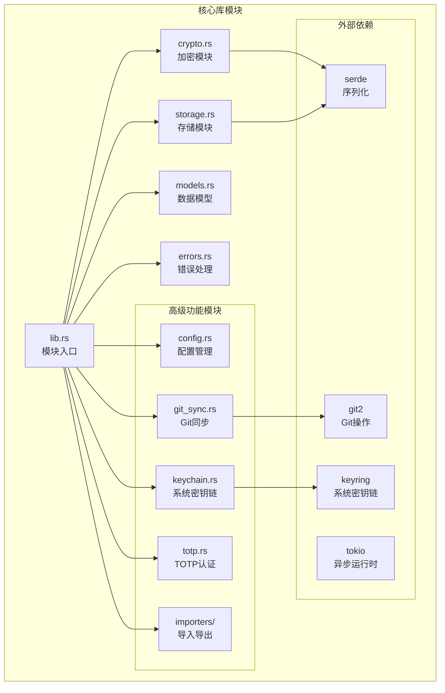

**图表来源**
- [core/src/lib.rs](file://core/src/lib.rs#L1-L37)
- [core/src/crypto.rs](file://core/src/crypto.rs#L1-L321)
- [core/src/storage.rs](file://core/src/storage.rs#L1-L318)

**章节来源**
- [core/src/lib.rs](file://core/src/lib.rs#L1-L37)
- [Cargo.toml](file://Cargo.toml#L1-L23)

## 核心组件

### 加密引擎（Crypto Module）

加密模块是SecureFox安全性的核心，实现了完整的端到端加密解决方案：

- **AES-256-GCM-SIV**：使用aes-gcm-siv crate提供抗篡改的加密
- **密钥派生**：支持Argon2id和PBKDF2两种算法
- **密钥管理**：自动内存清理和零化保护
- **参数化加密**：支持自定义KDF参数

### 存储系统（Storage Module）

存储模块负责将加密数据持久化到本地文件系统：

- **文件管理**：自动创建目录结构和备份机制
- **版本控制**：支持多版本vault文件管理
- **原子操作**：确保数据一致性和完整性
- **Git集成**：可选的自动同步功能

### 数据模型（Models Module）

数据模型层定义了与Bitwarden格式兼容的数据结构：

- **Vault容器**：主数据容器，包含项目和文件夹
- **项目类型**：登录、安全笔记、信用卡、身份信息
- **同步配置**：支持手动和自动同步模式
- **元数据管理**：时间戳、创建者信息等

**章节来源**
- [core/src/crypto.rs](file://core/src/crypto.rs#L1-L321)
- [core/src/storage.rs](file://core/src/storage.rs#L1-L318)
- [core/src/models.rs](file://core/src/models.rs#L1-L416)

## 架构概览

SecureFox核心库采用了分层架构设计，从底层的安全性到上层的应用接口：

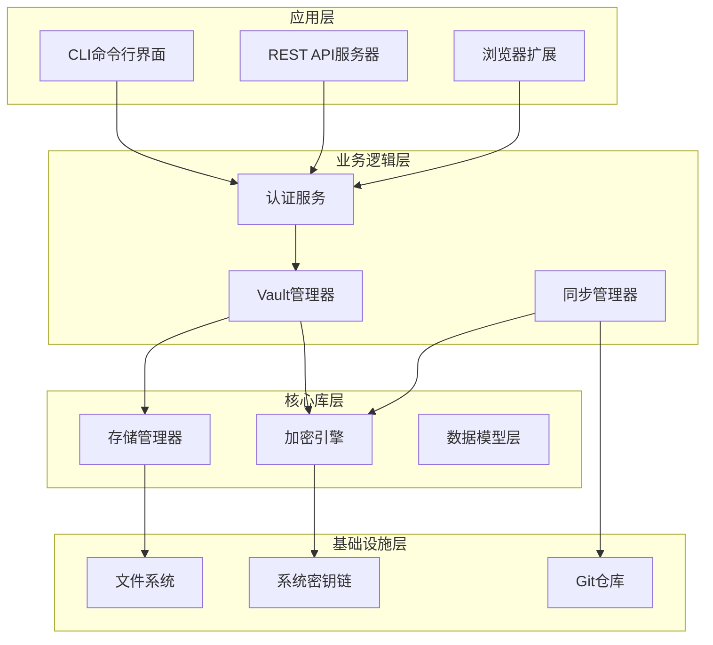

**图表来源**
- [api/src/lib.rs](file://api/src/lib.rs#L25-L93)
- [api/src/state.rs](file://api/src/state.rs#L1-L113)

### 模块间通信

核心库通过明确定义的接口与外部模块交互：

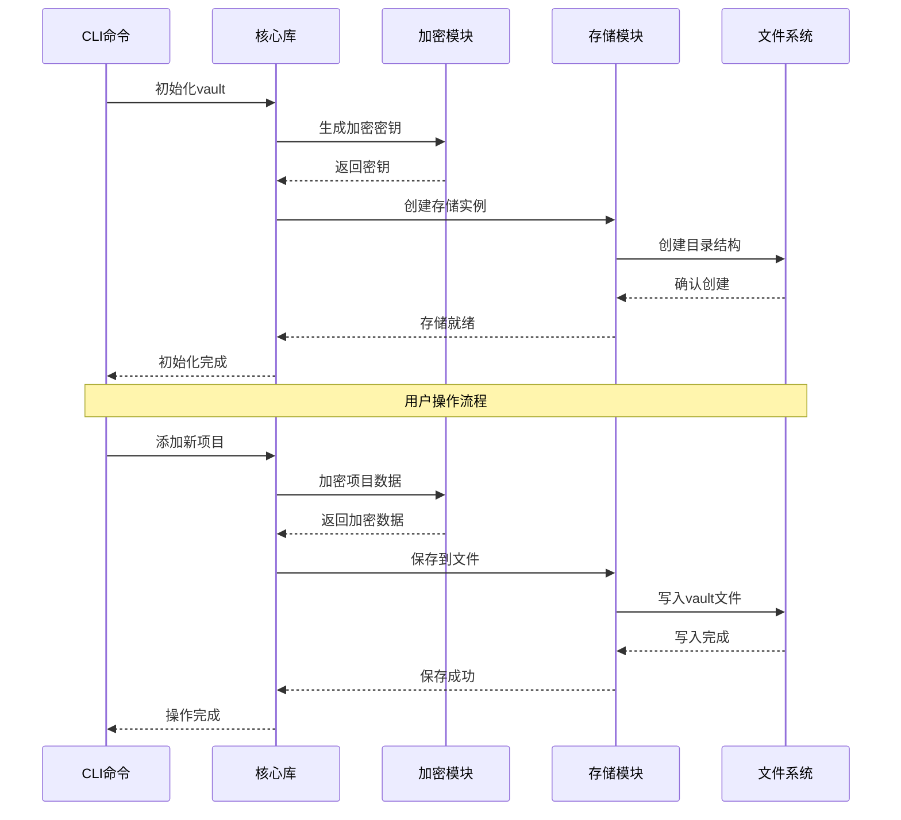

**图表来源**
- [core/src/storage.rs](file://core/src/storage.rs#L69-L132)
- [core/src/crypto.rs](file://core/src/crypto.rs#L183-L228)

## 详细组件分析

### 加密设计详解

#### AES-256-GCM-SIV加密机制

SecureFox采用AES-256-GCM-SIV作为主要的加密算法，这是一种具有认证功能的对称加密方案：

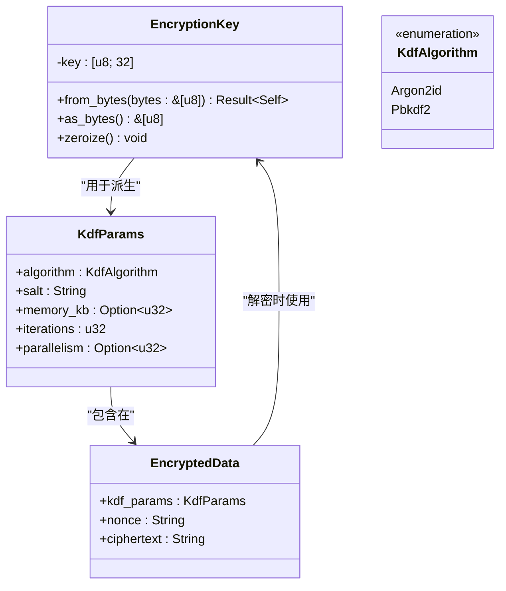

**图表来源**
- [core/src/crypto.rs](file://core/src/crypto.rs#L39-L127)

#### 密钥派生函数（KDF）实现

系统支持两种密钥派生算法，每种都有其特定的使用场景：

| 算法 | 特点 | 推荐场景 | 安全级别 |
|------|------|----------|----------|
| Argon2id | 内存密集型，抗ASIC攻击 | 高安全要求场景 | 高 |
| PBKDF2 | CPU友好，兼容性好 | 性能敏感场景 | 中等 |

#### 密钥生命周期管理

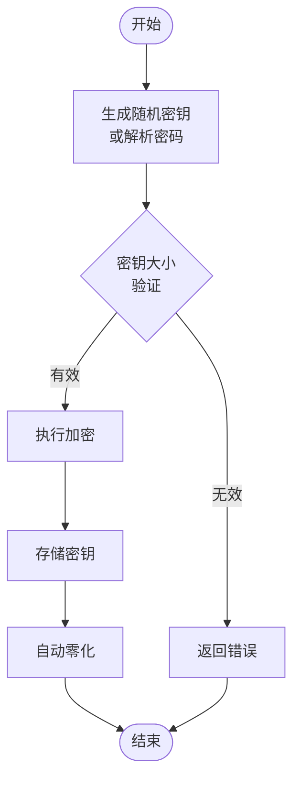

**图表来源**
- [core/src/crypto.rs](file://core/src/crypto.rs#L46-L64)

**章节来源**
- [core/src/crypto.rs](file://core/src/crypto.rs#L1-L321)

### 存储机制分析

#### Vault持久化架构

存储模块实现了完整的vault文件管理系统：

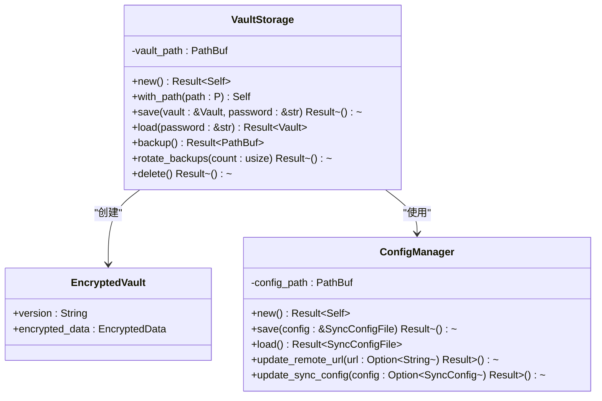

**图表来源**
- [core/src/storage.rs](file://core/src/storage.rs#L28-L318)
- [core/src/config.rs](file://core/src/config.rs#L19-L99)

#### 备份和恢复策略

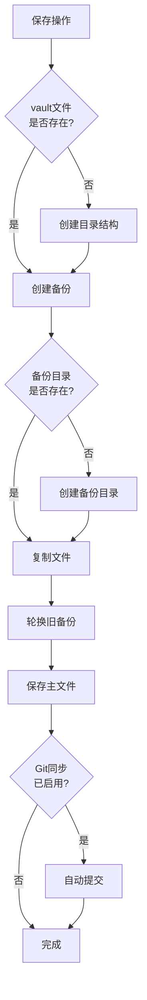

**图表来源**
- [core/src/storage.rs](file://core/src/storage.rs#L180-L249)

**章节来源**
- [core/src/storage.rs](file://core/src/storage.rs#L1-L318)
- [core/src/config.rs](file://core/src/config.rs#L1-L99)

### 数据模型设计

#### Vault数据结构

Vault是整个系统的核心数据容器，采用灵活的结构设计：

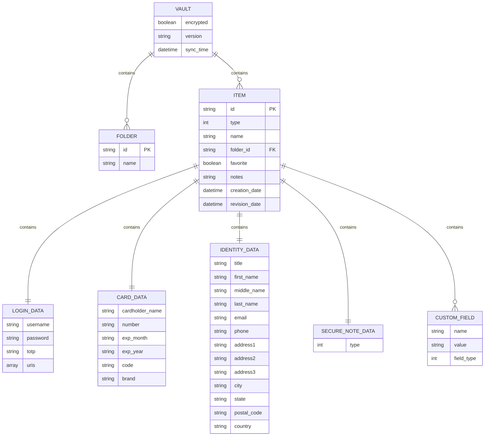

**图表来源**
- [core/src/models.rs](file://core/src/models.rs#L8-L416)

#### 同步配置模型

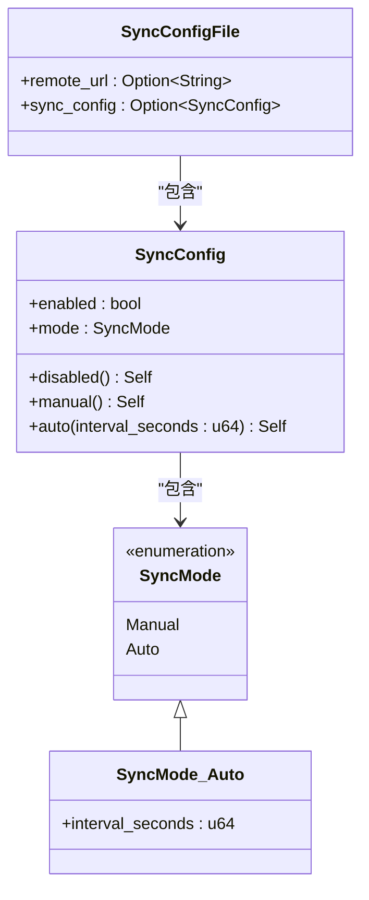

**图表来源**
- [core/src/models.rs](file://core/src/models.rs#L297-L378)

**章节来源**
- [core/src/models.rs](file://core/src/models.rs#L1-L416)

### 高级功能模块

#### Git同步机制

Git同步模块提供了版本控制和远程备份功能：

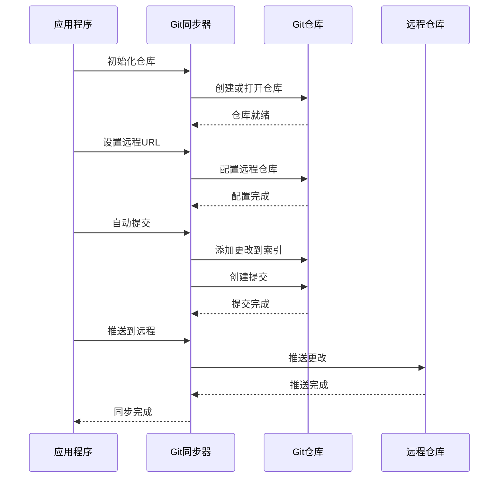

**图表来源**
- [core/src/git_sync.rs](file://core/src/git_sync.rs#L21-L218)

#### 系统密钥链集成

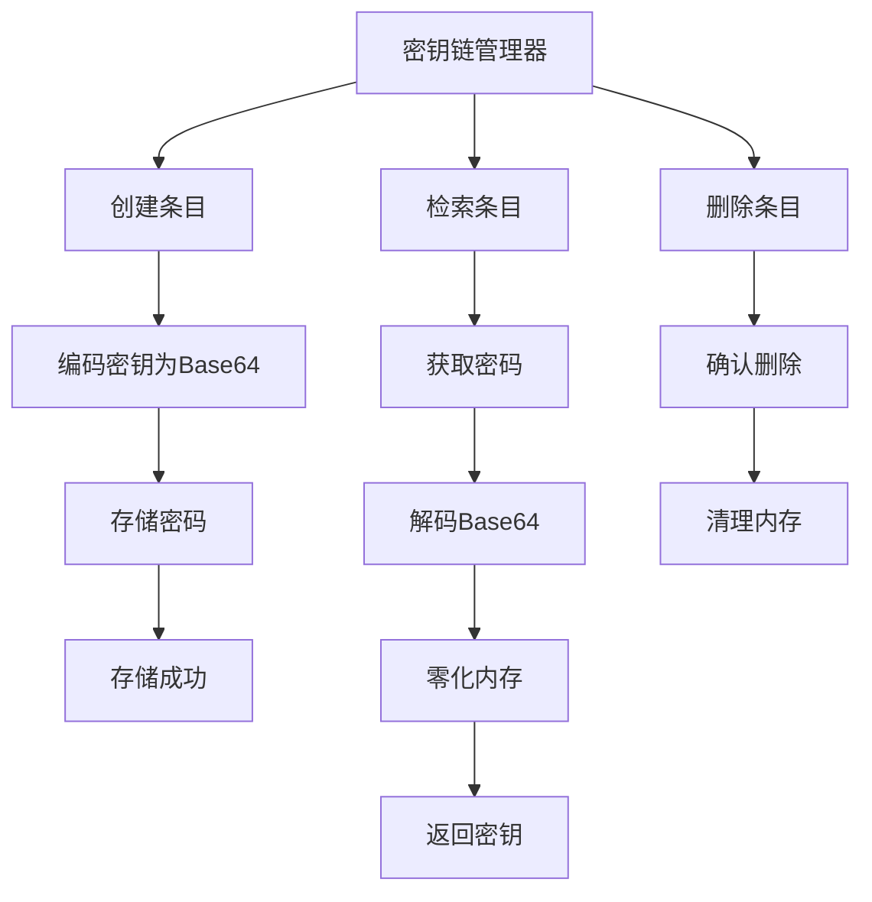

**图表来源**
- [core/src/keychain.rs](file://core/src/keychain.rs#L12-L118)

**章节来源**
- [core/src/git_sync.rs](file://core/src/git_sync.rs#L1-L503)
- [core/src/keychain.rs](file://core/src/keychain.rs#L1-L169)

## 依赖关系分析

### 内部模块依赖

核心库内部模块之间存在清晰的依赖层次：

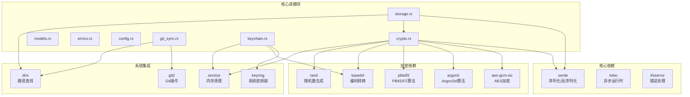

**图表来源**
- [core/src/crypto.rs](file://core/src/crypto.rs#L1-L17)
- [core/src/storage.rs](file://core/src/storage.rs#L1-L13)

### 外部模块集成

核心库通过标准化接口与外部模块集成：

| 集成模块 | 接口类型 | 主要功能 | 实现方式 |
|----------|----------|----------|----------|
| CLI模块 | 命令行接口 | 用户交互、参数解析 | 直接调用核心API |
| API模块 | RESTful接口 | Web服务、认证管理 | 通过状态管理器 |
| 扩展模块 | 浏览器API | 浏览器集成、权限管理 | 异步通信协议 |

**章节来源**
- [Cargo.toml](file://Cargo.toml#L12-L22)

## 性能考虑

### 加密性能优化

SecureFox在加密性能方面采用了多项优化策略：

- **密钥缓存**：内存中缓存解密后的密钥，避免重复派生
- **异步操作**：使用Tokio异步运行时处理I/O密集型操作
- **内存管理**：自动清理敏感数据，防止内存泄露
- **算法选择**：根据使用场景选择合适的KDF算法

### 存储性能优化

存储模块实现了多层次的性能优化：

- **原子写入**：确保文件操作的原子性，避免部分写入
- **增量备份**：只备份变更的部分，减少存储开销
- **压缩存储**：对加密数据进行压缩，节省磁盘空间
- **缓存机制**：内存缓存频繁访问的数据

### 并发安全设计

系统采用了多种并发安全机制：

- **读写锁**：使用parking_lot库的RwLock实现高效并发访问
- **线程安全**：所有共享状态都经过线程安全包装
- **无锁编程**：在可能的情况下使用无锁数据结构
- **资源隔离**：不同功能模块使用独立的资源池

## 故障排除指南

### 常见加密问题

#### 密钥派生失败

**症状**：密码验证失败或解密异常
**原因**：KDF参数不匹配或密码错误
**解决方案**：
1. 检查KDF参数是否正确
2. 验证密码输入是否准确
3. 确认盐值和迭代次数设置

#### 加密数据损坏

**症状**：无法加载vault文件
**原因**：文件损坏或格式不正确
**解决方案**：
1. 使用备份文件恢复
2. 检查文件完整性
3. 验证加密密钥

### 存储问题诊断

#### 权限错误

**症状**：无法创建目录或写入文件
**原因**：文件系统权限不足
**解决方案**：
1. 检查用户权限
2. 修改目录权限
3. 使用管理员权限运行

#### 磁盘空间不足

**症状**：保存操作失败
**原因**：可用磁盘空间不足
**解决方案**：
1. 清理磁盘空间
2. 调整备份保留策略
3. 优化存储配置

**章节来源**
- [core/src/errors.rs](file://core/src/errors.rs#L1-L46)

## 结论

SecureFox核心库展现了现代密码管理系统的最佳实践，通过精心设计的模块化架构实现了安全性、性能和可用性的完美平衡。其主要优势包括：

### 技术优势

- **安全性**：采用业界标准的加密算法和密钥管理
- **灵活性**：模块化设计支持功能的动态启用/禁用
- **兼容性**：与Bitwarden格式完全兼容，支持无缝迁移
- **可扩展性**：清晰的接口设计便于功能扩展

### 设计亮点

- **零信任架构**：所有敏感数据都经过加密处理
- **自动化管理**：智能的备份和同步机制
- **跨平台支持**：统一的API支持多个操作系统
- **错误处理**：完善的错误类型和处理机制

### 未来发展方向

核心库的设计为未来的功能扩展奠定了坚实基础，包括：
- 支持更多的导入导出格式
- 增强的同步冲突解决机制
- 更高级的密钥管理功能
- 云原生部署支持

通过这种精心设计的架构，SecureFox不仅提供了强大的密码管理功能，还为用户构建了一个安全、可靠、易用的数字资产保护平台。