# API客户端

<cite>
**本文档引用的文件**
- [client.ts](file://extension/lib/api/client.ts)
- [auth.ts](file://extension/lib/api/auth.ts)
- [entries.ts](file://extension/lib/api/entries.ts)
- [system.ts](file://extension/lib/api/system.ts)
- [index.ts](file://extension/lib/api/index.ts)
- [constants.ts](file://extension/utils/constants.ts)
- [types.ts](file://extension/types/index.ts)
- [vaultStore.ts](file://extension/store/vaultStore.ts)
- [authStore.ts](file://extension/store/authStore.ts)
- [main.tsx](file://extension/entrypoints/popup/main.tsx)
- [package.json](file://extension/package.json)
</cite>

## 目录
1. [简介](#简介)
2. [项目结构](#项目结构)
3. [核心组件](#核心组件)
4. [架构概览](#架构概览)
5. [详细组件分析](#详细组件分析)
6. [数据序列化与类型安全](#数据序列化与类型安全)
7. [错误处理机制](#错误处理机制)
8. [TanStack Query集成](#tanstack-query集成)
9. [使用示例](#使用示例)
10. [性能考虑](#性能考虑)
11. [故障排除指南](#故障排除指南)
12. [总结](#总结)

## 简介

SecureFox是一个基于浏览器扩展的密码管理器，采用现代Web技术栈构建。其API客户端层负责与本地SecureFox API服务器（127.0.0.1:8787）进行通信，提供了完整的HTTP客户端功能、身份验证管理、数据缓存和错误处理机制。

该系统的核心特点包括：
- 基于Axios的HTTP客户端配置
- 自动化的身份验证令牌管理和刷新
- 类型安全的API调用封装
- 与TanStack Query的深度集成实现智能缓存
- 完善的错误处理和自动重定向机制

## 项目结构

SecureFox的API客户端采用模块化设计，主要组织结构如下：


**图表来源**
- [client.ts](file://extension/lib/api/client.ts#L1-L98)
- [auth.ts](file://extension/lib/api/auth.ts#L1-L145)
- [entries.ts](file://extension/lib/api/entries.ts#L1-L152)
- [vaultStore.ts](file://extension/store/vaultStore.ts#L1-L233)

**章节来源**
- [client.ts](file://extension/lib/api/client.ts#L1-L98)
- [index.ts](file://extension/lib/api/index.ts#L1-L5)

## 核心组件

### HTTP客户端配置 (`client.ts`)

HTTP客户端是整个API系统的基础，提供了统一的请求配置和拦截器机制。

#### 主要特性：
- **基础URL配置**：指向本地API服务器 `http://localhost:8787`
- **超时设置**：10秒请求超时
- **内容类型**：默认JSON格式
- **自动认证**：请求拦截器自动添加B​​earer令牌
- **错误处理**：响应拦截器统一处理错误

#### 拦截器机制：
- **请求拦截器**：从Chrome存储获取会话令牌并添加到请求头
- **响应拦截器**：处理401未授权错误，自动清理会话并通知界面锁定

### 身份验证API (`auth.ts`)

提供完整的身份验证生命周期管理，包括解锁、锁定、会话管理和状态检查。

#### 核心功能：
- **解锁操作**：验证主密码并获取访问令牌
- **锁定操作**：安全地清除本地会话
- **会话检查**：验证当前会话的有效性
- **令牌刷新**：自动延长会话有效期

### 条目管理API (`entries.ts`)

负责密码库中条目的完整生命周期管理。

#### 支持的操作：
- **获取条目**：获取所有条目或按条件搜索
- **创建条目**：支持多种条目类型（登录、笔记、信用卡等）
- **更新条目**：修改现有条目信息
- **删除条目**：移除指定条目
- **TOTP生成**：为条目生成时间基础的一次性密码

**章节来源**
- [client.ts](file://extension/lib/api/client.ts#L5-L98)
- [auth.ts](file://extension/lib/api/auth.ts#L1-L145)
- [entries.ts](file://extension/lib/api/entries.ts#L1-L152)

## 架构概览

SecureFox的API客户端采用分层架构设计，确保了良好的可维护性和扩展性：


**图表来源**
- [client.ts](file://extension/lib/api/client.ts#L14-L73)
- [vaultStore.ts](file://extension/store/vaultStore.ts#L86-L203)
- [main.tsx](file://extension/entrypoints/popup/main.tsx#L8-L16)

## 详细组件分析

### HTTP客户端详细分析

#### 客户端初始化

HTTP客户端使用Axios库创建，配置了以下关键参数：


**图表来源**
- [client.ts](file://extension/lib/api/client.ts#L5-L98)

#### 请求拦截器实现

请求拦截器负责在每个API请求发送前添加必要的认证信息：

- **令牌获取**：从Chrome存储的安全会话中读取令牌
- **头信息设置**：将令牌添加到Authorization头
- **错误处理**：捕获存储访问异常并记录日志

#### 响应拦截器实现

响应拦截器处理API响应的统一逻辑：

- **401错误处理**：自动清理会话并通知界面锁定
- **错误格式化**：提取并格式化错误消息
- **状态码映射**：将HTTP状态码转换为有意义的错误对象

### 身份验证流程分析

#### 解锁流程


**图表来源**
- [auth.ts](file://extension/lib/api/auth.ts#L8-L38)

#### 会话管理

身份验证模块实现了完整的会话生命周期管理：

- **会话存储**：使用Chrome存储的session分区
- **过期检查**：自动检测令牌过期并清理
- **自动刷新**：定期刷新有效会话以保持活跃状态

### 条目管理功能分析

#### 条目类型支持

系统支持多种条目类型，每种类型都有专门的处理逻辑：


**图表来源**
- [types.ts](file://extension/types/index.ts#L37-L96)

#### 搜索功能实现

条目搜索支持多维度查询：

- **全文搜索**：在名称、用户名和备注中搜索
- **域名过滤**：根据访问的网站域名筛选相关条目
- **文件夹过滤**：按文件夹组织查看条目

**章节来源**
- [client.ts](file://extension/lib/api/client.ts#L14-L73)
- [auth.ts](file://extension/lib/api/auth.ts#L8-L145)
- [entries.ts](file://extension/lib/api/entries.ts#L12-L152)

## 数据序列化与类型安全

### TypeScript接口定义

SecureFox使用严格的TypeScript类型系统确保API调用的类型安全：

#### 核心类型层次

| 类型类别 | 接口名称 | 描述 | 用途 |
|---------|---------|------|------|
| **认证类型** | `UnlockRequest` | 解锁请求参数 | 密码验证 |
| | `UnlockResponse` | 解锁响应结果 | 令牌和状态信息 |
| | `Session` | 会话信息 | 令牌和过期时间 |
| **条目类型** | `Item` | 条目基础结构 | 所有条目类型的基础 |
| | `LoginItem` | 登录条目 | 用户名密码组合 |
| | `CardItem` | 信用卡条目 | 卡片信息和有效期 |
| | `IdentityItem` | 身份条目 | 个人身份信息 |
| **API类型** | `CreateEntryRequest` | 创建条目请求 | 新建条目数据 |
| | `UpdateEntryRequest` | 更新条目请求 | 修改条目数据 |
| | `SearchEntriesRequest` | 搜索请求 | 条目查询参数 |

### 数据序列化过程

#### 请求序列化

API客户端自动处理请求数据的序列化：

1. **对象转换**：JavaScript对象自动转换为JSON格式
2. **参数编码**：查询参数使用URLSearchParams编码
3. **类型验证**：编译时检查确保类型正确性

#### 响应反序列化

响应数据的反序列化过程：

1. **JSON解析**：自动解析JSON响应体
2. **类型转换**：将原始数据转换为强类型接口
3. **错误检查**：验证响应数据的完整性

**章节来源**
- [types.ts](file://extension/types/index.ts#L1-L152)
- [client.ts](file://extension/lib/api/client.ts#L78-L98)

## 错误处理机制

### 分层错误处理

SecureFox实现了多层次的错误处理机制：


**图表来源**
- [client.ts](file://extension/lib/api/client.ts#L42-L73)

### 具体错误处理场景

#### 401未授权错误

当API返回401状态码时，系统执行以下处理：

1. **会话清理**：从Chrome存储中移除无效的会话令牌
2. **状态通知**：通过Chrome runtime消息通知扩展其他部分
3. **界面重定向**：自动重定向到解锁界面重新认证

#### 网络错误处理

- **重试机制**：最多重试1次
- **超时处理**：10秒超时后抛出网络错误
- **离线检测**：区分网络不可达和服务器无响应

#### 数据验证错误

- **响应格式验证**：确保API响应符合预期格式
- **字段缺失处理**：优雅处理必需字段缺失的情况
- **类型转换错误**：捕获并处理数据类型不匹配问题

**章节来源**
- [client.ts](file://extension/lib/api/client.ts#L47-L73)
- [auth.ts](file://extension/lib/api/auth.ts#L44-L52)

## TanStack Query集成

### 查询客户端配置

SecureFox集成了TanStack Query作为数据缓存和同步解决方案：

#### 默认配置


**图表来源**
- [main.tsx](file://extension/entrypoints/popup/main.tsx#L8-L16)

#### 缓存策略

- **重试次数**：最多重试1次
- **过期时间**：30秒内数据被视为新鲜
- **窗口焦点刷新**：禁用窗口焦点时的自动刷新

### 数据同步策略

#### 缓存更新机制

```mermaid
sequenceDiagram
participant Component as React组件
participant Query as TanStack Query
participant Store as Zustand状态
participant API as API客户端
Component->>Query : 查询数据
Query->>Store : 检查缓存
Store-->>Query : 返回缓存数据
Query-->>Component : 提供数据
Note over API,Store : 数据变更时
API->>Store : 更新本地状态
Store->>Query : 使查询失效
Query->>API : 触发重新获取
API-->>Query : 返回最新数据
Query-->>Component : 更新显示
```



**图表来源**
- [vaultStore.ts](file://extension/store/vaultStore.ts#L86-L203)
- [authStore.ts](file://extension/store/authStore.ts#L117-L135)

#### 实时同步

- **自动失效**：数据变更时自动使相关查询失效
- **乐观更新**：UI立即反映本地更改，等待服务器确认
- **冲突解决**：服务器数据优先，处理并发修改

**章节来源**
- [main.tsx](file://extension/entrypoints/popup/main.tsx#L8-L16)
- [vaultStore.ts](file://extension/store/vaultStore.ts#L86-L203)

## 使用示例

### 登录操作示例

以下是典型的登录操作实现：

```typescript
// 使用认证存储进行解锁
const { unlock, isLoading, error } = useAuthStore();

const handleLogin = async (password: string) => {
  const success = await unlock(password);
  if (success) {
    // 登录成功，导航到主界面
    navigate('/dashboard');
  } else {
    // 显示错误信息
    setError('密码错误，请重试');
  }
};
```

### 获取条目列表示例

```typescript
// 使用密码库存储获取条目
const { items, isLoading, error, loadVault } = useVaultStore();

// 组件挂载时加载条目
useEffect(() => {
  loadVault();
}, [loadVault]);

// 搜索条目
const handleSearch = (query: string) => {
  searchItems(query);
};
```

### 添加新条目示例

```typescript
// 添加登录条目
const handleAddLogin = async (loginData: CreateEntryRequest) => {
  const newItem = await addItem({
    name: loginData.name,
    type: ItemType.Login,
    login: loginData.login,
    notes: loginData.notes,
  });
  
  if (newItem) {
    // 显示成功通知
    showNotification('条目已添加', 'success');
  }
};
```

### 错误处理最佳实践

```typescript
// 统一错误处理包装器
const safeApiCall = async <T>(apiFunction: () => Promise<T>): Promise<T | null> => {
  try {
    return await apiFunction();
  } catch (error) {
    // 记录错误但不中断用户操作
    console.error('API调用失败:', error);
    // 可以在这里添加错误上报逻辑
    return null;
  }
};

// 使用示例
const loadEntriesSafely = async () => {
  const entries = await safeApiCall(() => getEntries());
  if (entries) {
    setEntries(entries);
  }
};
```

**章节来源**
- [authStore.ts](file://extension/store/authStore.ts#L31-L70)
- [vaultStore.ts](file://extension/store/vaultStore.ts#L121-L148)

## 性能考虑

### 请求优化策略

#### 并发控制

- **请求去重**：相同请求不会重复发送
- **批量操作**：支持批量创建、更新和删除
- **防抖处理**：搜索输入使用300ms防抖

#### 缓存优化

- **智能缓存**：基于数据变化的智能缓存策略
- **内存管理**：及时清理过期缓存避免内存泄漏
- **预加载**：预测用户行为提前加载可能需要的数据

### 网络优化

#### 连接池管理

- **连接复用**：Axios自动管理HTTP连接
- **超时控制**：合理的超时设置避免长时间等待
- **重试策略**：智能重试减少网络波动影响

#### 数据压缩

- **JSON序列化**：自动压缩传输数据
- **增量更新**：只传输变更的数据
- **压缩算法**：支持gzip压缩减少传输量

## 故障排除指南

### 常见问题及解决方案

#### 1. API连接失败

**症状**：无法连接到本地API服务器

**诊断步骤**：
- 检查SecureFox服务是否运行
- 验证端口8787是否被占用
- 确认防火墙设置允许本地连接

**解决方案**：
```bash
# 检查服务状态
curl http://localhost:8787/api/status

# 如果服务未运行，启动服务
cargo run --bin securefox-api
```

#### 2. 认证失败

**症状**：登录后立即被重定向到解锁界面

**诊断步骤**：
- 检查Chrome存储中的会话数据
- 验证主密码是否正确
- 查看浏览器开发者工具的网络请求

**解决方案**：
```typescript
// 清理损坏的会话数据
chrome.storage.session.remove('securefox_session');

// 重新登录
await unlock(correctPassword);
```

#### 3. 数据同步问题

**症状**：条目更新后不显示最新版本

**诊断步骤**：
- 检查TanStack Query缓存状态
- 验证网络连接稳定性
- 查看是否有并发修改冲突

**解决方案**：
```typescript
// 手动使查询失效
queryClient.invalidateQueries({ queryKey: ['entries'] });

// 强制重新获取数据
await queryClient.refetchQueries({ queryKey: ['entries'] });
```

#### 4. 类型错误

**症状**：TypeScript编译错误或运行时类型不匹配

**诊断步骤**：
- 检查API响应格式是否符合类型定义
- 验证接口版本兼容性
- 查看是否有未处理的边缘情况

**解决方案**：
```typescript
// 添加类型断言和防御性编程
const safeParseResponse = (data: unknown): Item[] => {
  if (!Array.isArray(data)) {
    console.warn('API响应格式不正确', data);
    return [];
  }
  return data as Item[];
};
```

### 调试工具

#### 开发者工具集成

```typescript
// 启用详细日志记录
const enableAPILogs = () => {
  // 在开发环境中启用Axios日志
  if (process.env.NODE_ENV === 'development') {
    apiClient.interceptors.request.use((config) => {
      console.log('[API Request]', config.method, config.url, config.data);
      return config;
    });
    
    apiClient.interceptors.response.use((response) => {
      console.log('[API Response]', response.status, response.data);
      return response;
    });
  }
};
```

#### 状态监控

```typescript
// 监控API状态
const monitorAPIHealth = () => {
  setInterval(async () => {
    try {
      const response = await apiClient.get('/api/status');
      console.log('API健康状态:', response.data);
    } catch (error) {
      console.error('API健康检查失败:', error);
    }
  }, 30000); // 每30秒检查一次
};
```

**章节来源**
- [client.ts](file://extension/lib/api/client.ts#L14-L73)
- [auth.ts](file://extension/lib/api/auth.ts#L69-L95)

## 总结

SecureFox的API客户端系统展现了现代Web应用的最佳实践，通过以下关键特性提供了强大而可靠的API通信能力：

### 核心优势

1. **类型安全**：完整的TypeScript类型系统确保编译时错误检测
2. **自动化管理**：智能的身份验证令牌管理和会话刷新机制
3. **高效缓存**：与TanStack Query深度集成的智能数据缓存
4. **健壮错误处理**：多层次的错误处理和恢复机制
5. **模块化设计**：清晰的职责分离和可维护的代码结构

### 技术亮点

- **Axios拦截器**：自动处理认证和错误的统一机制
- **Chrome存储集成**：安全的本地数据存储方案
- **React Query集成**：现代化的数据获取和缓存策略
- **Zustand状态管理**：轻量级的状态管理解决方案

### 最佳实践

- **错误边界**：完善的错误处理和用户体验保护
- **性能优化**：智能缓存和请求去重策略
- **开发体验**：详细的日志记录和调试支持
- **安全性**：HTTPS通信和安全的本地存储

这个API客户端系统不仅满足了当前的功能需求，还为未来的功能扩展和性能优化奠定了坚实的基础。通过持续的监控和改进，它将继续为用户提供可靠、高效的密码管理体验。