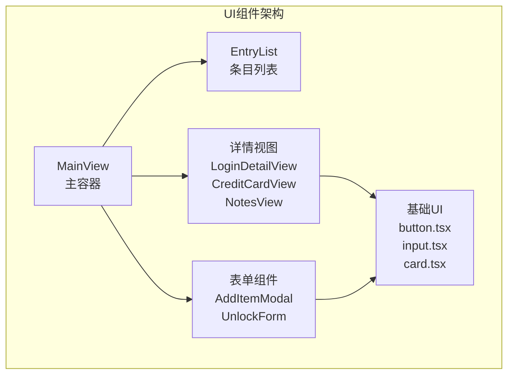
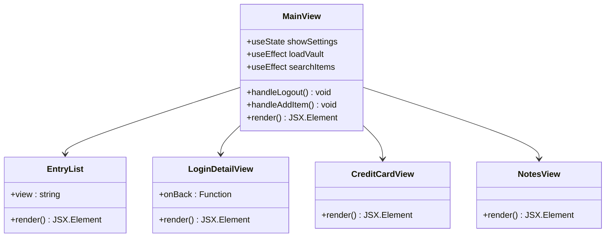
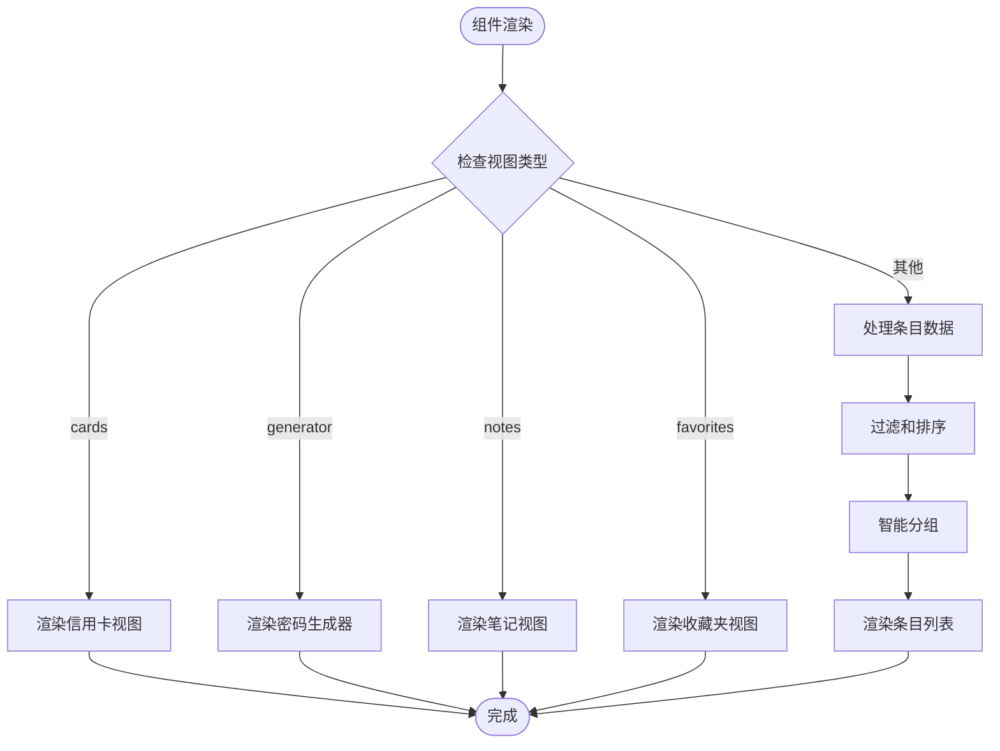
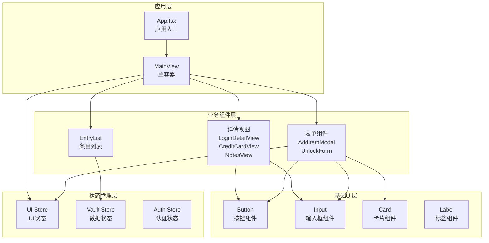
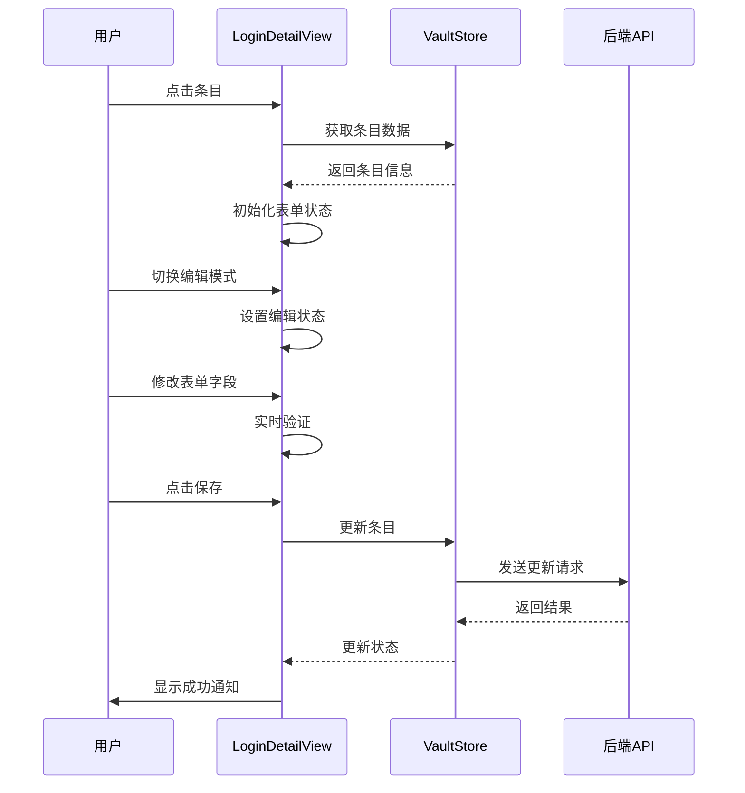
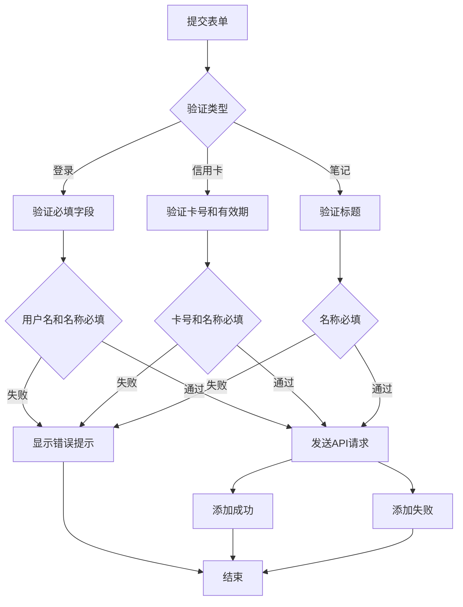
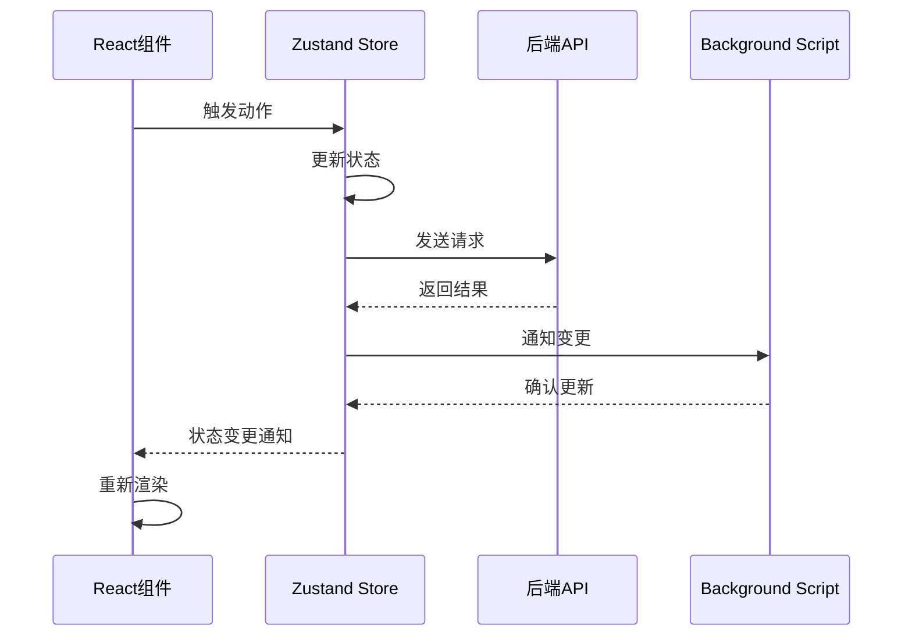

# UI组件架构

<cite>
**本文档中引用的文件**
- [MainView.tsx](file://extension/components/MainView.tsx)
- [EntryList.tsx](file://extension/components/EntryList.tsx)
- [LoginDetailView.tsx](file://extension/components/LoginDetailView.tsx)
- [CreditCardView.tsx](file://extension/components/CreditCardView.tsx)
- [NotesView.tsx](file://extension/components/NotesView.tsx)
- [AddItemModal.tsx](file://extension/components/AddItemModal.tsx)
- [UnlockForm.tsx](file://extension/components/UnlockForm.tsx)
- [button.tsx](file://extension/components/ui/button.tsx)
- [input.tsx](file://extension/components/ui/input.tsx)
- [card.tsx](file://extension/components/ui/card.tsx)
- [uiStore.ts](file://extension/store/uiStore.ts)
- [vaultStore.ts](file://extension/store/vaultStore.ts)
- [index.ts](file://extension/types/index.ts)
- [tailwind.config.js](file://extension/tailwind.config.js)
</cite>

## 目录
1. [概述](#概述)
2. [项目结构](#项目结构)
3. [核心组件](#核心组件)
4. [架构概览](#架构概览)
5. [详细组件分析](#详细组件分析)
6. [状态管理](#状态管理)
7. [响应式设计](#响应式设计)
8. [可访问性支持](#可访问性支持)
9. [性能考虑](#性能考虑)
10. [总结](#总结)

## 概述

SecureFox浏览器扩展采用现代化的React + TypeScript架构，专注于密码管理和安全存储。其UI组件系统基于Tailwind CSS构建，提供了完整的密码管理界面，包括主视图、详情视图、表单组件和基础UI元素。

## 项目结构

UI组件按照功能模块组织在`extension/components/`目录下：



**图表来源**
- [MainView.tsx](file://extension/components/MainView.tsx#L1-L237)
- [EntryList.tsx](file://extension/components/EntryList.tsx#L1-L308)

**章节来源**
- [MainView.tsx](file://extension/components/MainView.tsx#L1-L237)
- [EntryList.tsx](file://extension/components/EntryList.tsx#L1-L308)

## 核心组件

### MainView - 主容器组件

`MainView`是整个UI系统的根组件，负责协调各个子组件的渲染和状态管理。

#### 主要职责：
- **导航控制**：管理底部导航栏的视图切换
- **搜索功能**：集成全局搜索和过滤逻辑
- **模态管理**：控制添加项目的模态框显示
- **视图路由**：根据状态决定渲染哪个子视图

#### 组件树结构：


**图表来源**
- [MainView.tsx](file://extension/components/MainView.tsx#L13-L237)
- [EntryList.tsx](file://extension/components/EntryList.tsx#L15-L308)

### EntryList - 条目列表组件

`EntryList`负责渲染不同类型的密码条目列表，支持多种视图模式和搜索过滤。

#### 关键特性：
- **视图模式**：支持列表、最近使用、当前网站、收藏夹等视图
- **智能分组**：自动将当前网站匹配项与普通条目分组显示
- **搜索过滤**：实时搜索和过滤功能
- **交互功能**：支持复制、显示密码、收藏等功能

#### 渲染逻辑流程：


**图表来源**
- [EntryList.tsx](file://extension/components/EntryList.tsx#L121-L308)

**章节来源**
- [MainView.tsx](file://extension/components/MainView.tsx#L13-L237)
- [EntryList.tsx](file://extension/components/EntryList.tsx#L15-L308)

## 架构概览

SecureFox的UI架构采用分层设计，从底层的基础UI组件到顶层的应用组件：



**图表来源**
- [MainView.tsx](file://extension/components/MainView.tsx#L1-L237)
- [button.tsx](file://extension/components/ui/button.tsx#L1-L55)
- [input.tsx](file://extension/components/ui/input.tsx#L1-L24)

## 详细组件分析

### LoginDetailView - 登录详情视图

`LoginDetailView`提供登录信息的完整查看和编辑功能，支持多种交互操作。

#### 功能特性：
- **查看模式**：显示用户名、密码、TOTP、网址等详细信息
- **编辑模式**：支持表单编辑和实时验证
- **安全操作**：密码显示/隐藏、一键复制、2FA验证码
- **批量操作**：删除确认、取消编辑

#### 数据流图：


**图表来源**
- [LoginDetailView.tsx](file://extension/components/LoginDetailView.tsx#L15-L567)

### AddItemModal - 添加项目模态框

`AddItemModal`是一个多功能的表单组件，支持添加不同类型的安全条目。

#### 多类型支持：
- **登录凭据**：用户名、密码、TOTP、网址数组
- **信用卡信息**：持卡人姓名、卡号、有效期、CVV
- **安全笔记**：标题、内容

#### 表单验证流程：


**图表来源**
- [AddItemModal.tsx](file://extension/components/AddItemModal.tsx#L195-L302)

### 基础UI组件系统

SecureFox实现了标准化的基础UI组件，确保一致的用户体验。

#### Button组件特性：
- **变体支持**：默认、破坏性、轮廓、次要、Ghost、链接
- **尺寸变体**：默认、小、大、图标
- **可组合性**：支持asChild属性实现语义化标签

#### Input组件特性：
- **通用性**：继承原生input的所有属性
- **样式统一**：基于Tailwind CSS的统一样式
- **焦点状态**：支持聚焦时的视觉反馈

#### Card组件系统：
- **结构化布局**：头部、标题、描述、内容、底部
- **语义化**：每个部分都有明确的用途
- **可扩展**：支持自定义样式和内容

**章节来源**
- [LoginDetailView.tsx](file://extension/components/LoginDetailView.tsx#L15-L567)
- [AddItemModal.tsx](file://extension/components/AddItemModal.tsx#L1-L662)
- [button.tsx](file://extension/components/ui/button.tsx#L1-L55)
- [input.tsx](file://extension/components/ui/input.tsx#L1-L24)
- [card.tsx](file://extension/components/ui/card.tsx#L1-L78)

## 状态管理

SecureFox采用Zustand作为状态管理解决方案，实现了清晰的状态分离：

### UI状态管理
`useUIStore`管理用户界面相关的状态：
- **视图状态**：当前活跃视图、详情视图类型
- **模态状态**：添加项目模态框、设置面板
- **通知系统**：全局通知管理和自动消失
- **配置选项**：自动锁定时间等用户偏好

### 数据状态管理
`useVaultStore`管理密码库数据：
- **条目管理**：增删改查操作
- **搜索过滤**：实时搜索和过滤
- **文件夹管理**：未来扩展支持
- **计算属性**：收藏、最近使用等派生状态

### 状态同步机制：


**图表来源**
- [uiStore.ts](file://extension/store/uiStore.ts#L1-L135)
- [vaultStore.ts](file://extension/store/vaultStore.ts#L1-L233)

**章节来源**
- [uiStore.ts](file://extension/store/uiStore.ts#L1-L135)
- [vaultStore.ts](file://extension/store/vaultStore.ts#L1-L233)

## 响应式设计

SecureFox的UI完全基于Tailwind CSS构建，实现了优秀的响应式设计：

### 设计原则：
- **移动优先**：所有组件都针对移动端优化
- **弹性布局**：使用Flexbox和Grid实现灵活布局
- **断点适配**：基于Tailwind的响应式断点
- **触摸友好**：适当的触摸目标大小和间距

### 样式系统特点：
- **原子化CSS**：直接在组件中使用Tailwind类名
- **主题一致性**：统一的颜色系统和间距规范
- **动画效果**：平滑的过渡和交互动画
- **阴影层次**：合理的层级感和深度表现

### 响应式布局示例：
```typescript
// 移动端优化的按钮样式
className="h-10 w-10 rounded-lg flex items-center justify-center"

// 响应式间距系统
className="p-4 space-y-3 bg-gray-50"

// 导航栏的响应式设计
className="flex justify-around py-2"
```

**章节来源**
- [tailwind.config.js](file://extension/tailwind.config.js#L1-L70)

## 可访问性支持

SecureFox在UI设计中充分考虑了可访问性需求：

### 键盘导航支持：
- **焦点管理**：合理的tab顺序和焦点指示器
- **快捷键**：支持键盘快捷操作
- **ARIA标签**：适当的语义化标记

### 屏幕阅读器支持：
- **语义化HTML**：正确的HTML结构和标签
- **替代文本**：图片和图标都有适当的alt文本
- **状态通知**：通过通知系统告知屏幕阅读器用户状态变化

### 视觉辅助功能：
- **对比度**：足够的颜色对比度
- **字体大小**：可读的字体尺寸
- **高亮效果**：清晰的交互状态指示

## 性能考虑

### 组件优化策略：
- **懒加载**：详情视图按需渲染
- **记忆化**：使用useMemo优化计算密集型操作
- **防抖搜索**：搜索输入使用防抖减少API调用
- **虚拟滚动**：对于大量数据的列表使用虚拟滚动

### 状态管理优化：
- **细粒度更新**：只更新必要的状态
- **计算属性**：使用getters避免重复计算
- **异步操作**：合理处理异步数据加载

### 渲染性能：
- **条件渲染**：根据状态动态渲染组件
- **事件委托**：优化事件处理性能
- **CSS动画**：使用transform和opacity动画

## 总结

SecureFox的UI组件架构展现了现代Web应用的最佳实践：

### 技术亮点：
- **模块化设计**：清晰的组件分层和职责分离
- **类型安全**：完整的TypeScript类型定义
- **状态管理**：简洁高效的Zustand状态管理
- **样式系统**：强大的Tailwind CSS集成

### 用户体验优势：
- **一致性**：统一的设计语言和交互模式
- **响应性**：流畅的动画和过渡效果
- **可访问性**：全面的无障碍支持
- **性能**：优化的渲染和状态管理

### 架构优势：
- **可维护性**：清晰的代码结构和命名约定
- **可扩展性**：模块化设计便于功能扩展
- **测试友好**：组件化的结构便于单元测试
- **开发效率**：丰富的基础UI组件提高开发速度

这个UI架构为SecureFox提供了坚实的技术基础，支持其作为专业密码管理工具的功能需求，同时保持了良好的用户体验和开发可维护性。