# SecureFox浏览器扩展文档

<cite>
**本文档中引用的文件**
- [MainView.tsx](file://extension/components/MainView.tsx)
- [EntryList.tsx](file://extension/components/EntryList.tsx)
- [LoginDetailView.tsx](file://extension/components/LoginDetailView.tsx)
- [App.tsx](file://extension/entrypoints/popup/App.tsx)
- [content.ts](file://extension/entrypoints/content.ts)
- [background.ts](file://extension/entrypoints/background.ts)
- [CredentialMenu.ts](file://extension/entrypoints/content/CredentialMenu.ts)
- [authStore.ts](file://extension/store/authStore.ts)
- [vaultStore.ts](file://extension/store/vaultStore.ts)
- [uiStore.ts](file://extension/store/uiStore.ts)
- [constants.ts](file://extension/utils/constants.ts)
- [index.ts](file://extension/types/index.ts)
- [wxt.config.ts](file://extension/wxt.config.ts)
- [package.json](file://extension/package.json)
</cite>

## 目录
1. [简介](#简介)
2. [项目结构](#项目结构)
3. [核心组件架构](#核心组件架构)
4. [状态管理系统](#状态管理系统)
5. [扩展入口点](#扩展入口点)
6. [自动填充功能](#自动填充功能)
7. [UI组件树](#ui组件树)
8. [状态流分析](#状态流分析)
9. [技术栈](#技术栈)
10. [总结](#总结)

## 简介

SecureFox是一个现代化的本地优先密码管理器浏览器扩展，采用React和TypeScript构建，使用Zustand进行状态管理。该扩展提供了直观的用户界面，支持自动填充、密码生成和Git同步等功能。

## 项目结构

SecureFox扩展采用模块化架构，主要分为以下几个部分：

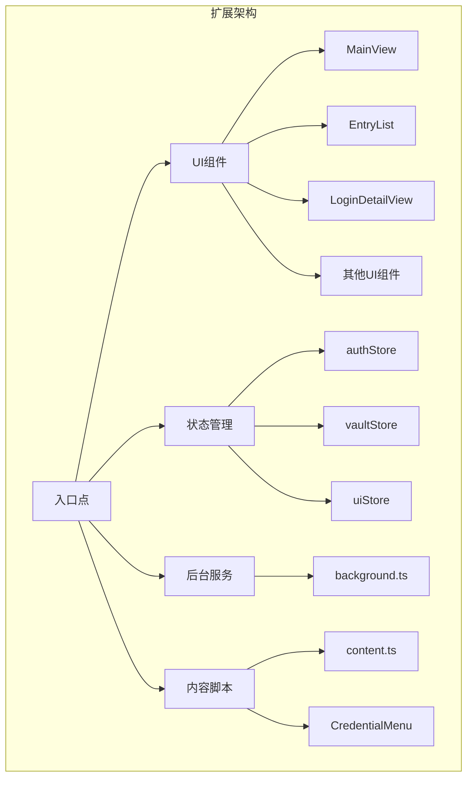

**图表来源**
- [App.tsx](file://extension/entrypoints/popup/App.tsx#L1-L31)
- [MainView.tsx](file://extension/components/MainView.tsx#L1-L237)

**章节来源**
- [wxt.config.ts](file://extension/wxt.config.ts#L1-L43)
- [package.json](file://extension/package.json#L1-L47)

## 核心组件架构

### MainView - 主视图组件

`MainView`是扩展的主要界面组件，负责协调整个应用的布局和导航：

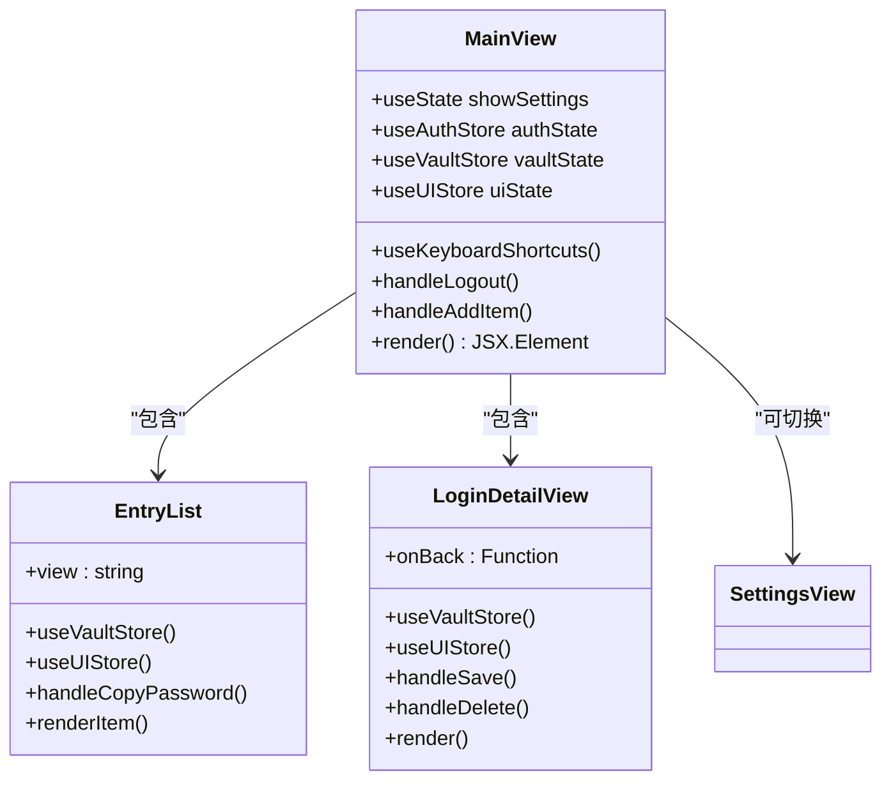

**图表来源**
- [MainView.tsx](file://extension/components/MainView.tsx#L13-L237)
- [EntryList.tsx](file://extension/components/EntryList.tsx#L15-L308)
- [LoginDetailView.tsx](file://extension/components/LoginDetailView.tsx#L15-L567)

### 组件职责分工

| 组件 | 职责 | 主要功能 |
|------|------|----------|
| MainView | 主界面控制器 | 导航、设置、搜索、底部标签栏 |
| EntryList | 列表展示 | 登录项、信用卡、笔记的列表显示 |
| LoginDetailView | 详情页 | 单个登录项的详细信息查看和编辑 |
| SettingsView | 设置界面 | 用户偏好设置和系统配置 |
| AddItemModal | 添加对话框 | 新建密码项的模态框 |

**章节来源**
- [MainView.tsx](file://extension/components/MainView.tsx#L1-L237)
- [EntryList.tsx](file://extension/components/EntryList.tsx#L1-L308)
- [LoginDetailView.tsx](file://extension/components/LoginDetailView.tsx#L1-L567)

## 状态管理系统

SecureFox使用Zustand作为状态管理解决方案，实现了三个核心存储：

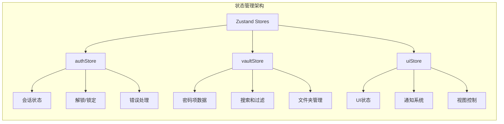

**图表来源**
- [authStore.ts](file://extension/store/authStore.ts#L1-L157)
- [vaultStore.ts](file://extension/store/vaultStore.ts#L1-L233)
- [uiStore.ts](file://extension/store/uiStore.ts#L1-L135)

### authStore - 认证状态管理

负责处理用户的认证状态和会话管理：

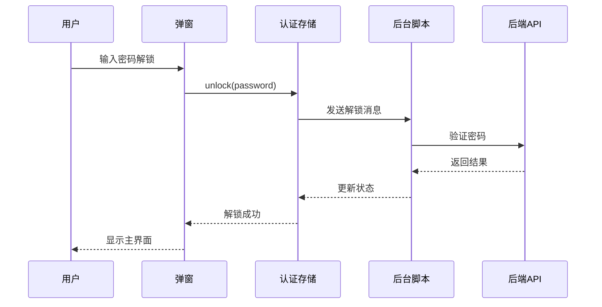

**图表来源**
- [authStore.ts](file://extension/store/authStore.ts#L31-L70)
- [background.ts](file://extension/entrypoints/background.ts#L105-L111)

### vaultStore - 密码库状态管理

管理所有的密码项和相关操作：

| 功能类别 | 方法 | 描述 |
|----------|------|------|
| 数据加载 | `loadVault()` | 从后端获取所有密码项 |
| 搜索过滤 | `searchItems(query)` | 根据关键词过滤密码项 |
| CRUD操作 | `addItem()`, `updateItem()`, `deleteItem()` | 创建、更新、删除密码项 |
| 文件夹管理 | `selectFolder()` | 选择特定文件夹显示 |
| 计算属性 | `filteredItems`, `favoriteItems`, `recentItems` | 计算派生状态 |

**章节来源**
- [vaultStore.ts](file://extension/store/vaultStore.ts#L1-L233)

### uiStore - UI状态管理

处理用户界面相关的状态：

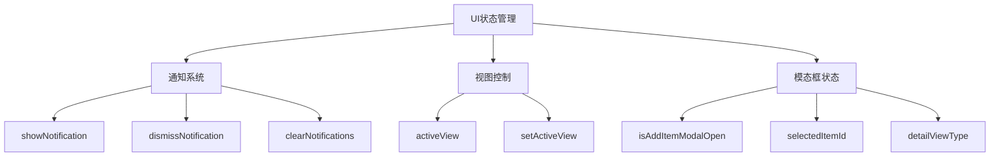

**图表来源**
- [uiStore.ts](file://extension/store/uiStore.ts#L32-L128)

**章节来源**
- [uiStore.ts](file://extension/store/uiStore.ts#L1-L135)

## 扩展入口点

SecureFox扩展有四个主要的入口点，每个都有特定的职责：

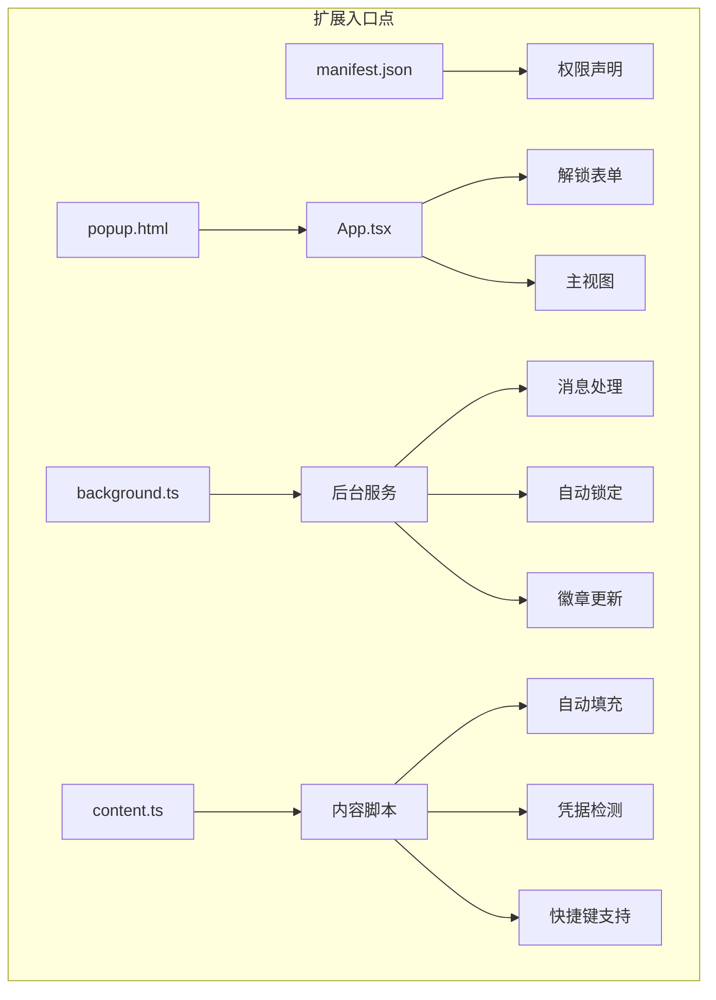

**图表来源**
- [App.tsx](file://extension/entrypoints/popup/App.tsx#L1-L31)
- [background.ts](file://extension/entrypoints/background.ts#L1-L386)
- [content.ts](file://extension/entrypoints/content.ts#L1-L741)

### popup.html - 主弹窗入口

弹窗是用户与扩展交互的主要界面：

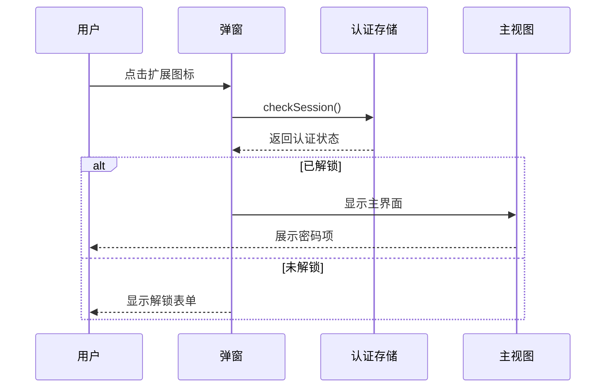

**图表来源**
- [App.tsx](file://extension/entrypoints/popup/App.tsx#L8-L30)

### background.ts - 后台服务

后台脚本处理扩展的核心业务逻辑：

| 功能 | 实现方式 | 触发条件 |
|------|----------|----------|
| 自动锁定 | 定时器机制 | 用户活动后重置计时器 |
| 徽章更新 | 标签页URL变化监听 | 页面加载时检查匹配项 |
| 消息路由 | runtime.onMessage监听 | 来自popup和content的消息 |
| 上下文菜单 | contextMenus API | 右键点击可编辑区域 |
| 浏览器启动 | runtime.onStartup监听 | 浏览器重启时恢复状态 |

**章节来源**
- [background.ts](file://extension/entrypoints/background.ts#L1-L386)

### content.ts - 内容脚本

内容脚本运行在网页环境中，提供自动填充功能：

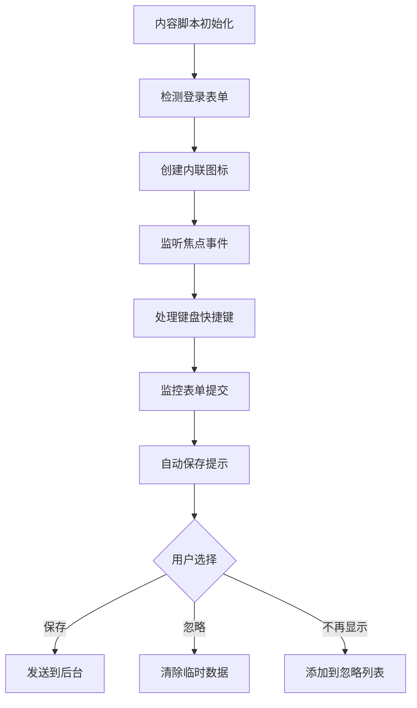

**图表来源**
- [content.ts](file://extension/entrypoints/content.ts#L684-L741)

**章节来源**
- [content.ts](file://extension/entrypoints/content.ts#L1-L741)

## 自动填充功能

SecureFox的自动填充功能通过复杂的协作机制实现：

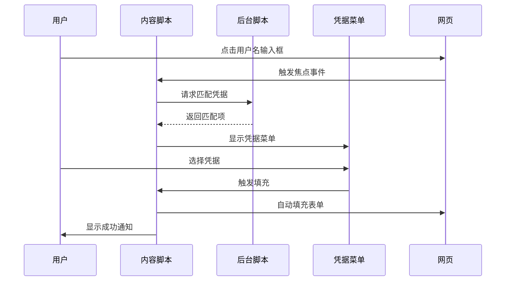

**图表来源**
- [content.ts](file://extension/entrypoints/content.ts#L121-L160)
- [CredentialMenu.ts](file://extension/entrypoints/content/CredentialMenu.ts#L1-L432)

### CredentialMenu - 凭据选择菜单

凭据菜单提供了用户友好的凭据选择界面：

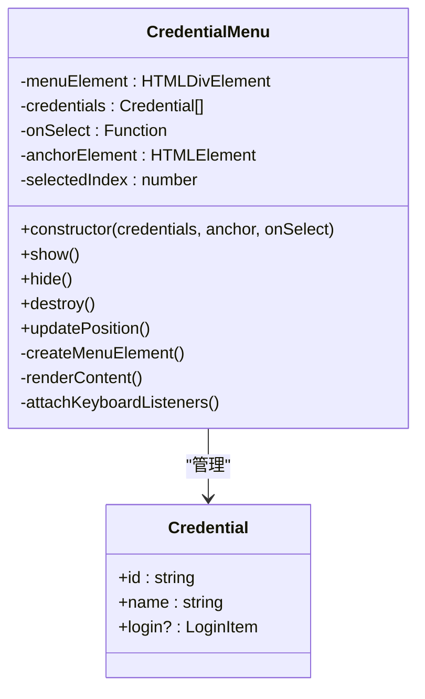

**图表来源**
- [CredentialMenu.ts](file://extension/entrypoints/content/CredentialMenu.ts#L15-L432)

### 自动填充流程

自动填充功能的工作流程如下：

1. **凭据检测**：扫描页面中的登录表单
2. **匹配算法**：根据域名和URL模式匹配凭据
3. **用户交互**：显示凭据菜单供用户选择
4. **表单填充**：自动填充用户名和密码字段
5. **TOTP处理**：处理双因素认证验证码

**章节来源**
- [content.ts](file://extension/entrypoints/content.ts#L168-L218)
- [CredentialMenu.ts](file://extension/entrypoints/content/CredentialMenu.ts#L1-L432)

## UI组件树

SecureFox的UI组件层次结构体现了清晰的职责分离：

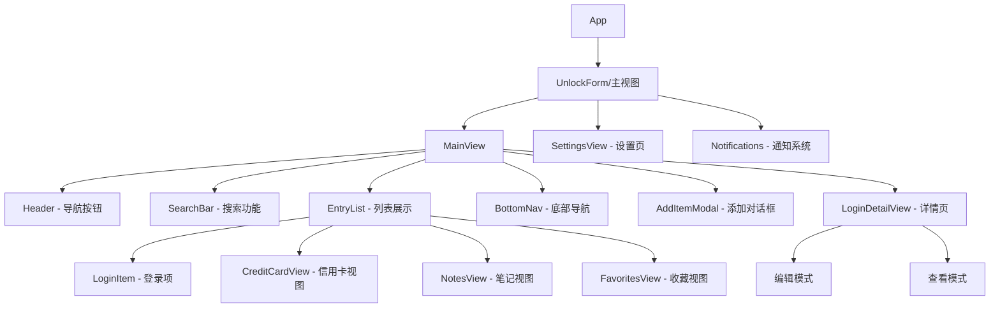

**图表来源**
- [App.tsx](file://extension/entrypoints/popup/App.tsx#L8-L30)
- [MainView.tsx](file://extension/components/MainView.tsx#L72-L236)

### 组件通信模式

| 通信方式 | 使用场景 | 实现方法 |
|----------|----------|----------|
| Props传递 | 父子组件通信 | React组件属性 |
| Zustand状态 | 全局状态共享 | Store订阅 |
| 消息传递 | 扩展各部分通信 | chrome.runtime.sendMessage |
| 事件监听 | DOM事件处理 | addEventListener |

**章节来源**
- [MainView.tsx](file://extension/components/MainView.tsx#L1-L237)
- [EntryList.tsx](file://extension/components/EntryList.tsx#L1-L308)

## 状态流分析

SecureFox的状态流设计遵循单向数据流原则：

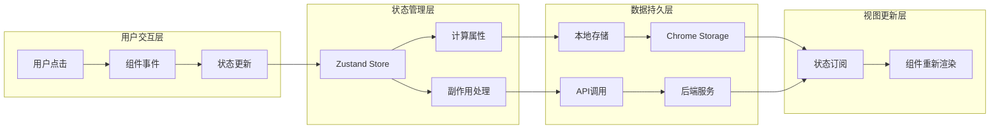

**图表来源**
- [authStore.ts](file://extension/store/authStore.ts#L22-L157)
- [vaultStore.ts](file://extension/store/vaultStore.ts#L36-L233)

### 状态更新流程

1. **用户操作触发**：用户点击按钮或输入表单
2. **组件响应**：调用相应的状态更新函数
3. **状态变更**：Zustand store执行状态更新
4. **副作用执行**：处理异步操作和API调用
5. **视图更新**：订阅状态的组件重新渲染

**章节来源**
- [uiStore.ts](file://extension/store/uiStore.ts#L32-L128)

## 技术栈

SecureFox采用了现代Web技术栈：

| 技术 | 版本 | 用途 |
|------|------|------|
| React | ^19.1.1 | UI框架 |
| TypeScript | ^5.9.2 | 类型安全 |
| Zustand | ^4.4.0 | 状态管理 |
| Tailwind CSS | ^3.3.0 | 样式框架 |
| WXT | ^0.20.6 | 扩展开发框架 |
| Lucide React | ^0.294.0 | 图标库 |
| Axios | ^1.6.0 | HTTP客户端 |

### 构建工具链

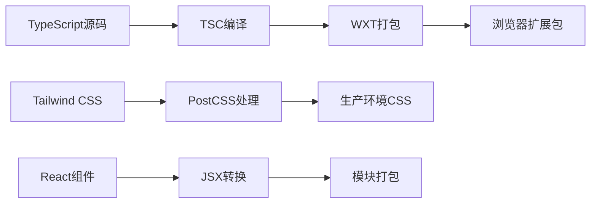

**图表来源**
- [package.json](file://extension/package.json#L18-L28)
- [wxt.config.ts](file://extension/wxt.config.ts#L1-L43)

**章节来源**
- [package.json](file://extension/package.json#L1-L47)
- [wxt.config.ts](file://extension/wxt.config.ts#L1-L43)

## 总结

SecureFox浏览器扩展展现了现代Web扩展开发的最佳实践：

### 架构优势

1. **模块化设计**：清晰的组件分离和职责划分
2. **状态管理**：使用Zustand实现轻量级但强大的状态管理
3. **响应式UI**：基于React的高效组件更新机制
4. **安全性**：本地优先的数据存储和传输
5. **用户体验**：流畅的自动填充和直观的界面设计

### 技术特色

- **现代化技术栈**：React 19、TypeScript、Tailwind CSS
- **MV3兼容性**：符合Chrome扩展最新规范
- **性能优化**：懒加载、防抖、记忆化计算
- **可维护性**：清晰的代码结构和类型定义

SecureFox为用户提供了安全、便捷的密码管理体验，同时展示了现代浏览器扩展开发的技术深度和广度。